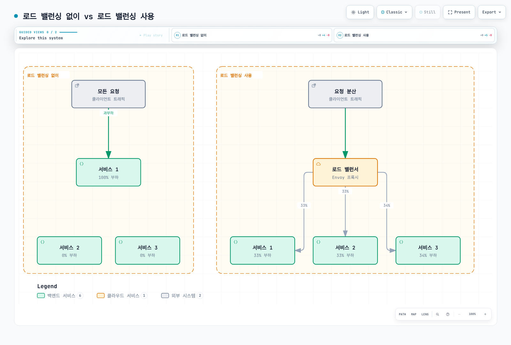
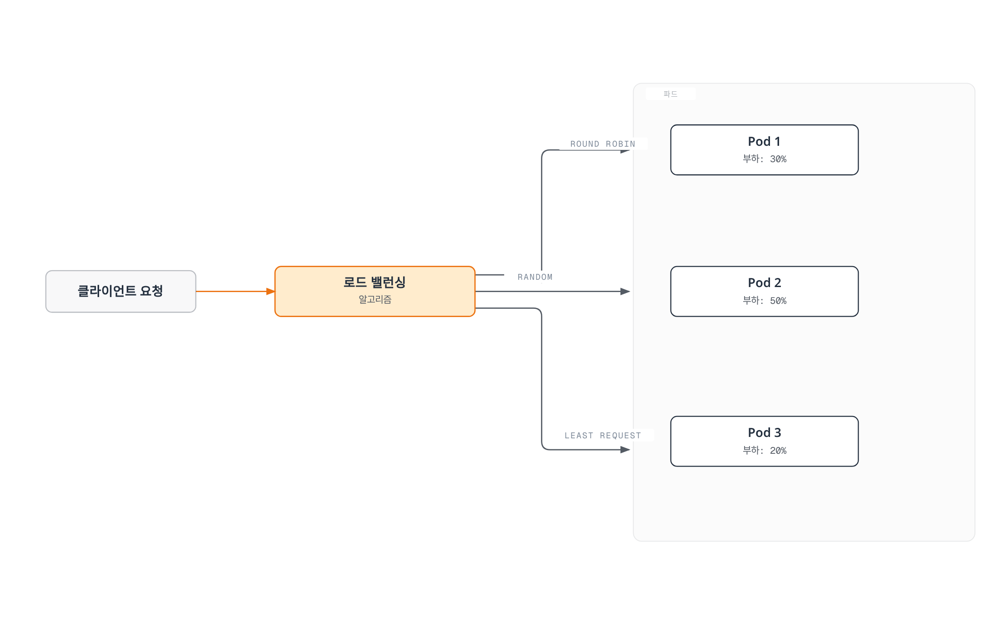
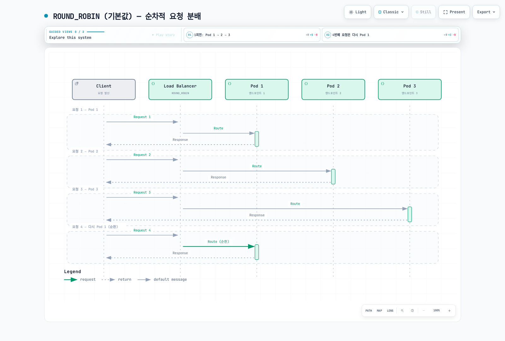
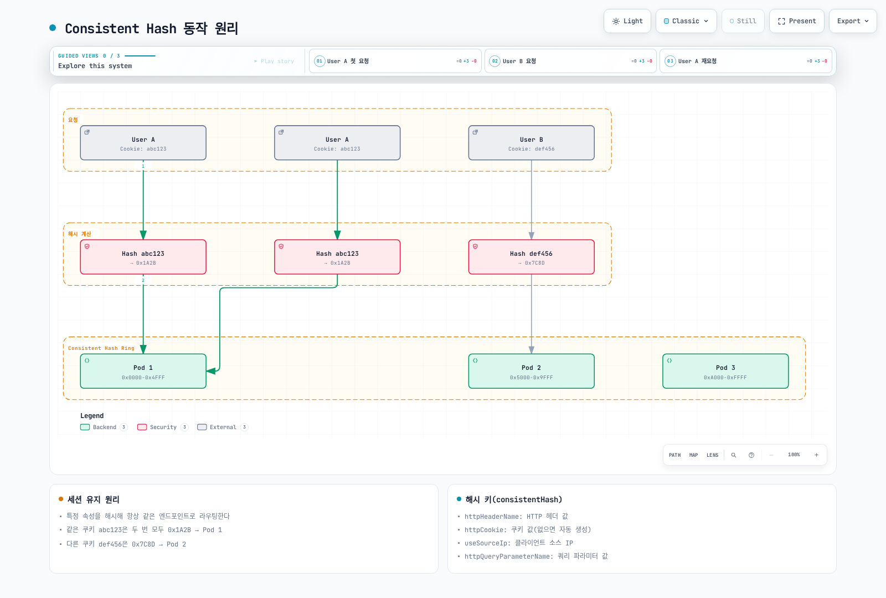
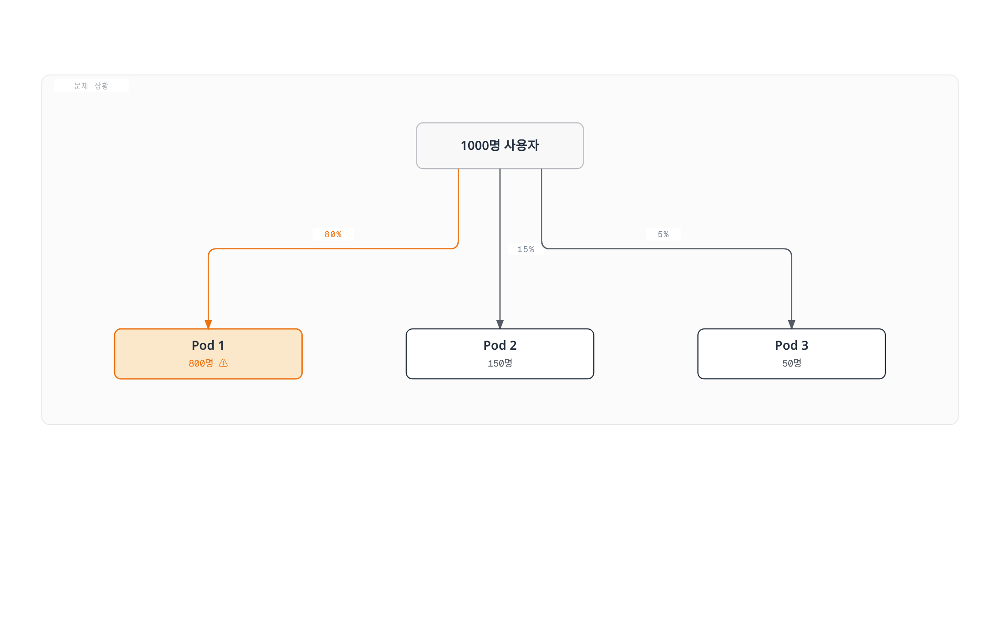

# 로드 밸런싱

Istio는 Envoy를 통해 다양한 로드 밸런싱 알고리즘을 제공하여 트래픽을 효율적으로 분산시킵니다.

## 목차

1. [Why Load Balancing?](#why-load-balancing)
2. [로드 밸런싱 개요](#로드-밸런싱-개요)
3. [로드 밸런싱 알고리즘](#로드-밸런싱-알고리즘)
4. [Consistent Hash 상세](#consistent-hash-상세)
5. [Locality 기반 로드 밸런싱](#locality-기반-로드-밸런싱)
6. [Connection Pool 설정](#connection-pool-설정)
7. [실전 예제](#실전-예제)
8. [알고리즘 선택 가이드](#알고리즘-선택-가이드)
9. [모범 사례](#모범-사례)
10. [문제 해결](#문제-해결)

## Why Load Balancing?

### 효율적인 리소스 활용

로드 밸런싱은 트래픽을 여러 인스턴스에 분산시켜 시스템 전체의 처리량과 안정성을 향상시킵니다.



[🔍 인터랙티브 다이어그램 보기](https://www.atomai.click/kubernetes-docs/archmaps/ko-service-mesh-istio-traffic-management-06-load-balancing-0.html)

### 주요 이점

| 문제 | 로드 밸런싱 없이 | 로드 밸런싱 사용 |
|------|-----------------|----------------|
| **가용성** | 단일 장애점 (SPOF) | 장애 시 자동 우회 |
| **성능** | 특정 인스턴스 과부하 | 균등한 부하 분산 |
| **확장성** | 수평 확장 어려움 | 쉬운 스케일 아웃 |
| **응답 시간** | 불균일 (0-1000ms+) | 일관된 응답 시간 |
| **리소스 활용** | 비효율 (일부만 사용) | 효율적 리소스 활용 |

## 로드 밸런싱 개요



[🔍 인터랙티브 다이어그램 보기](https://www.atomai.click/kubernetes-docs/archmaps/ko-service-mesh-istio-traffic-management-06-load-balancing-1.html)

## 로드 밸런싱 알고리즘

Istio 1.31.0 릴리스의 기본값은 LEAST_REQUEST입니다. 각 예제는 독립적인 DestinationRule이며 같은 호스트에 모두 적용할 구성이 아닙니다. 엔드포인트 상태, 요청 비용, 연결 재사용, 프록시 locality에 따라 결과가 달라지며 동일 CPU 부하나 일정한 지연을 보장하지 않습니다. consistentHash는 별도 구성 분기이며 simple: CONSISTENT_HASH라는 enum 값은 없습니다.

Istio는 다음과 같은 로드 밸런싱 알고리즘을 제공합니다.

### 알고리즘 비교

| 알고리즘 | 설명 | 사용 시나리오 | 장점 | 단점 |
|---------|------|-------------|------|-----|
| **ROUND_ROBIN** | 순차적 분배 (명시적 옵션) | 스테이트리스 서비스 | 간단, 공평 | 부하 불균형 가능 |
| **LEAST_REQUEST** | 최소 활성 요청 | 고성능 API, DB 연결 | 부하 균등화 | 약간의 오버헤드 |
| **RANDOM** | 무작위 분배 | 대량 트래픽 | 간단, 빠름 | 단기 불균형 가능 |
| **PASSTHROUGH** | 원본 목적지 | TCP 프록시, SNI 라우팅 | 유연성 | 제한적 제어 |
| **CONSISTENT_HASH** | 해시 기반 고정 | 세션 유지, 캐시 | Sticky 세션 | 불균형 가능 |

### 1. ROUND_ROBIN

요청을 순차적으로 각 엔드포인트에 분배합니다.



[🔍 인터랙티브 다이어그램 보기](https://www.atomai.click/kubernetes-docs/archmaps/ko-service-mesh-istio-traffic-management-06-load-balancing-2.html)

**설정 예제:**

```yaml
apiVersion: networking.istio.io/v1
kind: DestinationRule
metadata:
  name: reviews-round-robin
spec:
  host: reviews
  trafficPolicy:
    loadBalancer:
      simple: ROUND_ROBIN
```

**사용 사례:**
- 스테이트리스 REST API
- 동일한 성능을 가진 파드
- 기본 설정으로 충분한 경우

**장점:**
- 구현이 간단하고 예측 가능
- 공평한 분배

**단점:**
- 파드별 부하 차이를 고려하지 않음
- 긴 요청이 있으면 불균형 발생 가능

### 2. LEAST_REQUEST (기본값)

가중치가 같은 엔드포인트에서는 Envoy가 보통 사용 가능한 호스트 두 개를 뽑아 활성 요청이 적은 쪽을 선택합니다. 모든 파드를 순회하거나 CPU/DB 쿼리 부하를 측정하지 않습니다. 가중치가 다르면 별도의 가중 알고리즘을 사용합니다.

동일 가중치의 기본 LEAST_REQUEST는 무작위 후보 두 개 중 활성 요청이 적은 엔드포인트를 선택합니다.

**설정 예제:**

```yaml
apiVersion: networking.istio.io/v1
kind: DestinationRule
metadata:
  name: api-least-request
spec:
  host: api-service
  trafficPolicy:
    loadBalancer:
      simple: LEAST_REQUEST
      warmup:
        duration: 60s  # 60초 워밍업 (선택)
```

**고급 설정:**

```yaml
apiVersion: networking.istio.io/v1
kind: DestinationRule
metadata:
  name: api-least-request-advanced
spec:
  host: api-service
  trafficPolicy:
    loadBalancer:
      simple: LEAST_REQUEST
      warmup:
        duration: 120s  # 새 파드 워밍업
    connectionPool:
      http:
        http2MaxRequests: 100
        maxRequestsPerConnection: 10
```

**사용 사례:**
- 응답 시간이 불균일한 API
- 데이터베이스 연결 풀
- 무거운 처리를 하는 서비스
- 실시간 부하 균형이 중요한 경우

**장점:**
- 실시간 부하에 따라 적응
- 응답 시간 일관성 향상
- 파드별 성능 차이 흡수

**단점:**
- 약간의 오버헤드 (활성 요청 추적)

### 3. RANDOM

무작위로 엔드포인트를 선택합니다.

```yaml
apiVersion: networking.istio.io/v1
kind: DestinationRule
metadata:
  name: reviews-random
spec:
  host: reviews
  trafficPolicy:
    loadBalancer:
      simple: RANDOM
```

**사용 사례:**
- 대량의 트래픽 (통계적으로 균등)
- 간단하고 빠른 선택이 필요한 경우
- 파드 성능이 동일한 경우

**장점:**
- 매우 빠른 선택
- 구현이 간단
- 대규모에서 통계적으로 균등

**단점:**
- 단기적으로 불균형 가능
- 예측 불가능

### 4. PASSTHROUGH

클라이언트가 지정한 원본 목적지로 직접 연결합니다.

```yaml
apiVersion: networking.istio.io/v1
kind: DestinationRule
metadata:
  name: tcp-passthrough
spec:
  host: "*.external-service.com"
  trafficPolicy:
    loadBalancer:
      simple: PASSTHROUGH
```

**사용 사례:**
- TCP 프록시
- SNI 기반 라우팅
- 외부 서비스 직접 연결
- TLS PASSTHROUGH 모드

**장점:**
- 원본 목적지 주소 유지
- 유연한 라우팅

**단점:**
- 로드 밸런싱 제어 제한적

DestinationRule PASSTHROUGH는 원래 목적지 기반 로드 밸런싱입니다. Gateway tls.mode: PASSTHROUGH는 TLS 종료에 관한 별도 설정이며 SNI 라우팅에는 TLS VirtualService 규칙이 필요합니다.

### 5. LEAST_CONN (Deprecated → LEAST_REQUEST)

**주의**: `LEAST_CONN`은 **deprecated**되었으며, `LEAST_REQUEST`로 대체되었습니다.

**마이그레이션:**
```yaml
# ❌ 구버전 (deprecated)
trafficPolicy:
  loadBalancer:
    simple: LEAST_CONN
```

```yaml
# ✅ 신규 버전
trafficPolicy:
  loadBalancer:
    simple: LEAST_REQUEST
```

## Consistent Hash 상세

Consistent Hash는 엔드포인트 정보가 안정적일 때 같은 키에 느슨한 친화성을 제공합니다. 엔드포인트 추가·삭제, 상태 변화, locality 차이에 따라 대상이 바뀔 수 있으며 영구 세션 저장소가 아닙니다.

### Consistent Hash 동작 원리



[🔍 인터랙티브 다이어그램 보기](https://www.atomai.click/kubernetes-docs/archmaps/ko-service-mesh-istio-traffic-management-06-load-balancing-4.html)

### 1. HTTP Header 기반

특정 HTTP 헤더 값으로 해시를 계산합니다.

```yaml
apiVersion: networking.istio.io/v1
kind: DestinationRule
metadata:
  name: user-hash
spec:
  host: api-service
  trafficPolicy:
    loadBalancer:
      consistentHash:
        httpHeaderName: "x-user-id"
```

**사용 사례:**
- 사용자별 세션 유지
- API 키 기반 라우팅
- 테넌트 키 친화성; 격리는 별도 집행

### 2. HTTP Cookie 기반

쿠키 값으로 해시를 계산하며, 쿠키가 없으면 자동 생성합니다.

```yaml
apiVersion: networking.istio.io/v1
kind: DestinationRule
metadata:
  name: cookie-hash
spec:
  host: web-service
  trafficPolicy:
    loadBalancer:
      consistentHash:
        httpCookie:
          name: "user-session"
          ttl: 3600s  # 1시간 TTL
```

**사용 사례:**
- 웹 애플리케이션 세션 유지
- 쇼핑 카트 유지
- 사용자 경험 일관성

### 3. Source IP 기반

클라이언트의 소스 IP 주소로 해시를 계산합니다.

```yaml
apiVersion: networking.istio.io/v1
kind: DestinationRule
metadata:
  name: source-ip-hash
spec:
  host: api-service
  trafficPolicy:
    loadBalancer:
      consistentHash:
        useSourceIp: true
```

**사용 사례:**
- IP 기반 세션 유지
- 외부 IP별 제한기의 친화성; 해싱 자체가 속도 제한을 집행하지 않음
- 지역별 캐시

**주의사항:**
- NAT 뒤에 있는 클라이언트는 같은 파드로 라우팅될 수 있음
- 프록시 사용 시 실제 클라이언트 IP를 확인해야 함

### 4. HTTP Query Parameter 기반

쿼리 파라미터 값으로 해시를 계산합니다.

```yaml
apiVersion: networking.istio.io/v1
kind: DestinationRule
metadata:
  name: query-param-hash
spec:
  host: api-service
  trafficPolicy:
    loadBalancer:
      consistentHash:
        httpQueryParameterName: "user_id"
```

**사용 사례:**
- RESTful API에서 리소스 ID 기반 라우팅
- 캐시 친화적 라우팅
- 샤딩 전략

### 5. Minimum Ring Size 설정

링의 가상 노드 수를 조정해 서로 다른 키의 분포를 개선합니다. 재매핑이나 hot key를 없애지는 않습니다.

```yaml
apiVersion: networking.istio.io/v1
kind: DestinationRule
metadata:
  name: hash-with-ring-size
spec:
  host: cache-service
  trafficPolicy:
    loadBalancer:
      consistentHash:
        httpHeaderName: "x-cache-key"
        ringHash:
          minimumRingSize: 1024  # 기본값: 1024
```

**설명:**
- Ring size가 클수록 더 균등한 분배
- 엔드포인트 변경 시 재매핑 비율 감소를 보장하지 않음
- 메모리 사용량 약간 증가

**벤치마크할 예시 값 (공통 용량 기준이 아님):**
- 소규모 (< 10 파드): 1024 (기본값)
- 중규모 (10-50 파드): 2048
- 대규모 (50+ 파드): 4096

### Consistent Hash 조합 예제

```yaml
apiVersion: networking.istio.io/v1
kind: DestinationRule
metadata:
  name: advanced-consistent-hash
spec:
  host: api-service
  trafficPolicy:
    loadBalancer:
      consistentHash:
        httpCookie:
          name: "session-id"
          path: "/api"
          ttl: 7200s  # 2시간
        ringHash:
          minimumRingSize: 2048
    connectionPool:
      http:
        maxRequestsPerConnection: 100
        idleTimeout: 300s
```

### Consistent Hash 주의사항

#### 1. 불균형 위험



[🔍 인터랙티브 다이어그램 보기](https://www.atomai.click/kubernetes-docs/archmaps/ko-service-mesh-istio-traffic-management-06-load-balancing-5.html)

**원인**: 특정 해시 값에 트래픽이 집중되는 경우

**해결책:**
- 서로 다른 키의 분포 문제일 때 ringHash.minimumRingSize 조정; 단일 hot key는 여전히 한 호스트로 감
- 여러 해시 키 조합 사용
- Envoy는 hash_balance_factor로 bounded-load hashing 지원; Istio DestinationRule에는 직접 노출되지 않음

#### 2. 파드 추가/제거 시 재분배

```yaml
# 파드 스케일 아웃 시
# - 기존: Pod 1, Pod 2, Pod 3
# - 신규: Pod 1, Pod 2, Pod 3, Pod 4
# - 결과: ~25%의 세션이 다른 파드로 재분배됨
```

**대응 방안:**
- Graceful shutdown 활용
- 세션 외부 저장소 사용 (Redis, Memcached)
- 서서히 스케일 조정

## Locality 기반 로드 밸런싱

같은 locality 설정에서 distribute 비율과 명시적 failover 중 하나를 사용하며 둘을 함께 넣지 마세요. 장애 조치에는 상태 감지와 연결 가능한 정상 엔드포인트가 필요합니다. 리전/존 레이블은 토폴로지이며 실측 거리가 아닙니다. DestinationRule이 리전 간 네트워크나 서비스 디스커버리를 생성하지는 않으므로 EKS의 실제 노드 topology 값을 사용하세요.

Locality-based Load Balancing은 지리적으로 가까운 엔드포인트를 우선적으로 사용합니다.

### 기본 Locality 설정

```yaml
apiVersion: networking.istio.io/v1
kind: DestinationRule
metadata:
  name: locality-lb
spec:
  host: reviews
  trafficPolicy:
    loadBalancer:
      localityLbSetting:
        enabled: true
```

### Locality 분배 비율 설정

```yaml
apiVersion: networking.istio.io/v1
kind: DestinationRule
metadata:
  name: locality-distribute
spec:
  host: reviews
  trafficPolicy:
    loadBalancer:
      localityLbSetting:
        enabled: true
        distribute:
        - from: us-west/zone-1/*
          to:
            "us-west/zone-1/*": 80  # 80%는 같은 zone
            "us-west/zone-2/*": 20  # 20%는 다른 zone
```

### Locality Failover

한 지역이 실패하면 다른 지역으로 자동 전환합니다.

```yaml
apiVersion: networking.istio.io/v1
kind: DestinationRule
metadata:
  name: locality-failover
spec:
  host: api-service
  trafficPolicy:
    loadBalancer:
      localityLbSetting:
        enabled: true
        failover:
        - from: us-west
          to: us-east
    outlierDetection:
      consecutive5xxErrors: 5
      interval: 5s
      baseEjectionTime: 30s
```

### Multi-Region 예제

```yaml
apiVersion: networking.istio.io/v1
kind: DestinationRule
metadata:
  name: global-service-locality
spec:
  host: global-api
  trafficPolicy:
    loadBalancer:
      simple: LEAST_REQUEST
      localityLbSetting:
        enabled: true
        distribute:
        # US West 클라이언트
        - from: us-west/*
          to:
            "us-west/*": 90      # 90% 로컬
            "us-east/*": 10      # 10% 원격 (DR)
        # US East 클라이언트
        - from: us-east/*
          to:
            "us-east/*": 90
            "us-west/*": 10
    outlierDetection:
      consecutive5xxErrors: 5
      interval: 30s
      baseEjectionTime: 30s
```

**사용 사례:**
- Multi-region 배포
- 지연 시간 최소화
- 리전 간 장애 복구
- 비용 최적화 (같은 AZ 통신)

## Connection Pool 설정

로드 밸런싱과 함께 Connection Pool을 설정하여 성능을 최적화합니다.

### HTTP/1.1 Connection Pool

```yaml
apiVersion: networking.istio.io/v1
kind: DestinationRule
metadata:
  name: http1-connection-pool
spec:
  host: api-service
  trafficPolicy:
    loadBalancer:
      simple: LEAST_REQUEST
    connectionPool:
      tcp:
        maxConnections: 100        # 최대 연결 수
        connectTimeout: 3s         # 연결 타임아웃
      http:
        http1MaxPendingRequests: 50  # 대기 요청 수
        maxRequestsPerConnection: 100 # 연결당 최대 요청
        idleTimeout: 300s             # 유휴 연결 타임아웃
```

### HTTP/2 Connection Pool

```yaml
apiVersion: networking.istio.io/v1
kind: DestinationRule
metadata:
  name: http2-connection-pool
spec:
  host: grpc-service
  trafficPolicy:
    loadBalancer:
      simple: LEAST_REQUEST
    connectionPool:
      tcp:
        maxConnections: 50
      http:
        http2MaxRequests: 1000     # HTTP/2 동시 요청
        maxRequestsPerConnection: 0 # 무제한 (HTTP/2 멀티플렉싱)
        h2UpgradePolicy: UPGRADE    # HTTP/2 업그레이드 허용
```

## 실전 예제

### 예제 1: 고성능 API 서비스

```yaml
apiVersion: networking.istio.io/v1
kind: DestinationRule
metadata:
  name: api-high-performance
  namespace: production
spec:
  host: api-service
  trafficPolicy:
    loadBalancer:
      simple: LEAST_REQUEST
      warmup:
        duration: 60s  # 새 파드 워밍업
    connectionPool:
      tcp:
        maxConnections: 200
        connectTimeout: 5s
      http:
        http2MaxRequests: 500
        maxRequestsPerConnection: 100
        idleTimeout: 300s
    outlierDetection:
      consecutive5xxErrors: 5
      interval: 30s
      baseEjectionTime: 30s
      maxEjectionPercent: 50
```

**사용 시나리오:**
- 고성능 REST API
- 응답 시간이 불균일한 요청
- 파드별 성능 차이가 있는 환경

### 예제 2: 사용자 세션 기반 라우팅

```yaml
apiVersion: networking.istio.io/v1
kind: DestinationRule
metadata:
  name: web-session-affinity
spec:
  host: web-frontend
  trafficPolicy:
    loadBalancer:
      consistentHash:
        httpCookie:
          name: "session-id"
          ttl: 7200s  # 2시간
        ringHash:
          minimumRingSize: 2048
    connectionPool:
      tcp:
        maxConnections: 500
      http:
        http1MaxPendingRequests: 100
        maxRequestsPerConnection: 50
```

**사용 시나리오:**
- 웹 애플리케이션 세션 유지
- 쇼핑 카트 일관성
- 사용자별 캐시 활용

### 예제 3: Multi-Region 글로벌 서비스

```yaml
apiVersion: networking.istio.io/v1
kind: DestinationRule
metadata:
  name: global-api-multi-region
spec:
  host: global-api
  trafficPolicy:
    loadBalancer:
      simple: LEAST_REQUEST
      localityLbSetting:
        enabled: true
        distribute:
        # US West
        - from: us-west-1/*
          to:
            "us-west-1/*": 80
            "us-west-2/*": 15
            "us-east-1/*": 5
        # US East
        - from: us-east-1/*
          to:
            "us-east-1/*": 80
            "us-east-2/*": 15
            "us-west-1/*": 5
        # EU
        - from: eu-central-1/*
          to:
            "eu-central-1/*": 90
            "eu-west-1/*": 10
    connectionPool:
      tcp:
        maxConnections: 1000
      http:
        http2MaxRequests: 2000
    outlierDetection:
      consecutive5xxErrors: 5
      interval: 30s
      baseEjectionTime: 60s
```

**사용 시나리오:**
- 글로벌 SaaS 서비스
- 지연 시간 최소화
- 리전별 장애 복구
- Cross-AZ 트래픽 비용 절감

### 예제 4: 캐시 서비스 최적화

x-cache-key를 받는 HTTP 캐시 서비스를 가정합니다. 일반 Redis 트래픽에는 HTTP 헤더가 없으므로 Redis 키 분산은 Redis 프로토콜을 이해하는 클라이언트/클러스터 기능을 사용하세요.

```yaml
apiVersion: networking.istio.io/v1
kind: DestinationRule
metadata:
  name: cache-service-optimized
spec:
  host: http-cache
  trafficPolicy:
    loadBalancer:
      consistentHash:
        httpHeaderName: "x-cache-key"
        ringHash:
          minimumRingSize: 4096  # 큰 링 사이즈로 재분배 최소화
    connectionPool:
      tcp:
        maxConnections: 100
        connectTimeout: 1s
      http:
        http1MaxPendingRequests: 20
        maxRequestsPerConnection: 1000
        idleTimeout: 600s
    outlierDetection:
      consecutive5xxErrors: 3
      interval: 10s
      baseEjectionTime: 30s
```

**사용 시나리오:**
- 캐시 히트율 최대화
- 일관된 캐시 키 라우팅
- 샤딩 전략

### 예제 5: 데이터베이스 연결 풀

```yaml
apiVersion: networking.istio.io/v1
kind: DestinationRule
metadata:
  name: database-connection-pool
spec:
  host: postgres-primary
  trafficPolicy:
    loadBalancer:
      simple: ROUND_ROBIN
    connectionPool:
      tcp:
        maxConnections: 50  # DB 연결 제한
        connectTimeout: 5s
    outlierDetection:
      consecutive5xxErrors: 3
      interval: 60s
      baseEjectionTime: 120s
```

**사용 시나리오:**
- 데이터베이스 연결 풀 관리
- 연결 대상 선택만 수행; 이미 실행 중인 SQL 쿼리를 재분배하지 않음
- 연결 수 제한

### 예제 6: 대규모 트래픽 처리

```yaml
apiVersion: networking.istio.io/v1
kind: DestinationRule
metadata:
  name: high-traffic-service
spec:
  host: analytics-ingestion
  trafficPolicy:
    loadBalancer:
      simple: RANDOM  # 빠른 선택으로 오버헤드 최소화
    connectionPool:
      tcp:
        maxConnections: 5000
        connectTimeout: 1s
      http:
        http2MaxRequests: 10000
        maxRequestsPerConnection: 1000
        idleTimeout: 60s
    outlierDetection:
      consecutive5xxErrors: 10
      interval: 30s
      baseEjectionTime: 30s
      maxEjectionPercent: 20  # 대규모에서는 제한적 ejection
```

**사용 시나리오:**
- 이벤트 수집 (Analytics)
- 로그 수집
- 대용량 데이터 처리

## 알고리즘 선택 가이드

### 결정 트리

HTTP 트래픽은 LEAST_REQUEST로 시작하고 느슨한 친화성이 필요할 때 consistent hashing을 선택하세요. 다른 알고리즘도 실제 부하에서 비교합니다.

### 서비스 유형별 권장 알고리즘

| 서비스 유형 | 권장 알고리즘 | 이유 |
|-----------|-------------|------|
| **REST API** | LEAST_REQUEST | 응답 시간 일관성 |
| **GraphQL API** | LEAST_REQUEST | 복잡한 쿼리 분산 |
| **gRPC** | LEAST_REQUEST | 스트리밍 부하 균형 |
| **웹 프론트엔드** | CONSISTENT_HASH (cookie) | 세션 유지 |
| **WebSocket** | 선택적 재연결 친화성 | 수립된 연결은 기존 업스트림 유지 |
| **캐시 서비스** | CONSISTENT_HASH (header) | 캐시 히트율 |
| **분석/로그 수집** | RANDOM | 대규모 처리 |
| **데이터베이스** | DB 전용 클라이언트/풀 및 필요한 TCP 정책 | Primary/replica 의미 보존 |
| **Static Content** | ROUND_ROBIN | 간단하고 충분 |
| **Message Queue** | 브로커/클라이언트 소비자 할당 | HTTP 활성 요청 수는 큐 부하가 아님 |
| **배치 처리** | LEAST_REQUEST | 작업 분산 |

### 트래픽 패턴별 선택

```yaml
# 1. 균일한 작은 요청 (< 10ms)
trafficPolicy:
  loadBalancer:
    simple: ROUND_ROBIN  # 간단하고 효율적
```

```yaml
# 2. 불균일한 요청 (10ms ~ 1s+)
trafficPolicy:
  loadBalancer:
    simple: LEAST_REQUEST  # 부하 적응
```

```yaml
# 3. 매우 큰 트래픽 (10,000+ RPS)
trafficPolicy:
  loadBalancer:
    simple: RANDOM  # 오버헤드 최소화
```

```yaml
# 4. 세션 기반 (사용자 상태)
trafficPolicy:
  loadBalancer:
    consistentHash:
      httpCookie:
        name: "session-id"
        ttl: 3600s
```

```yaml
# 5. Multi-region
trafficPolicy:
  loadBalancer:
    simple: LEAST_REQUEST
    localityLbSetting:
      enabled: true
```

## 모범 사례

### 1. 알고리즘 선택 원칙

**✅ 좋은 예:**
```yaml
# 응답 시간이 불균일한 API
apiVersion: networking.istio.io/v1
kind: DestinationRule
metadata:
  name: api-service-best-practice
spec:
  host: api-service
  trafficPolicy:
    loadBalancer:
      simple: LEAST_REQUEST  # 부하 적응
      warmup:
        duration: 60s  # 새 파드 워밍업
```

**❌ 나쁜 예:**
```yaml
# 응답 시간이 불균일한데 ROUND_ROBIN 사용
apiVersion: networking.istio.io/v1
kind: DestinationRule
metadata:
  name: api-service-bad-practice
spec:
  host: api-service
  trafficPolicy:
    loadBalancer:
      simple: ROUND_ROBIN  # 부하 불균형 발생
```

### 2. Connection Pool 조정

측정한 부하에 맞춰 선택적 Connection Pool 제한을 조정하세요. 프록시별 제한이며 서비스 전체 연결 예산이 아닙니다:

```yaml
apiVersion: networking.istio.io/v1
kind: DestinationRule
metadata:
  name: complete-lb-config
spec:
  host: api-service
  trafficPolicy:
    loadBalancer:
      simple: LEAST_REQUEST
    connectionPool:  # 선택적 조정
      tcp:
        maxConnections: 100
      http:
        http1MaxPendingRequests: 50
        maxRequestsPerConnection: 100
```

### 3. Outlier Detection 조합

Circuit Breaker와 함께 사용하여 장애 파드 제거:

```yaml
apiVersion: networking.istio.io/v1
kind: DestinationRule
metadata:
  name: lb-with-outlier
spec:
  host: api-service
  trafficPolicy:
    loadBalancer:
      simple: LEAST_REQUEST
    outlierDetection:  # 상태 기반 제외
      consecutive5xxErrors: 5
      interval: 30s
      baseEjectionTime: 30s
```

### 4. Consistent Hash 사용 시 주의

```yaml
# ✅ 좋은 예: 세션 저장소 사용
apiVersion: networking.istio.io/v1
kind: DestinationRule
metadata:
  name: web-with-redis-session
  annotations:
    description: "Uses Redis for session storage"
spec:
  host: web-frontend
  trafficPolicy:
    loadBalancer:
      consistentHash:
        httpCookie:
          name: "session-id"
          ttl: 3600s
    # Redis 세션 저장소를 사용하므로
    # 파드 재시작 시에도 세션 유지
```

```yaml
# ⚠️ 주의: 로컬 세션만 사용
apiVersion: networking.istio.io/v1
kind: DestinationRule
metadata:
  name: web-local-session-only
  annotations:
    warning: "No external session storage - sessions lost on pod restart"
spec:
  host: web-frontend
  trafficPolicy:
    loadBalancer:
      consistentHash:
        httpCookie:
          name: "session-id"
          ttl: 3600s
    # ⚠️ 문제: 파드 재시작 시 세션 손실
```

### 5. Multi-Region 배포

```yaml
# ✅ 좋은 예: Locality + Failover
apiVersion: networking.istio.io/v1
kind: DestinationRule
metadata:
  name: multi-region-best-practice
spec:
  host: global-service
  trafficPolicy:
    loadBalancer:
      simple: LEAST_REQUEST
      localityLbSetting:
        enabled: true
        failover:  # 필수
        - from: us-west
          to: us-east
    outlierDetection:
      consecutive5xxErrors: 5
      interval: 5s
      baseEjectionTime: 30s
```

### 6. 모니터링 및 메트릭

로드 밸런싱 효과를 모니터링하세요:

```promql
# Per-pod inbound request distribution (assumes scrape labels retain namespace/pod)
sum by (namespace, pod) (rate(istio_requests_total{reporter="destination"}[5m]))

# Per-pod inbound P95 latency
histogram_quantile(0.95,
  sum by (namespace, pod, le) (
    rate(istio_request_duration_milliseconds_bucket{reporter="destination"}[5m])
  )
)

# Raw Envoy connection statistics do not have Istio destination_workload labels
sum by (namespace, pod) (envoy_cluster_upstream_cx_active)
```

### 7. 점진적 적용

현재 기본값 LEAST_REQUEST로 시작하고 대표 트래픽을 측정한 뒤 알고리즘, 연결 풀, warmup, outlier detection을 각각 조정하세요. 예제 값은 시작점이며 성능 보장 기준이 아닙니다.

### 8. 문서화

아래 annotation 값은 예시입니다. 지연/부하 수치는 직접 측정한 값으로 바꾸세요. 이번 검토의 벤치마크 결과가 아닙니다. Redis 세션 저장소도 DestinationRule annotation이 아닌 앱 통합이 필요합니다.

```yaml
apiVersion: networking.istio.io/v1
kind: DestinationRule
metadata:
  name: api-service-lb
  annotations:
    # 설정 이유
    purpose: "Distribute load based on active requests"

    # 알고리즘 선택 근거
    algorithm-rationale: |
      - LEAST_REQUEST: Response times vary 10ms-500ms
      - warmup.duration: New pods need 60s to warm up cache

    # 테스트 결과
    test-results: |
      - Load test: 1000 RPS evenly distributed
      - P95 latency: 150ms (improved from 300ms with ROUND_ROBIN)
      - No pod overload observed

    # 모니터링
    monitoring: |
      - Dashboard: grafana.example.com/d/istio-workload
      - Alert: High P95 latency > 500ms
spec:
  host: api-service
```

## 문제 해결

### 불균형한 부하 분산

**증상:**
```bash
# 파드별 CPU 사용률 확인
kubectl top pods -n production

# 출력:
# NAME                CPU    MEMORY
# api-pod-1           800m   2048Mi
# api-pod-2           200m   1024Mi
# api-pod-3           150m   1024Mi
```

**원인 및 해결:**

```yaml
# 1. ROUND_ROBIN → LEAST_REQUEST로 변경
apiVersion: networking.istio.io/v1
kind: DestinationRule
metadata:
  name: api-service-fix
spec:
  host: api-service
  trafficPolicy:
    loadBalancer:
      simple: LEAST_REQUEST  # 변경

# 2. Warmup 추가
      warmup:
        duration: 60s

# 3. Outlier Detection 추가
    outlierDetection:
      consecutive5xxErrors: 5
      interval: 30s
      baseEjectionTime: 30s
```

### Consistent Hash 불균형

**증상:**
```bash
# Envoy 메트릭 확인
kubectl exec -it pod-name -c istio-proxy -- \
  curl localhost:15000/stats/prometheus | grep upstream_rq_total

# 특정 파드에 요청 집중
```

**해결:**

```yaml
apiVersion: networking.istio.io/v1
kind: DestinationRule
metadata:
  name: hash-fix
spec:
  host: api-service
  trafficPolicy:
    loadBalancer:
      consistentHash:
        httpHeaderName: "x-user-id"
        ringHash:
          minimumRingSize: 4096  # 2048 → 4096 증가
```

### Locality 기반 라우팅이 작동하지 않음

워크로드가 배치된 노드 topology와 Envoy 엔드포인트 구성의 locality를 확인하세요. Kubernetes/EKS의 region/zone 레이블은 보통 앱 Pod가 아닌 Node에 있습니다. 실제 노드/프로비저너 설정을 수정하고 라우팅을 강제하려고 클라우드 리전/존 레이블을 꾸며 넣지 마세요.

```bash
kubectl get pods -o wide
kubectl get nodes -L topology.kubernetes.io/region,topology.kubernetes.io/zone
istioctl proxy-config endpoints <pod-name> -o json
istioctl proxy-config clusters <pod-name> --fqdn api-service.default.svc.cluster.local -o json
```

## 참고 자료

- [Istio Load Balancing](https://istio.io/latest/docs/reference/config/networking/destination-rule/#LoadBalancerSettings)
- [Envoy Load Balancing](https://www.envoyproxy.io/docs/envoy/latest/intro/arch_overview/upstream/load_balancing/load_balancing)
- [Consistent Hashing](https://www.toptal.com/big-data/consistent-hashing)
- [Locality Load Balancing](https://istio.io/latest/docs/tasks/traffic-management/locality-load-balancing/)

- [Primary reference 1](https://istio.io/latest/docs/reference/config/networking/destination-rule/)
- [Primary reference 2](https://raw.githubusercontent.com/istio/istio/1.31.0/pilot/pkg/networking/core/cluster_traffic_policy.go)
- [Primary reference 3](https://www.envoyproxy.io/docs/envoy/latest/intro/arch_overview/upstream/load_balancing/load_balancers)
- [Primary reference 4](https://www.envoyproxy.io/docs/envoy/latest/api-v3/config/cluster/v3/cluster.proto)
- [Primary reference 5](https://istio.io/latest/docs/tasks/traffic-management/locality-load-balancing/failover/)
- [Primary reference 6](https://kubernetes.io/docs/reference/kubectl/generated/kubectl_top/kubectl_top_pod/)
