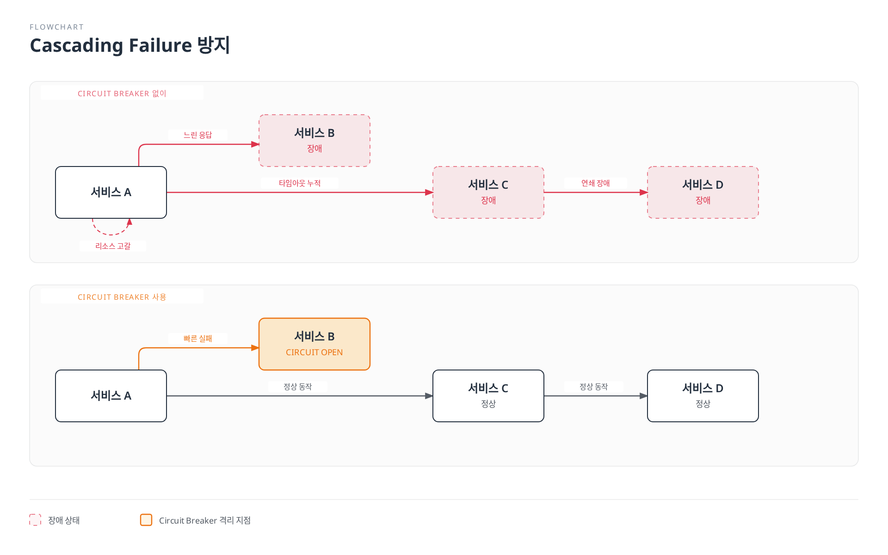
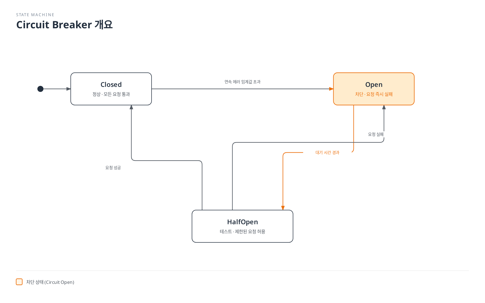
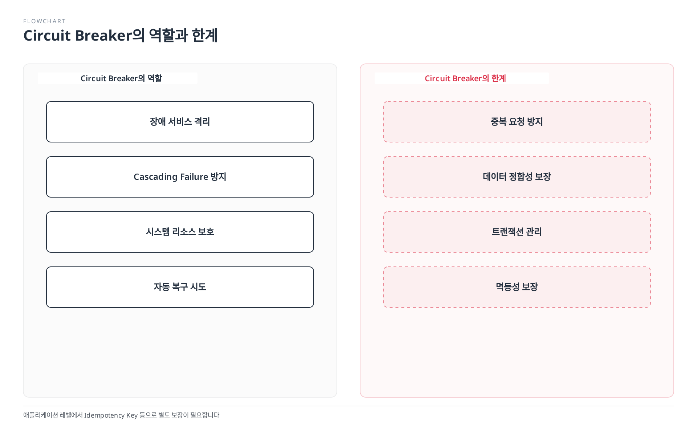
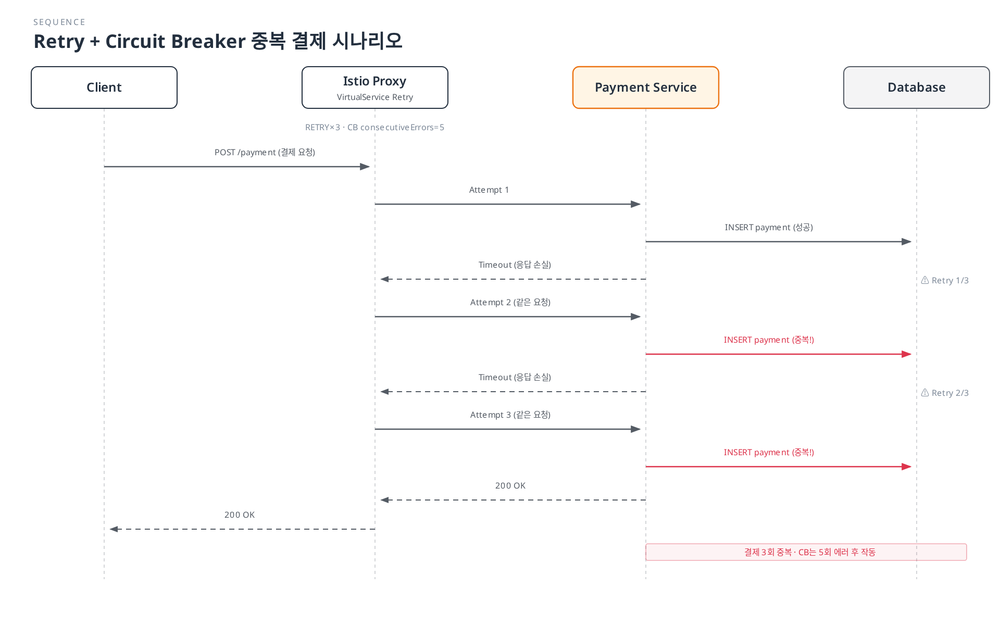

# Circuit Breaker

Circuit Breaker는 장애가 발생한 서비스를 자동으로 격리하여 연쇄 장애를 방지합니다.

## 목차

1. [Why Circuit Breaker?](#why-circuit-breaker)
2. [Circuit Breaker 개요](#circuit-breaker-개요)
3. [Connection Pool 설정](#connection-pool-설정)
4. [Outlier Detection](#outlier-detection)
5. [Retry 정책과의 조합](#retry-정책과의-조합)
6. [실전 예제](#실전-예제)
7. [외부 서비스 Circuit Breaker](#외부-서비스-circuit-breaker)
8. [모니터링 및 디버깅](#모니터링-및-디버깅)
9. [중요 주의사항](#중요-주의사항)
10. [모범 사례](#모범-사례)

## Why Circuit Breaker?

### Cascading Failure 방지

마이크로서비스 아키텍처에서 한 서비스의 장애가 다른 서비스로 전파되는 것을 방지합니다.



[🔍 인터랙티브 다이어그램 보기](https://www.atomai.click/kubernetes-docs/archmaps/ko-service-mesh-istio-traffic-management-07-circuit-breaker-0.html)

### 주요 이점

| 문제 | Circuit Breaker 없이 | Circuit Breaker 사용 |
|------|---------------------|---------------------|
| **응답 시간** | 타임아웃까지 대기 (30s+) | 설정한 제한에 도달하면 빠르게 거부 |
| **리소스 사용** | 스레드/연결 고갈 | 리소스 보호 |
| **장애 전파** | 연쇄 장애 발생 | 장애 격리 |
| **복구 시간** | 수동 개입 필요 | 자동 복구 시도 |

## Circuit Breaker 개요

그림은 일반 라이브러리의 Closed/Open/Half-Open 패턴을 설명합니다. Istio는 연결 풀 리소스 제한과 엔드포인트별 수동 관찰 기반 Outlier Ejection을 사용하며 메시 전체의 단일 3단계 상태 머신을 제공하지 않습니다. 제한과 상태 관측은 프록시·업스트림 cluster/priority별이며 동시성에 따른 일시적 초과도 가능합니다. Ejection은 일시적으로 선택에서 제외하며 Pod를 삭제하지 않습니다. 아래 예제는 대안 구성입니다.



[🔍 인터랙티브 다이어그램 보기](https://www.atomai.click/kubernetes-docs/archmaps/ko-service-mesh-istio-traffic-management-07-circuit-breaker-1.html)

## Connection Pool 설정

```yaml
apiVersion: networking.istio.io/v1
kind: DestinationRule
metadata:
  name: reviews-circuit-breaker
spec:
  host: reviews
  trafficPolicy:
    connectionPool:
      tcp:
        maxConnections: 100
      http:
        http1MaxPendingRequests: 50
        http2MaxRequests: 100
        maxRequestsPerConnection: 2
```

## Outlier Detection

Outlier Detection은 제외 한도와 panic 동작에 따라 비정상 엔드포인트를 로드 밸런싱에서 일시적으로 제외합니다.

```yaml
apiVersion: networking.istio.io/v1
kind: DestinationRule
metadata:
  name: reviews-outlier
spec:
  host: reviews
  trafficPolicy:
    outlierDetection:
      consecutive5xxErrors: 5        # 5번 연속 에러
      interval: 30s               # 30초 간격으로 체크
      baseEjectionTime: 30s       # 최소 시간; 반복 제외 시 더 길어짐
      maxEjectionPercent: 50      # 최대 50%까지만 제거
      minHealthPercent: 40        # 이 비율 미만이면 격리를 해제하고 전체 호스트 사용
```

### Outlier Detection 상세 설정

연속 오류 조건은 즉시 제외를 유발할 수 있습니다. interval은 주기적 검사 간격이며 모든 제외 전 대기 시간이 아닙니다. minHealthPercent는 확보할 정상 용량이 아닌 fail-open 임계값입니다. maxEjectionTime은 이 Istio DestinationRule API에 노출되지 않은 Envoy 필드이므로 매니페스트에 넣지 마세요.

```yaml
apiVersion: networking.istio.io/v1
kind: DestinationRule
metadata:
  name: advanced-outlier
spec:
  host: api-service
  trafficPolicy:
    outlierDetection:
      # 연속 에러 기반
      consecutiveGatewayErrors: 3    # HTTP 502/503/504
      consecutive5xxErrors: 5        # 모든 HTTP 5xx

      # 시간 간격
      interval: 10s                  # 10초마다 체크
      baseEjectionTime: 30s          # 첫 제거 시간

      # 비율 제한
      maxEjectionPercent: 50         # 최대 50% 제거
      minHealthPercent: 30           # Fail-open/panic 임계값; 정상 비율 보장이 아님

      # 로컬 연결 오류와 업스트림 응답 오류 구분
      splitExternalLocalOriginErrors: true
```

## Retry 정책과의 조합

Circuit Breaker와 Retry를 함께 사용하여 복원력을 높입니다.

### 기본 조합

```yaml
apiVersion: networking.istio.io/v1
kind: VirtualService
metadata:
  name: reviews-retry
spec:
  hosts:
  - reviews
  http:
  - route:
    - destination:
        host: reviews
    retries:
      attempts: 3                    # 3번 재시도
      perTryTimeout: 2s              # 각 시도마다 2초 타임아웃
      retryOn: 5xx,reset,connect-failure
---
apiVersion: networking.istio.io/v1
kind: DestinationRule
metadata:
  name: reviews-circuit-breaker
spec:
  host: reviews
  trafficPolicy:
    connectionPool:
      http:
        http1MaxPendingRequests: 10
        maxRequestsPerConnection: 2
    outlierDetection:
      consecutive5xxErrors: 5
      interval: 10s
      baseEjectionTime: 30s
```

### Retry Budget 패턴

```yaml
apiVersion: networking.istio.io/v1
kind: VirtualService
metadata:
  name: payment-retry-budget
spec:
  hosts:
  - payment-service
  http:
  - match:
    - method:
        regex: "^(GET|HEAD)$"
    route:
    - destination:
        host: payment-service
    retries:
      attempts: 2                    # 재시도는 최소한으로
      perTryTimeout: 1s              # 빠른 실패
      retryOn: connect-failure,refused-stream
  - route:
    - destination:
        host: payment-service
    retries:
      attempts: 0
---
apiVersion: networking.istio.io/v1
kind: DestinationRule
metadata:
  name: payment-circuit-breaker
spec:
  host: payment-service
  trafficPolicy:
    retryBudget:
      percent: 20
      minRetryConcurrency: 3
    connectionPool:
      http:
        http1MaxPendingRequests: 5   # 낮은 대기열
        maxRequestsPerConnection: 1  # 연결당 1개 요청
    outlierDetection:
      consecutive5xxErrors: 3           # 빠른 차단
      interval: 5s
      baseEjectionTime: 60s          # 긴 복구 시간
```

## 실전 예제

### 1. 메시 내부 서비스 Circuit Breaker

#### 시나리오: 데이터베이스 서비스 보호

```yaml
apiVersion: networking.istio.io/v1
kind: DestinationRule
metadata:
  name: database-service-circuit-breaker
  namespace: production
spec:
  host: database-service
  trafficPolicy:
    connectionPool:
      tcp:
        maxConnections: 100          # 최대 100개 연결
    outlierDetection:
      consecutive5xxErrors: 5
      interval: 30s
      baseEjectionTime: 30s
      maxEjectionPercent: 50
  subsets:
  - name: v1
    labels:
      version: v1
  - name: v2
    labels:
      version: v2
```

**사용 사례**:
- 데이터베이스 연결 풀 고갈 방지
- 느린 쿼리로 인한 연쇄 장애 차단
- 자동으로 비정상 인스턴스 제거

일반 DB 프로토콜에는 TCP 제한과 연결 실패 관측만 적용됩니다. 프록시별 연결 제한은 DB 전체 풀 크기가 아니며 느린 SQL 쿼리를 검사하지 않습니다.

### 2. maxConnections: 1 패턴 (Single Connection)

#### 시나리오: 레거시 시스템 또는 리소스 제약 서비스

```yaml
apiVersion: networking.istio.io/v1
kind: DestinationRule
metadata:
  name: legacy-system-protection
spec:
  host: legacy-api-service
  trafficPolicy:
    connectionPool:
      tcp:
        maxConnections: 1            # 연결 1개로 제한
      http:
        http1MaxPendingRequests: 1   # 대기 요청 1개
        maxRequestsPerConnection: 1  # 연결당 1개 요청
        h2UpgradePolicy: DO_NOT_UPGRADE  # HTTP/2 업그레이드 방지
    outlierDetection:
      consecutive5xxErrors: 1           # 에러 1번이면 즉시 차단
      interval: 10s
      baseEjectionTime: 60s
```

**사용 사례**:
- 레거시 시스템이 동시 연결을 처리 못하는 경우
- 외부 API rate limit이 매우 엄격한 경우
- 단일 연결로 순차 처리가 필요한 경우

maxConnections: 1은 메시 전체 직렬화나 외부 API 할당량을 보장하지 않습니다. 프록시마다 제한이 있고 HTTP/2는 다중화하며 maxRequestsPerConnection: 1은 단일 실행 보장 대신 연결 재사용을 해제합니다. 전역 조정에는 앱 큐/속도 제한기를 사용하세요.

### 3. 서브셋별 Circuit Breaker

#### 시나리오: 버전별로 다른 Circuit Breaker 설정

```yaml
apiVersion: networking.istio.io/v1
kind: DestinationRule
metadata:
  name: reviews-subset-circuit-breaker
spec:
  host: reviews
  trafficPolicy:
    # 기본 정책 (모든 서브셋)
    connectionPool:
      http:
        http1MaxPendingRequests: 50
        maxRequestsPerConnection: 2
    outlierDetection:
      consecutive5xxErrors: 5
      interval: 30s
      baseEjectionTime: 30s
  subsets:
  - name: v1
    labels:
      version: v1
    # v1은 기본 정책 사용

  - name: v2
    labels:
      version: v2
    trafficPolicy:
      # v2는 더 엄격한 정책 (새 버전 테스트)
      connectionPool:
        http:
          http1MaxPendingRequests: 10
          maxRequestsPerConnection: 1
      outlierDetection:
        consecutive5xxErrors: 3
        interval: 10s
        baseEjectionTime: 60s

  - name: v3-canary
    labels:
      version: v3
    trafficPolicy:
      # v3 Canary는 매우 엄격 (초기 배포)
      connectionPool:
        http:
          http1MaxPendingRequests: 5
          maxRequestsPerConnection: 1
      outlierDetection:
        consecutive5xxErrors: 1
        interval: 5s
        baseEjectionTime: 120s
```

### 4. 고급 Connection Pool 패턴

#### 시나리오: 고성능 서비스

```yaml
apiVersion: networking.istio.io/v1
kind: DestinationRule
metadata:
  name: high-performance-service
spec:
  host: api-gateway
  trafficPolicy:
    connectionPool:
      tcp:
        maxConnections: 1000         # 높은 동시 연결
        connectTimeout: 3s
        tcpKeepalive:
          time: 7200s
          interval: 75s
          probes: 9
      http:
        http1MaxPendingRequests: 500
        http2MaxRequests: 1000
        maxRequestsPerConnection: 100  # 연결 재사용
        idleTimeout: 300s
        h2UpgradePolicy: UPGRADE       # HTTP/2 사용
    outlierDetection:
      consecutive5xxErrors: 10          # 여유로운 설정
      interval: 60s
      baseEjectionTime: 30s
      maxEjectionPercent: 20         # 최대 20%만 제거
```

### 5. Health Check 기반 Circuit Breaker

```yaml
apiVersion: networking.istio.io/v1
kind: DestinationRule
metadata:
  name: health-check-circuit-breaker
spec:
  host: payment-service
  trafficPolicy:
    outlierDetection:
      # HTTP 상태 코드 기반
      consecutiveGatewayErrors: 5    # 502, 503, 504
      consecutive5xxErrors: 3        # 500~599

      # 성능 기반
      interval: 10s
      baseEjectionTime: 30s

      # 동적 조정
      splitExternalLocalOriginErrors: true
      consecutiveLocalOriginFailures: 5
```

## 외부 서비스 Circuit Breaker

아래 HTTP 예제는 앱이 Sidecar에 HTTP를 보내고 Sidecar가 실제 외부 호스트의 443으로 검증된 TLS를 시작하는 구성입니다. 앱이 이미 TLS를 사용하면 이중 TLS를 피하고 해당 계층에서 관측 가능한 정책만 사용하세요. 일반 MongoDB의 앱 TLS/인증은 별도 클라이언트/서버 요구사항입니다.

ServiceEntry와 함께 사용하여 외부 서비스를 보호합니다.

### 1. 외부 API Circuit Breaker

```yaml
# ServiceEntry: 외부 API 등록
apiVersion: networking.istio.io/v1
kind: ServiceEntry
metadata:
  name: external-payment-api
spec:
  hosts:
  - api.payment-provider.com
  ports:
  - number: 80
    name: http
    protocol: HTTP
    targetPort: 443
  location: MESH_EXTERNAL
  resolution: DNS
---
# DestinationRule: Circuit Breaker 적용
apiVersion: networking.istio.io/v1
kind: DestinationRule
metadata:
  name: external-payment-api-circuit-breaker
spec:
  host: api.payment-provider.com
  trafficPolicy:
    connectionPool:
      tcp:
        maxConnections: 10           # 외부 API는 제한적
      http:
        http1MaxPendingRequests: 5
        maxRequestsPerConnection: 1  # 연결 재사용 최소화
    outlierDetection:
      consecutive5xxErrors: 3           # 빠른 차단
      interval: 30s
      baseEjectionTime: 120s         # 긴 복구 시간
      maxEjectionPercent: 100        # 완전 차단 가능
    tls:
      mode: SIMPLE
      sni: api.payment-provider.com
      subjectAltNames:
      - api.payment-provider.com
```

### 2. 외부 데이터베이스 Circuit Breaker

```yaml
apiVersion: networking.istio.io/v1
kind: ServiceEntry
metadata:
  name: external-mongodb
spec:
  hosts:
  - mongodb.external-cluster.com
  ports:
  - number: 27017
    name: tcp
    protocol: TCP
  location: MESH_EXTERNAL
  resolution: DNS
---
apiVersion: networking.istio.io/v1
kind: DestinationRule
metadata:
  name: external-mongodb-circuit-breaker
spec:
  host: mongodb.external-cluster.com
  trafficPolicy:
    connectionPool:
      tcp:
        maxConnections: 50
        connectTimeout: 5s
    outlierDetection:
      consecutive5xxErrors: 5
      interval: 60s
      baseEjectionTime: 60s
```

### 3. Rate Limited 외부 서비스

```yaml
apiVersion: networking.istio.io/v1
kind: ServiceEntry
metadata:
  name: rate-limited-api
spec:
  hosts:
  - api.rate-limited-service.com
  ports:
  - number: 80
    name: http
    protocol: HTTP
    targetPort: 443
  location: MESH_EXTERNAL
  resolution: DNS
---
apiVersion: networking.istio.io/v1
kind: DestinationRule
metadata:
  name: rate-limited-api-protection
spec:
  host: api.rate-limited-service.com
  trafficPolicy:
    connectionPool:
      http:
        http1MaxPendingRequests: 1   # 대기열 최소화
        maxRequestsPerConnection: 0  # 연결 재사용; 할당량 제한기가 아님
        idleTimeout: 1s              # 빠른 연결 해제
    outlierDetection:
      consecutive5xxErrors: 3           # 기본 HTTP 5xx 감지; 429가 아님
      interval: 60s
      baseEjectionTime: 30s          # 제공자의 Retry-After와 별개
    tls:
      mode: SIMPLE
      sni: api.rate-limited-service.com
      subjectAltNames:
      - api.rate-limited-service.com
---
# VirtualService: Retry 설정
apiVersion: networking.istio.io/v1
kind: VirtualService
metadata:
  name: rate-limited-api-retry
spec:
  hosts:
  - api.rate-limited-service.com
  http:
  - route:
    - destination:
        host: api.rate-limited-service.com
    retries:
      attempts: 0                    # Retry 비활성화 (rate limit)
    timeout: 10s
```

HTTP 429는 제공자 규칙에 맞는 속도 제한과 Retry-After 처리가 필요합니다. 기본 5xx Outlier Detection과 연결 재생성은 API 할당량을 집행하거나 초기화 시각을 알아내지 못합니다.

## 모니터링 및 디버깅

### Envoy 메트릭 확인

```bash
# Circuit Breaker 상태 확인
kubectl exec -it <pod-name> -c istio-proxy -- \
  curl localhost:15000/stats/prometheus | grep circuit_breakers

# Outlier Detection 상태
kubectl exec -it <pod-name> -c istio-proxy -- \
  curl localhost:15000/stats/prometheus | grep outlier_detection

# Connection Pool 상태
kubectl exec -it <pod-name> -c istio-proxy -- \
  curl localhost:15000/stats/prometheus | grep upstream_rq
```

### 주요 메트릭

```promql
# Prometheus 쿼리
# 요청 circuit-open gauge (0/1)
envoy_cluster_circuit_breakers_default_rq_open

# 대기 요청 circuit-open gauge (0/1)
envoy_cluster_circuit_breakers_default_rq_pending_open

# Outlier Detection Ejection
envoy_cluster_outlier_detection_ejections_active

# 연결 풀 오버플로우
envoy_cluster_upstream_rq_pending_overflow

# 재시도 횟수
envoy_cluster_upstream_rq_retry
```

### Grafana 대시보드

```yaml
# Circuit Breaker Dashboard
- expr: envoy_cluster_circuit_breakers_default_rq_open
  legend: "Circuit Breaker Open State"

- expr: envoy_cluster_outlier_detection_ejections_active
  legend: "Ejected Instances"

- expr: rate(envoy_cluster_upstream_rq_pending_overflow[5m])
  legend: "Connection Pool Overflow"
```

### istioctl 명령어

```bash
# Proxy 설정 확인
istioctl proxy-config clusters <pod-name> --fqdn reviews.default.svc.cluster.local

# Circuit Breaker 설정 확인
istioctl proxy-config clusters <pod-name> -o json | \
  jq '.[] | select(.name=="outbound|9080||reviews.default.svc.cluster.local") | .circuitBreakers'

# Outlier Detection 설정 확인
istioctl proxy-config clusters <pod-name> -o json | \
  jq '.[] | select(.name=="outbound|9080||reviews.default.svc.cluster.local") | .outlierDetection'
```

## 중요 주의사항

### ⚠️ Circuit Breaker는 데이터 정합성을 보장하지 않습니다

**핵심 원칙**: Circuit Breaker는 **장애 격리**를 위한 도구이지, **중복 요청 방지**나 **데이터 정합성 보장** 도구가 아닙니다.

#### Circuit Breaker의 역할과 한계



[🔍 인터랙티브 다이어그램 보기](https://www.atomai.click/kubernetes-docs/archmaps/ko-service-mesh-istio-traffic-management-07-circuit-breaker-2.html)

#### 문제 시나리오: Retry + Circuit Breaker



[🔍 인터랙티브 다이어그램 보기](https://www.atomai.click/kubernetes-docs/archmaps/ko-service-mesh-istio-traffic-management-07-circuit-breaker-3.html)

**문제**: Circuit Breaker가 작동하기 전(5번 연속 에러)에 이미 **3번의 중복 결제**가 발생했습니다.

#### 잘못된 사용 예시

```yaml
# ❌ 위험: POST 요청 + Retry + Circuit Breaker
apiVersion: networking.istio.io/v1
kind: VirtualService
metadata:
  name: payment-dangerous
spec:
  hosts:
  - payment-service
  http:
  - route:
    - destination:
        host: payment-service
    retries:
      attempts: 3  # ❌ POST에 3번 재시도
      perTryTimeout: 2s
      retryOn: 5xx,reset
---
apiVersion: networking.istio.io/v1
kind: DestinationRule
metadata:
  name: payment-circuit-breaker
spec:
  host: payment-service
  trafficPolicy:
    outlierDetection:
      consecutive5xxErrors: 5
      interval: 30s
      baseEjectionTime: 30s

# 결과:
# - attempts: 3이면 최초 요청당 최대 4회 전달; 제외 임계값을 곱하는 계산이 아님
# - 결제, 재고 차감 등 크리티컬 작업이 중복 실행
# - 데이터 정합성 파괴
```

#### 올바른 사용 패턴

**패턴 1: 재시도 가능한 읽기와 쓰기 재시도 해제**

```yaml
# ✅ 안전: 읽기 전용 + Circuit Breaker
apiVersion: networking.istio.io/v1
kind: VirtualService
metadata:
  name: product-catalog-safe
spec:
  hosts:
  - product-catalog
  http:
  - match:
    - method:
        regex: "GET|HEAD|OPTIONS"  # 읽기 전용만
    route:
    - destination:
        host: product-catalog
    retries:
      attempts: 3  # GET은 안전
      perTryTimeout: 2s
      retryOn: 5xx,reset,connect-failure
---
apiVersion: networking.istio.io/v1
kind: DestinationRule
metadata:
  name: product-catalog-circuit-breaker
spec:
  host: product-catalog
  trafficPolicy:
    outlierDetection:
      consecutive5xxErrors: 5
      interval: 30s
      baseEjectionTime: 30s
```

```yaml
# ✅ 안전: POST는 Retry 비활성화
apiVersion: networking.istio.io/v1
kind: VirtualService
metadata:
  name: payment-safe
spec:
  hosts:
  - payment-service
  http:
  - match:
    - method:
        exact: POST
    route:
    - destination:
        host: payment-service
    timeout: 10s
    retries:
      attempts: 0  # POST는 Retry 비활성화
---
apiVersion: networking.istio.io/v1
kind: DestinationRule
metadata:
  name: payment-circuit-breaker
spec:
  host: payment-service
  trafficPolicy:
    outlierDetection:
      consecutive5xxErrors: 5
      interval: 30s
      baseEjectionTime: 30s
```

**패턴 2: 애플리케이션 레벨 Idempotency + Circuit Breaker**

멱등 키는 인증한 호출자와 요청 페이로드에 결합하고 비즈니스 변경/결과와 원자적으로 기록해야 합니다. Redis exists 검사 후 결제와 캐시 기록을 따로 하는 구현은 경쟁 조건이 있어 안전하지 않습니다. [원자적 멱등 처리 절차](05-retry-timeout.md)와 필요한 다운스트림 멱등 계약/outbox를 사용하세요. 이 계약을 구현한 뒤에만 아래 재시도 정책을 사용하며 헤더 존재만으로는 충분하지 않습니다.


```yaml
# Istio: Idempotency가 보장되면 Retry 가능
apiVersion: networking.istio.io/v1
kind: VirtualService
metadata:
  name: payment-with-idempotency
spec:
  hosts:
  - payment-service
  http:
  - match:
    - headers:
        x-idempotency-key:
          regex: ".+"  # Idempotency Key 필수
    route:
    - destination:
        host: payment-service
    retries:
      attempts: 3  # Idempotency가 있으면 안전
      perTryTimeout: 2s
      retryOn: 5xx,reset
  - route:  # Idempotency Key 없으면 Retry 비활성화
    - destination:
        host: payment-service
    retries:
      attempts: 0
```

#### 서비스별 안전 전략

| 서비스 유형 | Retry | Circuit Breaker | Idempotency 필요 |
|-----------|-------|----------------|-----------------|
| **상품 조회** | ✅ 3회 | ✅ 필요 | ❌ 불필요 |
| **장바구니** | 기본적으로 읽기만 | 필요에 맞게 조정 | 재시도할 변경에는 필요 |
| **주문 생성** | ❌ 0회 | ✅ 필요 | ✅ 필수 |
| **결제** | ❌ 0회 | ✅ 필요 | ✅ 필수 |
| **재고 차감** | ❌ 0회 | ✅ 필요 | ✅ 필수 |
| **포인트 적립** | ❌ 0회 | ✅ 필요 | ✅ 필수 |
| **알림 발송** | 전송 중복 방지가 있을 때만 | 필요에 맞게 조정 | 메시지/전송 멱등성 필요 |

#### Connection Pool과 데이터 정합성

Connection Pool 설정도 **데이터 정합성을 보장하지 않습니다**. 단지 동시 연결 수를 제한할 뿐입니다.

```yaml
# ❌ 오해: maxConnections=1이면 중복 방지?
apiVersion: networking.istio.io/v1
kind: DestinationRule
metadata:
  name: payment-single-connection
spec:
  host: payment-service
  trafficPolicy:
    connectionPool:
      tcp:
        maxConnections: 1  # ❌ 중복을 막지 못함
      http:
        http1MaxPendingRequests: 1

# maxConnections=1은:
# - 동시 연결 수만 제한
# - Retry로 인한 중복 요청은 막지 못함
# - 네트워크 타임아웃 후 재시도는 별개 연결
```

#### 실전 체크리스트

**배포 전 확인사항**:

- [ ] POST/PUT/DELETE/PATCH 요청에 Retry 설정 확인
- [ ] 비멱등 쓰기는 검증된 앱 계약이 없으면 attempts: 0 설정
- [ ] Circuit Breaker와 Retry 조합 시 중복 가능성 검토
- [ ] 크리티컬 작업(결제, 재고)은 Idempotency Key 구현
- [ ] 애플리케이션 레벨 검증 로직 존재 확인
- [ ] 테스트 환경에서 장애 시뮬레이션 수행

**모니터링**:

```bash
# Retry 발생 횟수 확인
kubectl exec -n <namespace> <pod> -c istio-proxy -- \
  curl -s localhost:15000/stats/prometheus | grep upstream_rq_retry

# Circuit Breaker 작동 확인
kubectl exec -n <namespace> <pod> -c istio-proxy -- \
  curl -s localhost:15000/stats/prometheus | grep circuit_breakers

# 중복 요청 의심 로그 확인
kubectl logs -n <namespace> <pod> | grep -i "duplicate\|idempotency"
```

## 모범 사례

### 1. 점진적 설정

```yaml
# 1단계: 관대한 설정으로 시작
apiVersion: networking.istio.io/v1
kind: DestinationRule
metadata:
  name: service-circuit-breaker-stage1
spec:
  host: my-service
  trafficPolicy:
    connectionPool:
      http:
        http1MaxPendingRequests: 100
        maxRequestsPerConnection: 10
    outlierDetection:
      consecutive5xxErrors: 10        # 관대함
      interval: 60s
      baseEjectionTime: 30s
```

```yaml
# 2단계: 모니터링 후 조정
apiVersion: networking.istio.io/v1
kind: DestinationRule
metadata:
  name: service-circuit-breaker-stage2
spec:
  host: my-service
  trafficPolicy:
    connectionPool:
      http:
        http1MaxPendingRequests: 50
        maxRequestsPerConnection: 5
    outlierDetection:
      consecutive5xxErrors: 5         # 적정
      interval: 30s
      baseEjectionTime: 30s
```

### 2. 서비스 유형별 설정

```yaml
# 프론트엔드 서비스: 관대함
connectionPool:
  http:
    http1MaxPendingRequests: 100
    maxRequestsPerConnection: 10
outlierDetection:
  consecutive5xxErrors: 10
```

```yaml
# 백엔드 서비스: 적정
connectionPool:
  http:
    http1MaxPendingRequests: 50
    maxRequestsPerConnection: 5
outlierDetection:
  consecutive5xxErrors: 5
```

```yaml
# 일반 DB/캐시 TCP 예제
connectionPool:
  tcp:
    maxConnections: 10
outlierDetection:
  consecutive5xxErrors: 3
```

```yaml
# 외부 API: 매우 엄격
connectionPool:
  http:
    http1MaxPendingRequests: 5
    maxRequestsPerConnection: 1
outlierDetection:
  consecutive5xxErrors: 1
```

### 3. 알림 설정

```yaml
# Prometheus Alert Rules
groups:
- name: circuit-breaker
  rules:
  - alert: CircuitBreakerOpen
    expr: envoy_cluster_circuit_breakers_default_rq_open > 0
    for: 1m
    annotations:
      summary: "Circuit breaker is open"

  - alert: HighConnectionPoolOverflow
    expr: rate(envoy_cluster_upstream_rq_pending_overflow[5m]) > 10
    for: 2m
    annotations:
      summary: "Connection pool overflow rate is high"

  - alert: HighOutlierEjectionRate
    expr: rate(envoy_cluster_outlier_detection_ejections_enforced_total[5m]) > 5
    for: 3m
    annotations:
      summary: "High outlier ejection rate"
```

### 4. 테스트 시나리오

준비한 테스트 서비스에서만 부하 테스트를 실행하세요. proxy-config는 임계값 구성이며 현재 circuit-open 상태가 아니므로 실시간 메트릭을 별도로 관찰합니다. 반복 제외 후 30초 대기로 복구가 보장되지는 않습니다.

```bash
#!/bin/bash
# Circuit Breaker 테스트

# 1. 정상 트래픽
echo "=== Normal Traffic ==="
for i in {1..10}; do
  curl -s http://service/api | jq .status
  sleep 0.1
done

# 2. 부하 증가
echo "=== Increased Load ==="
for i in {1..100}; do
  curl -s http://service/api &
done
wait

# 3. Circuit Breaker 상태 확인
echo "=== Circuit Breaker Status ==="
istioctl proxy-config clusters <pod> -o json | jq '.[] | .circuitBreakers'

# 4. 복구 대기
echo "=== Waiting for Recovery ==="
sleep 30

# 5. 복구 확인
echo "=== Recovery Check ==="
curl -s http://service/api | jq .status
```

### 5. 문서화 템플릿

예시 부하/복구 수치는 실제 측정값으로 바꾸세요. Istio 보장값이 아닙니다. 필요한 Envoy 통계를 활성화하고 프록시 이미지에 curl이 없으면 로컬 admin port-forward 또는 istioctl dashboard envoy를 사용하세요.

```yaml
apiVersion: networking.istio.io/v1
kind: DestinationRule
metadata:
  name: my-service-circuit-breaker
  annotations:
    # 설정 목적
    purpose: "Protect database connection pool"

    # 임계값 근거
    threshold-rationale: |
      - maxConnections: 100 (DB connection pool size)
      - consecutive5xxErrors: 5 (observed error pattern)
      - baseEjectionTime: 30s (average recovery time)

    # 테스트 결과
    test-results: |
      - Load test: 1000 RPS without overflow
      - Failure test: Circuit opens after 5 errors
      - Recovery test: Auto-recovery after 30s

    # 운영 가이드
    operations: |
      - Monitor: envoy_cluster_circuit_breakers_*
      - Alert: Circuit open > 1min
      - Rollback: restore the reviewed previous DestinationRule configuration
spec:
  host: my-service
```

## 참고 자료

- [Istio Circuit Breaker](https://istio.io/latest/docs/tasks/traffic-management/circuit-breaking/)
- [Envoy Circuit Breaking](https://www.envoyproxy.io/docs/envoy/latest/intro/arch_overview/upstream/circuit_breaking)
- [Envoy Outlier Detection](https://www.envoyproxy.io/docs/envoy/latest/intro/arch_overview/upstream/outlier)
- [Netflix Hystrix](https://github.com/Netflix/Hystrix/wiki/How-it-Works)

- [Primary reference 1](https://istio.io/latest/docs/reference/config/networking/destination-rule/)
- [Primary reference 2](https://www.envoyproxy.io/docs/envoy/latest/intro/arch_overview/upstream/circuit_breaking)
- [Primary reference 3](https://www.envoyproxy.io/docs/envoy/latest/intro/arch_overview/upstream/outlier)
- [Primary reference 4](https://www.envoyproxy.io/docs/envoy/latest/configuration/upstream/cluster_manager/cluster_stats)
- [Primary reference 5](https://aws.amazon.com/builders-library/making-retries-safe-with-idempotent-APIs/)
- [Primary reference 6](https://istio.io/latest/docs/tasks/traffic-management/egress/egress-tls-origination/)
