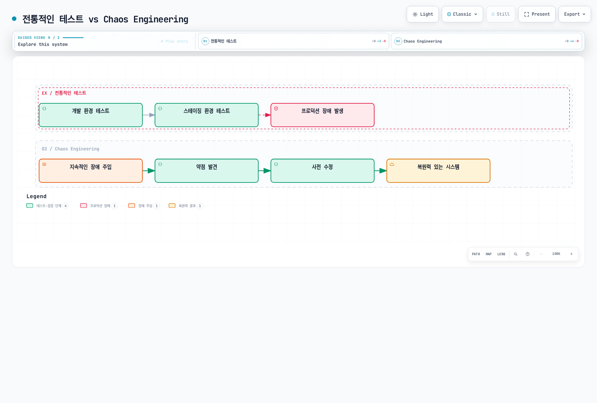
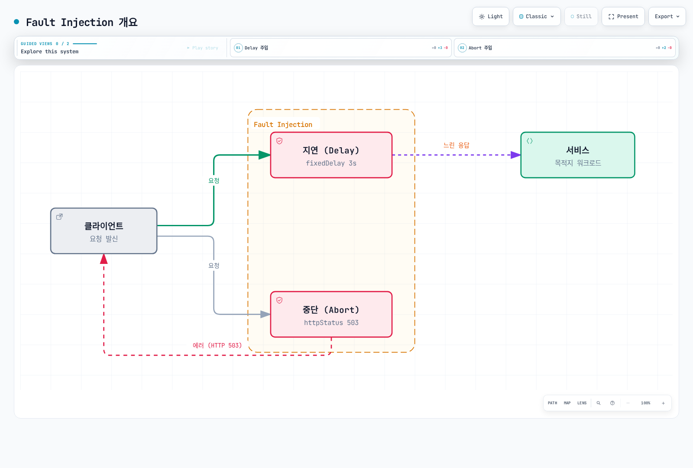
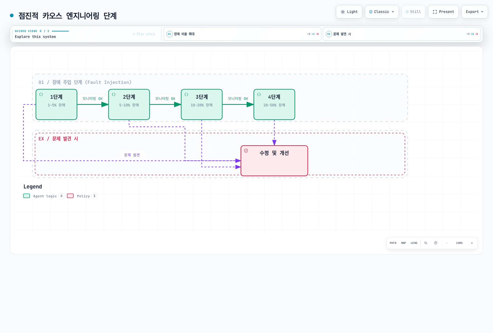

# Fault Injection

Fault Injection은 시스템의 복원력을 테스트하기 위해 의도적으로 장애를 주입하는 기법입니다.

## 목차

1. [Why Fault Injection?](#why-fault-injection)
2. [When to Use Fault Injection](#when-to-use-fault-injection)
3. [Fault Injection 개요](#fault-injection-개요)
4. [Delay 주입](#delay-주입)
5. [Abort 주입](#abort-주입)
6. [실전 예제](#실전-예제)
7. [Real-World Scenarios](#real-world-scenarios)
8. [Testing Strategies](#testing-strategies)
9. [모범 사례](#모범-사례)

각 예제는 HTTP 계층의 독립적인 실험입니다. 격리된 네임스페이스에서 시작하고 전체 정상 라우팅 구성을 보존하며 예약 전에 독립적인 정리 경로를 준비하세요. 비율은 일치한 요청에 적용되며 Pod 비율이 아닙니다. 테스트 헤더는 인증이 아니며 대상 다운스트림 호출까지 전파되어야 합니다. 일반 SQL/TCP, 패킷 손실, Pod readiness, 노드 장애는 별도 테스트가 필요합니다.

## Why Fault Injection?

### 프로덕션 환경에서의 복원력 테스트

마이크로서비스 아키텍처에서는 수많은 서비스가 서로 의존하며, **하나의 서비스 장애가 전체 시스템에 영향**을 미칠 수 있습니다. Fault Injection은 다음과 같은 이유로 필수적입니다:

#### 1. **Chaos Engineering의 핵심 원칙**

Netflix의 Chaos Monkey 같은 사례로 널리 알려진 Chaos Engineering은 **프로덕션 환경에서 장애를 사전에 경험**하고 시스템의 약점을 발견하는 것을 목표로 합니다.



[🔍 인터랙티브 다이어그램 보기](https://www.atomai.click/kubernetes-docs/archmaps/ko-service-mesh-istio-traffic-management-08-fault-injection-0.html)

#### 2. **실제 프로덕션 시나리오 재현**

프로덕션 환경에서는 다음과 같은 문제가 발생할 수 있습니다:

| 시나리오 | 원인 | Fault Injection 테스트 |
|---------|------|----------------------|
| **네트워크 지연** | 지역 간 네트워크 latency | Delay Injection |
| **서비스 타임아웃** | 느린 데이터베이스 쿼리 | Delay Injection |
| **일시적 장애** | 서비스 재시작, 스케일 다운 | Abort Injection |
| **부분적 장애** | 일부 파드만 실패 | Percentage 기반 Injection |
| **Cascading Failure** | 한 서비스 장애가 다른 서비스로 전파 | 조합된 Fault Injection |

#### 3. **Circuit Breaker와 Timeout 설정 검증**

Fault Injection은 호출자의 지연/오류 처리를 검사합니다. 프록시 재시도·타임아웃·엔드포인트 제외를 검사하려면 해당 메커니즘이 관측하는 계층에서 장애를 만들어야 합니다.

호출자 동작과 프록시 제외를 구분해 검증하세요. 로컬 Abort는 업스트림 엔드포인트 실패가 아니며 주문 서비스의 실제 응답이 그 호출자의 관측값을 결정합니다.

#### 4. **안전한 배포 검증**

새 버전을 배포할 때 **의존 서비스의 장애 상황에서도 안전한지** 확인할 수 있습니다:

- 새 버전이 timeout을 올바르게 처리하는가?
- 의존 서비스 장애 시 graceful degradation을 수행하는가?
- 에러 처리 로직이 제대로 작동하는가?

## When to Use Fault Injection

Fault Injection은 다음과 같은 상황에서 사용해야 합니다:

### 1. **개발 및 테스트 환경**

#### 시나리오: 새로운 마이크로서비스 개발

```yaml
# 개발 중인 서비스에 장애 주입
apiVersion: networking.istio.io/v1
kind: VirtualService
metadata:
  name: payment-service-dev
  namespace: dev
spec:
  hosts:
  - payment-service
  http:
  - match:
    - headers:
        x-testing:
          exact: "true"  # 테스트 트래픽에만 적용
    fault:
      delay:
        percentage:
          value: 50.0
        fixedDelay: 3s
      abort:
        percentage:
          value: 20.0
        httpStatus: 503
    route:
    - destination:
        host: payment-service
        subset: v2
  - route:
    - destination:
        host: payment-service
```

**Use Case**:
- 결제 서비스가 느려지거나 실패할 때 주문 서비스가 어떻게 반응하는지 테스트
- 사용자에게 적절한 에러 메시지를 보여주는지 확인

### 2. **스테이징 환경에서의 통합 테스트**

#### 시나리오: 프로덕션 배포 전 최종 검증

```yaml
# 모든 의존 서비스에 무작위 장애 주입
apiVersion: networking.istio.io/v1
kind: VirtualService
metadata:
  name: database-service-staging
spec:
  hosts:
  - database-service
  http:
  - fault:
      delay:
        percentage:
          value: 10.0  # 10% 요청에 지연
        fixedDelay: 5s
      abort:
        percentage:
          value: 5.0   # 5% 요청 실패
        httpStatus: 500
    route:
    - destination:
        host: database-service
```

**Use Case**:
- 프로덕션 배포 전 시스템 전체의 복원력 검증
- 모니터링 알람이 제대로 작동하는지 확인

### 3. **프로덕션 환경에서의 Chaos Testing**

#### 시나리오: 프로덕션 복원력 정기 테스트

```yaml
# 프로덕션에서 매우 낮은 비율로 장애 주입
apiVersion: networking.istio.io/v1
kind: VirtualService
metadata:
  name: recommendation-service-prod
spec:
  hosts:
  - recommendation-service
  http:
  - match:
    - headers:
        x-canary:
          exact: "true"  # Canary 사용자에게만 적용
    fault:
      abort:
        percentage:
          value: 1.0  # 1% 요청만 실패
        httpStatus: 503
    route:
    - destination:
        host: recommendation-service
  - route:
    - destination:
        host: recommendation-service
```

**Use Case**:
- Netflix 스타일 Chaos Engineering
- 프로덕션 환경에서 실제 장애 상황 대응 능력 검증
- **주의**: 매우 낮은 비율(1-5%)로 시작하고, 영향을 모니터링

### 4. **Timeout 및 Retry 정책 조정**

Istio는 Fault가 활성화된 동일 클라이언트 라우트에서 timeout/retry 처리를 활성화하지 않습니다. 아래에서 라우트 timeout을 제거한 것은 의도적이며 이 테스트의 기한은 호출자가 집행해야 합니다.

#### 시나리오: 최적의 Timeout 값 찾기

```yaml
# 다양한 지연 시간으로 테스트
apiVersion: networking.istio.io/v1
kind: VirtualService
metadata:
  name: search-service-timeout-test
spec:
  hosts:
  - search-service
  http:
  - match:
    - headers:
        x-test-scenario:
          exact: "slow-response"
    fault:
      delay:
        percentage:
          value: 100.0
        fixedDelay: 10s  # 10초 지연
    route:
    - destination:
        host: search-service
  - route:
    - destination:
        host: search-service
```

**Use Case**:
- 프록시가 10초 지연을 주입할 때 앱/클라이언트의 5초 기한을 검사
- Istio 라우트 타임아웃은 실제 느린 업스트림 또는 다른 홉의 장애로 검사
- 사용자 경험을 해치지 않는 최적의 값 찾기

### 5. **Outlier Detection 동작 검증**

로컬 Fault Abort는 업스트림 요청 전 응답하므로 같은 프록시의 엔드포인트별 연속 오류 감지를 검사하지 못합니다. 실제 503을 반환하는 제어된 HTTP 백엔드를 사용하고 제외 여부를 관찰하세요. 예를 들어 테스트 네임스페이스에 Istio httpbin 샘플을 배포한 뒤:

```yaml
apiVersion: networking.istio.io/v1
kind: DestinationRule
metadata:
  name: httpbin-outlier-test
spec:
  host: httpbin
  trafficPolicy:
    outlierDetection:
      consecutive5xxErrors: 5
      interval: 5s
      baseEjectionTime: 30s
      maxEjectionPercent: 100
      minHealthPercent: 0
```

메시 앱 클라이언트에서 `http://httpbin:8000/status/503`으로 요청하세요. 테스트 엔드포인트 전체 제외를 의도적으로 허용한 설정이며 복구는 제외 이력과 이후 상태에 따라 달라져 정확히 30초가 보장되지 않습니다. 다른 워크로드에는 이 테스트 설정을 적용하지 마세요.

### 6. **특정 사용자 그룹에 대한 테스트**

#### 시나리오: 베타 테스터에게만 장애 주입

```yaml
# 특정 사용자에게만 장애 주입
apiVersion: networking.istio.io/v1
kind: VirtualService
metadata:
  name: api-service-beta
spec:
  hosts:
  - api-service
  http:
  - match:
    - headers:
        end-user:
          exact: "beta-tester"  # 베타 테스터만
    fault:
      delay:
        percentage:
          value: 20.0
        fixedDelay: 2s
    route:
    - destination:
        host: api-service
  - route:  # 일반 사용자는 정상 라우팅
    - destination:
        host: api-service
```

**Use Case**:
- 실제 사용자 영향 없이 안전하게 테스트
- 베타 테스터의 피드백으로 개선

## Fault Injection 개요



[🔍 인터랙티브 다이어그램 보기](https://www.atomai.click/kubernetes-docs/archmaps/ko-service-mesh-istio-traffic-management-08-fault-injection-2.html)

## Delay 주입

```yaml
apiVersion: networking.istio.io/v1
kind: VirtualService
metadata:
  name: reviews-delay
spec:
  hosts:
  - reviews
  http:
  - fault:
      delay:
        percentage:
          value: 10.0  # 10%의 요청에 지연 주입
        fixedDelay: 5s  # 5초 지연
    route:
    - destination:
        host: reviews
```

## Abort 주입

```yaml
apiVersion: networking.istio.io/v1
kind: VirtualService
metadata:
  name: reviews-abort
spec:
  hosts:
  - reviews
  http:
  - fault:
      abort:
        percentage:
          value: 10.0  # 10%의 요청 중단
        httpStatus: 503  # HTTP 503 에러 반환
    route:
    - destination:
        host: reviews
```

## 실전 예제

### 1. Delay와 Abort 조합

실제 프로덕션 환경에서는 지연과 실패가 동시에 발생할 수 있습니다:

```yaml
apiVersion: networking.istio.io/v1
kind: VirtualService
metadata:
  name: ratings-combined-fault
spec:
  hosts:
  - ratings
  http:
  - fault:
      delay:
        percentage:
          value: 20.0  # 20% 요청에 지연
        fixedDelay: 3s
      abort:
        percentage:
          value: 10.0  # 10% 요청 실패
        httpStatus: 503
    route:
    - destination:
        host: ratings
```

**결과**:
- 20%의 요청은 3초 지연
- Abort와 Delay가 겹칠 수 있어 일부 중단 요청도 먼저 지연됨
- 두 비율을 서로 배타적인 집단처럼 더하지 말고 겹침을 관찰

### 2. 조건부 Fault Injection

특정 조건에서만 장애를 주입:

```yaml
apiVersion: networking.istio.io/v1
kind: VirtualService
metadata:
  name: reviews-conditional-fault
spec:
  hosts:
  - reviews
  http:
  # 모바일 사용자에게만 장애 주입
  - match:
    - headers:
        user-agent:
          regex: ".*Mobile.*"
    fault:
      delay:
        percentage:
          value: 30.0
        fixedDelay: 2s
    route:
    - destination:
        host: reviews
        subset: v2
  # 일반 사용자는 정상 라우팅
  - route:
    - destination:
        host: reviews
        subset: v1
```

### 3. 점진적 장애 주입 (Progressive Fault Injection)

단계적으로 장애 비율을 증가시켜 테스트:

```yaml
# 1단계: 5% 장애
apiVersion: networking.istio.io/v1
kind: VirtualService
metadata:
  name: api-fault
spec:
  hosts:
  - api-service
  http:
  - fault:
      abort:
        percentage:
          value: 5.0
        httpStatus: 500
    route:
    - destination:
        host: api-service
```

```yaml
# 2단계: 10% 장애 (모니터링 후 적용)
apiVersion: networking.istio.io/v1
kind: VirtualService
metadata:
  name: api-fault
spec:
  hosts:
  - api-service
  http:
  - fault:
      abort:
        percentage:
          value: 10.0
        httpStatus: 500
    route:
    - destination:
        host: api-service
```

```yaml
# 3단계: 20% 장애 (충분한 검증 후 적용)
apiVersion: networking.istio.io/v1
kind: VirtualService
metadata:
  name: api-fault
spec:
  hosts:
  - api-service
  http:
  - fault:
      abort:
        percentage:
          value: 20.0
        httpStatus: 500
    route:
    - destination:
        host: api-service
```

### 4. HTTP 상태 코드별 테스트

다양한 HTTP 에러 코드로 테스트:

```yaml
apiVersion: networking.istio.io/v1
kind: VirtualService
metadata:
  name: payment-error-scenarios
spec:
  hosts:
  - payment-service
  http:
  # 시나리오 1: 서비스 과부하 (503)
  - match:
    - headers:
        x-test-scenario:
          exact: "overload"
    fault:
      abort:
        percentage:
          value: 50.0
        httpStatus: 503
    route:
    - destination:
        host: payment-service
  # 시나리오 2: 내부 서버 에러 (500)
  - match:
    - headers:
        x-test-scenario:
          exact: "server-error"
    fault:
      abort:
        percentage:
          value: 30.0
        httpStatus: 500
    route:
    - destination:
        host: payment-service
  # 시나리오 3: 게이트웨이 타임아웃 (504)
  - match:
    - headers:
        x-test-scenario:
          exact: "timeout"
    fault:
      abort:
        percentage:
          value: 20.0
        httpStatus: 504
    route:
    - destination:
        host: payment-service
  # 기본 라우팅
  - route:
    - destination:
        host: payment-service
```

## Real-World Scenarios

### 시나리오 1: 느린 HTTP 데이터베이스 중계 서비스 시뮬레이션

**상황**: 데이터베이스 쿼리가 간헐적으로 느려지는 경우

```yaml
apiVersion: networking.istio.io/v1
kind: VirtualService
metadata:
  name: database-slow-query
  namespace: chaos-tests
spec:
  hosts:
  - database-service
  http:
  - fault:
      delay:
        percentage:
          value: 15.0  # HTTP 요청의 15%를 지연
        fixedDelay: 8s   # 8초 지연
    route:
    - destination:
        host: database-service
```

**테스트 목표**:
1. 애플리케이션의 timeout 설정이 적절한가?
2. Connection pool이 고갈되지 않는가?
3. 사용자에게 적절한 에러 메시지가 표시되는가?

**예상 결과**:
- ✅ 적절한 timeout으로 빠른 실패 (fail-fast)
- ✅ Connection pool 관리 정상
- ❌ 전체 시스템 응답 지연 → Circuit Breaker 필요

### 시나리오 2: 마이크로서비스 Cascade Failure 테스트

**상황**: 한 서비스의 장애가 다른 서비스로 전파되는지 확인

호출자 동작과 프록시 제외를 구분해 검증하세요. 로컬 Abort는 업스트림 엔드포인트 실패가 아니며 주문 서비스의 실제 응답이 그 호출자의 관측값을 결정합니다.

```yaml
# 결제 서비스에 장애 주입
apiVersion: networking.istio.io/v1
kind: VirtualService
metadata:
  name: payment-cascade-test
spec:
  hosts:
  - payment-service
  http:
  - fault:
      abort:
        percentage:
          value: 30.0  # 30% 실패
        httpStatus: 503
    route:
    - destination:
        host: payment-service
---
# 주문 서비스에 Circuit Breaker 설정
apiVersion: networking.istio.io/v1
kind: DestinationRule
metadata:
  name: order-circuit-breaker
spec:
  host: order-service
  trafficPolicy:
    outlierDetection:
      consecutive5xxErrors: 5
      interval: 30s
      baseEjectionTime: 30s
```

**테스트 목표**:
1. 결제 실패 시 주문 서비스가 graceful하게 처리하는가?
2. 주문 서비스가 호출자 대상 동작을 유지하는가? 제외 여부는 실제 order-service 응답 오류에 달림
3. 프론트엔드에 적절한 사용자 메시지가 표시되는가?

### 시나리오 3: API Rate Limit 상황 테스트

**상황**: 외부 API가 rate limit에 도달하는 상황 시뮬레이션

```yaml
apiVersion: networking.istio.io/v1
kind: VirtualService
metadata:
  name: external-api-rate-limit
spec:
  hosts:
  - external-api-service
  http:
  - match:
    - headers:
        x-api-key:
          exact: "test-key"
    fault:
      abort:
        percentage:
          value: 40.0  # 40% 요청이 rate limit
        httpStatus: 429  # Too Many Requests
    route:
    - destination:
        host: external-api-service
  - route:
    - destination:
        host: external-api-service
```

**테스트 목표**:
1. 429 에러를 적절하게 처리하는가?
2. Retry 로직이 Exponential Backoff를 사용하는가?
3. 캐시를 활용하여 API 호출을 줄이는가?

### 시나리오 4: 지역 간 네트워크 지연 시뮬레이션

**상황**: 다른 리전의 서비스 호출 시 지연

```yaml
apiVersion: networking.istio.io/v1
kind: VirtualService
metadata:
  name: cross-region-latency
spec:
  hosts:
  - us-east-service
  http:
  - match:
    - sourceLabels:
        region: "eu-west"  # EU에서 US로 호출
    fault:
      delay:
        percentage:
          value: 100.0
        fixedDelay: 150ms  # 150ms 지연 (대서양 횡단)
    route:
    - destination:
        host: us-east-service
  - route:
    - destination:
        host: us-east-service
```

**테스트 목표**:
1. 글로벌 서비스에서 지역 간 latency 영향 확인
2. 캐싱이나 CDN으로 최적화 가능 여부 판단
3. SLA 목표(예: 95% 요청이 500ms 이내)를 충족하는가?

### 시나리오 5: 배포 중 일시적 장애 시뮬레이션

**상황**: Rolling Update 중 일부 파드가 일시적으로 사용 불가

```yaml
apiVersion: networking.istio.io/v1
kind: VirtualService
metadata:
  name: deployment-transient-failure
spec:
  hosts:
  - app-service
  http:
  - match:
    - headers:
        x-deployment-test:
          exact: "true"
    fault:
      abort:
        percentage:
          value: 25.0  # 일치하는 요청의 25% 실패; Pod는 계속 실행
        httpStatus: 503
      delay:
        percentage:
          value: 10.0
        fixedDelay: 5s   # 일부는 느리게 시작
    route:
    - destination:
        host: app-service
        subset: v2
  - route:
    - destination:
        host: app-service
```

**테스트 목표**:
1. 주입된 요청 오류에 대한 호출자 동작 측정
2. Readiness는 제어된 워크로드 상태 변경으로 별도 검사
3. 정상 엔드포인트 라우팅은 별도 검사; HTTP Abort는 Pod를 unready로 만들지 않음

## Testing Strategies

### 1. Progressive Chaos Engineering

점진적으로 장애 비율을 증가시켜 시스템의 한계를 찾습니다:



[🔍 인터랙티브 다이어그램 보기](https://www.atomai.click/kubernetes-docs/archmaps/ko-service-mesh-istio-traffic-management-08-fault-injection-4.html)

**단계별 실행**:

```bash
# 1단계: 1% 장애 주입
kubectl apply -f fault-injection-1percent.yaml
# 15분간 모니터링
kubectl logs -f deployment/monitoring

# 문제 없으면 2단계로
kubectl apply -f fault-injection-5percent.yaml
# 15분간 모니터링

# 계속 진행...
```

### 2. Time-Based Testing

다음은 사전 준비 전까지 중지된 예약 템플릿입니다. 테스트 네임스페이스, shell/호환 kubectl을 포함해 직접 빌드·고정한 조직 runner 이미지, 미리 생성한 테스트 VirtualService에 필요한 권한만 가진 chaos-tester ServiceAccount, 같은 리소스의 전체 장애/정상 매니페스트를 담은 chaos-fixtures ConfigMap이 필요합니다. 이미지 주소는 교체할 예시입니다. SIGKILL/노드 손실 시 trap은 실행되지 않으므로 독립 정리 점검도 준비하세요.

특정 시간대에만 장애를 주입:

```yaml
apiVersion: batch/v1
kind: CronJob
metadata:
  name: fault-injection-scheduler
  namespace: chaos-tests
spec:
  schedule: "0 2 * * *"
  timeZone: "Etc/UTC"
  suspend: true
  concurrencyPolicy: Forbid
  startingDeadlineSeconds: 300
  jobTemplate:
    spec:
      activeDeadlineSeconds: 420
      backoffLimit: 0
      template:
        metadata:
          labels:
            sidecar.istio.io/inject: "false"
        spec:
          serviceAccountName: chaos-tester
          restartPolicy: Never
          containers:
          - name: apply-fault
            image: registry.example.com/ops/chaos-runner:1.0.0
            command: ["/bin/sh", "-ec"]
            args:
            - |
              cleanup() { kubectl apply -n chaos-tests -f /config/no-fault.yaml; }
              trap cleanup EXIT
              trap 'exit 130' INT
              trap 'exit 143' TERM
              kubectl apply -n chaos-tests -f /config/fault-injection.yaml
              sleep 300
            volumeMounts:
            - name: fixtures
              mountPath: /config
              readOnly: true
          volumes:
          - name: fixtures
            configMap:
              name: chaos-fixtures
```

### 3. Automated Testing Pipeline

CI/CD 파이프라인에 통합:

```yaml
stages: [fault-injection-test]

fault_injection_test:
  stage: fault-injection-test
  script:
    - kubectl apply -n chaos-tests -f tests/fault-injection.yaml
    - k6 run --vus 100 --duration 5m tests/load-test.js
    - ./tests/check-fault-metrics.sh
  after_script:
    - kubectl apply -n chaos-tests -f tests/no-fault.yaml
```

테스트 프로젝트의 tests/check-fault-metrics.sh로 아래를 저장하세요. Runner에는 kubectl, k6, curl, jq와 검토한 매니페스트/부하 테스트가 필요합니다. 측정 서비스와 임계값은 가설에 맞게 선택하세요. 의존 서비스에 의도적으로 주입한 오류가 항상 사용자 대상 SLO 실패인 것은 아닙니다. 누락/NaN은 검사 실패로 처리합니다. Runner 손실 후 GitLab after_script가 보장되지는 않고 별도 timeout도 있으므로 정상 구성 복구를 독립적으로 확인하세요.

```bash
#!/usr/bin/env bash
set -euo pipefail
: "${PROMETHEUS_URL:?Set the Prometheus base URL}"
: "${TEST_DESTINATION:?Set the exact destination_service label}"
: "${ERROR_THRESHOLD:?Set the error-fraction limit for the hypothesis}"
QUERY="sum(rate(istio_requests_total{reporter=\"source\",destination_service=\"${TEST_DESTINATION}\",response_code=~\"5..\"}[5m])) / sum(rate(istio_requests_total{reporter=\"source\",destination_service=\"${TEST_DESTINATION}\"}[5m]))"
curl -fsSG "$PROMETHEUS_URL/api/v1/query" --data-urlencode "query=$QUERY" |
  jq -e --argjson limit "$ERROR_THRESHOLD" '
    .status == "success" and
    (.data.result | length) == 1 and
    (.data.result[0].value[1] as $v |
      $v != "NaN" and $v != "+Inf" and $v != "-Inf" and
      (($v | tonumber) <= $limit))'
```

### 4. Monitoring and Alerting

이 규칙 파일을 Prometheus에 마운트·로드하거나 설치된 Operator의 PrometheusRule을 사용하세요. ConfigMap만 생성해도 알람이 활성화되지는 않습니다. 테스트 서비스로 범위를 제한하고 참조한 Envoy 통계를 활성화하세요.

장애 주입 중 핵심 메트릭 모니터링:

```yaml
# Prometheus 알람 규칙
apiVersion: v1
kind: ConfigMap
metadata:
  name: prometheus-alerts
data:
  fault-injection-alerts.yaml: |
    groups:
    - name: fault-injection
      rules:
      # 에러율 증가
      - alert: HighErrorRate
        expr: sum by (destination_service) (rate(istio_requests_total{reporter="source",response_code=~"5.."}[5m])) / sum by (destination_service) (rate(istio_requests_total{reporter="source"}[5m])) > 0.1
        for: 2m
        annotations:
          summary: "High error rate during fault injection"

      # Circuit Breaker 작동
      - alert: CircuitBreakerOpen
        expr: envoy_cluster_circuit_breakers_default_rq_open > 0
        for: 1m
        annotations:
          summary: "Circuit breaker opened"

      # 응답 시간 증가
      - alert: HighLatency
        expr: histogram_quantile(0.95, sum by (destination_service, le) (rate(istio_request_duration_milliseconds_bucket{reporter="source"}[5m]))) > 3000
        for: 5m
        annotations:
          summary: "95th percentile latency > 3s"
```

### 5. Blue-Green Fault Injection

Blue 환경에 장애를 주입하고 Green 환경과 비교:

```yaml
apiVersion: networking.istio.io/v1
kind: VirtualService
metadata:
  name: app-blue-green-test
spec:
  hosts:
  - app-service
  http:
  - match:
    - headers:
        x-version:
          exact: "blue"
    fault:
      delay:
        percentage:
          value: 20.0
        fixedDelay: 3s
    route:
    - destination:
        host: app-service
        subset: blue
  - route:
    - destination:
        host: app-service
        subset: green
```

**비교 메트릭**:
- 에러율
- 응답 시간 (P50, P95, P99)
- 사용자 경험 지표

## 모범 사례

### 1. 작게 시작하기

- **처음에는 1-5%**의 낮은 비율로 시작
- 개발/스테이징 환경에서 충분히 테스트
- 프로덕션에서는 비즈니스 영향이 적은 시간대에 실행

### 2. 모니터링 필수

Fault Injection 적용 전 모니터링 대시보드 준비:

```yaml
# Grafana 대시보드 메트릭
- istio_requests_total (에러율)
- istio_request_duration_milliseconds (지연 시간)
- envoy_cluster_upstream_rq_retry (재시도 횟수)
- envoy_cluster_circuit_breakers_* (Circuit Breaker 상태)
```

### 3. 명확한 레이블 사용

```yaml
# Metadata excerpt for the existing reviewed fault VirtualService
metadata:
  name: payment-fault
  labels:
    fault-injection: "true"
    test-type: "chaos-engineering"
    test-date: "2025-01-15"
  annotations:
    description: "Testing payment service resilience"
    owner: "platform-team"
```

### 4. 자동 롤백 메커니즘

```bash
#!/usr/bin/env bash
set -euo pipefail
cleanup() { kubectl apply -n chaos-tests -f tests/no-fault.yaml; }
trap cleanup EXIT
trap 'exit 130' INT
trap 'exit 143' TERM
kubectl apply -n chaos-tests -f tests/fault-injection.yaml
sleep 300
./tests/check-fault-metrics.sh
# EXIT restores the full baseline on success or normal failure.
```

### 5. 문서화

모든 Fault Injection 테스트를 문서화:

```yaml
# Metadata excerpt for the existing reviewed fault VirtualService
metadata:
  name: api-fault-test
  annotations:
    # 테스트 목적
    test-purpose: "Verify caller error handling; test upstream ejection separately"

    # 예상 동작
    expected-behavior: |
      - Caller handles the injected error according to the test hypothesis
      - Requests fail fast with 503 error
      - Restore baseline and verify recovery

    # 성공 기준
    success-criteria: |
      - Error rate < 5%
      - P95 latency < 500ms
      - No cascading failures

    # 롤백 계획
    rollback-plan: "Restore the reviewed complete no-fault VirtualService"
```

### 6. 프로덕션 환경 주의사항

- **비즈니스 영향 평가**: 장애 주입이 실제 사용자에게 미치는 영향 분석
- **점진적 확대**: 1% → 5% → 10% 순으로 천천히
- **알림 설정**: 임계값 초과 시 즉시 알림
- **롤백 준비**: 언제든지 즉시 롤백 가능하도록 준비
- **비즈니스 시간 피하기**: 트래픽이 적은 시간대 선택

### 7. 정기적인 테스트

```bash
# Change the prepared scheduler to weekly; suspension/prerequisites still apply
kubectl patch cronjob fault-injection-scheduler -n chaos-tests --type=merge \
  -p '{"spec":{"schedule":"0 3 * * 0","timeZone":"Etc/UTC"}}'
```

## 참고 자료

- [Istio Fault Injection](https://istio.io/latest/docs/tasks/traffic-management/fault-injection/)
- [Principles of Chaos Engineering](https://principlesofchaos.org/)
- [Netflix Chaos Engineering](https://netflix.github.io/chaosmonkey/)
- [Google SRE - Testing for Reliability](https://sre.google/sre-book/testing-reliability/)

- [Primary reference 1](https://istio.io/latest/docs/reference/config/networking/virtual-service/)
- [Primary reference 2](https://istio.io/latest/docs/tasks/traffic-management/fault-injection/)
- [Primary reference 3](https://www.envoyproxy.io/docs/envoy/latest/configuration/http/http_filters/fault_filter)
- [Primary reference 4](https://www.envoyproxy.io/docs/envoy/latest/intro/arch_overview/upstream/outlier)
- [Primary reference 5](https://kubernetes.io/docs/concepts/workloads/controllers/cron-jobs/)
- [Primary reference 6](https://docs.gitlab.com/ci/yaml/)
- [Primary reference 7](https://raw.githubusercontent.com/prometheus/prometheus/v3.14.0/docs/configuration/configuration.md)
