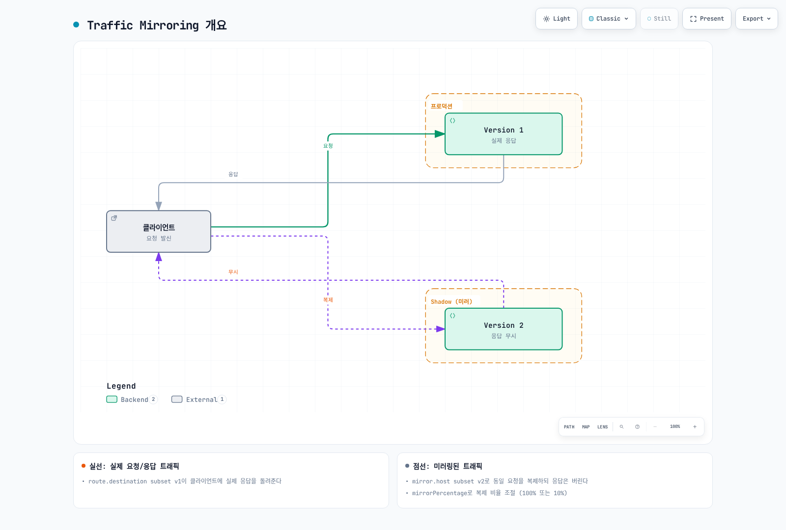

# Traffic Mirroring

Traffic Mirroring(또는 Shadow Traffic)은 프로덕션 트래픽을 실시간으로 복제하여 새 버전을 테스트하는 기법입니다.

## 목차

1. [Traffic Mirroring 개요](#traffic-mirroring-개요)
2. [기본 설정](#기본-설정)
3. [부분 미러링](#부분-미러링)
4. [실전 예제](#실전-예제)
5. [모범 사례](#모범-사례)

## Traffic Mirroring 개요



[🔍 인터랙티브 다이어그램 보기](https://www.atomai.click/kubernetes-docs/archmaps/ko-service-mesh-istio-traffic-management-09-traffic-mirror-0.html)

## 기본 설정

```yaml
apiVersion: networking.istio.io/v1
kind: VirtualService
metadata:
  name: reviews-mirror
spec:
  hosts:
  - reviews
  http:
  - route:
    - destination:
        host: reviews
        subset: v1
      weight: 100
    mirror:
      host: reviews
      subset: v2
    mirrorPercentage:
      value: 100  # 100% 미러링
```

## 부분 미러링

```yaml
apiVersion: networking.istio.io/v1
kind: VirtualService
metadata:
  name: reviews-partial-mirror
spec:
  hosts:
  - reviews
  http:
  - route:
    - destination:
        host: reviews
        subset: v1
    mirror:
      host: reviews
      subset: v2
    mirrorPercentage:
      value: 10  # 10%만 미러링
```

## 참고 자료

- [Istio Traffic Mirroring](https://istio.io/latest/docs/tasks/traffic-management/mirroring/)
