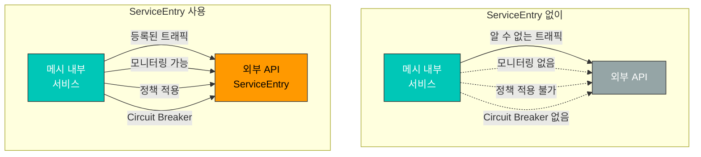
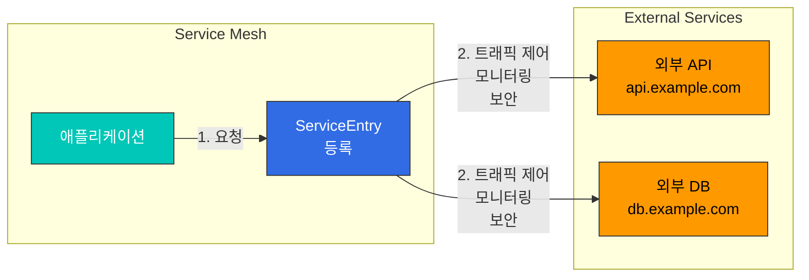

# ServiceEntry

ServiceEntry는 Istio 서비스 메시에 외부 서비스를 등록하여 메시 내부 서비스처럼 관리할 수 있게 합니다.

## 목차

1. [Why ServiceEntry?](#why-serviceentry)
2. [ServiceEntry 개요](#serviceentry-개요)
3. [Resolution 모드](#resolution-모드)
4. [Location 설정](#location-설정)
5. [실전 예제](#실전-예제)
6. [Egress Gateway와 조합](#egress-gateway와-조합)
7. [보안 및 TLS](#보안-및-tls)
8. [모니터링 및 제어](#모니터링-및-제어)
9. [모범 사례](#모범-사례)

## Why ServiceEntry?

### 외부 서비스 관리의 필요성

Istio 메시는 기본적으로 외부 서비스에 대한 트래픽을 제어하지 않습니다. ServiceEntry를 사용하면:



### 주요 이점

| 기능 | ServiceEntry 없이 | ServiceEntry 사용 |
|------|------------------|------------------|
| **모니터링** | 블랙홀 | 전체 메트릭 수집 |
| **트래픽 제어** | 불가능 | Timeout, Retry, Circuit Breaker |
| **보안** | 제한적 | mTLS, 인증서 관리 |
| **Egress Control** | 모든 외부 트래픽 허용 | 명시적 허용/차단 |
| **서비스 디스커버리** | 수동 관리 | 자동 DNS 조회 |

## ServiceEntry 개요

ServiceEntry는 외부 서비스를 Istio 서비스 레지스트리에 추가합니다.



### 기본 구조

```yaml
apiVersion: networking.istio.io/v1
kind: ServiceEntry
metadata:
  name: external-api
spec:
  hosts:                  # 외부 서비스 호스트명
  - api.example.com
  ports:                  # 포트 및 프로토콜
  - number: 443
    name: https
    protocol: HTTPS
  location: MESH_EXTERNAL # 외부/내부 위치
  resolution: DNS         # 주소 해석 방법
```

## Resolution 모드

ServiceEntry는 4가지 주소 해석 모드를 지원합니다.

### 1. DNS Resolution

가장 일반적인 모드로, DNS를 통해 IP 주소를 동적으로 해석합니다.

```yaml
apiVersion: networking.istio.io/v1
kind: ServiceEntry
metadata:
  name: external-api-dns
spec:
  hosts:
  - api.example.com
  ports:
  - number: 443
    name: https
    protocol: HTTPS
  location: MESH_EXTERNAL
  resolution: DNS  # DNS 조회
```

**사용 사례**:
- 공개 API (AWS S3, Google Cloud Storage)
- SaaS 서비스 (Stripe, SendGrid)
- 클라우드 관리 서비스

### 2. STATIC Resolution

고정 IP 주소를 명시적으로 지정합니다.

```yaml
apiVersion: networking.istio.io/v1
kind: ServiceEntry
metadata:
  name: external-api-static
spec:
  hosts:
  - legacy-api.company.internal
  addresses:
  - 10.10.10.10
  - 10.10.10.11
  ports:
  - number: 8080
    name: http
    protocol: HTTP
  location: MESH_EXTERNAL
  resolution: STATIC  # 고정 IP
  endpoints:
  - address: 10.10.10.10
  - address: 10.10.10.11
```

**사용 사례**:
- 레거시 시스템 (DNS 없음)
- 고정 IP가 필요한 규정 준수
- 내부 데이터센터 서비스

### 3. NONE Resolution

주소 해석을 수행하지 않고, 클라이언트가 제공한 주소를 그대로 사용합니다.

```yaml
apiVersion: networking.istio.io/v1
kind: ServiceEntry
metadata:
  name: wildcard-api
spec:
  hosts:
  - "*.api.example.com"  # 와일드카드
  ports:
  - number: 443
    name: https
    protocol: HTTPS
  location: MESH_EXTERNAL
  resolution: NONE  # 주소 해석 없음
```

**사용 사례**:
- 와일드카드 도메인
- 클라이언트 측 로드 밸런싱
- TCP/TLS 프록시

### 4. DNS_ROUND_ROBIN Resolution (Deprecated)

DNS 라운드 로빈을 사용합니다 (현재는 DNS 모드로 통합).

## Location 설정

### MESH_EXTERNAL (외부 서비스)

메시 외부의 서비스를 등록합니다.

```yaml
apiVersion: networking.istio.io/v1
kind: ServiceEntry
metadata:
  name: external-service
spec:
  hosts:
  - external-api.com
  ports:
  - number: 443
    name: https
    protocol: HTTPS
  location: MESH_EXTERNAL  # 외부 서비스
  resolution: DNS
```

**특징**:
- mTLS가 적용되지 않음
- Egress Gateway를 통해 나갈 수 있음
- 외부 트래픽으로 분류

### MESH_INTERNAL (내부 서비스)

메시 내부 서비스로 취급합니다 (드물게 사용).

```yaml
apiVersion: networking.istio.io/v1
kind: ServiceEntry
metadata:
  name: internal-vm-service
spec:
  hosts:
  - vm-service.internal
  ports:
  - number: 8080
    name: http
    protocol: HTTP
  location: MESH_INTERNAL  # 내부 서비스처럼 취급
  resolution: STATIC
  endpoints:
  - address: 10.0.0.5
    labels:
      app: vm-service
```

**사용 사례**:
- VM 워크로드를 메시에 포함
- Multi-cluster 환경
- Hybrid cloud 구성

## 실전 예제

### 1. 외부 REST API 등록

#### 시나리오: 결제 게이트웨이 API

```yaml
apiVersion: networking.istio.io/v1
kind: ServiceEntry
metadata:
  name: payment-gateway-api
  namespace: production
spec:
  hosts:
  - api.payment-gateway.com
  ports:
  - number: 443
    name: https
    protocol: HTTPS
  location: MESH_EXTERNAL
  resolution: DNS
---
# VirtualService: Timeout 및 Retry 설정
apiVersion: networking.istio.io/v1
kind: VirtualService
metadata:
  name: payment-gateway-routing
  namespace: production
spec:
  hosts:
  - api.payment-gateway.com
  http:
  - route:
    - destination:
        host: api.payment-gateway.com
    timeout: 10s
    retries:
      attempts: 3
      perTryTimeout: 3s
      retryOn: 5xx,reset,connect-failure
---
# DestinationRule: Circuit Breaker
apiVersion: networking.istio.io/v1
kind: DestinationRule
metadata:
  name: payment-gateway-circuit-breaker
  namespace: production
spec:
  host: api.payment-gateway.com
  trafficPolicy:
    connectionPool:
      http:
        http1MaxPendingRequests: 10
        maxRequestsPerConnection: 1
    outlierDetection:
      consecutiveErrors: 3
      interval: 30s
      baseEjectionTime: 120s
    tls:
      mode: SIMPLE  # TLS 연결
```

### 2. 외부 데이터베이스 등록

#### 시나리오: AWS RDS MySQL

```yaml
apiVersion: networking.istio.io/v1
kind: ServiceEntry
metadata:
  name: aws-rds-mysql
spec:
  hosts:
  - mydb.abc123.us-west-2.rds.amazonaws.com
  ports:
  - number: 3306
    name: tcp
    protocol: TCP
  location: MESH_EXTERNAL
  resolution: DNS
---
apiVersion: networking.istio.io/v1
kind: DestinationRule
metadata:
  name: aws-rds-mysql-circuit-breaker
spec:
  host: mydb.abc123.us-west-2.rds.amazonaws.com
  trafficPolicy:
    connectionPool:
      tcp:
        maxConnections: 100
        connectTimeout: 5s
    outlierDetection:
      consecutiveErrors: 5
      interval: 60s
      baseEjectionTime: 60s
```

### 3. 와일드카드 도메인 등록

#### 시나리오: AWS S3 버킷 접근

```yaml
apiVersion: networking.istio.io/v1
kind: ServiceEntry
metadata:
  name: aws-s3-buckets
spec:
  hosts:
  - "*.s3.amazonaws.com"
  - "*.s3.*.amazonaws.com"
  - "*.s3-*.amazonaws.com"
  ports:
  - number: 443
    name: https
    protocol: HTTPS
  location: MESH_EXTERNAL
  resolution: NONE  # 와일드카드는 NONE 사용
```

### 4. 여러 엔드포인트가 있는 외부 서비스

#### 시나리오: 멀티 리전 API

```yaml
apiVersion: networking.istio.io/v1
kind: ServiceEntry
metadata:
  name: multi-region-api
spec:
  hosts:
  - api.global-service.com
  ports:
  - number: 443
    name: https
    protocol: HTTPS
  location: MESH_EXTERNAL
  resolution: DNS
---
apiVersion: networking.istio.io/v1
kind: VirtualService
metadata:
  name: multi-region-routing
spec:
  hosts:
  - api.global-service.com
  http:
  # 지역별 라우팅
  - match:
    - headers:
        x-region:
          exact: "us-west"
    route:
    - destination:
        host: api.global-service.com
      headers:
        request:
          set:
            Host: us-west.api.global-service.com

  - match:
    - headers:
        x-region:
          exact: "eu-central"
    route:
    - destination:
        host: api.global-service.com
      headers:
        request:
          set:
            Host: eu-central.api.global-service.com

  # 기본 라우팅
  - route:
    - destination:
        host: api.global-service.com
```

### 5. TCP 서비스 등록

#### 시나리오: 외부 Redis 클러스터

```yaml
apiVersion: networking.istio.io/v1
kind: ServiceEntry
metadata:
  name: external-redis
spec:
  hosts:
  - redis.external-cluster.com
  addresses:
  - 203.0.113.10
  - 203.0.113.11
  ports:
  - number: 6379
    name: tcp
    protocol: TCP
  location: MESH_EXTERNAL
  resolution: STATIC
  endpoints:
  - address: 203.0.113.10
    labels:
      instance: primary
  - address: 203.0.113.11
    labels:
      instance: replica
---
apiVersion: networking.istio.io/v1
kind: DestinationRule
metadata:
  name: external-redis-lb
spec:
  host: redis.external-cluster.com
  trafficPolicy:
    loadBalancer:
      simple: ROUND_ROBIN
    connectionPool:
      tcp:
        maxConnections: 50
        connectTimeout: 3s
```

## Egress Gateway와 조합

Egress Gateway를 통해 외부 트래픽을 중앙에서 제어합니다.

### 기본 Egress Gateway 설정

```yaml
# ServiceEntry: 외부 서비스 등록
apiVersion: networking.istio.io/v1
kind: ServiceEntry
metadata:
  name: external-api
spec:
  hosts:
  - api.example.com
  ports:
  - number: 443
    name: https
    protocol: HTTPS
  location: MESH_EXTERNAL
  resolution: DNS
---
# Gateway: Egress Gateway 설정
apiVersion: networking.istio.io/v1
kind: Gateway
metadata:
  name: egress-gateway
spec:
  selector:
    istio: egressgateway
  servers:
  - port:
      number: 443
      name: https
      protocol: HTTPS
    hosts:
    - api.example.com
    tls:
      mode: PASSTHROUGH
---
# VirtualService: 메시 내부 → Egress Gateway
apiVersion: networking.istio.io/v1
kind: VirtualService
metadata:
  name: direct-api-through-egress
spec:
  hosts:
  - api.example.com
  gateways:
  - mesh
  - egress-gateway
  http:
  - match:
    - gateways:
      - mesh
      port: 443
    route:
    - destination:
        host: istio-egressgateway.istio-system.svc.cluster.local
        port:
          number: 443
  - match:
    - gateways:
      - egress-gateway
      port: 443
    route:
    - destination:
        host: api.example.com
        port:
          number: 443
```

### TLS Origination (메시 내부는 HTTP, 외부는 HTTPS)

```yaml
apiVersion: networking.istio.io/v1
kind: ServiceEntry
metadata:
  name: external-http-to-https
spec:
  hosts:
  - api.secure-service.com
  ports:
  - number: 80
    name: http
    protocol: HTTP
  - number: 443
    name: https
    protocol: HTTPS
  location: MESH_EXTERNAL
  resolution: DNS
---
apiVersion: networking.istio.io/v1
kind: DestinationRule
metadata:
  name: originate-tls
spec:
  host: api.secure-service.com
  trafficPolicy:
    portLevelSettings:
    - port:
        number: 80
      tls:
        mode: SIMPLE  # HTTP → HTTPS 변환
```

## 보안 및 TLS

### mTLS to External Service

```yaml
apiVersion: networking.istio.io/v1
kind: ServiceEntry
metadata:
  name: mtls-external-service
spec:
  hosts:
  - mtls-api.example.com
  ports:
  - number: 443
    name: https
    protocol: HTTPS
  location: MESH_EXTERNAL
  resolution: DNS
---
apiVersion: networking.istio.io/v1
kind: DestinationRule
metadata:
  name: mtls-external-tls
spec:
  host: mtls-api.example.com
  trafficPolicy:
    tls:
      mode: MUTUAL
      clientCertificate: /etc/certs/client-cert.pem
      privateKey: /etc/certs/client-key.pem
      caCertificates: /etc/certs/ca-cert.pem
```

### SNI Routing

```yaml
apiVersion: networking.istio.io/v1
kind: Gateway
metadata:
  name: egress-sni-gateway
spec:
  selector:
    istio: egressgateway
  servers:
  - port:
      number: 443
      name: tls
      protocol: TLS
    hosts:
    - api.example.com
    - api2.example.com
    tls:
      mode: PASSTHROUGH
---
apiVersion: networking.istio.io/v1
kind: VirtualService
metadata:
  name: sni-routing
spec:
  hosts:
  - api.example.com
  - api2.example.com
  gateways:
  - mesh
  - egress-sni-gateway
  tls:
  - match:
    - gateways:
      - mesh
      port: 443
      sniHosts:
      - api.example.com
    route:
    - destination:
        host: istio-egressgateway.istio-system.svc.cluster.local
        port:
          number: 443
  - match:
    - gateways:
      - egress-sni-gateway
      port: 443
      sniHosts:
      - api.example.com
    route:
    - destination:
        host: api.example.com
        port:
          number: 443
```

## 모니터링 및 제어

### 메트릭 수집

```bash
# ServiceEntry 트래픽 확인
kubectl exec -it <pod-name> -c istio-proxy -- \
  curl localhost:15000/stats/prometheus | grep "api.example.com"

# Egress 트래픽 메트릭
istio_requests_total{destination_service_name="api.example.com"}
```

### Prometheus 쿼리

```yaml
# 외부 서비스 요청 수
sum(rate(istio_requests_total{destination_service_namespace="",destination_service_name="api.example.com"}[5m]))

# 외부 서비스 에러율
sum(rate(istio_requests_total{destination_service_name="api.example.com",response_code=~"5.."}[5m])) /
sum(rate(istio_requests_total{destination_service_name="api.example.com"}[5m]))

# 외부 서비스 응답 시간
histogram_quantile(0.95,
  sum(rate(istio_request_duration_milliseconds_bucket{destination_service_name="api.example.com"}[5m])) by (le)
)
```

### Egress 트래픽 차단

```yaml
# 기본적으로 모든 Egress 차단
apiVersion: networking.istio.io/v1
kind: Sidecar
metadata:
  name: default
  namespace: default
spec:
  egress:
  - hosts:
    - "./*"  # 같은 네임스페이스만 허용
    - "istio-system/*"  # istio-system 허용
  outboundTrafficPolicy:
    mode: REGISTRY_ONLY  # ServiceEntry에 등록된 것만 허용
```

## 모범 사례

### 1. 명시적 ServiceEntry 등록

```yaml
# ✅ 좋은 예: 명시적 등록
apiVersion: networking.istio.io/v1
kind: ServiceEntry
metadata:
  name: payment-api
  namespace: production
  annotations:
    description: "Payment gateway API"
    owner: "payments-team"
    sla: "99.9%"
spec:
  hosts:
  - api.payment.com
  ports:
  - number: 443
    name: https
    protocol: HTTPS
  location: MESH_EXTERNAL
  resolution: DNS
```

### 2. Circuit Breaker 필수 적용

```yaml
# 외부 서비스는 항상 Circuit Breaker 적용
apiVersion: networking.istio.io/v1
kind: DestinationRule
metadata:
  name: external-api-protection
spec:
  host: api.example.com
  trafficPolicy:
    connectionPool:
      http:
        http1MaxPendingRequests: 10
        maxRequestsPerConnection: 1
    outlierDetection:
      consecutiveErrors: 3
      interval: 30s
      baseEjectionTime: 120s
```

### 3. Timeout 설정

```yaml
# 외부 서비스는 명시적 Timeout 설정
apiVersion: networking.istio.io/v1
kind: VirtualService
metadata:
  name: external-api-timeout
spec:
  hosts:
  - api.example.com
  http:
  - route:
    - destination:
        host: api.example.com
    timeout: 10s  # 명시적 Timeout
    retries:
      attempts: 2
      perTryTimeout: 5s
```

### 4. Egress Gateway 사용 (프로덕션)

```yaml
# 프로덕션에서는 Egress Gateway를 통해 외부 트래픽 제어
# - 중앙 집중식 모니터링
# - IP 화이트리스트 관리 용이
# - 보안 정책 일관성
```

### 5. 네임스페이스별 격리

```yaml
# 네임스페이스별로 ServiceEntry 격리
apiVersion: networking.istio.io/v1
kind: Sidecar
metadata:
  name: default
  namespace: team-a
spec:
  egress:
  - hosts:
    - "team-a/*"  # 자신의 네임스페이스만
    - "istio-system/*"
    - "external/*"  # 공유 외부 서비스
  outboundTrafficPolicy:
    mode: REGISTRY_ONLY
```

### 6. 문서화 템플릿

```yaml
apiVersion: networking.istio.io/v1
kind: ServiceEntry
metadata:
  name: external-service
  annotations:
    # 서비스 정보
    service-description: "Third-party payment API"
    service-owner: "payments-team@company.com"
    service-documentation: "https://wiki.company.com/payment-api"

    # SLA 정보
    sla-availability: "99.9%"
    sla-latency-p95: "500ms"
    rate-limit: "1000 req/min"

    # 비용 정보
    cost-per-request: "$0.01"
    monthly-budget: "$10000"

    # 장애 대응
    oncall: "payments-oncall"
    escalation: "CTO"
    fallback-strategy: "Use cached data"
```

## 참고 자료

- [Istio ServiceEntry](https://istio.io/latest/docs/reference/config/networking/service-entry/)
- [Istio Egress Traffic](https://istio.io/latest/docs/tasks/traffic-management/egress/)
- [Istio TLS Origination](https://istio.io/latest/docs/tasks/traffic-management/egress/egress-tls-origination/)
- [Envoy External Services](https://www.envoyproxy.io/docs/envoy/latest/intro/arch_overview/upstream/service_discovery)
