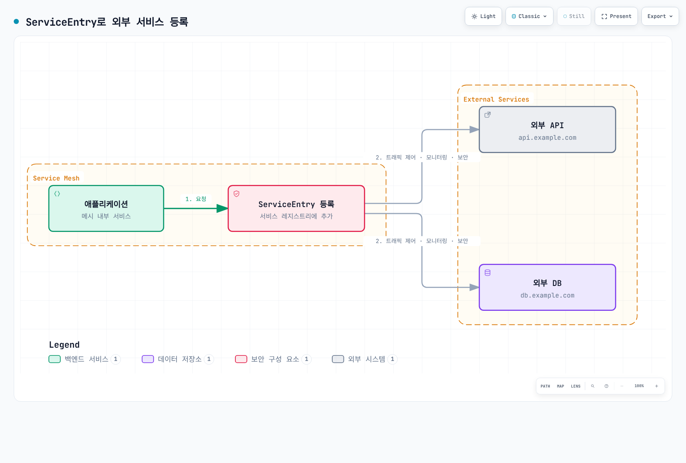

# ServiceEntry

ServiceEntry는 Istio 서비스 메시에 외부 서비스를 등록하여 메시 내부 서비스처럼 관리할 수 있게 합니다.

## 목차

1. [Why ServiceEntry?](#why-serviceentry)
2. [ServiceEntry 개요](#serviceentry-개요)
3. [Resolution 모드](#resolution-모드)
4. [Location 설정](#location-설정)
5. [실전 예제](#실전-예제)
6. [Egress Gateway와 조합](#egress-gateway와-조합)
7. [보안 및 TLS](#보안-및-tls)
8. [모니터링 및 제어](#모니터링-및-제어)
9. [모범 사례](#모범-사례)

## Why ServiceEntry?

### 외부 서비스 관리의 필요성

ALLOW_ANY에서는 미등록 외부 목적지가 제한적인 정책/텔레메트리로 통과할 수 있습니다. ServiceEntry는 목적지를 등록해 호환 프록시 정책을 적용할 수 있게 하며 접근 제어 규칙 자체는 아닙니다.

등록은 목적지별 구성을 가능하게 하며 실제 모니터링·TLS·트래픽 제어는 프로토콜과 적용한 정책에 따라 달라집니다.

### 주요 이점

| 기능 | ServiceEntry 없이 | ServiceEntry 사용 |
|------|------------------|------------------|
| **모니터링** | 제한적 패스스루 텔레메트리 | 프로토콜별 텔레메트리; HTTP는 L7 가시성 필요 |
| **트래픽 제어** | 불가능 | Timeout, Retry, Circuit Breaker |
| **보안** | 앱 TLS는 계속 적용 가능 | TLS/mTLS 별도 구성; 외부 인증서 자동 발급 없음 |
| **Egress Control** | Depends on outbound/network policy | Registry and routing configuration; network enforcement is separate |
| **서비스 디스커버리** | 수동 관리 | 자동 DNS 조회 |

## ServiceEntry 개요

각 예제는 독립적인 Sidecar 구성입니다. ServiceEntry는 istiod/프록시의 설정 입력이며 네트워크 홉이 아닙니다. addresses는 서비스/VIP 트래픽 식별용이고 endpoints는 실제 업스트림입니다. resolution은 프록시 조회를 제어하며 앱 DNS를 생성하지 않으므로 가상 호스트에는 DNS 레코드 또는 DNS 캡처가 필요합니다. VM 프록시 등록이나 ID 자격 증명 발급도 별도입니다.

ServiceEntry는 외부 서비스를 Istio 서비스 레지스트리에 추가합니다.



[🔍 인터랙티브 다이어그램 보기](https://www.atomai.click/kubernetes-docs/archmaps/ko-service-mesh-istio-traffic-management-12-service-entry-1.html)

### 기본 구조

```yaml
apiVersion: networking.istio.io/v1
kind: ServiceEntry
metadata:
  name: external-api
spec:
  hosts:                  # 외부 서비스 호스트명
  - api.example.com
  ports:                  # 포트 및 프로토콜
  - number: 443
    name: https
    protocol: HTTPS
  location: MESH_EXTERNAL # 외부/내부 위치
  resolution: DNS         # 주소 해석 방법
```

## Resolution 모드

Istio 1.31 API는 다섯 가지 주소 해석 모드를 정의합니다.

### 1. DNS Resolution

가장 일반적인 모드로, DNS를 통해 IP 주소를 동적으로 해석합니다.

```yaml
apiVersion: networking.istio.io/v1
kind: ServiceEntry
metadata:
  name: external-api-dns
spec:
  hosts:
  - api.example.com
  ports:
  - number: 443
    name: https
    protocol: HTTPS
  location: MESH_EXTERNAL
  resolution: DNS  # DNS 조회
```

**사용 사례**:
- 공개 API (AWS S3, Google Cloud Storage)
- SaaS 서비스 (Stripe, SendGrid)
- 클라우드 관리 서비스

### 2. STATIC Resolution

고정 IP 주소를 명시적으로 지정합니다.

```yaml
apiVersion: networking.istio.io/v1
kind: ServiceEntry
metadata:
  name: external-api-static
spec:
  hosts:
  - legacy-api.company.internal
  addresses:
  - 10.10.10.10
  - 10.10.10.11
  ports:
  - number: 8080
    name: http
    protocol: HTTP
  location: MESH_EXTERNAL
  resolution: STATIC  # 고정 IP
  endpoints:
  - address: 10.10.10.10
  - address: 10.10.10.11
```

**사용 사례**:
- 레거시 시스템 (DNS 없음)
- 고정 IP가 필요한 규정 준수
- 내부 데이터센터 서비스

### 3. NONE Resolution

주소 해석을 수행하지 않고, 클라이언트가 제공한 주소를 그대로 사용합니다.

```yaml
apiVersion: networking.istio.io/v1
kind: ServiceEntry
metadata:
  name: wildcard-api
spec:
  hosts:
  - "*.api.example.com"  # 와일드카드
  ports:
  - number: 443
    name: https
    protocol: HTTPS
  location: MESH_EXTERNAL
  resolution: NONE  # 주소 해석 없음
```

**사용 사례**:
- 와일드카드 도메인
- 클라이언트 측 로드 밸런싱
- TCP/TLS 프록시

### 4. DNS_ROUND_ROBIN Resolution

지원되는 모드이며 사용 중단되지 않았습니다. 전체 DNS 엔드포인트 집합을 사용하는 DNS 모드와 달리 새 연결 시 첫 DNS 주소를 사용하고 DNS 레코드가 바뀌어도 기존 연결을 유지합니다. DNS 엔드포인트 변경으로 연결 풀이 계속 재생성되는 것을 피해야 하는 서비스에 적합합니다.

### 5. DYNAMIC_DNS Resolution

요청의 HTTP Host/SNI를 이용해 와일드카드 목적지를 조회합니다. 사용 가능 여부는 릴리스·Data Plane·waypoint 구성에 따라 달라지며 호스트명을 복원할 수 없는 불투명 TCP에는 적용할 수 없습니다. 모드별 요구사항을 확인하세요. 아래 구체적인 와일드카드 예제는 Sidecar NONE 모드를 사용합니다.

## Location 설정

### MESH_EXTERNAL (외부 서비스)

메시 외부의 서비스를 등록합니다.

```yaml
apiVersion: networking.istio.io/v1
kind: ServiceEntry
metadata:
  name: external-service
spec:
  hosts:
  - external-api.com
  ports:
  - number: 443
    name: https
    protocol: HTTPS
  location: MESH_EXTERNAL  # 외부 서비스
  resolution: DNS
```

**특징**:
- 적절한 DestinationRule과 서버 신뢰 구성이 있으면 외부 TLS/mTLS 가능
- Egress Gateway를 통해 나갈 수 있음
- 외부 트래픽으로 분류

### MESH_INTERNAL (내부 서비스)

메시 내부 서비스로 취급합니다 (드물게 사용).

```yaml
apiVersion: networking.istio.io/v1
kind: ServiceEntry
metadata:
  name: internal-vm-service
spec:
  hosts:
  - vm-service.internal
  ports:
  - number: 8080
    name: http
    protocol: HTTP
  location: MESH_INTERNAL  # 내부 서비스처럼 취급
  resolution: STATIC
  endpoints:
  - address: 10.0.0.5
    labels:
      app: vm-service
```

**사용 사례**:
- VM 워크로드를 메시에 포함
- Multi-cluster 환경
- Hybrid cloud 구성

## 실전 예제

### 1. 외부 REST API 등록

#### 시나리오: 결제 게이트웨이 API

```yaml
apiVersion: networking.istio.io/v1
kind: ServiceEntry
metadata:
  name: payment-gateway-api
  namespace: production
spec:
  hosts:
  - api.payment-gateway.com
  ports:
  - number: 80
    name: http
    protocol: HTTP
    targetPort: 443
  location: MESH_EXTERNAL
  resolution: DNS
---
# VirtualService: Timeout 및 Retry 설정
apiVersion: networking.istio.io/v1
kind: VirtualService
metadata:
  name: payment-gateway-routing
  namespace: production
spec:
  hosts:
  - api.payment-gateway.com
  http:
  - match:
    - method:
        regex: "^(GET|HEAD)$"
    route:
    - destination:
        host: api.payment-gateway.com
    timeout: 10s
    retries:
      attempts: 3
      perTryTimeout: 3s
      retryOn: connect-failure,refused-stream
  - route:
    - destination:
        host: api.payment-gateway.com
    timeout: 10s
    retries:
      attempts: 0
---
# DestinationRule: Circuit Breaker
apiVersion: networking.istio.io/v1
kind: DestinationRule
metadata:
  name: payment-gateway-circuit-breaker
  namespace: production
spec:
  host: api.payment-gateway.com
  trafficPolicy:
    connectionPool:
      http:
        http1MaxPendingRequests: 10
        maxRequestsPerConnection: 1
    outlierDetection:
      consecutive5xxErrors: 3
      interval: 30s
      baseEjectionTime: 120s
    tls:
      mode: SIMPLE
      sni: api.payment-gateway.com
      subjectAltNames: [api.payment-gateway.com]
```

이 Origination 구성에서는 앱이 로컬 Sidecar에 HTTP를 보내고 프록시가 검증된 HTTPS를 업스트림에 전송합니다. 앱이 직접 시작한 HTTPS와 중복 사용하지 마세요. 결제 쓰기는 재시도 활성화 전에 앱 멱등 계약이 필요합니다.

### 2. 외부 데이터베이스 등록

#### 시나리오: AWS RDS MySQL

```yaml
apiVersion: networking.istio.io/v1
kind: ServiceEntry
metadata:
  name: aws-rds-mysql
spec:
  hosts:
  - mydb.abc123.us-west-2.rds.amazonaws.com
  ports:
  - number: 3306
    name: tcp
    protocol: TCP
  location: MESH_EXTERNAL
  resolution: DNS
---
apiVersion: networking.istio.io/v1
kind: DestinationRule
metadata:
  name: aws-rds-mysql-circuit-breaker
spec:
  host: mydb.abc123.us-west-2.rds.amazonaws.com
  trafficPolicy:
    connectionPool:
      tcp:
        maxConnections: 100
        connectTimeout: 5s
    outlierDetection:
      consecutive5xxErrors: 5
      interval: 60s
      baseEjectionTime: 60s
```

### 3. 와일드카드 도메인 등록

RDS TLS와 인증서 검증은 현재 RDS CA 번들을 사용해 DB 드라이버에서 구성하세요. TCP 등록이 DB 인증이나 SSL 협상을 설정하지는 않습니다. 같은 포트의 외부 DB가 여러 개면 DNS 캡처/고유 서비스 VIP로 포트만으로 구분하는 모호함을 피하세요.

#### 시나리오: AWS S3 버킷 접근

```yaml
apiVersion: networking.istio.io/v1
kind: ServiceEntry
metadata:
  name: aws-s3-buckets
spec:
  hosts:
  - "*.s3.amazonaws.com"
  - "*.s3.us-west-2.amazonaws.com"
  - "s3.us-west-2.amazonaws.com"
  ports:
  - number: 443
    name: https
    protocol: HTTPS
  location: MESH_EXTERNAL
  resolution: NONE  # 와일드카드는 NONE 사용
```

와일드카드는 호스트 앞부분 접두사만 유효합니다. 이름 중간에 *를 넣지 말고 실제 리전별 접미사를 나열하세요. Sidecar 예제이며 모든 S3 엔드포인트 유형을 포함하거나 IAM 권한을 부여하지 않습니다.

### 4. 여러 엔드포인트가 있는 외부 서비스

#### 시나리오: 멀티 리전 API

```yaml
apiVersion: networking.istio.io/v1
kind: ServiceEntry
metadata:
  name: multi-region-api
spec:
  hosts:
  - api.global-service.com
  ports:
  - number: 80
    name: http
    protocol: HTTP
    targetPort: 443
  location: MESH_EXTERNAL
  resolution: DNS
  endpoints:
  - address: us-west.api.global-service.com
    labels:
      region: us-west
  - address: eu-central.api.global-service.com
    labels:
      region: eu-central
---
apiVersion: networking.istio.io/v1
kind: DestinationRule
metadata:
  name: multi-region-api
spec:
  host: api.global-service.com
  trafficPolicy:
    tls:
      mode: SIMPLE
      sni: api.global-service.com
      subjectAltNames: [api.global-service.com]
  subsets:
  - name: us-west
    labels:
      region: us-west
  - name: eu-central
    labels:
      region: eu-central
---
apiVersion: networking.istio.io/v1
kind: VirtualService
metadata:
  name: multi-region-routing
spec:
  hosts:
  - api.global-service.com
  http:
  - match:
    - headers:
        x-region:
          exact: us-west
    route:
    - destination:
        host: api.global-service.com
        subset: us-west
  - match:
    - headers:
        x-region:
          exact: eu-central
    route:
    - destination:
        host: api.global-service.com
        subset: eu-central
  - route:
    - destination:
        host: api.global-service.com
```

두 리전 엔드포인트가 동일한 정식 API 호스트/인증서를 제공해야 합니다. HTTP Host 헤더만 바꿔도 프록시가 선택한 DNS 엔드포인트가 바뀌지는 않습니다. 앱은 로컬 HTTP를 사용하고 업스트림 TLS는 위처럼 생성합니다.

### 5. TCP 서비스 등록

#### 시나리오: 외부 Redis 클러스터

```yaml
apiVersion: networking.istio.io/v1
kind: ServiceEntry
metadata:
  name: external-redis
spec:
  hosts:
  - redis-primary.external-cluster.com
  addresses:
  - 203.0.113.10
  ports:
  - number: 6379
    name: tcp
    protocol: TCP
  location: MESH_EXTERNAL
  resolution: STATIC
  endpoints:
  - address: 203.0.113.10
    labels:
      instance: primary
---
apiVersion: networking.istio.io/v1
kind: DestinationRule
metadata:
  name: external-redis-lb
spec:
  host: redis-primary.external-cluster.com
  trafficPolicy:
    loadBalancer:
      simple: ROUND_ROBIN
    connectionPool:
      tcp:
        maxConnections: 50
        connectTimeout: 3s
```

이 예제는 쓰기 가능한 primary만 선택합니다. Replica 읽기는 별도 등록하거나 Redis 클러스터 전용 클라이언트를 사용하세요. 일반 Round Robin은 primary/replica 및 샤딩 의미를 보존하지 못합니다. 예시 IP는 연결 가능한 실제 값으로 바꾸세요.

## Egress Gateway와 조합

Egress Gateway를 통해 외부 트래픽을 중앙에서 제어합니다.

### 기본 Egress Gateway 설정

```yaml
# ServiceEntry: 외부 서비스 등록
apiVersion: networking.istio.io/v1
kind: ServiceEntry
metadata:
  name: external-api
spec:
  hosts:
  - api.example.com
  ports:
  - number: 443
    name: https
    protocol: HTTPS
  location: MESH_EXTERNAL
  resolution: DNS
---
# Gateway: Egress Gateway 설정
apiVersion: networking.istio.io/v1
kind: Gateway
metadata:
  name: egress-gateway
  namespace: istio-system
spec:
  selector:
    istio: egressgateway
  servers:
  - port:
      number: 443
      name: tls
      protocol: TLS
    hosts:
    - api.example.com
    tls:
      mode: PASSTHROUGH
---
# VirtualService: 메시 내부 → Egress Gateway
apiVersion: networking.istio.io/v1
kind: VirtualService
metadata:
  name: direct-api-through-egress
spec:
  hosts:
  - api.example.com
  gateways:
  - mesh
  - istio-system/egress-gateway
  tls:
  - match:
    - gateways:
      - mesh
      port: 443
      sniHosts:
      - api.example.com
    route:
    - destination:
        host: istio-egressgateway.istio-system.svc.cluster.local
        port:
          number: 443
  - match:
    - gateways:
      - istio-system/egress-gateway
      port: 443
      sniHosts:
      - api.example.com
    route:
    - destination:
        host: api.example.com
        port:
          number: 443
```

### TLS Origination (메시 내부는 HTTP, 외부는 HTTPS)

```yaml
apiVersion: networking.istio.io/v1
kind: ServiceEntry
metadata:
  name: external-http-to-https
spec:
  hosts:
  - api.secure-service.com
  ports:
  - number: 80
    name: http
    protocol: HTTP
    targetPort: 443
  - number: 443
    name: https
    protocol: HTTPS
  location: MESH_EXTERNAL
  resolution: DNS
---
apiVersion: networking.istio.io/v1
kind: DestinationRule
metadata:
  name: originate-tls
spec:
  host: api.secure-service.com
  trafficPolicy:
    portLevelSettings:
    - port:
        number: 80
      tls:
        mode: SIMPLE  # HTTP → HTTPS 변환
```

## 보안 및 TLS

### mTLS to External Service

```yaml
apiVersion: networking.istio.io/v1
kind: ServiceEntry
metadata:
  name: mtls-external-service
spec:
  hosts:
  - mtls-api.example.com
  ports:
  - number: 80
    name: http
    protocol: HTTP
    targetPort: 443
  location: MESH_EXTERNAL
  resolution: DNS
---
apiVersion: networking.istio.io/v1
kind: DestinationRule
metadata:
  name: mtls-external-tls
spec:
  host: mtls-api.example.com
  trafficPolicy:
    tls:
      mode: MUTUAL
      sni: mtls-api.example.com
      subjectAltNames: [mtls-api.example.com]
      clientCertificate: /etc/certs/client-cert.pem
      privateKey: /etc/certs/client-key.pem
      caCertificates: /etc/certs/ca-cert.pem
```

인증서/키 파일을 프록시 컨테이너에 마운트하고 인증서 관리 절차로 갱신하세요. 외부 서버는 클라이언트 CA를 신뢰해야 하며 ServiceEntry가 이 자격 증명을 발급하지 않습니다. 로컬 HTTP에서 프록시가 mTLS를 시작하는 구성이며 앱 TLS 위의 이중 계층이 아닙니다.

### SNI Routing

```yaml
apiVersion: networking.istio.io/v1
kind: Gateway
metadata:
  name: egress-sni-gateway
  namespace: istio-system
spec:
  selector:
    istio: egressgateway
  servers:
  - port:
      number: 443
      name: tls
      protocol: TLS
    hosts:
    - api.example.com
    - api2.example.com
    tls:
      mode: PASSTHROUGH
---
apiVersion: networking.istio.io/v1
kind: VirtualService
metadata:
  name: sni-routing
spec:
  hosts:
  - api.example.com
  - api2.example.com
  gateways:
  - mesh
  - istio-system/egress-sni-gateway
  tls:
  - match:
    - gateways:
      - mesh
      port: 443
      sniHosts:
      - api.example.com
    route:
    - destination:
        host: istio-egressgateway.istio-system.svc.cluster.local
        port:
          number: 443
  - match:
    - gateways:
      - istio-system/egress-sni-gateway
      port: 443
      sniHosts:
      - api.example.com
    route:
    - destination:
        host: api.example.com
        port:
          number: 443
  - match:
    - gateways:
      - mesh
      port: 443
      sniHosts:
      - api2.example.com
    route:
    - destination:
        host: istio-egressgateway.istio-system.svc.cluster.local
        port:
          number: 443
  - match:
    - gateways:
      - istio-system/egress-sni-gateway
      port: 443
      sniHosts:
      - api2.example.com
    route:
    - destination:
        host: api2.example.com
        port:
          number: 443
```

[Egress 제어](11-egress-control.md)에 따라 Egress Gateway 워크로드/ClusterIP Service를 설치하고 두 외부 호스트를 ServiceEntry로 등록하세요. SNI 규칙은 전달을 구성하지만 모든 트래픽의 게이트웨이 경유를 강제하지는 않으므로 네트워크 정책으로 경계를 집행하세요.

## 모니터링 및 제어

### 메트릭 수집

```bash
# ServiceEntry 트래픽 확인
kubectl exec -it <pod-name> -c istio-proxy -- \
  curl localhost:15000/stats/prometheus | grep "api.example.com"

# Egress 트래픽 메트릭
istio_requests_total{reporter="source",destination_service_name="api.example.com"}
```

### Prometheus 쿼리

쿼리 전에 실제 레이블을 확인하세요. HTTP 요청/오류/지연 메트릭은 TLS Origination 등 L7 가시성이 필요하며 불투명 HTTPS/TCP는 연결/바이트 메트릭을 제공합니다. 외부 ServiceEntry의 namespace 레이블이 빈 문자열이라고 가정하지 마세요.

```promql
# 외부 서비스 요청 수
sum(rate(istio_requests_total{reporter="source",destination_service_name="api.example.com"}[5m]))

# 외부 서비스 에러율
sum(rate(istio_requests_total{reporter="source",destination_service_name="api.example.com",response_code=~"5.."}[5m])) /
sum(rate(istio_requests_total{reporter="source",destination_service_name="api.example.com"}[5m]))

# 외부 서비스 응답 시간
histogram_quantile(0.95,
  sum(rate(istio_request_duration_milliseconds_bucket{reporter="source",destination_service_name="api.example.com"}[5m])) by (le)
)
```

### 미등록 목적지 탐지

```yaml
# 레지스트리/구성 제어이며 방화벽이 아님
apiVersion: networking.istio.io/v1
kind: Sidecar
metadata:
  name: default
  namespace: default
spec:
  egress:
  - hosts:
    - "./*"  # 같은 네임스페이스만 허용
    - "istio-system/*"  # istio-system 허용
  outboundTrafficPolicy:
    mode: REGISTRY_ONLY  # 알려진 Kubernetes/ServiceEntry 목적지
```

Sidecar 구성 범위와 REGISTRY_ONLY는 보안 경계가 아닙니다. 강제 Egress 제어는 네트워크 정책/방화벽과 해당하는 AuthorizationPolicy로 집행하세요.

## 모범 사례

### 1. 명시적 ServiceEntry 등록

```yaml
# ✅ 좋은 예: 명시적 등록
apiVersion: networking.istio.io/v1
kind: ServiceEntry
metadata:
  name: payment-api
  namespace: production
  annotations:
    description: "Payment gateway API"
    owner: "payments-team"
    sla: "99.9%"
spec:
  hosts:
  - api.payment.com
  ports:
  - number: 443
    name: https
    protocol: HTTPS
  location: MESH_EXTERNAL
  resolution: DNS
```

### 2. 프로토콜에 맞는 복원력 정책 조정

```yaml
# 외부 서비스는 항상 Circuit Breaker 적용
apiVersion: networking.istio.io/v1
kind: DestinationRule
metadata:
  name: external-api-protection
spec:
  host: api.example.com
  trafficPolicy:
    connectionPool:
      http:
        http1MaxPendingRequests: 10
        maxRequestsPerConnection: 1
    outlierDetection:
      consecutive5xxErrors: 3
      interval: 30s
      baseEjectionTime: 120s
```

### 3. Timeout 설정

```yaml
# 외부 서비스는 명시적 Timeout 설정
apiVersion: networking.istio.io/v1
kind: VirtualService
metadata:
  name: external-api-timeout
spec:
  hosts:
  - api.example.com
  http:
  - route:
    - destination:
        host: api.example.com
    timeout: 10s  # 명시적 Timeout
    retries:
      attempts: 2
      perTryTimeout: 5s
```

### 4. Egress Gateway 사용 (프로덕션)

```yaml
# 프로덕션에서는 Egress Gateway를 통해 외부 트래픽 제어
# - 중앙 집중식 모니터링
# - IP 화이트리스트 관리 용이
# - 보안 정책 일관성
```

### 5. 네임스페이스별 구성 가시성

```yaml
# 네임스페이스별로 ServiceEntry 격리
apiVersion: networking.istio.io/v1
kind: Sidecar
metadata:
  name: default
  namespace: team-a
spec:
  egress:
  - hosts:
    - "team-a/*"  # 자신의 네임스페이스만
    - "istio-system/*"
    - "external/*"  # 공유 외부 서비스
  outboundTrafficPolicy:
    mode: REGISTRY_ONLY
```

### 6. 문서화 템플릿

```yaml
# Metadata excerpt; replace illustrative SLA/cost values with the actual service contract
metadata:
  name: external-service
  annotations:
    # 서비스 정보
    service-description: "Third-party payment API"
    service-owner: "payments-team@company.com"
    service-documentation: "https://wiki.company.com/payment-api"

    # SLA 정보
    sla-availability: "99.9%"
    sla-latency-p95: "500ms"
    rate-limit: "1000 req/min"

    # 비용 정보
    cost-per-request: "$0.01"
    monthly-budget: "$10000"

    # 장애 대응
    oncall: "payments-oncall"
    escalation: "CTO"
    fallback-strategy: "Use cached data"
```

## 참고 자료

- [Istio ServiceEntry](https://istio.io/latest/docs/reference/config/networking/service-entry/)
- [Istio Egress Traffic](https://istio.io/latest/docs/tasks/traffic-management/egress/)
- [Istio TLS Origination](https://istio.io/latest/docs/tasks/traffic-management/egress/egress-tls-origination/)
- [Envoy External Services](https://www.envoyproxy.io/docs/envoy/latest/intro/arch_overview/upstream/service_discovery)

- [Primary reference 1](https://istio.io/latest/docs/reference/config/networking/service-entry/)
- [Primary reference 2](https://istio.io/latest/docs/ops/configuration/traffic-management/dns-proxy/)
- [Primary reference 3](https://istio.io/latest/docs/reference/config/networking/sidecar/)
- [Primary reference 4](https://istio.io/latest/docs/reference/config/networking/destination-rule/)
- [Primary reference 5](https://istio.io/latest/docs/tasks/traffic-management/egress/egress-gateway/)
- [Primary reference 6](https://istio.io/latest/docs/tasks/traffic-management/egress/egress-tls-origination/)
- [Primary reference 7](https://docs.aws.amazon.com/AmazonS3/latest/userguide/VirtualHosting.html)
- [Primary reference 8](https://docs.aws.amazon.com/AmazonRDS/latest/UserGuide/UsingWithRDS.SSL.html)
