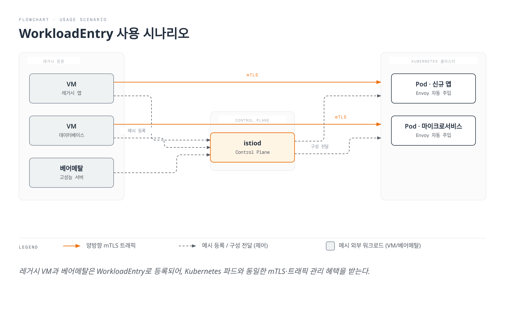
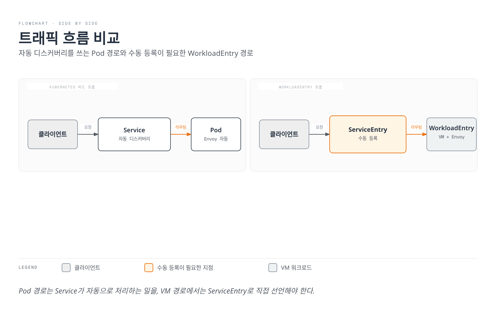
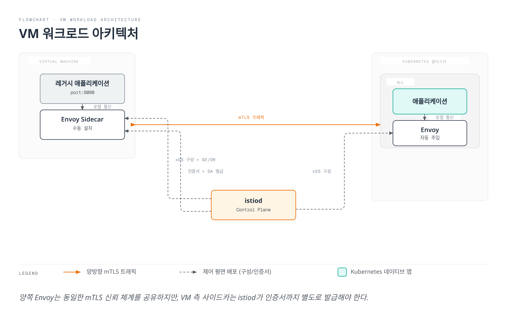
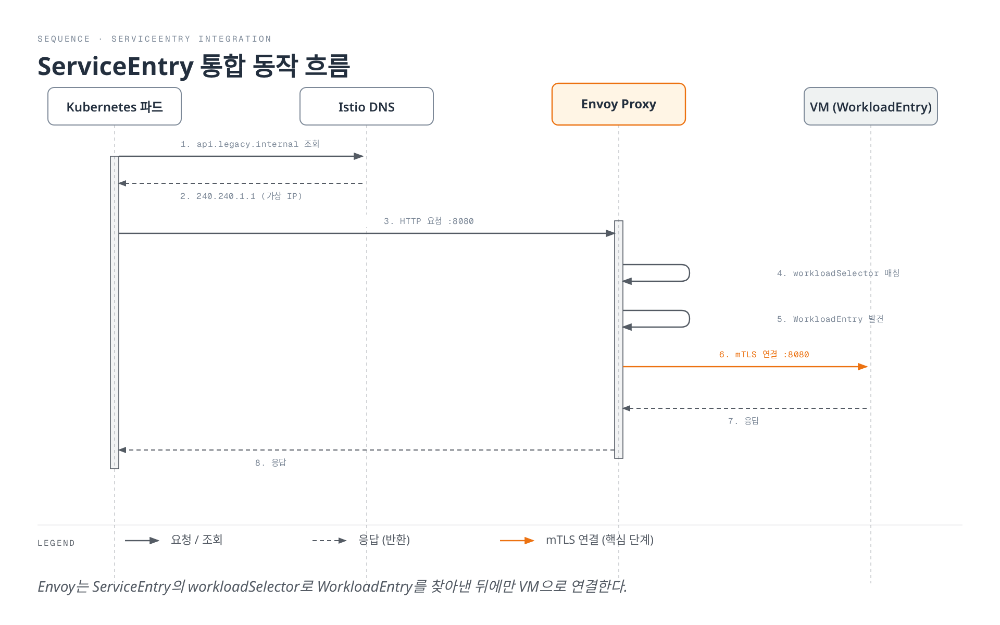
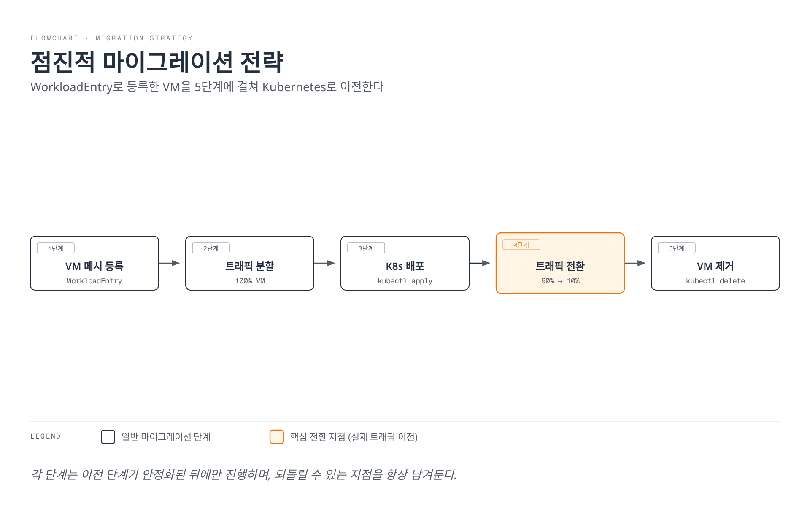

# WorkloadEntry

> **지원 버전**: Istio 1.28+
> **마지막 업데이트**: 2026년 2월 19일

WorkloadEntry는 Virtual Machine (VM)이나 베어메탈 서버를 Istio 서비스 메시에 등록하기 위한 리소스입니다. 이를 통해 Kubernetes 외부의 워크로드도 메시의 트래픽 관리, 보안, 관찰성 기능을 활용할 수 있습니다.

## 목차

1. [개요](#개요)
2. [WorkloadEntry vs Kubernetes Pod](#workloadentry-vs-kubernetes-pod)
3. [아키텍처](#아키텍처)
4. [기본 사용법](#기본-사용법)
5. [ServiceEntry 통합](#serviceentry-통합)
6. [VM 등록 실전 가이드](#vm-등록-실전-가이드)
7. [보안 설정 (mTLS)](#보안-설정-mtls)
8. [헬스체크 및 모니터링](#헬스체크-및-모니터링)
9. [고급 구성](#고급-구성)
10. [문제 해결](#문제-해결)
11. [모범 사례](#모범-사례)

## 개요

### WorkloadEntry란?

WorkloadEntry는 Istio Custom Resource Definition (CRD)으로, 메시 외부에 있는 워크로드(VM, 베어메탈)를 Istio 서비스 메시에 등록합니다.

### 사용 시나리오



**주요 사용 사례**:
1. **점진적 마이그레이션**: 레거시 애플리케이션을 단계적으로 Kubernetes로 이전
2. **하이브리드 아키텍처**: VM과 컨테이너를 동시에 운영
3. **데이터베이스 통합**: 외부 데이터베이스를 메시에 포함
4. **고성능 워크로드**: GPU 서버 등 특수 하드웨어 활용

## WorkloadEntry vs Kubernetes Pod

### 비교표

| 특성 | Kubernetes Pod | WorkloadEntry (VM) |
|------|---------------|--------------------|
| **배포 위치** | 클러스터 내부 | 클러스터 외부 |
| **Envoy 주입** | 자동 (사이드카) | 수동 설치 |
| **서비스 디스커버리** | 자동 (Service) | 수동 (WorkloadEntry) |
| **IP 관리** | Kubernetes CNI | 수동 지정 |
| **mTLS** | 자동 | 자동 (인증서 배포 필요) |
| **헬스체크** | 자동 (Liveness/Readiness) | 수동 구성 |
| **스케일링** | HPA | 수동 |
| **운영 복잡도** | 낮음 | 높음 |
| **사용 시나리오** | 클라우드 네이티브 앱 | 레거시 앱, 특수 하드웨어 |

### 트래픽 흐름 비교



## 아키텍처

### VM 워크로드 아키텍처



### 주요 구성 요소

1. **WorkloadEntry**: VM 정보 등록 (IP, 포트, 레이블)
2. **ServiceEntry**: 서비스 정의 및 WorkloadEntry 참조
3. **Envoy Proxy**: VM에 수동 설치된 사이드카
4. **istiod**: 구성 배포 및 인증서 관리
5. **Service Account**: VM의 신원 인증

## 기본 사용법

### WorkloadEntry 리소스 정의

```yaml
apiVersion: networking.istio.io/v1
kind: WorkloadEntry
metadata:
  name: legacy-api-vm-1
  namespace: production
spec:
  # VM의 IP 주소
  address: 192.168.1.100

  # 서비스 선택을 위한 레이블
  labels:
    app: legacy-api
    version: v1.0
    tier: backend

  # mTLS 인증을 위한 서비스 계정
  serviceAccount: legacy-api-sa

  # 노출할 포트
  ports:
    http: 8080
    https: 8443
    metrics: 9090

  # 로컬리티 정보 (선택적)
  locality: us-west-2/us-west-2a

  # 가중치 (로드 밸런싱용, 선택적)
  weight: 100

  # 네트워크 (멀티 네트워크 환경, 선택적)
  network: vm-network
```

### 필수 필드 설명

| 필드 | 설명 | 예시 |
|------|------|------|
| **address** | VM의 IP 주소 (필수) | `192.168.1.100` |
| **labels** | ServiceEntry 매칭용 레이블 | `app: legacy-api` |
| **serviceAccount** | mTLS 인증용 SA | `legacy-api-sa` |
| **ports** | 노출할 포트 맵 | `http: 8080` |

### 여러 VM 등록

```yaml
# VM 1
apiVersion: networking.istio.io/v1
kind: WorkloadEntry
metadata:
  name: api-vm-1
  namespace: production
spec:
  address: 192.168.1.101
  labels:
    app: api-service
    version: v1
  serviceAccount: api-sa
  ports:
    http: 8080
---
# VM 2
apiVersion: networking.istio.io/v1
kind: WorkloadEntry
metadata:
  name: api-vm-2
  namespace: production
spec:
  address: 192.168.1.102
  labels:
    app: api-service
    version: v1
  serviceAccount: api-sa
  ports:
    http: 8080
---
# VM 3 (다른 버전)
apiVersion: networking.istio.io/v1
kind: WorkloadEntry
metadata:
  name: api-vm-3
  namespace: production
spec:
  address: 192.168.1.103
  labels:
    app: api-service
    version: v2  # 새 버전
  serviceAccount: api-sa
  ports:
    http: 8080
```

## ServiceEntry 통합

WorkloadEntry는 항상 ServiceEntry와 함께 사용됩니다.

### 기본 통합 패턴

```yaml
# 1. ServiceEntry로 서비스 정의
apiVersion: networking.istio.io/v1
kind: ServiceEntry
metadata:
  name: legacy-api
  namespace: production
spec:
  hosts:
  - api.legacy.internal
  addresses:
  - 240.240.1.1  # 가상 IP
  ports:
  - number: 8080
    name: http
    protocol: HTTP
  location: MESH_INTERNAL
  resolution: STATIC
  workloadSelector:
    labels:
      app: legacy-api  # WorkloadEntry의 레이블과 매칭
---
# 2. WorkloadEntry로 VM 등록
apiVersion: networking.istio.io/v1
kind: WorkloadEntry
metadata:
  name: legacy-api-vm-1
  namespace: production
spec:
  address: 192.168.1.100
  labels:
    app: legacy-api  # ServiceEntry와 매칭
    version: v1
  serviceAccount: legacy-api-sa
  ports:
    http: 8080
```

### 동작 흐름



### 로드 밸런싱

여러 WorkloadEntry가 있을 때 자동 로드 밸런싱됩니다:

```yaml
apiVersion: networking.istio.io/v1
kind: ServiceEntry
metadata:
  name: database-cluster
spec:
  hosts:
  - db.cluster.internal
  ports:
  - number: 5432
    name: postgresql
    protocol: TCP
  location: MESH_INTERNAL
  resolution: STATIC
  workloadSelector:
    labels:
      app: postgres
      tier: database
---
# Primary DB
apiVersion: networking.istio.io/v1
kind: WorkloadEntry
metadata:
  name: postgres-primary
spec:
  address: 10.0.1.100
  labels:
    app: postgres
    tier: database
    role: primary
  weight: 100  # 가중치
---
# Replica DB 1
apiVersion: networking.istio.io/v1
kind: WorkloadEntry
metadata:
  name: postgres-replica-1
spec:
  address: 10.0.1.101
  labels:
    app: postgres
    tier: database
    role: replica
  weight: 50
---
# Replica DB 2
apiVersion: networking.istio.io/v1
kind: WorkloadEntry
metadata:
  name: postgres-replica-2
spec:
  address: 10.0.1.102
  labels:
    app: postgres
    tier: database
    role: replica
  weight: 50
```

## VM 등록 실전 가이드

### 사전 요구사항

1. **VM 요구사항**:
   - 네트워크: Kubernetes 클러스터와 통신 가능
   - OS: Linux (Ubuntu 20.04+ 권장)
   - 포트: Envoy 포트 개방 (15012, 15017 등)

2. **Kubernetes 준비**:
   - Istio 설치 완료
   - VM이 사용할 네임스페이스 생성
   - ServiceAccount 생성

### 1단계: ServiceAccount 생성

```bash
# 네임스페이스 생성
kubectl create namespace vm-workloads

# ServiceAccount 생성
kubectl create serviceaccount vm-postgres-sa -n vm-workloads

# (선택) RBAC 설정
kubectl create role vm-postgres-role \
  --verb=get,list,watch \
  --resource=configmaps,secrets \
  -n vm-workloads

kubectl create rolebinding vm-postgres-binding \
  --role=vm-postgres-role \
  --serviceaccount=vm-workloads:vm-postgres-sa \
  -n vm-workloads
```

### 2단계: WorkloadGroup 생성 (선택적)

WorkloadGroup은 여러 WorkloadEntry의 템플릿 역할을 합니다:

```yaml
apiVersion: networking.istio.io/v1
kind: WorkloadGroup
metadata:
  name: postgres-vms
  namespace: vm-workloads
spec:
  metadata:
    labels:
      app: postgres
      version: v14
  template:
    serviceAccount: vm-postgres-sa
    network: vm-network
    ports:
      postgresql: 5432
```

### 3단계: VM에 Envoy 설치

#### 자동 설치 스크립트 생성

```bash
# istioctl로 VM 등록 파일 생성
istioctl x workload entry configure \
  -f workloadgroup.yaml \
  -o vm-postgres-1 \
  --clusterID Kubernetes \
  --autoregister

# 생성된 파일들:
# - cluster.env: 클러스터 정보
# - istio-token: 인증 토큰
# - mesh.yaml: 메시 구성
# - root-cert.pem: 루트 인증서
# - hosts: /etc/hosts 항목
```

#### VM에서 설치 실행

```bash
# VM에 접속
ssh user@192.168.1.100

# 파일 복사 (SCP 사용)
scp -r vm-postgres-1/* user@192.168.1.100:/tmp/

# VM에서 Envoy 설치
sudo apt-get update
sudo apt-get install -y curl

# Istio sidecar 설치
curl -LO https://storage.googleapis.com/istio-release/releases/1.28.0/deb/istio-sidecar.deb
sudo dpkg -i istio-sidecar.deb

# 구성 파일 배치
sudo mkdir -p /etc/certs
sudo cp /tmp/root-cert.pem /etc/certs/
sudo cp /tmp/istio-token /var/run/secrets/tokens/
sudo cp /tmp/cluster.env /var/lib/istio/envoy/
sudo cp /tmp/mesh.yaml /etc/istio/config/mesh

# Envoy 시작
sudo systemctl start istio
sudo systemctl enable istio

# 상태 확인
sudo systemctl status istio
```

### 4단계: WorkloadEntry 등록

자동 등록이 활성화되어 있으면 Envoy 시작 시 자동 생성됩니다. 수동 등록:

```yaml
apiVersion: networking.istio.io/v1
kind: WorkloadEntry
metadata:
  name: postgres-vm-1
  namespace: vm-workloads
spec:
  address: 192.168.1.100
  labels:
    app: postgres
    version: v14
  serviceAccount: vm-postgres-sa
  ports:
    postgresql: 5432
```

```bash
kubectl apply -f workloadentry.yaml
```

### 5단계: ServiceEntry 생성

```yaml
apiVersion: networking.istio.io/v1
kind: ServiceEntry
metadata:
  name: postgres-service
  namespace: vm-workloads
spec:
  hosts:
  - postgres.vm.internal
  addresses:
  - 240.240.2.1
  ports:
  - number: 5432
    name: postgresql
    protocol: TCP
  location: MESH_INTERNAL
  resolution: STATIC
  workloadSelector:
    labels:
      app: postgres
```

```bash
kubectl apply -f serviceentry.yaml
```

### 6단계: 연결 테스트

```bash
# 테스트 파드 생성
kubectl run -it --rm debug \
  --image=postgres:14 \
  --restart=Never \
  --namespace=vm-workloads \
  -- psql -h postgres.vm.internal -U dbuser -d mydb

# 연결 성공 시:
# Password for user dbuser:
# psql (14.x)
# Type "help" for help.
# mydb=#
```

## 보안 설정 (mTLS)

### mTLS 자동 활성화

WorkloadEntry는 자동으로 mTLS를 지원합니다:

```yaml
# PeerAuthentication으로 mTLS 강제
apiVersion: security.istio.io/v1
kind: PeerAuthentication
metadata:
  name: default
  namespace: vm-workloads
spec:
  mtls:
    mode: STRICT  # VM과 파드 모두 mTLS 필수
```

### VM 신원 확인

```bash
# VM에서 인증서 확인
sudo ls -la /etc/certs/
# cert-chain.pem: 인증서 체인
# key.pem: 개인 키
# root-cert.pem: 루트 CA

# 인증서 내용 확인
sudo openssl x509 -in /etc/certs/cert-chain.pem -text -noout

# Subject Alternative Name (SAN) 확인:
# spiffe://cluster.local/ns/vm-workloads/sa/vm-postgres-sa
```

### 접근 제어 (AuthorizationPolicy)

```yaml
# PostgreSQL 접근 제어
apiVersion: security.istio.io/v1
kind: AuthorizationPolicy
metadata:
  name: postgres-access
  namespace: vm-workloads
spec:
  selector:
    matchLabels:
      app: postgres  # WorkloadEntry의 레이블
  action: ALLOW
  rules:
  # API 서비스만 접근 허용
  - from:
    - source:
        principals:
        - cluster.local/ns/production/sa/api-service-sa
    to:
    - operation:
        ports: ["5432"]
        methods: ["*"]

  # 모니터링 서비스 접근 허용
  - from:
    - source:
        principals:
        - cluster.local/ns/istio-system/sa/prometheus
    to:
    - operation:
        ports: ["9187"]  # postgres_exporter
```

### mTLS 검증

```bash
# 파드에서 VM으로 연결 테스트
kubectl exec -it <pod-name> -n production -- \
  curl -v --cacert /etc/certs/root-cert.pem \
  --cert /etc/certs/cert-chain.pem \
  --key /etc/certs/key.pem \
  https://postgres.vm.internal:5432

# Envoy 통계로 mTLS 확인
kubectl exec -it <pod-name> -c istio-proxy -- \
  curl localhost:15000/stats | grep ssl

# 출력 예시:
# listener.0.0.0.0_15006.ssl.connection_error: 0
# listener.0.0.0.0_15006.ssl.handshake: 1234
```

## 헬스체크 및 모니터링

### 헬스체크 구성

WorkloadEntry는 자동 헬스체크를 지원하지 않으므로 수동 구성이 필요합니다:

```yaml
apiVersion: networking.istio.io/v1
kind: DestinationRule
metadata:
  name: postgres-healthcheck
  namespace: vm-workloads
spec:
  host: postgres.vm.internal
  trafficPolicy:
    connectionPool:
      tcp:
        maxConnections: 100
      http:
        http1MaxPendingRequests: 50
    outlierDetection:
      consecutiveErrors: 5  # 5회 연속 실패 시
      interval: 30s         # 30초마다 확인
      baseEjectionTime: 30s # 30초 동안 제외
      maxEjectionPercent: 50 # 최대 50%까지 제외
      minHealthPercent: 50   # 최소 50% 유지
```

### VM 헬스체크 엔드포인트

VM 애플리케이션에 헬스체크 엔드포인트를 추가하세요:

```python
# Python Flask 예시
from flask import Flask, jsonify
import psycopg2

app = Flask(__name__)

@app.route('/health', methods=['GET'])
def health():
    try:
        # 데이터베이스 연결 확인
        conn = psycopg2.connect("dbname=mydb user=dbuser")
        conn.close()
        return jsonify({"status": "healthy"}), 200
    except Exception as e:
        return jsonify({"status": "unhealthy", "error": str(e)}), 503

if __name__ == '__main__':
    app.run(host='0.0.0.0', port=8080)
```

### Prometheus 메트릭 수집

```yaml
# ServiceMonitor로 VM 메트릭 수집
apiVersion: monitoring.coreos.com/v1
kind: ServiceMonitor
metadata:
  name: postgres-vm-metrics
  namespace: vm-workloads
spec:
  selector:
    matchLabels:
      app: postgres
  endpoints:
  - port: metrics
    interval: 30s
    path: /metrics
```

### Grafana 대시보드 쿼리

```promql
# VM 워크로드 요청 수
sum(rate(istio_requests_total{destination_workload="postgres-vm-1"}[5m]))

# VM 워크로드 에러율
sum(rate(istio_requests_total{destination_workload="postgres-vm-1",response_code="500"}[5m]))
/
sum(rate(istio_requests_total{destination_workload="postgres-vm-1"}[5m]))
* 100

# VM 워크로드 지연시간 (P99)
histogram_quantile(0.99,
  sum(rate(istio_request_duration_milliseconds_bucket{destination_workload="postgres-vm-1"}[5m])) by (le)
)
```

## 고급 구성

### 멀티 네트워크 환경

서로 다른 네트워크에 있는 VM 등록:

```yaml
# 네트워크 A의 VM
apiVersion: networking.istio.io/v1
kind: WorkloadEntry
metadata:
  name: api-vm-network-a
spec:
  address: 192.168.1.100
  labels:
    app: api-service
  serviceAccount: api-sa
  network: network-a
  ports:
    http: 8080
---
# 네트워크 B의 VM
apiVersion: networking.istio.io/v1
kind: WorkloadEntry
metadata:
  name: api-vm-network-b
spec:
  address: 10.0.1.100
  labels:
    app: api-service
  serviceAccount: api-sa
  network: network-b
  ports:
    http: 8080
```

### Locality-aware 로드 밸런싱

```yaml
apiVersion: networking.istio.io/v1
kind: WorkloadEntry
metadata:
  name: api-vm-us-west
spec:
  address: 192.168.1.100
  labels:
    app: api-service
  locality: us-west/us-west-2/us-west-2a
  weight: 100
---
apiVersion: networking.istio.io/v1
kind: WorkloadEntry
metadata:
  name: api-vm-us-east
spec:
  address: 10.0.1.100
  labels:
    app: api-service
  locality: us-east/us-east-1/us-east-1a
  weight: 100
---
# DestinationRule로 locality-aware 라우팅
apiVersion: networking.istio.io/v1
kind: DestinationRule
metadata:
  name: api-locality-lb
spec:
  host: api.service.internal
  trafficPolicy:
    loadBalancer:
      localityLbSetting:
        enabled: true
        distribute:
        - from: us-west/*
          to:
            "us-west/*": 80
            "us-east/*": 20
        - from: us-east/*
          to:
            "us-east/*": 80
            "us-west/*": 20
```

### Canary 배포

WorkloadEntry에서도 Canary 배포를 적용할 수 있습니다:

```yaml
# v1 버전 VM
apiVersion: networking.istio.io/v1
kind: WorkloadEntry
metadata:
  name: api-vm-v1
spec:
  address: 192.168.1.100
  labels:
    app: api-service
    version: v1
  serviceAccount: api-sa
---
# v2 버전 VM (Canary)
apiVersion: networking.istio.io/v1
kind: WorkloadEntry
metadata:
  name: api-vm-v2
spec:
  address: 192.168.1.101
  labels:
    app: api-service
    version: v2
  serviceAccount: api-sa
---
# VirtualService로 트래픽 분할
apiVersion: networking.istio.io/v1
kind: VirtualService
metadata:
  name: api-service-canary
spec:
  hosts:
  - api.service.internal
  http:
  - route:
    - destination:
        host: api.service.internal
        subset: v1
      weight: 90
    - destination:
        host: api.service.internal
        subset: v2
      weight: 10
---
# DestinationRule로 서브셋 정의
apiVersion: networking.istio.io/v1
kind: DestinationRule
metadata:
  name: api-service-subsets
spec:
  host: api.service.internal
  subsets:
  - name: v1
    labels:
      version: v1
  - name: v2
    labels:
      version: v2
```

## 문제 해결

### WorkloadEntry가 등록되지 않음

**증상**: `kubectl get workloadentry`에 리소스가 보이지만 트래픽이 라우팅되지 않음

**확인 사항**:

```bash
# 1. WorkloadEntry 상태 확인
kubectl get workloadentry -n vm-workloads -o yaml

# 2. ServiceEntry의 workloadSelector 확인
kubectl get serviceentry -n vm-workloads -o yaml | grep -A 5 workloadSelector

# 3. 레이블 매칭 확인
# WorkloadEntry labels:
#   app: postgres
# ServiceEntry workloadSelector:
#   labels:
#     app: postgres  # 일치해야 함

# 4. Envoy 구성 확인
istioctl proxy-config endpoints <pod-name> -n production

# 출력에 WorkloadEntry의 IP가 포함되어야 함:
# ENDPOINT            STATUS      CLUSTER
# 192.168.1.100:5432  HEALTHY     outbound|5432||postgres.vm.internal
```

**해결 방법**:

```yaml
# 레이블이 정확히 일치하도록 수정
apiVersion: networking.istio.io/v1
kind: WorkloadEntry
metadata:
  name: postgres-vm-1
spec:
  labels:
    app: postgres  # ServiceEntry와 동일해야 함
    version: v14
```

### VM에서 mTLS 연결 실패

**증상**: `connection refused` 또는 `TLS handshake failed`

**확인 사항**:

```bash
# VM에서 Envoy 로그 확인
sudo journalctl -u istio -f | grep -i tls

# 인증서 확인
sudo ls -la /etc/certs/
sudo openssl x509 -in /etc/certs/cert-chain.pem -text -noout

# 인증서 만료 확인
sudo openssl x509 -in /etc/certs/cert-chain.pem -noout -dates

# ServiceAccount 토큰 확인
sudo ls -la /var/run/secrets/tokens/
sudo cat /var/run/secrets/tokens/istio-token
```

**해결 방법**:

```bash
# 인증서 재발급
istioctl x workload entry configure \
  -f workloadgroup.yaml \
  -o vm-postgres-1 \
  --clusterID Kubernetes \
  --autoregister

# VM에 복사 및 Envoy 재시작
scp -r vm-postgres-1/* user@192.168.1.100:/tmp/
ssh user@192.168.1.100 "sudo cp /tmp/root-cert.pem /etc/certs/ && sudo systemctl restart istio"
```

### 헬스체크 실패로 트래픽이 가지 않음

**증상**: Envoy가 WorkloadEntry를 `UNHEALTHY`로 표시

**확인 사항**:

```bash
# Envoy 엔드포인트 상태 확인
istioctl proxy-config endpoints <pod-name> -n production | grep postgres

# 출력:
# 192.168.1.100:5432  UNHEALTHY  outbound|5432||postgres.vm.internal

# DestinationRule의 outlierDetection 확인
kubectl get destinationrule -n vm-workloads -o yaml
```

**해결 방법**:

```yaml
# OutlierDetection 설정 조정
apiVersion: networking.istio.io/v1
kind: DestinationRule
metadata:
  name: postgres-healthcheck
spec:
  host: postgres.vm.internal
  trafficPolicy:
    outlierDetection:
      consecutiveErrors: 10     # 더 관대하게
      interval: 60s             # 체크 간격 늘림
      baseEjectionTime: 60s
      maxEjectionPercent: 100   # 모두 제외되지 않도록
```

### DNS 조회 실패

**증상**: 파드에서 `postgres.vm.internal` 조회 실패

**확인 사항**:

```bash
# ServiceEntry 확인
kubectl get serviceentry -n vm-workloads

# DNS 조회 테스트
kubectl run -it --rm debug --image=busybox --restart=Never -- \
  nslookup postgres.vm.internal

# Istio DNS Proxy 활성화 확인
kubectl get pod <pod-name> -o yaml | grep ISTIO_META_DNS_CAPTURE
```

**해결 방법**:

```yaml
# ServiceEntry에 addresses 추가
apiVersion: networking.istio.io/v1
kind: ServiceEntry
metadata:
  name: postgres-service
spec:
  hosts:
  - postgres.vm.internal
  addresses:
  - 240.240.2.1  # 가상 IP 명시
  ports:
  - number: 5432
    name: postgresql
    protocol: TCP
  location: MESH_INTERNAL
  resolution: STATIC
  workloadSelector:
    labels:
      app: postgres
```

## 모범 사례

### 1. 네이밍 규칙

```yaml
# WorkloadEntry 이름: <app>-<role>-<id>
name: postgres-primary-1
name: postgres-replica-2
name: api-backend-vm-3

# ServiceEntry 이름: <app>-service
name: postgres-service
name: api-service

# ServiceAccount 이름: <app>-sa
name: postgres-sa
name: api-sa
```

### 2. 레이블 전략

```yaml
spec:
  labels:
    # 필수 레이블
    app: postgres          # 애플리케이션 이름
    version: v14           # 버전

    # 선택 레이블
    tier: database         # 계층 (frontend, backend, database)
    role: primary          # 역할 (primary, replica, canary)
    environment: production # 환경
    team: platform         # 팀
```

### 3. ServiceAccount 관리

```bash
# 네임스페이스별 ServiceAccount 분리
kubectl create sa db-sa -n databases
kubectl create sa api-sa -n applications
kubectl create sa cache-sa -n middleware

# 최소 권한 원칙
kubectl create role db-limited \
  --verb=get \
  --resource=configmaps \
  -n databases
```

### 4. 모니터링 및 알림

```yaml
# PrometheusRule로 알림 설정
apiVersion: monitoring.coreos.com/v1
kind: PrometheusRule
metadata:
  name: workloadentry-alerts
spec:
  groups:
  - name: workloadentry
    rules:
    - alert: WorkloadEntryDown
      expr: up{job="workloadentry-postgres"} == 0
      for: 5m
      labels:
        severity: critical
      annotations:
        summary: "WorkloadEntry {{ $labels.instance }} is down"

    - alert: WorkloadEntryHighErrorRate
      expr: |
        rate(istio_requests_total{
          destination_workload=~".*-vm-.*",
          response_code="500"
        }[5m]) > 0.05
      for: 10m
      labels:
        severity: warning
```

### 5. 문서화

각 WorkloadEntry에 대한 문서를 유지하세요:

```yaml
apiVersion: networking.istio.io/v1
kind: WorkloadEntry
metadata:
  name: postgres-primary-1
  annotations:
    description: "Primary PostgreSQL database for production"
    owner: "platform-team@example.com"
    provisioned-date: "2025-11-26"
    os: "Ubuntu 22.04 LTS"
    location: "us-west-2a"
    runbook: "https://wiki.example.com/postgres-vm-runbook"
spec:
  address: 192.168.1.100
  labels:
    app: postgres
    version: v14
```

### 6. 백업 및 재해 복구

```bash
# WorkloadEntry 백업
kubectl get workloadentry -n vm-workloads -o yaml > workloadentries-backup.yaml

# ServiceEntry 백업
kubectl get serviceentry -n vm-workloads -o yaml > serviceentries-backup.yaml

# 복원
kubectl apply -f workloadentries-backup.yaml
kubectl apply -f serviceentries-backup.yaml
```

### 7. 점진적 마이그레이션 전략



**1단계: VM 메시 등록**
```yaml
# WorkloadEntry 등록
apiVersion: networking.istio.io/v1
kind: WorkloadEntry
metadata:
  name: legacy-api-vm
spec:
  address: 192.168.1.100
  labels:
    app: api
    version: legacy
```

**2단계: 트래픽 분할 (100% VM)**
```yaml
apiVersion: networking.istio.io/v1
kind: VirtualService
metadata:
  name: api-migration
spec:
  hosts:
  - api.internal
  http:
  - route:
    - destination:
        host: api.internal
        subset: legacy
      weight: 100
```

**3단계: Kubernetes 배포**
```bash
kubectl apply -f kubernetes-deployment.yaml
```

**4단계: 점진적 트래픽 전환**
```yaml
# 10% Kubernetes
apiVersion: networking.istio.io/v1
kind: VirtualService
metadata:
  name: api-migration
spec:
  http:
  - route:
    - destination:
        subset: legacy  # VM
      weight: 90
    - destination:
        subset: k8s     # Kubernetes
      weight: 10
```

**5단계: VM 제거**
```bash
# 트래픽 100% Kubernetes로 전환 후
kubectl delete workloadentry legacy-api-vm -n vm-workloads
```

## 참고 자료

### 공식 문서
- [WorkloadEntry Reference](https://istio.io/latest/docs/reference/config/networking/workload-entry/)
- [WorkloadGroup Reference](https://istio.io/latest/docs/reference/config/networking/workload-group/)
- [Virtual Machine Installation](https://istio.io/latest/docs/setup/install/virtual-machine/)

### 관련 문서
- [기본 개념 - VM 워크로드 등록](../02-basic-concepts.md#vm-워크로드-등록)
- [ServiceEntry](12-service-entry.md)
- [Egress 제어](11-egress-control.md)
- [보안 - mTLS](../security/01-mtls.md)

### 추가 자료
- [Istio VM Integration Guide](https://istio.io/latest/blog/2020/workload-entry/)
- [Envoy Proxy Documentation](https://www.envoyproxy.io/docs/envoy/latest/)
