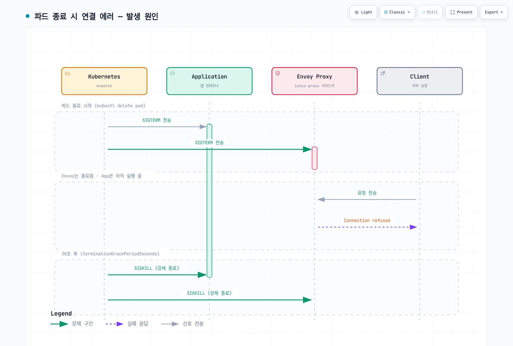
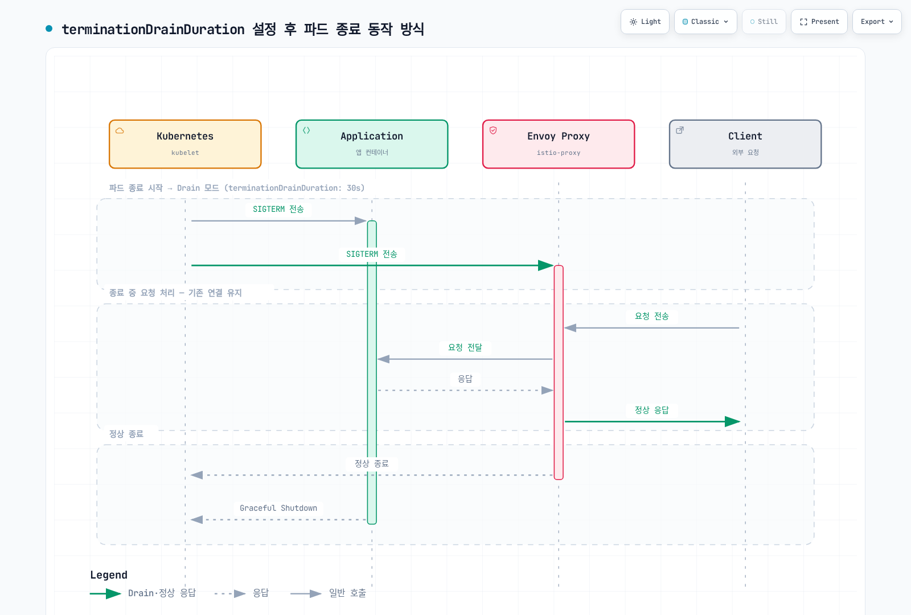
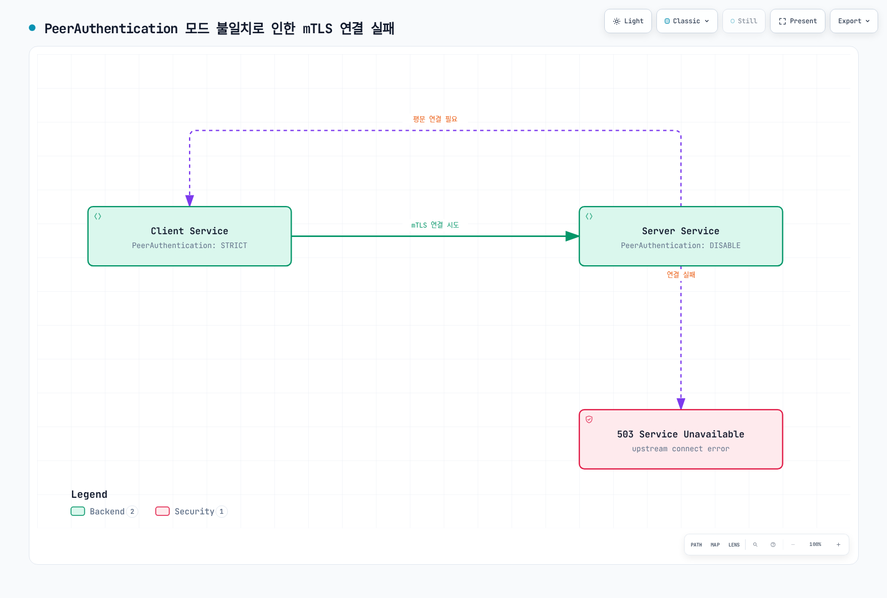

# Istio 일반적인 에러 및 해결 방법

> **지원 버전**: Istio 1.28
> **마지막 업데이트**: 2026년 2월 19일

이 문서는 Istio를 사용할 때 가장 자주 발생하는 에러와 해결 방법을 정리합니다.

## 목차

1. [파드 종료 시 연결 에러](#파드-종료-시-연결-에러)
2. [Sidecar 주입 문제](#sidecar-주입-문제)
3. [mTLS 연결 실패](#mtls-연결-실패)
4. [VirtualService 라우팅 실패](#virtualservice-라우팅-실패)
5. [Gateway 설정 문제](#gateway-설정-문제)
6. [메모리 및 성능 문제](#메모리-및-성능-문제)
7. [인증서 만료](#인증서-만료)
8. [DNS 해석 실패](#dns-해석-실패)
9. [Envoy 초기화 타임아웃](#envoy-초기화-타임아웃)
10. [디버깅 도구](#디버깅-도구)

## 파드 종료 시 연결 에러

### 문제 설명

파드가 종료될 때 Envoy Sidecar가 애플리케이션보다 먼저 종료되어 연결 에러가 발생합니다.

**증상**:
```
Connection reset by peer
Broken pipe
EOF
HTTP 503 Service Unavailable
```

### 발생 원인



[🔍 인터랙티브 다이어그램 보기](https://www.atomai.click/kubernetes-docs/archmaps/ko-service-mesh-istio-troubleshooting-common-errors-0.html)

**근본 원인**:
1. Envoy와 애플리케이션이 동시에 SIGTERM을 받음
2. Envoy가 애플리케이션보다 빨리 종료
3. 애플리케이션은 아직 요청을 처리 중이지만 Envoy가 이미 종료되어 연결 실패

### 해결 방법

#### 방법 1: Envoy Proxy preStop Hook 설정 (권장)

Istio Proxy 컨테이너에 preStop Hook을 설정하여 활성 연결이 모두 종료될 때까지 대기하도록 합니다.

```yaml
apiVersion: apps/v1
kind: Deployment
metadata:
  name: myapp
spec:
  template:
    metadata:
      annotations:
        # Envoy가 활성 연결 종료까지 대기
        proxy.istio.io/config: |
          terminationDrainDuration: 30s
    spec:
      terminationGracePeriodSeconds: 60
      containers:
      - name: myapp
        image: myapp:latest
        ports:
        - containerPort: 8080
```

**동작 방식**:


[🔍 인터랙티브 다이어그램 보기](https://www.atomai.click/kubernetes-docs/archmaps/ko-service-mesh-istio-troubleshooting-common-errors-1.html)

#### 방법 2: Pod Annotation으로 Envoy 종료 동작 제어

Pod 단위로 Envoy의 종료 동작을 세밀하게 제어할 수 있습니다.

```yaml
apiVersion: apps/v1
kind: Deployment
metadata:
  name: myapp
spec:
  template:
    metadata:
      annotations:
        # Envoy가 애플리케이션 시작까지 대기
        proxy.istio.io/config: |
          holdApplicationUntilProxyStarts: true
          terminationDrainDuration: 30s
        # Envoy 종료 타임아웃
        sidecar.istio.io/terminationGracePeriodSeconds: "60"
    spec:
      terminationGracePeriodSeconds: 60
      containers:
      - name: myapp
        image: myapp:latest
```

**설정 설명**:
- `holdApplicationUntilProxyStarts: true`: 애플리케이션보다 Envoy가 먼저 시작
- `terminationDrainDuration: 30s`: Envoy 종료 시 30초 동안 드레인
- `terminationGracePeriodSeconds: 60`: 전체 파드 종료 유예 시간

#### 방법 3: 전역 설정 (IstioOperator)

클러스터 전체에 일관된 종료 정책을 적용합니다.

```yaml
apiVersion: install.istio.io/v1alpha1
kind: IstioOperator
metadata:
  name: istio-controlplane
spec:
  meshConfig:
    defaultConfig:
      terminationDrainDuration: 30s
      holdApplicationUntilProxyStarts: true
  values:
    global:
      proxy:
        lifecycle:
          preStop:
            exec:
              command:
              - /bin/sh
              - -c
              - |
                # Envoy 드레인 시작
                curl -X POST http://localhost:15000/drain_listeners?graceful
                # 활성 연결 대기
                while [ $(netstat -plunt | grep tcp | grep -v TIME_WAIT | wc -l | xargs) -ne 0 ]; do
                  sleep 1;
                done
```

**권장 설정**:
- `terminationDrainDuration`: 30초 (활성 연결 드레인 시간)
- `terminationGracePeriodSeconds`: 60초 (SIGKILL 전 유예 시간)
- Envoy가 활성 연결을 확인하고 graceful shutdown 수행

### 검증 방법

```bash
# 1. 파드 종료 중 로그 확인
kubectl logs -f <pod-name> -c istio-proxy --previous

# 2. 종료 시 연결 상태 확인
kubectl exec <pod-name> -c istio-proxy -- netstat -an | grep ESTABLISHED

# 3. 종료 이벤트 확인
kubectl get events --field-selector involvedObject.name=<pod-name>
```

### 모범 사례

```yaml
# 권장 설정 템플릿
apiVersion: apps/v1
kind: Deployment
metadata:
  name: myapp
spec:
  template:
    metadata:
      annotations:
        # Envoy 종료 동작 제어
        proxy.istio.io/config: |
          holdApplicationUntilProxyStarts: true
          terminationDrainDuration: 30s
    spec:
      terminationGracePeriodSeconds: 60
      containers:
      - name: myapp
        image: myapp:latest
        ports:
        - containerPort: 8080
        readinessProbe:
          httpGet:
            path: /health
            port: 8080
          periodSeconds: 5
          successThreshold: 1
          failureThreshold: 3
        # 선택사항: 애플리케이션 graceful shutdown
        lifecycle:
          preStop:
            exec:
              command:
              - /bin/sh
              - -c
              - |
                # Readiness 비활성화 (optional)
                touch /tmp/not-ready
                # 애플리케이션 요청 완료 대기
                sleep 5
```

**체크리스트**:
- ✅ **Envoy terminationDrainDuration 설정** (가장 중요!)
- ✅ **holdApplicationUntilProxyStarts: true** (시작 순서 보장)
- ✅ **terminationGracePeriodSeconds 충분히 설정** (최소 60초)
- ✅ ReadinessProbe 설정 (종료 시 빠르게 unhealthy 전환)
- ✅ 애플리케이션 graceful shutdown 구현 (선택사항)
- ✅ 모니터링 및 로깅 설정

**핵심**:
- ❌ **애플리케이션 컨테이너에 sleep을 추가하지 마세요!**
- ✅ **Envoy가 드레인 모드로 graceful shutdown하도록 설정하세요.**

## Sidecar 주입 문제

### 문제 1: Sidecar가 주입되지 않음

**증상**:
```bash
kubectl get pod <pod-name> -o jsonpath='{.spec.containers[*].name}'
# 출력: myapp (istio-proxy가 없음)
```

**원인 및 해결**:

#### 1. Namespace 레이블 누락

```bash
# 확인
kubectl get namespace <namespace> --show-labels

# 해결
kubectl label namespace <namespace> istio-injection=enabled
```

#### 2. Pod Annotation으로 주입 비활성화됨

```yaml
# 잘못된 설정
apiVersion: v1
kind: Pod
metadata:
  annotations:
    sidecar.istio.io/inject: "false"  # ← 주입 비활성화
```

**해결**:
```yaml
# 올바른 설정
apiVersion: v1
kind: Pod
metadata:
  annotations:
    sidecar.istio.io/inject: "true"
```

#### 3. Istio Sidecar Injector 동작 확인

```bash
# Sidecar injector webhook 확인
kubectl get mutatingwebhookconfigurations

# Istio injector 로그 확인
kubectl logs -n istio-system -l app=sidecar-injector
```

### 문제 2: Sidecar 리소스 부족

**증상**:
```
OOMKilled
CrashLoopBackOff
Error: container has runAsNonRoot and image has non-numeric user
```

**해결**:

```yaml
apiVersion: v1
kind: Pod
metadata:
  annotations:
    sidecar.istio.io/proxyCPU: "200m"
    sidecar.istio.io/proxyMemory: "256Mi"
    sidecar.istio.io/proxyCPULimit: "1000m"
    sidecar.istio.io/proxyMemoryLimit: "512Mi"
spec:
  containers:
  - name: myapp
    image: myapp:latest
```

## mTLS 연결 실패

### 문제 설명

**증상**:
```
upstream connect error or disconnect/reset before headers
503 Service Unavailable
SSL routines:OPENSSL_internal:WRONG_VERSION_NUMBER
```

### 원인 1: PeerAuthentication 모드 불일치



[🔍 인터랙티브 다이어그램 보기](https://www.atomai.click/kubernetes-docs/archmaps/ko-service-mesh-istio-troubleshooting-common-errors-2.html)

**해결**:

```yaml
# 네임스페이스 전체에 일관된 mTLS 정책 적용
apiVersion: security.istio.io/v1
kind: PeerAuthentication
metadata:
  name: default
  namespace: istio-system
spec:
  mtls:
    mode: STRICT  # 모든 서비스 STRICT 모드
```

### 원인 2: DestinationRule과 PeerAuthentication 충돌

```yaml
# ❌ 잘못된 예
---
apiVersion: security.istio.io/v1
kind: PeerAuthentication
metadata:
  name: default
spec:
  mtls:
    mode: STRICT
---
apiVersion: networking.istio.io/v1
kind: DestinationRule
metadata:
  name: myapp
spec:
  host: myapp
  trafficPolicy:
    tls:
      mode: DISABLE  # ← 충돌!
```

**해결**:
```yaml
# ✅ 올바른 예
apiVersion: networking.istio.io/v1
kind: DestinationRule
metadata:
  name: myapp
spec:
  host: myapp
  trafficPolicy:
    tls:
      mode: ISTIO_MUTUAL  # PeerAuthentication과 일치
```

### 디버깅 명령어

```bash
# 1. mTLS 상태 확인
istioctl x describe pod <pod-name> -n <namespace>

# 2. PeerAuthentication 정책 확인
kubectl get peerauthentication -A

# 3. DestinationRule TLS 설정 확인
kubectl get destinationrule -A -o yaml | grep -A 5 "tls:"

# 4. Envoy 클러스터 TLS 설정 확인
istioctl proxy-config clusters <pod-name> -n <namespace> --fqdn <service-name>
```

## VirtualService 라우팅 실패

### 문제 1: 트래픽이 라우팅되지 않음

**증상**:
```
404 Not Found
default backend - 404
```

**원인 및 해결**:

#### 잘못된 host 매칭

```yaml
# ❌ 잘못된 예
apiVersion: networking.istio.io/v1
kind: VirtualService
metadata:
  name: myapp
spec:
  hosts:
  - myapp.example.com  # ← DNS 이름
  http:
  - route:
    - destination:
        host: myapp  # ← Kubernetes Service 이름
```

**해결**:
```yaml
# ✅ 올바른 예
apiVersion: networking.istio.io/v1
kind: VirtualService
metadata:
  name: myapp
  namespace: default
spec:
  hosts:
  - myapp  # Kubernetes Service 이름과 정확히 일치
  - myapp.default.svc.cluster.local  # FQDN도 추가
  http:
  - route:
    - destination:
        host: myapp
```

### 문제 2: Subset not found

**증상**:
```
no healthy upstream
subset not found
```

**원인**:
```yaml
# VirtualService는 있지만 DestinationRule이 없음
apiVersion: networking.istio.io/v1
kind: VirtualService
metadata:
  name: myapp
spec:
  http:
  - route:
    - destination:
        host: myapp
        subset: v1  # ← Subset이 정의되지 않음
```

**해결**:
```yaml
# DestinationRule 추가
apiVersion: networking.istio.io/v1
kind: DestinationRule
metadata:
  name: myapp
spec:
  host: myapp
  subsets:
  - name: v1
    labels:
      version: v1
  - name: v2
    labels:
      version: v2
```

### 디버깅

```bash
# 1. VirtualService 검증
istioctl analyze -n <namespace>

# 2. 라우팅 규칙 확인
istioctl proxy-config routes <pod-name> -n <namespace>

# 3. VirtualService 상태 확인
kubectl get virtualservice <name> -n <namespace> -o yaml
```

## Gateway 설정 문제

### 문제 1: Gateway에 트래픽이 도달하지 않음

**증상**:
```bash
curl: (7) Failed to connect to example.com port 443: Connection refused
```

**원인 및 해결**:

#### 1. Gateway Service 확인

```bash
# Gateway Service 상태 확인
kubectl get svc -n istio-system istio-ingressgateway

# External IP 확인
kubectl get svc -n istio-system istio-ingressgateway -o jsonpath='{.status.loadBalancer.ingress[0].hostname}'
```

#### 2. Gateway와 VirtualService 연결 확인

```yaml
# ❌ 잘못된 예
---
apiVersion: networking.istio.io/v1
kind: Gateway
metadata:
  name: myapp-gateway
spec:
  selector:
    istio: ingressgateway
  servers:
  - port:
      number: 80
      name: http
      protocol: HTTP
    hosts:
    - "example.com"
---
apiVersion: networking.istio.io/v1
kind: VirtualService
metadata:
  name: myapp
spec:
  hosts:
  - "example.com"
  gateways:
  - my-gateway  # ← Gateway 이름 오타!
```

**해결**:
```yaml
# ✅ 올바른 예
apiVersion: networking.istio.io/v1
kind: VirtualService
metadata:
  name: myapp
spec:
  hosts:
  - "example.com"
  gateways:
  - myapp-gateway  # Gateway 이름과 정확히 일치
```

### 문제 2: HTTPS 인증서 오류

**증상**:
```
SSL certificate problem: self signed certificate
```

**해결**:

```yaml
apiVersion: networking.istio.io/v1
kind: Gateway
metadata:
  name: myapp-gateway
spec:
  selector:
    istio: ingressgateway
  servers:
  - port:
      number: 443
      name: https
      protocol: HTTPS
    tls:
      mode: SIMPLE
      credentialName: myapp-tls-secret  # ← Secret 이름 정확히 지정
    hosts:
    - "example.com"
```

```bash
# TLS Secret 생성
kubectl create secret tls myapp-tls-secret \
  --cert=path/to/cert.pem \
  --key=path/to/key.pem \
  -n istio-system
```

## 메모리 및 성능 문제

### 문제 1: Envoy 메모리 사용량 증가

**증상**:
```
OOMKilled
Memory usage > 1GB per pod
```

**원인**:
- 너무 많은 리스너/클러스터 생성
- 큰 ConfigMap/Secret
- 메모리 누수

**해결**:

```yaml
# Sidecar 리소스로 범위 제한
apiVersion: networking.istio.io/v1
kind: Sidecar
metadata:
  name: default
  namespace: default
spec:
  egress:
  - hosts:
    - "./*"  # 같은 네임스페이스만
    - "istio-system/*"  # istio-system만
```

```yaml
# Envoy 리소스 제한
apiVersion: v1
kind: Pod
metadata:
  annotations:
    sidecar.istio.io/proxyMemory: "512Mi"
    sidecar.istio.io/proxyMemoryLimit: "1Gi"
```

### 문제 2: 높은 지연 시간

**증상**:
- P99 latency > 1초
- Timeout 에러 빈번

**해결**:

```yaml
# VirtualService에 timeout 설정
apiVersion: networking.istio.io/v1
kind: VirtualService
metadata:
  name: myapp
spec:
  http:
  - route:
    - destination:
        host: myapp
    timeout: 5s  # 전체 요청 타임아웃
    retries:
      attempts: 3
      perTryTimeout: 2s  # 각 재시도 타임아웃
```

## 인증서 만료

### 문제 설명

**증상**:
```
x509: certificate has expired
SSL handshake failed
```

**원인**:
- Istio CA 인증서 만료 (기본 10년)
- 워크로드 인증서 만료 (기본 24시간, 자동 갱신)

**해결**:

```bash
# 1. CA 인증서 확인
kubectl get secret istio-ca-secret -n istio-system -o jsonpath='{.data.ca-cert\.pem}' | base64 -d | openssl x509 -noout -dates

# 2. 워크로드 인증서 확인
istioctl proxy-config secret <pod-name> -n <namespace>

# 3. CA 인증서 재생성
istioctl x ca root
```

## DNS 해석 실패

### 문제 설명

**증상**:
```
no such host
DNS resolution failed
```

**해결**:

```yaml
# ServiceEntry로 외부 서비스 등록
apiVersion: networking.istio.io/v1
kind: ServiceEntry
metadata:
  name: external-api
spec:
  hosts:
  - api.example.com
  ports:
  - number: 443
    name: https
    protocol: HTTPS
  location: MESH_EXTERNAL
  resolution: DNS
```

## Envoy 초기화 타임아웃

### 문제 설명

**증상**:
```
waiting for Envoy proxy to be ready
Readiness probe failed
```

**해결**:

```yaml
apiVersion: v1
kind: Pod
metadata:
  annotations:
    proxy.istio.io/config: |
      holdApplicationUntilProxyStarts: true
spec:
  containers:
  - name: myapp
    image: myapp:latest
    readinessProbe:
      initialDelaySeconds: 10  # Envoy 초기화 대기
```

## 디버깅 도구

### istioctl 명령어

```bash
# 1. 파드 상태 분석
istioctl x describe pod <pod-name> -n <namespace>

# 2. 구성 검증
istioctl analyze -A

# 3. Envoy 설정 확인
istioctl proxy-config all <pod-name> -n <namespace>

# 4. Envoy 로그 레벨 변경
istioctl proxy-config log <pod-name> --level debug

# 5. 버그 리포트 생성
istioctl bug-report
```

### Envoy Admin API

```bash
# Envoy admin 포트로 포워딩
kubectl port-forward <pod-name> 15000:15000

# 1. 클러스터 상태 확인
curl localhost:15000/clusters

# 2. 통계 확인
curl localhost:15000/stats/prometheus

# 3. 설정 덤프
curl localhost:15000/config_dump

# 4. 로깅 레벨 변경
curl -X POST localhost:15000/logging?level=debug
```

### 일반적인 로그 확인

```bash
# 애플리케이션 로그
kubectl logs <pod-name> -c <container-name>

# Envoy 로그
kubectl logs <pod-name> -c istio-proxy

# 이전 컨테이너 로그 (재시작된 경우)
kubectl logs <pod-name> -c istio-proxy --previous

# 실시간 로그
kubectl logs -f <pod-name> -c istio-proxy
```

## 참고 자료

### 공식 문서
- [Istio Debugging Guide](https://istio.io/latest/docs/ops/diagnostic-tools/)
- [Istio FAQ](https://istio.io/latest/about/faq/)
- [Common Problems](https://istio.io/latest/docs/ops/common-problems/)

### 관련 문서
- [Observability](../observability/README.md)
- [Security](../security/README.md)
- [Traffic Management](../traffic-management/README.md)

---

**마지막 업데이트**: 2025년 11월 27일
