# Linkerd 아키텍처

> **지원 버전**: Linkerd 2.16+
> **마지막 업데이트**: 2026년 2월 21일

## 개요

Linkerd는 컨트롤 플레인과 데이터 플레인으로 구성된 서비스 메시 아키텍처를 따릅니다. 이 문서에서는 각 컴포넌트의 역할과 상호작용, 인증서 체계, 프록시 라이프사이클 등을 상세히 설명합니다.

## 전체 아키텍처

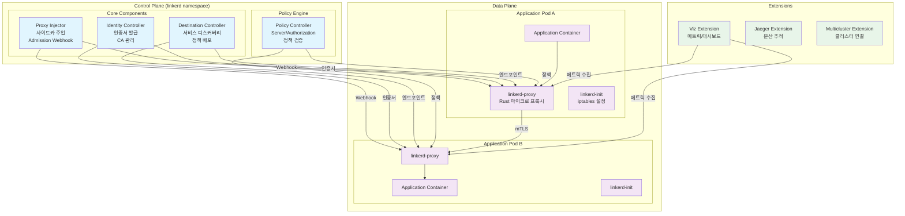

## 컨트롤 플레인

컨트롤 플레인은 `linkerd` 네임스페이스에 배포되며, 데이터 플레인 프록시를 구성하고 관리하는 컴포넌트들로 구성됩니다.

### Destination Controller

Destination 컨트롤러는 서비스 디스커버리와 정책 배포를 담당하는 핵심 컴포넌트입니다.

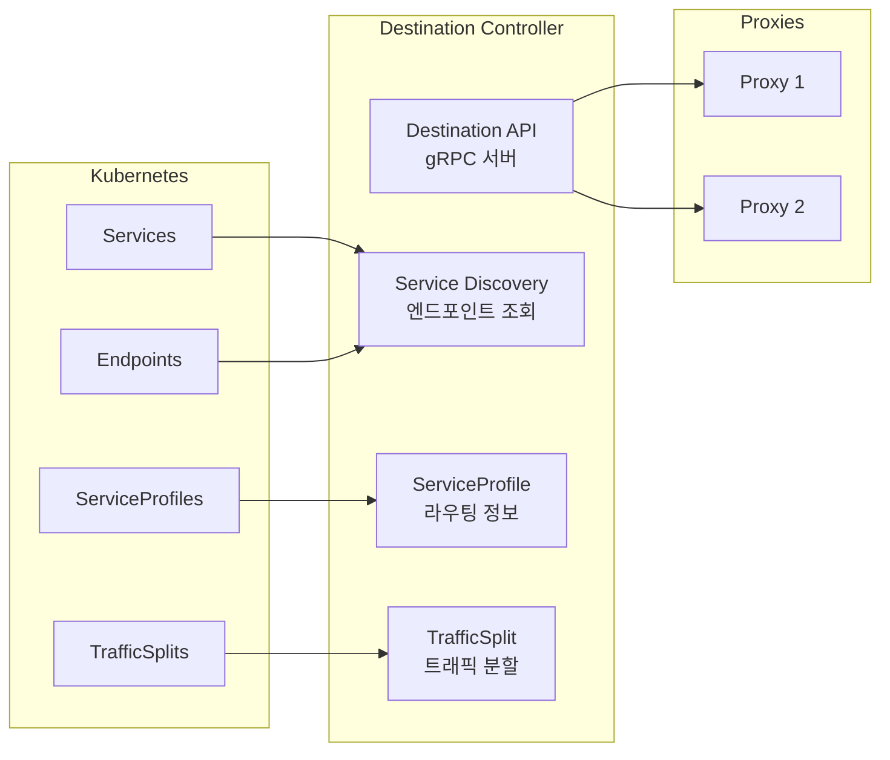

**주요 기능:**

| 기능 | 설명 |
|------|------|
| 서비스 디스커버리 | Kubernetes 서비스와 엔드포인트 모니터링, 프록시에 실시간 업데이트 |
| 정책 배포 | ServiceProfile, TrafficSplit 등 정책을 프록시에 전달 |
| 로드 밸런싱 정보 | EWMA 기반 로드 밸런싱을 위한 엔드포인트 가중치 정보 |
| 서비스 프로파일 | 라우트별 재시도, 타임아웃, 메트릭 설정 |

**Destination API 동작:**

```go
// Destination API는 gRPC 스트리밍을 통해 프록시에 업데이트 전송
// 프록시가 대상 서비스에 대한 정보 요청
service Destination {
    // Get은 특정 대상에 대한 업데이트 스트림 반환
    rpc Get(GetDestination) returns (stream Update);

    // GetProfile은 서비스 프로파일 업데이트 스트림 반환
    rpc GetProfile(GetDestination) returns (stream DestinationProfile);
}
```

### Identity Controller

Identity 컨트롤러는 mTLS를 위한 인증서 발급과 관리를 담당합니다.

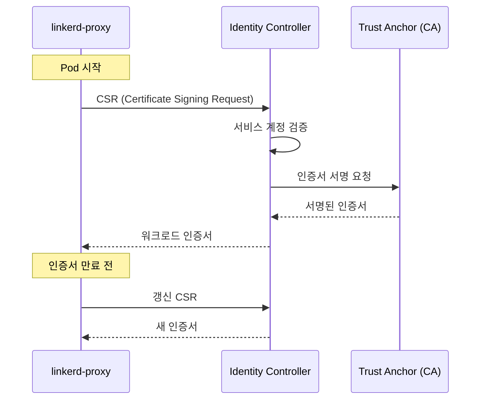

**인증서 발급 프로세스:**

1. 프록시 시작 시 CSR(Certificate Signing Request) 생성
2. Identity 컨트롤러가 Pod의 ServiceAccount 검증
3. Trust Anchor(Root CA)로 인증서 서명
4. 워크로드 인증서를 프록시에 전달
5. 기본 24시간 유효, 자동 갱신

**Identity 설정:**

```yaml
# linkerd-config ConfigMap에서 Identity 설정
apiVersion: v1
kind: ConfigMap
metadata:
  name: linkerd-config
  namespace: linkerd
data:
  values: |
    identity:
      issuer:
        # 인증서 발급 수명 (기본 24시간)
        issuanceLifetime: 24h0m0s
        # 클럭 스큐 허용 범위
        clockSkewAllowance: 20s
        # 발급자 스키마 (kubernetes.io/tls)
        scheme: kubernetes.io/tls
```

### Proxy Injector

Proxy Injector는 Kubernetes Admission Webhook으로 동작하여 Pod에 사이드카를 자동 주입합니다.

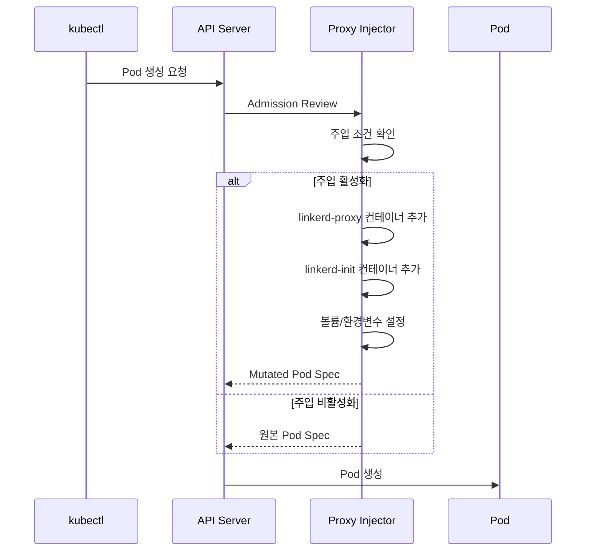

**주입 조건:**

```yaml
# 네임스페이스 레벨 주입 활성화
apiVersion: v1
kind: Namespace
metadata:
  name: my-app
  annotations:
    linkerd.io/inject: enabled

---
# Pod 레벨 주입 제어
apiVersion: v1
kind: Pod
metadata:
  name: my-pod
  annotations:
    # 주입 활성화
    linkerd.io/inject: enabled
    # 또는 비활성화
    # linkerd.io/inject: disabled
```

**주입되는 컴포넌트:**

| 컴포넌트 | 역할 |
|---------|------|
| `linkerd-init` | Init 컨테이너, iptables 규칙 설정 |
| `linkerd-proxy` | 사이드카 컨테이너, 트래픽 프록시 |
| 볼륨 | Identity 토큰, 설정 |
| 환경변수 | 프록시 설정, 대상 주소 |

### Policy Controller

Policy Controller는 Linkerd의 인가 정책을 관리합니다.

```yaml
# Server 리소스 - 인바운드 트래픽 정의
apiVersion: policy.linkerd.io/v1beta2
kind: Server
metadata:
  name: web-http
  namespace: my-app
spec:
  podSelector:
    matchLabels:
      app: web
  port: http
  proxyProtocol: HTTP/1

---
# ServerAuthorization - 접근 권한 정의
apiVersion: policy.linkerd.io/v1beta2
kind: ServerAuthorization
metadata:
  name: web-authz
  namespace: my-app
spec:
  server:
    name: web-http
  client:
    meshTLS:
      serviceAccounts:
        - name: api-gateway
          namespace: my-app
```

## 데이터 플레인

데이터 플레인은 애플리케이션 Pod에 주입된 `linkerd-proxy` 사이드카로 구성됩니다.

### linkerd2-proxy

Linkerd의 데이터 플레인 프록시는 Rust로 작성된 초경량 마이크로 프록시입니다.

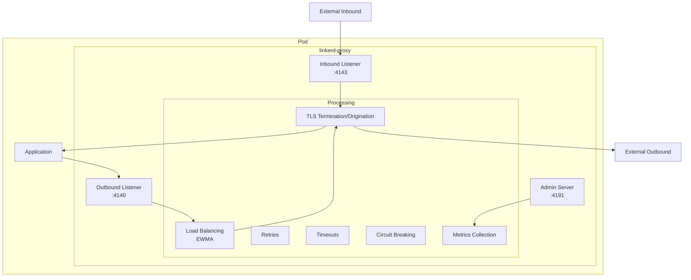

**프록시 특성:**

| 특성 | 값 |
|------|-----|
| 언어 | Rust |
| 메모리 사용량 | ~10MB |
| CPU 오버헤드 | 최소 |
| 지연 시간 추가 | <1ms p99 |
| 프로토콜 | HTTP/1.1, HTTP/2, gRPC, TCP |
| TLS | TLS 1.3 (rustls) |

**Istio Envoy와 비교:**

| 특성 | linkerd2-proxy | Envoy (Istio) |
|------|---------------|---------------|
| 언어 | Rust | C++ |
| 메모리 | ~10MB | ~50-100MB |
| 바이너리 크기 | ~10MB | ~60MB |
| 지연 시간 | <1ms p99 | 2-5ms p99 |
| 설정 복잡도 | 낮음 (자동) | 높음 (xDS) |
| 확장성 | 제한적 | Wasm, Lua |
| 프로토콜 지원 | HTTP, gRPC, TCP | 매우 광범위 |

### 프록시 트래픽 흐름

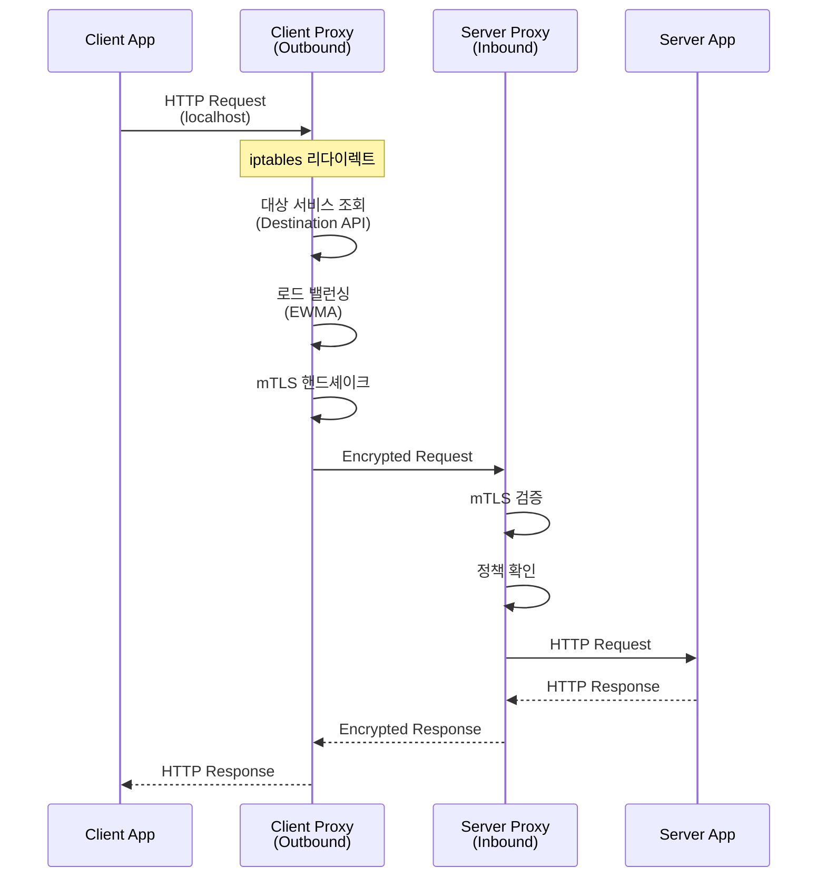

### linkerd-init (Init Container)

`linkerd-init`은 iptables 규칙을 설정하여 트래픽을 프록시로 리다이렉트합니다.

```bash
# linkerd-init이 설정하는 iptables 규칙 예시
# Outbound 트래픽 리다이렉트 (포트 4140으로)
iptables -t nat -A OUTPUT -p tcp -j REDIRECT --to-port 4140

# Inbound 트래픽 리다이렉트 (포트 4143으로)
iptables -t nat -A PREROUTING -p tcp -j REDIRECT --to-port 4143

# 프록시 자체 트래픽은 제외
iptables -t nat -A OUTPUT -m owner --uid-owner 2102 -j RETURN
```

**주입된 Pod 구조:**

```yaml
apiVersion: v1
kind: Pod
metadata:
  name: my-app
  annotations:
    linkerd.io/inject: enabled
spec:
  initContainers:
  - name: linkerd-init
    image: cr.l5d.io/linkerd/proxy-init:v2.3.0
    args:
    - --incoming-proxy-port=4143
    - --outgoing-proxy-port=4140
    - --proxy-uid=2102
    securityContext:
      capabilities:
        add:
        - NET_ADMIN
        - NET_RAW

  containers:
  - name: my-app
    image: my-app:latest

  - name: linkerd-proxy
    image: cr.l5d.io/linkerd/proxy:stable-2.16.0
    ports:
    - containerPort: 4143  # Inbound
      name: linkerd-proxy
    - containerPort: 4191  # Admin/Metrics
      name: linkerd-admin
    env:
    - name: LINKERD2_PROXY_LOG
      value: warn,linkerd=info
    - name: LINKERD2_PROXY_DESTINATION_SVC_ADDR
      value: linkerd-dst.linkerd.svc.cluster.local:8086
    - name: LINKERD2_PROXY_IDENTITY_SVC_ADDR
      value: linkerd-identity.linkerd.svc.cluster.local:8080
    resources:
      requests:
        cpu: 100m
        memory: 64Mi
      limits:
        cpu: 1000m
        memory: 250Mi
    readinessProbe:
      httpGet:
        path: /ready
        port: 4191
    livenessProbe:
      httpGet:
        path: /live
        port: 4191
```

## 인증서 체계

Linkerd는 계층적 PKI(Public Key Infrastructure)를 사용하여 mTLS를 구현합니다.

### 인증서 계층 구조

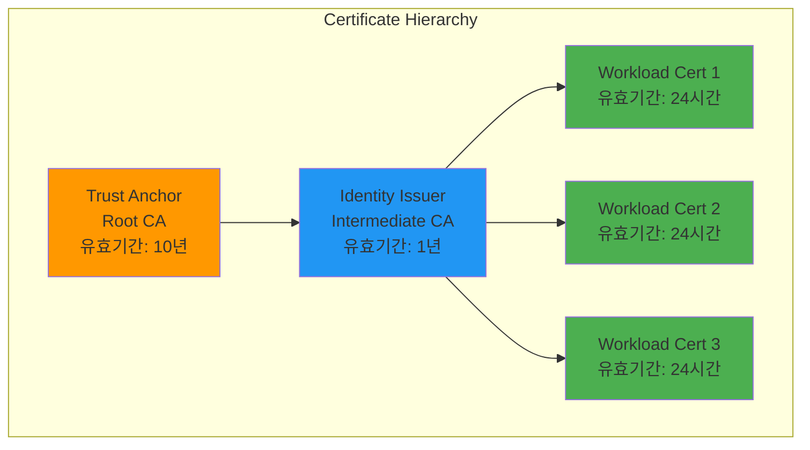

### Trust Anchor (Root CA)

Trust Anchor는 PKI의 루트로, 모든 인증서 체인의 신뢰 기반입니다.

```bash
# Trust Anchor 생성 (step CLI 사용)
step certificate create root.linkerd.cluster.local ca.crt ca.key \
  --profile root-ca \
  --no-password \
  --insecure \
  --not-after=87600h  # 10년

# Trust Anchor 확인
openssl x509 -in ca.crt -text -noout

# 출력 예시:
# Certificate:
#     Data:
#         Version: 3 (0x2)
#         Serial Number: ...
#         Signature Algorithm: ecdsa-with-SHA256
#         Issuer: CN = root.linkerd.cluster.local
#         Validity
#             Not Before: Feb 21 00:00:00 2026 GMT
#             Not After : Feb 21 00:00:00 2036 GMT
#         Subject: CN = root.linkerd.cluster.local
#         ...
#         X509v3 extensions:
#             X509v3 Key Usage: critical
#                 Certificate Sign, CRL Sign
#             X509v3 Basic Constraints: critical
#                 CA:TRUE
```

**Trust Anchor 저장:**

```yaml
# Kubernetes Secret으로 저장
apiVersion: v1
kind: Secret
metadata:
  name: linkerd-identity-trust-roots
  namespace: linkerd
type: Opaque
data:
  ca-bundle.crt: <base64-encoded-ca.crt>
```

### Identity Issuer (Intermediate CA)

Identity Issuer는 워크로드 인증서를 발급하는 중간 CA입니다.

```bash
# Identity Issuer 인증서 생성
step certificate create identity.linkerd.cluster.local issuer.crt issuer.key \
  --profile intermediate-ca \
  --ca ca.crt \
  --ca-key ca.key \
  --no-password \
  --insecure \
  --not-after=8760h  # 1년

# Issuer 인증서 확인
openssl x509 -in issuer.crt -text -noout
```

**Identity Issuer Secret:**

```yaml
apiVersion: v1
kind: Secret
metadata:
  name: linkerd-identity-issuer
  namespace: linkerd
type: kubernetes.io/tls
data:
  tls.crt: <base64-encoded-issuer.crt>
  tls.key: <base64-encoded-issuer.key>
  ca.crt: <base64-encoded-ca.crt>
```

### 워크로드 인증서

각 프록시는 고유한 워크로드 인증서를 받습니다.

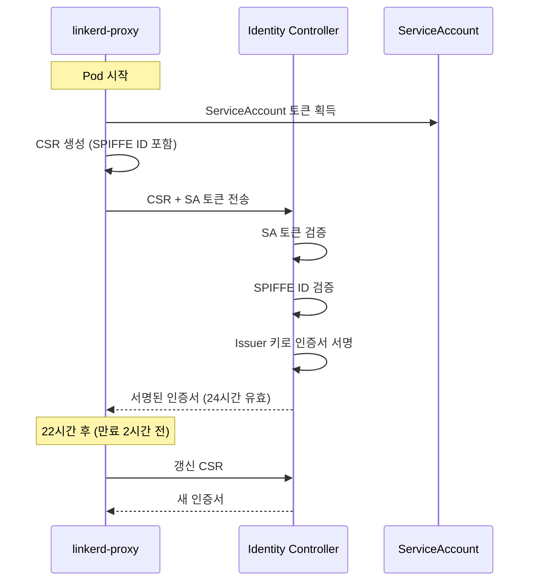

**SPIFFE ID 형식:**

```
spiffe://root.linkerd.cluster.local/ns/<namespace>/sa/<service-account>

# 예시:
spiffe://root.linkerd.cluster.local/ns/my-app/sa/web-service
```

### 인증서 로테이션

```yaml
# 인증서 수명 설정
identity:
  issuer:
    # 워크로드 인증서 수명 (기본 24시간)
    issuanceLifetime: 24h0m0s
    # 클럭 스큐 허용 (기본 20초)
    clockSkewAllowance: 20s

# 프록시는 인증서 만료 전에 자동 갱신
# 기본적으로 만료 70% 시점에 갱신 시작
```

**Trust Anchor 로테이션:**

```bash
# 새 Trust Anchor 생성
step certificate create root.linkerd.cluster.local ca-new.crt ca-new.key \
  --profile root-ca \
  --no-password \
  --insecure \
  --not-after=87600h

# 번들 생성 (기존 + 신규)
cat ca.crt ca-new.crt > ca-bundle.crt

# ConfigMap 업데이트
kubectl create configmap linkerd-identity-trust-roots \
  --from-file=ca-bundle.crt=ca-bundle.crt \
  -n linkerd \
  --dry-run=client -o yaml | kubectl apply -f -

# 이후 모든 프록시 재시작하여 새 번들 적용
kubectl rollout restart deploy -n my-app
```

## 사이드카 주입 상세

### 주입 워크플로우

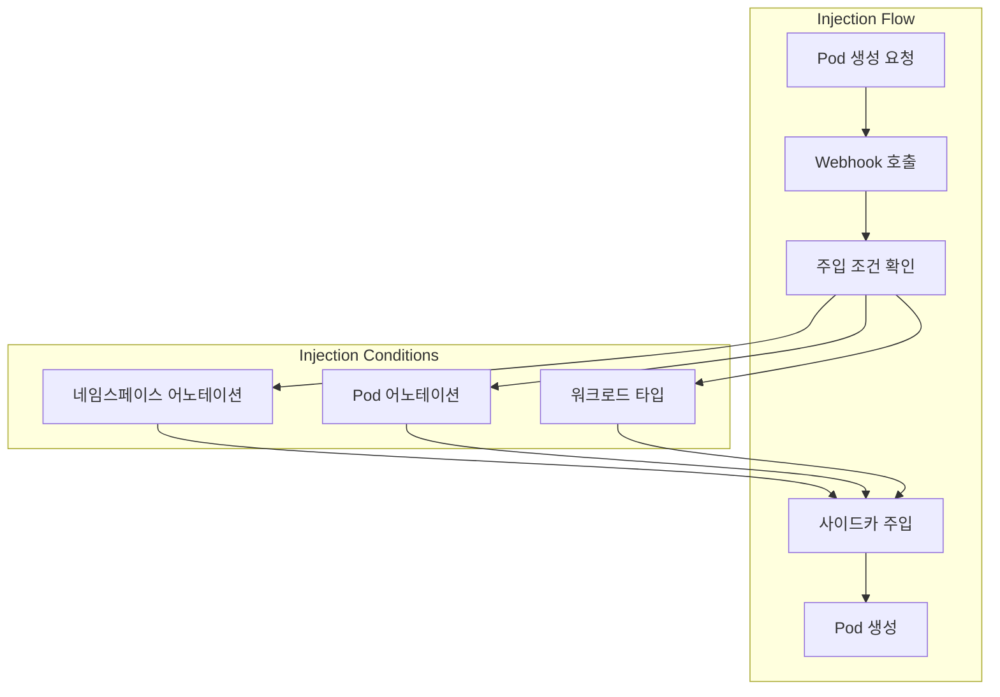

### 주입 어노테이션

```yaml
# 네임스페이스 레벨
metadata:
  annotations:
    linkerd.io/inject: enabled  # 모든 Pod에 주입

# Pod/Deployment 레벨
metadata:
  annotations:
    # 주입 활성화/비활성화
    linkerd.io/inject: enabled|disabled

    # 프록시 설정 오버라이드
    config.linkerd.io/proxy-cpu-request: "100m"
    config.linkerd.io/proxy-memory-request: "64Mi"
    config.linkerd.io/proxy-cpu-limit: "1"
    config.linkerd.io/proxy-memory-limit: "250Mi"

    # 프록시 로그 레벨
    config.linkerd.io/proxy-log-level: "warn,linkerd=info"

    # 포트 건너뛰기 (프록시 우회)
    config.linkerd.io/skip-inbound-ports: "25,587"
    config.linkerd.io/skip-outbound-ports: "25,587"

    # Opaque 포트 (프로토콜 감지 우회)
    config.linkerd.io/opaque-ports: "3306,5432"
```

### 프록시 Readiness/Liveness

```yaml
# 프록시 상태 확인 엔드포인트
livenessProbe:
  httpGet:
    path: /live
    port: 4191
  initialDelaySeconds: 10
  periodSeconds: 10

readinessProbe:
  httpGet:
    path: /ready
    port: 4191
  initialDelaySeconds: 2
  periodSeconds: 10
```

## 컴포넌트 간 통신

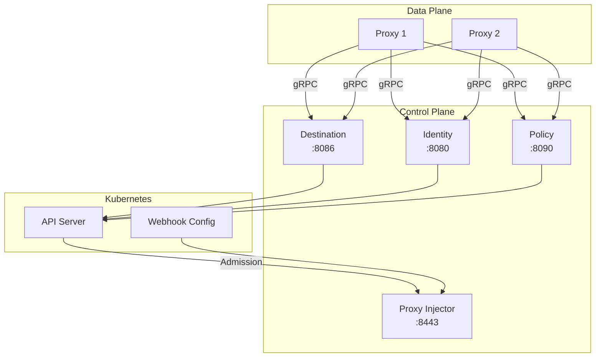

**포트 정리:**

| 컴포넌트 | 포트 | 프로토콜 | 용도 |
|---------|------|---------|------|
| Destination | 8086 | gRPC | 서비스 디스커버리 API |
| Identity | 8080 | gRPC | 인증서 발급 API |
| Policy | 8090 | gRPC | 정책 API |
| Proxy Injector | 8443 | HTTPS | Admission Webhook |
| Proxy (Inbound) | 4143 | HTTP/gRPC | 인바운드 트래픽 |
| Proxy (Outbound) | 4140 | HTTP/gRPC | 아웃바운드 트래픽 |
| Proxy (Admin) | 4191 | HTTP | 메트릭, 상태 확인 |

## Istio 아키텍처와 비교

### 컨트롤 플레인 비교

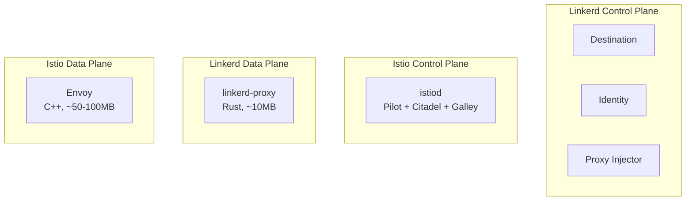

| 특성 | Linkerd | Istio |
|------|---------|-------|
| 컨트롤 플레인 | 분산 (3개 컴포넌트) | 통합 (istiod) |
| 프록시 | linkerd2-proxy (Rust) | Envoy (C++) |
| 설정 프로토콜 | 커스텀 gRPC | xDS (복잡함) |
| CRD 수 | ~10개 | ~50개+ |
| 학습 곡선 | 완만 | 가파름 |
| 리소스 사용량 | 낮음 | 높음 |
| 확장성 | 제한적 | Wasm, Lua |

### 프록시 비교

```yaml
# Linkerd Proxy 리소스 (일반적)
resources:
  requests:
    cpu: 100m
    memory: 64Mi
  limits:
    cpu: 1000m
    memory: 250Mi

# Envoy Proxy 리소스 (일반적)
resources:
  requests:
    cpu: 100m
    memory: 128Mi
  limits:
    cpu: 2000m
    memory: 1Gi
```

## 다음 단계

- [트래픽 관리](./03-traffic-management.md): ServiceProfile과 트래픽 분할
- [보안](./04-security.md): mTLS와 인가 정책
- [관찰성](./05-observability.md): 메트릭과 대시보드

## 참고 자료

- [Linkerd Architecture](https://linkerd.io/2/reference/architecture/)
- [linkerd2-proxy GitHub](https://github.com/linkerd/linkerd2-proxy)
- [Linkerd Identity](https://linkerd.io/2/features/automatic-mtls/)
- [Proxy Injection](https://linkerd.io/2/features/proxy-injection/)
