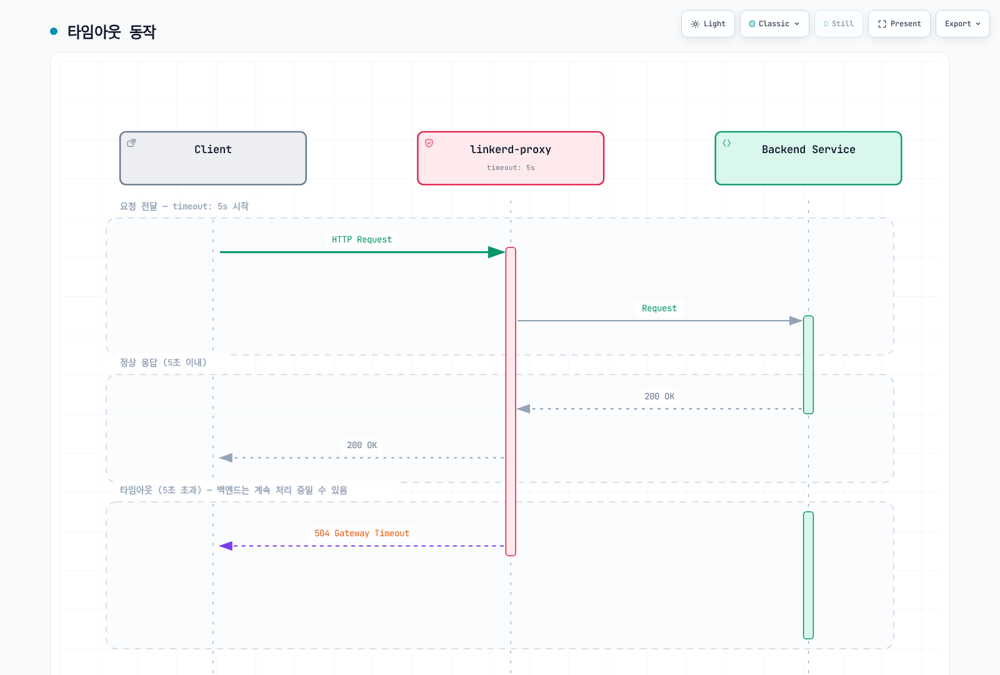
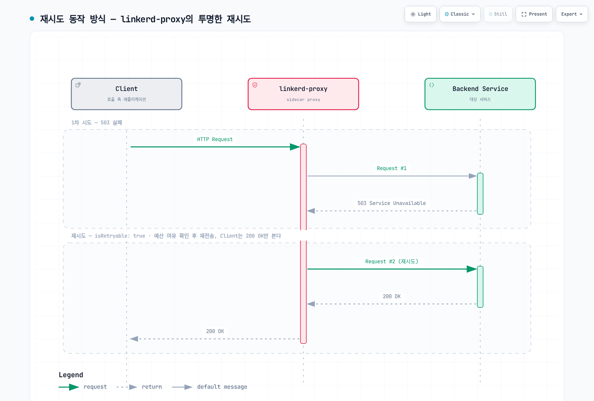
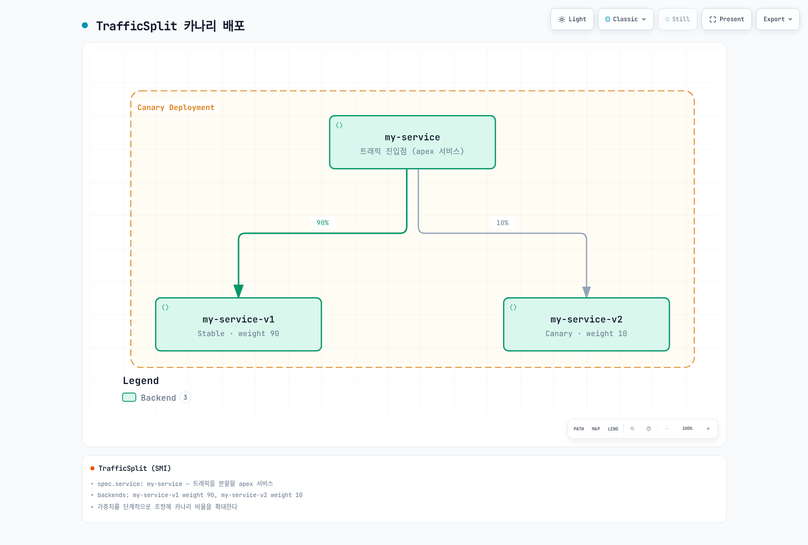

# Linkerd 트래픽 관리

> **검토 기준**: 2026년 9월 11일 · Linkerd edge-26.9.1 · Gateway API 1.5.1 · Flagger 1.45.0

현재 Linkerd 라우팅은 Gateway API 리소스와 지원되는 annotation을 사용합니다. ServiceProfile은 호환성을 위해 유지되며 TrafficSplit/linkerd-smi는 사용 중단 대상으로 지정되었습니다. 이 경로들은 서로 대체 적용되지 않습니다. 같은 Service의 기존 ServiceProfile은 outbound HTTPRoute보다 우선하며 새로운 retry/timeout/failure-accrual 설정의 적용을 막습니다.

아래 예제들은 기존에 검증된 애플리케이션을 대상으로 하는 별도의 실습입니다. [설치 전제 조건](01-installation.md), namespace의 mesh 등록, 명시된 Service/container port와 준비된 endpoint가 필요합니다. 이번 검토에서 실제 클러스터 설치, 트래픽 전환, 운영 부하 테스트는 실행하지 않았습니다.

## 트래픽 관리 구조

| 정책 경로 | 용도 | 적용 경계 |
|---|---|---|
| Service를 parent로 하는 HTTPRoute | Mesh caller의 outbound 라우팅과 신뢰성 설정 | Client가 mesh에 포함되고 HTTP를 검사할 수 있어야 함 |
| Server를 parent로 하는 HTTPRoute | Inbound 인가 조건 | 연결 대상과 정책 역할이 다름 |
| ServiceProfile | 이전 방식의 route 지표/retry/timeout | 같은 Service의 새 정책 경로보다 우선 |
| TrafficSplit | 이전 SMI 가중치 라우팅 | 별도의 사용 중단 대상 extension/CRD 필요 |

Service 기반 정책은 Service discovery에 의존합니다. 직접 Pod IP로 접근하는 경로, headless Service, mesh 밖 caller, 애플리케이션이 직접 암호화한 opaque TLS에 같은 L7 동작이 자동 적용되지는 않습니다. Identity, 인가, 라우팅은 별도의 제어로 취급합니다.

## 현재 HTTPRoute 라우팅

### Service와 가중치 라우팅

`app:web`, `version:stable/canary` label, 8080 port, 애플리케이션에 맞는 readiness를 가진 stable/canary Deployment를 먼저 준비합니다. 다음 namespace 설정은 새로 생성되는 대상 Pod를 mesh에 등록하며 애플리케이션을 배포하지는 않습니다.

```yaml
apiVersion: v1
kind: Namespace
metadata:
  name: route-demo
  annotations:
    linkerd.io/inject: enabled
---
apiVersion: v1
kind: Service
metadata:
  name: web
  namespace: route-demo
spec:
  selector:
    app: web
    version: stable
  ports:
  - name: http
    port: 80
    targetPort: 8080
    appProtocol: http
---
apiVersion: v1
kind: Service
metadata:
  name: web-stable
  namespace: route-demo
spec:
  selector:
    app: web
    version: stable
  ports:
  - name: http
    port: 80
    targetPort: 8080
    appProtocol: http
---
apiVersion: v1
kind: Service
metadata:
  name: web-canary
  namespace: route-demo
spec:
  selector:
    app: web
    version: canary
  ports:
  - name: http
    port: 80
    targetPort: 8080
    appProtocol: http
```

Apex Service는 Kubernetes 기본 라우팅을 위해 **stable** Pod를 선택합니다. Selector는 불필요한 필드가 아닙니다. Mesh 밖이거나 해당 정책을 따르지 않는 트래픽에도 의도한 backend가 필요합니다. HTTPRoute는 대상 mesh client 트래픽을 backend Service로 보냅니다.

```yaml
apiVersion: gateway.networking.k8s.io/v1
kind: HTTPRoute
metadata:
  name: web-route
  namespace: route-demo
spec:
  parentRefs:
  - group: ''
    kind: Service
    name: web
    port: 80
  rules:
  - backendRefs:
    - name: web-stable
      port: 80
      weight: 90
    - name: web-canary
      port: 80
      weight: 10
```

`group:""`는 Service 참조의 표준 core API group입니다. Linkerd 일부 경로는 이전 `core` 별칭도 처리하지만 이식 가능한 Gateway API 리소스에는 빈 group을 사용합니다. 참조한 80은 Service port이며 container의 8080이 아닙니다.

가중치는 음수가 아닌 상대값이고 사용할 수 있는 양의 합계가 필요합니다. 90/10과 9/1은 같은 비율이며 합계가 100일 필요는 없습니다. 설정한 비율은 짧은 구간의 정확한 요청 수, connection 수 또는 replica 비율을 보장하지 않습니다.

```bash
kubectl -n route-demo get httproute web-route -o yaml
kubectl -n route-demo get endpointslices.discovery.k8s.io \
  -l kubernetes.io/service-name=web-stable -o yaml
linkerd diagnostics policy -n route-demo svc/web 80 -o json
linkerd viz stat deploy/client -n route-demo --to svc/web
linkerd viz stat pods -n route-demo
```

Route의 Accepted/ResolvedRefs 조건, 실제 controller 정책, client 트래픽을 확인합니다. Controller의 정책 출력만으로 모든 proxy가 이미 적용을 마쳤다고 판단하지 않습니다.

### Header와 path

다음 예제는 `web-route`를 **대체하는 설정**입니다. Canary cohort header 조건을 먼저 두고 나머지 트래픽에는 가중치 규칙을 적용합니다.

```yaml
apiVersion: gateway.networking.k8s.io/v1
kind: HTTPRoute
metadata:
  name: web-route
  namespace: route-demo
spec:
  parentRefs:
  - group: ''
    kind: Service
    name: web
    port: 80
  rules:
  - matches:
    - headers:
      - name: x-release-track
        type: Exact
        value: canary
    backendRefs:
    - name: web-canary
      port: 80
  - backendRefs:
    - name: web-stable
      port: 80
      weight: 90
    - name: web-canary
      port: 80
      weight: 10
```

Header 값은 인증된 identity가 아닙니다. 신뢰할 수 없는 client도 `x-release-track`이나 `x-debug`를 설정할 수 있으므로 privileged/debug backend에는 별도의 인가가 필요합니다. `Cookie:beta=true`의 Exact match는 header 전체가 그 값일 때만 일치하며 여러 cookie 중 하나를 해석하지 않습니다. 인증된 cohort 신호를 정규화하거나 cookie를 의도적으로 파싱해야 합니다.

별도로 준비한 Service를 대상으로 하는 path 라우팅 예제입니다.

```yaml
apiVersion: gateway.networking.k8s.io/v1
kind: HTTPRoute
metadata:
  name: frontend-paths
  namespace: route-demo
spec:
  parentRefs:
  - group: ''
    kind: Service
    name: frontend
    port: 80
  rules:
  - matches:
    - path:
        type: PathPrefix
        value: /api
    backendRefs:
    - name: api-service
      port: 80
  - matches:
    - path:
        type: PathPrefix
        value: /static
    backendRefs:
    - name: static-service
      port: 80
  - backendRefs:
    - name: web-stable
      port: 80
```

하나의 match 안의 조건들은 AND로 결합됩니다. 여러 match/rule과 경쟁하는 route에는 Gateway API 우선순위가 적용됩니다. 서로 다른 HTTPRoute 객체 간 충돌이 파일 순서만으로 해결된다고 가정하지 않습니다.


## 재시도와 타임아웃

재시도는 명시적으로 활성화하는 outbound 동작입니다. 실패한 요청의 복구를 보장하지 않으며 실제 작업을 안전하게 반복할 수 있을 때만 사용합니다. Reset/error/timeout 이후에도 쓰기 작업의 서버 측 결과는 불확실할 수 있습니다. 애플리케이션 멱등성과 client 재시도는 별도로 제어해야 합니다.

`retry-demo`의 기존 `api` Service에 대해 다음 두 route는 `GET /api/read`와 그 하위 경로만 재시도하고 나머지 요청은 기본 route로 전달합니다.

```yaml
apiVersion: gateway.networking.k8s.io/v1
kind: HTTPRoute
metadata:
  name: api-read
  namespace: retry-demo
  annotations:
    retry.linkerd.io/http: gateway-error
    retry.linkerd.io/limit: '2'
    retry.linkerd.io/timeout: 400ms
    timeout.linkerd.io/request: 2s
spec:
  parentRefs:
  - group: ''
    kind: Service
    name: api
    port: 80
  rules:
  - matches:
    - method: GET
      path:
        type: PathPrefix
        value: /api/read
    backendRefs:
    - name: api
      port: 80
---
apiVersion: gateway.networking.k8s.io/v1
kind: HTTPRoute
metadata:
  name: api-default
  namespace: retry-demo
spec:
  parentRefs:
  - group: ''
    kind: Service
    name: api
    port: 80
  rules:
  - matches:
    - path:
        type: PathPrefix
        value: /
    backendRefs:
    - name: api
      port: 80
```

이 예제에는 **parent Service의 retry annotation이 없어야 하며**, 충돌하는 ServiceProfile이나 신뢰할 수 없는 요청의 정책 override도 없어야 합니다. 그렇지 않으면 기본 route가 retry 정책을 상속할 수 있습니다. 유효 정책과 쓰기 요청을 별도로 확인해야 하며 쓰기가 전달되었다는 사실만으로 모든 계층에서 재시도를 금지했다고 판단할 수 없습니다.

Annotation은 최대 2회 재시도, 즉 최대 3회 시도와 400ms retry timeout, 2s 전체 request timeout을 지정합니다. 전체 deadline 때문에 재시도 횟수를 모두 사용하기 전에 종료될 수 있습니다. 현재 참조 문서에서 body가 64KiB보다 큰 요청은 재시도하지 않습니다.

**edge-26.9.1에서 `retry.linkerd.io/limit:"0"`을 비활성화 스위치로 사용하지 않습니다.** [해당 버전 parser](https://github.com/linkerd/linkerd2/blob/edge-26.9.1/policy-controller/k8s/index/src/outbound/index/http.rs)를 기준으로 합니다. 해당 버전 parser는 0을 미지정 값으로 처리하므로 retry 조건이 있으면 1회 재시도로 돌아갑니다. 빈 HTTP retry 조건 문자열도 지원되는 재시도 금지 정책이 아닙니다. 여러 method를 처리하는 Service의 기본값에는 retry 설정을 두지 않고 검증한 읽기 route에만 정책을 연결합니다.

Route의 retry annotation은 Service retry 설정 묶음을 대체하며 timeout annotation도 Service timeout 설정 묶음을 대체합니다. ServiceProfile은 이 annotation보다 우선합니다. Linkerd는 명시적으로 활성화하면 요청별 `l5d-*` header override를 허용할 수 있습니다. 신뢰할 수 없는 client의 정책 override를 허용하거나 해당 header를 인증으로 취급하지 않습니다.

### Deadline의 범위

| 설정 | 범위 |
|---|---|
| `timeout.linkerd.io/request` | 전체 request/response stream |
| `timeout.linkerd.io/response` | Backend response 진행 시간 |
| `timeout.linkerd.io/idle` | Stream의 비활성 시간 |
| `retry.linkerd.io/timeout` | Retry 정책과 횟수 제한을 따르는 재시도 가능한 시도의 timeout |
| ServiceProfile route의 `timeout` | 재시도를 포함한 이전 route 방식의 전체 대기 시간 |

일반 request/response/idle timeout은 retry timeout과 다릅니다. Timeout이 발생했다고 업무 작업의 취소가 증명되지는 않습니다. 응답 header/body가 이미 시작되었다면 새 HTTP 오류 응답 대신 stream 종료/reset으로 나타날 수 있습니다.



[인터랙티브 다이어그램 보기](https://www.atomai.click/kubernetes-docs/archmaps/ko-service-mesh-linkerd-03-traffic-management-2.html)

“동기”, “비동기”, “파일 업로드”라는 분류만으로 5/60/600초를 권장하지 않습니다. 애플리케이션의 전체 deadline, 처리/streaming 특성, client/server 취소 동작에서 시작합니다. 한 정책 timeout을 생략해도 애플리케이션, transport, proxy, load balancer의 다른 제한이 없어지지 않습니다.

## ServiceProfile: 호환성을 위한 설정

ServiceProfile은 계속 지원되지만 새 기능 개발의 설정은 Gateway API로 대체되었습니다. 다음은 유효한 이전 방식의 route 조건과 쓰기 재시도 금지를 보여 주는 **별도의 profile-demo 실습**입니다.

```yaml
apiVersion: linkerd.io/v1alpha2
kind: ServiceProfile
metadata:
  name: api.profile-demo.svc.cluster.local
  namespace: profile-demo
spec:
  routes:
  - name: read-users
    condition:
      all:
      - method: GET
      - pathRegex: ^/api/users(/.*)?$
    isRetryable: true
    timeout: 5s
  - name: write-api
    condition:
      all:
      - any:
        - method: POST
        - method: PUT
        - method: PATCH
        - method: DELETE
      - pathRegex: ^/api/.*$
    isRetryable: false
    timeout: 10s
  - name: health
    condition:
      all:
      - method: GET
      - pathRegex: ^/(health|ready|live)$
    isRetryable: false
    timeout: 1s
  - name: stream
    condition:
      all:
      - method: GET
      - pathRegex: ^/stream$
    isRetryable: false
  retryBudget:
    retryRatio: 0.2
    minRetriesPerSecond: 10
    ttl: 10s
```

`method`는 정규식이 아닌 정확한 HTTP method입니다. `POST|PUT|DELETE`는 method의 합집합이 아닙니다. 명시적인 `any/all` 조건 또는 개별 route를 사용하고 필요한 경우 PATCH도 포함합니다. Route 선택과 응답 분류는 애플리케이션에 맞춰야 하며 retryable 설정은 운영자가 하는 안전성 판단이지 멱등성의 자동 증명이 아닙니다.

`isRetryable:false`는 일치한 route에 대해 ServiceProfile의 재시도 기능을 끕니다. SDK, client 또는 다른 중간 계층의 재시도를 막지는 않습니다. Stream route에서 timeout을 생략한 것은 해당 필드의 timeout이 없다는 뜻이며 전체 작업 시간이 무제한이라는 뜻이 아닙니다.

### 재시도 예산

`retryRatio:0.2`는 비례 재시도 허용량을 제공합니다. `minRetriesPerSecond:10`은 별도 허용량을 더하므로 저트래픽에서도 **엄격한 20% 상한이 아닙니다**. `ttl`은 예산 계산의 lookback/보존 구간이며 주기적인 초기화 타이머가 아닙니다. 실제 재시도는 route 조건, 응답 분류, buffering, deadline, 사용 가능한 endpoint에도 좌우됩니다.



[인터랙티브 다이어그램 보기](https://www.atomai.click/kubernetes-docs/archmaps/ko-service-mesh-linkerd-03-traffic-management-1.html)

실패한 원래 시도, 추가 upstream 전달, 최종 결과를 구분해 관찰합니다. 그림은 한 번의 성공적인 재시도 예시이며 모든 실패를 감추겠다는 보장이 아닙니다.

### Profile 생성과 관찰

```bash
# SERVICE is the short Service name; the CLI adds the namespace/domain.
linkerd profile -n profile-demo --open-api swagger.yaml api > api-openapi-profile.yaml
linkerd profile -n profile-demo --proto service.proto api > api-proto-profile.yaml
# Requires actual Viz tap traffic; the final Service argument is mandatory.
linkerd viz profile -n profile-demo api --tap deploy/api --tap-duration 60s \
  > api-observed-profile.yaml
# For offline generation with default assumptions, use --ignore-cluster.
```

CLI의 Service 인수에는 짧은 이름을 사용합니다. 기존 문서의 전체 FQDN 인수는 거부됩니다. Tap 명령에도 마지막 Service 인수가 필요합니다. OpenAPI/protobuf/tap 출력은 검토해야 합니다. 관찰된 트래픽이 전체 route 목록은 아니며 생성한 path 때문에 지표 cardinality가 커질 수 있습니다. 생성 자체가 모든 작업의 재시도 안전성을 입증하지 않습니다.

```bash
linkerd viz routes service/api -n profile-demo -o wide
linkerd viz routes deploy/client -n profile-demo --to svc/api -o wide
linkerd viz stat deploy/client -n profile-demo --to svc/api
```

`viz routes`는 ServiceProfile 중심의 route 조회입니다. 해당 버전의 실제 wide/JSON 출력과 문서화된 지표를 사용합니다. 기존의 가상 `[RETRIES]` 행이나 추정한 최상위 `.success_rate` 필드는 신뢰할 수 있는 자동화 인터페이스가 아닙니다.


## 로드 밸런싱과 Failure Accrual

Linkerd는 HTTP 요청에 지연 시간을 고려한 EWMA 동작을 사용하며 TCP는 connection 단위로 분산합니다. 정상적이고 빠른 후보를 선호하지만 모든 요청이 화면에 표시된 전체 endpoint 중 최저 점수를 결정적으로 선택한다는 뜻은 아닙니다. Pod 단위 통계와 source-to-Service 통계는 집계 대상도 다릅니다.

### 명시적으로 활성화하는 Circuit Breaking

현재 HTTP failure accrual은 **Service에서 설정하지 않으면 비활성화**됩니다. 같은 Service의 ServiceProfile과 함께 사용할 수 없습니다. 별도의 `circuit-demo` namespace에 준비한 `api` workload의 예제입니다.

```yaml
apiVersion: v1
kind: Service
metadata:
  name: api
  namespace: circuit-demo
  annotations:
    balancer.linkerd.io/failure-accrual: consecutive
    balancer.linkerd.io/failure-accrual-consecutive-max-failures: '7'
    balancer.linkerd.io/failure-accrual-consecutive-min-penalty: 1s
    balancer.linkerd.io/failure-accrual-consecutive-max-penalty: 1m
spec:
  selector:
    app: api
  ports:
  - name: http
    port: 80
    targetPort: 8080
    appProtocol: http
```

Consecutive 정책의 기본 임계값은 7이며 “자동으로 connection이 5번 실패하면 차단”하는 기능이 아닙니다. 지원하는 HTTP/gRPC 응답 실패를 추적하며 모든 TCP connection 오류에 대한 일반 규칙이 아닙니다. 선택한 버전은 success rate/rate limit 처리를 포함한 `unified` 정책도 문서화하므로 사용 전 별도 매개변수를 확인합니다.

| 상태 | 의미 |
|---|---|
| Available | Load balancer가 endpoint를 선택할 수 있음 |
| Unavailable | 가능하면 일반 요청을 다른 endpoint로 전달 |
| Probation | Backoff 후 실제 애플리케이션 요청으로 복구 여부를 시험 |

Probation은 Kubernetes health probe를 주기적으로 생성하는 동작이 아닙니다. 대상 애플리케이션 트래픽 없이 `/ready`가 성공했다는 사실만으로 endpoint가 복구되지 않습니다. Backoff에는 설정한 시간과 jitter가 적용됩니다. 사용할 수 있는 endpoint가 모두 실패하면 요청이 실패하거나 다른 설정된 backend가 선택될 수 있습니다.

```bash
linkerd diagnostics policy -n circuit-demo svc/api 80 -o json
linkerd viz stat pods -n circuit-demo
linkerd viz stat deploy/client -n circuit-demo --to svc/api
```

Pod readiness나 전체 성공률뿐 아니라 실제 정책과 결과를 확인합니다. `outbound_http_balancer_endpoints` 지표는 ready/pending endpoint 수를 구분하지만 pending이 모두 failure accrual 때문인 것은 아닙니다.

## 이전 TrafficSplit과 SMI

TrafficSplit과 linkerd-smi는 사용 중단 대상이며 별도의 extension/CRD가 필요합니다. 일반적인 현재 Linkerd 설치에 TrafficSplit YAML을 적용하는 것만으로 해당 동작이 제공되지는 않습니다. 새 구성에는 지원되는 Gateway API 라우팅을 사용하고 기존 SMI 설치는 이전 계획을 세웁니다.



[인터랙티브 다이어그램 보기](https://www.atomai.click/kubernetes-docs/archmaps/ko-service-mesh-linkerd-03-traffic-management-4.html)

이전 리소스의 `service`는 apex Service를 가리키고 backend에는 상대 가중치를 둡니다. 기존 구성을 이해할 때 유용하지만 위의 실제 예제들은 HTTPRoute를 사용합니다. Mesh 밖/기본 경로에서도 Service selector는 중요하므로 apex selector가 정책 밖 caller에 canary Pod를 의도치 않게 노출하지 않아야 합니다.

수동으로 점진 전환할 때는 99/1, 90/10, 50/50처럼 각 단계를 실제 트래픽·오류·지연 시간으로 평가합니다. 같은 이름의 리소스를 한 파일에 여러 번 적어 적용해도 시간 간격을 둔 rollout이 되지 않습니다. 마지막으로 적용된 상태가 남습니다.

### 실제 수동 롤백

**수동으로 소유하는 route-demo 예제에 한해**, 다음을 `web-stable-only.yaml`로 저장하여 stable-only 상태를 정의합니다.

```yaml
apiVersion: gateway.networking.k8s.io/v1
kind: HTTPRoute
metadata:
  name: web-route
  namespace: route-demo
spec:
  parentRefs:
  - group: ''
    kind: Service
    name: web
    port: 80
  rules:
  - backendRefs:
    - name: web-stable
      port: 80
      weight: 100
    - name: web-canary
      port: 80
      weight: 0
```

```bash
# Review the target context and this manually owned route before applying.
kubectl apply -f web-stable-only.yaml
kubectl -n route-demo get httproute web-route -o yaml
```

변경 후 controller 수락, stable endpoint 준비 상태, 실제 client 결과를 검증합니다. 기존 셸 루프는 “Rolling back”을 출력한 뒤 루프를 빠져나갈 뿐 가중치를 복구하지 않았으며 no-data/error 처리도 불완전했습니다. 자동화에는 실제 delivery controller를 사용하고 Flagger 소유 route를 수동으로 덮어쓰지 않습니다.

## Flagger 점진적 배포

### Controller 버전과 소유권

이 구성은 Flagger/chart 1.45.0, 선택한 Linkerd/Gateway API 설치, 기존 Linkerd Viz Prometheus를 사용합니다. 해당 버전 factory의 `meshProvider:linkerd`는 여전히 SMI router를 선택합니다. 현재 HTTPRoute router에는 **gatewayapi:v1**을 사용합니다. 버전 없는 문자열이나 다른 provider 값이 같은 의미는 아닙니다.

`flagger-values.yaml`로 저장합니다.

```yaml
image:
  tag: 1.45.0
meshProvider: gatewayapi:v1
metricsServer: http://prometheus.linkerd-viz.svc.cluster.local:9090
crd:
  create: true
prometheus:
  install: false
podAnnotations:
  linkerd.io/inject: enabled
linkerdAuthPolicy:
  create: true
  namespace: linkerd-viz
```

```bash
helm repo add flagger https://flagger.app
helm repo update flagger
helm template flagger flagger/flagger --version 1.45.0 \
  -n flagger-system -f flagger-values.yaml > flagger-rendered.yaml
# Review existing CRD ownership, RBAC, injection and Prometheus access first.
helm upgrade --install flagger flagger/flagger --version 1.45.0 \
  -n flagger-system --create-namespace -f flagger-values.yaml \
  --wait --timeout 10m
```

Chart는 요청한 경우에만 Flagger CRD를 생성합니다. `crd.create`를 활성화하기 전에 기존 소유권을 확인합니다. Controller Pod를 mesh에 포함하고 Linkerd 인가 정책은 기존 Viz의 `prometheus-admin` Server와 controller ServiceAccount를 사용합니다. 외부 Prometheus에는 별도의 scrape, identity/인증, 인가 설계가 필요합니다.

### 애플리케이션과 분석 구성

`progressive-demo`에 HTTP 8080 port를 선언하고 readiness, 이미지, 용량을 검증한 기존 `web` Deployment를 준비합니다. Canary를 적용하면 Deployment/Service 수명주기를 Flagger에 위임합니다. Flagger는 primary Deployment와 apex/primary/canary Service를 만들며 분석 사이에는 원래 target의 replica를 0으로 줄일 수 있습니다. 앞의 수동 stable/canary Deployment와는 별도 구성입니다.

Service-parent HTTPRoute를 시험하는 caller는 mesh에 포함되어야 합니다. 라우팅 검증에는 apex로 제어된 트래픽을 보냅니다. Canary Service 직접 부하는 해당 버전의 시험에 유용하지만 apex의 가중치 선택은 우회합니다.

```yaml
apiVersion: v1
kind: Namespace
metadata:
  name: progressive-demo
  annotations:
    linkerd.io/inject: enabled
---
apiVersion: flagger.app/v1beta1
kind: Canary
metadata:
  name: web
  namespace: progressive-demo
spec:
  provider: gatewayapi:v1
  targetRef:
    apiVersion: apps/v1
    kind: Deployment
    name: web
  progressDeadlineSeconds: 600
  service:
    port: 80
    targetPort: 8080
    gatewayRefs:
    - group: ''
      kind: Service
      name: web
      namespace: progressive-demo
      port: 80
  analysis:
    interval: 30s
    threshold: 5
    maxWeight: 50
    stepWeight: 10
    metrics:
    - name: linkerd-completed-responses
      templateRef:
        name: completed-responses
        namespace: progressive-demo
      thresholdRange:
        min: 20
      interval: 1m
    - name: linkerd-http-availability
      templateRef:
        name: http-availability
        namespace: progressive-demo
      thresholdRange:
        min: 99
        max: 100
      interval: 1m
    - name: linkerd-ttfb-p99-ms
      templateRef:
        name: ttfb-p99-ms
        namespace: progressive-demo
      thresholdRange:
        min: 0
        max: 500
      interval: 1m
```

`gatewayRefs`는 의도적으로 Service를 가리키며 controller의 v1 router는 이 parent 참조를 유지합니다. ServiceProfile이 생성된 route보다 우선하지 않도록 해야 합니다. 같은 HTTPRoute를 다른 controller나 수동 루프에도 맡기지 않습니다.

`threshold:5`는 실패한 검사 횟수의 중단 기준, `maxWeight:50`은 분석 중 canary 트래픽 상한, `stepWeight:10`은 percentage point 증가량입니다. 성공 검사를 반드시 5번 수행하거나 실패를 50번 허용한다는 뜻이 아닙니다. 롤백은 실패 기준이나 다른 실패 조건을 확인한 reconciliation에서 이루어지며 즉시 전환을 보장하지 않습니다.


### 명시적인 Linkerd MetricTemplate

Canary 분석을 활성화하기 전에 다음 MetricTemplate을 생성합니다. Custom metric 이름은 provider별 built-in `request-success-rate`/`request-duration` observer와의 혼동을 피합니다. 해당 observer를 현재 Gateway API router 설정과 그대로 교환해 사용할 수는 없습니다.

```yaml
apiVersion: flagger.app/v1beta1
kind: MetricTemplate
metadata:
  name: completed-responses
  namespace: progressive-demo
spec:
  provider:
    type: prometheus
    address: http://prometheus.linkerd-viz.svc.cluster.local:9090
  query: sum(increase(response_total{namespace="{{ namespace }}",deployment="{{ target }}",direction="inbound"}[{{
    interval }}]))
---
apiVersion: flagger.app/v1beta1
kind: MetricTemplate
metadata:
  name: http-availability
  namespace: progressive-demo
spec:
  provider:
    type: prometheus
    address: http://prometheus.linkerd-viz.svc.cluster.local:9090
  query: |-
    (100 * (sum(rate(response_total{namespace="{{ namespace }}",deployment="{{ target }}",direction="inbound",classification="success"}[{{ interval }}])) or vector(0)) / sum(rate(response_total{namespace="{{ namespace }}",deployment="{{ target }}",direction="inbound"}[{{ interval }}])))
    and on() (sum(rate(response_total{namespace="{{ namespace }}",deployment="{{ target }}",direction="inbound"}[{{ interval }}])) > 0)
---
apiVersion: flagger.app/v1beta1
kind: MetricTemplate
metadata:
  name: ttfb-p99-ms
  namespace: progressive-demo
spec:
  provider:
    type: prometheus
    address: http://prometheus.linkerd-viz.svc.cluster.local:9090
  query: |-
    histogram_quantile(0.99,
      sum by (le) (rate(response_latency_ms_bucket{namespace="{{ namespace }}",deployment="{{ target }}",direction="inbound"}[{{ interval }}]))
    )
```

Query는 Viz scrape 설정이 `namespace`/`deployment` label을 제공한다고 가정하며 대상 Deployment의 inbound 완료 응답을 선택합니다. 실제 Prometheus에서 label과 series를 확인합니다. 공유/federated backend에는 cluster 범위와 중복 제거가 필요합니다. 그렇지 않으면 이름이 같은 다른 workload를 합산할 수 있습니다.

각 검사는 서로 다른 조건을 확인합니다.

- `completed-responses`는 lookback 구간에 완료 응답을 최소 20개 요구합니다. `increase`는 보간한 counter 추정값이며 정확한 감사 로그 건수가 아닙니다. Counter에는 종료/오류 관찰도 포함되므로 성공한 업무 작업이나 고유 사용자 요청의 수가 아닙니다.
- `http-availability`는 success series가 없는 전체 실패 구간에서도 0을 반환합니다. 양의 total을 요구하므로 무트래픽이나 누락을 100% 정상으로 통과시키지 않습니다.
- `ttfb-p99-ms`는 Linkerd의 첫 byte 도착 시간 histogram인 `response_latency_ms`를 **밀리초**로 사용합니다. 전체 응답 시간이 아닙니다. 해당 버전 proxy는 첫 응답 body frame이 제공될 때 지연 시간을 기록하고 body가 drop될 때의 대체 처리를 갖습니다. 일반적으로 전체 stream 종료를 기다리지 않습니다. 최종 응답 분류/집계와 별도이므로 histogram과 response counter의 sample이 같은 시점에 나타난다고 가정하지 않습니다.

각 query는 하나의 결과로 집계합니다. 해당 버전 Prometheus provider는 빈 결과와 NaN을 거부합니다. 가용성과 지연 시간의 명시적인 상·하한은 무한대 값도 통과하지 못하게 합니다. 하나의 query로 모든 지표 누락/노후화를 판별한다고 보장하지는 않습니다. Freshness, scrape 상태, target label, sample 구간을 별도로 확인합니다.

### 트래픽, Hook, 관찰

의미 있는 분석에는 지속적이고 대표성 있는 트래픽이 필요합니다. 이 예제는 load generator나 애플리케이션을 설치하지 않습니다. 선택적인 pre-rollout acceptance/rollout load-test webhook에는 별도로 배포한 호환되는 private endpoint, 인증/network policy, 제한된 실행 시간, 명확한 테스트 의미가 필요합니다. 생성하지 않은 Service의 webhook URL만 붙여 넣지 않습니다.

```bash
kubectl -n progressive-demo get canary web
kubectl -n progressive-demo describe canary web
kubectl -n progressive-demo get httproute web -o yaml
kubectl -n progressive-demo get deployments,services
kubectl -n flagger-system logs deployment/flagger --tail=200
kubectl -n progressive-demo get events \
  --field-selector involvedObject.kind=Canary
```

생성된 `web-primary`/`web-canary` Service, apex HTTPRoute, 실제 endpoint, controller event, metric 값을 확인합니다. Canary 직접 테스트가 성공해도 apex 트래픽이 의도한 비율을 따름이 입증되지는 않습니다.

롤백은 이후 라우팅과 배포 상태를 바꿉니다. 이미 완료된 쓰기를 취소하거나 처리 중인 요청의 중단을 증명하지 않습니다. 애플리케이션 데이터와 부수 효과의 복구 절차는 별도로 정의합니다.

## 운영 확인 사항

- 수동 HTTPRoute, Flagger, 이전 SMI controller 중 라우팅 소유자를 명확히 합니다.
- HTTPRoute annotation이 무시되는 듯하면 ServiceProfile 우선순위를 확인합니다.
- 재실행이 안전하다고 검증한 작업에만 retry를 활성화하고 deadline과 추가 시도를 관찰합니다.
- Controller의 정책 수락과 mesh caller의 실제 결과를 함께 검증합니다.
- Endpoint readiness, 지연 시간, 원래 실패, 최종 결과, 지표 가용성을 함께 관찰합니다.
- 용량, 부하 생성, 이미지, 롤백 동작은 환경별 전제 조건입니다. 이 문서의 예제를 운영 검증 완료 구성으로 취급하지 않습니다.

## 참고 자료

- [Linkerd HTTPRoute](https://linkerd.io/docs/reference/httproute/)
- [Retries](https://linkerd.io/docs/reference/retries/)와 [Timeouts](https://linkerd.io/docs/reference/timeouts/)
- [ServiceProfiles](https://linkerd.io/docs/reference/service-profiles/)
- [Circuit Breaking](https://linkerd.io/docs/reference/circuit-breaking/)
- [Load Balancing](https://linkerd.io/docs/features/load-balancing/)
- [Traffic Splitting과 SMI 사용 중단](https://linkerd.io/docs/features/traffic-split/)
- [Proxy Metrics](https://linkerd.io/docs/reference/proxy-metrics/)
- [해당 버전 응답 지표 기록 시점 구현](https://github.com/linkerd/linkerd2-proxy/blob/a66af8117769df060adda6233302a2d1c4142229/linkerd/http/metrics/src/requests/service.rs)
- [Flagger 1.45.0 Gateway API router](https://github.com/fluxcd/flagger/blob/v1.45.0/pkg/router/gateway_api.go)
- [Flagger 1.45.0 provider 선택](https://github.com/fluxcd/flagger/blob/v1.45.0/pkg/router/factory.go)
- [Flagger 1.45.0 metric 평가](https://github.com/fluxcd/flagger/blob/v1.45.0/pkg/controller/scheduler_metrics.go)
- [트래픽 관리 퀴즈](../../quizzes/service-mesh/linkerd/traffic-management.md)
