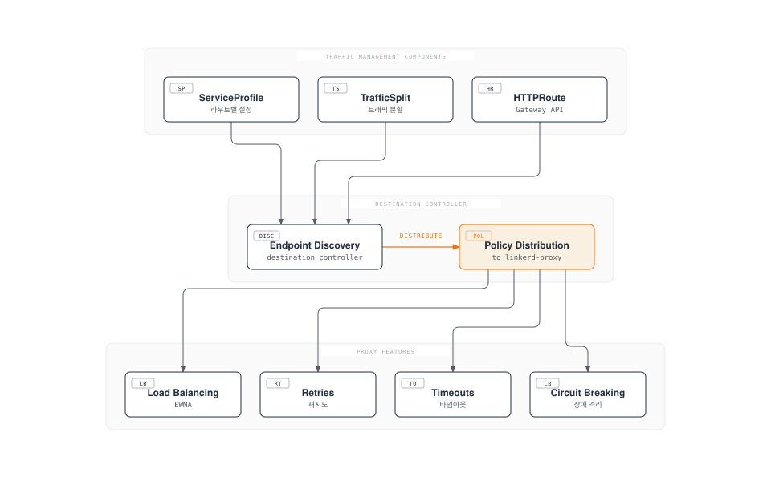
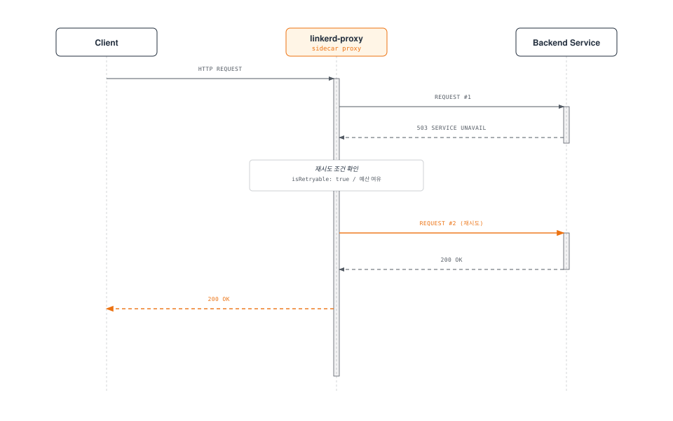
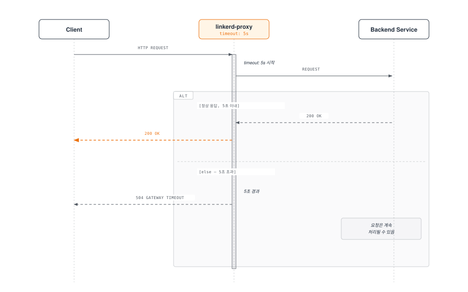
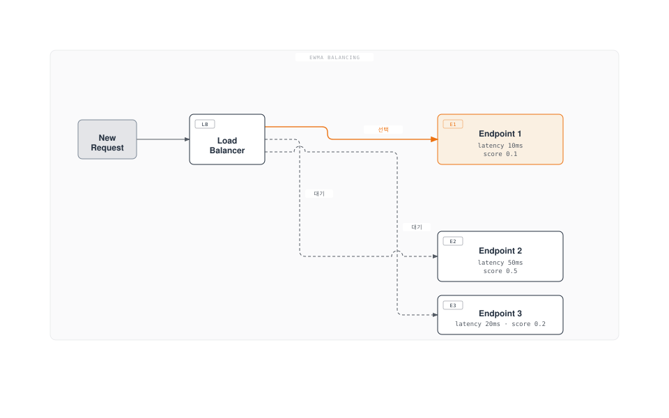
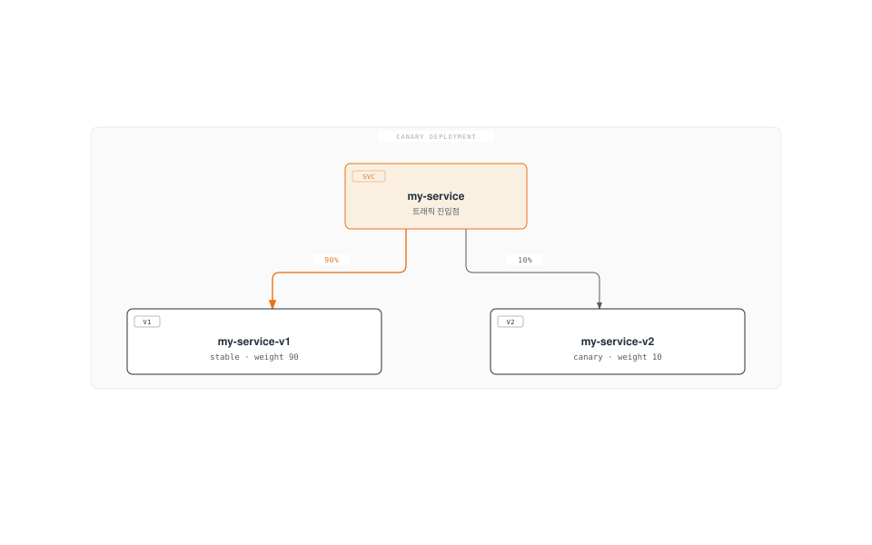
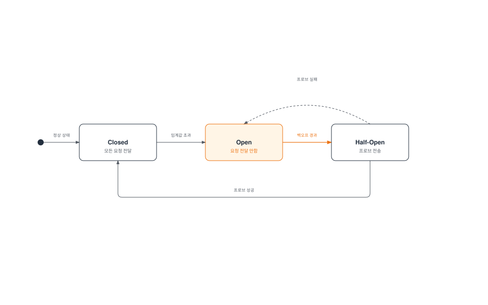
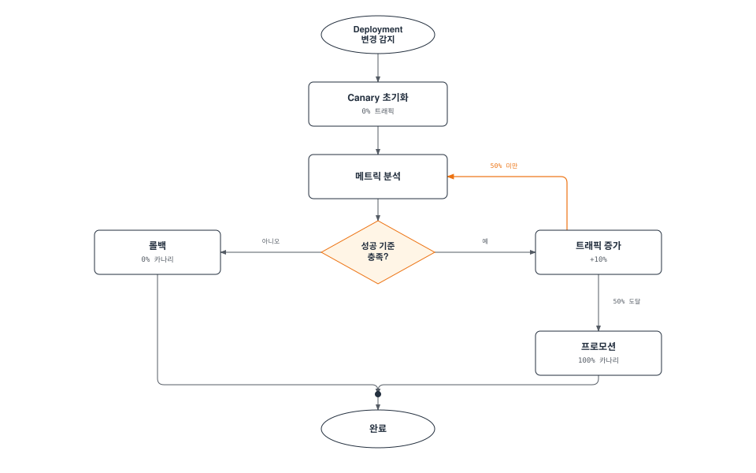

# Linkerd 트래픽 관리

> **지원 버전**: Linkerd 2.16+
> **마지막 업데이트**: 2026년 2월 22일

## 개요

Linkerd는 ServiceProfile, TrafficSplit, HTTPRoute 등을 통해 서비스 간 트래픽을 세밀하게 제어할 수 있습니다. 이 문서에서는 재시도, 타임아웃, 트래픽 분할, 카나리 배포 등 트래픽 관리 기능을 상세히 설명합니다.

## 트래픽 관리 아키텍처



## ServiceProfile

ServiceProfile은 Linkerd의 핵심 트래픽 관리 리소스로, 서비스별로 라우트를 정의하고 각 라우트에 대한 재시도, 타임아웃, 메트릭을 설정합니다.

### ServiceProfile 구조

```yaml
apiVersion: linkerd.io/v1alpha2
kind: ServiceProfile
metadata:
  name: web-service.my-app.svc.cluster.local
  namespace: my-app
spec:
  # 라우트 정의
  routes:
  - name: GET /api/users
    condition:
      method: GET
      pathRegex: /api/users(/.*)?
    # 이 라우트는 재시도 가능
    isRetryable: true
    # 타임아웃 설정
    timeout: 5s

  - name: POST /api/orders
    condition:
      method: POST
      pathRegex: /api/orders
    # POST 요청은 기본적으로 재시도하지 않음
    isRetryable: false
    timeout: 10s

  - name: GET /health
    condition:
      method: GET
      pathRegex: /health
    isRetryable: true
    timeout: 1s

  # 재시도 예산 (전체 요청 대비 재시도 비율)
  retryBudget:
    retryRatio: 0.2          # 최대 20% 추가 요청
    minRetriesPerSecond: 10  # 초당 최소 재시도 수
    ttl: 10s                 # 예산 리셋 주기
```

### 라우트 조건

```yaml
# HTTP 메서드와 경로 매칭
routes:
- name: user-read
  condition:
    method: GET
    pathRegex: /api/v1/users/[^/]+

- name: user-list
  condition:
    method: GET
    pathRegex: /api/v1/users$

- name: user-create
  condition:
    method: POST
    pathRegex: /api/v1/users

- name: user-update
  condition:
    method: PUT
    pathRegex: /api/v1/users/[^/]+

- name: user-delete
  condition:
    method: DELETE
    pathRegex: /api/v1/users/[^/]+
```

### ServiceProfile 자동 생성

```bash
# Swagger/OpenAPI에서 ServiceProfile 생성
linkerd profile --open-api swagger.yaml web-service.my-app.svc.cluster.local

# 실제 트래픽에서 ServiceProfile 생성 (tap 사용)
linkerd viz profile --tap deploy/web-service -n my-app --tap-duration 60s

# 프로토버프에서 ServiceProfile 생성
linkerd profile --proto service.proto web-service.my-app.svc.cluster.local
```

### 상세 예제

```yaml
apiVersion: linkerd.io/v1alpha2
kind: ServiceProfile
metadata:
  name: api-gateway.production.svc.cluster.local
  namespace: production
spec:
  routes:
  # 사용자 인증 - 빠른 응답 필요
  - name: POST /auth/login
    condition:
      method: POST
      pathRegex: /auth/login
    isRetryable: false  # 인증 요청은 재시도 안함 (중복 로그인 방지)
    timeout: 3s

  # 사용자 프로필 조회 - 캐시 가능, 재시도 가능
  - name: GET /users/profile
    condition:
      method: GET
      pathRegex: /users/[^/]+/profile
    isRetryable: true
    timeout: 2s

  # 주문 생성 - 멱등성 없음, 재시도 위험
  - name: POST /orders
    condition:
      method: POST
      pathRegex: /orders
    isRetryable: false
    timeout: 30s  # 결제 처리에 시간 소요

  # 주문 조회 - 안전한 작업
  - name: GET /orders
    condition:
      method: GET
      pathRegex: /orders(/.*)?
    isRetryable: true
    timeout: 5s

  # 헬스체크 - 빠른 응답 필수
  - name: health-check
    condition:
      method: GET
      pathRegex: /(health|ready|live)
    isRetryable: true
    timeout: 500ms

  retryBudget:
    retryRatio: 0.2
    minRetriesPerSecond: 10
    ttl: 10s
```

## 재시도 (Retries)

Linkerd는 실패한 요청을 자동으로 재시도하여 일시적인 장애를 극복합니다.

### 재시도 동작 방식



### 재시도 조건

```yaml
# 재시도가 발생하는 조건
# 1. ServiceProfile에서 isRetryable: true
# 2. 응답이 재시도 가능한 상태 코드
#    - 5xx 서버 오류
#    - 연결 실패
#    - 타임아웃
# 3. 재시도 예산 내 여유 있음

routes:
- name: GET /api/data
  condition:
    method: GET
    pathRegex: /api/data
  isRetryable: true  # 이 라우트는 재시도 가능
```

### 재시도 예산

```yaml
# 재시도 예산 설정
retryBudget:
  # 원래 요청 대비 추가 재시도 비율
  # 0.2 = 100개 요청 중 최대 20개 추가 재시도
  retryRatio: 0.2

  # 트래픽이 적을 때 최소 재시도 수
  # 낮은 트래픽에서도 재시도 가능하도록
  minRetriesPerSecond: 10

  # 예산 리셋 주기
  ttl: 10s
```

### 재시도 모니터링

```bash
# 재시도 메트릭 확인
linkerd viz stat deploy/my-service -n my-app

# 라우트별 재시도 확인
linkerd viz routes deploy/my-service -n my-app

# 예상 출력:
# ROUTE                       SERVICE   SUCCESS   RPS  LATENCY_P50  LATENCY_P95  LATENCY_P99
# GET /api/users              my-app    95.00%   100       10ms         50ms        100ms
# POST /api/orders            my-app    99.50%    50       20ms        100ms        200ms
# [RETRIES]                   my-app     5.00%    10        -            -            -
```

## 타임아웃 (Timeouts)

타임아웃은 요청이 지정된 시간 내에 완료되지 않으면 실패로 처리합니다.

### 라우트별 타임아웃

```yaml
apiVersion: linkerd.io/v1alpha2
kind: ServiceProfile
metadata:
  name: backend.my-app.svc.cluster.local
  namespace: my-app
spec:
  routes:
  # 빠른 응답이 필요한 API
  - name: GET /api/quick
    condition:
      method: GET
      pathRegex: /api/quick
    timeout: 100ms
    isRetryable: true

  # 일반 API
  - name: GET /api/normal
    condition:
      method: GET
      pathRegex: /api/normal
    timeout: 5s
    isRetryable: true

  # 느린 작업 (파일 처리 등)
  - name: POST /api/process
    condition:
      method: POST
      pathRegex: /api/process
    timeout: 60s
    isRetryable: false

  # 스트리밍 (타임아웃 없음)
  - name: GET /api/stream
    condition:
      method: GET
      pathRegex: /api/stream
    # timeout 미지정 = 타임아웃 없음
```

### 타임아웃 동작



## 로드 밸런싱

Linkerd는 EWMA(Exponentially Weighted Moving Average) 알고리즘을 사용하여 지능적인 로드 밸런싱을 수행합니다.

### EWMA 알고리즘



**EWMA 특성:**

| 특성 | 설명 |
|------|------|
| 지연 시간 기반 | 응답 시간이 빠른 엔드포인트 선호 |
| 실시간 적응 | 엔드포인트 상태 변화에 빠르게 적응 |
| 공정한 분배 | 새 엔드포인트도 트래픽 받을 기회 제공 |
| 자동 회피 | 느린 엔드포인트 자동으로 트래픽 감소 |

### 로드 밸런싱 모니터링

```bash
# 엔드포인트별 트래픽 분포 확인
linkerd viz stat deploy/my-service -n my-app --to deploy/backend

# Pod별 상태 확인
linkerd viz stat po -n my-app

# 실시간 요청 흐름 확인
linkerd viz top deploy/my-service -n my-app
```

## TrafficSplit (SMI)

TrafficSplit은 SMI(Service Mesh Interface) 표준을 따르는 트래픽 분할 리소스입니다.

### 기본 구조

```yaml
apiVersion: split.smi-spec.io/v1alpha2
kind: TrafficSplit
metadata:
  name: my-service-split
  namespace: my-app
spec:
  # 트래픽을 분할할 서비스
  service: my-service

  # 백엔드 서비스들과 가중치
  backends:
  - service: my-service-v1
    weight: 90   # 90% 트래픽
  - service: my-service-v2
    weight: 10   # 10% 트래픽
```

### 카나리 배포



**단계적 카나리 배포:**

```yaml
# 단계 1: 초기 카나리 (1%)
apiVersion: split.smi-spec.io/v1alpha2
kind: TrafficSplit
metadata:
  name: web-split
  namespace: production
spec:
  service: web
  backends:
  - service: web-stable
    weight: 99
  - service: web-canary
    weight: 1

---
# 단계 2: 확대 (10%)
apiVersion: split.smi-spec.io/v1alpha2
kind: TrafficSplit
metadata:
  name: web-split
  namespace: production
spec:
  service: web
  backends:
  - service: web-stable
    weight: 90
  - service: web-canary
    weight: 10

---
# 단계 3: 확대 (50%)
apiVersion: split.smi-spec.io/v1alpha2
kind: TrafficSplit
metadata:
  name: web-split
  namespace: production
spec:
  service: web
  backends:
  - service: web-stable
    weight: 50
  - service: web-canary
    weight: 50

---
# 단계 4: 완료 (100%)
apiVersion: split.smi-spec.io/v1alpha2
kind: TrafficSplit
metadata:
  name: web-split
  namespace: production
spec:
  service: web
  backends:
  - service: web-stable
    weight: 0
  - service: web-canary
    weight: 100
```

### TrafficSplit 서비스 설정

```yaml
# Apex 서비스 (트래픽 진입점)
apiVersion: v1
kind: Service
metadata:
  name: web
  namespace: production
spec:
  selector:
    app: web  # 실제로는 사용되지 않음 (TrafficSplit이 라우팅)
  ports:
  - port: 80
    targetPort: 8080

---
# Stable 버전 서비스
apiVersion: v1
kind: Service
metadata:
  name: web-stable
  namespace: production
spec:
  selector:
    app: web
    version: stable
  ports:
  - port: 80
    targetPort: 8080

---
# Canary 버전 서비스
apiVersion: v1
kind: Service
metadata:
  name: web-canary
  namespace: production
spec:
  selector:
    app: web
    version: canary
  ports:
  - port: 80
    targetPort: 8080

---
# Stable Deployment
apiVersion: apps/v1
kind: Deployment
metadata:
  name: web-stable
  namespace: production
spec:
  replicas: 3
  selector:
    matchLabels:
      app: web
      version: stable
  template:
    metadata:
      labels:
        app: web
        version: stable
    spec:
      containers:
      - name: web
        image: myapp:v1.0.0

---
# Canary Deployment
apiVersion: apps/v1
kind: Deployment
metadata:
  name: web-canary
  namespace: production
spec:
  replicas: 1
  selector:
    matchLabels:
      app: web
      version: canary
  template:
    metadata:
      labels:
        app: web
        version: canary
    spec:
      containers:
      - name: web
        image: myapp:v1.1.0
```

### TrafficSplit 모니터링

```bash
# TrafficSplit 상태 확인
kubectl get trafficsplit -n production

# 버전별 트래픽 통계
linkerd viz stat deploy -n production

# 예상 출력:
# NAME         MESHED   SUCCESS   RPS  LATENCY_P50  LATENCY_P95
# web-stable   3/3      99.50%   900       10ms         50ms
# web-canary   1/1      98.00%   100       15ms         80ms
```

## HTTPRoute (Gateway API)

Linkerd 2.14+부터 Gateway API의 HTTPRoute를 지원합니다.

### HTTPRoute 기본 구조

```yaml
apiVersion: gateway.networking.k8s.io/v1beta1
kind: HTTPRoute
metadata:
  name: web-route
  namespace: my-app
spec:
  parentRefs:
  - name: web
    kind: Service
    group: core
    port: 80

  rules:
  # 헤더 기반 라우팅
  - matches:
    - headers:
      - name: x-version
        value: beta
    backendRefs:
    - name: web-beta
      port: 80

  # 기본 라우팅
  - backendRefs:
    - name: web-stable
      port: 80
```

### 고급 HTTPRoute 설정

```yaml
apiVersion: gateway.networking.k8s.io/v1beta1
kind: HTTPRoute
metadata:
  name: api-route
  namespace: production
spec:
  parentRefs:
  - name: api-gateway
    kind: Service
    group: core
    port: 80

  rules:
  # 카나리: 특정 헤더가 있는 요청
  - matches:
    - headers:
      - name: x-canary
        value: "true"
    backendRefs:
    - name: api-canary
      port: 80

  # 베타 사용자: 쿠키 기반
  - matches:
    - headers:
      - name: cookie
        value: "beta=true"
    backendRefs:
    - name: api-beta
      port: 80

  # A/B 테스트: 가중치 기반 분할
  - backendRefs:
    - name: api-v1
      port: 80
      weight: 80
    - name: api-v2
      port: 80
      weight: 20

---
# 경로 기반 라우팅
apiVersion: gateway.networking.k8s.io/v1beta1
kind: HTTPRoute
metadata:
  name: path-route
  namespace: production
spec:
  parentRefs:
  - name: frontend
    kind: Service
    group: core
    port: 80

  rules:
  # /api/* -> api-service
  - matches:
    - path:
        type: PathPrefix
        value: /api
    backendRefs:
    - name: api-service
      port: 80

  # /static/* -> static-service
  - matches:
    - path:
        type: PathPrefix
        value: /static
    backendRefs:
    - name: static-service
      port: 80

  # 그 외 -> web-service
  - backendRefs:
    - name: web-service
      port: 80
```

## Circuit Breaking (장애 격리)

Linkerd는 failure accrual을 통해 서킷 브레이커 패턴을 구현합니다.

### Failure Accrual 동작



**동작 방식:**

| 상태 | 설명 |
|------|------|
| Closed | 정상 작동, 모든 요청 전달 |
| Open | 엔드포인트로 요청 전달 안함 |
| Half-Open | 주기적으로 프로브 요청 전송 |

### 서킷 브레이커 설정

```yaml
# 현재 Linkerd는 자동 failure accrual 사용
# 연속 실패 시 해당 엔드포인트를 일시적으로 제외

# 프록시 레벨에서 자동 동작:
# - 연속 5회 연결 실패 시 엔드포인트 제외
# - 지수 백오프로 재시도
# - 성공 시 정상 상태로 복귀
```

### 장애 격리 모니터링

```bash
# 엔드포인트 상태 확인
linkerd viz stat po -n my-app

# 실패율 확인
linkerd viz routes deploy/my-service -n my-app

# 실시간 실패 모니터링
linkerd viz tap deploy/my-service -n my-app --method GET --path /api
```

## Flagger를 사용한 자동 카나리 배포

Flagger는 Linkerd와 통합하여 자동화된 카나리 배포를 제공합니다.

### Flagger 설치

```bash
# Flagger CRD 설치
kubectl apply -f https://raw.githubusercontent.com/fluxcd/flagger/main/artifacts/flagger/crd.yaml

# Flagger 설치 (Linkerd 지원)
helm repo add flagger https://flagger.app
helm upgrade -i flagger flagger/flagger \
  --namespace linkerd-viz \
  --set meshProvider=linkerd \
  --set metricsServer=http://prometheus.linkerd-viz:9090
```

### Canary 리소스 정의

```yaml
apiVersion: flagger.app/v1beta1
kind: Canary
metadata:
  name: web
  namespace: production
spec:
  # 대상 Deployment
  targetRef:
    apiVersion: apps/v1
    kind: Deployment
    name: web

  # 자동 생성될 서비스
  service:
    port: 80
    targetPort: 8080

  # 분석 설정
  analysis:
    # 분석 간격
    interval: 30s
    # 프로모션 전 필요한 성공 횟수
    threshold: 5
    # 최대 실패 허용 횟수
    maxWeight: 50
    # 단계별 증가량
    stepWeight: 10

    # 성공 기준
    metrics:
    - name: request-success-rate
      # 99% 이상 성공률 필요
      thresholdRange:
        min: 99
      interval: 1m

    - name: request-duration
      # p99 지연 시간 500ms 이하
      thresholdRange:
        max: 500
      interval: 1m

    # 웹훅 (추가 검증)
    webhooks:
    - name: load-test
      url: http://flagger-loadtester.test/
      timeout: 5s
      metadata:
        type: cmd
        cmd: "hey -z 1m -q 10 -c 2 http://web-canary.production:80/"
```

### Flagger 배포 흐름



### Flagger 메트릭 템플릿

```yaml
apiVersion: flagger.app/v1beta1
kind: MetricTemplate
metadata:
  name: linkerd-success-rate
  namespace: linkerd-viz
spec:
  provider:
    type: prometheus
    address: http://prometheus.linkerd-viz:9090
  query: |
    sum(rate(response_total{
      namespace="{{ namespace }}",
      deployment=~"{{ target }}",
      classification!="failure"
    }[{{ interval }}]))
    /
    sum(rate(response_total{
      namespace="{{ namespace }}",
      deployment=~"{{ target }}"
    }[{{ interval }}]))
    * 100

---
apiVersion: flagger.app/v1beta1
kind: MetricTemplate
metadata:
  name: linkerd-request-duration
  namespace: linkerd-viz
spec:
  provider:
    type: prometheus
    address: http://prometheus.linkerd-viz:9090
  query: |
    histogram_quantile(0.99,
      sum(rate(response_latency_ms_bucket{
        namespace="{{ namespace }}",
        deployment=~"{{ target }}"
      }[{{ interval }}])) by (le)
    )
```

### Flagger 모니터링

```bash
# Canary 상태 확인
kubectl get canary -n production

# 상세 상태
kubectl describe canary web -n production

# Flagger 로그
kubectl logs -n linkerd-viz deploy/flagger -f

# 이벤트 확인
kubectl get events -n production --field-selector involvedObject.kind=Canary
```

## 헤더 기반 라우팅

### 디버깅용 헤더 라우팅

```yaml
apiVersion: gateway.networking.k8s.io/v1beta1
kind: HTTPRoute
metadata:
  name: debug-route
  namespace: my-app
spec:
  parentRefs:
  - name: api-service
    kind: Service
    group: core
    port: 80

  rules:
  # 디버그 모드
  - matches:
    - headers:
      - name: x-debug
        value: "true"
    backendRefs:
    - name: api-debug
      port: 80

  # 특정 사용자 테스트
  - matches:
    - headers:
      - name: x-user-id
        value: "test-user-123"
    backendRefs:
    - name: api-test
      port: 80

  # 기본
  - backendRefs:
    - name: api-stable
      port: 80
```

## 트래픽 관리 모범 사례

### 1. ServiceProfile 정의 전략

```yaml
# 모든 주요 라우트에 대해 ServiceProfile 정의
apiVersion: linkerd.io/v1alpha2
kind: ServiceProfile
metadata:
  name: critical-service.production.svc.cluster.local
  namespace: production
spec:
  routes:
  # 읽기 작업: 재시도 가능, 짧은 타임아웃
  - name: read-operations
    condition:
      method: GET
      pathRegex: /api/.*
    isRetryable: true
    timeout: 5s

  # 쓰기 작업: 재시도 불가, 긴 타임아웃
  - name: write-operations
    condition:
      method: POST|PUT|DELETE
      pathRegex: /api/.*
    isRetryable: false
    timeout: 30s

  # 헬스체크: 매우 짧은 타임아웃
  - name: health
    condition:
      method: GET
      pathRegex: /(health|ready|live)
    timeout: 500ms

  retryBudget:
    retryRatio: 0.2
    minRetriesPerSecond: 10
    ttl: 10s
```

### 2. 점진적 트래픽 전환

```bash
# 자동화된 카나리 배포 스크립트
#!/bin/bash

SERVICE="web"
NAMESPACE="production"

# 단계별 트래픽 전환
for weight in 1 5 10 25 50 75 100; do
  echo "Setting canary weight to ${weight}%"

  cat <<EOF | kubectl apply -f -
apiVersion: split.smi-spec.io/v1alpha2
kind: TrafficSplit
metadata:
  name: ${SERVICE}-split
  namespace: ${NAMESPACE}
spec:
  service: ${SERVICE}
  backends:
  - service: ${SERVICE}-stable
    weight: $((100 - weight))
  - service: ${SERVICE}-canary
    weight: ${weight}
EOF

  # 메트릭 확인 대기
  sleep 60

  # 성공률 확인
  SUCCESS_RATE=$(linkerd viz stat deploy/${SERVICE}-canary -n ${NAMESPACE} -o json | jq '.success_rate')

  if (( $(echo "$SUCCESS_RATE < 0.95" | bc -l) )); then
    echo "Success rate too low: ${SUCCESS_RATE}. Rolling back..."
    # 롤백 로직
    break
  fi
done
```

### 3. 타임아웃 튜닝

```yaml
# 서비스 유형별 타임아웃 가이드라인
routes:
# 동기 API: 1-5초
- name: sync-api
  timeout: 5s

# 비동기 처리: 30-60초
- name: async-process
  timeout: 60s

# 파일 업로드: 5-10분
- name: file-upload
  timeout: 600s

# 스트리밍: 타임아웃 없음
- name: streaming
  # timeout 미지정
```

## 다음 단계

- [보안](./04-security.md): mTLS 및 인가 정책
- [관찰성](./05-observability.md): 메트릭 및 대시보드
- [다중 클러스터](./06-multi-cluster.md): 클러스터 간 트래픽 관리

## 참고 자료

- [Linkerd Traffic Management](https://linkerd.io/2/features/traffic-split/)
- [ServiceProfile Reference](https://linkerd.io/2/reference/service-profiles/)
- [SMI TrafficSplit Spec](https://github.com/servicemeshinterface/smi-spec/blob/main/apis/traffic-split/v1alpha2/traffic-split.md)
- [Flagger Documentation](https://flagger.app/tutorials/linkerd-progressive-delivery/)
