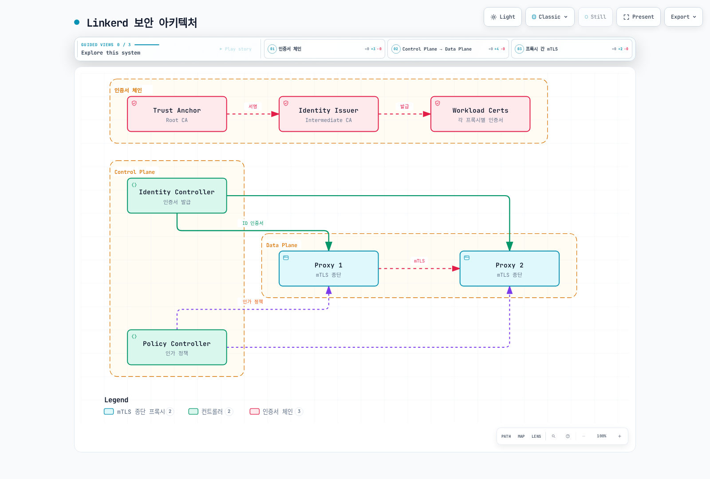

# Linkerd 보안

> **검토 기준**: 2026년 9월 11일 · Linkerd edge-26.9.1 · cert-manager 예제는 1.21.1 기준 검증

Linkerd는 proxy가 처리하는 트래픽에 workload 인증, 전송 암호화, inbound 인가를 제공합니다. Mesh 등록, 정책, 인증서 수명주기, 애플리케이션 보안은 별도로 설계해야 합니다. 지원되는 Kubernetes/Gateway API 조합은 [설치 가이드](01-installation.md)를 따르며 아래 예제는 해당 설치와 기존 애플리케이션을 전제로 합니다.

## 보안 아키텍처



[인터랙티브 다이어그램 보기](https://www.atomai.click/kubernetes-docs/archmaps/ko-service-mesh-linkerd-04-security-0.html)

## 자동 mTLS

Linkerd는 mesh Pod 사이의 대상 TCP 트래픽에 mTLS를 자동 적용합니다. 양쪽 proxy가 참여하고 인증서 체인을 신뢰하며 해당 트래픽을 받아야 합니다. Skip port는 proxy를 우회하고 UDP는 이 TCP 기능의 대상이 아닙니다. 한쪽에만 proxy가 있다고 mesh 밖 endpoint와의 트래픽에 Linkerd mTLS가 생기지는 않습니다.

애플리케이션이 평문 HTTP를 사용하면 outbound proxy가 상대 proxy를 인증하고 네트워크 구간을 암호화합니다. 수신 proxy는 caller를 인증하고 local 애플리케이션으로 HTTP를 전달합니다. 애플리케이션이 직접 시작한 TLS는 mesh 안에서도 암호화 상태를 유지할 수 있습니다. Linkerd가 모든 외부/opaque TLS stream을 자동 복호화하지는 않습니다.

| 특성 | 의미와 범위 |
|---|---|
| 투명한 암호화 | 대상 proxy 간 구간에는 애플리케이션의 TLS 구현이 필요하지 않음 |
| 상호 인증 | Proxy가 workload identity를 인증하며 최종 사용자를 인증하는 것은 아님 |
| TLS 1.3 | 선택한 버전의 mesh TLS protocol |
| Leaf 자동 갱신 | Proxy가 짧은 수명의 workload 인증서를 정상적으로 갱신 |
| Root/issuer 수명주기 | 별도 credential이므로 교체와 모니터링이 필요 |

기본 설정은 mesh 밖에서 들어오는 평문을 허용합니다. 인가 정책으로 이를 거부할 수 있습니다. 따라서 “mTLS 활성화”와 “모든 inbound 접근에 인증된 mesh identity 필요”는 다릅니다. Proxy를 우회하거나 proxy 없이 시작하는 경로에는 network policy와 admission 제어도 필요합니다.

### 암호화와 identity 관찰

```bash
linkerd check --proxy
linkerd viz edges deploy -n production
linkerd viz tap deploy/api -n production --method GET
linkerd identity -n production -l app=api
kubectl -n production get pods -l app=api \
  -o custom-columns=NAME:.metadata.name,SERVICEACCOUNT:.spec.serviceAccountName
```

`viz edges`는 관찰된 resource edge와 보안 상태를 보여 주며 가능한 모든 연결이나 idle connection의 목록은 아닙니다. `tap`도 지원되는 관찰 트래픽을 보여 줄 뿐 전체 packet/security audit이 아닙니다. 표시 형식을 Prometheus의 TLS label 값과 동일시하지 않습니다. 의도한 client identity로 허용 요청과 의도적인 거부 요청을 모두 확인합니다.

`linkerd identity`는 port forwarding으로 선택한 Pod의 공개 인증서를 조회합니다. SAN, issuer, 유효 기간을 확인합니다. Proxy 이미지 안의 특정 경로에 발급된 leaf 파일이 있다고 가정할 필요가 없습니다.

## Workload Identity

표준 Kubernetes identity 경로는 다음 DNS 형식을 사용합니다.

```text
<service-account>.<namespace>.serviceaccount.identity.<control-plane-namespace>.<trust-domain>

web.production.serviceaccount.identity.linkerd.cluster.local
api.production.serviceaccount.identity.linkerd.cluster.local
```

예제의 control plane namespace는 `linkerd`, trust domain은 `cluster.local`입니다. Root 인증서의 common name 자체가 workload trust-domain 설정은 아닙니다. 이전 문서의 Istio식 `spiffe://.../ns/.../sa/...` URI 형식과 다릅니다. 같은 ServiceAccount를 사용하는 여러 Pod는 인가 identity를 공유하지만 private key/인증서는 별도입니다.

Proxy는 key와 CSR을 생성하고 projected ServiceAccount token과 함께 Identity에 보냅니다. Identity는 Kubernetes TokenReview로 token을 검증하고 요청한 identity를 확인한 뒤 **issuer의 key**로 서명합니다. Root는 issuer에 서명하며 모든 proxy 요청에 직접 서명하지 않습니다. Private key도 ServiceAccount token에서 파생되지 않습니다.

기본 workload 인증서 수명은 약 24시간이며 만료 전에 갱신합니다. 인증서 요청이 새 Kubernetes ServiceAccount를 만들지는 않고 갱신마다 모든 key가 교체된다고 보장하지도 않습니다. 수명주기는 [아키텍처 가이드](02-architecture.md)를 참고합니다.

## 인가 정책

다음 리소스는 Linkerd의 `policy.linkerd.io` API입니다. `AuthorizationPolicy`는 Gateway API 리소스가 아니며 Linkerd 2.12에서 도입되었습니다. Gateway API 정의를 사용하는 route를 대상으로 할 수는 있습니다.

| 리소스 | 역할 |
|---|---|
| Server | 같은 namespace의 대상 Pod에 선언된 inbound port 선택 |
| Server에 연결한 HTTPRoute/GRPCRoute | Inbound 요청의 일부 선택 |
| MeshTLSAuthentication | 허용할 mesh identity 정의 |
| NetworkAuthentication | Client IP network 정의이며 mTLS를 제공하지는 않음 |
| AuthorizationPolicy | 인증 조건을 만족하면 대상 접근 허용 |
| ServerAuthorization | 이전 Server 전용 허용 정책이며 선택한 CRD는 `v1beta1` 지원 |

`ServerAuthorization`과 `AuthorizationPolicy`는 대안적인 허용 방식이며 순차적으로 연결되는 pipeline이 아닙니다. 여러 허용 정책은 접근 범위를 넓힐 수 있습니다. 하나의 AuthorizationPolicy 안의 여러 `requiredAuthenticationRefs`는 **모두** 일치해야 합니다. Namespace 대상 AuthorizationPolicy는 그 namespace에 정의된 정책 대상을 포함하며 선언하지 않은 모든 port의 정책을 자동 생성하지 않습니다.

Server끼리 같은 Pod/port 조합을 중복 선택하면 안 됩니다. Pod specification에 애플리케이션 port를 선언합니다. Namespace의 기본 정책이 허용적이어도 Server는 기본적으로 일치하지 않는 트래픽을 거부합니다. 준비 단계의 `accessPolicy: audit`은 일치하지 않는 트래픽을 관찰하는 데 유용하지만 이를 허용하므로 강제 적용이 아닙니다.

### 기본 정책

다음 annotation은 등록된 namespace에서 새로 생성되는 proxy의 기본값을 설정합니다.

```yaml
apiVersion: v1
kind: Namespace
metadata:
  name: production
  annotations:
    linkerd.io/inject: enabled
    config.linkerd.io/default-inbound-policy: deny
```

Namespace annotation을 바꿔도 기존 proxy에 초기화된 기본값이 소급 변경되지는 않습니다. Workload별 rollout을 조정하고 readiness를 확인합니다. 동적 정책 CRD는 별도 기능이며 모든 Pod를 교체하지 않고 정책을 갱신할 수 있습니다.

Cluster 전체 Helm 값은 `policyController.defaultPolicy`가 아닌 `proxy.defaultInboundPolicy`입니다. CA 설정과 release 소유권을 보존하며 전체 설치 values에 병합합니다.

```yaml
proxy:
  defaultInboundPolicy: deny
```

| 기본값 | 의미 |
|---|---|
| all-unauthenticated | Mesh 인증을 요구하지 않고 트래픽 허용; 설치 기본값 |
| all-authenticated | 올바르게 신뢰하는 multicluster client를 포함하여 인증된 mesh client 요구 |
| cluster-authenticated | 같은 cluster의 인증된 client 요구 |
| cluster-unauthenticated | Mesh 인증 없이 설정된 cluster network 범위의 client 허용 |
| deny | 명시적 정책과 문서화된 probe 처리를 제외한 미일치 트래픽 거부 |
| audit | 미일치 트래픽을 허용하며 audit 근거 기록 |

Cluster 범위는 최종 사용자 identity나 애플리케이션 인가 경계가 아닙니다. 설정한 network와 proxy에 보이는 source address를 확인합니다.

### Microservice 예제

별도의 이 예제에는 `production`의 mesh frontend/API/PostgreSQL workload, `app: frontend/api/postgres`, 아래에 선언한 port, 대응하는 ServiceAccount가 필요합니다. `ingress` namespace에는 `edge-gateway` ServiceAccount로 실행하는 mesh ingress workload를 준비합니다. 이름만 적어 gateway를 설치하거나 인증하는 것은 아닙니다.

```yaml
apiVersion: policy.linkerd.io/v1beta3
kind: Server
metadata:
  name: frontend-http
  namespace: production
spec:
  podSelector:
    matchLabels:
      app: frontend
  port: 8080
  proxyProtocol: HTTP/1
  accessPolicy: deny
---
apiVersion: policy.linkerd.io/v1alpha1
kind: AuthorizationPolicy
metadata:
  name: frontend-from-gateway
  namespace: production
spec:
  targetRef:
    group: policy.linkerd.io
    kind: Server
    name: frontend-http
  requiredAuthenticationRefs:
  - kind: ServiceAccount
    name: edge-gateway
    namespace: ingress
---
apiVersion: policy.linkerd.io/v1beta3
kind: Server
metadata:
  name: api-http
  namespace: production
spec:
  podSelector:
    matchLabels:
      app: api
  port: 8080
  proxyProtocol: HTTP/1
  accessPolicy: deny
---
apiVersion: policy.linkerd.io/v1alpha1
kind: AuthorizationPolicy
metadata:
  name: api-from-frontend
  namespace: production
spec:
  targetRef:
    group: policy.linkerd.io
    kind: Server
    name: api-http
  requiredAuthenticationRefs:
  - kind: ServiceAccount
    name: frontend
    namespace: production
---
apiVersion: policy.linkerd.io/v1beta3
kind: Server
metadata:
  name: database-tcp
  namespace: production
spec:
  podSelector:
    matchLabels:
      app: postgres
  port: 5432
  proxyProtocol: opaque
  accessPolicy: deny
---
apiVersion: policy.linkerd.io/v1alpha1
kind: AuthorizationPolicy
metadata:
  name: database-from-api
  namespace: production
spec:
  targetRef:
    group: policy.linkerd.io
    kind: Server
    name: database-tcp
  requiredAuthenticationRefs:
  - kind: ServiceAccount
    name: api
    namespace: production
```

의도한 호출 순서는 gateway → frontend → API → database입니다. YAML에 ServiceAccount 이름만 적는 것으로 충분하지 않으며 caller가 해당 계정의 인증된 identity를 제시해야 합니다. 더 넓은 namespace/Server 허용 정책이 원치 않는 caller도 통과시키는지 확인합니다.

Linkerd는 Server에 명시적인 route가 연결되지 않았다면 선언된 HTTP health/readiness probe의 인가를 보통 자동 추가합니다. HTTPRoute/GRPCRoute를 연결하면 이 기본 probe 허용은 생성되지 않으므로 필요한 probe route와 제한된 접근을 명시해야 합니다. Probe 하나를 성공시키려고 business port 전체에 비인증 접근을 허용하지 않습니다.

참고용으로 다음 **이전 방식의 대안 정책**은 API에 대한 frontend 허용과 같은 목적입니다. 위 AuthorizationPolicy와 함께 적용할 필요는 없습니다.

```yaml
apiVersion: policy.linkerd.io/v1beta1
kind: ServerAuthorization
metadata:
  name: api-from-frontend-legacy
  namespace: production
spec:
  server:
    name: api-http
  client:
    meshTLS:
      serviceAccounts:
      - name: frontend
        namespace: production
```

선택한 버전은 `ServerAuthorization/v1beta2`를 제공하지 않습니다. Server의 버전만 보고 다른 리소스의 API 버전을 추정하지 않습니다. `client.unauthenticated:true`는 mesh 인증 없는 client를 허용하지만 `meshTLS.identities:["*"]`는 여전히 mesh identity를 요구하며 매우 넓게 허용합니다.

### Metrics port와 검증

API Pod에 명시적으로 선언한 **애플리케이션 metrics port 9091**의 허용 예제입니다.

```yaml
apiVersion: policy.linkerd.io/v1beta3
kind: Server
metadata:
  name: api-app-metrics
  namespace: production
spec:
  podSelector:
    matchLabels:
      app: api
  port: 9091
  proxyProtocol: HTTP/1
  accessPolicy: deny
---
apiVersion: policy.linkerd.io/v1alpha1
kind: AuthorizationPolicy
metadata:
  name: metrics-from-prometheus
  namespace: production
spec:
  targetRef:
    group: policy.linkerd.io
    kind: Server
    name: api-app-metrics
  requiredAuthenticationRefs:
  - kind: ServiceAccount
    name: prometheus
    namespace: monitoring
```

이는 기본 **4191**인 proxy 자체 admin port와 다릅니다. Proxy-init 설정은 admin/control port를 일반 inbound interception에서 제외합니다. 따라서 4191에 Server를 정의해도 해당 endpoint가 mTLS로 보호되는 애플리케이션 port가 되지는 않습니다. 관리 endpoint에는 실제 cluster/network 제어와 제한된 접근 경로를 사용합니다.

```bash
kubectl -n production get servers,authorizationpolicies,serverauthorizations
kubectl -n production get server api-http -o yaml
# Set this to an actual selected API Pod.
api_pod=api-example-pod
linkerd diagnostics policy -n production "pod/$api_pod" 8080 -o json
linkerd viz authz deploy/api -n production
```

HTTP로 식별한 트래픽의 정책 거부는 보통 HTTP 403이며 opaque/TCP 트래픽은 connection 수준에서 거부될 수 있습니다. 정책 변경이 기존 연결을 중단할 수도 있습니다. Kubernetes의 `Forbidden` event는 proxy 인가 거부를 요청마다 자동 기록하는 기능이 아닙니다. 정책 진단과 적합한 HTTP/TCP 인가 지표를 사용합니다.


## 인증서 관리

| Credential | 목적 | 기본/수동 소유권에서 확인할 점 |
|---|---|---|
| Trust anchor 인증서 bundle | Mesh가 신뢰하는 공개 root | 보통 ConfigMap `linkerd-identity-trust-roots`의 `ca-bundle.crt` |
| Identity issuer 인증서/key | Identity가 workload에 서명하는 intermediate CA | Secret `linkerd-identity-issuer`; key 이름은 issuer scheme에 따라 다름 |
| Workload 인증서/key | Proxy별 TLS credential | Proxy가 자동 갱신하는 짧은 수명의 leaf |

기본 CLI가 생성한 root와 issuer는 1년 뒤 만료되며 workload leaf는 보통 24시간입니다. 수동으로 10년 root를 선택할 수 있지만 일반적인 권장값이나 설치 기본값은 아닙니다. CA 정책과 복구 절차에 따라 수명/갱신 여유를 결정하고 체인의 모든 인증서를 추적합니다.

Linkerd에 제공하는 root/issuer credential은 **ECDSA P-256**이어야 합니다. [설치 가이드](01-installation.md)에 명시적인 생성 매개변수와 local private-key 취급을 설명했습니다. Root signing key는 공개 trust bundle과 분리하며 공개 ConfigMap에 넣지 않습니다.

### 유효한 공개 credential 조회

```bash
set -euo pipefail
umask 077
# Public trust bundle: ConfigMap data is not base64-encoded.
kubectl -n linkerd get configmap linkerd-identity-trust-roots -o json \
  | jq -er '.data["ca-bundle.crt"] | select(length > 0)' > current-trust.pem
# Select only public certificate data from the issuer Secret, never its key.
kubectl -n linkerd get secret linkerd-identity-issuer -o json \
  | jq -er '(.data["tls.crt"] // .data["crt.pem"]) | select(length > 0)' \
  | base64 -d > current-issuer.pem

# Show every certificate in a multi-root bundle, not only its first entry.
openssl crl2pkcs7 -nocrl -certfile current-trust.pem \
  | openssl pkcs7 -print_certs -text -noout
openssl x509 -in current-issuer.pem -noout -subject -issuer -dates
# Nonzero exit means expiration is within this window or parsing failed.
openssl x509 -in current-issuer.pem -noout -checkend 86400
```

기본 `linkerd.io/tls` scheme의 issuer Secret은 `crt.pem`/`key.pem`, `kubernetes.io/tls`는 `tls.crt`/`tls.key`를 사용합니다. 위 명령은 공개 인증서 데이터만 선택합니다. 변경 전 설정한 scheme과 리소스 소유자를 확인합니다.

Bundle의 모든 root를 확인합니다. `openssl x509` 단독 실행은 첫 인증서만 확인하므로 여러 root의 전체 만료 검사가 아닙니다. 날짜뿐 아니라 의도한 trust anchor에 대한 issuer chain도 검증하고 체인에 필요하면 intermediate 인증서도 제공합니다. 파싱/API 조회 실패를 “인증서 정상”으로 처리하지 않습니다.

### Trust anchor가 같은 issuer 갱신

Issuer는 소유자를 통해 갱신합니다. Linkerd 소유 Secret이면 전체 Helm/CLI 인증서 values, 관리되는 Secret이면 certificate controller를 사용합니다. Identity는 mount된 issuer 파일의 변경을 감지하고 새 credential을 검증한 뒤 유효한 issuer를 다시 읽습니다. 매번 Identity Deployment를 재시작해야 하는 것은 아닙니다.

```bash
kubectl -n linkerd get events --field-selector reason=IssuerUpdated
kubectl -n linkerd get events --field-selector reason=IssuerUpdateSkipped
kubectl -n linkerd logs deployment/linkerd-identity -c identity --tail=100
linkerd check --proxy
linkerd identity -n production -l app=api
```

`IssuerUpdated`는 Identity가 갱신을 수락했음을 나타냅니다. `IssuerUpdateSkipped`나 검증 오류는 조사해야 합니다. 기존 proxy leaf는 정상 갱신 시점까지 이전 issuer의 서명을 유지할 수 있으며 양쪽 체인이 유효하면 예상되는 동작입니다. 모든 leaf의 즉시 교체는 별도로 조정할 workload 작업입니다.

### Trust anchor 교체

Root 교체에는 단계적인 전환이 필요합니다. 아직 유효한 root의 절차가 이미 만료된 root의 복구를 보장하지는 않습니다.

1. 현재 root bundle, issuer chain, 관리 리소스, control plane proxy, workload, external workload, linked cluster 등 모든 사용자를 파악합니다. 계획한 rollout의 용량/readiness를 확인합니다.
2. 새 root를 생성하고 **이전+신규 공개 bundle**을 유지합니다. 실제 소유자를 통해 bundle을 갱신합니다.
3. Issuer를 바꾸기 전에 모든 사용자에게 겹치는 bundle을 배포합니다. Proxy는 설치/injection 설정으로 trust를 받으므로 ConfigMap 갱신만으로 기존 process의 reload가 증명되지는 않습니다.
4. `linkerd check --proxy`, workload/cluster 간 검증으로 배포를 확인한 뒤 새 root로 서명한 issuer를 발급하고 읽게 합니다.
5. 정상 leaf 갱신을 기다리거나 의도적으로 조정하고 관련 client/server가 모두 새 체인을 사용하는지 검증합니다. 고정 sleep이나 controller rollout 성공만으로는 부족합니다.
6. Bundle 소유자를 통해 이전 root를 제거하고 최종 bundle을 모든 사용자에게 전파한 뒤 연결과 trust를 다시 검증합니다.

복구 자료를 유지하고 각 단계를 관찰합니다. 검토한 mesh workload controller만 각 workload의 readiness/disruption 조건에 맞게 재시작합니다. 전체 namespace의 Deployment 루프는 다른 workload 유형을 놓치고 무관한 workload를 중단할 수 있습니다. 이 문서는 시험하지 않은 교체의 무중단을 보장하지 않습니다.

## 외부 인증서 관리

### cert-manager issuer 갱신

이 예제는 `linkerd` namespace의 `linkerd-trust-anchor` Secret에 이미 검증한 CA 인증서와 ECDSA P-256 signing key가 있다고 가정합니다. Cert-manager CA Issuer는 signing key를 클러스터에 보관하므로 이 trust model이 적합하지 않으면 다른 CA 통합을 선택합니다. 선택한 cert-manager 버전이 cluster의 Kubernetes 버전을 지원해야 합니다.

```yaml
apiVersion: cert-manager.io/v1
kind: Issuer
metadata:
  name: linkerd-trust-anchor
  namespace: linkerd
spec:
  ca:
    secretName: linkerd-trust-anchor
---
apiVersion: cert-manager.io/v1
kind: Certificate
metadata:
  name: linkerd-identity-issuer
  namespace: linkerd
spec:
  secretName: linkerd-identity-issuer
  duration: 8760h
  renewBefore: 720h
  issuerRef:
    name: linkerd-trust-anchor
    kind: Issuer
    group: cert-manager.io
  commonName: identity.linkerd.cluster.local
  isCA: true
  privateKey:
    algorithm: ECDSA
    size: 256
    rotationPolicy: Always
  usages:
  - cert sign
  - crl sign
  - server auth
  - client auth
```

Issuer는 workload leaf에 서명하므로 CA여야 합니다. `rotationPolicy: Always`로 key 교체를 명시합니다. 8760h는 365일이며 `renewBefore:720h`는 **만료 30일 전** 갱신을 뜻하고 30일 주기가 아닙니다. Parent CA가 충분히 오래 유효한지 확인합니다. CA Issuer는 모든 chain 수명/path length 제약을 자동 강제하지 않으며 CA Secret 갱신만으로 모든 종속 인증서를 재발급하지도 않습니다.

```bash
kubectl -n linkerd get issuer linkerd-trust-anchor
kubectl -n linkerd get certificate linkerd-identity-issuer
kubectl -n linkerd describe certificate linkerd-identity-issuer
# Inspect public certificate contents and effective issuer loading as above.
```

Certificate가 Ready이고 Secret의 key/chain이 예상과 일치하며 Identity가 이를 수락해야 실제 동작하는 통합입니다.

### Trust bundle 소유권 선택

**선택 A: cert-manager가 issuer, Helm이 공개 trust bundle을 소유합니다.** 다음을 `managed-issuer-values.yaml`로 저장하고 검토한 전체 chart values로 root bundle을 제공합니다.

```yaml
identity:
  externalCA: false
  issuer:
    scheme: kubernetes.io/tls
```

```bash
# Merge into the complete reviewed values from the installation guide.
# In this option, Helm owns the public trust bundle; cert-manager owns the issuer.
helm template linkerd-control-plane linkerd-edge/linkerd-control-plane \
  --version 2026.9.1 -n linkerd \
  -f reviewed-values.yaml -f managed-issuer-values.yaml \
  --set-file identityTrustAnchorsPEM=ca.crt > reviewed-control-plane.yaml
```

`kubernetes.io/tls`이면 chart가 Linkerd 형식 Secret을 생성하지 않고 기존 issuer Secret을 사용합니다. `externalCA:false`이면 공개 trust ConfigMap은 계속 Helm이 생성합니다. 설치 절차로 배포하기 전에 렌더링한 객체와 기존 소유권을 검토합니다.

**선택 B: 외부 controller가 trust ConfigMap도 소유합니다.** 이 경우는 다른 소유권 모델입니다.

```yaml
identity:
  externalCA: true
  issuer:
    scheme: kubernetes.io/tls
```

`identity.externalCA:true`이면 chart가 `linkerd-identity-trust-roots`를 생성하지 **않습니다**. Trust-manager 같은 외부 controller가 control plane namespace에 `ca-bundle.crt`를 가진 해당 ConfigMap을 제공해야 합니다. 외부 ConfigMap 없이 `identityTrustAnchorsPEM`만 전달해서는 구성이 완성되지 않습니다.

관리되는 root를 교체할 때도 이전 **공개 인증서**를 겹치는 bundle에 유지하고 issuer 갱신과 사용자 rollout을 조정한 뒤 제거합니다. 공개 인증서를 보존하려고 CA Secret 전체를 복사하지 않습니다. Cert-manager/trust-manager가 모든 workload 재시작과 trust 전환을 자동 처리하지는 않습니다.

### Vault 통합의 경계

Vault를 CA 설계에 사용할 수 있지만 일반 PKI `sign/<role>` leaf 서명 예제는 완성된 Linkerd issuer 절차가 아닙니다. Linkerd에는 실제 intermediate CA 인증서가 필요하며 Certificate에 `isCA:true`만 적었다고 Vault endpoint가 그 권한을 제공함이 증명되지는 않습니다.

선택한 통합의 signing endpoint와 request/response 매핑을 검증합니다. Vault는 권한이 큰 `root/sign-intermediate` 및 issuer별 intermediate 서명 endpoint를 문서화합니다. 이를 사용하면 CA 발급 능력을 얻으므로 의도적으로 제한한 role/policy가 필요합니다. ECDSA P-256, 반환 chain, issuer 수명, Vault server trust, 갱신 동작도 확인합니다.

Cert-manager 인증에는 적절한 경우 문서화된 짧은 수명 ServiceAccount token 방식을 사용하며 필요한 TokenRequest RBAC, Vault Kubernetes/JWT auth 설정, audience를 갖춰야 합니다. `vault-token`이라는 Secret 이름만으로는 충분하지 않습니다. 이전 YAML에는 이 전제와 입증된 intermediate CA 발급 경로가 빠져 있었으므로 검증된 배포 예제로 제공하지 않습니다.

## 애플리케이션 보안과 모니터링

| 책임 | Linkerd 역할 | 추가 제어 |
|---|---|---|
| 네트워크 구간 | 대상 proxy 간 mTLS | 다른 구간의 TLS, network 제한, endpoint 노출 제어 |
| Workload 인증 | ServiceAccount 기반 mesh identity | 최종 사용자/API client 인증과 token 검증 |
| 서비스 접근 | Inbound 인가 정책 | 애플리케이션 role, tenant, object 인가 |
| 데이터 처리 | Business input을 검증하지 않음 | 입력 검증, 출력 처리, 데이터 보호 |

허용된 frontend identity라고 그 호출자가 관리자임이 증명되지는 않습니다. 애플리케이션은 입력뿐 아니라 사용자 credential과 business 권한도 검증해야 합니다.

### 의미 있는 보안 알림

다음 rule에는 Prometheus Operator, 해당 PrometheusRule을 선택하는 Prometheus, 명시한 namespace/deployment 및 proxy TLS identity label을 유지하는 scrape가 필요합니다. 공유 backend라면 target/cluster 범위를 검토합니다.

```yaml
apiVersion: monitoring.coreos.com/v1
kind: PrometheusRule
metadata:
  name: linkerd-security-alerts
  namespace: monitoring
spec:
  groups:
  - name: linkerd-security
    rules:
    - alert: LinkerdWorkloadCertificateExpiring
      expr: identity_cert_expiration_timestamp_seconds{namespace="production"} - time() < 3600
      for: 10m
      labels:
        severity: warning
      annotations:
        summary: Proxy workload certificate has less than one hour remaining
    - alert: LinkerdIssuerCertificateExpiring
      expr: issuer_cert_ttl_seconds{job="linkerd-controller",component="identity"} < 86400
      for: 10m
      labels:
        severity: warning
      annotations:
        summary: Identity issuer has less than one day remaining
    - alert: LinkerdInboundHTTPWithoutMeshIdentity
      expr: |-
        ((sum(rate(response_total{namespace="production",deployment="api",direction="inbound"}[5m])) - (sum(rate(response_total{namespace="production",deployment="api",direction="inbound",tls="true",client_id!=""}[5m])) or vector(0))) / sum(rate(response_total{namespace="production",deployment="api",direction="inbound"}[5m])) > 0.10)
        and on() (sum(rate(response_total{namespace="production",deployment="api",direction="inbound"}[5m])) > 0)
      for: 5m
      labels:
        severity: warning
      annotations:
        summary: More than 10% of observed API HTTP responses lack authenticated mesh client identity
    - alert: LinkerdInboundHTTPAuthorizationDenied
      expr: sum(rate(inbound_http_authz_deny_total{namespace="production",deployment="api"}[5m])) > 0
      for: 5m
      labels:
        severity: warning
      annotations:
        summary: API inbound HTTP authorization denials observed
```

`identity_cert_expiration_timestamp_seconds`는 **proxy leaf의 절대 만료 시각**입니다. 7일 전 경고를 사용하면 정상적인 기본 24시간 leaf에도 항상 일치합니다. Controller의 `issuer_cert_ttl_seconds`는 이미 남은 시간이므로 `time()`을 빼지 않습니다. Selector는 기본 Viz controller 수집의 job/component label을 사용하며 해당 수집에는 namespace label이 추가되지 않습니다. 별도 수집기가 label을 바꾸면 selector도 맞춥니다. 설정한 credential 수명과 예상 갱신 주기에 임계값을 맞추고 공개 root와 scrape 가용성도 별도로 관찰합니다.

선택한 proxy의 TLS label에는 `true`, `no_identity`, `disabled`, `opaque`가 있습니다. 이전 `tls="false"` query는 의도한 series와 일치하지 않았습니다. `tls="true"`라도 client identity가 없을 수 있습니다. 예제는 rate와 양의 트래픽 조건을 사용하여 API의 완료 inbound HTTP 응답과 TLS·비어 있지 않은 인증된 `client_id`를 모두 가진 응답을 비교합니다.

이 비율은 **전체 network byte나 모든 평문 트래픽의 비율이 아닙니다**. 우회 경로나 opaque TCP를 포함하지 않으며 identity label을 유지해야 합니다. 예상한 probe와 의도적으로 인증 없이 허용한 route에는 별도 범위/baseline이 필요합니다. 인증된 트래픽만 있고 비인증 series가 없으면 내부 비율은 0이므로 이 알림이 발생하지 않습니다. 무트래픽이나 지표 누락은 안전의 증거가 아닙니다.

HTTP 인가 거부 counter는 애플리케이션 로그인 실패와 다릅니다. Opaque connection에는 TCP 인가 counter를 사용하고 scrape 누락을 “거부 없음”으로 해석하지 않습니다. Audit mode의 로그/지표는 강제 거부가 아니라 허용한 미일치 트래픽을 기록합니다.

## 다음 단계와 참고 자료

- [관측성](05-observability.md), [다중 클러스터](06-multi-cluster.md), [모범 사례](07-best-practices.md), [보안 퀴즈](../../quizzes/service-mesh/linkerd/security.md)
- [Automatic mTLS](https://linkerd.io/docs/features/automatic-mtls/)
- [인가 동작](https://linkerd.io/docs/features/server-policy/)과 [API reference](https://linkerd.io/docs/reference/authorization-policy/)
- [Identity CLI](https://linkerd.io/docs/reference/cli/identity/)
- [수동 credential 교체](https://linkerd.io/docs/tasks/manually-rotating-control-plane-tls-credentials/)
- [관리되는 credential 교체](https://linkerd.io/docs/tasks/automatically-rotating-control-plane-tls-credentials/)
- [Proxy metrics](https://linkerd.io/docs/reference/proxy-metrics/)
- [해당 버전 Identity reload/issuer 지표 구현](https://github.com/linkerd/linkerd2/blob/edge-26.9.1/pkg/identity/service.go)
- [해당 버전 chart의 credential 소유권](https://github.com/linkerd/linkerd2/blob/edge-26.9.1/charts/linkerd-control-plane/templates/identity.yaml)
- [Cert-manager CA Issuer](https://cert-manager.io/docs/configuration/ca/)와 [Vault 인증](https://cert-manager.io/docs/configuration/vault/)
- [Vault intermediate 서명](https://developer.hashicorp.com/vault/api-docs/secret/pki#sign-intermediate)
