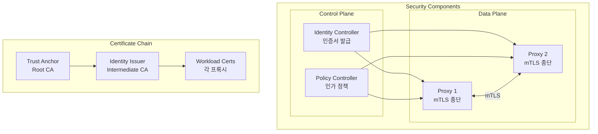
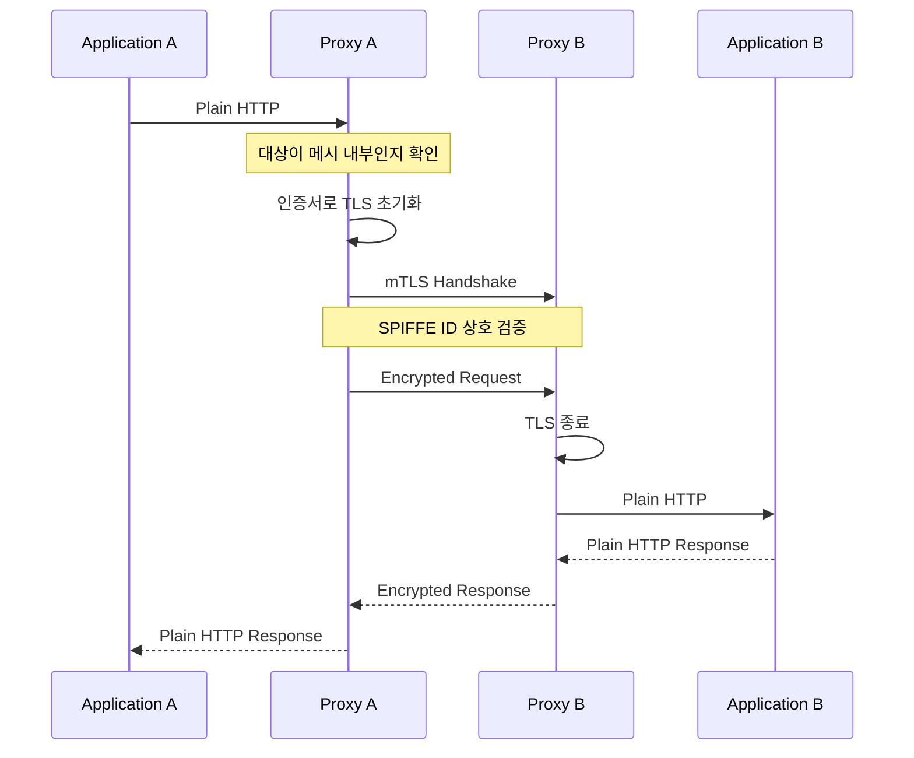
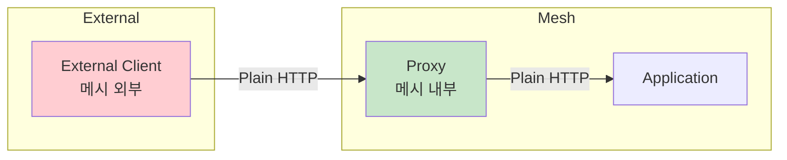
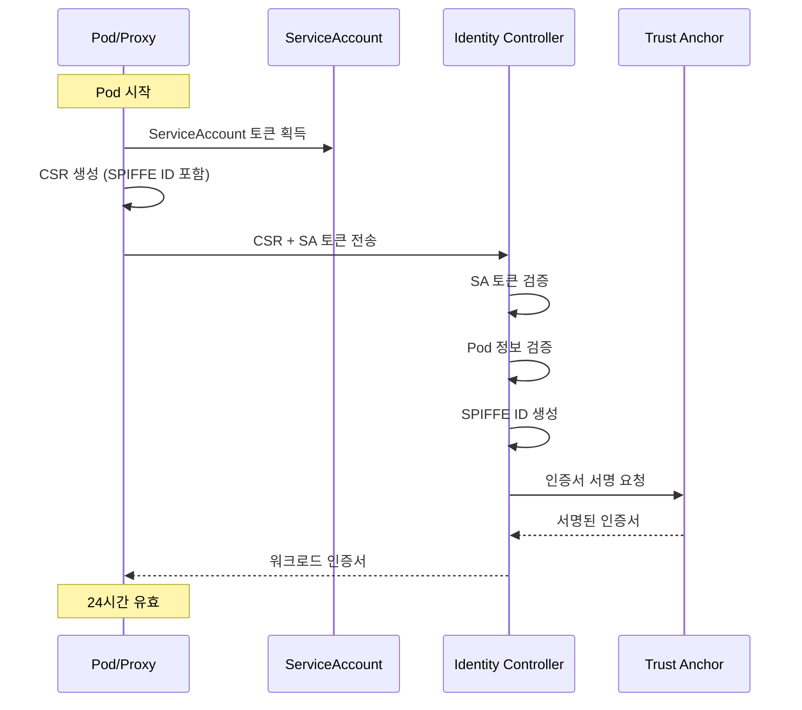
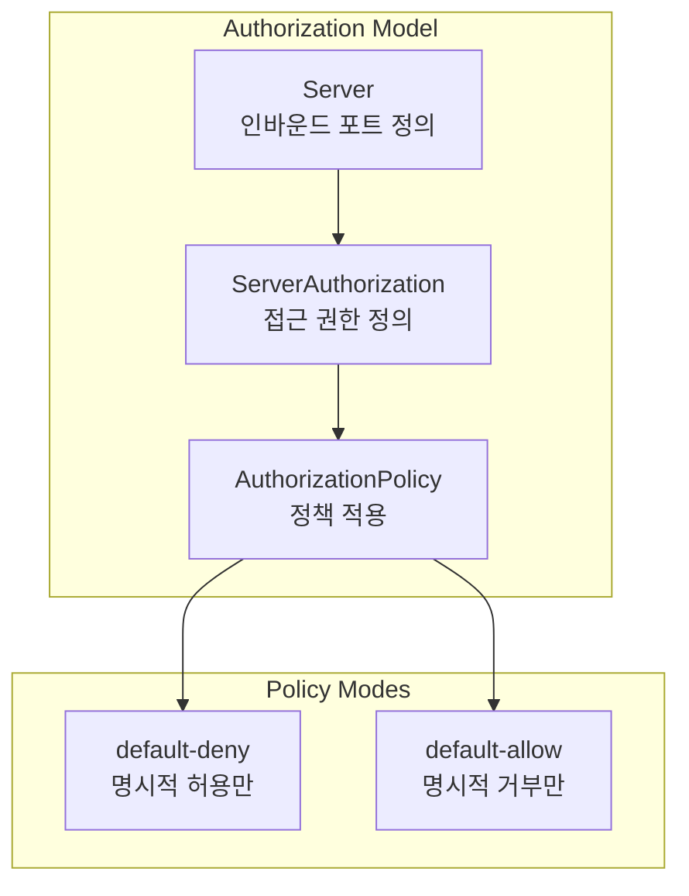
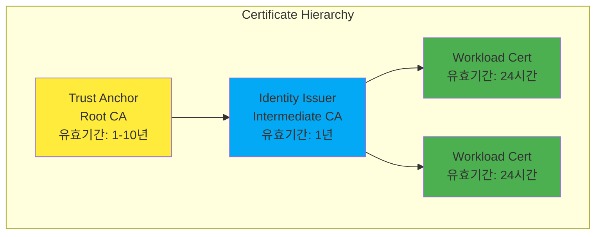
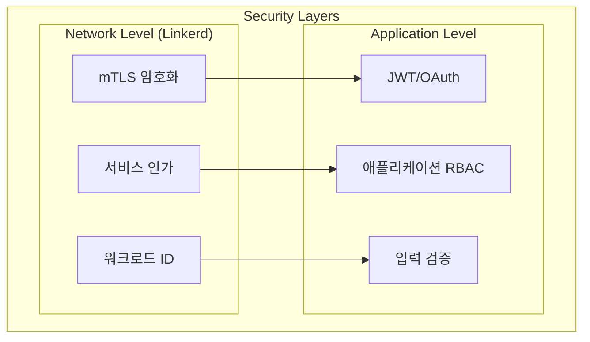

# Linkerd 보안

> **지원 버전**: Linkerd 2.16+
> **마지막 업데이트**: 2026년 2월 22일

## 개요

Linkerd는 보안을 핵심 가치로 삼아 설정 없이 자동으로 mTLS를 적용합니다. 이 문서에서는 자동 mTLS, 워크로드 ID 시스템, 인가 정책, 인증서 관리, 외부 CA 통합 등을 상세히 설명합니다.

## 보안 아키텍처



## 자동 mTLS

Linkerd의 가장 강력한 보안 기능은 설정 없이 모든 메시 트래픽을 자동으로 암호화하는 것입니다.

### mTLS 동작 방식



### mTLS 특성

| 특성 | 설명 |
|------|------|
| 제로 설정 | 별도 설정 없이 자동 활성화 |
| 투명한 암호화 | 애플리케이션 코드 변경 불필요 |
| 상호 인증 | 클라이언트와 서버 모두 인증 |
| 자동 갱신 | 인증서 만료 전 자동 갱신 |
| TLS 1.3 | 최신 TLS 프로토콜 사용 |

### mTLS 상태 확인

```bash
# 메시 트래픽 암호화 상태 확인
linkerd viz edges deploy -n my-app

# 예상 출력:
# SRC          DST          SRC_NS    DST_NS    SECURED
# web          api          my-app    my-app    √
# api          database     my-app    my-app    √
# ingress      web          ingress   my-app    √

# 개별 연결 상태 확인
linkerd viz tap deploy/web -n my-app

# TLS 상태가 표시됨:
# req id=0:0 proxy=out src=10.0.0.1:54321 dst=10.0.0.2:80 tls=true :method=GET :path=/api
```

### 비메시 트래픽 처리



메시 외부에서 오는 트래픽은 자동으로 감지되어 평문으로 처리됩니다:

```bash
# 메시 외부 트래픽 확인
linkerd viz tap deploy/web -n my-app --method GET

# tls=false는 메시 외부에서 온 트래픽
# req id=0:0 proxy=in src=10.0.1.100:54321 dst=10.0.0.2:80 tls=false
```

## 워크로드 ID 시스템

Linkerd는 SPIFFE 호환 ID 시스템을 사용하여 각 워크로드에 고유한 ID를 부여합니다.

### SPIFFE ID 형식

```
spiffe://<trust-domain>/ns/<namespace>/sa/<service-account>

# 예시:
spiffe://root.linkerd.cluster.local/ns/production/sa/web-server
spiffe://root.linkerd.cluster.local/ns/production/sa/api-gateway
spiffe://root.linkerd.cluster.local/ns/database/sa/postgres
```

### ID 발급 프로세스



### ID 확인

```bash
# Pod의 SPIFFE ID 확인
kubectl exec -n my-app deploy/web -c linkerd-proxy -- \
  cat /var/run/linkerd/identity/end-entity.crt | \
  openssl x509 -noout -text | grep URI

# 출력 예시:
# URI:spiffe://root.linkerd.cluster.local/ns/my-app/sa/web

# Identity Controller 로그에서 발급 확인
kubectl logs -n linkerd deploy/linkerd-identity | grep "issued"
```

## 인가 정책 (Authorization Policy)

Linkerd는 Server, ServerAuthorization, AuthorizationPolicy를 통해 세밀한 접근 제어를 제공합니다.

### 정책 모델



### Server 리소스

Server는 특정 Pod의 인바운드 트래픽을 정의합니다.

```yaml
apiVersion: policy.linkerd.io/v1beta2
kind: Server
metadata:
  name: web-http
  namespace: production
spec:
  # 대상 Pod 선택
  podSelector:
    matchLabels:
      app: web

  # 포트 지정
  port: 8080
  # 또는 이름으로 지정
  # port: http

  # 프로토콜 (HTTP/1, HTTP/2, gRPC, opaque)
  proxyProtocol: HTTP/1

---
# gRPC 서버
apiVersion: policy.linkerd.io/v1beta2
kind: Server
metadata:
  name: api-grpc
  namespace: production
spec:
  podSelector:
    matchLabels:
      app: api
  port: 9090
  proxyProtocol: gRPC

---
# TCP (opaque) 서버
apiVersion: policy.linkerd.io/v1beta2
kind: Server
metadata:
  name: database-tcp
  namespace: database
spec:
  podSelector:
    matchLabels:
      app: postgres
  port: 5432
  proxyProtocol: opaque
```

### ServerAuthorization 리소스

ServerAuthorization은 Server에 대한 접근 권한을 정의합니다.

```yaml
apiVersion: policy.linkerd.io/v1beta2
kind: ServerAuthorization
metadata:
  name: web-authz
  namespace: production
spec:
  # 대상 Server
  server:
    name: web-http

  # 허용할 클라이언트
  client:
    # 메시 내부 mTLS 클라이언트
    meshTLS:
      # 특정 ServiceAccount만 허용
      serviceAccounts:
        - name: api-gateway
          namespace: production
        - name: monitoring
          namespace: monitoring

---
# 여러 네임스페이스에서 접근 허용
apiVersion: policy.linkerd.io/v1beta2
kind: ServerAuthorization
metadata:
  name: api-authz
  namespace: production
spec:
  server:
    name: api-grpc
  client:
    meshTLS:
      serviceAccounts:
        - name: web
          namespace: production
        - name: mobile-backend
          namespace: mobile
        - name: admin-service
          namespace: admin

---
# 모든 메시 클라이언트 허용
apiVersion: policy.linkerd.io/v1beta2
kind: ServerAuthorization
metadata:
  name: public-api-authz
  namespace: production
spec:
  server:
    name: public-api
  client:
    meshTLS:
      identities:
        - "*"  # 모든 메시 ID 허용

---
# 비인증 클라이언트 허용 (헬스체크 등)
apiVersion: policy.linkerd.io/v1beta2
kind: ServerAuthorization
metadata:
  name: health-authz
  namespace: production
spec:
  server:
    name: health-server
  client:
    unauthenticated: true
```

### AuthorizationPolicy (Gateway API)

Linkerd 2.14+에서는 Gateway API의 AuthorizationPolicy도 지원합니다.

```yaml
apiVersion: policy.linkerd.io/v1alpha1
kind: AuthorizationPolicy
metadata:
  name: web-policy
  namespace: production
spec:
  # 대상 워크로드
  targetRef:
    group: core
    kind: Namespace
    name: production

  # 필수 인증
  requiredAuthenticationRefs:
    - name: mesh-tls
      kind: MeshTLSAuthentication
      group: policy.linkerd.io

---
apiVersion: policy.linkerd.io/v1alpha1
kind: MeshTLSAuthentication
metadata:
  name: mesh-tls
  namespace: production
spec:
  # 허용할 ID
  identities:
    - "spiffe://root.linkerd.cluster.local/ns/production/*"
    - "spiffe://root.linkerd.cluster.local/ns/monitoring/*"
```

### 정책 모드 설정

#### Default-Deny (권장)

모든 트래픽을 기본적으로 거부하고 명시적으로 허용된 트래픽만 통과:

```yaml
# 네임스페이스에 default-deny 적용
apiVersion: v1
kind: Namespace
metadata:
  name: production
  annotations:
    config.linkerd.io/default-inbound-policy: deny
```

```bash
# 또는 전역 설정
linkerd install --set policyController.defaultPolicy=deny | kubectl apply -f -

# Helm으로 설정
helm install linkerd-control-plane linkerd/linkerd-control-plane \
  --set policyController.defaultPolicy=deny
```

#### Default-Allow

모든 트래픽을 기본적으로 허용 (기존 동작과 호환):

```yaml
apiVersion: v1
kind: Namespace
metadata:
  name: legacy-app
  annotations:
    config.linkerd.io/default-inbound-policy: all-unauthenticated
```

#### 정책 모드 옵션

| 모드 | 설명 |
|------|------|
| `deny` | 모든 트래픽 거부 (default-deny) |
| `all-unauthenticated` | 모든 트래픽 허용 |
| `all-authenticated` | 메시 mTLS 트래픽만 허용 |
| `cluster-unauthenticated` | 클러스터 내부 트래픽 허용 |
| `cluster-authenticated` | 클러스터 내부 mTLS 트래픽만 허용 |

### 실전 예제: 마이크로서비스 정책

```yaml
# 1. 프론트엔드 - 인그레스에서만 접근 가능
apiVersion: policy.linkerd.io/v1beta2
kind: Server
metadata:
  name: frontend-http
  namespace: production
spec:
  podSelector:
    matchLabels:
      app: frontend
  port: 8080
  proxyProtocol: HTTP/1

---
apiVersion: policy.linkerd.io/v1beta2
kind: ServerAuthorization
metadata:
  name: frontend-authz
  namespace: production
spec:
  server:
    name: frontend-http
  client:
    meshTLS:
      serviceAccounts:
        - name: ingress-nginx
          namespace: ingress-nginx

---
# 2. API 서버 - 프론트엔드에서만 접근 가능
apiVersion: policy.linkerd.io/v1beta2
kind: Server
metadata:
  name: api-http
  namespace: production
spec:
  podSelector:
    matchLabels:
      app: api
  port: 8080
  proxyProtocol: HTTP/1

---
apiVersion: policy.linkerd.io/v1beta2
kind: ServerAuthorization
metadata:
  name: api-authz
  namespace: production
spec:
  server:
    name: api-http
  client:
    meshTLS:
      serviceAccounts:
        - name: frontend
          namespace: production

---
# 3. 데이터베이스 - API 서버에서만 접근 가능
apiVersion: policy.linkerd.io/v1beta2
kind: Server
metadata:
  name: database-tcp
  namespace: production
spec:
  podSelector:
    matchLabels:
      app: postgres
  port: 5432
  proxyProtocol: opaque

---
apiVersion: policy.linkerd.io/v1beta2
kind: ServerAuthorization
metadata:
  name: database-authz
  namespace: production
spec:
  server:
    name: database-tcp
  client:
    meshTLS:
      serviceAccounts:
        - name: api
          namespace: production

---
# 4. 모니터링 - Prometheus가 모든 서비스 메트릭 수집
apiVersion: policy.linkerd.io/v1beta2
kind: Server
metadata:
  name: metrics-server
  namespace: production
spec:
  podSelector:
    matchLabels:
      linkerd.io/control-plane-ns: linkerd
  port: 4191
  proxyProtocol: HTTP/1

---
apiVersion: policy.linkerd.io/v1beta2
kind: ServerAuthorization
metadata:
  name: metrics-authz
  namespace: production
spec:
  server:
    name: metrics-server
  client:
    meshTLS:
      serviceAccounts:
        - name: prometheus
          namespace: monitoring
```

## 인증서 관리

### 인증서 계층 구조



### Trust Anchor 관리

```bash
# Trust Anchor 생성 (step CLI)
step certificate create root.linkerd.cluster.local ca.crt ca.key \
  --profile root-ca \
  --no-password \
  --insecure \
  --not-after=87600h  # 10년

# 현재 Trust Anchor 만료일 확인
kubectl get secret linkerd-identity-trust-roots -n linkerd -o json | \
  jq -r '.data["ca-bundle.crt"]' | base64 -d | \
  openssl x509 -noout -enddate

# Trust Anchor를 Secret으로 저장
kubectl create secret generic linkerd-identity-trust-roots \
  --from-file=ca-bundle.crt=ca.crt \
  -n linkerd \
  --dry-run=client -o yaml | kubectl apply -f -
```

### Identity Issuer 관리

```bash
# Issuer 인증서 생성
step certificate create identity.linkerd.cluster.local issuer.crt issuer.key \
  --profile intermediate-ca \
  --ca ca.crt \
  --ca-key ca.key \
  --no-password \
  --insecure \
  --not-after=8760h  # 1년

# Issuer 인증서 만료일 확인
kubectl get secret linkerd-identity-issuer -n linkerd -o json | \
  jq -r '.data["tls.crt"]' | base64 -d | \
  openssl x509 -noout -enddate

# Issuer Secret 업데이트
kubectl create secret tls linkerd-identity-issuer \
  --cert=issuer.crt \
  --key=issuer.key \
  -n linkerd \
  --dry-run=client -o yaml | kubectl apply -f -
```

### 인증서 로테이션

#### Trust Anchor 로테이션 (다운타임 없이)

```bash
# 1. 새 Trust Anchor 생성
step certificate create root.linkerd.cluster.local ca-new.crt ca-new.key \
  --profile root-ca \
  --no-password \
  --insecure \
  --not-after=87600h

# 2. 번들 생성 (기존 + 신규)
cat ca.crt ca-new.crt > ca-bundle.crt

# 3. Trust Anchor Secret 업데이트
kubectl create secret generic linkerd-identity-trust-roots \
  --from-file=ca-bundle.crt=ca-bundle.crt \
  -n linkerd \
  --dry-run=client -o yaml | kubectl apply -f -

# 4. 새 Trust Anchor로 Issuer 재발급
step certificate create identity.linkerd.cluster.local issuer-new.crt issuer-new.key \
  --profile intermediate-ca \
  --ca ca-new.crt \
  --ca-key ca-new.key \
  --no-password \
  --insecure \
  --not-after=8760h

# 5. Issuer Secret 업데이트
kubectl create secret tls linkerd-identity-issuer \
  --cert=issuer-new.crt \
  --key=issuer-new.key \
  -n linkerd \
  --dry-run=client -o yaml | kubectl apply -f -

# 6. Identity Controller 재시작
kubectl rollout restart deploy/linkerd-identity -n linkerd

# 7. 모든 프록시 재시작 (점진적)
for ns in $(kubectl get ns -o name | cut -d/ -f2); do
  kubectl rollout restart deploy -n $ns
  sleep 30
done

# 8. 이전 Trust Anchor 제거 (모든 프록시 갱신 후)
cp ca-new.crt ca-bundle.crt
kubectl create secret generic linkerd-identity-trust-roots \
  --from-file=ca-bundle.crt=ca-bundle.crt \
  -n linkerd \
  --dry-run=client -o yaml | kubectl apply -f -
```

#### 자동 로테이션 모니터링

```bash
# 인증서 만료 알림 스크립트
#!/bin/bash

DAYS_WARNING=30

# Trust Anchor 확인
TRUST_ANCHOR_EXPIRY=$(kubectl get secret linkerd-identity-trust-roots -n linkerd -o json | \
  jq -r '.data["ca-bundle.crt"]' | base64 -d | \
  openssl x509 -noout -enddate | cut -d= -f2)

TRUST_ANCHOR_EPOCH=$(date -d "$TRUST_ANCHOR_EXPIRY" +%s)
NOW_EPOCH=$(date +%s)
DAYS_LEFT=$(( (TRUST_ANCHOR_EPOCH - NOW_EPOCH) / 86400 ))

if [ $DAYS_LEFT -lt $DAYS_WARNING ]; then
  echo "WARNING: Trust Anchor expires in $DAYS_LEFT days"
fi

# Issuer 확인
ISSUER_EXPIRY=$(kubectl get secret linkerd-identity-issuer -n linkerd -o json | \
  jq -r '.data["tls.crt"]' | base64 -d | \
  openssl x509 -noout -enddate | cut -d= -f2)

ISSUER_EPOCH=$(date -d "$ISSUER_EXPIRY" +%s)
ISSUER_DAYS_LEFT=$(( (ISSUER_EPOCH - NOW_EPOCH) / 86400 ))

if [ $ISSUER_DAYS_LEFT -lt $DAYS_WARNING ]; then
  echo "WARNING: Identity Issuer expires in $ISSUER_DAYS_LEFT days"
fi
```

## 외부 CA 통합

### cert-manager 통합

```yaml
# cert-manager Issuer 설정
apiVersion: cert-manager.io/v1
kind: Issuer
metadata:
  name: linkerd-trust-anchor
  namespace: linkerd
spec:
  ca:
    secretName: linkerd-trust-anchor

---
# Identity Issuer 인증서 자동 발급
apiVersion: cert-manager.io/v1
kind: Certificate
metadata:
  name: linkerd-identity-issuer
  namespace: linkerd
spec:
  secretName: linkerd-identity-issuer
  duration: 8760h  # 1년
  renewBefore: 720h  # 30일 전 갱신
  issuerRef:
    name: linkerd-trust-anchor
    kind: Issuer
  commonName: identity.linkerd.cluster.local
  isCA: true
  privateKey:
    algorithm: ECDSA
    size: 256
  usages:
    - cert sign
    - crl sign
    - server auth
    - client auth
```

### Vault 통합

```yaml
# Vault PKI 설정
apiVersion: cert-manager.io/v1
kind: Issuer
metadata:
  name: vault-issuer
  namespace: linkerd
spec:
  vault:
    path: pki_int/sign/linkerd-identity
    server: https://vault.example.com
    auth:
      kubernetes:
        role: linkerd-issuer
        mountPath: /v1/auth/kubernetes
        secretRef:
          name: vault-token
          key: token

---
# Vault에서 Identity Issuer 인증서 발급
apiVersion: cert-manager.io/v1
kind: Certificate
metadata:
  name: linkerd-identity-issuer
  namespace: linkerd
spec:
  secretName: linkerd-identity-issuer
  duration: 8760h
  renewBefore: 720h
  issuerRef:
    name: vault-issuer
    kind: Issuer
  commonName: identity.linkerd.cluster.local
  isCA: true
```

### 외부 CA Helm 설정

```yaml
# values.yaml
identity:
  externalCA: true
  issuer:
    scheme: kubernetes.io/tls
```

```bash
# 외부 CA 모드로 설치
helm install linkerd-control-plane linkerd/linkerd-control-plane \
  -n linkerd \
  --set identity.externalCA=true \
  --set-file identityTrustAnchorsPEM=ca.crt
```

## 네트워크 vs 애플리케이션 보안

### 보안 계층



| 계층 | Linkerd 역할 | 애플리케이션 역할 |
|------|-------------|------------------|
| 전송 암호화 | mTLS (자동) | HTTPS (선택적) |
| 서비스 인증 | SPIFFE ID | API 키, JWT |
| 서비스 인가 | ServerAuthorization | RBAC, 권한 확인 |
| 데이터 검증 | - | 입력 검증, 살균 |

### 심층 방어 예제

```yaml
# Linkerd: 서비스 레벨 인가
apiVersion: policy.linkerd.io/v1beta2
kind: ServerAuthorization
metadata:
  name: api-authz
  namespace: production
spec:
  server:
    name: api-server
  client:
    meshTLS:
      serviceAccounts:
        - name: web
          namespace: production

---
# 애플리케이션: JWT 기반 사용자 인가 (의사 코드)
# @app.route('/api/admin')
# @require_role('admin')  # 애플리케이션 레벨 RBAC
# def admin_endpoint():
#     # Linkerd가 서비스 인증을 처리
#     # 애플리케이션은 사용자 인가만 처리
#     return handle_admin_request()
```

## 보안 모니터링

### 정책 위반 감지

```bash
# 거부된 요청 확인
linkerd viz tap deploy/api -n production | grep "forbidden"

# 정책 이벤트 확인
kubectl get events -n production --field-selector reason=Forbidden

# 프록시 로그에서 인가 실패 확인
kubectl logs deploy/api -n production -c linkerd-proxy | grep "authorization"
```

### 인증서 상태 모니터링

```bash
# linkerd check로 인증서 상태 확인
linkerd check --proxy

# 예상 출력:
# linkerd-identity
# ----------------
# √ certificate config is valid
# √ trust anchors are using supported crypto algorithm
# √ trust anchors are within their validity period
# √ trust anchors are valid for at least 60 days
# √ issuer cert is using supported crypto algorithm
# √ issuer cert is within its validity period
# √ issuer cert is valid for at least 60 days
# √ issuer cert is issued by the trust anchor

# Prometheus 메트릭으로 모니터링
# identity_cert_expiration_timestamp_seconds
```

### Prometheus 알림 규칙

```yaml
apiVersion: monitoring.coreos.com/v1
kind: PrometheusRule
metadata:
  name: linkerd-security-alerts
  namespace: monitoring
spec:
  groups:
  - name: linkerd-security
    rules:
    - alert: LinkerdIdentityCertExpiringSoon
      expr: |
        identity_cert_expiration_timestamp_seconds - time() < 86400 * 7
      for: 1h
      labels:
        severity: warning
      annotations:
        summary: "Linkerd identity certificate expiring soon"
        description: "Certificate will expire in less than 7 days"

    - alert: LinkerdMTLSDisabled
      expr: |
        sum(response_total{tls="false", direction="inbound"})
        / sum(response_total{direction="inbound"}) > 0.1
      for: 5m
      labels:
        severity: critical
      annotations:
        summary: "High percentage of non-mTLS traffic"
        description: "More than 10% of inbound traffic is not encrypted"
```

## 다음 단계

- [관찰성](./05-observability.md): 메트릭과 대시보드
- [다중 클러스터](./06-multi-cluster.md): 클러스터 간 보안
- [모범 사례](./07-best-practices.md): 프로덕션 보안 설정

## 참고 자료

- [Linkerd Security](https://linkerd.io/2/features/automatic-mtls/)
- [Authorization Policy](https://linkerd.io/2/features/server-policy/)
- [Certificate Management](https://linkerd.io/2/tasks/automatically-rotating-control-plane-tls-credentials/)
- [SPIFFE](https://spiffe.io/)
