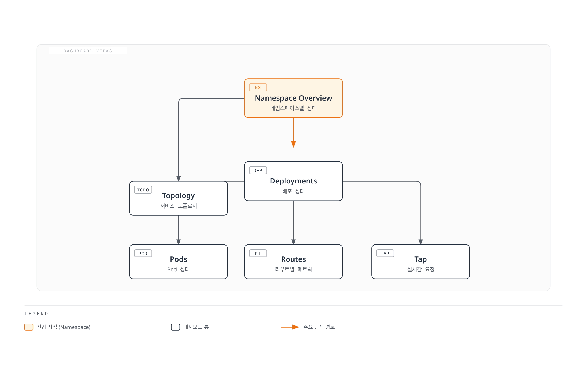

# Linkerd 관찰성

> **검토 기준**: 2026년 9월 11일 · Linkerd edge-26.9.1 / chart 2026.9.1 · Prometheus Operator 예제는 0.93.1 기준 검증

Linkerd는 proxy/protocol 지표를 노출하며 Viz는 Prometheus, metrics-api, tap, tap-injector, web dashboard를 추가합니다. 현재 Viz chart는 Grafana를 설치하지 **않습니다**. 분산 추적에는 별도로 구성한 collector/backend, trace context, sampling이 필요하며 지표 대시보드 설치만으로 활성화되지 않습니다.

예제는 [설치 가이드](01-installation.md), `my-app`의 기존 mesh `web`/`api` workload와 실제 트래픽을 전제로 합니다. 실제 namespace, workload/Service 이름, port, identity에 맞춥니다. Opaque TCP 데이터베이스에서 HTTP 성공률/지연 시간이 자동 생성되지는 않습니다.

## 지표의 의미

| 지표 | 의미 |
|---|---|
| response_total | 오류/stream 종료 처리를 포함한 최종 응답 분류 |
| request_total | 관찰한 요청이며 성공한 업무 작업의 수는 아님 |
| response_latency_ms_bucket | 밀리초 단위 time-to-first-byte histogram |
| tcp_open_connections | 현재 열린 transport connection |
| tcp_open_total | 누적 connection 생성 수이며 현재 활성 connection 수는 아님 |

대표적인 서비스 지표는 성공률, 요청률, 지연 시간입니다. 필요에 따라 용량/saturation, 애플리케이션, Kubernetes 지표를 추가합니다. 기본 HTTP 분류는 server error를 실패로 처리하므로 HTTP 400도 성공으로 분류될 수 있습니다. gRPC status와 응답 정책에 따라 분류가 달라집니다. 자동으로 business 성공 SLI가 되는 것은 아닙니다.

지연 시간은 전체 응답 stream 시간이 아닙니다. 해당 버전 proxy는 첫 응답 body frame이 제공될 때 기록하고 body drop 시의 대체 처리를 갖습니다. 최종 응답 분류와 별도이므로 histogram과 response counter의 관찰 시점이 다를 수 있습니다. 성공/실패 classification label을 노출하지 않는 histogram에 그 label을 적용하지 않습니다.

### CLI 통계와 실시간 관찰

```bash
linkerd viz stat deploy -n my-app
linkerd viz stat deploy/web -n my-app --to deploy/api
linkerd viz stat deploy/api -n my-app --from deploy/web
linkerd viz stat pods -n my-app
linkerd viz stat namespaces
linkerd viz stat deploy -n my-app --time-window 10m -o wide
linkerd viz stat deploy -n my-app -o json
```

표에는 MESHED, SUCCESS, RPS, 지연 percentile, TCP_CONN이 표시됩니다. Wide 출력은 transport byte rate를 추가하며 proxy 버전 목록이 아닙니다. Pod/Deployment와 Service는 관찰 지점이 다릅니다. Service 통계는 client outbound 지표를 사용하므로 mesh 밖 caller를 포함하지 않습니다. 합계를 비교할 때 이 차이를 유지합니다.

```bash
linkerd viz top deploy/web -n my-app --hide-sources=false
linkerd viz tap deploy/web -n my-app --method GET --path /api
linkerd viz tap deploy/web -n my-app --to deploy/api --max-rps 20
linkerd viz tap deploy/web -n my-app -o json
linkerd viz edges deploy -n my-app
linkerd viz edges pods -n my-app
```

`top`은 tap으로 관찰한 실시간 트래픽을 집계합니다. `--hide-sources=false`는 HTTP header가 아니라 source 열을 표시합니다. `tap --path`는 path prefix 조건이고 `--max-rps`는 관찰 요청률 제한이며 애플리케이션의 전체 요청 수 제한이 아닙니다. 현재 tap에는 `--from`과 `--show-headers`가 없습니다. Source workload를 대상으로 `--to`를 쓰거나 지원되는 통계 조건을 사용합니다.

Tap은 제한된 관찰 stream이며 packet capture나 전체 감사가 아닙니다. Path와 요청 metadata가 민감할 수 있으므로 API 접근을 제한합니다. Edges는 관찰한 연결을 표시하며 빈 화면이 무트래픽이나 모든 경로의 암호화를 입증하지는 않습니다.

## Viz 대시보드와 저장소

```bash
linkerd viz dashboard --address 127.0.0.1 --port 8084 --show url
```

표시된 local URL을 엽니다. 이 접근 경로는 loopback에 bind하며 외부에 게시하는 dashboard에는 별도의 인증/접근 설계가 필요합니다. Bind address나 Host header 검사는 사용자 인증이 아닙니다.



[인터랙티브 다이어그램 보기](https://www.atomai.click/kubernetes-docs/archmaps/ko-service-mesh-linkerd-05-observability-1.html)

기본 Prometheus는 6시간을 보존하고 임시 저장소를 사용합니다. 선택한 chart는 자체 Prometheus 이미지 버전을 고정하므로 임의로 새 major 버전으로 바꾸지 않습니다. 설치 가이드의 persistence 설정을 사용할 수 있으며 장기 보존/HA 저장소는 별도 설계입니다.

```bash
kubectl -n linkerd-viz port-forward --address 127.0.0.1 svc/prometheus 9090:9090
# In another terminal:
curl --fail --get --data-urlencode 'query=up{job="linkerd-proxy"}' \
  http://127.0.0.1:9090/api/v1/query
```

## 외부 Prometheus

직접 scrape, federation, 적합한 remote-write pipeline 중 방식을 의도적으로 선택합니다. 같은 series를 여러 경로로 수집하면서 중복 제거하지 않으면 합계가 중복될 수 있습니다.

### 직접 scrape 설정

기존 Prometheus 설정에 병합합니다. 선택한 Viz chart의 job/label 매핑을 따르며 controller target에 namespace/Pod label을 명시적으로 추가했습니다.

```yaml
scrape_configs:
- job_name: linkerd-controller
  kubernetes_sd_configs:
  - role: pod
    namespaces:
      names:
      - linkerd
      - linkerd-viz
  relabel_configs:
  - source_labels:
    - __meta_kubernetes_pod_container_port_name
    action: keep
    regex: .*admin$
  - source_labels:
    - __meta_kubernetes_pod_container_port_name
    action: drop
    regex: linkerd-admin
  - source_labels:
    - __meta_kubernetes_pod_container_name
    action: replace
    target_label: component
  - source_labels:
    - __meta_kubernetes_namespace
    target_label: namespace
  - source_labels:
    - __meta_kubernetes_pod_name
    target_label: pod
- job_name: linkerd-proxy
  kubernetes_sd_configs:
  - role: pod
  relabel_configs:
  - source_labels:
    - __meta_kubernetes_pod_phase
    regex: (Pending|Running)
    action: keep
  - source_labels:
    - __meta_kubernetes_pod_container_name
    - __meta_kubernetes_pod_container_port_name
    - __meta_kubernetes_pod_label_linkerd_io_control_plane_ns
    action: keep
    regex: ^linkerd-proxy;linkerd-admin;linkerd$
  - source_labels:
    - __meta_kubernetes_namespace
    action: replace
    target_label: namespace
  - source_labels:
    - __meta_kubernetes_pod_name
    action: replace
    target_label: pod
  - source_labels:
    - __meta_kubernetes_pod_label_linkerd_io_proxy_job
    action: replace
    target_label: k8s_job
  - action: labeldrop
    regex: __meta_kubernetes_pod_label_linkerd_io_proxy_job
  - action: labelmap
    regex: __meta_kubernetes_pod_label_linkerd_io_proxy_(.+)
  - action: labeldrop
    regex: __meta_kubernetes_pod_label_linkerd_io_proxy_(.+)
  - action: labelmap
    regex: __meta_kubernetes_pod_label_linkerd_io_(.+)
  - action: labelmap
    regex: __meta_kubernetes_pod_label_(.+)
    replacement: __tmp_pod_label_$1
  - action: labelmap
    regex: __tmp_pod_label_linkerd_io_(.+)
    replacement: __tmp_pod_label_$1
  - action: labeldrop
    regex: __tmp_pod_label_linkerd_io_(.+)
  - action: labelmap
    regex: __tmp_pod_label_(.+)
```

이전 controller port 조건 `admin-http`는 현재의 `dest-admin`, `ident-admin` 등을 놓칩니다. Proxy 조건은 의도한 control plane의 `linkerd-proxy`/`linkerd-admin` target을 유지합니다. Kubernetes Pod discovery에는 init container도 포함되므로 `__meta_kubernetes_pod_container_init`가 true라는 이유만으로 제외하면 안 됩니다. 기본 native sidecar는 그 위치에 있습니다.

이 label은 아래 workload query에 사용됩니다. 다른 Viz query와 dashboard가 요구하는 label도 보존하고 application label의 cardinality와 민감한 데이터를 검토합니다. Kubernetes discovery RBAC, API 접근, metrics port 연결도 구성해야 합니다. YAML이 유효하다고 discovery/scrape 성공이 증명되지는 않습니다.

### Prometheus Operator 대안

Prometheus 리소스가 monitor와 그 namespace를 모두 선택해야 합니다. 예제 metadata는 selector가 `release: monitoring`을 허용한다고 가정하므로 실제 설치에 맞춥니다.

```yaml
apiVersion: monitoring.coreos.com/v1
kind: PodMonitor
metadata:
  name: linkerd-proxies
  namespace: monitoring
  labels:
    release: monitoring
spec:
  namespaceSelector:
    any: true
  selector:
    matchLabels:
      linkerd.io/control-plane-ns: linkerd
  podMetricsEndpoints:
  - port: linkerd-admin
    path: /metrics
    interval: 10s
    relabelings:
    - sourceLabels:
      - __meta_kubernetes_pod_phase
      regex: (Pending|Running)
      action: keep
    - sourceLabels:
      - __meta_kubernetes_pod_container_name
      - __meta_kubernetes_pod_container_port_name
      - __meta_kubernetes_pod_label_linkerd_io_control_plane_ns
      action: keep
      regex: ^linkerd-proxy;linkerd-admin;linkerd$
    - sourceLabels:
      - __meta_kubernetes_namespace
      action: replace
      targetLabel: namespace
    - sourceLabels:
      - __meta_kubernetes_pod_name
      action: replace
      targetLabel: pod
    - sourceLabels:
      - __meta_kubernetes_pod_label_linkerd_io_proxy_job
      action: replace
      targetLabel: k8s_job
    - action: labeldrop
      regex: __meta_kubernetes_pod_label_linkerd_io_proxy_job
    - action: labelmap
      regex: __meta_kubernetes_pod_label_linkerd_io_proxy_(.+)
    - action: labeldrop
      regex: __meta_kubernetes_pod_label_linkerd_io_proxy_(.+)
    - action: labelmap
      regex: __meta_kubernetes_pod_label_linkerd_io_(.+)
    - action: labelmap
      regex: __meta_kubernetes_pod_label_(.+)
      replacement: __tmp_pod_label_$1
    - action: labelmap
      regex: __tmp_pod_label_linkerd_io_(.+)
      replacement: __tmp_pod_label_$1
    - action: labeldrop
      regex: __tmp_pod_label_linkerd_io_(.+)
    - action: labelmap
      regex: __tmp_pod_label_(.+)
    - targetLabel: job
      replacement: linkerd-proxy
---
apiVersion: monitoring.coreos.com/v1
kind: PodMonitor
metadata:
  name: linkerd-destination
  namespace: monitoring
  labels:
    release: monitoring
spec:
  namespaceSelector:
    matchNames:
    - linkerd
  selector:
    matchLabels:
      linkerd.io/control-plane-component: destination
  podMetricsEndpoints:
  - port: dest-admin
    path: /metrics
    interval: 10s
    relabelings:
    - sourceLabels:
      - __meta_kubernetes_pod_container_name
      targetLabel: component
    - targetLabel: job
      replacement: linkerd-controller
  - port: spval-admin
    path: /metrics
    interval: 10s
    relabelings:
    - sourceLabels:
      - __meta_kubernetes_pod_container_name
      targetLabel: component
    - targetLabel: job
      replacement: linkerd-controller
  - port: policy-admin
    path: /metrics
    interval: 10s
    relabelings:
    - sourceLabels:
      - __meta_kubernetes_pod_container_name
      targetLabel: component
    - targetLabel: job
      replacement: linkerd-controller
```

두 번째 PodMonitor는 **destination Deployment** 안의 metrics endpoint 3개를 수집하며 모든 controller를 포함하지는 않습니다. 다른 component에는 실제 선언한 port를 사용합니다.

| Component | Metrics port 이름 |
|---|---|
| Identity | ident-admin |
| Proxy injector | injector-admin |
| Viz component | admin |

Destination Service는 `admin-http` Service port를 노출하지 않으므로 해당 port를 선택한 ServiceMonitor에는 그 endpoint가 없습니다. 선언된 container port에는 PodMonitor를 사용하거나 적합한 Service를 의도적으로 구성합니다. 같은 target의 raw scrape와 PodMonitor를 중복 설정하지 않습니다.

Federation도 대안입니다. 선택한 Viz chart의 Prometheus Service port 이름은 **admin**, endpoint는 `/federate`입니다. Export된 label을 보존하고 대상 job을 선택하며 호출하는 mesh ServiceAccount를 Viz의 `prometheus-admin` Server에서 허용합니다. 일반적인 upstream 예제의 `admin-http`는 이 chart와 일치하지 않습니다.

### 기존 Prometheus를 Viz의 query 대상으로 사용

필요한 Linkerd 데이터를 유지하고 연결 가능한 별도 Prometheus가 있을 때의 설정입니다.

```yaml
prometheus:
  enabled: false
prometheusUrl: http://prometheus.monitoring.svc.cluster.local:9090
```

선택한 Viz release의 전체 설정에 병합합니다. Local Prometheus를 끄기 전에 query API, scrape label, retention, 인증/인가를 검증합니다. 이 URL이 Prometheus를 설치하거나 접근 권한을 부여하지는 않습니다.

## 범위를 명시한 Query

다음 query는 API inbound 관찰을 한 번 선택합니다. Namespace/Deployment를 맞추고 공유 backend에는 cluster 범위를 추가합니다.

성공 비율:

```promql
((sum(rate(response_total{namespace="my-app",deployment="api",direction="inbound",classification="success"}[5m])) or vector(0)) / sum(rate(response_total{namespace="my-app",deployment="api",direction="inbound"}[5m])))
and on() (sum(rate(response_total{namespace="my-app",deployment="api",direction="inbound"}[5m])) > 0)
```

전체 응답이 실패하여 success series가 없으면 분자는 0을 사용합니다. 양의 total 조건 때문에 누락/무트래픽에는 성공 결과가 없으며 이를 100%로 표시하지 않습니다.

요청률:

```promql
sum(rate(request_total{namespace="my-app",deployment="api",direction="inbound"}[5m]))
```

밀리초 단위 time-to-first-byte percentile:

```promql
histogram_quantile(0.5, sum by (le) (rate(response_latency_ms_bucket{namespace="my-app",deployment="api",direction="inbound"}[5m])))

histogram_quantile(0.95, sum by (le) (rate(response_latency_ms_bucket{namespace="my-app",deployment="api",direction="inbound"}[5m])))

histogram_quantile(0.99, sum by (le) (rate(response_latency_ms_bucket{namespace="my-app",deployment="api",direction="inbound"}[5m])))
```

Inbound source 측의 활성 TCP connection:

```promql
sum(tcp_open_connections{namespace="my-app",deployment="api",direction="inbound",peer="src"})
```

`peer="src"`는 proxy가 local 애플리케이션에 만든 별도 connection을 합산하지 않도록 합니다. 초당 connection 생성 수는 같은 관찰 범위의 `tcp_open_total`에 rate를 적용합니다.

request_total에 범용 `retry="true"` label은 없습니다. ServiceProfile에서는 route_actual_request_total, route_request_total, route_retryable_total을 같은 범위/구간으로 확인합니다. 재시도 가능한 응답 수가 실제 전송한 재시도 수는 아니며 no-budget series는 부분집합입니다. 현재 정책 지표와 애플리케이션의 시도 근거도 각각 해석해야 합니다. [트래픽 관리](03-traffic-management.md)를 참고합니다.


## Grafana

Linkerd 2.12부터 Grafana는 별도 설치입니다. 현재 기본 Viz에는 port-forward할 `svc/grafana`가 없으며 `grafana.enabled:false`는 지원되는 연동 설정이 아닙니다.

필요한 지표가 있는 Prometheus datasource와 기존 Grafana를 사용합니다. `monitoring` namespace의 `grafana` ServiceAccount로 실행하는 mesh Grafana에 기존 Viz Prometheus 접근을 허용하는 예제입니다.

```yaml
apiVersion: policy.linkerd.io/v1alpha1
kind: AuthorizationPolicy
metadata:
  name: prometheus-admin-grafana
  namespace: linkerd-viz
spec:
  targetRef:
    group: policy.linkerd.io
    kind: Server
    name: prometheus-admin
  requiredAuthenticationRefs:
  - kind: ServiceAccount
    name: grafana
    namespace: monitoring
```

Grafana가 다른 identity나 외부 Prometheus를 사용하면 해당 위치의 접근을 구성합니다. ServiceAccount 허용은 caller가 실제로 그 mesh identity를 제시해야 동작합니다.

외부에서 접근 가능한 Grafana를 Viz에 연결하는 설정입니다.

```yaml
grafana:
  externalUrl: https://grafana.example.com/
```

지원되는 대안은 browser가 사용할 전체 URL인 `grafana.externalUrl`과 cluster 내부 reverse-proxy 연동용 `grafana.url`입니다. 후자는 Grafana의 root/subpath 설정도 필요합니다. `grafana.uidPrefix`는 import한 dashboard UID를 구분하며 tenant 인가 제어가 아닙니다.

해당 버전 dashboard 모음에는 health, top-line, namespace/workload, Service, route, authority, multicluster가 있습니다. **Authority는 HTTP host/:authority이며 인가 권한이 아닙니다.** 검토한 release에서 import하고 datasource, label, unit, UID 연결을 확인합니다.

### 작은 Dashboard 예제

이 classic dashboard JSON에는 datasource import 입력, 고정 namespace/deployment 변수, panel unit이 있습니다. Import할 때 datasource를 선택하고 고정값을 맞춥니다. Query와 JSON은 검사했지만 Grafana server import는 실행하지 않았습니다.

```json
{
  "__inputs": [
    {
      "name": "DS_PROMETHEUS",
      "label": "Prometheus",
      "type": "datasource",
      "pluginId": "prometheus",
      "pluginName": "Prometheus"
    }
  ],
  "id": null,
  "uid": "linkerd-api-overview",
  "title": "Linkerd API Overview",
  "schemaVersion": 39,
  "version": 1,
  "time": {
    "from": "now-1h",
    "to": "now"
  },
  "templating": {
    "list": [
      {
        "name": "namespace",
        "type": "constant",
        "query": "my-app",
        "current": {
          "text": "my-app",
          "value": "my-app"
        }
      },
      {
        "name": "deployment",
        "type": "constant",
        "query": "api",
        "current": {
          "text": "api",
          "value": "api"
        }
      }
    ]
  },
  "panels": [
    {
      "id": 1,
      "title": "Proxy-classified Success Rate",
      "type": "gauge",
      "datasource": {
        "type": "prometheus",
        "uid": "${DS_PROMETHEUS}"
      },
      "gridPos": {
        "x": 0,
        "y": 0,
        "w": 8,
        "h": 8
      },
      "fieldConfig": {
        "defaults": {
          "unit": "percent"
        },
        "overrides": []
      },
      "targets": [
        {
          "refId": "A",
          "datasource": {
            "type": "prometheus",
            "uid": "${DS_PROMETHEUS}"
          },
          "expr": "100 * (((sum(rate(response_total{namespace=\"$namespace\",deployment=\"$deployment\",direction=\"inbound\",classification=\"success\"}[5m])) or vector(0)) / sum(rate(response_total{namespace=\"$namespace\",deployment=\"$deployment\",direction=\"inbound\"}[5m])))\nand on() (sum(rate(response_total{namespace=\"$namespace\",deployment=\"$deployment\",direction=\"inbound\"}[5m])) > 0))",
          "legendFormat": "success"
        }
      ]
    },
    {
      "id": 2,
      "title": "Request Rate",
      "type": "timeseries",
      "datasource": {
        "type": "prometheus",
        "uid": "${DS_PROMETHEUS}"
      },
      "gridPos": {
        "x": 8,
        "y": 0,
        "w": 8,
        "h": 8
      },
      "fieldConfig": {
        "defaults": {
          "unit": "reqps"
        },
        "overrides": []
      },
      "targets": [
        {
          "refId": "A",
          "datasource": {
            "type": "prometheus",
            "uid": "${DS_PROMETHEUS}"
          },
          "expr": "sum(rate(request_total{namespace=\"$namespace\",deployment=\"$deployment\",direction=\"inbound\"}[5m]))",
          "legendFormat": "requests/s"
        }
      ]
    },
    {
      "id": 3,
      "title": "Time to First Byte",
      "type": "timeseries",
      "datasource": {
        "type": "prometheus",
        "uid": "${DS_PROMETHEUS}"
      },
      "gridPos": {
        "x": 16,
        "y": 0,
        "w": 8,
        "h": 8
      },
      "fieldConfig": {
        "defaults": {
          "unit": "ms"
        },
        "overrides": []
      },
      "targets": [
        {
          "refId": "A",
          "datasource": {
            "type": "prometheus",
            "uid": "${DS_PROMETHEUS}"
          },
          "expr": "histogram_quantile(0.5, sum by (le) (rate(response_latency_ms_bucket{namespace=\"$namespace\",deployment=\"$deployment\",direction=\"inbound\"}[5m])))",
          "legendFormat": "p50"
        },
        {
          "refId": "B",
          "datasource": {
            "type": "prometheus",
            "uid": "${DS_PROMETHEUS}"
          },
          "expr": "histogram_quantile(0.95, sum by (le) (rate(response_latency_ms_bucket{namespace=\"$namespace\",deployment=\"$deployment\",direction=\"inbound\"}[5m])))",
          "legendFormat": "p95"
        },
        {
          "refId": "C",
          "datasource": {
            "type": "prometheus",
            "uid": "${DS_PROMETHEUS}"
          },
          "expr": "histogram_quantile(0.99, sum by (le) (rate(response_latency_ms_bucket{namespace=\"$namespace\",deployment=\"$deployment\",direction=\"inbound\"}[5m])))",
          "legendFormat": "p99"
        }
      ]
    }
  ]
}
```

## 분산 추적

Linkerd-Jaeger extension은 Linkerd 2.19에서 제거되었습니다. 현재는 별도로 관리하는 OpenTelemetry 호환 collector/backend를 사용합니다. 이전 `linkerd jaeger` 명령, extension webhook 주소, 임의의 `linkerd-jaeger-config` ConfigMap으로 설정되지 않습니다.

`tracing` namespace의 `collector` ServiceAccount로 실행하며 4317에서 수신하는 기존 **mesh OTLP/gRPC collector**의 예제입니다. 전체 Linkerd 설정에 병합합니다.

```yaml
proxy:
  tracing:
    enabled: true
    collector:
      endpoint: collector.tracing.svc.cluster.local:4317
      meshIdentity:
        serviceAccountName: collector
        namespace: tracing
```

선택한 chart는 collector endpoint와 두 meshIdentity 필드를 요구하며 여기서 예상 collector DNS identity를 만듭니다. Mesh 밖에서 OTLP receiver만 실행하는 것으로는 이 구성을 만족하지 않습니다. Service port, 수신 pipeline, network/인가, 저장소, sampled span을 확인합니다. 설치 소유자를 통해 workload를 갱신하여 proxy에 추적 설정을 전달합니다.

Linkerd는 W3C trace context와 B3 trace에 참여하며 둘 다 있으면 W3C가 우선합니다. `x-request-id`는 상관관계 ID이지 필수 trace-context 형식이 아닙니다. Ingress/애플리케이션 또는 test generator가 context와 sampling을 시작하고 애플리케이션은 자체 호출 간에 context를 전달해야 합니다.

### 애플리케이션 전파 예제

검증된 context 추출, child span 생성, sampling, export에는 적절한 OpenTelemetry library를 사용합니다. 다음 작은 **GET adapter는 W3C context를 전달만 합니다**. 애플리케이션 span이나 사용자 인증을 생성하지 않으며 범용 reverse proxy도 아닙니다. Backend URL은 신뢰하는 배포 설정에서 제공합니다.

Python(local 검증은 Flask 3.1.3 / Requests 2.32.5):

```python
from flask import Flask, Response, request
import requests

app = Flask(__name__)
BACKEND_URL = "http://backend-service/api/backend"  # Trusted configuration.
MAX_RESPONSE_BYTES = 1024 * 1024
app.config["DOWNSTREAM_TIMEOUT"] = (2, 5)  # Connect/read inactivity, not total time.


@app.get("/api/data")
def get_data():
    headers = {}
    if request.headers.get("traceparent"):
        for name in ("traceparent", "tracestate"):
            if request.headers.get(name):
                headers[name] = request.headers[name]
    try:
        with requests.get(
            BACKEND_URL,
            headers=headers,
            timeout=app.config["DOWNSTREAM_TIMEOUT"],
            allow_redirects=False,
            stream=True,
        ) as upstream:
            # This small API adapter does not follow or relay redirects.
            if 300 <= upstream.status_code < 400:
                return Response("Unexpected upstream redirect\n", status=502)
            body = bytearray()
            for chunk in upstream.iter_content(chunk_size=16384):
                body.extend(chunk)
                if len(body) > MAX_RESPONSE_BYTES:
                    return Response("Upstream response too large\n", status=502)
            return Response(
                bytes(body),
                status=upstream.status_code,
                content_type=upstream.headers.get(
                    "Content-Type", "application/octet-stream"
                ),
            )
    except requests.Timeout:
        return Response("Upstream timeout\n", status=504)
    except requests.RequestException:
        return Response("Upstream request failed\n", status=502)
```

Connect/read timeout은 연결 대기와 read 비활성 시간을 제한하며 전체 소요 시간은 아닙니다. 계속 조금씩 응답하는 서버나 caller 취소에는 이 동기 예제 밖의 애플리케이션/server deadline 설계가 필요합니다. 응답 buffer 크기는 제한하고 redirect는 명시적으로 거부합니다.

기존 HTTP server에 연결할 Go handler:

```go
package main

import (
	"errors"
	"io"
	"net"
	"net/http"
	"time"
)

var backendURL = "http://backend-service/api/backend" // Trusted configuration.
var downstreamClient = &http.Client{
	Timeout: 5 * time.Second,
	CheckRedirect: func(req *http.Request, via []*http.Request) error {
		return http.ErrUseLastResponse
	},
}

const maxResponseBytes = 1024 * 1024

func handler(w http.ResponseWriter, r *http.Request) {
	if r.Method != http.MethodGet {
		w.Header().Set("Allow", http.MethodGet)
		http.Error(w, "Method not allowed", http.StatusMethodNotAllowed)
		return
	}
	req, err := http.NewRequestWithContext(r.Context(), http.MethodGet, backendURL, nil)
	if err != nil {
		http.Error(w, "Invalid backend configuration", http.StatusInternalServerError)
		return
	}
	if r.Header.Get("traceparent") != "" {
		for _, name := range []string{"traceparent", "tracestate"} {
			if value := r.Header.Get(name); value != "" {
				req.Header.Set(name, value)
			}
		}
	}
	resp, err := downstreamClient.Do(req)
	if err != nil {
		status := http.StatusBadGateway
		var networkError net.Error
		if errors.As(err, &networkError) && networkError.Timeout() {
			status = http.StatusGatewayTimeout
		}
		http.Error(w, "Upstream request failed", status)
		return
	}
	defer resp.Body.Close()
	if resp.StatusCode >= 300 && resp.StatusCode < 400 {
		http.Error(w, "Unexpected upstream redirect", http.StatusBadGateway)
		return
	}
	body, err := io.ReadAll(io.LimitReader(resp.Body, maxResponseBytes+1))
	if err != nil || len(body) > maxResponseBytes {
		http.Error(w, "Invalid or oversized upstream response", http.StatusBadGateway)
		return
	}
	contentType := resp.Header.Get("Content-Type")
	if contentType == "" {
		contentType = "application/octet-stream"
	}
	w.Header().Set("Content-Type", contentType)
	w.WriteHeader(resp.StatusCode)
	_, _ = w.Write(body)
}
```

Request 취소를 전달하고 client 호출을 제한하며 response를 사용하기 전에 오류를 확인하고 backend status/body를 전달합니다. 두 예제 모두 redirect와 과도한 응답 크기를 의도적으로 거부합니다. Local test로 이 경로들을 실행했지만 운영 tracing, ingestion, sampling, 부하 동작을 검증한 것은 아닙니다.

알려진 sampled trace가 예상한 proxy/application span으로 backend에 도착하는지 확인합니다. Trace dashboard가 열린다는 사실만으로 context 전파, 올바른 sampling, 완전한 trace가 입증되지는 않습니다.

## 진단 로그와 Access Log

Proxy 진단 로그 수준/형식과 HTTP access log는 별도 설정입니다. 다음을 **기존 mesh Deployment의 merge patch**인 `proxy-logging-patch.yaml`로 저장합니다. 독립적인 Deployment manifest가 아닙니다.

```yaml
spec:
  template:
    metadata:
      labels:
        mesh-required: 'true'
      annotations:
        config.linkerd.io/access-log: json
        config.linkerd.io/proxy-log-format: json
        config.linkerd.io/proxy-log-level: warn,linkerd=info
```

```bash
# This changes the existing workload's Pod template and triggers its rollout.
kubectl -n my-app patch deployment/api --type merge --patch-file proxy-logging-patch.yaml
kubectl -n my-app rollout status deployment/api --timeout=5m
kubectl -n my-app logs deployment/api -c linkerd-proxy --tail=100
```

`config.linkerd.io/access-log:json`은 HTTP access record를 활성화합니다. `proxy-log-format:json`은 진단 로그 형식만 바꿉니다. 무차별적인 debug/trace/header 로깅 대신 조사에 필요한 범위와 데이터 취급을 정합니다. 이 설정으로 opaque TCP 트래픽이 HTTP 요청 로그가 되지는 않습니다.

Pod의 `mesh-required:true` label은 아래 알림에서 정상 proxy가 필요하다고 표시하며 injection을 수행하지는 않습니다. Mesh 등록은 계속 설치/namespace 정책을 따릅니다.

## ServiceProfile과 정책 Route 지표

ServiceProfile은 호환성을 위해 유지됩니다. 추가하면 같은 Service의 현재 outbound HTTPRoute 신뢰성 설정보다 우선할 수 있으므로 dashboard를 채우려고 충돌하는 profile을 추가하지 않습니다.

기존 api-service를 대상으로 하는 별도의 이전 방식 지표 실습입니다. 재시도를 활성화하지 않고 route 이름을 추가합니다.

```yaml
apiVersion: linkerd.io/v1alpha2
kind: ServiceProfile
metadata:
  name: api-service.my-app.svc.cluster.local
  namespace: my-app
spec:
  routes:
  - name: GET /api/users
    condition:
      all:
      - method: GET
      - pathRegex: ^/api/users$
    isRetryable: false
  - name: POST /api/orders
    condition:
      all:
      - method: POST
      - pathRegex: ^/api/orders$
    isRetryable: false
  - name: GET /health
    condition:
      all:
      - method: GET
      - pathRegex: ^/health$
    isRetryable: false
```

명시적인 all 조건으로 method/path 결합을 표현합니다. Profile route, HTTPRoute 정책 지표, 임의의 애플리케이션 path는 다른 조회입니다.

```bash
linkerd viz routes service/api-service -n my-app
linkerd viz routes deploy/web -n my-app --to svc/api-service --time-window 10m
linkerd viz stat httproute/api-inbound -n my-app
linkerd viz authz deploy/api -n my-app
```

HTTPRoute 명령은 Server에 연결한 기존 inbound route를 가정합니다. `viz routes`는 ServiceProfile 조회이며 모든 Gateway API route의 범용 목록이 아닙니다.

`web`의 outbound 호출에서는 destination과 route label을 모두 유지해 집계합니다.

```promql
(sum by (dst, rt_route) (rate(route_response_total{namespace="my-app",deployment="web",direction="outbound",classification="success"}[5m]))
 or on(dst, rt_route) (0 * sum by (dst, rt_route) (rate(route_response_total{namespace="my-app",deployment="web",direction="outbound"}[5m])))) / sum by (dst, rt_route) (rate(route_response_total{namespace="my-app",deployment="web",direction="outbound"}[5m]))
and on(dst, rt_route) (sum by (dst, rt_route) (rate(route_response_total{namespace="my-app",deployment="web",direction="outbound"}[5m])) > 0)
```

```promql
histogram_quantile(0.99, sum by (le, dst, rt_route) (rate(route_response_latency_ms_bucket{namespace="my-app",deployment="web",direction="outbound"}[5m])))
```

```promql
sum by (dst, rt_route) (rate(route_request_total{namespace="my-app",deployment="web",direction="outbound"}[5m]))
```

Label을 맞춘 0 분자는 전체 실패 route도 누락하지 않습니다. Route 이름만으로 집계하면 이름이 같은 서로 다른 Service가 합쳐질 수 있습니다.

## 알림과 문제 조사

다음 PrometheusRule은 selector label이 허용되고 Linkerd job을 수집하며 kube-state-metrics가 Pod label과 일반/init container running 지표를 노출한다고 가정합니다. Metric-labels allowlist에 Pod의 `mesh-required` label을 허용해야 합니다. 그렇지 않으면 대상 Pod selector에 데이터가 없습니다.

```yaml
apiVersion: monitoring.coreos.com/v1
kind: PrometheusRule
metadata:
  name: linkerd-alerts
  namespace: monitoring
  labels:
    release: monitoring
spec:
  groups:
  - name: linkerd
    rules:
    - alert: LinkerdAPIHighErrorRate
      expr: |-
        (((sum(rate(response_total{namespace="my-app",deployment="api",direction="inbound",classification="failure"}[5m])) or vector(0)) / sum(rate(response_total{namespace="my-app",deployment="api",direction="inbound"}[5m])))
        and on() (sum(rate(response_total{namespace="my-app",deployment="api",direction="inbound"}[5m])) > 0)) > 0.05
      for: 5m
      labels:
        severity: warning
      annotations:
        summary: API proxy-classified response error ratio exceeds 5%
    - alert: LinkerdAPIHighTTFB
      expr: histogram_quantile(0.99, sum by (le) (rate(response_latency_ms_bucket{namespace="my-app",deployment="api",direction="inbound"}[5m])))
        > 1000
      for: 5m
      labels:
        severity: warning
      annotations:
        summary: API p99 time-to-first-byte exceeds 1000ms
    - alert: LinkerdExpectedProxyNotRunning
      expr: |-
        max by (namespace, pod) (
          (kube_pod_status_phase{namespace="my-app",phase="Running"} == 1)
          and on(namespace, pod) kube_pod_labels{namespace="my-app",label_mesh_required="true"}
        )
        unless on(namespace, pod) max by (namespace, pod) (
          (kube_pod_container_status_running{namespace="my-app",container="linkerd-proxy"} == 1)
          or (kube_pod_init_container_status_running{namespace="my-app",container="linkerd-proxy"} == 1)
        )
      for: 10m
      labels:
        severity: warning
      annotations:
        summary: Expected proxy is not running for {{ $labels.namespace }}/{{ $labels.pod }}
    - alert: LinkerdScrapeTargetDown
      expr: up{job=~"linkerd-proxy|linkerd-controller"} == 0
      for: 5m
      labels:
        severity: warning
      annotations:
        summary: A discovered Linkerd metrics target cannot be scraped
```

Proxy 알림은 단순 injection 여부가 아니라 **proxy가 정상 실행 중이어야 하는 Running Pod에 실행 중인 proxy가 없는 상태**를 확인합니다. 일반 sidecar와 native init sidecar를 모두 처리하며 mesh 필수 표시가 없는 Pod는 제외합니다. Kube-state-metrics scrape가 누락되면 기대 목록도 사라질 수 있으므로 수집 상태를 별도로 관찰합니다.

지연 임계값은 전체 요청 시간이 아닌 TTFB 1000ms입니다. Classification 기반 오류 기준은 SLI에 맞춰야 합니다. `up == 0`은 discovery된 target의 scrape 실패를 감지하며 discovery 자체에서 사라진 모든 target을 감지하지는 않습니다.

조사를 시작할 때 scrape 상태와 트래픽 범위를 먼저 확인합니다. Workload/Service 통계를 비교하고 관련 route를 확인하며 제한된 Tap/log 관찰과 필요에 따른 identity/정책 검증을 수행합니다. 원인을 수정한 뒤 요청을 재현해 복구를 검증합니다. 진단 명령을 순서대로 실행하는 것만으로 문제가 해결되지는 않습니다.

## 참고 자료와 다음 단계

- [다중 클러스터](06-multi-cluster.md), [모범 사례](07-best-practices.md), [관찰성 퀴즈](../../quizzes/service-mesh/linkerd/observability.md)
- [Dashboard](https://linkerd.io/docs/features/dashboard/), [metrics export](https://linkerd.io/docs/tasks/exporting-metrics/), [Grafana](https://linkerd.io/docs/tasks/grafana/)
- [Proxy metrics](https://linkerd.io/docs/reference/proxy-metrics/)와 [proxy 설정](https://linkerd.io/docs/reference/proxy-configuration/)
- [Tracing](https://linkerd.io/docs/tasks/distributed-tracing/)
- [해당 버전의 지표 기록 시점](https://github.com/linkerd/linkerd2-proxy/blob/a66af8117769df060adda6233302a2d1c4142229/linkerd/http/metrics/src/requests/service.rs)
- [해당 버전 Viz scrape 설정](https://github.com/linkerd/linkerd2/blob/edge-26.9.1/viz/charts/linkerd-viz/templates/prometheus.yaml)
- [해당 버전 Grafana dashboard 모음](https://github.com/linkerd/linkerd2/tree/edge-26.9.1/grafana/dashboards)
- [Kube-state-metrics Pod 지표](https://github.com/kubernetes/kube-state-metrics/blob/main/docs/metrics/workload/pod-metrics.md)
- [W3C trace context](https://www.w3.org/TR/trace-context/)
