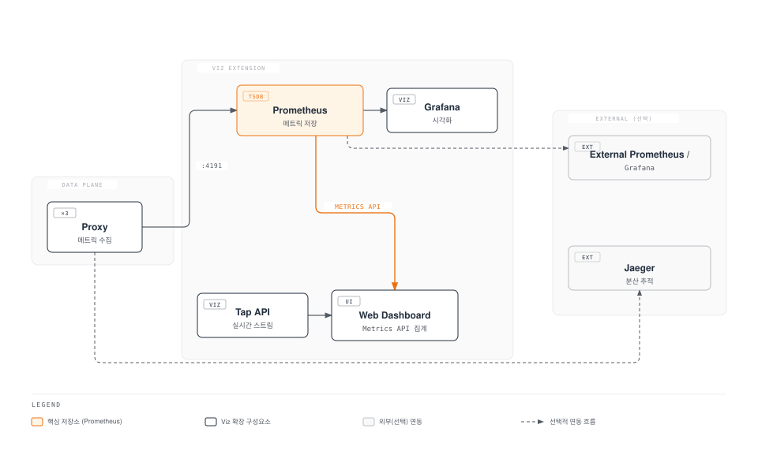
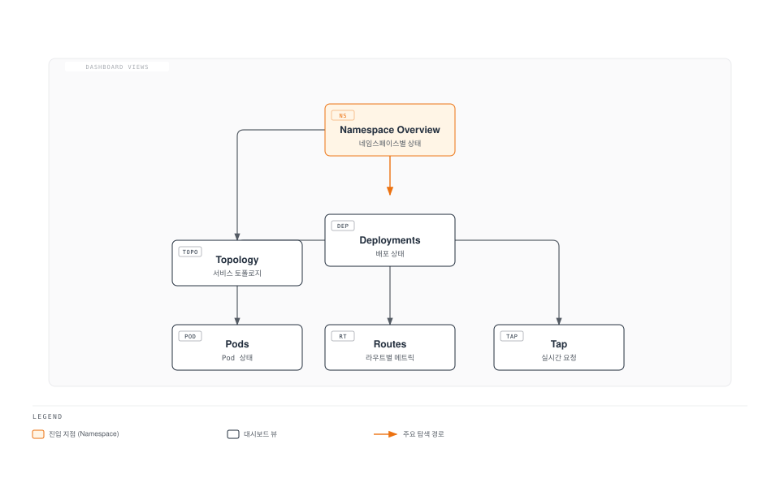
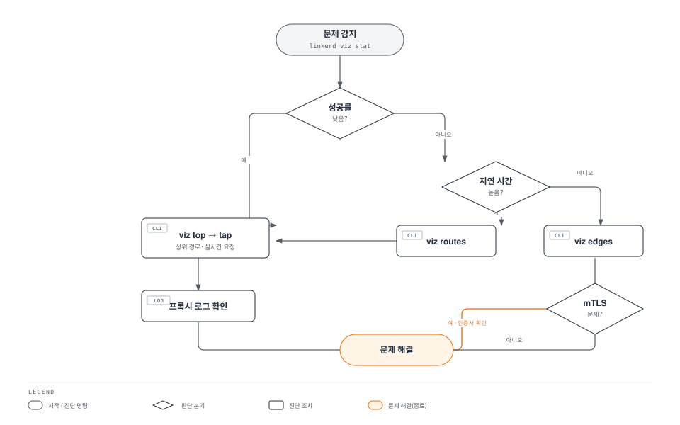

# Linkerd 관찰성

> **지원 버전**: Linkerd 2.16+
> **마지막 업데이트**: 2026년 2월 22일

## 개요

Linkerd는 강력한 관찰성 기능을 기본으로 제공합니다. 별도의 계측 없이도 골든 시그널(성공률, 요청률, 지연 시간)을 자동으로 수집하고, 직관적인 대시보드와 CLI 도구로 서비스 상태를 실시간으로 파악할 수 있습니다.

## 관찰성 아키텍처



## 골든 메트릭

Linkerd는 Google의 골든 시그널 중 세 가지를 자동으로 수집합니다.

### 세 가지 핵심 메트릭

| 메트릭 | 설명 | Prometheus 메트릭 |
|--------|------|------------------|
| **성공률** | 성공한 요청의 비율 (2xx/3xx) | `response_total{classification="success"}` |
| **요청률** | 초당 요청 수 (RPS) | `request_total` |
| **지연 시간** | 요청 처리 시간 분포 (p50, p95, p99) | `response_latency_ms_bucket` |

### 메트릭 확인

```bash
# 기본 통계 확인
linkerd viz stat deploy -n my-app

# 예상 출력:
# NAME      MESHED   SUCCESS   RPS  LATENCY_P50  LATENCY_P95  LATENCY_P99
# api       2/2      99.50%   100       10ms         50ms        100ms
# web       3/3      98.20%   200       15ms         80ms        200ms
# database  1/1     100.00%    50        5ms         20ms         50ms

# 특정 Deployment 상세 확인
linkerd viz stat deploy/web -n my-app --to deploy/api

# Pod별 통계
linkerd viz stat po -n my-app

# 네임스페이스별 통계
linkerd viz stat ns
```

## Viz 대시보드

Viz 확장은 웹 기반 대시보드를 제공합니다.

### 대시보드 접근

```bash
# 대시보드 열기 (브라우저 자동 실행)
linkerd viz dashboard

# 특정 포트로 열기
linkerd viz dashboard --port 8084

# 백그라운드에서 실행
linkerd viz dashboard &

# 외부 접근 허용 (주의: 보안 고려 필요)
linkerd viz dashboard --address 0.0.0.0
```

### 대시보드 기능



**대시보드 뷰:**

| 뷰 | 설명 |
|----|------|
| Namespace | 네임스페이스별 메시 상태 개요 |
| Deployments | 배포별 성공률, RPS, 지연 시간 |
| Pods | Pod별 상세 메트릭 |
| TCP | TCP 연결 메트릭 |
| Routes | ServiceProfile 라우트별 메트릭 |
| Topology | 서비스 간 통신 시각화 |
| Tap | 실시간 요청 스트림 |

## CLI 도구

### linkerd viz stat

서비스 통계를 조회합니다.

```bash
# 기본 사용법
linkerd viz stat <resource-type> [flags]

# 리소스 타입: deploy, po, ns, svc, rs, job, cronjob, ds, sts

# Deployment 통계
linkerd viz stat deploy -n my-app

# 특정 서비스로 가는 트래픽만
linkerd viz stat deploy/web -n my-app --to deploy/api

# 특정 서비스에서 오는 트래픽만
linkerd viz stat deploy/api -n my-app --from deploy/web

# 시간 범위 지정
linkerd viz stat deploy -n my-app --time-window 10m

# JSON 출력
linkerd viz stat deploy -n my-app -o json

# 추가 정보 표시 (프록시 버전 등)
linkerd viz stat deploy -n my-app -o wide
```

### linkerd viz top

실시간으로 가장 활발한 경로를 표시합니다.

```bash
# Deployment의 상위 요청 경로
linkerd viz top deploy/web -n my-app

# 예상 출력:
# Source                Destination          Method  Path                Count  Best  Worst  Last  Success
# web-7b8f9c-abc12     api-5d6e7f-xyz89      GET    /api/users            150   2ms   50ms   5ms    98.00%
# web-7b8f9c-abc12     api-5d6e7f-xyz89      POST   /api/orders            50   5ms  100ms  10ms    96.00%

# 네임스페이스 전체
linkerd viz top ns/my-app

# 숨겨진 헤더 표시
linkerd viz top deploy/web -n my-app --hide-sources=false
```

### linkerd viz tap

실시간 요청 스트림을 확인합니다.

```bash
# 기본 tap
linkerd viz tap deploy/web -n my-app

# 예상 출력:
# req id=0:0 proxy=out src=10.0.0.1:54321 dst=10.0.0.2:80 tls=true :method=GET :path=/api/users
# rsp id=0:0 proxy=out src=10.0.0.1:54321 dst=10.0.0.2:80 tls=true :status=200 latency=5ms
# end id=0:0 proxy=out src=10.0.0.1:54321 dst=10.0.0.2:80 tls=true duration=5ms response-length=1234B

# 필터링
linkerd viz tap deploy/web -n my-app --method GET --path /api

# 특정 대상으로 가는 트래픽
linkerd viz tap deploy/web -n my-app --to deploy/api

# 특정 소스에서 오는 트래픽
linkerd viz tap deploy/api -n my-app --from deploy/web

# HTTP 헤더 포함
linkerd viz tap deploy/web -n my-app --show-headers

# 최대 요청 수 제한
linkerd viz tap deploy/web -n my-app --max-rps 100

# JSON 출력
linkerd viz tap deploy/web -n my-app -o json
```

### linkerd viz routes

ServiceProfile 라우트별 메트릭을 확인합니다.

```bash
# 라우트별 통계
linkerd viz routes deploy/api -n my-app

# 예상 출력:
# ROUTE                          SERVICE   SUCCESS      RPS   LATENCY_P50   LATENCY_P95   LATENCY_P99
# GET /api/users                 api       99.50%    50.0rps         10ms          50ms         100ms
# POST /api/orders               api       98.00%    20.0rps         20ms         100ms         200ms
# GET /health                    api      100.00%     5.0rps          1ms           2ms           5ms
# [DEFAULT]                      api       95.00%    10.0rps         15ms          80ms         150ms

# 특정 대상으로 가는 라우트
linkerd viz routes deploy/web -n my-app --to svc/api

# 시간 범위
linkerd viz routes deploy/api -n my-app --time-window 10m
```

### linkerd viz edges

서비스 간 연결(엣지)을 확인합니다.

```bash
# 엣지 확인
linkerd viz edges deploy -n my-app

# 예상 출력:
# SRC          DST          SRC_NS    DST_NS    SECURED
# web          api          my-app    my-app    √
# api          database     my-app    database  √
# ingress      web          ingress   my-app    √

# Pod별 엣지
linkerd viz edges po -n my-app
```

## Prometheus 통합

### 기본 Prometheus (Viz 내장)

Viz 확장에 포함된 Prometheus를 사용합니다.

```bash
# Prometheus 접근
kubectl port-forward -n linkerd-viz svc/prometheus 9090:9090

# 브라우저에서 http://localhost:9090 접근
```

### 외부 Prometheus 연동

기존 Prometheus에 Linkerd 메트릭을 통합합니다.

```yaml
# prometheus-additional-scrape-configs.yaml
- job_name: 'linkerd-controller'
  kubernetes_sd_configs:
  - role: pod
    namespaces:
      names:
      - linkerd
      - linkerd-viz
  relabel_configs:
  - source_labels:
    - __meta_kubernetes_pod_container_port_name
    action: keep
    regex: admin-http
  - source_labels: [__meta_kubernetes_namespace]
    action: replace
    target_label: namespace
  - source_labels: [__meta_kubernetes_pod_name]
    action: replace
    target_label: pod
  - source_labels: [__meta_kubernetes_pod_container_name]
    action: replace
    target_label: container

- job_name: 'linkerd-proxy'
  kubernetes_sd_configs:
  - role: pod
  relabel_configs:
  - source_labels:
    - __meta_kubernetes_pod_container_name
    - __meta_kubernetes_pod_container_port_name
    action: keep
    regex: ^linkerd-proxy;linkerd-admin$
  - source_labels: [__meta_kubernetes_namespace]
    action: replace
    target_label: namespace
  - source_labels: [__meta_kubernetes_pod_name]
    action: replace
    target_label: pod
  - source_labels: [__meta_kubernetes_pod_label_linkerd_io_proxy_deployment]
    action: replace
    target_label: deployment
  - action: labeldrop
    regex: __meta_kubernetes_pod_label_linkerd_io_proxy_job
```

### Prometheus Operator 연동

```yaml
# ServiceMonitor for Linkerd
apiVersion: monitoring.coreos.com/v1
kind: ServiceMonitor
metadata:
  name: linkerd-controller
  namespace: monitoring
spec:
  namespaceSelector:
    matchNames:
    - linkerd
  selector:
    matchLabels:
      linkerd.io/control-plane-component: destination
  endpoints:
  - port: admin-http
    interval: 10s

---
# PodMonitor for Linkerd Proxies
apiVersion: monitoring.coreos.com/v1
kind: PodMonitor
metadata:
  name: linkerd-proxies
  namespace: monitoring
spec:
  namespaceSelector:
    any: true
  selector:
    matchLabels:
      linkerd.io/control-plane-ns: linkerd
  podMetricsEndpoints:
  - port: linkerd-admin
    interval: 10s
    path: /metrics
```

### 주요 Prometheus 메트릭

```promql
# 성공률 (5분 윈도우)
sum(rate(response_total{classification="success"}[5m])) by (deployment)
/
sum(rate(response_total[5m])) by (deployment)

# 요청률 (RPS)
sum(rate(request_total[5m])) by (deployment)

# P99 지연 시간
histogram_quantile(0.99,
  sum(rate(response_latency_ms_bucket[5m])) by (le, deployment)
)

# P95 지연 시간
histogram_quantile(0.95,
  sum(rate(response_latency_ms_bucket[5m])) by (le, deployment)
)

# P50 지연 시간
histogram_quantile(0.50,
  sum(rate(response_latency_ms_bucket[5m])) by (le, deployment)
)

# TCP 연결 수
sum(tcp_open_total) by (deployment)

# 재시도 비율
sum(rate(request_total{direction="outbound", tls="true", retry="true"}[5m]))
/
sum(rate(request_total{direction="outbound", tls="true"}[5m]))

# mTLS 비율
sum(rate(response_total{tls="true"}[5m]))
/
sum(rate(response_total[5m]))
```

## Grafana 대시보드

### Viz 내장 Grafana

```bash
# Grafana 접근
kubectl port-forward -n linkerd-viz svc/grafana 3000:3000

# 브라우저에서 http://localhost:3000 접근
```

### 외부 Grafana 연동

```yaml
# Viz 설치 시 Grafana 비활성화
# viz-values.yaml
grafana:
  enabled: false
```

### 사전 구축된 대시보드

Linkerd는 여러 Grafana 대시보드를 제공합니다:

| 대시보드 | 설명 |
|---------|------|
| Linkerd Health | 컨트롤 플레인 상태 |
| Linkerd Top Line | 전체 메시 개요 |
| Linkerd Deployment | 배포별 상세 |
| Linkerd Pod | Pod별 상세 |
| Linkerd Service | 서비스별 상세 |
| Linkerd Route | 라우트별 상세 |
| Linkerd Authority | 권한별 상세 |
| Linkerd Multicluster | 멀티클러스터 상태 |

### 커스텀 대시보드 예제

```json
{
  "title": "Linkerd Service Overview",
  "panels": [
    {
      "title": "Success Rate",
      "type": "gauge",
      "targets": [
        {
          "expr": "sum(rate(response_total{classification=\"success\", namespace=\"$namespace\", deployment=\"$deployment\"}[5m])) / sum(rate(response_total{namespace=\"$namespace\", deployment=\"$deployment\"}[5m])) * 100",
          "legendFormat": "Success Rate"
        }
      ]
    },
    {
      "title": "Request Rate",
      "type": "graph",
      "targets": [
        {
          "expr": "sum(rate(request_total{namespace=\"$namespace\", deployment=\"$deployment\"}[5m]))",
          "legendFormat": "RPS"
        }
      ]
    },
    {
      "title": "Latency Distribution",
      "type": "graph",
      "targets": [
        {
          "expr": "histogram_quantile(0.50, sum(rate(response_latency_ms_bucket{namespace=\"$namespace\", deployment=\"$deployment\"}[5m])) by (le))",
          "legendFormat": "p50"
        },
        {
          "expr": "histogram_quantile(0.95, sum(rate(response_latency_ms_bucket{namespace=\"$namespace\", deployment=\"$deployment\"}[5m])) by (le))",
          "legendFormat": "p95"
        },
        {
          "expr": "histogram_quantile(0.99, sum(rate(response_latency_ms_bucket{namespace=\"$namespace\", deployment=\"$deployment\"}[5m])) by (le))",
          "legendFormat": "p99"
        }
      ]
    }
  ]
}
```

## 분산 추적 (Jaeger)

### Jaeger 확장 설치

```bash
# Jaeger 확장 설치
linkerd jaeger install | kubectl apply -f -

# 설치 확인
linkerd jaeger check

# 대시보드 열기
linkerd jaeger dashboard
```

### 추적 구성

```yaml
# Jaeger 확장 values
# jaeger-values.yaml
collector:
  replicas: 1
  resources:
    cpu:
      request: 100m
      limit: 500m
    memory:
      request: 100Mi
      limit: 500Mi

jaeger:
  replicas: 1
  resources:
    cpu:
      request: 100m
      limit: 500m
    memory:
      request: 100Mi
      limit: 500Mi

# 샘플링 설정
webhook:
  collectorSvcAddr: collector.linkerd-jaeger:55678
```

### 애플리케이션 추적 헤더

분산 추적을 위해 애플리케이션이 추적 헤더를 전파해야 합니다:

```yaml
# 전파해야 할 헤더
# - x-request-id
# - x-b3-traceid
# - x-b3-spanid
# - x-b3-parentspanid
# - x-b3-sampled
# - x-b3-flags
# - b3
```

```python
# Python Flask 예제
from flask import Flask, request
import requests

app = Flask(__name__)

# 전파할 헤더 목록
TRACE_HEADERS = [
    'x-request-id',
    'x-b3-traceid',
    'x-b3-spanid',
    'x-b3-parentspanid',
    'x-b3-sampled',
    'x-b3-flags',
    'b3'
]

@app.route('/api/data')
def get_data():
    # 추적 헤더 추출
    headers = {h: request.headers.get(h) for h in TRACE_HEADERS if request.headers.get(h)}

    # 다운스트림 서비스 호출 시 헤더 전파
    response = requests.get('http://backend-service/api/backend', headers=headers)
    return response.json()
```

```go
// Go 예제
package main

import (
    "net/http"
)

var traceHeaders = []string{
    "x-request-id",
    "x-b3-traceid",
    "x-b3-spanid",
    "x-b3-parentspanid",
    "x-b3-sampled",
    "x-b3-flags",
    "b3",
}

func handler(w http.ResponseWriter, r *http.Request) {
    // 다운스트림 요청 생성
    req, _ := http.NewRequest("GET", "http://backend-service/api/backend", nil)

    // 추적 헤더 전파
    for _, h := range traceHeaders {
        if v := r.Header.Get(h); v != "" {
            req.Header.Set(h, v)
        }
    }

    client := &http.Client{}
    resp, _ := client.Do(req)
    defer resp.Body.Close()
}
```

### 외부 Jaeger 연동

```yaml
# 외부 Jaeger 사용 시
apiVersion: v1
kind: ConfigMap
metadata:
  name: linkerd-jaeger-config
  namespace: linkerd-jaeger
data:
  config.yaml: |
    collector:
      address: jaeger-collector.monitoring:14268
```

## 액세스 로깅

### 프록시 로그 설정

```yaml
# Pod 어노테이션으로 로그 레벨 설정
apiVersion: apps/v1
kind: Deployment
metadata:
  name: web
spec:
  template:
    metadata:
      annotations:
        config.linkerd.io/proxy-log-level: "warn,linkerd=info,linkerd_proxy=debug"
        config.linkerd.io/proxy-log-format: "json"
```

### 로그 레벨

| 레벨 | 설명 |
|------|------|
| error | 오류만 |
| warn | 경고 이상 |
| info | 정보 이상 (기본값) |
| debug | 디버그 이상 |
| trace | 모든 로그 |

### 로그 확인

```bash
# 프록시 로그 확인
kubectl logs deploy/web -n my-app -c linkerd-proxy

# 실시간 로그 스트림
kubectl logs deploy/web -n my-app -c linkerd-proxy -f

# 특정 키워드 필터링
kubectl logs deploy/web -n my-app -c linkerd-proxy | grep "error"
```

## ServiceProfile 메트릭

ServiceProfile을 정의하면 라우트별 메트릭을 수집할 수 있습니다.

### 라우트별 메트릭 활성화

```yaml
apiVersion: linkerd.io/v1alpha2
kind: ServiceProfile
metadata:
  name: api-service.my-app.svc.cluster.local
  namespace: my-app
spec:
  routes:
  - name: GET /api/users
    condition:
      method: GET
      pathRegex: /api/users
    isRetryable: true

  - name: POST /api/orders
    condition:
      method: POST
      pathRegex: /api/orders
    isRetryable: false

  - name: GET /health
    condition:
      method: GET
      pathRegex: /health
```

### 라우트 메트릭 쿼리

```promql
# 라우트별 성공률
sum(rate(route_response_total{classification="success"}[5m])) by (rt_route)
/
sum(rate(route_response_total[5m])) by (rt_route)

# 라우트별 지연 시간
histogram_quantile(0.99,
  sum(rate(route_response_latency_ms_bucket[5m])) by (le, rt_route)
)

# 라우트별 요청률
sum(rate(route_request_total[5m])) by (rt_route)
```

## 모니터링 모범 사례

### 알림 설정

```yaml
# Prometheus 알림 규칙
apiVersion: monitoring.coreos.com/v1
kind: PrometheusRule
metadata:
  name: linkerd-alerts
  namespace: monitoring
spec:
  groups:
  - name: linkerd
    rules:
    # 낮은 성공률 알림
    - alert: LinkerdHighErrorRate
      expr: |
        (
          sum(rate(response_total{classification="failure"}[5m])) by (deployment, namespace)
          /
          sum(rate(response_total[5m])) by (deployment, namespace)
        ) > 0.05
      for: 5m
      labels:
        severity: critical
      annotations:
        summary: "High error rate detected"
        description: "{{ $labels.deployment }} in {{ $labels.namespace }} has error rate > 5%"

    # 높은 지연 시간 알림
    - alert: LinkerdHighLatency
      expr: |
        histogram_quantile(0.99,
          sum(rate(response_latency_ms_bucket[5m])) by (le, deployment, namespace)
        ) > 1000
      for: 5m
      labels:
        severity: warning
      annotations:
        summary: "High latency detected"
        description: "{{ $labels.deployment }} p99 latency > 1s"

    # 프록시 미주입 알림
    - alert: LinkerdProxyNotInjected
      expr: |
        sum by (namespace) (
          kube_pod_status_phase{phase="Running"}
        ) - sum by (namespace) (
          kube_pod_container_status_running{container="linkerd-proxy"}
        ) > 0
      for: 10m
      labels:
        severity: warning
      annotations:
        summary: "Pods without Linkerd proxy"
        description: "Some pods in {{ $labels.namespace }} are not meshed"
```

### 대시보드 구성 권장사항

```yaml
# 주요 모니터링 대시보드 구성
1. 개요 대시보드:
   - 전체 메시 성공률
   - 전체 요청률
   - 상위 오류 서비스

2. 서비스별 대시보드:
   - 서비스 성공률 추이
   - 요청률 추이
   - 지연 시간 분포 (p50, p95, p99)
   - 업스트림/다운스트림 의존성

3. 인프라 대시보드:
   - 컨트롤 플레인 상태
   - 프록시 리소스 사용량
   - 인증서 만료 시간
```

### 문제 해결 워크플로우



## 다음 단계

- [다중 클러스터](./06-multi-cluster.md): 클러스터 간 관찰성
- [모범 사례](./07-best-practices.md): 프로덕션 모니터링 설정

## 참고 자료

- [Linkerd Observability](https://linkerd.io/2/features/dashboard/)
- [Prometheus Integration](https://linkerd.io/2/tasks/exporting-metrics/)
- [Grafana Dashboards](https://linkerd.io/2/tasks/grafana/)
- [Distributed Tracing](https://linkerd.io/2/tasks/distributed-tracing/)
