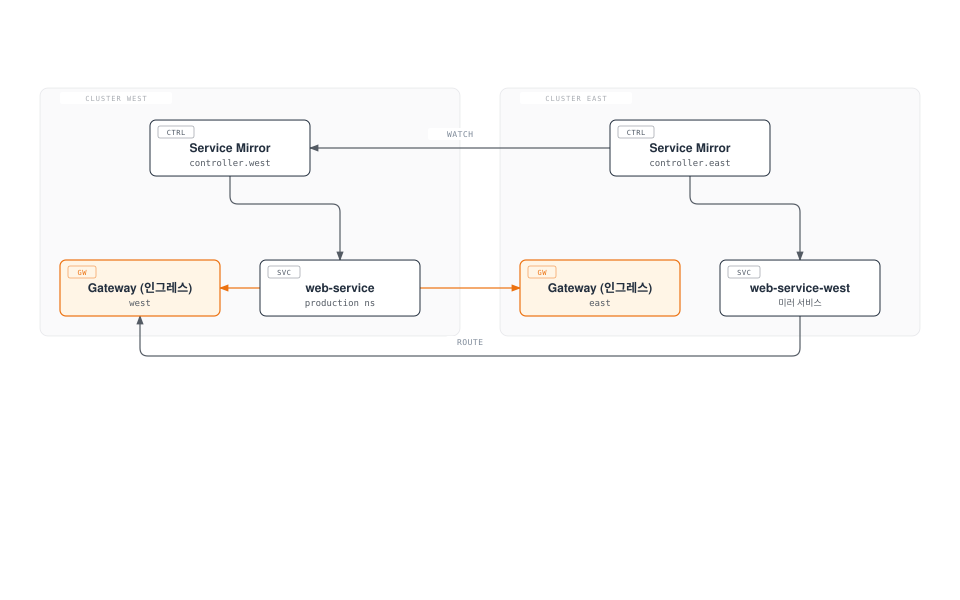
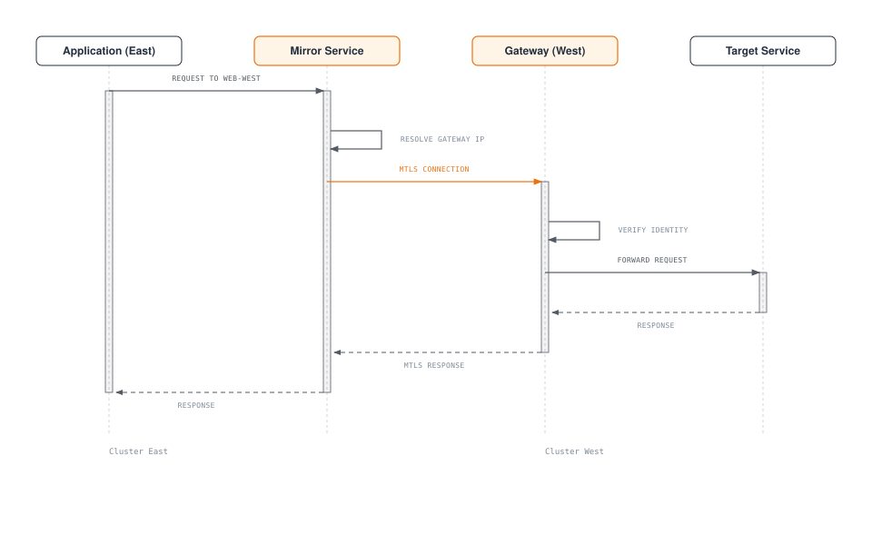
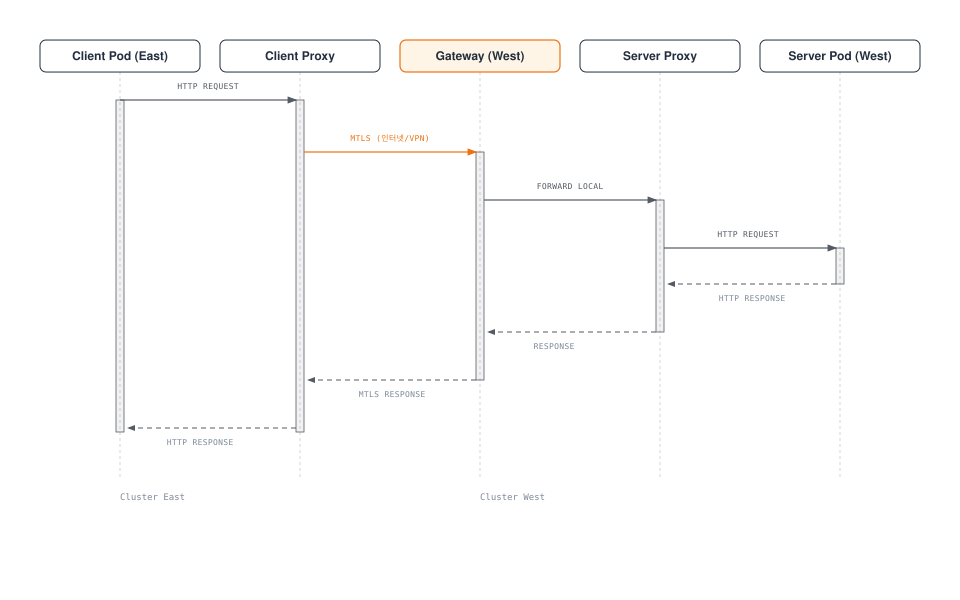
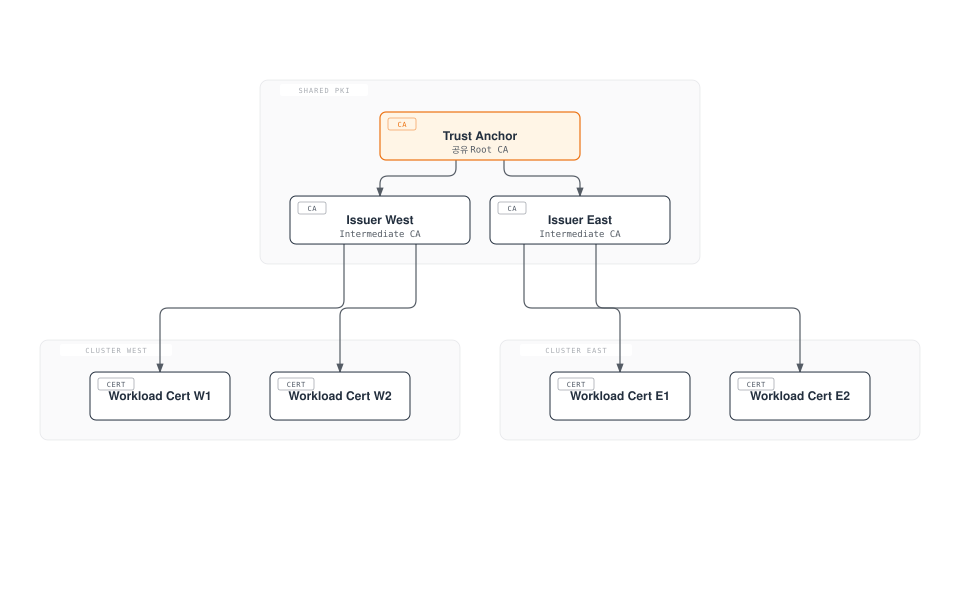

# Linkerd 다중 클러스터

> **지원 버전**: Linkerd 2.16+
> **마지막 업데이트**: 2026년 2월 22일

## 개요

Linkerd의 다중 클러스터 기능은 서비스 미러링(Service Mirroring) 아키텍처를 통해 여러 Kubernetes 클러스터 간에 안전하고 투명한 통신을 제공합니다. 이 문서에서는 다중 클러스터 설정, 서비스 미러링, 페일오버, EKS 환경에서의 구성을 다룹니다.

## 다중 클러스터 아키텍처



## 서비스 미러링 개념

### 동작 방식



### 서비스 미러링 특성

| 특성 | 설명 |
|------|------|
| 투명한 디스커버리 | 원격 서비스가 로컬 서비스처럼 보임 |
| mTLS 보안 | 클러스터 간 통신도 암호화 |
| 헬스 체크 | 원격 서비스 가용성 자동 확인 |
| 로드 밸런싱 | EWMA 알고리즘으로 지연 시간 기반 분배 |

## 다중 클러스터 설정

### 사전 요구사항

```bash
# 두 클러스터 모두에 Linkerd 설치 필요
# 동일한 Trust Anchor 사용 (중요!)

# 클러스터 컨텍스트 확인
kubectl config get-contexts

# 예시 컨텍스트:
# - west (us-west-2)
# - east (us-east-1)
```

### 공유 Trust Anchor 생성

```bash
# 두 클러스터가 상호 신뢰하려면 동일한 Trust Anchor 필요

# Trust Anchor 생성
step certificate create root.linkerd.cluster.local ca.crt ca.key \
  --profile root-ca \
  --no-password \
  --insecure \
  --not-after=87600h

# 각 클러스터별 Issuer 생성
# Cluster West
step certificate create identity.linkerd.cluster.local issuer-west.crt issuer-west.key \
  --profile intermediate-ca \
  --ca ca.crt \
  --ca-key ca.key \
  --no-password \
  --insecure \
  --not-after=8760h

# Cluster East
step certificate create identity.linkerd.cluster.local issuer-east.crt issuer-east.key \
  --profile intermediate-ca \
  --ca ca.crt \
  --ca-key ca.key \
  --no-password \
  --insecure \
  --not-after=8760h
```

### 두 클러스터에 Linkerd 설치

```bash
# Cluster West에 설치
kubectl config use-context west

linkerd install --crds | kubectl apply -f -
linkerd install \
  --identity-trust-anchors-file ca.crt \
  --identity-issuer-certificate-file issuer-west.crt \
  --identity-issuer-key-file issuer-west.key \
  | kubectl apply -f -

# Cluster East에 설치
kubectl config use-context east

linkerd install --crds | kubectl apply -f -
linkerd install \
  --identity-trust-anchors-file ca.crt \
  --identity-issuer-certificate-file issuer-east.crt \
  --identity-issuer-key-file issuer-east.key \
  | kubectl apply -f -
```

### Multicluster 확장 설치

```bash
# Cluster West
kubectl config use-context west
linkerd multicluster install | kubectl apply -f -
linkerd multicluster check

# Cluster East
kubectl config use-context east
linkerd multicluster install | kubectl apply -f -
linkerd multicluster check
```

### 클러스터 연결 (Link)

```bash
# West 클러스터의 자격 증명을 East에 등록
kubectl config use-context west

# Link 생성 (West -> East가 West를 볼 수 있도록)
linkerd multicluster link --cluster-name west | kubectl --context=east apply -f -

# 연결 확인
kubectl --context=east get links

# 게이트웨이 상태 확인
linkerd --context=east multicluster gateways

# 예상 출력:
# CLUSTER  ALIVE    NUM_SVC  LATENCY
# west     True           3      5ms
```

### 양방향 연결

```bash
# East -> West 연결
kubectl config use-context east
linkerd multicluster link --cluster-name east | kubectl --context=west apply -f -

# 양쪽에서 확인
linkerd --context=west multicluster gateways
linkerd --context=east multicluster gateways
```

## 서비스 내보내기 및 가져오기

### 서비스 내보내기 (Export)

```yaml
# West 클러스터에서 서비스 내보내기
apiVersion: v1
kind: Service
metadata:
  name: web
  namespace: production
  labels:
    mirror.linkerd.io/exported: "true"  # 이 레이블로 내보내기
spec:
  selector:
    app: web
  ports:
  - port: 80
    targetPort: 8080
```

```bash
# 또는 기존 서비스에 레이블 추가
kubectl --context=west label svc web -n production mirror.linkerd.io/exported=true
```

### 미러 서비스 확인

```bash
# East 클러스터에서 미러 서비스 확인
kubectl --context=east get svc -n production

# 예상 출력:
# NAME        TYPE        CLUSTER-IP      PORT(S)
# web         ClusterIP   10.100.0.1      80/TCP      # 로컬 서비스
# web-west    ClusterIP   10.100.0.2      80/TCP      # West에서 미러된 서비스

# 엔드포인트 확인
kubectl --context=east get endpoints web-west -n production
```

### 미러 서비스 사용

```yaml
# East 클러스터의 애플리케이션에서 West 서비스 호출
apiVersion: apps/v1
kind: Deployment
metadata:
  name: client
  namespace: production
spec:
  template:
    spec:
      containers:
      - name: client
        image: client:latest
        env:
        # 로컬 서비스
        - name: WEB_URL
          value: "http://web.production.svc.cluster.local"
        # West 클러스터 서비스
        - name: WEB_WEST_URL
          value: "http://web-west.production.svc.cluster.local"
```

## 트래픽 분할 (Cross-Cluster)

### TrafficSplit으로 클러스터 간 트래픽 분배

```yaml
# East 클러스터에서 트래픽을 로컬과 West로 분할
apiVersion: split.smi-spec.io/v1alpha2
kind: TrafficSplit
metadata:
  name: web-split
  namespace: production
spec:
  service: web  # 메인 서비스
  backends:
  - service: web          # 로컬 (East)
    weight: 80
  - service: web-west     # 원격 (West)
    weight: 20
```

### 페일오버 구성

```yaml
# 기본: 로컬 우선, 실패 시 원격으로 페일오버
apiVersion: split.smi-spec.io/v1alpha2
kind: TrafficSplit
metadata:
  name: web-failover
  namespace: production
spec:
  service: web
  backends:
  - service: web          # Primary (로컬)
    weight: 100
  - service: web-west     # Backup (원격)
    weight: 0
# 로컬 서비스 실패 시 수동으로 weight 조정 필요
```

### 자동 페일오버 (Flagger 사용)

```yaml
# Flagger로 자동 페일오버 구성
apiVersion: flagger.app/v1beta1
kind: Canary
metadata:
  name: web
  namespace: production
spec:
  targetRef:
    apiVersion: apps/v1
    kind: Deployment
    name: web

  service:
    port: 80

  analysis:
    interval: 30s
    threshold: 3
    metrics:
    - name: request-success-rate
      thresholdRange:
        min: 99
      interval: 1m

    # 실패 시 원격 클러스터로 페일오버
    webhooks:
    - name: failover-to-west
      type: rollback
      url: http://flagger-loadtester/failover
      metadata:
        cmd: |
          kubectl patch trafficsplit web-split -p '{"spec":{"backends":[{"service":"web","weight":0},{"service":"web-west","weight":100}]}}'
```

## 크로스 클러스터 트래픽 흐름



## EKS 다중 클러스터 패턴

### 다중 리전 설정

```bash
# 클러스터 생성 (eksctl)
# US West 리전
eksctl create cluster \
  --name linkerd-west \
  --region us-west-2 \
  --nodegroup-name workers \
  --node-type m5.large \
  --nodes 3

# US East 리전
eksctl create cluster \
  --name linkerd-east \
  --region us-east-1 \
  --nodegroup-name workers \
  --node-type m5.large \
  --nodes 3
```

### NLB Gateway 설정

```yaml
# multicluster-values.yaml (EKS용)
gateway:
  serviceType: LoadBalancer
  serviceAnnotations:
    # NLB 사용
    service.beta.kubernetes.io/aws-load-balancer-type: "nlb"
    # 인터넷 facing (다른 리전에서 접근)
    service.beta.kubernetes.io/aws-load-balancer-scheme: "internet-facing"
    # 크로스존 로드밸런싱
    service.beta.kubernetes.io/aws-load-balancer-cross-zone-load-balancing-enabled: "true"
    # IP 타겟
    service.beta.kubernetes.io/aws-load-balancer-nlb-target-type: "ip"
```

```bash
# Helm으로 설치
helm install linkerd-multicluster linkerd/linkerd-multicluster \
  -n linkerd-multicluster \
  --create-namespace \
  -f multicluster-values.yaml
```

### Private Link (VPC Peering)

```yaml
# 내부 전용 NLB 설정
gateway:
  serviceType: LoadBalancer
  serviceAnnotations:
    service.beta.kubernetes.io/aws-load-balancer-type: "nlb"
    service.beta.kubernetes.io/aws-load-balancer-scheme: "internal"
    service.beta.kubernetes.io/aws-load-balancer-nlb-target-type: "ip"

# VPC Peering 또는 Transit Gateway로 연결 필요
```

### 다중 계정 설정

```bash
# 계정 A의 클러스터
eksctl create cluster \
  --name linkerd-account-a \
  --region us-west-2

# 계정 B의 클러스터
eksctl create cluster \
  --name linkerd-account-b \
  --region us-west-2

# Cross-account IAM 역할 설정 필요
# VPC Peering 또는 PrivateLink 구성 필요
```

## 크로스 클러스터 보안

### 공유 Trust Anchor



### 클러스터별 인가 정책

```yaml
# West 클러스터에서 East 클러스터의 특정 서비스만 허용
apiVersion: policy.linkerd.io/v1beta2
kind: ServerAuthorization
metadata:
  name: allow-east-cluster
  namespace: production
spec:
  server:
    name: web-server
  client:
    meshTLS:
      identities:
        # East 클러스터의 특정 서비스만 허용
        - "spiffe://root.linkerd.cluster.local/ns/production/sa/api-gateway"
```

## 관찰성 (다중 클러스터)

### 크로스 클러스터 메트릭

```bash
# 게이트웨이 상태 확인
linkerd multicluster gateways

# 예상 출력:
# CLUSTER  ALIVE    NUM_SVC  LATENCY
# west     True           5      10ms
# east     True           3       8ms

# 미러 서비스 상태
linkerd viz stat deploy -n production --to svc/web-west
```

### Prometheus 페더레이션

```yaml
# 중앙 Prometheus에서 각 클러스터 메트릭 수집
# prometheus-federation.yaml
scrape_configs:
  - job_name: 'federate-west'
    honor_labels: true
    metrics_path: '/federate'
    params:
      'match[]':
        - '{__name__=~"response_total|request_total|response_latency_ms_bucket"}'
    static_configs:
      - targets:
        - 'prometheus-west.monitoring:9090'
    relabel_configs:
      - target_label: cluster
        replacement: west

  - job_name: 'federate-east'
    honor_labels: true
    metrics_path: '/federate'
    params:
      'match[]':
        - '{__name__=~"response_total|request_total|response_latency_ms_bucket"}'
    static_configs:
      - targets:
        - 'prometheus-east.monitoring:9090'
    relabel_configs:
      - target_label: cluster
        replacement: east
```

### 크로스 클러스터 대시보드

```promql
# 클러스터별 성공률
sum(rate(response_total{classification="success"}[5m])) by (cluster)
/
sum(rate(response_total[5m])) by (cluster)

# 크로스 클러스터 트래픽 지연 시간
histogram_quantile(0.99,
  sum(rate(response_latency_ms_bucket{dst_cluster!=""}[5m])) by (le, src_cluster, dst_cluster)
)
```

## 문제 해결

### 연결 문제

```bash
# 게이트웨이 연결 확인
linkerd multicluster gateways

# ALIVE가 False인 경우:
# 1. 네트워크 연결 확인
kubectl --context=east get svc -n linkerd-multicluster

# 2. Gateway 로그 확인
kubectl --context=west logs -n linkerd-multicluster deploy/linkerd-gateway

# 3. 프로브 상태 확인
linkerd --context=east diagnostics proxy-metrics -n linkerd-multicluster deploy/linkerd-gateway | grep probe
```

### 서비스 미러링 문제

```bash
# 미러 컨트롤러 로그
kubectl --context=east logs -n linkerd-multicluster deploy/linkerd-service-mirror-west

# 미러 서비스 확인
kubectl --context=east get svc -n production | grep west

# 엔드포인트 확인
kubectl --context=east get endpoints -n production | grep west
```

### 인증서 문제

```bash
# Trust Anchor 일치 확인
# 두 클러스터의 Trust Anchor가 동일해야 함

kubectl --context=west get cm linkerd-config -n linkerd -o yaml | grep -A5 "trustAnchorsPem"
kubectl --context=east get cm linkerd-config -n linkerd -o yaml | grep -A5 "trustAnchorsPem"

# 인증서 체인 검증
linkerd --context=west check --proxy
linkerd --context=east check --proxy
```

## 다음 단계

- [모범 사례](./07-best-practices.md): 프로덕션 다중 클러스터 설정

## 참고 자료

- [Linkerd Multi-cluster](https://linkerd.io/2/features/multicluster/)
- [Service Mirroring](https://linkerd.io/2/tasks/installing-multicluster/)
- [Multicluster Communication](https://linkerd.io/2/tasks/multicluster/)
