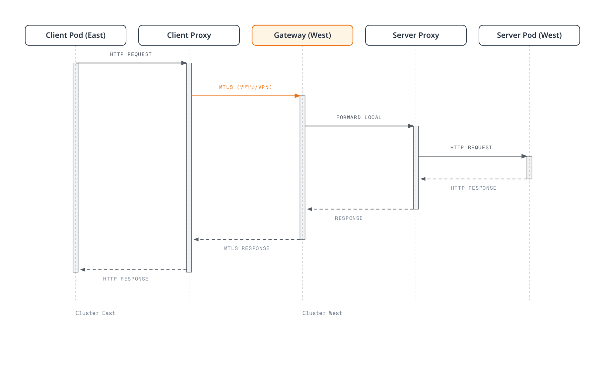
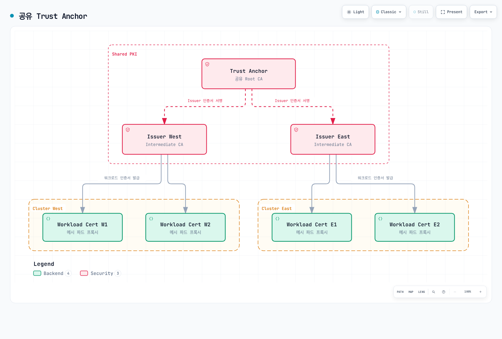

# Linkerd 다중 클러스터

> **검토 기준**: 2026년 9월 11일 · Linkerd edge-26.9.1 / chart 2026.9.1 · Gateway API 1.5.1

Linkerd는 선택한 서비스 정보를 cluster 경계 너머로 미러링합니다. Control plane의 discovery 경로와 적합한 data plane network 경로가 모두 필요합니다. Cluster를 합치거나 애플리케이션 데이터를 복제하거나 모든 요청을 shadow test용으로 복제하는 기능은 아닙니다.

## 통신 모드

| 모드 | Discovery/서비스 선택 | 데이터 경로와 identity |
|---|---|---|
| Hierarchical | 기본 `mirror.linkerd.io/exported=true` | Source client proxy → 대상 cluster gateway → server; gateway에서 원래 caller identity가 보존되지 않음 |
| Flat / remote discovery | `mirror.linkerd.io/exported=remote-discovery` | Cluster 간 직접 Pod 연결; 원래 workload identity 보존 |
| Federated Service | `mirror.linkerd.io/federated=member` | Flat network에서 이름/namespace가 같은 서비스의 합집합; mesh client 필요 |

Source cluster의 mirror controller는 다른 mirror controller가 아닌 **대상 Kubernetes API**를 감시합니다. Mirror Service는 Kubernetes discovery 객체이며 TLS를 수행하는 process가 아닙니다. 일반적인 이름은 대응하는 namespace의 `<service>-<Link cluster name>`입니다.



[인터랙티브 다이어그램 보기](https://www.atomai.click/kubernetes-docs/archmaps/ko-service-mesh-linkerd-06-multi-cluster-2.html)

Hierarchical 모드에는 source client에서 대상 gateway에 도달하는 경로가 필요합니다. Flat/federated 모드는 cluster 사이의 직접적이고 모호하지 않은 Pod IP routing과 동일한 Linkerd control plane namespace도 필요합니다. Internal load balancer나 VPC endpoint만으로 flat network가 만들어지지는 않습니다.

## 전제 조건과 공유 Trust

명시적인 kubeconfig context `west`, `east`를 가진 준비된 cluster 두 개를 사용합니다. 이 이름은 local alias이며 AWS account/Region의 증명이 아닙니다. 호환되는 Kubernetes/Gateway API 버전, Linux worker/CNI 구성, 고정한 CLI는 [설치 가이드](01-installation.md)를 따릅니다. 최신 Kubernetes release를 Linkerd 호환성으로 간주하지 않습니다.

양쪽 Linkerd는 관련 issuer chain을 신뢰해야 합니다. 공통 공개 root 하나가 가장 단순한 방식이며 적절한 root 여러 개를 포함한 공유 bundle도 지원합니다. Issuer private key나 workload 인증서를 공유할 필요는 없습니다.



[인터랙티브 다이어그램 보기](https://www.atomai.click/kubernetes-docs/archmaps/ko-service-mesh-linkerd-06-multi-cluster-3.html)

다음은 **새로 만드는 격리된 lab에 한해** 공통 root와 별도의 ECDSA P-256 issuer를 생성합니다. 10년 root 수명은 예제이며 CLI 기본값이나 일반적인 권장값이 아닙니다.

```bash
set -euo pipefail
umask 077
# New lab PKI only. The chosen root lifetime is an example, not a default.
step certificate create root.linkerd.cluster.local ca.crt ca.key \
  --profile root-ca --kty EC --curve P-256 \
  --not-after 87600h --no-password --insecure
step certificate create identity.linkerd.cluster.local issuer-west.crt issuer-west.key \
  --profile intermediate-ca --kty EC --curve P-256 \
  --ca ca.crt --ca-key ca.key --not-after 8760h --no-password --insecure
step certificate create identity.linkerd.cluster.local issuer-east.crt issuer-east.key \
  --profile intermediate-ca --kty EC --curve P-256 \
  --ca ca.crt --ca-key ca.key --not-after 8760h --no-password --insecure
cp ca.crt shared-roots.pem
```

`--no-password --insecure`는 암호화하지 않은 private-key 파일을 만듭니다. 보호된 작업 위치에 두고 각 cluster에 필요한 공개 trust bundle과 issuer 자료만 배포합니다. 기존 mesh는 [단계적 trust 교체 절차](04-security.md)를 따르며 새 설치 예제를 따라가려고 root를 바로 교체하지 않습니다.

### 명시적인 context로 core 설치

양쪽에서 설치 가이드의 Gateway API/CNI 전제 조건을 완료한 뒤 CLI 소유 core 설치에 사용하는 경로입니다. Helm 소유 core는 해당 소유자를 유지하고 검토한 values로 cluster별 credential을 전달합니다.

명령은 호환되는 Linux worker의 기본 proxy-init 경로입니다. Linkerd CNI를 사용하면 선택한 설치 설정에 `cniEnabled:true`도 전달해야 합니다.

```bash
set -euo pipefail
# New CLI-owned installations only; complete Gateway API/CNI prerequisites first.
linkerd --context west install --crds | kubectl --context west apply -f -
linkerd --context west install \
  --identity-trust-anchors-file shared-roots.pem \
  --identity-issuer-certificate-file issuer-west.crt \
  --identity-issuer-key-file issuer-west.key | kubectl --context west apply -f -

linkerd --context east install --crds | kubectl --context east apply -f -
linkerd --context east install \
  --identity-trust-anchors-file shared-roots.pem \
  --identity-issuer-certificate-file issuer-east.crt \
  --identity-issuer-key-file issuer-east.key | kubectl --context east apply -f -
linkerd --context west check
linkerd --context east check
```

트래픽 통계가 필요하면 Viz를 별도로 설치합니다. Multicluster extension의 검사는 애플리케이션/business 검증이 아닙니다.

## Extension과 방향성 있는 Link

이 실습은 Helm이 multicluster extension과 peer controller를 소유합니다. 선택한 CLI의 이전 `multicluster link`는 deprecated입니다. Link와 credential Secret에는 `link-gen`, controller에는 chart의 `controllers` 목록을 사용합니다.

### 기본 설치

**AWS Load Balancer Controller가 설치된 EKS**의 예제로 `mc-base-values.yaml`에 저장합니다. Internal TCP NLB를 요청하므로 peer route, DNS, security group, 필요한 port가 준비되어야 합니다. 다른 플랫폼에는 해당 controller가 지원하는 load-balancer 설정이 필요합니다.

```yaml
gateway:
  enabled: true
  serviceType: LoadBalancer
  loadBalancerClass: service.k8s.aws/nlb
  serviceAnnotations:
    service.beta.kubernetes.io/aws-load-balancer-scheme: internal
    service.beta.kubernetes.io/aws-load-balancer-nlb-target-type: ip
    service.beta.kubernetes.io/aws-load-balancer-attributes: load_balancing.cross_zone.enabled=true
```

```bash
helm repo add linkerd-edge https://helm.linkerd.io/edge
helm repo update linkerd-edge
# Initially install gateway/remote-access prerequisites, without peer controllers.
helm --kube-context west upgrade --install linkerd-multicluster \
  linkerd-edge/linkerd-multicluster --version 2026.9.1 \
  -n linkerd-multicluster --create-namespace -f mc-base-values.yaml \
  --wait --timeout 10m
helm --kube-context east upgrade --install linkerd-multicluster \
  linkerd-edge/linkerd-multicluster --version 2026.9.1 \
  -n linkerd-multicluster --create-namespace -f mc-base-values.yaml \
  --wait --timeout 10m
kubectl --context west -n linkerd-multicluster get svc linkerd-gateway -o yaml
kubectl --context east -n linkerd-multicluster get svc linkerd-gateway -o yaml
```

Gateway 기반 Link를 생성하기 전에 대상 Service에 ingress IP **또는 hostname**이 있어야 합니다. AWS NLB는 보통 hostname을 제공하며 `link-gen`이 이를 처리합니다. 기본 gateway data port는 4143, readiness probe port는 4191입니다. 어느 port의 연결 성공도 원격 Kubernetes API나 모든 애플리케이션의 건강 상태를 입증하지 않습니다.

### East에서 West 사용

Controller의 원하는 목록을 `mc-east-links.yaml`로 저장합니다.

```yaml
controllers:
- link:
    ref:
      name: west
```

```bash
set -euo pipefail
umask 077
# Read West's configuration; install the generated credentials/Link into East.
linkerd --context west multicluster link-gen --cluster-name west > west-link.yaml
# Review public metadata and target endpoint without printing credential values.
kubectl --context east apply -f west-link.yaml
helm --kube-context east upgrade linkerd-multicluster \
  linkerd-edge/linkerd-multicluster --version 2026.9.1 \
  -n linkerd-multicluster -f mc-base-values.yaml -f mc-east-links.yaml \
  --wait --timeout 10m
kubectl --context east -n linkerd-multicluster get links.multicluster.linkerd.io
linkerd --context east multicluster check
linkerd --context east multicluster gateways
```

`link-gen`은 West의 API 위치/CA와 선택한 remote-access ServiceAccount token을 읽습니다. Link와 함께 `linkerd-multicluster`, control plane namespace `linkerd`용 credential Secret 두 개를 생성합니다. Network route나 source mirror controller를 직접 설치하지는 않습니다.

생성한 파일은 credential로 취급하여 접근을 제한하고 commit하거나 로그에 내용을 출력하지 않습니다. Kubeconfig에는 controller에서 사용할 수 있는 API CA 데이터와 연결 가능하고 인증서 검증이 되는 server address가 필요합니다. 작업 PC의 endpoint가 적합하지 않다면 지원되는 `--api-server-address`로 controller에서 접근할 실제 API endpoint를 지정합니다.

Link에는 방향이 있습니다. West에서 생성하고 East에 적용하면 **East가 West를 발견**할 수 있습니다. 기존 설치를 갱신할 때는 Helm의 원하는 controller 목록에 다른 peer도 유지합니다. 배열을 이 한 항목으로 교체하면 다른 controller를 제거할 수 있습니다.

### 선택적인 역방향

`mc-west-links.yaml`로 저장합니다.

```yaml
controllers:
- link:
    ref:
      name: east
```

```bash
set -euo pipefail
umask 077
linkerd --context east multicluster link-gen --cluster-name east > east-link.yaml
kubectl --context west apply -f east-link.yaml
helm --kube-context west upgrade linkerd-multicluster \
  linkerd-edge/linkerd-multicluster --version 2026.9.1 \
  -n linkerd-multicluster -f mc-base-values.yaml -f mc-west-links.yaml \
  --wait --timeout 10m
linkerd --context west multicluster check
```

Peer별 remote-access ServiceAccount를 사용하면 더 선택적으로 권한을 폐기할 수 있습니다. RBAC와 credential 갱신을 조정합니다. 이는 Kubernetes API credential이며 mesh workload 인증서와 별개입니다.

## 서비스 내보내기와 호출

양쪽 cluster에 application namespace를 준비합니다. Chart는 기본적으로 없는 mirror namespace를 생성하지 않습니다.

`mc-namespace.yaml`로 저장합니다.

```yaml
apiVersion: v1
kind: Namespace
metadata:
  name: mc-demo
  annotations:
    linkerd.io/inject: enabled
```

8080에서 수신하고 `app:web` label을 가진 검증된 mesh `web` workload와 요청 확인용 기존 mesh `client`가 필요합니다. 이 문서는 불명확한 `client:latest` 이미지를 배포하거나 일부 Deployment만으로 유효하다고 주장하지 않습니다.

다음 **West** Service를 `west-web-service.yaml`로 저장합니다.

```yaml
apiVersion: v1
kind: Service
metadata:
  name: web
  namespace: mc-demo
  labels:
    mirror.linkerd.io/exported: 'true'
spec:
  selector:
    app: web
  ports:
  - name: http
    port: 80
    targetPort: 8080
    appProtocol: http
```

```bash
# Apply the Namespace manifest to both contexts before creating workloads/mirrors.
kubectl --context west apply -f mc-namespace.yaml
kubectl --context east apply -f mc-namespace.yaml
kubectl --context west apply -f west-web-service.yaml
# Alternative for an existing West Service:
kubectl --context west -n mc-demo label service/web mirror.linkerd.io/exported=true --overwrite
kubectl --context east -n mc-demo get service web-west
# Hierarchical mode: current service-mirror still manages legacy Endpoints.
kubectl --context east -n mc-demo get endpoints web-west -o yaml
kubectl --context east -n mc-demo get endpointslices.discovery.k8s.io \
  -l kubernetes.io/service-name=web-west -o yaml
# Existing meshed client with curl installed and the expected app endpoint.
kubectl --context east -n mc-demo exec deployment/client -c client -- \
  curl --fail --show-error --retry 0 --max-time 10 http://web-west.mc-demo.svc.cluster.local/
```

새 Service라면 namespace와 workload를 준비한 뒤 manifest를 적용합니다. Label 명령은 기존 Service를 위한 대안입니다. Export label은 discovery를 선택하며 접근 제어 경계가 아닙니다. Link selector/RBAC가 일치하는 peer에만 영향을 줍니다.

선택한 service-mirror 구현은 hierarchical mirror에서 아직 이전 `Endpoints`를 관리합니다. EndpointSlice가 있으면 함께 확인하되 조회 명령을 바꾸는 것으로 controller가 이전되었다고 간주하지 않습니다. Remote-discovery 모드에서는 local Endpoints가 의도적으로 없을 수 있으며 destination component가 원격 endpoint를 조회합니다.

## 명시적인 Local/Remote 라우팅

**East**의 local web workload를 위한 apex/local backend Service를 `east-web-services.yaml`로 저장합니다.

```yaml
apiVersion: v1
kind: Service
metadata:
  name: web
  namespace: mc-demo
spec:
  selector:
    app: web
  ports:
  - name: http
    port: 80
    targetPort: 8080
    appProtocol: http
---
apiVersion: v1
kind: Service
metadata:
  name: web-local
  namespace: mc-demo
spec:
  selector:
    app: web
  ports:
  - name: http
    port: 80
    targetPort: 8080
    appProtocol: http
```

다음을 `east-web-route.yaml`로 저장하여 대상 mesh client 트래픽을 local backend와 import한 Service 사이에 분배합니다.

```yaml
apiVersion: gateway.networking.k8s.io/v1
kind: HTTPRoute
metadata:
  name: web-cluster-route
  namespace: mc-demo
spec:
  parentRefs:
  - group: ''
    kind: Service
    name: web
    port: 80
  rules:
  - backendRefs:
    - name: web-local
      port: 80
      weight: 80
    - name: web-west
      port: 80
      weight: 20
```

```bash
kubectl --context east apply -f east-web-services.yaml
kubectl --context east apply -f east-web-route.yaml
kubectl --context east -n mc-demo get httproute web-cluster-route -o yaml
linkerd --context east diagnostics policy -n mc-demo service/web 80 -o json
```

Service의 core group `""`와 Service port 80을 사용합니다. Local/remote 경로 준비 상태, route 수락, 유효 client 정책을 확인합니다. 충돌하는 ServiceProfile은 현재 outbound 정책보다 우선할 수 있으므로 [트래픽 관리](03-traffic-management.md)를 참고합니다.

### 수동 전환과 자동 Failover

100/0 설정만으로 가중치 0인 backend가 자동으로 활성 standby가 되지는 않습니다. 이 수동 소유 route에서 검토하여 선택할 remote-only 상태입니다.

```yaml
apiVersion: gateway.networking.k8s.io/v1
kind: HTTPRoute
metadata:
  name: web-cluster-route
  namespace: mc-demo
spec:
  parentRefs:
  - group: ''
    kind: Service
    name: web
    port: 80
  rules:
  - backendRefs:
    - name: web-local
      port: 80
      weight: 0
    - name: web-west
      port: 80
      weight: 100
```

선택한 상태를 의도적으로 적용하고 애플리케이션 결과, 원격 용량, 데이터 일관성을 확인한 뒤 복구로 판단합니다. 기존 요청/쓰기는 결과가 불확실할 수 있습니다. 라우팅 변경은 데이터베이스 복제나 완료된 작업 취소가 아닙니다.

이전 Flagger rollback webhook은 배포/검증되지 않은 `/failover` 서비스를 호출하고 별도 이름의 TrafficSplit을 patch했습니다. 신뢰할 수 있는 리전 failover를 구성한 것이 아닙니다. Flagger의 점진적 배포는 트래픽 가이드에서 별도로 다룹니다.

SMI TrafficSplit과 Linkerd Failover extension은 deprecated입니다. 공식 이전 방향은 flat network가 가능한 경우의 federated service입니다. 모든 hierarchical network나 엄격한 local-primary 요구사항을 자동 대체하지는 않습니다.


## Flat Network와 Federated Service

별도의 **flat-only 구성**에서는 base values에 gateway를 두지 않습니다. `flat-base-values.yaml`로 저장합니다.

```yaml
gateway:
  enabled: false
```

East의 peer controller 값인 `flat-east-links.yaml`도 gateway probe를 생략합니다.

```yaml
controllers:
- link:
    ref:
      name: west
  gateway:
    enabled: false
```

같은 base 설치 → Link/Secret → Helm controller 순서를 사용하되 이 파일들과 Link 생성의 `--gateway=false`를 적용합니다. 양쪽의 Pod routing, namespace, trust를 먼저 준비합니다. 기존 설치를 이전할 때는 마지막 hierarchical 사용자가 이동할 때까지 gateway를 유지합니다.

```bash
set -euo pipefail
umask 077
# Separate flat-network setup: both base installs omit the gateway.
# Use flat-base-values.yaml plus the corresponding flat controller values.
linkerd --context west multicluster link-gen --cluster-name west \
  --gateway=false > west-flat-link.yaml
kubectl --context east apply -f west-flat-link.yaml
helm --kube-context east upgrade linkerd-multicluster \
  linkerd-edge/linkerd-multicluster --version 2026.9.1 \
  -n linkerd-multicluster -f flat-base-values.yaml -f flat-east-links.yaml \
  --wait --timeout 10m
kubectl --context west -n mc-demo label service/web \
  mirror.linkerd.io/exported=remote-discovery --overwrite
linkerd --context east diagnostics endpoints web-west.mc-demo.svc.cluster.local:80
```

Remote-discovery는 endpoint 조회 위치를 바꾸며 Pod route, security-group rule, 원격 API 접근을 만들지는 않습니다. 대응하는 control plane credential도 destination component에서 동작해야 합니다.

### Federated Service의 구성원

이름과 namespace가 같은 서비스는 이 예제에서 보통 `web-federated`라는 Service에 합류할 수 있습니다.

```bash
# Flat connectivity, matching namespaces and the required directional Links first.
kubectl --context west -n mc-demo label service/web mirror.linkerd.io/federated=member --overwrite
kubectl --context east -n mc-demo label service/web mirror.linkerd.io/federated=member --overwrite
kubectl --context east -n mc-demo get service web-federated
kubectl --context east -n linkerd-multicluster get link west -o yaml
linkerd --context east diagnostics endpoints web-federated.mc-demo.svc.cluster.local:80
```

Federated Service는 관련 방향의 Link/controller가 있는 위치에 생성됩니다. Mesh client는 gateway 없이 발견한 member endpoint 사이에 직접 부하를 분산합니다. 복원력의 기반이지만 즉각적인 복구, 엄격한 local-first 순서, 애플리케이션/데이터 가용성을 보장하지는 않습니다.

Endpoint readiness, failure-accrual 설정, network partition, discovery freshness, client retry 의미를 검토합니다. Member Service가 다르면 metadata/port 선택도 중요하며 충돌하는 annotation이 모두 의도대로 합쳐진다고 가정하지 않습니다.

Headless service mirroring은 별도의 선택적 controller 기능이며 대응하는 controller의 `enableHeadlessServices` 설정을 사용합니다. 적절한 이름 있는 host가 필요하고 endpoint 동작도 다릅니다. Headless Service는 federated Service에 합류할 수 없습니다.

## Cluster 간 인가

Hierarchical gateway는 들어오는 mesh 연결을 인증하고 별도 outbound 연결을 만듭니다. 최종 server는 gateway를 거친 원래 remote client identity로 caller를 구분할 수 없습니다.

**Flat/federated 트래픽**에서는 West의 다음 정책으로 보존된 `client.mc-demo.serviceaccount.identity.linkerd.cluster.local` identity를 허용합니다.

```yaml
apiVersion: policy.linkerd.io/v1beta3
kind: Server
metadata:
  name: web-http
  namespace: mc-demo
spec:
  podSelector:
    matchLabels:
      app: web
  port: 8080
  proxyProtocol: HTTP/1
  accessPolicy: deny
---
apiVersion: policy.linkerd.io/v1alpha1
kind: AuthorizationPolicy
metadata:
  name: web-from-client
  namespace: mc-demo
spec:
  targetRef:
    group: policy.linkerd.io
    kind: Server
    name: web-http
  requiredAuthenticationRefs:
  - kind: ServiceAccount
    name: client
    namespace: mc-demo
```

존재하지 않는 ServerAuthorization `v1beta2`가 아니라 Linkerd AuthorizationPolicy와 Server `v1beta3`입니다. 표준 Kubernetes identity는 DNS 형식이며 이전 문서의 Istio식 SPIFFE URI가 아닙니다.

ServiceAccount/namespace/trust-domain 조합이 같으면 다른 cluster에서도 같은 identity일 수 있습니다. 별도 issuer key가 암묵적인 암호학적 cluster ID를 추가하지 않습니다. 이 정책은 해당 workload identity를 허용하며 “East만”이라는 증명이 아닙니다. 필요에 맞게 구별되는 identity와 trust 경계를 설계하고 실제 enforcement 지점에 보이는 identity를 평가합니다.

Gateway 모드에서는 최종 server에 보이는 gateway identity와 gateway/network 경계의 제어를 고려합니다. Export label이나 internal load balancer는 인가를 대체하지 않습니다.

## EKS 연결과 소유권

위 base values는 **AWS Load Balancer Controller**, `service.k8s.aws/nlb`, IP target, internal NLB를 가정합니다. Deprecated cross-zone annotation 대신 현재 load-balancer attributes annotation을 사용합니다. EKS Auto Mode는 다른 소유자/class인 `eks.amazonaws.com/nlb`를 사용하므로 지원하는 annotation을 별도로 확인합니다.

Linkerd의 TCP/mTLS 경로를 유지합니다. ALB의 HTTP routing이나 TLS termination은 같은 gateway transport가 아닙니다. 기본 source→gateway data port 4143, mirror controller→gateway probe port 4191, source control plane→대상 Kubernetes API 접근을 각각 고려합니다. 실제 routing/SNAT/security-group 설계에 맞는 source만 허용합니다.

| 연결 | 제공하는 기능 |
|---|---|
| VPC peering / 적합한 Transit Gateway routing | Route, address, DNS, security 제어를 구성했을 때의 private network 연결 |
| AWS PrivateLink | Endpoint를 통한 선택한 service/resource 접근이며 VPC peering이나 임의 Pod 간 routing을 자동 제공하지 않음 |
| EKS private Kubernetes API endpoint | Cluster VPC와 적절히 연결한 network에서 해당 Kubernetes API 접근 |
| EKS interface VPC endpoint | AWS EKS management API에 대한 private 접근이며 Kubernetes API endpoint가 아님 |

Flat 모드에는 충돌하지 않고 직접 접근 가능한 Pod address가 필요합니다. Gateway-only 연결만으로는 부족합니다. Hierarchical 모드는 임의의 원격 Pod routing이 없어도 gateway와 원격 API 접근 경로를 설계해야 합니다.

Cluster/network 생성은 검토한 인프라 절차에서 의도한 AWS account/profile과 호환 버전을 선택하여 진행합니다. `eksctl create cluster` 두 명령의 이름만 다르다고 다른 account에 생성되지는 않습니다. 이 감사에서는 cluster/gateway 생성이나 실제 Region 간 트래픽을 실행하지 않았습니다.

AWS 리소스를 관리하는 운영자/controller에는 AWS IAM 권한이 필요합니다. Linkerd의 mirror credential은 Kubernetes ServiceAccount token/RBAC로 인증하므로 모든 runtime Link에 일괄적인 cross-account IAM role이 필요한 것은 아닙니다. 두 trust 관계를 구분합니다.

## 관찰성과 Federation

`multicluster gateways`는 대상 gateway probe를 표시하며 모든 export 애플리케이션의 전체 경로 건강 상태가 아닙니다. Probe 지표는 source mirror controller에 속하며 `target_cluster_name` label의 `gateway_alive`, `gateway_probe_latency_ms` 등이 있습니다. Local gateway proxy의 일반 지표가 아닙니다.

다음은 중앙 Prometheus에서 **이미 배포한 Basic 인증 private HTTPS endpoint에 접근하는 client 설정 예제**입니다. 실제 DNS, CA/password 파일, server 인증, 연결, scrape 인가를 준비해야 합니다. 기본 Viz가 이 endpoint들을 자동 노출하지는 않습니다.

```yaml
scrape_configs:
- job_name: federate-west
  scheme: https
  honor_labels: true
  metrics_path: /federate
  params:
    match[]:
    - '{job=~"linkerd-proxy|linkerd-controller"}'
  static_configs:
  - targets:
    - prometheus-west.internal.example.com:443
  tls_config:
    ca_file: /etc/prometheus/federation/ca.crt
  basic_auth:
    username: federation-reader
    password_file: /etc/prometheus/federation/west/password
  metric_relabel_configs:
  - target_label: origin_cluster
    replacement: west
- job_name: federate-east
  scheme: https
  honor_labels: true
  metrics_path: /federate
  params:
    match[]:
    - '{job=~"linkerd-proxy|linkerd-controller"}'
  static_configs:
  - targets:
    - prometheus-east.internal.example.com:443
  tls_config:
    ca_file: /etc/prometheus/federation/ca.crt
  basic_auth:
    username: federation-reader
    password_file: /etc/prometheus/federation/east/password
  metric_relabel_configs:
  - target_label: origin_cluster
    replacement: east
```

`honor_labels:true`는 source 지표 label을 보존하므로 target relabel만으로 충돌하는 export label을 확실히 덮어쓰지는 못합니다. 여기서는 scrape 뒤 metric relabeling으로 수집기 소유 `origin_cluster`를 지정합니다. 집계할 때 origin label을 유지하고 중복 수집을 피합니다.

지표 origin별 backend 성공 비율:

```promql
(sum by (origin_cluster) (rate(response_total{namespace="mc-demo",deployment="web",direction="inbound",classification="success"}[5m]))
 or on(origin_cluster) (0 * sum by (origin_cluster) (rate(response_total{namespace="mc-demo",deployment="web",direction="inbound"}[5m])))) / sum by (origin_cluster) (rate(response_total{namespace="mc-demo",deployment="web",direction="inbound"}[5m]))
and on(origin_cluster) (sum by (origin_cluster) (rate(response_total{namespace="mc-demo",deployment="web",direction="inbound"}[5m])) > 0)
```

지표 origin별 client 관찰 TTFB:

```promql
histogram_quantile(0.99,
  sum by (le, origin_cluster) (rate(response_latency_ms_bucket{namespace="mc-demo",deployment="client",direction="outbound"}[5m]))
)
```

두 번째 query를 해당 경로로 해석하려면 demo client가 의도한 remote 트래픽을 보내고 있어야 합니다. 애플리케이션/proxy/network 시간이 포함되며 순수한 Region 간 RTT가 아닙니다. 이 설정이 `src_cluster`, `dst_cluster` label을 자동 보장하지 않습니다. 세부 cross-cluster 차원을 만들기 전에 실제 series를 확인합니다.

Success series가 없어도 cluster별 total에 0 분자를 맞춥니다. 무트래픽/누락 total을 100% 성공으로 표시하지 않습니다. 분류, unit, scrape 상태, dashboard 전제는 [관찰성 가이드](05-observability.md)를 참고합니다.

## 문제 해결

```bash
linkerd --context east multicluster check
linkerd --context east multicluster gateways
kubectl --context east -n linkerd-multicluster get link west -o yaml
kubectl --context east -n linkerd-multicluster logs deployment/controller-west -c controller --tail=100
kubectl --context west -n linkerd-multicluster logs deployment/linkerd-gateway -c linkerd-proxy --tail=100
linkerd --context east viz stat deployment/client -n mc-demo --to service/web-west
linkerd --context west check --proxy
linkerd --context east check --proxy
```

원격 API/RBAC/namespace 문제는 Link status와 controller log에서 확인합니다. Gateway 문제는 **대상** Service ingress address, probe path/port, network 경로를 확인합니다. 정상 probe가 data port나 business logic을 검증하지는 않습니다. Flat 모드는 gateway 통계 대신 destination endpoint 진단과 직접 Pod 연결을 확인합니다.

실제 공개 trust bundle을 읽습니다.

```bash
set -euo pipefail
# Public bundle data, not private keys or the generated Link kubeconfig.
kubectl --context west -n linkerd get configmap linkerd-identity-trust-roots -o json \
  | jq -er '.data["ca-bundle.crt"] | select(length > 0)' > west-trust.pem
kubectl --context east -n linkerd get configmap linkerd-identity-trust-roots -o json \
  | jq -er '.data["ca-bundle.crt"] | select(length > 0)' > east-trust.pem
openssl crl2pkcs7 -nocrl -certfile west-trust.pem | openssl pkcs7 -print_certs -text -noout
openssl crl2pkcs7 -nocrl -certfile east-trust.pem | openssl pkcs7 -print_certs -text -noout
```

모든 인증서의 유효 기간과 issuer chain을 확인합니다. PEM 순서/형식만으로 trust 동등성을 판단하지 않으며 이전 config field를 짧게 grep하는 것도 전체 검증이 아닙니다. 변경은 보안 가이드의 단계적 교체 절차를 사용합니다.

## 참고 자료와 다음 단계

- [모범 사례](07-best-practices.md), [다중 클러스터 퀴즈](../../quizzes/service-mesh/linkerd/multi-cluster.md)
- [Multicluster reference](https://linkerd.io/docs/reference/multicluster/)와 [설치](https://linkerd.io/docs/tasks/installing-multicluster/)
- [Pod-to-Pod mode](https://linkerd.io/docs/tasks/pod-to-pod-multicluster/)와 [federated service](https://linkerd.io/docs/tasks/federated-services/)
- [Deprecated failover extension](https://linkerd.io/docs/tasks/automatic-failover/)
- [해당 버전 link-gen 구현](https://github.com/linkerd/linkerd2/blob/edge-26.9.1/multicluster/cmd/link-gen.go)
- [해당 버전 service-mirror endpoint 처리](https://github.com/linkerd/linkerd2/blob/edge-26.9.1/multicluster/service-mirror/cluster_watcher.go)
- [AWS Load Balancer Controller annotation](https://kubernetes-sigs.github.io/aws-load-balancer-controller/latest/guide/service/annotations/)
- [EKS Auto Mode NLB](https://docs.aws.amazon.com/eks/latest/userguide/auto-configure-nlb.html)
- [VPC peering](https://docs.aws.amazon.com/vpc/latest/peering/what-is-vpc-peering.html)과 [AWS PrivateLink](https://docs.aws.amazon.com/vpc/latest/privatelink/what-is-privatelink.html)
- [EKS Kubernetes API endpoint](https://docs.aws.amazon.com/eks/latest/userguide/cluster-endpoint.html)와 [EKS interface endpoint](https://docs.aws.amazon.com/eks/latest/userguide/vpc-interface-endpoints.html)
