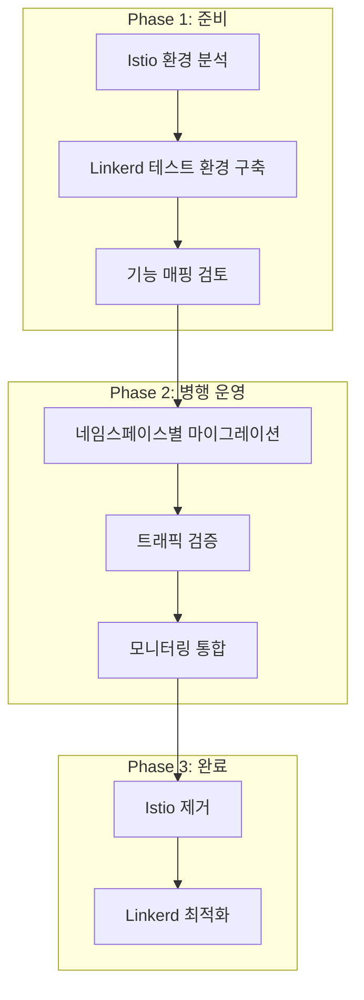

# Linkerd 모범 사례

> **지원 버전**: Linkerd 2.16+
> **마지막 업데이트**: 2025년 2월 21일

## 개요

이 문서에서는 Linkerd를 프로덕션 환경에서 안정적으로 운영하기 위한 모범 사례를 다룹니다. 프로덕션 준비 체크리스트, 리소스 할당, 고가용성 구성, 업그레이드 전략, 성능 튜닝, 문제 해결 가이드를 포함합니다.

## 프로덕션 준비 체크리스트

### 필수 항목

```yaml
# 프로덕션 배포 전 확인 사항
체크리스트:
  인프라:
    - [ ] HA 구성 적용 (컨트롤 플레인 복제본 3개)
    - [ ] PodDisruptionBudget 설정
    - [ ] 노드 안티-어피니티 구성
    - [ ] 적절한 리소스 할당

  보안:
    - [ ] Trust Anchor 유효 기간 확인 (최소 1년 권장)
    - [ ] Identity Issuer 유효 기간 확인
    - [ ] 인증서 자동 갱신 설정
    - [ ] default-deny 정책 검토

  관찰성:
    - [ ] Prometheus 메트릭 수집 구성
    - [ ] Grafana 대시보드 설정
    - [ ] 알림 규칙 구성
    - [ ] 로그 수집 설정

  운영:
    - [ ] 백업 및 복구 절차 문서화
    - [ ] 업그레이드 절차 문서화
    - [ ] 롤백 절차 테스트
    - [ ] 팀 교육 완료
```

### 확인 명령어

```bash
# 전체 상태 확인
linkerd check

# 프록시 상태 확인
linkerd check --proxy

# 인증서 만료 확인
linkerd check --proxy 2>&1 | grep -A5 "certificate"

# 컨트롤 플레인 상태
kubectl get pods -n linkerd
```

## 리소스 할당 권장사항

### 컨트롤 플레인

```yaml
# HA 프로덕션 설정
# ha-values.yaml

# Destination Controller
destination:
  replicas: 3
  resources:
    cpu:
      request: 100m
      limit: 1000m
    memory:
      request: 50Mi
      limit: 250Mi

# Identity Controller
identity:
  replicas: 3
  resources:
    cpu:
      request: 100m
      limit: 1000m
    memory:
      request: 10Mi
      limit: 250Mi

# Proxy Injector
proxyInjector:
  replicas: 3
  resources:
    cpu:
      request: 100m
      limit: 1000m
    memory:
      request: 50Mi
      limit: 250Mi
```

### 데이터 플레인 (프록시)

```yaml
# 워크로드 유형별 프록시 리소스 권장

# 일반 워크로드
proxy:
  resources:
    cpu:
      request: 100m
      limit: 1000m
    memory:
      request: 64Mi
      limit: 250Mi

# 고트래픽 워크로드 (1000+ RPS)
proxy:
  resources:
    cpu:
      request: 500m
      limit: 2000m
    memory:
      request: 128Mi
      limit: 500Mi

# 저트래픽 워크로드 (배치 작업 등)
proxy:
  resources:
    cpu:
      request: 50m
      limit: 500m
    memory:
      request: 32Mi
      limit: 128Mi
```

### Pod별 리소스 오버라이드

```yaml
apiVersion: apps/v1
kind: Deployment
metadata:
  name: high-traffic-service
spec:
  template:
    metadata:
      annotations:
        # CPU 설정
        config.linkerd.io/proxy-cpu-request: "500m"
        config.linkerd.io/proxy-cpu-limit: "2000m"
        # 메모리 설정
        config.linkerd.io/proxy-memory-request: "128Mi"
        config.linkerd.io/proxy-memory-limit: "500Mi"
```

## 고가용성 (HA) 구성

### 컨트롤 플레인 HA

```yaml
# ha-control-plane.yaml
enablePodAntiAffinity: true
controllerReplicas: 3

# Pod 안티-어피니티
podAntiAffinity:
  requiredDuringSchedulingIgnoredDuringExecution:
  - labelSelector:
      matchExpressions:
      - key: linkerd.io/control-plane-component
        operator: In
        values:
        - destination
        - identity
        - proxy-injector
    topologyKey: kubernetes.io/hostname

# 토폴로지 분산
topologySpreadConstraints:
  - maxSkew: 1
    topologyKey: topology.kubernetes.io/zone
    whenUnsatisfiable: DoNotSchedule
    labelSelector:
      matchLabels:
        linkerd.io/control-plane-ns: linkerd

# PDB
podDisruptionBudget:
  maxUnavailable: 1
```

### Viz 확장 HA

```yaml
# viz-ha-values.yaml
prometheus:
  replicas: 2
  resources:
    cpu:
      request: 300m
      limit: 1000m
    memory:
      request: 300Mi
      limit: 1Gi
  persistence:
    enabled: true
    size: 50Gi

tap:
  replicas: 2
  resources:
    cpu:
      request: 100m
      limit: 500m
    memory:
      request: 50Mi
      limit: 250Mi

metricsAPI:
  replicas: 2
```

## 업그레이드 전략

### Stable 채널 업그레이드

```bash
# 1. 사전 준비
# 현재 버전 확인
linkerd version

# 업그레이드 가능 여부 확인
linkerd check --pre

# 2. CLI 업그레이드
curl --proto '=https' --tlsv1.2 -sSfL https://run.linkerd.io/install | sh

# 3. CRD 업그레이드 (먼저 수행)
linkerd upgrade --crds | kubectl apply -f -

# 4. 컨트롤 플레인 업그레이드
linkerd upgrade | kubectl apply -f -

# 5. 확인
linkerd check

# 6. Viz 업그레이드
linkerd viz upgrade | kubectl apply -f -
linkerd viz check

# 7. 데이터 플레인 업그레이드 (롤링 재시작)
# 중요: 한 번에 모든 서비스를 재시작하지 말 것
for ns in production staging; do
  for deploy in $(kubectl get deploy -n $ns -o name); do
    kubectl rollout restart $deploy -n $ns
    kubectl rollout status $deploy -n $ns
    sleep 30  # 안정화 대기
  done
done
```

### Helm 업그레이드

```bash
# 1. Helm 저장소 업데이트
helm repo update

# 2. 현재 values 백업
helm get values linkerd-control-plane -n linkerd > current-values.yaml

# 3. CRD 업그레이드
helm upgrade linkerd-crds linkerd/linkerd-crds -n linkerd --wait

# 4. 컨트롤 플레인 업그레이드
helm upgrade linkerd-control-plane linkerd/linkerd-control-plane \
  -n linkerd \
  -f current-values.yaml \
  --wait

# 5. Viz 업그레이드
helm upgrade linkerd-viz linkerd/linkerd-viz -n linkerd-viz --wait
```

### 블루-그린 업그레이드 (고급)

```bash
# 새 컨트롤 플레인 네임스페이스로 설치
linkerd install --linkerd-namespace linkerd-new | kubectl apply -f -

# 새 컨트롤 플레인 확인
linkerd --linkerd-namespace linkerd-new check

# 점진적으로 워크로드 마이그레이션
kubectl annotate namespace my-app linkerd.io/inject=enabled \
  config.linkerd.io/proxy-version=stable-2.17.0

# 완전 마이그레이션 후 이전 컨트롤 플레인 제거
linkerd --linkerd-namespace linkerd uninstall | kubectl delete -f -
```

### 롤백 절차

```bash
# 문제 발생 시 롤백

# 1. 이전 버전 CLI 설치
curl --proto '=https' --tlsv1.2 -sSfL https://run.linkerd.io/install | \
  sh -s -- --version stable-2.15.0

# 2. 컨트롤 플레인 롤백
linkerd upgrade | kubectl apply -f -

# 3. 데이터 플레인 롤백 (필요시)
kubectl rollout restart deploy -n my-app
```

## 네임스페이스 및 주입 전략

### 네임스페이스 레벨 주입

```yaml
# 권장: 네임스페이스 단위로 주입 관리
apiVersion: v1
kind: Namespace
metadata:
  name: production
  annotations:
    linkerd.io/inject: enabled

---
# 특정 서비스 제외
apiVersion: v1
kind: Namespace
metadata:
  name: legacy-services
  annotations:
    linkerd.io/inject: disabled
```

### Pod 레벨 주입 제어

```yaml
# 특정 Pod 주입 비활성화
apiVersion: apps/v1
kind: Deployment
metadata:
  name: legacy-app
spec:
  template:
    metadata:
      annotations:
        linkerd.io/inject: disabled

---
# 특정 포트 제외
apiVersion: apps/v1
kind: Deployment
metadata:
  name: database
spec:
  template:
    metadata:
      annotations:
        # 데이터베이스 포트는 프록시 우회
        config.linkerd.io/skip-inbound-ports: "5432"
        config.linkerd.io/skip-outbound-ports: "5432"
```

### Opaque 포트 설정

```yaml
# 프로토콜 감지를 우회할 포트 지정
apiVersion: apps/v1
kind: Deployment
metadata:
  name: mysql
spec:
  template:
    metadata:
      annotations:
        # MySQL은 opaque로 처리
        config.linkerd.io/opaque-ports: "3306"
```

## 성능 튜닝

### 프록시 동시성 설정

```yaml
# 고트래픽 환경에서 프록시 성능 최적화
apiVersion: apps/v1
kind: Deployment
metadata:
  name: high-concurrency-service
spec:
  template:
    metadata:
      annotations:
        # 프록시 워커 스레드 수 (기본: 코어 수)
        config.linkerd.io/proxy-cpu-limit: "4"
```

### 연결 풀링

```yaml
# 커넥션 관리 최적화
# Linkerd는 자동으로 HTTP/2 멀티플렉싱 사용
# 대부분의 경우 추가 설정 불필요

# HTTP/1.1 서비스의 경우
apiVersion: linkerd.io/v1alpha2
kind: ServiceProfile
metadata:
  name: http1-service.my-app.svc.cluster.local
spec:
  routes:
  - name: all
    condition:
      pathRegex: /.*
    timeout: 30s
```

### 지연 시간 최적화

```yaml
# 지연 시간에 민감한 서비스
apiVersion: apps/v1
kind: Deployment
metadata:
  name: latency-sensitive
spec:
  template:
    metadata:
      annotations:
        # 디버그 로깅 비활성화 (성능 향상)
        config.linkerd.io/proxy-log-level: "warn"
        # 불필요한 포트 스킵
        config.linkerd.io/skip-outbound-ports: "6379,11211"
```

## 인증서 로테이션 스케줄링

### 자동 모니터링 설정

```yaml
# CronJob으로 인증서 만료 모니터링
apiVersion: batch/v1
kind: CronJob
metadata:
  name: linkerd-cert-check
  namespace: linkerd
spec:
  schedule: "0 9 * * *"  # 매일 오전 9시
  jobTemplate:
    spec:
      template:
        spec:
          containers:
          - name: cert-check
            image: buoyantio/linkerd-cli:stable-2.16.0
            command:
            - /bin/sh
            - -c
            - |
              linkerd check --proxy 2>&1 | grep -i "certificate\|valid"
              # 알림 전송 로직 추가
          restartPolicy: OnFailure
```

### cert-manager 자동 갱신

```yaml
# cert-manager로 자동 갱신 설정
apiVersion: cert-manager.io/v1
kind: Certificate
metadata:
  name: linkerd-identity-issuer
  namespace: linkerd
spec:
  secretName: linkerd-identity-issuer
  duration: 8760h      # 1년
  renewBefore: 720h    # 30일 전 갱신
  issuerRef:
    name: linkerd-trust-anchor
    kind: Issuer
  commonName: identity.linkerd.cluster.local
  isCA: true
  privateKey:
    algorithm: ECDSA
    size: 256
```

## 문제 해결 가이드

### 일반적인 문제와 해결 방법

#### 프록시 주입 실패

```bash
# 증상: Pod에 linkerd-proxy 컨테이너가 없음

# 진단
kubectl get ns my-app -o yaml | grep linkerd
kubectl describe pod my-pod -n my-app | grep -A5 "Annotations"

# 해결
# 1. 네임스페이스 어노테이션 확인
kubectl annotate ns my-app linkerd.io/inject=enabled --overwrite

# 2. Webhook 상태 확인
kubectl get mutatingwebhookconfiguration linkerd-proxy-injector-webhook-config

# 3. Proxy Injector 로그 확인
kubectl logs -n linkerd deploy/linkerd-proxy-injector
```

#### 높은 지연 시간

```bash
# 증상: 메시 통과 시 지연 시간 증가

# 진단
linkerd viz stat deploy -n my-app
linkerd viz tap deploy/my-service -n my-app --max-rps 100

# 해결
# 1. 프록시 리소스 확인
kubectl top pods -n my-app -c linkerd-proxy

# 2. 리소스 증가
kubectl patch deploy my-service -n my-app -p '
{
  "spec": {
    "template": {
      "metadata": {
        "annotations": {
          "config.linkerd.io/proxy-cpu-request": "500m",
          "config.linkerd.io/proxy-memory-request": "128Mi"
        }
      }
    }
  }
}'

# 3. ServiceProfile 타임아웃 조정
```

#### mTLS 연결 실패

```bash
# 증상: 서비스 간 통신 오류

# 진단
linkerd viz tap deploy/client -n my-app --to deploy/server
linkerd viz edges deploy -n my-app

# 해결
# 1. 인증서 상태 확인
linkerd check --proxy

# 2. Identity 컨트롤러 로그 확인
kubectl logs -n linkerd deploy/linkerd-identity

# 3. 프록시 인증서 확인
kubectl exec -n my-app deploy/my-service -c linkerd-proxy -- \
  cat /var/run/linkerd/identity/end-entity.crt | \
  openssl x509 -noout -dates
```

#### 컨트롤 플레인 불안정

```bash
# 증상: linkerd check 실패

# 진단
kubectl get pods -n linkerd
kubectl describe pods -n linkerd
kubectl get events -n linkerd --sort-by='.lastTimestamp'

# 해결
# 1. 리소스 부족 확인
kubectl top pods -n linkerd

# 2. 컨트롤 플레인 재시작
kubectl rollout restart deploy -n linkerd

# 3. 상태 재확인
linkerd check
```

### 디버깅 명령어 모음

```bash
# 전체 상태 확인
linkerd check
linkerd check --proxy

# 메트릭 확인
linkerd viz stat deploy -n my-app
linkerd viz routes deploy/my-service -n my-app

# 실시간 트래픽
linkerd viz tap deploy/my-service -n my-app
linkerd viz top deploy/my-service -n my-app

# 연결 상태
linkerd viz edges deploy -n my-app

# 프록시 로그
kubectl logs deploy/my-service -n my-app -c linkerd-proxy

# 컨트롤 플레인 로그
kubectl logs -n linkerd deploy/linkerd-destination
kubectl logs -n linkerd deploy/linkerd-identity
kubectl logs -n linkerd deploy/linkerd-proxy-injector

# 진단 메트릭
linkerd diagnostics proxy-metrics deploy/my-service -n my-app
```

## Istio에서 마이그레이션

### 마이그레이션 전략



### 기능 매핑

| Istio | Linkerd |
|-------|---------|
| VirtualService | ServiceProfile, HTTPRoute |
| DestinationRule | ServiceProfile |
| PeerAuthentication | 자동 mTLS (기본값) |
| AuthorizationPolicy | ServerAuthorization |
| Sidecar | 어노테이션 기반 설정 |
| Gateway | 별도 Ingress 필요 |

### 마이그레이션 단계

```bash
# 1. 네임스페이스에서 Istio 비활성화
kubectl label namespace my-app istio-injection-

# 2. Linkerd 주입 활성화
kubectl annotate namespace my-app linkerd.io/inject=enabled

# 3. 워크로드 재시작
kubectl rollout restart deploy -n my-app

# 4. 트래픽 검증
linkerd viz stat deploy -n my-app
linkerd viz tap deploy/my-service -n my-app
```

## 체크리스트 요약

```yaml
프로덕션 배포 최종 체크리스트:

  설치:
    - [ ] 동일한 Trust Anchor로 모든 클러스터 구성
    - [ ] HA 모드로 컨트롤 플레인 설치
    - [ ] Viz 확장 설치 및 구성

  보안:
    - [ ] 인증서 유효 기간 60일 이상
    - [ ] default-deny 정책 검토
    - [ ] ServerAuthorization 규칙 정의

  관찰성:
    - [ ] Prometheus 스크레이핑 구성
    - [ ] Grafana 대시보드 설정
    - [ ] 알림 규칙 활성화

  운영:
    - [ ] ServiceProfile 정의 (주요 서비스)
    - [ ] 프록시 리소스 튜닝
    - [ ] 업그레이드 절차 문서화
    - [ ] 롤백 절차 테스트
```

## 참고 자료

- [Linkerd Production Guide](https://linkerd.io/2/tasks/installing-multicluster/)
- [HA Configuration](https://linkerd.io/2/features/ha/)
- [Upgrading Linkerd](https://linkerd.io/2/tasks/upgrade/)
- [Troubleshooting](https://linkerd.io/2/tasks/troubleshooting/)
