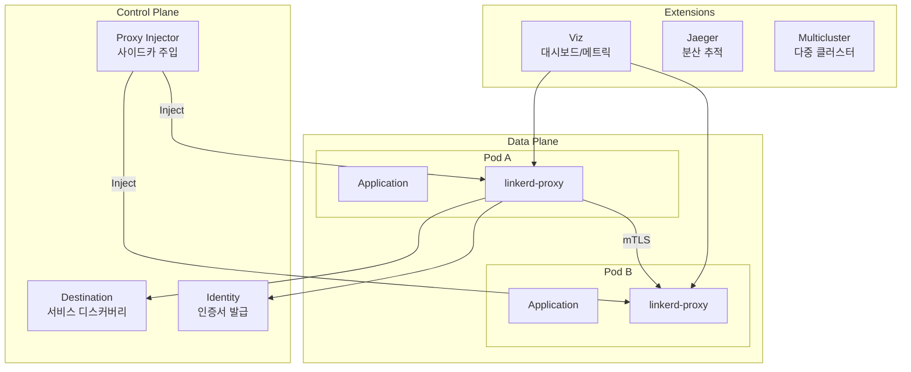

# Linkerd 서비스 메시

> **지원 버전**: Linkerd 2.16+
> **마지막 업데이트**: 2026년 2월 22일

## 개요

Linkerd는 CNCF(Cloud Native Computing Foundation) 졸업 프로젝트로, 경량화된 서비스 메시 솔루션입니다. 2016년 Buoyant에서 처음 개발되어 "서비스 메시"라는 용어를 최초로 정의한 프로젝트이기도 합니다. Linkerd는 단순성, 보안, 그리고 최소한의 리소스 오버헤드를 핵심 가치로 삼아, Kubernetes 환경에서 서비스 간 통신을 안전하고 신뢰성 있게 만들어줍니다.

### 핵심 가치

| 가치 | 설명 |
|------|------|
| **단순성** | 복잡한 설정 없이 즉시 사용 가능한 합리적인 기본값 제공 |
| **기본 보안** | 설정 없이 자동으로 mTLS 암호화 적용 |
| **경량화** | Rust로 작성된 마이크로 프록시로 최소 리소스 사용 (~10MB 메모리) |
| **빠른 성능** | 1ms 미만의 p99 지연 시간 추가 |
| **운영 용이성** | 간단한 업그레이드 및 디버깅 도구 제공 |

## Linkerd 아키텍처 개요



## 서비스 메시 비교

Linkerd, Istio, Cilium Service Mesh를 비교하여 각 솔루션의 특성을 이해합니다.

| 특성 | Linkerd | Istio | Cilium Service Mesh |
|------|---------|-------|---------------------|
| **프록시** | linkerd2-proxy (Rust) | Envoy (C++) | eBPF + Envoy (선택적) |
| **리소스 사용량** | 매우 낮음 (~10MB) | 높음 (~50-100MB) | 낮음 (eBPF 모드) |
| **지연 시간 추가** | <1ms p99 | 2-5ms p99 | <1ms (eBPF 모드) |
| **복잡성** | 낮음 | 높음 | 중간 |
| **mTLS** | 자동 (기본값) | 설정 필요 | 설정 필요 |
| **트래픽 관리** | 기본적 (SMI) | 매우 풍부 | 기본적 |
| **관찰성** | 좋음 (기본 내장) | 매우 좋음 | 좋음 (Hubble) |
| **다중 클러스터** | 서비스 미러링 | 복잡한 설정 | ClusterMesh |
| **CNI 통합** | 별도 | 별도 | 네이티브 |
| **CNCF 상태** | 졸업 | 졸업 | 졸업 |
| **학습 곡선** | 완만함 | 가파름 | 중간 |
| **커뮤니티** | 활발함 | 매우 활발함 | 활발함 |

## Linkerd를 선택해야 할 때

### 적합한 사용 사례

1. **단순함이 중요할 때**
   - 복잡한 트래픽 관리 기능보다 기본적인 서비스 메시 기능이 필요한 경우
   - 운영팀 규모가 작거나 서비스 메시 경험이 적은 경우
   - 빠른 도입과 낮은 학습 곡선이 중요한 경우

2. **리소스 효율성이 중요할 때**
   - 노드당 많은 Pod를 실행하는 환경
   - 사이드카 오버헤드를 최소화해야 하는 경우
   - 지연 시간에 민감한 애플리케이션

3. **보안이 기본값이어야 할 때**
   - 설정 없이 자동 mTLS가 필요한 경우
   - 제로 트러스트 네트워크 구현
   - 규정 준수를 위한 암호화 요구사항

4. **운영 간소화가 필요할 때**
   - 단순한 업그레이드 프로세스 선호
   - 최소한의 CRD 및 설정
   - 직관적인 CLI 도구

### 부적합한 사용 사례

1. **고급 트래픽 관리 필요**
   - 복잡한 라우팅 규칙, 헤더 조작
   - 고급 로드 밸런싱 알고리즘
   - 광범위한 프로토콜 지원 (gRPC 외)

2. **VM 워크로드 통합**
   - Kubernetes 외부 워크로드와의 통합
   - VM과 컨테이너 혼합 환경

3. **대규모 다중 프로토콜 환경**
   - Kafka, MongoDB 등 다양한 프로토콜 지원 필요
   - 복잡한 Wasm 확장 필요

## 문서 구성

이 섹션은 Linkerd의 주요 기능과 운영 방법을 다음과 같이 구성합니다:

| 문서 | 설명 |
|------|------|
| [설치 및 설정](./01-installation.md) | CLI 설치, 컨트롤 플레인 설치, HA 구성, 확장 기능 설치 |
| [아키텍처](./02-architecture.md) | 컨트롤 플레인, 데이터 플레인, 인증서 체계 상세 설명 |
| [트래픽 관리](./03-traffic-management.md) | ServiceProfile, TrafficSplit, 재시도, 타임아웃, 카나리 배포 |
| [보안](./04-security.md) | mTLS, 인증 정책, 인증서 관리, 외부 CA 통합 |
| [관찰성](./05-observability.md) | 메트릭, 대시보드, CLI 도구, Prometheus/Grafana 통합, 분산 추적 |
| [다중 클러스터](./06-multi-cluster.md) | 서비스 미러링, 클러스터 연결, 페일오버 |
| [모범 사례](./07-best-practices.md) | 프로덕션 체크리스트, 성능 튜닝, 문제 해결 |

## 빠른 시작

### 1. Linkerd CLI 설치

```bash
# Linux/macOS
curl --proto '=https' --tlsv1.2 -sSfL https://run.linkerd.io/install | sh
export PATH=$HOME/.linkerd2/bin:$PATH

# 설치 확인
linkerd version
```

### 2. 클러스터 사전 검증

```bash
# 클러스터가 Linkerd 요구사항을 충족하는지 확인
linkerd check --pre
```

### 3. Linkerd 설치

```bash
# CRD 설치
linkerd install --crds | kubectl apply -f -

# 컨트롤 플레인 설치
linkerd install | kubectl apply -f -

# 설치 확인
linkerd check
```

### 4. 애플리케이션 메시에 추가

```bash
# 네임스페이스에 자동 주입 활성화
kubectl annotate namespace my-app linkerd.io/inject=enabled

# 기존 Deployment 재시작하여 프록시 주입
kubectl rollout restart deployment -n my-app

# 또는 수동으로 주입
kubectl get deploy -n my-app -o yaml | linkerd inject - | kubectl apply -f -
```

### 5. 대시보드 설치 및 접근

```bash
# Viz 확장 설치
linkerd viz install | kubectl apply -f -

# 대시보드 열기
linkerd viz dashboard
```

## Linkerd 컴포넌트 상태 확인

```bash
# 전체 상태 확인
linkerd check

# 컨트롤 플레인 상태
linkerd check --proxy

# 데이터 플레인 프록시 상태
linkerd viz stat deploy -n my-app

# 실시간 트래픽 모니터링
linkerd viz tap deploy/my-app -n my-app
```

## 핵심 개념

### 데이터 플레인 프록시

Linkerd는 각 Pod에 `linkerd-proxy`라는 사이드카 컨테이너를 주입합니다. 이 프록시는:

- Rust로 작성되어 메모리 안전성과 높은 성능 제공
- 약 10MB의 메모리만 사용
- 1ms 미만의 지연 시간 추가
- 모든 인바운드/아웃바운드 트래픽 처리
- 자동으로 mTLS 암호화 적용

### 서비스 디스커버리

Destination 컴포넌트가 Kubernetes 서비스를 모니터링하고 프록시에 엔드포인트 정보를 제공합니다:

- 실시간 엔드포인트 업데이트
- ServiceProfile 기반 라우팅 정보
- 트래픽 분할 정책 전달

### 자동 mTLS

Linkerd는 설정 없이 모든 메시 트래픽을 자동으로 암호화합니다:

1. Identity 컴포넌트가 각 프록시에 인증서 발급
2. 프록시 간 통신 시 상호 TLS 인증
3. 인증서 자동 갱신 (24시간 기본값)

## 다음 단계

1. **[설치 및 설정](./01-installation.md)**: Linkerd를 클러스터에 설치하는 자세한 방법
2. **[아키텍처](./02-architecture.md)**: Linkerd 내부 구조 이해하기
3. **[퀴즈](/ko/quizzes/service-mesh/linkerd/)**: 학습 내용 확인하기

## 참고 자료

- [Linkerd 공식 문서](https://linkerd.io/2/overview/)
- [Linkerd GitHub](https://github.com/linkerd/linkerd2)
- [CNCF Linkerd 프로젝트 페이지](https://www.cncf.io/projects/linkerd/)
- [Linkerd Slack 커뮤니티](https://slack.linkerd.io/)
- [Buoyant 블로그](https://buoyant.io/blog)
