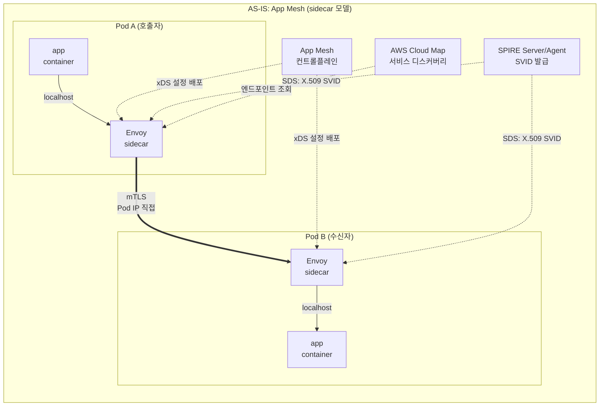
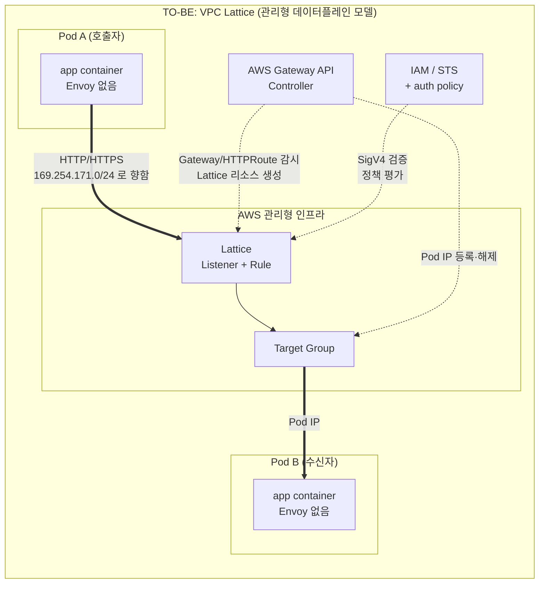

# App Mesh와 VPC Lattice 아키텍처 대비

> **범위**: VPC Lattice service/resource API와 AWS Gateway API Controller. 선택한 release와 설치 CRD를 확인합니다.
> **마지막 업데이트**: 2026년 9월 13일

## 이 문서에서 다루는 것

- sidecar 모델과 관리형 데이터플레인 모델이 각각 어떤 문제를 풀려고 그렇게 설계되었는가
- App Mesh 리소스가 Lattice 리소스로 어떻게 매핑되는가, 그리고 왜 이 매핑이 1:1이 아닌가
- 1:1이 아닌 지점에서 파생되는 기능 GAP과, AWS Gateway API Controller가 그 사이에서 하는 일

## 왜 두 모델이 다르게 설계되었는가

### sidecar 모델 — 애플리케이션 곁에 프록시를 둔다

App Mesh와 Istio가 Pod 안에 Envoy를 넣는 이유는 **애플리케이션의 컨텍스트를 알아야 하는 결정이 있기 때문**입니다.

호출 측 프록시는 연결 풀과 upstream 실패 상태를 유지하고 설정된 재시도를 적용할 수 있습니다. 구체적인 제어는 제품과 API에 달려 있으며 Envoy 기능이 곧 App Mesh 기능인 것은 아닙니다. 관리형 서비스도 상태를 유지할 수 있으므로 프록시 위치만으로 기능의 불가능성을 증명할 수 없습니다.

고객은 주입된 Envoy 워크로드와 별도로 배포한 SPIRE를 운영합니다. **App Mesh 제어 평면은 AWS가 운영합니다.** 프록시 업그레이드와 자원 사용은 고객 워크로드의 운영 과제이지만 App Mesh 제어 평면까지 자체 운영한다고 설명하면 안 됩니다.

### 관리형 데이터플레인 모델 — 프록시를 인프라로 밀어낸다

Lattice는 반대 방향을 택했습니다. 프록시를 Pod에서 빼내고 **AWS가 운영하는 인프라 계층**에 둡니다. 클라이언트 Pod는 아무것도 모른 채 평범한 HTTP 요청을 보내고, 그 요청이 Lattice 서비스의 주소로 향하면 인프라가 가로채서 처리합니다.

이 설계가 사는 문제는 규모와 이질성입니다. 사이드카를 쓰지 않으므로 Pod 수만큼 프록시가 늘지 않고, EKS·ECS·EC2·Lambda가 **같은 방식으로** 서비스 네트워크에 참여할 수 있습니다. Lambda 함수 안에 Envoy를 넣을 수는 없지만, 인프라 계층의 프록시라면 Lambda도 대상이 됩니다. VPC와 계정 경계, 심지어 IP 대역 중복까지 인프라가 흡수합니다.

Envoy를 제거하면 복원력과 관측 기능의 구현 위치가 달라집니다. **현재 App Mesh와 Lattice API가 제공하는 기능**을 비교한 뒤 애플리케이션이나 다른 프록시로 옮길 제어를 구분합니다. 개념 구성도로 AWS 내부 상태 위치나 영구적인 기능 제약을 추론하지 않습니다.

## AS-IS / TO-BE 아키텍처

두 그림에서 눈에 띄는 차이는 세 가지입니다.

1. **프록시 통과 횟수**: AS-IS는 호출자 Envoy와 수신자 Envoy를 **두 번** 지납니다. TO-BE는 Lattice를 **한 번** 지납니다.
2. **컨트롤플레인의 소유자**: AS-IS는 App Mesh 컨트롤플레인이 xDS로 각 Envoy에 설정을 밀어넣고, SPIRE가 인증서를 발급합니다. TO-BE에서 이 역할은 AWS 관리 영역으로 들어가고, 고객 클러스터에는 Gateway API Controller Deployment 하나만 남습니다.
3. **연결의 종점**: AS-IS는 호출자 Envoy가 수신자 **Pod IP로 직접** 연결합니다. TO-BE는 Lattice 주소로 연결하고, Pod IP를 아는 것은 Lattice입니다.

## 리소스 매핑

| App Mesh | VPC Lattice | 대응 관계 |
|---|---|---|
| **Mesh** | **Service Network** | 둘 다 논리적 경계입니다. App Mesh mesh는 Kubernetes 전용이 아니며, Lattice service network는 서비스와 VPC를 연결하고 별도로 resource connectivity를 제공합니다. |
| **VirtualService** | **Lattice Service** | 논리적 서비스 이름. Lattice Service는 자체 DNS 이름을 부여받음 |
| **VirtualRouter** + **Route** | **Listener** + **Listener Rule** | VirtualRouter의 프로토콜별 라우팅 역할이 Listener로, Route의 match/action이 Listener Rule로 나뉘어 흡수됨 |
| **VirtualNode** | **Target Group** | VirtualNode는 "이 워크로드의 정체 + 백엔드 설정 + 리스너 설정"을 한 리소스에 담았지만, Target Group은 **백엔드 대상 집합**만 표현 |
| **AWS Cloud Map** | **불필요** | Lattice가 서비스 디스커버리를 내장. Cloud Map namespace/service 관리가 사라짐 |
| **Envoy sidecar** | **제거** | Pod에서 사라짐. 데이터플레인이 AWS 인프라로 이동 |
| **VirtualGateway** | **Lattice Service + Listener** (또는 ALB/NLB) | 남북(North-South) 트래픽은 Gateway API Controller의 범위 밖. AWS Load Balancer Controller 영역 |

### 이 표를 1:1 대응표로 읽으면 안 되는 이유

**VirtualNode 행이 문제입니다.** App Mesh의 VirtualNode는 세 가지를 동시에 표현했습니다 — 이 워크로드가 누구인지(신원, backend TLS 설정 포함), 어디로 나가는지(backends), 어디서 받는지(listeners, health check, connection pool, outlier detection). Lattice에서 이 셋은 서로 다른 곳으로 흩어집니다.

- **"어디서 받는지"의 일부**(대상 집합, health check)만 Target Group으로 갑니다
- **"어디로 나가는지"**는 리소스가 아니라 **auth policy와 IAM 권한**의 문제가 됩니다
- **"누구인지"**는 SVID가 아니라 **IAM Role**이 됩니다 ([05번 문서](./05-spiffe-to-iam.md))
- **connection pool과 outlier detection**은 **대응되는 리소스가 없습니다**

즉 매핑표에서 오른쪽 칸이 채워져 있어도, 왼쪽 리소스가 갖고 있던 속성 전부가 옮겨가는 것은 아닙니다. **표는 리소스 이름의 대응이고, 기능의 대응이 아닙니다.**

## 기능 GAP

다음은 **마이그레이션 점검 항목**이며 관리형 데이터 평면이 영원히 구현할 수 없는 기능의 증명이 아닙니다. App Mesh, Istio, Envoy의 설정 범위는 다르므로 실제 사용 중인 원본 기능을 먼저 확인합니다.

| 기능 | 전환 점검 |
|---|---|
| 연결 제한·재시도·outlier 처리 | 실제 원본 제품이 노출하는 제어를 조사합니다. Lattice health check는 Envoy의 모든 클라이언트 정책을 대체하지 않으므로 앱 복원력과 retry budget을 검증합니다. |
| 장애 주입·트래픽 미러링 | Envoy/Istio의 모든 기능을 App Mesh 기능으로 표시하지 않습니다. 필요하면 별도로 검토한 시험·미러링 경로를 설계합니다. |
| Health check | Target group health check는 대상을 능동적으로 검사하며 요청 기반 수동 outlier detection과 다릅니다. |
| 클라이언트 인증서 신원 | HTTPS 서비스 listener와 TLS passthrough의 endpoint mTLS는 신뢰 경계가 다릅니다. [네트워킹](./04-networking-basics.md)을 확인합니다. |
| 지표·추적 | 애플리케이션 OpenTelemetry span을 유지합니다. Lattice access log와 CloudWatch 지표는 요청·대상 시간 및 상관관계를 제공하지만 네이티브 Lattice trace span은 만들지 않습니다. |

### GAP을 읽는 실무적 관점

중요한 전환 과제는 **관측성**입니다. 기존 각 구성요소의 지표·access log·trace context를 조사하고 대체 경로를 끝까지 검증합니다.

기능 GAP 중 circuit breaker나 retry는 "애플리케이션에 라이브러리를 넣는다"는 명확한 대안이 있고, 비용도 산정 가능합니다. 반면 관측성은 대안이 명확해 보이지만 실제로는 성격이 다른 작업입니다. AS-IS에서 Envoy가 자동으로 만들어주던 span은 **애플리케이션 코드를 건드리지 않고** 얻은 것이었습니다. TO-BE에서 같은 수준의 추적을 얻으려면 모든 서비스에 OpenTelemetry 계측을 넣어야 하고, 이것은 애플리케이션 팀의 작업 항목이 됩니다.

클라이언트 span은 일반적으로 downstream 서버 span을 포함하므로 호출 span 종료와 수신 span 시작의 차이를 네트워크 지연으로 해석하면 안 됩니다. 앱 span과 Lattice log의 `requestId`, `duration`, `requestToTargetDuration`·`responseFromTargetDuration` 등을 연결하되 시계 오차·계측 경계·네트워크 시간이 원인 분리를 제한합니다. Lattice의 `x-amzn-requestid`는 HTTP 상관관계용이며 OpenTelemetry span 자체가 아닙니다.

## AWS Gateway API Controller의 역할

Lattice 리소스를 CLI나 콘솔로 직접 만들 수도 있지만, EKS에서는 보통 **AWS Gateway API Controller**를 씁니다. 이 컨트롤러는 클러스터 안에서 Kubernetes Gateway API 리소스를 감시하고, 그에 대응하는 Lattice 리소스를 만들고 지웁니다.

| Kubernetes 리소스 | 생성되는 Lattice 리소스 |
|---|---|
| `GatewayClass` (`amazon-vpc-lattice`) | — (Lattice를 데이터플레인으로 지정하는 선언) |
| `Gateway` | **Service Network**를 가리킴. Gateway 이름(namespace 제외)이 Service Network 이름과 대응하며, 같은 이름의 Gateway가 여러 개면 모두 같은 Service Network를 가리킴 |
| `HTTPRoute` / `GRPCRoute` | **Lattice Service** + **Listener Rule**. 각 Route가 **자신의 도메인 이름을 부여받음** |
| `TLSRoute` | TLS Passthrough용 Lattice Service ([04번 문서](./04-networking-basics.md) 참고) |
| `backendRefs`가 가리키는 Service | **Target Group** + 그 안의 **Target** |
| `TargetGroupPolicy` | Target Group의 프로토콜·health check 설정 |
| `IAMAuthPolicy` | 부착 대상에 따라 service network auth policy 또는 service auth policy ([03번 문서](./03-auth-flow.md)) |

### 왜 이 컨트롤러가 GAP을 메우는 핵심인가

App Mesh에서 Pod IP를 추적하던 주체는 Cloud Map과 Envoy였습니다. Lattice에서 그 역할을 하는 것이 이 컨트롤러입니다.

컨트롤러는 `backendRefs`가 가리키는 Kubernetes Service의 **엔드포인트 변화**를 감시합니다. Deployment가 스케일 아웃해서 Pod가 늘거나, 롤링 업데이트로 Pod IP가 바뀌면, 컨트롤러가 그 변화를 감지해 Lattice Target Group에 Target을 **등록하고 해제**합니다. 즉 Kubernetes의 선언적 상태와 Lattice의 실제 대상 목록을 계속 맞춰주는 것이 이 컨트롤러의 본업입니다.

여기서 파생되는 두 가지 실무 포인트가 있습니다.

**첫째, 컨트롤러가 멈추면 라우팅 대상이 낡습니다.** 트래픽은 Lattice가 계속 흘려보내지만, 새로 뜬 Pod는 Target으로 등록되지 않고 죽은 Pod는 해제되지 않습니다. 컨트롤러 Deployment의 가용성과 IAM 권한이 데이터 경로의 신뢰성에 직접 연결됩니다.

**둘째, Pod readiness gate를 쓸 수 있습니다.** Lattice Target Group의 health가 `Healthy`가 될 때까지 Pod를 Ready로 표시하지 않게 만들 수 있고, 이렇게 하면 롤링 업데이트가 **새 Pod가 Lattice 관점에서 건강해질 때까지 구 Pod를 종료하지 않습니다.** 전환 기간 중 무중단을 확보하는 데 중요한 장치입니다.

### 컨트롤러 범위의 한계

Gateway API는 원래 남북(North-South, Ingress)과 동서(East-West, Mesh) 트래픽 모두를 다루도록 설계되었지만, **AWS Gateway API Controller는 현재 Lattice를 통한 동서 트래픽에만 집중합니다.** ALB/NLB 형태의 남북 트래픽 기능을 기대하면 안 되고, 그것은 AWS Load Balancer Controller의 영역입니다.

이 점은 ingress-nginx를 함께 쓰는 환경에서 특히 중요합니다. ingress-nginx가 처리하던 남북 트래픽은 이 전환의 대상이 아니며, 동서 트래픽만 Lattice로 옮겨갑니다. 두 경로가 공존하는 구성이 정상이라는 뜻입니다.

## 정리

- 제품 API와 실제 설정 기능을 비교합니다. 프록시 이동은 책임을 바꾸지만 영구적인 기능 불가능성을 증명하지 않습니다.
- 리소스 매핑표는 이름의 대응이며, VirtualNode가 갖고 있던 속성들은 여러 곳으로 흩어지거나 사라집니다.
- 가장 과소평가되는 GAP은 관측성입니다. Envoy가 무료로 주던 span은 애플리케이션 계측 작업으로 바뀝니다.
- AWS Gateway API Controller는 Kubernetes 엔드포인트 변화를 Lattice Target에 반영하는 주체이며, 그 가용성이 데이터 경로의 신뢰성에 연결됩니다.

다음: [레이턴시 영향 분석](./02-latency.md)에서 프록시 통과 횟수가 줄어드는 것과 VPC 경유가 추가되는 것이 어떻게 상충하는지 봅니다.

## 참고 자료

- [Migrating from AWS App Mesh to Amazon VPC Lattice (AWS Containers Blog)](https://aws.amazon.com/blogs/containers/migrating-from-aws-app-mesh-to-amazon-vpc-lattice/)
- [aws-samples/migrating-from-aws-app-mesh-to-amazon-vpc-lattice](https://github.com/aws-samples/migrating-from-aws-app-mesh-to-amazon-vpc-lattice)
- [AWS Gateway API Controller — Understanding the Gateway API Controller](https://www.gateway-api-controller.eks.aws.dev/latest/concepts/overview/)
- [AWS Gateway API Controller — Gateway API Reference](https://www.gateway-api-controller.eks.aws.dev/latest/api-types/gateway/)
- [Amazon VPC Lattice User Guide](https://docs.aws.amazon.com/vpc-lattice/latest/ug/what-is-vpc-lattice.html)
- [App Mesh Document history](https://docs.aws.amazon.com/app-mesh/latest/userguide/doc-history.html)
