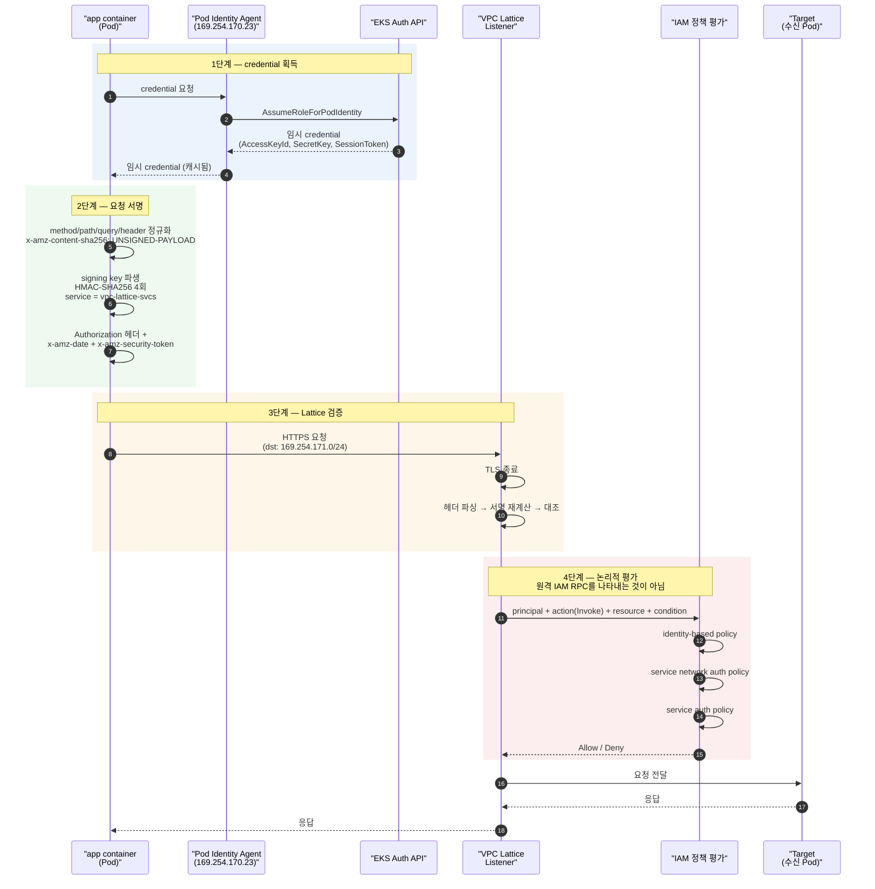
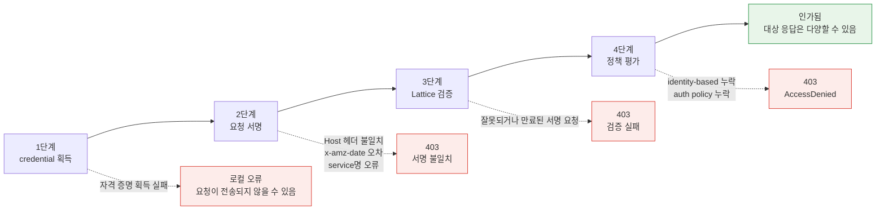

# IAM 인증 절차 상세

> **범위**: VPC Lattice service/resource API와 AWS Gateway API Controller. 선택한 release와 설치 CRD를 확인합니다.
> **마지막 업데이트**: 2026년 9월 13일

## 이 문서에서 다루는 것

- Lattice IAM Auth에서 요청 하나가 통과하기까지의 4단계 — credential 획득, 요청 서명, Lattice 검증, 정책 평가
- 증거로 자격 증명·서명·정책·네트워크 실패를 구분하며 장애 빈도 순위는 주장하지 않음
- connection 단위 상호 인증에서 **요청 단위 서명 검증**으로 바뀌는 것의 의미

## 왜 요청 서명 방식인가

App Mesh의 mTLS는 **connection을 세울 때 한 번** 서로의 인증서를 확인하고, 그 다음부터는 그 연결을 신뢰합니다. 신원이 연결에 묶여 있는 모델입니다.

Lattice는 다른 선택을 했습니다. **요청마다 서명을 붙이고 요청마다 검증**합니다. 왜 그렇게 했는가를 이해하면 뒤의 제약들이 자연스럽게 따라옵니다.

IAM 요청 서명은 AWS compute client가 공유하는 문서화된 신원 방식 중 하나입니다. Lambda도 적절한 secret/rotation 처리로 인증서를 사용할 수 있으므로 client certificate가 불가능하다고 단정하거나 미공개 AWS 설계 결정의 이유로 삼지 않습니다.

즉 Lattice는 "AWS 안의 모든 컴퓨팅이 이미 갖고 있는 신원 체계"를 재사용하기로 한 것이고, 그 체계는 연결 단위가 아니라 **API 요청 단위**로 동작합니다. 이 선택에서 파생되는 것이 이 문서의 나머지 내용입니다.

## 인증 4단계 시퀀스



403이 발생할 수 있는 지점을 단계별로 표시하면 이렇습니다.



## 1단계 — credential 획득

SigV4 서명에는 access key, secret key, session token이 필요합니다. Pod가 이것을 얻는 방법은 두 가지입니다.

### EKS Pod Identity와 IRSA 비교

| 항목 | EKS Pod Identity (권장) | IRSA |
|---|---|---|
| **신뢰 관계 설정** | EKS Auth API가 중개. Role의 trust policy에 `pods.eks.amazonaws.com` 서비스 principal | 클러스터별 OIDC provider를 IAM에 등록하고 Role trust policy에 OIDC 조건 작성 |
| **클러스터 추가 시 작업** | Role 재사용 가능 | 클러스터마다 OIDC provider 등록 + trust policy 수정 |
| **credential 전달 경로** | Pod Identity Agent (노드의 DaemonSet)가 link-local 주소로 제공 | Projected service account token → SDK가 `AssumeRoleWithWebIdentity` 호출 |
| **연결 방식** | `ServiceAccount` ↔ Role 연결을 EKS API로 관리 | `ServiceAccount` 애노테이션 `eks.amazonaws.com/role-arn` |
| **세션 태그** | Pod/클러스터 컨텍스트를 세션 태그로 전달 가능 → 조건부 인가에 활용 | 제한적 |
| **전제 조건** | Pod Identity Agent 애드온 설치 + 노드 Role에 `AssumeRoleForPodIdentity` 권한 | OIDC provider 연결 |

**Pod Identity를 권장하는 실무적 이유**는 멀티 클러스터입니다. Lattice 전환의 주요 동기 중 하나가 클러스터를 넘는 통신인데, IRSA는 클러스터마다 OIDC provider를 등록하고 Role의 trust policy를 클러스터 수만큼 관리해야 합니다. Pod Identity는 이 부담이 없습니다.

### STS 임시 credential 의존성

두 방식 모두 **최종적으로 STS가 발급한 임시 credential**에 도달합니다. 이것이 이 아키텍처의 중요한 특성입니다.

- credential은 **만료됩니다.** SDK가 캐시하고 만료 전에 갱신하지만, 갱신 경로가 살아 있어야 합니다.
- 설정된 credential provider가 갱신하지 못하면 로컬 서명이 실패할 수 있으며 만료 자격 증명으로 서명한 요청도 거부될 수 있습니다. IRSA는 STS를, Pod Identity는 Agent/EKS Auth 경로를 이용합니다.
- 즉 **STS는 East-West 데이터 경로의 의존성**이 됩니다. AS-IS에서 SPIRE Server가 그 위치에 있었던 것과 대응되지만, 소유자가 고객에서 AWS로 바뀝니다 ([05번](./05-spiffe-to-iam.md), [06번](./06-constraints.md) 문서).

레이턴시 관점의 함의는 [02번 문서](./02-latency.md)에서 다뤘습니다 — 갱신이 요청 경로를 블로킹하면 p99 꼬리에 나타납니다.

## 2단계 — 요청 서명

### canonical request → signing key → Authorization 헤더

SigV4 서명은 세 단계로 진행됩니다.

**먼저 canonical request를 만듭니다.** 메서드·경로·query·서명할 header를 정규화합니다. Lattice는 **`x-amz-content-sha256: UNSIGNED-PAYLOAD`**를 요구하며 payload signing을 지원하지 않습니다. 본문 전송은 HTTPS로 보호하고 필요하면 애플리케이션 무결성 검증을 추가합니다.

**둘째, signing key를 파생합니다.** secret key에서 시작해 날짜 → 리전 → **서비스명** → 종료 문자열 순으로 HMAC-SHA256을 4회 연쇄 적용합니다. Lattice의 서비스명은 **`vpc-lattice-svcs`**입니다.

이 서비스명은 서명 자체의 입력값이므로 **틀리면 서명이 검증되지 않습니다.** `vpc-lattice`(Lattice 제어 평면 API의 서비스명)와 혼동하기 쉬운데, 데이터 평면 요청의 서명에는 `vpc-lattice-svcs`를 써야 합니다. 서비스 DNS 이름 자체가 `<service>-<id>.<hash>.vpc-lattice-svcs.<region>.on.aws` 형태인 것과 일관됩니다.

**셋째, 헤더를 붙입니다.** `Authorization` 헤더에 알고리즘, credential scope, 서명 대상 헤더 목록(`SignedHeaders`), 서명값을 담고, `x-amz-date`에 요청 시각을, 임시 credential을 쓰는 경우 `x-amz-security-token`에 세션 토큰을 담습니다.

### 실무 함정 3개

#### ① Host 헤더가 서명 대상이다 — custom domain 사용 시 주의

SigV4에서 `Host` 헤더는 **항상 서명 대상에 포함**됩니다. 요청이 어느 호스트로 향하는지가 서명에 묶여 있다는 뜻입니다.

문제가 되는 상황은 **custom domain**입니다. Lattice 서비스에 고객 도메인(`api.internal.example.com`)을 붙여 쓰는 경우, 클라이언트는 그 도메인으로 요청을 보내므로 `Host: api.internal.example.com`으로 서명합니다. 그런데 서명 검증 측이 기대하는 Host 값과 다르면 서명이 불일치합니다. 반대로 Lattice가 생성한 도메인으로 서명했는데 실제 요청의 Host가 custom domain이면 역시 불일치입니다.

**핵심 원칙: 서명할 때 쓴 Host 값과 실제 요청의 Host 헤더가 일치해야 합니다.** custom domain을 도입할 때는 서명 로직이 어느 값을 쓰는지 명시적으로 확인해야 하고, 이 문제는 전환 초기 대신 **custom domain을 붙이는 시점에** 터지기 때문에 놓치기 쉽습니다.

#### ② x-amz-date 시각 오차

일반 AWS SigV4 안내는 **대부분의 경우** 요청 timestamp부터 5분 안에 도착해야 한다고 설명합니다. 시계를 동기화하고 실제 만료/skew 오류를 확인하며 이를 별도로 측정한 Lattice 전용 보장으로 표현하지 않습니다.

즉 **노드의 시각 동기화가 인증의 전제 조건**이 됩니다. Amazon Time Sync Service를 쓰는 EC2/EKS 노드에서는 보통 문제되지 않지만, 다음 경우에 문제가 됩니다.

- 노드나 하이브리드 호스트의 시계 동기화가 잘못됨
- 애플리케이션이 잘못된 timestamp 또는 시간대로 서명함
- 호스트 재개 후 시계 오차가 발생함

이 실패는 **간헐적이고 노드 단위로 발생**해서 진단이 까다롭습니다. "특정 노드의 Pod만 403이 난다"면 시각 동기화를 먼저 확인하십시오.

#### ③ 중간 프록시의 헤더 변조 — 서명은 최종 홉에서

서명은 요청 내용에 묶여 있으므로, **서명 이후에 서명 대상을 건드리는 주체가 있으면 검증이 깨집니다.**

실제로 문제를 만드는 것들:

- 서명된 경로나 실제 `Host` 값을 바꾸는 프록시
- Query parameter를 추가·삭제하거나 값·인코딩을 바꾸는 프록시. 동등한 parameter의 단순 순서 변경은 canonical query를 반드시 바꾸지는 않습니다
- 필수 `UNSIGNED-PAYLOAD`를 쓰는 Lattice SigV4는 본문 변조를 탐지하지 않으므로 TLS와 앱 제어로 보호합니다

**원칙: 서명은 Lattice로 나가는 최종 홉에서 해야 합니다.** 서명한 뒤에 요청을 손보는 계층이 사이에 있으면 안 됩니다.

이 원칙은 **egress proxy 방식으로 서명할 때 특히 중요합니다.** aws-samples 레퍼런스 구현이 이 패턴을 보여줍니다 — `sigv4proxy` 사이드카를 8080에서 띄우고, init container가 iptables로 **`169.254.171.0/24`(Lattice 대역)로 향하는 트래픽만** 로컬 8080으로 리다이렉트합니다. 프록시가 서명을 붙인 뒤 곧바로 Lattice로 나가므로 사이에 변조 주체가 없습니다. 프록시가 서명한 요청을 다시 다른 프록시가 처리하는 구성은 피해야 합니다.

## 3단계 — Lattice 검증

Lattice는 HTTPS listener에서 **TLS를 종료한 뒤 헤더를 파싱해** `Authorization` 헤더의 서명을 재계산하고 대조합니다.

여기에 이 아키텍처에서 가장 중요한 제약이 숨어 있습니다.

> **서명 검증은 헤더를 읽을 수 있어야 가능하고, 헤더를 읽으려면 TLS를 종료해야 합니다.**

**TLS Passthrough는 TLS를 종료하지 않으므로 Lattice가 `Authorization` 헤더를 볼 수 없고** 호출자의 SigV4 요청 서명을 인증할 수 없습니다. 이것이 [06번 문서](./06-constraints.md)에서 다루는 제약입니다. 모든 auth policy가 금지되는 것은 아닙니다. TLS listener는 anonymous principal로 제한된 정책을 지원하지만, 이 정책이 인증된 호출자 신원을 제공하지는 않습니다.

Controller 문서는 Gateway·HTTPRoute·GRPCRoute의 정책 연결을 설명합니다. 설치한 CRD의 지원 대상을 확인합니다. **Controller 제약이 모든 VPC Lattice TLS auth policy가 거부된다는 뜻은 아닙니다.**

::: tip 문서로 확인한 TLS 동작
AWS는 **익명 principal** 기반 TLS passthrough auth policy를 허용하지만 인증된 SigV4 신원이나 HTTP header/path를 검사하지 못합니다. TLS listener에는 평문 SNI와 일치하는 custom domain과 TCP target group이 필요하며 ECH/ESNI는 지원하지 않습니다. 이 저장소에서는 wildcard-principal 정책 예제를 권장하지 않습니다. [TLS listener 문서](https://docs.aws.amazon.com/vpc-lattice/latest/ug/tls-listeners.html)를 확인합니다.
:::

인증된 요청 서명과 익명 네트워크 문맥 인가는 다른 제어입니다. Endpoint 인증과 적용할 service-network/service 정책을 명시적으로 설계합니다.

또 하나의 함정: **auth policy는 authType이 `AWS_IAM`일 때만 활성화됩니다.** `NONE`이면 정책을 붙여도 무효입니다. "정책을 넣었는데 아무나 접근된다"의 가장 흔한 원인입니다.

## 4단계 — 정책 평가

인증된 principal은 호출자 권한과 적용되는 Lattice 리소스 정책을 평가합니다. **`AWS_IAM`으로 설정된 리소스만 auth policy를 적용하며 `NONE`은 해당 리소스 정책을 건너뜁니다.** 명시적 Deny와 기타 IAM 제어도 적용됩니다. 세 정책 그림을 익명 요청이나 다른 설정에도 적용되는 보편 규칙으로 해석하면 안 됩니다.

| 정책 | 붙는 곳 | 답하는 질문 | 관리 주체 | Gateway API 리소스 |
|---|---|---|---|---|
| **identity-based policy** | 호출자의 IAM Role | "이 Role이 `vpc-lattice-svcs:Invoke`를 할 권한이 있는가" | 애플리케이션 팀 / 플랫폼 팀 | — (IAM에서 직접) |
| **service network auth policy** | Service Network | "이 서비스 네트워크에 들어올 수 있는 principal인가" (coarse-grained) | 네트워크·클라우드 관리자 | `IAMAuthPolicy` → `Gateway` |
| **service auth policy** | Lattice Service | "이 서비스를 호출할 수 있는 principal인가" (fine-grained) | 서비스 소유 팀 | `IAMAuthPolicy` → `HTTPRoute`/`GRPCRoute` |

**서비스 호출 auth policy**의 action은 `vpc-lattice-svcs:Invoke`입니다. Resource configuration은 별도 접근 모델이며 service-network auth policy를 상속하지 않습니다.

### 사용 가능한 condition key

auth policy에서 조건으로 쓸 수 있는 키입니다. 프로토콜과 요청이 SigV4로 서명되었는지에 따라 평가 시점에 존재하는 키가 달라집니다.

| Condition key | 필터 대상 |
|---|---|
| `vpc-lattice-svcs:Port` | 요청이 향한 서비스 포트 |
| `vpc-lattice-svcs:RequestMethod` | 요청 메서드 |
| `vpc-lattice-svcs:RequestPath` | 요청 URL의 경로 |
| `vpc-lattice-svcs:RequestHeader/<header-name>` | 요청 헤더의 이름-값 쌍 |
| `vpc-lattice-svcs:RequestQueryString/<key-name>` | 요청 URL의 쿼리 문자열 키-값 쌍 |
| `vpc-lattice-svcs:ServiceArn` | 대상 Lattice 서비스의 ARN |
| `vpc-lattice-svcs:ServiceNetworkArn` | 서비스 네트워크의 ARN |
| `vpc-lattice-svcs:SourceVpc` | 요청 출처 VPC |
| `vpc-lattice-svcs:SourceVpcOwnerAccount` | 출처 VPC의 소유 계정 |

여기에 `aws:PrincipalOrgID`, `aws:PrincipalTag/<key>` 같은 IAM 전역 조건 키도 함께 쓸 수 있습니다.

::: warning 확인 필요
위 목록은 [서비스 권한 참조 문서](https://docs.aws.amazon.com/service-authorization/latest/reference/list_vpc-lattice-svcs.html)와 Gateway API Controller 문서의 정책 예시를 근거로 정리했습니다. Lattice는 기능이 추가되는 서비스이므로 **설계 확정 전에 해당 문서에서 최신 목록을 확인**하시기 바랍니다.
:::

경로·메서드·헤더 조건이 있다는 점은 실무적으로 유용합니다. "결제 서비스의 `POST /refund`는 특정 Role만" 같은 규칙을 애플리케이션 코드 밖에서 강제할 수 있습니다. 다만 **경로 기반 인가를 auth policy에 넣으면 API 변경이 정책 변경을 유발**하므로, 어느 계층에서 인가를 표현할지 결정이 필요합니다.

### 403의 전형적 실패 패턴

`vpc-lattice-svcs:Invoke` 권한 누락은 인증된 요청 실패의 **문서화된 원인 중 하나**입니다. 장애 빈도 데이터가 없으므로 가장 흔한 원인으로 순위를 매기지 않습니다.

이것이 흔한 이유는 직관에 반하기 때문입니다. "서비스 쪽 auth policy에서 이 Role을 허용했으니 됐다"고 생각하기 쉬운데, **호출자 Role 자신에게도 Invoke 권한이 필요합니다.** 리소스 정책만으로는 통과하지 못합니다.

레퍼런스 구현에서 확인되는 실제 에러 메시지입니다.

```text
AccessDeniedException: User: arn:aws:sts::111122223333:assumed-role/eksctl-...-Role1-yz1hNJittmXj/1726632845600682009
is not authorized to perform: vpc-lattice-svcs:Invoke
on resource: arn:aws:vpc-lattice:us-west-2:111122223333:service/svc-0b13d4b53748cbdc7/catalogdetail
because no identity-based policy allows the vpc-lattice-svcs:Invoke action
```

마지막 줄 **`because no identity-based policy allows...`**가 진단의 핵심입니다. 메시지가 어느 정책이 부족한지 알려주므로, 403을 만나면 먼저 이 문구를 확인하십시오.

### 403 진단 순서

| 순서 | 확인 항목 | 방법 |
|---|---|---|
| 1 | 에러 메시지의 마지막 절 | `no identity-based policy` → 호출자 Role 권한 / 그 외 → auth policy |
| 2 | Lattice access log와 반환 오류 | Request ID·호출자 log·정책·네트워크 증거를 연결 |
| 3 | 요청이 실제로 서명되었는가 | 미서명 요청과 서명 실패는 다른 문제. egress proxy 로그 확인 |
| 4 | authType이 `AWS_IAM`인가 | `NONE`이면 정책이 무효 |
| 5 | 노드 시각 | 특정 노드에서만 실패하면 `x-amz-date` 오차 |
| 6 | Host 헤더 | custom domain 도입 직후라면 이것부터 |

### 놓치기 쉬운 함정: k8s Service DNS로 직접 보내면 인가가 적용되지 않는다

AWS Gateway API Controller 문서가 명시하는 중요한 제약입니다.

> `IAMAuthPolicy`는 **Gateway, HTTPRoute, GRPCRoute를 통과하는 트래픽에 대해서만** 인가를 수행합니다. 클라이언트가 Kubernetes Service DNS로 직접 트래픽을 보내면 인가가 적용되지 않습니다.

`http://proddetail.prodcatalog-ns.svc.cluster.local` 직접 호출은 **Lattice 데이터 경로를 우회**하므로 해당 auth policy가 요청을 평가하지 않습니다. 이것은 설계 경계이지 실측 장애 빈도 순위가 아닙니다.

전환 기간 중 AS-IS 경로(클러스터 내 직접 호출)와 TO-BE 경로(Lattice 경유)가 공존하면 **인가가 적용되는 경로와 안 되는 경로가 동시에 존재**합니다. NetworkPolicy로 클러스터 내 직접 호출을 차단하는 등의 보완이 필요하며, 이것을 전환 계획에 넣어야 합니다.

## AS-IS 대비표

| 항목 | AS-IS: App Mesh + SPIRE mTLS | TO-BE: Lattice IAM Auth |
|---|---|---|
| **인증 단위** | **connection** — 연결 수립 시 1회 | **요청** — 매 요청 |
| **방향성** | **양방향 상호 인증** (클라이언트·서버 모두 증명) | **단방향** — 클라이언트가 자신을 증명. 서버는 TLS 서버 인증서로만 증명 |
| **신원의 형태** | X.509 SVID의 SPIFFE ID (URI) | IAM Role ARN / assumed-role 세션 ARN |
| **증명 수단** | 짧은 수명 X.509 인증서 (개인키 보유 증명) | SigV4 서명 (secret key 보유 증명) |
| **검증 주체** | 상대 워크로드의 Envoy | Lattice (AWS 관리 인프라) |
| **신뢰 근원** | 고객이 운영하는 SPIRE Server CA | AWS IAM / STS |
| **인가 위치** | 수신자 Envoy의 인가 필터 | Lattice의 3중 정책 평가 |
| **TLS 종료 지점** | 수신자 Pod의 Envoy | Lattice (HTTPS listener) |
| **credential 만료 시** | SVID 자동 갱신 (SPIRE Agent) | STS credential 자동 갱신 (SDK) |
| **관측 수단** | Envoy 메트릭 + 로그 | Lattice access log (span 없음) |

### 이 표에서 가장 중요한 두 줄

**"방향성" 행**이 심의 쟁점의 핵심입니다. mTLS는 서버도 자신의 신원을 증명했습니다. Lattice IAM Auth에서 서버 측 신원 증명은 TLS 서버 인증서 수준이고, "이 서비스가 진짜 그 팀이 운영하는 서비스인가"를 워크로드 신원 체계로 확인하는 단계는 없습니다. 상세는 [05번 문서](./05-spiffe-to-iam.md)에서 다룹니다.

Client-to-Lattice HTTPS 연결은 Lattice에서 종료됩니다. Target protocol은 별도 설정이며 HTTP 구간은 평문이고 HTTPS는 암호화하지만 Lattice가 target 인증서를 검증하지는 않습니다. Passthrough의 endpoint TLS/mTLS는 신뢰 경계를 바꾸며 암호화된 HTTP SigV4 신원을 Lattice에 노출하지 않습니다.

## 정리

- Lattice가 요청 서명 방식을 택한 이유는 EKS·ECS·EC2·Lambda가 **모두 이미 갖고 있는 IAM/STS 기반**을 재사용하기 위함입니다. 그 체계는 연결 단위가 아니라 요청 단위로 동작합니다.
- 서명의 서비스명은 **`vpc-lattice-svcs`**이며 서명 입력값이므로 틀리면 검증되지 않습니다.
- 실무 함정 3개: **Host 헤더가 서명 대상**(custom domain 주의), **x-amz-date 5분 오차**(노드 시각 동기화), **서명은 최종 홉에서**(중간 프록시 변조 금지).
- TLS passthrough는 암호화된 HTTP SigV4 header를 인증하지 못하지만 AWS는 해당 경로의 익명 네트워크 문맥 auth policy를 지원합니다.
- Invoke 권한 누락은 가능한 403 원인 중 하나입니다. 근거 없는 빈도 순위 대신 반환 사유와 상관 log를 사용합니다.
- **k8s Service DNS로 직접 호출하면 auth policy가 평가되지 않습니다.** 전환 기간 중 보완이 필요합니다.

다음: [기반 개념 — link-local과 SNI](./04-networking-basics.md)에서 "왜 TLS를 종료해야 헤더를 볼 수 있는가"의 아래 계층을 봅니다.

## 참고 자료

- [Control access to VPC Lattice services using auth policies](https://docs.aws.amazon.com/vpc-lattice/latest/ug/auth-policies.html)
- [Actions, resources, and condition keys for Amazon VPC Lattice Services](https://docs.aws.amazon.com/service-authorization/latest/reference/list_vpc-lattice-svcs.html)
- [AWS Gateway API Controller — IAMAuthPolicy API Reference](https://www.gateway-api-controller.eks.aws.dev/latest/api-types/iam-auth-policy/)
- [aws-samples — Securing the network and implementing AWS IAM authentication](https://github.com/aws-samples/migrating-from-aws-app-mesh-to-amazon-vpc-lattice/blob/main/vpc-lattice-config/IAMAUTH.md)
- [Implement AWS IAM authentication with Amazon VPC Lattice and Amazon EKS](https://aws.amazon.com/blogs/containers/implement-aws-iam-authentication-with-amazon-vpc-lattice-and-amazon-eks/)
- [EKS Pod Identity](https://docs.aws.amazon.com/eks/latest/userguide/pod-identities.html) / [IAM Roles for Service Accounts](https://docs.aws.amazon.com/eks/latest/userguide/iam-roles-for-service-accounts.html)
- [Signing AWS API requests (SigV4)](https://docs.aws.amazon.com/IAM/latest/UserGuide/reference_sigv.html)


- [Lattice SigV4 인증 요청](https://docs.aws.amazon.com/vpc-lattice/latest/ug/sigv4-authenticated-requests.html) — 필수 unsigned payload header와 유효 범위
