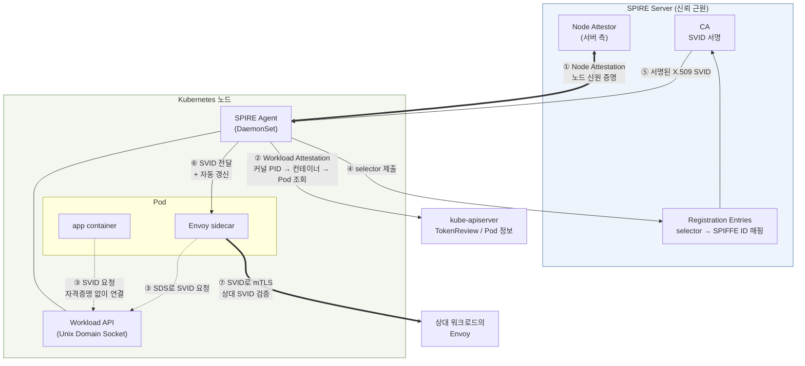

# 워크로드 신원 모델 전환 — SPIFFE에서 IAM으로

> **지원 버전**: SPIRE 1.x, Amazon VPC Lattice (GA), EKS Pod Identity
> **마지막 업데이트**: 2026년 9월 3일

## 이 문서에서 다루는 것

- SPIFFE/SPIRE가 워크로드 신원 문제를 어떻게 풀었는가 — 특히 attestation이 bootstrapping 문제를 해소하는 원리
- SPIFFE 기반 mTLS와 Lattice IAM Auth의 유사점(짧은 수명 자격증명 + 플랫폼 attestation)과 **결정적 차이 2개**
- 이 차이가 왜 금융권 보안 심의의 핵심 쟁점이 되는가

## 문제의 출발점 — 워크로드는 자신을 어떻게 증명하는가

서비스 A가 서비스 B를 호출할 때 B는 "이 요청이 정말 A에서 왔는가"를 알아야 합니다. 이 문제가 어려운 이유는 **증명에 필요한 비밀을 애초에 어떻게 전달하는가**입니다.

비밀(인증서, API 키)을 워크로드에 넣어주려면 그 워크로드가 진짜 그 워크로드인지 알아야 하고, 그것을 알려면 비밀이 필요합니다. 이것이 **bootstrapping 문제**이며, 전통적인 회피책들은 모두 문제를 옮기기만 합니다.

| 회피책 | 문제를 어디로 옮기는가 |
|---|---|
| 이미지에 인증서 굽기 | 이미지 유출 = 신원 유출. 갱신 시 재빌드 |
| Secret으로 마운트 | Secret에 접근할 수 있는 주체 전부가 그 신원을 위조 가능 |
| 배포 시 주입 | CI/CD 시스템이 모든 신원의 마스터 키를 보유 |

SPIFFE/SPIRE와 Lattice IAM Auth는 **둘 다 이 문제를 "플랫폼이 워크로드를 대신 증명한다"는 방식으로 해결**합니다. 그래서 구조가 놀랄 만큼 닮았습니다. 그리고 닮았기 때문에 **다른 지점이 정확히 무엇인지**가 심의의 초점이 됩니다.

## SPIFFE 3요소

SPIFFE(Secure Production Identity Framework For Everyone)는 워크로드 신원의 **표준**입니다. 구현이 아니라 규격입니다.

### ① SPIFFE ID — 신원의 이름

URI 형식으로 워크로드를 식별합니다.

```
spiffe://<trust-domain>/<workload-path>

예: spiffe://finance.example.com/ns/prodcatalog/sa/prodcatalog-sa
```

`trust-domain`은 **신뢰 경계의 이름**입니다. 같은 trust domain에 속한 워크로드끼리는 공통의 신뢰 근원(같은 CA)을 공유합니다. 경로 부분은 조직이 자유롭게 설계하며, Kubernetes 환경에서는 보통 namespace와 ServiceAccount를 반영합니다.

주목할 점은 **이름 안에 네트워크 정보가 없다**는 것입니다. IP도 호스트명도 포트도 없습니다. 이것이 의도된 설계입니다 — 워크로드가 어디로 스케줄되든, IP가 바뀌든, 신원은 그대로입니다. [04번 문서](./04-networking-basics.md)에서 본 "IP 기반 통제에서 신원 기반 통제로"의 이동이 여기서 시작됩니다.

### ② SVID — 신원의 증명서

**SPIFFE Verifiable Identity Document**. SPIFFE ID를 담고 있으며 검증 가능한 문서로, 두 형태가 있습니다.

| 형태 | 내용 | 주 용도 |
|---|---|---|
| **X.509-SVID** | SPIFFE ID를 SAN URI에 담은 X.509 인증서 + 개인키 | mTLS 상호 인증 |
| **JWT-SVID** | SPIFFE ID를 `sub` 클레임에 담은 JWT | HTTP 헤더로 신원 전달, L7 인가 |

**핵심 특성은 짧은 수명입니다.** SVID는 보통 수십 분에서 수 시간 단위로 발급되고 자동 갱신됩니다. 짧은 수명이 중요한 이유는 **폐기(revocation) 문제를 회피**하기 때문입니다. 인증서 폐기 목록(CRL)이나 OCSP는 운영이 까다로운데, 자격증명이 곧 만료된다면 폐기 메커니즘 없이도 침해의 유효 기간이 제한됩니다.

### ③ Workload API — 신원의 전달 통로

워크로드가 자신의 SVID를 받아오는 인터페이스입니다. 핵심은 **Unix Domain Socket(UDS)으로 노출된다**는 점입니다.

UDS를 쓰는 이유가 이 설계의 정수입니다. **워크로드는 이 소켓에 연결할 때 아무런 자격증명을 제시하지 않습니다.** 대신 커널이 소켓 연결의 상대편 프로세스 정보(PID, UID, GID)를 신뢰할 수 있게 제공하고, SPIRE Agent가 그 정보로 상대가 누구인지 **직접 조사**합니다.

즉 **"비밀을 제시해서 신원을 증명"하는 것이 아니라 "플랫폼이 관찰해서 신원을 판정"하는 구조**입니다. 여기서 bootstrapping 문제가 풀립니다.

## SPIRE 구성

SPIRE는 SPIFFE의 대표적인 구현체입니다.



| 구성요소 | 역할 |
|---|---|
| **SPIRE Server** | **신뢰 근원.** CA를 보유하고 SVID를 서명 발급. Registration Entry(어떤 selector가 어떤 SPIFFE ID를 받는가)를 관리 |
| **SPIRE Agent** (DaemonSet) | 각 노드에서 동작. 노드 자신의 신원을 Server에 증명하고, 그 노드의 워크로드들을 조사해 SVID를 대리 수령·전달·갱신 |
| **Attestation** | 신원 판정 절차. Node Attestation(노드 증명)과 Workload Attestation(워크로드 증명) 2단계 |
| **Envoy SDS 연동** | Envoy가 **Secret Discovery Service** 프로토콜로 Agent에게서 인증서를 받음. 애플리케이션 코드는 mTLS를 전혀 모름 |

### Attestation이 bootstrapping 문제를 해소하는 원리

이것이 SPIRE의 핵심이며, IAM과 비교할 때의 기준점입니다.

**Node Attestation** — Agent가 Server에게 "나는 이 노드다"를 증명합니다. 여기서 사용하는 증거는 **미리 심어둔 비밀이 아니라 플랫폼이 발급한 증명**입니다. AWS에서는 EC2 인스턴스의 IMDS 서명 문서나 인스턴스 신원 문서를 씁니다. Server는 그 증거를 AWS에 대조해 검증할 수 있으므로, 노드에 사전 공유 비밀을 넣어둘 필요가 없습니다.

**Workload Attestation** — Agent가 노드 안의 워크로드를 조사합니다. 순서는 이렇습니다.

1. 워크로드가 UDS에 연결합니다 — **자격증명 없이**
2. Agent가 커널에서 상대 프로세스의 PID를 얻습니다 — **위조 불가**. 커널이 알려주는 사실입니다
3. PID로부터 cgroup을 읽어 어느 컨테이너인지 알아냅니다
4. kubelet/kube-apiserver에 조회해 그 컨테이너가 속한 Pod, namespace, ServiceAccount, 레이블을 확인합니다
5. 이 속성들을 **selector**로 조합해 Server에 제출합니다
6. Server가 Registration Entry에서 매칭되는 SPIFFE ID를 찾아 SVID를 발급합니다

**bootstrapping 문제가 해소되는 지점은 2번입니다.** 워크로드는 자신이 누구인지 주장하지 않습니다. 주장할 필요가 없습니다. 커널이 사실을 알려주고, 그 사실을 플랫폼(Kubernetes)의 기록과 대조합니다. **위조하려면 커널이나 Kubernetes API 서버를 침해해야 하며, 그 수준의 침해는 이미 다른 모든 것이 무너진 상태입니다.**

이 원리를 한 문장으로 정리하면: **신원은 제시되는 것이 아니라 관찰되고 판정되는 것입니다.**

## IAM Auth와의 대조

Lattice IAM Auth의 절차는 [03번 문서](./03-auth-flow.md)에 있습니다. 두 모델을 항목별로 대조하면 이렇습니다.

| 항목 | SPIFFE/SPIRE (AS-IS) | Lattice IAM Auth (TO-BE) |
|---|---|---|
| **신원의 이름** | SPIFFE ID (`spiffe://<trust-domain>/ns/<ns>/sa/<sa>`) | IAM Role ARN / assumed-role 세션 ARN |
| **자격증명의 형태** | X.509-SVID 또는 JWT-SVID | STS 임시 credential (access key + secret + session token) |
| **증명 방식** | 인증서 개인키 보유 증명 (TLS handshake) | SigV4 요청 서명 (secret key 보유 증명) |
| **증명 단위** | **connection** — 연결 수립 시 1회 | **요청** — 매 요청 |
| **attestation 주체** | SPIRE Agent (노드) + SPIRE Server | EKS Pod Identity Agent + EKS Auth API |
| **attestation 증거** | 커널 PID → cgroup → Pod/ServiceAccount 조회 | ServiceAccount ↔ Role 연결 (EKS Auth API) 또는 OIDC 토큰(IRSA) |
| **검증 방식** | 상대 워크로드의 Envoy가 SVID 체인을 trust bundle로 검증 | Lattice가 서명 재계산·대조 후 3중 정책 평가 |
| **신뢰 근원** | **고객이 운영하는 SPIRE Server CA** | **AWS IAM / STS** |
| **자격 수명** | 수십 분~수 시간, 자동 갱신 | STS 임시 credential, 자동 갱신 |
| **인가 표현** | Envoy 인가 필터 (SPIFFE ID 기반) | IAM 정책 3중 (identity-based + service network + service) |
| **관측 수단** | Envoy 메트릭·로그 (SPIFFE ID 단위) | Lattice access log (principal 단위, span 없음) |
| **운영 부담** | **높음** — SPIRE Server HA, CA 키 관리, CA 로테이션, Registration Entry 관리, Agent 배포·업그레이드, trust bundle 배포 | **낮음** — Pod Identity Agent 애드온 + ServiceAccount↔Role 연결. CA·키 관리 없음 |
| **멀티 클러스터** | trust domain 설계와 federation 구성 필요 | Pod Identity로 Role 재사용, 클러스터별 추가 설정 최소 |
| **AWS 외부 워크로드** | ✅ 가능 (온프레미스, 다른 클라우드) | ❌ IAM/STS 도달 필요 |

## 유사점 — 왜 이 전환이 가능한가

대조표만 보면 완전히 다른 체계처럼 보이지만, **구조적으로는 같은 패턴**입니다. 이것이 전환이 성립하는 근거입니다.

### ① 둘 다 짧은 수명 자격증명을 쓴다

SVID도, STS 임시 credential도 짧은 수명이며 자동 갱신됩니다. 둘 다 같은 이유로 그렇게 설계되었습니다 — **폐기 메커니즘 없이 침해의 유효 기간을 제한**하기 위해서입니다.

이 유사성의 실무적 의미는 큽니다. AS-IS에서 이미 "장기 비밀을 쓰지 않는다"는 원칙을 심의에 통과시켰다면, TO-BE도 같은 원칙을 만족합니다. **심의에서 이 항목은 재논의 대상이 아닙니다.**

### ② 둘 다 플랫폼 attestation에 기반한다

워크로드가 비밀을 미리 갖고 있지 않고, 플랫폼이 대신 증명해줍니다.

| 단계 | SPIRE | EKS Pod Identity |
|---|---|---|
| 노드 신원 | Node Attestation (EC2 신원 문서 등) | 노드 Role의 `AssumeRoleForPodIdentity` 권한 |
| 워크로드 판정 | 커널 PID → cgroup → Pod/SA | Pod의 ServiceAccount ↔ Role 연결 |
| 자격증명 전달 | Workload API (UDS) | Pod Identity Agent (link-local 주소) |
| 자격증명 갱신 | Agent가 SVID 갱신 | SDK가 credential 갱신 |

**두 열이 행 단위로 대응됩니다.** bootstrapping 문제를 푸는 방식이 같습니다. Pod Identity Agent가 link-local 주소로 credential을 제공하는 것은 SPIRE Agent가 UDS로 SVID를 제공하는 것과 같은 아이디어입니다 — 로컬 인프라 구성요소가 워크로드를 판정하고 자격증명을 대신 받아옵니다.

이 유사성 덕분에 **"워크로드가 비밀을 보유하지 않는다"는 심의 논점도 유지됩니다.**

## 결정적 차이 2개

유사점이 많으므로, 심의에서 실제로 다투게 되는 것은 **다른 두 지점**입니다. 이 둘은 운영 편의로 해소되지 않는 구조적 차이입니다.

### 차이 (a) — 양방향 상호 인증 vs 단방향 + 요청 인증

**AS-IS: 양방향입니다.**

mTLS handshake에서 클라이언트와 서버가 **서로의** SVID를 검증합니다. 클라이언트는 "내가 연결한 상대가 진짜 결제 서비스인가"를 SPIFFE ID로 확인하고, 서버는 "나에게 연결한 상대가 진짜 주문 서비스인가"를 확인합니다. 양쪽 모두 워크로드 신원 체계 안에서 증명됩니다.

**TO-BE: 비대칭입니다.**

| 방향 | AS-IS | TO-BE |
|---|---|---|
| 클라이언트 → 서버 (클라이언트 증명) | SVID 상호 인증 | **SigV4 요청 서명** (요청 단위, 더 세밀) |
| 서버 → 클라이언트 (서버 증명) | SVID 상호 인증 | **TLS 서버 인증서** (일반 TLS 수준) |

클라이언트 증명은 오히려 **더 세밀해집니다.** connection 1회가 아니라 요청마다 검증되므로, 연결이 탈취된 뒤 그 연결로 임의 요청을 보내는 시나리오가 차단됩니다. 경로·메서드·헤더 조건으로 요청 단위 인가도 가능합니다.

**문제는 서버 증명입니다.** 클라이언트가 확인할 수 있는 것은 "이 TLS 인증서가 유효하고 도메인이 맞다"까지입니다. **"이 서비스가 진짜 그 팀이 운영하는 그 서비스인가"를 워크로드 신원 체계로 확인하는 단계가 없습니다.**

심의에서 실제로 나오는 질문은 이렇습니다.

> 서비스 네트워크 안에서 누군가 우리 서비스 이름으로 Lattice Service를 만들고 그쪽으로 트래픽을 받으면, 클라이언트는 그것을 구별할 수 있는가?

정직한 답은 **"워크로드 신원 체계로는 구별할 수 없고, 서비스 네트워크와 Lattice 리소스에 대한 IAM 통제로 막아야 한다"**입니다. 즉 **방어선의 위치가 워크로드 간 상호 인증에서 리소스 생성 권한 통제로 이동**합니다.

이것은 나쁜 답이 아닙니다. 실제로 Lattice Service를 만들 수 있는 주체를 IAM으로 엄격히 제한하고, service network association을 통제하고, CloudTrail로 리소스 생성을 감시하면 실질적 위험은 관리됩니다. 그러나 **심의 문서에 "상호 인증"이라고 적혀 있었다면 그 항목은 다시 써야 하고, 통제의 근거를 다른 계층에서 제시해야 합니다.** 이것을 전환 후반에 발견하면 일정이 크게 밀립니다.

### 차이 (b) — 신뢰 근원의 소유권

**이것이 금융권 심의에서 더 무거운 항목입니다.**

| 항목 | AS-IS | TO-BE |
|---|---|---|
| **신뢰 근원** | 고객이 운영하는 SPIRE Server CA | AWS IAM / STS |
| **CA 개인키 소유** | 고객 | (해당 없음 — 키 기반이 아님) |
| **누가 신원을 발급하는가** | 고객이 정의한 Registration Entry에 따라 고객의 CA | AWS STS |
| **신원 발급 규칙의 결정권** | 고객이 완전 통제 | 고객이 IAM으로 통제, 실행은 AWS |
| **감사 증적** | SPIRE Server 로그 (고객 보유) | CloudTrail (AWS 서비스) |
| **CA 로테이션 결정권** | 고객 | (해당 없음) |
| **AWS 외부에서 동작** | ✅ | ❌ |
| **운영 부담** | 고객 부담 | AWS 부담 |

트레이드오프는 명확합니다. **운영 부담을 AWS에 넘기는 대가로 신뢰 근원의 소유권을 넘깁니다.**

이 항목이 금융권에서 무거운 이유는 규제와 심의 관행 때문입니다. 많은 조직의 보안 기준이 **"인증 체계의 신뢰 근원을 자체 통제해야 한다"**를 명시적으로 요구하거나, 최소한 그렇게 해석되는 조항을 갖고 있습니다. 자체 CA를 운영하는 것은 그 요구를 만족시키는 가장 직접적인 방법이었고, SPIRE 도입 자체가 그 심의를 통과한 결과일 가능성이 높습니다.

Lattice IAM Auth로 옮기면 이 논거를 다시 세워야 합니다. 제시할 수 있는 근거들:

| 근거 | 내용 |
|---|---|
| **책임 공유 모델** | IAM/STS는 AWS가 이미 여러 규제 프레임워크에서 인증받아 운영하는 통제 |
| **정책 결정권 유지** | 누가 무엇을 호출할 수 있는가는 고객이 IAM 정책으로 완전히 정의 |
| **감사 증적 확보** | CloudTrail로 credential 발급과 API 호출 이력 확보. Lattice access log로 데이터 경로 이력 확보 |
| **키 보유 축소가 오히려 이점** | 고객이 CA 개인키를 보유하지 않으므로 키 유출 위험 자체가 제거됨 |
| **자격 수명·attestation 유지** | 앞의 유사점 두 가지는 그대로 만족 |

**다만 이것은 "동등하다"는 주장이 아니라 "다른 방식으로 통제된다"는 주장입니다.** 심의 담당자가 후자를 받아들일지는 조직의 기준에 달려 있고, 기술적으로 해소할 수 있는 문제가 아닙니다.

### 금융권 심의 쟁점으로서의 위치

정리하면 이 전환의 심의 쟁점은 다음과 같이 배치됩니다.

| 항목 | 심의 상태 | 근거 |
|---|---|---|
| 장기 비밀 미사용 | ✅ **재논의 불필요** | 둘 다 짧은 수명 자격증명 + 자동 갱신 |
| 워크로드가 비밀을 보유하지 않음 | ✅ **재논의 불필요** | 둘 다 플랫폼 attestation 기반 |
| 요청 단위 인가 세밀도 | ✅ **개선** | connection 단위 → 요청 단위, 경로·메서드·헤더 조건 |
| 클라이언트 신원 증명 | ✅ **유지 이상** | SigV4가 요청마다 검증 |
| **서버 신원 증명** | ⚠️ **약화 — 대체 통제 필요** | 워크로드 신원 체계에서 TLS 서버 인증서 수준으로. 방어선을 리소스 생성 권한 IAM 통제로 이동 |
| **신뢰 근원 소유권** | ⚠️ **이전 — 논거 재작성 필요** | 고객 CA → AWS IAM/STS |
| 종단간 암호화 | ⚠️ **트레이드오프** | HTTPS listener는 Lattice에서 TLS 1회 종료. 유지하려면 TLS Passthrough인데 IAM Auth 포기 ([04번](./04-networking-basics.md), [06번](./06-constraints.md)) |
| 관측성 (추적) | ⚠️ **약화** | Envoy span 소멸. 애플리케이션 계측 필요 ([01번](./01-appmesh-vs-lattice.md)) |
| AWS 외부 워크로드 | ❌ **범위 축소** | IAM/STS 도달 필요. 온프레미스·타 클라우드 워크로드는 별도 방안 |

**실무 권고: 위 표의 ⚠️와 ❌ 항목을 전환 착수 전에 심의 담당자와 먼저 검토하십시오.** 기술 구현은 대부분 예측 가능하지만, 이 항목들은 조직의 판단에 달려 있고 결과에 따라 아키텍처가 바뀝니다(예: 서버 신원 증명이 필수로 판정되면 TLS Passthrough + 엔드포인트 mTLS 구성으로 가야 하고, 그러면 IAM Auth를 쓸 수 없어 인가 설계 전체가 달라집니다).

### SPIRE를 계속 쓰는 선택지

전환이 반드시 SPIRE 폐기를 의미하지는 않습니다.

- **AWS 외부 워크로드가 있다면** SPIRE는 그 영역에서 계속 필요합니다
- **TLS Passthrough 구성**을 택하면 엔드포인트가 직접 mTLS를 수행해야 하고, 그 인증서를 SPIRE가 계속 공급할 수 있습니다
- 이 경우 App Mesh는 사라지지만 **SPIRE는 남는** 구성이 됩니다 — App Mesh 지원 종료의 대응과 SPIRE 존속은 별개 결정입니다

SPIRE 운영 부담 자체를 없애는 것이 전환의 목표 중 하나였다면, 위 조건들이 그 목표와 충돌하는지 먼저 확인해야 합니다.

## 정리

- SPIFFE 3요소는 **SPIFFE ID**(URI 형식 이름), **SVID**(짧은 수명 X.509/JWT), **Workload API**(UDS)입니다.
- SPIRE의 attestation이 bootstrapping 문제를 푸는 원리는 **"신원은 제시되는 것이 아니라 관찰되고 판정되는 것"**입니다. 커널이 알려주는 PID는 위조할 수 없습니다.
- IAM Auth도 같은 패턴입니다 — **짧은 수명 자격증명 + 플랫폼 attestation**. 그래서 심의의 상당 부분은 재논의 대상이 아닙니다.
- 결정적 차이는 둘입니다. **(a) 양방향 상호 인증이 단방향+요청 인증으로 바뀌어 서버 신원 증명이 약화**되고, **(b) 신뢰 근원이 고객 CA에서 AWS IAM/STS로 이전**됩니다.
- 이 두 항목은 기술로 해소되지 않으며 조직의 판단이 필요합니다. **전환 착수 전에 심의 담당자와 검토해야 하고, 결과에 따라 아키텍처가 바뀝니다.**

다음: [제약사항과 의사결정 포인트](./06-constraints.md)에서 설계 확정 전에 답해야 할 항목들을 정리합니다.

## 참고 자료

- [SPIFFE 공식 문서](https://spiffe.io/docs/latest/spiffe-about/overview/)
- [SPIFFE ID 스펙](https://github.com/spiffe/spiffe/blob/main/standards/SPIFFE-ID.md) / [X.509-SVID 스펙](https://github.com/spiffe/spiffe/blob/main/standards/X509-SVID.md)
- [SPIRE Concepts — Attestation](https://spiffe.io/docs/latest/spire-about/spire-concepts/)
- [EKS Pod Identity](https://docs.aws.amazon.com/eks/latest/userguide/pod-identities.html)
- [Secure Cross-Cluster Communication in EKS with VPC Lattice and Pod Identity IAM Session Tags](https://aws.amazon.com/blogs/containers/secure-cross-cluster-communication-in-eks-with-vpc-lattice-and-pod-identity-iam-session-tags/)
- [Istio Security — mTLS](../istio/security/01-mtls.md) — sidecar 기반 상호 인증의 동작
