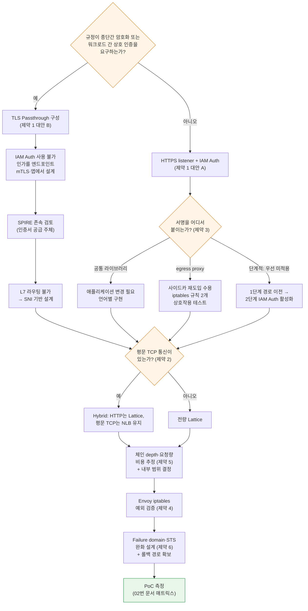

# 제약사항과 의사결정 포인트

> **지원 버전**: Amazon VPC Lattice (GA), AWS Gateway API Controller v1.1+, AWS App Mesh (2026년 9월 30일 지원 종료)
> **마지막 업데이트**: 2026년 9월 3일

## 이 문서에서 다루는 것

- 설계를 확정하기 전에 반드시 답해야 하는 제약 6개와 각각의 대안
- 그 제약들이 상호작용해서 만드는 의사결정 트리 — 하나의 선택이 다른 선택을 닫아버리는 지점
- 전환 착수 전 점검 목록

## 제약 요약

| # | 제약 | 성질 | 대안 존재 | 결정 시점 |
|---|---|---|---|---|
| 1 | TLS Passthrough + IAM Auth Policy 동시 적용 불가 | **원리적** — 해소되지 않음 | 2개 (택1) | **가장 먼저** |
| 2 | Raw TCP 미지원 | **원리적** — 해소되지 않음 | Hybrid (NLB 병행) | 초기 |
| 3 | SigV4 서명의 애플리케이션 영향 | 구현 선택 | 3개 | 초기 |
| 4 | 병행 운영 시 Envoy iptables 예외 | 설정 항목 | 필수 설정 | 전환 시작 전 |
| 5 | Hop 단위 요청·데이터 과금 | 구조적 | 아키텍처 조정 | 설계 중 |
| 6 | Failure domain 집중 + STS 의존성 | 구조적 | 완화만 가능 | 설계 중 |

1번과 2번은 **AWS가 기능을 추가해도 해소되지 않는 원리적 제약**입니다 ([04번 문서](./04-networking-basics.md) 참고). 나머지는 설계와 운영으로 다룰 수 있습니다.

## 제약 1 — TLS Passthrough와 IAM Auth Policy는 동시에 쓸 수 없다

### 원리

[03번](./03-auth-flow.md)과 [04번 문서](./04-networking-basics.md)에서 본 두 사실이 만나면 이 제약이 나옵니다.

1. SigV4 검증은 `Authorization` 헤더를 읽어야 한다
2. 헤더를 읽으려면 TLS를 종료해야 한다

TLS Passthrough는 정의상 TLS를 종료하지 않습니다. 따라서 **Lattice는 서명 헤더를 볼 수 없고, 요청 서명 기반 인증을 적용할 수 없습니다.**

구조적 근거도 일치합니다. AWS Gateway API Controller의 `IAMAuthPolicy`는 **Gateway, HTTPRoute, GRPCRoute에만 부착 가능하며 `TLSRoute`는 부착 대상이 아닙니다.** TLS Passthrough 경로에는 애초에 정책을 붙일 수단이 없습니다.

::: warning 확인 필요
TLS_PASSTHROUGH listener에 auth policy를 설정하려 할 때 **API가 이를 거부하는지, 받아들이지만 평가하지 않는지**는 공식 문서에서 확정하지 못했습니다. 원리(헤더 검증에 TLS 종료 필요)와 컨트롤러의 부착 제한은 확실하지만, API 레벨 거동은 [VPC Lattice auth policies 문서](https://docs.aws.amazon.com/vpc-lattice/latest/ug/auth-policies.html)로 확인하십시오.
:::

### 대안 2개

| 대안 | 구성 | 얻는 것 | 잃는 것 |
|---|---|---|---|
| **A. HTTPS listener + IAM Auth** | Lattice가 TLS 종료, SigV4 검증, 3중 정책 평가 | IAM 기반 인가, 경로·메서드·헤더 조건, L7 라우팅, 상세 access log | 종단간 암호화 (Lattice에서 1회 종료), 엔드포인트 자체 mTLS |
| **B. TLS Passthrough + 엔드포인트 mTLS** | Lattice는 SNI로만 라우팅, 엔드포인트가 TLS·mTLS 직접 수행 | 종단간 암호화, 상호 인증 유지, SPIRE 인증서 계속 활용 가능 | IAM Auth 전체, L7 라우팅, 경로·헤더 조건, HTTP 상세 로그 |

### 어느 쪽을 고를 것인가

**이것이 이 전환의 가장 중요한 분기점입니다.** 다른 결정 대부분이 여기에 종속됩니다.

판단 기준은 **규정이 종단간 암호화나 워크로드 간 상호 인증을 요구하는가**입니다.

- **요구하지 않는다면 A**입니다. IAM Auth의 인가 세밀도와 관측성 이점이 크고, 이것이 Lattice의 설계 의도에 맞는 사용법입니다.
- **요구한다면 B**입니다. 다만 B를 택하면 인가를 어디서 표현할지 새로 설계해야 합니다 — Lattice는 SNI밖에 모르므로 인가는 애플리케이션이나 엔드포인트 mTLS의 인증서 검증에서 해야 합니다. 그리고 [05번 문서](./05-spiffe-to-iam.md)에서 언급한 대로 **SPIRE가 계속 필요할 수 있습니다.**

혼합도 가능합니다. **서비스 단위로 A와 B를 나눌 수 있습니다** — 규정 대상 서비스만 B로, 나머지는 A로. 다만 두 인가 모델을 동시에 운영하는 부담이 생깁니다.

## 제약 2 — Raw TCP 미지원

### 원리

[04번 문서](./04-networking-basics.md)에서 다룬 대로, 평문 TCP에는 라우팅 근거가 없습니다. TLS가 없으면 `ClientHello`가 없고, `ClientHello`가 없으면 SNI가 없습니다. 목적지 IP는 link-local이라 서비스를 식별하지 않고, 남는 것은 포트뿐입니다.

**원리적 제약이므로 향후에도 해소를 기대하기 어렵습니다.**

### 영향 대상 식별

전환 계획 초기에 **평문 TCP를 쓰는 East-West 통신을 모두 찾아야 합니다.** 흔한 것들:

- 평문 Redis / Memcached
- TLS를 쓰지 않는 DB 연결 (MySQL, PostgreSQL 등)
- 커스텀 바이너리 프로토콜
- 평문 Kafka
- gRPC를 평문(h2c)으로 쓰는 경우

### 대안 — Hybrid 구성

| 트래픽 종류 | 경로 |
|---|---|
| HTTP / HTTPS / gRPC | **VPC Lattice** |
| TLS가 있는 TCP | Lattice **TLS Passthrough** (SNI 라우팅 가능하면) |
| 평문 TCP | **NLB** (또는 기존 경로 유지) |

이 구성을 권하는 이유는 단순합니다. **모든 것을 Lattice로 옮기려는 시도가 전환을 지연시키는 가장 흔한 원인**입니다. 평문 TCP 서비스를 위해 TLS를 도입하는 작업까지 전환 범위에 넣으면 애플리케이션 변경이 필요하고 일정이 통제를 벗어납니다.

App Mesh 지원 종료라는 기한이 있으므로, **기한 내에 반드시 옮겨야 하는 것(App Mesh에 의존하는 HTTP 통신)과 옮기지 않아도 되는 것(원래 App Mesh를 안 쓰던 평문 TCP)을 분리**하는 것이 실무적으로 중요합니다.

## 제약 3 — SigV4 서명의 애플리케이션 영향

IAM Auth를 쓰기로 했다면(제약 1의 대안 A), **누군가 요청에 서명을 붙여야 합니다.** 이 "누군가"를 정하는 것이 애플리케이션 팀에 가장 직접적인 영향을 주는 결정입니다.

| 방식 | 구현 | 장점 | 단점 |
|---|---|---|---|
| **① 공통 라이브러리** | 각 서비스의 HTTP 클라이언트에 SigV4 서명 로직 적용 (AWS SDK의 서명 기능 또는 언어별 라이브러리) | 홉 추가 없음 → 레이턴시 최소. credential 관리를 SDK에 위임 | **모든 서비스의 코드 변경 필요.** 언어별 구현 필요. 서명 로직 버전 관리 부담 |
| **② egress proxy 사이드카** | `sigv4proxy` 사이드카 + iptables로 Lattice 대역만 리다이렉트 | **애플리케이션 코드 무변경.** 언어 무관. 레퍼런스 구현 존재 | 사이드카가 다시 생김(Envoy를 없앤 이점 일부 상쇄). 홉 하나 추가. 사이드카 운영·업그레이드 부담 |
| **③ IAM Auth 미사용** | authType `NONE`, 인가는 다른 계층에서 | 애플리케이션 무변경, 오버헤드 없음 | **Lattice 레벨 인가 없음.** 서비스 네트워크에 참여한 주체는 누구나 호출 가능. 심의 통과 어려움 |

### 실무 권고

**언어가 여러 개이거나 애플리케이션 팀의 변경 여력이 제한적이면 ②로 시작하십시오.** aws-samples 레퍼런스 구현이 검증된 매니페스트를 제공합니다 — `sigv4proxy` 사이드카를 8080에서 실행하고, init container가 `169.254.171.0/24`로 향하는 트래픽만 프록시로 리다이렉트합니다.

②의 아이러니는 명확합니다. **Envoy 사이드카를 없애려고 전환했는데 서명 사이드카가 생깁니다.** 다만 `sigv4proxy`는 Envoy보다 훨씬 가볍고, xDS 컨트롤플레인이 없으며, 설정이 정적입니다. "사이드카를 없앤다"가 전환의 핵심 목표였다면 ①로 가야 하고, 그러면 애플리케이션 변경 계획을 세워야 합니다.

**③은 심의 관점에서 권하지 않습니다.** 다만 전환을 단계적으로 진행할 때 **1단계에서 ③으로 경로만 옮기고, 2단계에서 IAM Auth를 켜는** 순서는 유효한 전략입니다. 이렇게 하면 경로 변경의 영향과 인증 도입의 영향을 분리해서 검증할 수 있고, [02번 문서](./02-latency.md)의 측정 매트릭스도 이 순서와 맞습니다.

**어느 방식이든 [03번 문서](./03-auth-flow.md)의 함정 3개(Host 헤더, x-amz-date 시각, 서명은 최종 홉에서)를 점검해야 합니다.**

## 제약 4 — 병행 운영 시 Envoy iptables 예외 설정

**이것은 선택이 아니라 필수 설정입니다.**

App Mesh와 Lattice를 동시에 운영하는 기간 동안, App Mesh의 init container가 심은 iptables 규칙이 **Lattice로 향하는 트래픽까지 Envoy로 가로챕니다.** Envoy는 그 목적지를 자신의 설정에서 찾을 수 없으므로 요청이 실패합니다.

| 항목 | 값 |
|---|---|
| 제외해야 할 대역 (IPv4) | `169.254.171.0/24` |
| 제외해야 할 대역 (IPv6) | `fd00:ec2:80::/64` |
| App Mesh 설정 위치 | init container의 egress 무시 CIDR 목록 |
| Istio 설정 위치 | `traffic.sidecar.istio.io/excludeOutboundIPRanges` 애노테이션 |

### 놓치기 쉬운 점

- **IPv6를 쓰면 IPv6 대역도 제외해야 합니다.** IPv4만 제외하고 dual-stack 클러스터에서 간헐적 실패를 겪는 경우가 있습니다.
- **Pod 단위 애노테이션은 새로 배포되는 Pod에만 적용됩니다.** 기존 Pod는 재시작해야 합니다.
- **제약 3의 ② 방식(egress proxy)과 함께 쓸 때 iptables 규칙이 두 개가 됩니다.** App Mesh의 인터셉트에서 Lattice 대역을 제외하고, 동시에 서명 프록시로는 Lattice 대역을 리다이렉트해야 합니다. 두 규칙의 순서와 상호작용을 반드시 테스트하십시오.

전환 시작 **전에** 이 설정을 검증하는 것을 권합니다. 첫 Lattice 호출이 실패하는 원인의 1순위입니다.

## 제약 5 — Hop 단위 과금이 호출 체인 depth에 지배된다

### 과금 구조

VPC Lattice 요금은 세 축입니다.

| 축 | 성격 |
|---|---|
| **서비스 프로비저닝** | 시간당, 서비스 개수에 비례 |
| **데이터 처리** | GB당, **inter-AZ 요금이 여기에 포함** (별도 Cross-AZ 요금 없음) |
| **요청 수 / 연결 수** | HTTP·HTTPS listener는 **요청 수**, TLS listener는 **TCP 연결 수** |

::: warning 확인 필요
요금 단가는 리전과 시점에 따라 다르고, 무료 구간이 있습니다. **설계 확정 전에 [VPC Lattice 요금 페이지](https://aws.amazon.com/vpc/lattice/pricing/)에서 해당 리전의 현재 단가를 직접 확인**하십시오. 이 문서는 단가를 명시하지 않습니다.
:::

### 왜 체인 depth가 비용을 지배하는가

과금이 **hop 단위**라는 점이 핵심입니다.

프론트엔드 → 주문 → 상품 → 재고 → 가격의 4홉 체인이 있다면, 사용자 요청 하나가 **Lattice 요청 4건**을 만듭니다. 각 홉에서 데이터 처리 요금도 발생합니다. 즉 **비용은 사용자 요청 수 × 체인 depth**에 비례합니다.

AS-IS(App Mesh)에서는 이 구조가 달랐습니다. App Mesh 자체에는 요청당 요금이 없었고, 비용은 Envoy가 소비하는 컴퓨팅 리소스로 나타났습니다. **비용 모델이 "컴퓨팅 리소스"에서 "요청 수"로 바뀌는 것**이 이 전환의 재무적 성격입니다.

### 실무적 함의

| 함의 | 대응 |
|---|---|
| **잡담이 많은(chatty) 서비스가 비싸진다** | 한 요청에 여러 번 호출하는 패턴을 배치·집계 호출로 통합 |
| **깊은 체인이 비싸진다** | 체인 depth를 줄이는 것이 비용과 레이턴시를 동시에 개선 ([02번 문서](./02-latency.md)) |
| **모든 통신을 Lattice로 옮기면 비용이 급증할 수 있다** | **클러스터 내부 통신은 Lattice를 거치지 않게 유지**하는 것이 합리적일 수 있음 |
| **health check와 폴링이 요금에 잡힌다** | 고빈도 health check·폴링 간격 재검토 |

**마지막 두 항목이 중요합니다.** Lattice의 강점은 클러스터·VPC·계정 경계를 넘는 통신이고, 같은 클러스터 안의 통신에는 별 이점이 없으면서 비용과 레이턴시를 추가합니다. **경계를 넘는 통신만 Lattice로, 클러스터 내부는 ClusterIP로** 두는 것이 비용과 성능 양쪽에서 합리적인 경우가 많습니다.

다만 여기서 [03번 문서](./03-auth-flow.md)의 제약과 만납니다 — **클러스터 내부에서 k8s Service DNS로 직접 호출하면 auth policy가 평가되지 않습니다.** 즉 "내부 통신은 Lattice를 안 거친다"를 택하면 **내부 통신의 인가를 NetworkPolicy나 애플리케이션 계층에서 별도로 설계**해야 합니다. 비용 최적화와 인가 일관성이 상충하는 지점입니다.

### 비용 추정에 필요한 데이터

전환 전에 다음을 수집하십시오. 이 데이터 없이는 비용 추정이 불가능합니다.

| 항목 | 수집 방법 |
|---|---|
| Lattice로 옮길 서비스 개수 | 전환 범위 정의에서 |
| 서비스 쌍별 요청 수 (RPS) | App Mesh Envoy 메트릭 또는 애플리케이션 메트릭 |
| **평균 호출 체인 depth** | 현재 분산 추적 데이터 (전환 후에는 span이 없으니 **지금 수집**) |
| 서비스 쌍별 데이터 전송량 | Envoy 메트릭 또는 flow log |
| health check·폴링 빈도 | 각 서비스 설정 |

**"평균 호출 체인 depth"는 지금 수집해야 합니다.** 전환 후에는 Lattice가 span을 만들지 않으므로 이 데이터를 얻기 어려워집니다 ([01번 문서](./01-appmesh-vs-lattice.md)).

## 제약 6 — Failure domain 집중과 STS 의존성

### Failure domain이 집중된다

AS-IS와 TO-BE의 장애 특성은 성격이 다릅니다.

| 구분 | AS-IS: App Mesh sidecar | TO-BE: VPC Lattice |
|---|---|---|
| **데이터플레인 장애 범위** | Envoy 하나 = Pod 하나 | Lattice 장애 = **East-West 전면** |
| **장애 전파 방식** | 점진적·국소적 | 광역·동시 |
| **컨트롤플레인 장애 시 데이터플레인** | Envoy가 마지막 설정으로 계속 동작 (graceful degradation) | 데이터 경로 자체가 관리형이므로 성격이 다름 |
| **고객의 대응 수단** | Pod 재시작, 설정 롤백, sidecar 우회 | AWS 측 복구 대기 |
| **가용성 책임** | 고객 (직접 운영) | AWS (관리형 서비스) |

**트레이드오프의 본질**: 관리형 서비스는 개별 장애 확률이 낮지만, 장애가 발생하면 **범위가 넓고 고객이 직접 개입할 수단이 제한적**입니다. sidecar 모델은 장애가 잦을 수 있지만 국소적이고 고객이 손댈 수 있습니다.

### STS 의존성

IAM Auth를 쓰면 **STS가 East-West 데이터 경로의 의존성**이 됩니다 ([03번 문서](./03-auth-flow.md)).

- credential은 만료되고, 갱신에 STS가 필요합니다
- STS에 도달할 수 없고 캐시가 만료되면 **서명할 수 없고, 미서명 요청은 403**입니다
- 즉 **인증 인프라 장애가 서비스 간 통신 장애로 직결**됩니다

AS-IS에서 이 위치에 있던 것은 SPIRE Server였습니다. **의존성의 존재 자체는 새로운 것이 아니고, 소유자가 고객에서 AWS로 바뀌는 것**입니다 ([05번 문서](./05-spiffe-to-iam.md)의 차이 (b)와 같은 구조).

### 완화 수단

이 제약은 제거할 수 없고 완화만 가능합니다.

| 완화 수단 | 내용 |
|---|---|
| **credential 캐시 수명 확인** | SDK가 credential을 얼마나 오래 캐시하는지, 갱신 실패 시 어떻게 동작하는지 확인. 이 값이 STS 단기 장애의 내구 시간 |
| **갱신 실패 시 거동 테스트** | STS 접근을 인위적으로 차단하고 서비스가 어떻게 실패하는지 관측. 조용히 403이 나는지, 재시도하는지 |
| **Critical 경로 이중화** | 최고 중요도 통신에 대해 Lattice 외 대체 경로(직접 호출, NLB) 보유 검토 |
| **점진적 전환** | 전체를 한 번에 옮기지 않고 중요도 낮은 통신부터. 롤백 경로 유지 |
| **RTO/RPO 재산정** | 장애 특성이 바뀌었으므로 기존 목표치의 근거를 다시 검토 |
| **AWS Health / 상태 알림 연동** | 고객이 직접 복구할 수 없으므로 조기 인지가 대응의 핵심 |

**"Critical 경로 이중화"와 "점진적 전환"이 실질적으로 가장 유효합니다.** 특히 롤백 경로를 유지하는 것 — App Mesh 지원 종료 기한이 있어 최종적으로는 걷어내야 하지만, 전환 검증 기간에는 되돌릴 수 있어야 합니다.

## 미확정 항목

::: warning 확인 필요
다음 항목들은 공식 문서로 확정하지 못했습니다. 설계에 영향이 있으면 반드시 직접 확인하십시오.

**① API Gateway와 Lattice의 직접 연계** — API Gateway가 Lattice 서비스 네트워크를 private integration 대상으로 **네이티브 지원한다는 근거를 찾지 못했습니다.** 확인된 패턴은 API Gateway → VPC Link → ALB/NLB → Lattice, 또는 프록시·페더레이션 계층 경유입니다. 남북 트래픽과 Lattice를 잇는 설계라면 이 부분을 먼저 검증하십시오.

**② Lattice quotas의 정확한 값** — AWS 네트워킹 블로그 기준으로 서비스 처리량 기본 quota는 **service 하나당 AZ당 10 Gbps, 10,000 requests/second**로 서술됩니다. 그 외 참고값: services/region 2,000, service networks/region 50, target groups per service 10, listeners per service 2, service associations per service network 500. **대부분 조정 가능하나 정확한 현재값은 Service Quotas 콘솔과 [VPC Lattice endpoints and quotas](https://docs.aws.amazon.com/general/latest/gr/vpc-lattice-service.html)에서 리전별로 확인**하십시오. 동시 connection 수 자체의 상한은 근거를 찾지 못했습니다.

**③ Lattice의 Target 선택이 호출자 AZ를 고려하는지** — AZ 인지 라우팅 여부와 사용자 제어 가능성을 확인하지 못했습니다. AS-IS에서 zone-aware routing에 의존하고 있었다면 **PoC 실측으로 확인**해야 합니다 ([02번 문서](./02-latency.md)의 측정 매트릭스).

**④ TLS_PASSTHROUGH listener에 auth policy 설정 시 API 거동** — 제약 1 참조.

**⑤ ECH(Encrypted Client Hello) 지원 여부** — 지원한다고 가정하지 마십시오 ([04번 문서](./04-networking-basics.md)).
:::

**확정된 것과 대비하면**: link-local 대역(`169.254.171.0/24`, `fd00:ec2:80::/64`), SigV4 서비스명(`vpc-lattice-svcs`), listener protocol 3종(HTTP/HTTPS/TLS_PASSTHROUGH), condition key 목록, App Mesh 지원 종료일(2026년 9월 30일), Cross-AZ 요금이 data processing에 포함된다는 점, trace span 미지원은 확인되었습니다.

## 의사결정 트리

제약들이 상호작용하므로 **결정 순서가 중요합니다.** 앞선 결정이 뒤의 선택지를 닫아버립니다.

**첫 분기(규정 요구사항)가 전체를 지배합니다.** 이 결정은 기술이 아니라 조직의 심의 기준에 달려 있으므로, [05번 문서](./05-spiffe-to-iam.md)의 심의 쟁점 표를 들고 **보안 담당자와 먼저 합의**해야 합니다. 이것을 나중에 확인하면 앞선 모든 설계를 되돌려야 합니다.

## 전환 착수 전 점검 목록

| 구분 | 항목 |
|---|---|
| **심의** | [05번 문서](./05-spiffe-to-iam.md) 쟁점 표의 ⚠️·❌ 항목을 보안 담당자와 검토 완료 |
| **심의** | 서버 신원 증명 약화에 대한 대체 통제(리소스 생성 권한 IAM 통제, CloudTrail 감시) 합의 |
| **심의** | 신뢰 근원 이전(고객 CA → AWS IAM/STS)에 대한 논거 재작성 |
| **설계** | 제약 1 분기 결정 (HTTPS listener + IAM Auth / TLS Passthrough) |
| **설계** | 평문 TCP 통신 목록 작성, Hybrid 범위 확정 |
| **설계** | 서명 방식 결정 (라이브러리 / egress proxy / 단계적) |
| **설계** | Lattice 경유 범위 결정 (경계 통과만 / 내부 포함), 내부 통신 인가 방안 |
| **데이터** | **현재 분산 추적으로 호출 체인 depth 수집** (전환 후 불가) |
| **데이터** | 서비스 쌍별 RPS·데이터 전송량 수집 |
| **데이터** | AS-IS 레이턴시 기준선 측정 ([02번 문서](./02-latency.md) 매트릭스, Envoy CPU 사용량 포함) |
| **설정** | Envoy iptables 예외 CIDR 설정 (IPv4 + IPv6) 검증 |
| **설정** | 노드 SG에 Lattice managed prefix list 인바운드 허용 |
| **설정** | Lattice **access log 활성화** (인가 실패 진단의 유일한 수단) |
| **설정** | Pod readiness gate 적용 검토 (무중단 롤링 업데이트) |
| **확인** | 미확정 항목 ①~⑤를 최신 공식 문서로 확인 |
| **확인** | 해당 리전의 quotas 현재값과 요금 단가 확인 |
| **운영** | 관측성 계획 — Lattice 구간 span 부재에 대한 대응 (애플리케이션 OpenTelemetry 계측) |
| **운영** | 롤백 경로 확보, 점진적 전환 순서 정의 |
| **운영** | STS 갱신 실패 시 거동 테스트 |
| **운영** | RTO/RPO 재산정 |

## 정리

- **원리적 제약 2개는 해소되지 않습니다** — TLS Passthrough와 IAM Auth의 양립 불가, Raw TCP 미지원. 둘 다 "TLS를 종료해야 헤더를 볼 수 있고, TLS가 없으면 SNI도 없다"는 하나의 사실에서 나옵니다.
- **첫 결정이 전체를 지배합니다.** 규정이 종단간 암호화·상호 인증을 요구하는지에 따라 이후 설계가 갈리므로, 기술 작업 전에 심의 담당자와 합의해야 합니다.
- **모든 것을 Lattice로 옮기려 하지 마십시오.** 평문 TCP는 NLB로, 클러스터 내부 통신은 ClusterIP로 두는 Hybrid가 비용·레이턴시·일정 모두에서 합리적인 경우가 많습니다. 단 내부 통신 인가를 별도 설계해야 합니다.
- **비용 모델이 컴퓨팅 리소스에서 요청 수로 바뀝니다.** 비용은 요청 수 × 체인 depth에 비례하며, chatty한 통신과 깊은 체인이 비싸집니다.
- **호출 체인 depth 데이터는 지금 수집하십시오.** 전환 후에는 Lattice가 span을 만들지 않아 얻기 어려워집니다.
- Failure domain 집중과 STS 의존성은 제거할 수 없고, **점진적 전환과 롤백 경로 확보로 완화**합니다.

## 참고 자료

- [Amazon VPC Lattice 요금](https://aws.amazon.com/vpc/lattice/pricing/)
- [Amazon VPC Lattice endpoints and quotas](https://docs.aws.amazon.com/general/latest/gr/vpc-lattice-service.html)
- [Control access to VPC Lattice services using auth policies](https://docs.aws.amazon.com/vpc-lattice/latest/ug/auth-policies.html)
- [AWS Gateway API Controller — IAMAuthPolicy](https://www.gateway-api-controller.eks.aws.dev/latest/api-types/iam-auth-policy/)
- [AWS Gateway API Controller — Pod Readiness Gates](https://www.gateway-api-controller.eks.aws.dev/latest/guides/pod-readiness-gates/)
- [aws-samples/migrating-from-aws-app-mesh-to-amazon-vpc-lattice](https://github.com/aws-samples/migrating-from-aws-app-mesh-to-amazon-vpc-lattice)
- [Comparing the Costs of Common Network Architecture Patterns with Amazon VPC Lattice](https://repost.aws/articles/AR9Tt9m6kKR6mF5Ohj5K-3Og/comparing-the-costs-of-common-network-architecture-patterns-with-amazon-vpc-lattice)
- [App Mesh Document history](https://docs.aws.amazon.com/app-mesh/latest/userguide/doc-history.html)
