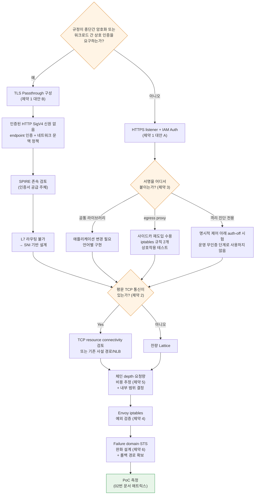

# 제약사항과 의사결정 포인트

> **범위**: VPC Lattice service/resource API와 AWS Gateway API Controller. 선택한 release와 설치 CRD를 확인합니다.
> **마지막 업데이트**: 2026년 9월 13일

## 이 문서에서 다루는 것

- 설계를 확정하기 전에 반드시 답해야 하는 제약 6개와 각각의 대안
- 그 제약들이 상호작용해서 만드는 의사결정 트리 — 하나의 선택이 다른 선택을 닫아버리는 지점
- 전환 착수 전 점검 목록

## 제약 요약

| # | 제약 | 성질 | 대안 존재 | 결정 시점 |
|---|---|---|---|---|
| 1 | TLS passthrough는 HTTP SigV4 신원을 인증하지 못함 | 현재 문서화된 서비스 동작 | Endpoint 인증·익명 네트워크 문맥 정책 | 우선 |
| 2 | Raw TCP는 서비스 listener가 아님 | TCP resource connectivity와 구분 | Resource gateway 또는 기존 사설 경로/NLB | 초기 |
| 3 | SigV4 서명의 애플리케이션 영향 | 구현 선택 | 3개 | 초기 |
| 4 | Mesh 공존 route/서명 검증 | 설정에 따라 다름 | 명시적 bypass 또는 설정된 forwarding | 전환 전 |
| 5 | Hop 단위 요청·데이터 과금 | 구조적 | 아키텍처 조정 | 설계 중 |
| 6 | Failure domain 집중 + STS 의존성 | 구조적 | 완화만 가능 | 설계 중 |

제약 1·2는 **현재 기능과 신뢰 경계의 선택**이며 AWS가 영원히 기능을 추가할 수 없다는 예측이 아닙니다. 서비스 listener·resource connectivity·controller 지원을 구분합니다.

## 제약 1 — TLS passthrough와 인증된 HTTP 신원

### 원리

[03번](./03-auth-flow.md)과 [04번 문서](./04-networking-basics.md)에서 본 두 사실이 만나면 이 제약이 나옵니다.

1. SigV4 검증은 `Authorization` 헤더를 읽어야 한다
2. 헤더를 읽으려면 TLS를 종료해야 한다

TLS Passthrough는 정의상 TLS를 종료하지 않습니다. 따라서 **Lattice는 서명 헤더를 볼 수 없고, 요청 서명 기반 인증을 적용할 수 없습니다.**

Controller 정책 연결과 AWS 서비스 기능은 별개입니다. 문서화된 IAMAuthPolicy 연결 대상에 TLSRoute는 없지만 AWS TLS listener는 익명 principal·네트워크 문맥 정책을 지원합니다.

::: note 확인된 제약
TLS passthrough는 암호화된 HTTP SigV4 신원과 HTTP path/header 조건을 평가할 수 없습니다. 익명 principal 정책은 지원되므로 모든 정책이 거부·무시된다는 추측 대신 [TLS listener 문서](https://docs.aws.amazon.com/vpc-lattice/latest/ug/tls-listeners.html)를 확인합니다.
:::

### 대안 2개

| 대안 | 구성 | 얻는 것 | 잃는 것 |
|---|---|---|---|
| **A. HTTPS listener + IAM Auth** | Lattice가 TLS 종료, SigV4 검증, 3중 정책 평가 | IAM 기반 인가, 경로·메서드·헤더 조건, L7 라우팅, 상세 access log | 종단간 암호화 (Lattice에서 1회 종료), 엔드포인트 자체 mTLS |
| **B. TLS passthrough + endpoint mTLS** | Custom-domain SNI로 서비스를 선택하고 endpoint가 TLS 인증 | Endpoint 암호화·인증서 신원 | 인증된 HTTP SigV4 신원과 HTTP L7 검사 불가. 익명 네트워크 문맥 정책은 별개 |

### 어느 쪽을 고를 것인가

**이것이 이 전환의 가장 중요한 분기점입니다.** 다른 결정 대부분이 여기에 종속됩니다.

판단 기준은 **규정이 종단간 암호화나 워크로드 간 상호 인증을 요구하는가**입니다.

- **요구하지 않는다면 A**입니다. IAM Auth의 인가 세밀도와 관측성 이점이 크고, 이것이 Lattice의 설계 의도에 맞는 사용법입니다.
- **요구한다면 B**입니다. 다만 B를 택하면 인가를 어디서 표현할지 새로 설계해야 합니다 — Lattice는 SNI밖에 모르므로 인가는 애플리케이션이나 엔드포인트 mTLS의 인증서 검증에서 해야 합니다. 그리고 [05번 문서](./05-spiffe-to-iam.md)에서 언급한 대로 **SPIRE가 계속 필요할 수 있습니다.**

혼합도 가능합니다. **서비스 단위로 A와 B를 나눌 수 있습니다** — 규정 대상 서비스만 B로, 나머지는 A로. 다만 두 인가 모델을 동시에 운영하는 부담이 생깁니다.

## 제약 2 — 서비스와 리소스 연결 선택

### 원리

Raw-TCP 서비스 listener가 없다고 TCP 리소스까지 배제되는 것은 아닙니다. Lattice resource configuration/resource gateway는 별도 접근 모델을 제공합니다. 서비스 TLS passthrough에서는 클라이언트가 TLS로 연결을 시작하고 설정한 custom-domain SNI를 보내야 합니다.

제품 전체의 영구적인 한계로 단정하지 말고 프로토콜 요구와 현재 controller 지원을 확인합니다.

### 영향 대상 식별

전환 계획 초기에 **평문 TCP를 쓰는 East-West 통신을 모두 찾아야 합니다.** 흔한 것들:

평문 DB·cache·custom TCP 프로토콜을 조사합니다. HTTP/2(h2c)의 gRPC를 같은 미지원 범주에 넣지 말고 정확한 HTTP listener·route·target 구성을 검증합니다.

### 대안 — Hybrid 구성

| 트래픽 종류 | 경로 |
|---|---|
| HTTP / HTTPS / gRPC | **VPC Lattice** |
| TLS가 있는 TCP | Lattice **TLS Passthrough** (SNI 라우팅 가능하면) |
| 평문 TCP | Lattice TCP resource connectivity·기존 사설 연결·NLB를 검토. 서비스 L7 기능이 자동 적용되지는 않음 |

이 구성을 권하는 이유는 단순합니다. **모든 것을 Lattice로 옮기려는 시도가 전환을 지연시키는 가장 흔한 원인**입니다. 평문 TCP 서비스를 위해 TLS를 도입하는 작업까지 전환 범위에 넣으면 애플리케이션 변경이 필요하고 일정이 통제를 벗어납니다.

App Mesh도 TCP route를 지원했습니다. HTTP만이 아니라 **실제로 App Mesh에 의존하는 모든 트래픽**을 조사하고 지원 종료 전에 대체합니다.

## 제약 3 — SigV4 서명의 애플리케이션 영향

IAM Auth를 쓰기로 했다면(제약 1의 대안 A), **누군가 요청에 서명을 붙여야 합니다.** 이 "누군가"를 정하는 것이 애플리케이션 팀에 가장 직접적인 영향을 주는 결정입니다.

| 방식 | 구현 | 장점 | 단점 |
|---|---|---|---|
| **① 공통 라이브러리** | 각 서비스의 HTTP 클라이언트에 SigV4 서명 로직 적용 (AWS SDK의 서명 기능 또는 언어별 라이브러리) | 홉 추가 없음 → 레이턴시 최소. credential 관리를 SDK에 위임 | **모든 서비스의 코드 변경 필요.** 언어별 구현 필요. 서명 로직 버전 관리 부담 |
| **② egress proxy 사이드카** | `sigv4proxy` 사이드카 + iptables로 Lattice 대역만 리다이렉트 | **애플리케이션 코드 무변경.** 언어 무관. 레퍼런스 구현 존재 | 사이드카가 다시 생김(Envoy를 없앤 이점 일부 상쇄). 홉 하나 추가. 사이드카 운영·업그레이드 부담 |
| **③ IAM Auth 미사용** | authType `NONE`, 인가는 다른 계층에서 | 애플리케이션 무변경, 오버헤드 없음 | **Lattice 레벨 인가 없음.** 서비스 네트워크에 참여한 주체는 누구나 호출 가능. 심의 통과 어려움 |

### 실무 권고

**언어가 여러 개이거나 애플리케이션 팀의 변경 여력이 제한적이면 ②로 시작하십시오.** aws-samples 레퍼런스 구현이 검증된 매니페스트를 제공합니다 — `sigv4proxy` 사이드카를 8080에서 실행하고, init container가 `169.254.171.0/24`로 향하는 트래픽만 프록시로 리다이렉트합니다.

②의 아이러니는 명확합니다. **Envoy 사이드카를 없애려고 전환했는데 서명 사이드카가 생깁니다.** 다만 `sigv4proxy`는 Envoy보다 훨씬 가볍고, xDS 컨트롤플레인이 없으며, 설정이 정적입니다. "사이드카를 없앤다"가 전환의 핵심 목표였다면 ①로 가야 하고, 그러면 애플리케이션 변경 계획을 세워야 합니다.

Auth-off 비교는 업무 트래픽이 없고 보완 network/app 제어가 있는 격리·명시 승인 시험 경로에서만 수행합니다. 전환이나 benchmark를 쉽게 만들기 위해 운영 인가를 끄지 않습니다.

**어느 방식이든 [03번 문서](./03-auth-flow.md)의 함정 3개(Host 헤더, x-amz-date 시각, 서명은 최종 홉에서)를 점검해야 합니다.**

## 제약 4 — 병행 운영 시 Envoy iptables 예외 설정

제외 규칙이나 명시적 proxy 경로를 선택하기 전에 설치된 mesh 정책과 관측한 전달 동작을 확인합니다. 모든 Envoy 설정이 미등록 대상을 거부하는 것은 아닙니다.

Mesh iptables가 Lattice 트래픽을 가로챌 수 있습니다. 전달·실패·서명 필드 변경 여부는 outbound policy와 route 설정에 달려 있습니다. 실제 규칙과 log를 확인한 후 선택한 IPv4/IPv6 서명 경로를 검증합니다.

| 항목 | 값 |
|---|---|
| 제외해야 할 대역 (IPv4) | `169.254.171.0/24` |
| 제외해야 할 대역 (IPv6) | `fd00:ec2:80::/64` |
| App Mesh 설정 위치 | init container의 egress 무시 CIDR 목록 |
| Istio 설정 위치 | `traffic.sidecar.istio.io/excludeOutboundIPRanges` 애노테이션 |

### 놓치기 쉬운 점

- **IPv6를 쓰면 IPv6 대역도 제외해야 합니다.** IPv4만 제외하고 dual-stack 클러스터에서 간헐적 실패를 겪는 경우가 있습니다.
- **Pod 단위 애노테이션은 새로 배포되는 Pod에만 적용됩니다.** 기존 Pod는 재시작해야 합니다.
- **제약 3의 ② 방식(egress proxy)과 함께 쓸 때 iptables 규칙이 두 개가 됩니다.** App Mesh의 인터셉트에서 Lattice 대역을 제외하고, 동시에 서명 프록시로는 Lattice 대역을 리다이렉트해야 합니다. 두 규칙의 순서와 상호작용을 반드시 테스트하십시오.

전환 시작 **전에** 이 설정을 검증하는 것을 권합니다. 첫 Lattice 호출이 실패하는 원인의 1순위입니다.

## 제약 5 — Hop 단위 과금이 호출 체인 depth에 지배된다

### 과금 구조

VPC Lattice 요금은 세 축입니다.

| 축 | 성격 |
|---|---|
| **서비스 프로비저닝** | 시간당, 서비스 개수에 비례 |
| **데이터 처리** | GB당, **inter-AZ 요금이 여기에 포함** (별도 Cross-AZ 요금 없음) |
| **요청 수 / 연결 수** | HTTP·HTTPS listener는 **요청 수**, TLS listener는 **TCP 연결 수** |

::: warning 확인 필요
요금 단가는 리전과 시점에 따라 다르고, 무료 구간이 있습니다. **설계 확정 전에 [VPC Lattice 요금 페이지](https://aws.amazon.com/vpc/lattice/pricing/)에서 해당 리전의 현재 단가를 직접 확인**하십시오. 이 문서는 단가를 명시하지 않습니다.
:::

### 왜 체인 depth가 비용을 지배하는가

과금이 **hop 단위**라는 점이 핵심입니다.

각 edge에 Lattice 요청 하나인 단순 4-call 체인은 사용자 작업 하나당 서비스 요청 4개를 만듭니다. 실제 비용에는 fan-out·retry·polling·payload량·provisioned 시간도 포함되므로 체인 깊이만으로 전체 비용을 설명할 수 없습니다.

AS-IS(App Mesh)에서는 이 구조가 달랐습니다. App Mesh 자체에는 요청당 요금이 없었고, 비용은 Envoy가 소비하는 컴퓨팅 리소스로 나타났습니다. **비용 모델이 "컴퓨팅 리소스"에서 "요청 수"로 바뀌는 것**이 이 전환의 재무적 성격입니다.

### 실무적 함의

| 함의 | 대응 |
|---|---|
| **잡담이 많은(chatty) 서비스가 비싸진다** | 한 요청에 여러 번 호출하는 패턴을 배치·집계 호출로 통합 |
| **깊은 체인이 비싸진다** | 체인 depth를 줄이는 것이 비용과 레이턴시를 동시에 개선 ([02번 문서](./02-latency.md)) |
| **모든 통신을 Lattice로 옮기면 비용이 급증할 수 있다** | **클러스터 내부 통신은 Lattice를 거치지 않게 유지**하는 것이 합리적일 수 있음 |
| **클라이언트 polling은 트래픽 발생** | 과금 listener를 실제 통과하는 호출을 집계. 가격 확인 없이 클라이언트 probe와 Lattice 관리형 target health check를 혼동하지 않음 |

**마지막 두 항목이 중요합니다.** Lattice의 강점은 클러스터·VPC·계정 경계를 넘는 통신이고, 같은 클러스터 안의 통신에는 별 이점이 없으면서 비용과 레이턴시를 추가합니다. **경계를 넘는 통신만 Lattice로, 클러스터 내부는 ClusterIP로** 두는 것이 비용과 성능 양쪽에서 합리적인 경우가 많습니다.

다만 여기서 [03번 문서](./03-auth-flow.md)의 제약과 만납니다 — **클러스터 내부에서 k8s Service DNS로 직접 호출하면 auth policy가 평가되지 않습니다.** 즉 "내부 통신은 Lattice를 안 거친다"를 택하면 **내부 통신의 인가를 NetworkPolicy나 애플리케이션 계층에서 별도로 설계**해야 합니다. 비용 최적화와 인가 일관성이 상충하는 지점입니다.

### 비용 추정에 필요한 데이터

전환 전에 다음을 수집하십시오. 이 데이터 없이는 비용 추정이 불가능합니다.

| 항목 | 수집 방법 |
|---|---|
| Lattice로 옮길 서비스 개수 | 전환 범위 정의에서 |
| 서비스 쌍별 요청 수 (RPS) | App Mesh Envoy 메트릭 또는 애플리케이션 메트릭 |
| **평균 호출 체인 깊이** | 전환 전후 애플리케이션 추적; Lattice request ID/log와 연결 |
| 서비스 쌍별 데이터 전송량 | Envoy 메트릭 또는 flow log |
| health check·폴링 빈도 | 각 서비스 설정 |

전환 과정에서 애플리케이션 추적을 유지하거나 추가합니다. Lattice가 네이티브 span을 만들지 않아도 애플리케이션 trace가 사라지거나 호출 체인 분석이 불가능해지는 것은 아닙니다.

## 제약 6 — Failure domain 집중과 STS 의존성

### Failure domain이 집중된다

AS-IS와 TO-BE의 장애 특성은 성격이 다릅니다.

| 항목 | Sidecar 경로 | Lattice 경로 |
|---|---|---|
| 장애 범위 | Proxy는 개별 실패 가능하지만 공통 설정·신원·네트워크 의존성은 넓게 실패 가능 | 영향받은 서비스·AZ·정책·의존성에 따라 다르며 항상 모든 East-West 트래픽은 아님 |
| 복구 | Workload/config rollback·용량 변경·승인된 대체 경로 | 고객 정책·target·controller 조치 및 필요한 AWS 측 복구 |
| 책임 | 고객 workload와 공통 인프라 책임 | AWS 관리형 서비스와 고객 IAM·target·controller·앱 책임 |

이 장에는 어느 모델의 장애 확률도 측정되어 있지 않습니다. 의존성별 장애 모델과 승인된 복구 경로를 시험하며, 관리형이라는 이유로 고객의 복구 책임이 없어지는 것은 아닙니다.

### STS 의존성

IAM Auth를 쓰면 **STS가 East-West 데이터 경로의 의존성**이 됩니다 ([03번 문서](./03-auth-flow.md)).

- credential은 만료되고, 갱신에 STS가 필요합니다
- STS에 도달할 수 없고 캐시가 만료되면 **서명할 수 없고, 미서명 요청은 403**입니다
- 즉 **인증 인프라 장애가 서비스 간 통신 장애로 직결**됩니다

AS-IS에서 이 위치에 있던 것은 SPIRE Server였습니다. **의존성의 존재 자체는 새로운 것이 아니고, 소유자가 고객에서 AWS로 바뀌는 것**입니다 ([05번 문서](./05-spiffe-to-iam.md)의 차이 (b)와 같은 구조).

### 완화 수단

이 제약은 제거할 수 없고 완화만 가능합니다.

| 완화 수단 | 내용 |
|---|---|
| **credential 캐시 수명 확인** | SDK가 credential을 얼마나 오래 캐시하는지, 갱신 실패 시 어떻게 동작하는지 확인. 이 값이 STS 단기 장애의 내구 시간 |
| **갱신 실패 시 거동 테스트** | STS 접근을 인위적으로 차단하고 서비스가 어떻게 실패하는지 관측. 조용히 403이 나는지, 재시도하는지 |
| **Critical 경로 이중화** | 최고 중요도 통신에 대해 Lattice 외 대체 경로(직접 호출, NLB) 보유 검토 |
| **점진적 전환** | 전체를 한 번에 옮기지 않고 중요도 낮은 통신부터. 롤백 경로 유지 |
| **RTO/RPO 재산정** | 장애 특성이 바뀌었으므로 기존 목표치의 근거를 다시 검토 |
| **AWS Health / 상태 알림 연동** | 고객이 직접 복구할 수 없으므로 조기 인지가 대응의 핵심 |

**"Critical 경로 이중화"와 "점진적 전환"이 실질적으로 가장 유효합니다.** 특히 롤백 경로를 유지하는 것 — App Mesh 지원 종료 기한이 있어 최종적으로는 걷어내야 하지만, 전환 검증 기간에는 되돌릴 수 있어야 합니다.

## 미확정 항목

::: warning 확인 필요
다음 항목들은 공식 문서로 확정하지 못했습니다. 설계에 영향이 있으면 반드시 직접 확인하십시오.

**① API Gateway 연결** — 정확한 REST/HTTP API integration type을 확인합니다. Lattice service-network ARN이 VPC Link 대상이거나 ALB/NLB가 Lattice link-local 주소를 직접 target으로 쓸 수 있다고 가정하지 않습니다. 연결 설계에는 명시적으로 구현한 proxy/consumer와 지원 사설 경로, 별도의 auth·실패 처리가 필요합니다.

**② 할당량** — 필요한 리소스·target 수와 bandwidth·connection·request 제한을 [현재 quota 문서](https://docs.aws.amazon.com/general/latest/gr/vpc-lattice-service.html) 및 해당 계정/Region에서 확인합니다. 과거 기본값이나 조정 가능 여부를 보편적으로 적용하지 않습니다.

**③ AZ 동작** — AWS는 client 측 DNS AZ affinity를 문서화하지만 backend target은 여러 AZ에 있을 수 있습니다. DNS 동작에서 같은 AZ target 선택을 추론하지 말고 선택한 target·client 경로에서 측정합니다.

**④ TLS 정책 동작** — 익명 principal 정책은 적용 가능하지만 인증된 HTTP SigV4 신원은 사용할 수 없다는 점이 확인됐습니다. 제약 1을 확인합니다.

**⑤ ECH/ESNI** — AWS는 TLS listener에서 이를 지원하지 않는다고 명시합니다. [04번 문서](./04-networking-basics.md)를 확인합니다.
:::

**확정된 것과 대비하면**: link-local 대역(`169.254.171.0/24`, `fd00:ec2:80::/64`), SigV4 서비스명(`vpc-lattice-svcs`), listener protocol 3종(HTTP/HTTPS/TLS_PASSTHROUGH), condition key 목록, App Mesh 지원 종료일(2026년 9월 30일), Cross-AZ 요금이 data processing에 포함된다는 점, trace span 미지원은 확인되었습니다.

## 의사결정 트리

제약들이 상호작용하므로 **결정 순서가 중요합니다.** 앞선 결정이 뒤의 선택지를 닫아버립니다.

**첫 분기(규정 요구사항)가 전체를 지배합니다.** 이 결정은 기술이 아니라 조직의 심의 기준에 달려 있으므로, [05번 문서](./05-spiffe-to-iam.md)의 심의 쟁점 표를 들고 **보안 담당자와 먼저 합의**해야 합니다. 이것을 나중에 확인하면 앞선 모든 설계를 되돌려야 합니다.

## 전환 착수 전 점검 목록

| 구분 | 항목 |
|---|---|
| **심의** | [05번 문서](./05-spiffe-to-iam.md) 쟁점 표의 ⚠️·❌ 항목을 보안 담당자와 검토 완료 |
| **심의** | 서버 신원 증명 약화에 대한 대체 통제(리소스 생성 권한 IAM 통제, CloudTrail 감시) 합의 |
| **심의** | 신뢰 근원 이전(고객 CA → AWS IAM/STS)에 대한 논거 재작성 |
| **설계** | 제약 1 분기 결정 (HTTPS listener + IAM Auth / TLS Passthrough) |
| **설계** | 평문 TCP 통신 목록 작성, Hybrid 범위 확정 |
| **설계** | 서명 방식 결정 (라이브러리 / egress proxy / 단계적) |
| **설계** | Lattice 경유 범위 결정 (경계 통과만 / 내부 포함), 내부 통신 인가 방안 |
| **데이터** | 앱 추적을 유지하고 전환 전후 호출 체인 동작 비교 |
| **데이터** | 서비스 쌍별 RPS·데이터 전송량 수집 |
| **데이터** | AS-IS 레이턴시 기준선 측정 ([02번 문서](./02-latency.md) 매트릭스, Envoy CPU 사용량 포함) |
| **설정** | Envoy iptables 예외 CIDR 설정 (IPv4 + IPv6) 검증 |
| **설정** | 노드 SG에 Lattice managed prefix list 인바운드 허용 |
| **설정** | Lattice access log를 켜고 request ID로 client/server log 연결 |
| **설정** | Pod readiness gate 적용 검토 (무중단 롤링 업데이트) |
| **확인** | 미확정 항목 ①~⑤를 최신 공식 문서로 확인 |
| **확인** | 해당 리전의 quotas 현재값과 요금 단가 확인 |
| **운영** | 관측성 계획 — Lattice 구간 span 부재에 대한 대응 (애플리케이션 OpenTelemetry 계측) |
| **운영** | 롤백 경로 확보, 점진적 전환 순서 정의 |
| **운영** | STS 갱신 실패 시 거동 테스트 |
| **운영** | RTO/RPO 재산정 |

## 정리

- TLS의 인증된 신원과 익명 정책, 서비스 listener와 TCP resource connectivity를 구분합니다.
- **첫 결정이 전체를 지배합니다.** 규정이 종단간 암호화·상호 인증을 요구하는지에 따라 이후 설계가 갈리므로, 기술 작업 전에 심의 담당자와 합의해야 합니다.
- **모든 것을 Lattice로 옮기려 하지 마십시오.** 평문 TCP는 NLB로, 클러스터 내부 통신은 ClusterIP로 두는 Hybrid가 비용·레이턴시·일정 모두에서 합리적인 경우가 많습니다. 단 내부 통신 인가를 별도 설계해야 합니다.
- **비용 모델이 컴퓨팅 리소스에서 요청 수로 바뀝니다.** 비용은 요청 수 × 체인 depth에 비례하며, chatty한 통신과 깊은 체인이 비싸집니다.
- 앱 추적을 유지합니다. Lattice 네이티브 span 부재가 호출 체인 측정을 막지는 않습니다.
- Failure domain 집중과 STS 의존성은 제거할 수 없고, **점진적 전환과 롤백 경로 확보로 완화**합니다.

## 참고 자료

- [Amazon VPC Lattice 요금](https://aws.amazon.com/vpc/lattice/pricing/)
- [Amazon VPC Lattice endpoints and quotas](https://docs.aws.amazon.com/general/latest/gr/vpc-lattice-service.html)
- [Control access to VPC Lattice services using auth policies](https://docs.aws.amazon.com/vpc-lattice/latest/ug/auth-policies.html)
- [AWS Gateway API Controller — IAMAuthPolicy](https://www.gateway-api-controller.eks.aws.dev/latest/api-types/iam-auth-policy/)
- [AWS Gateway API Controller — Pod Readiness Gates](https://www.gateway-api-controller.eks.aws.dev/latest/guides/pod-readiness-gates/)
- [aws-samples/migrating-from-aws-app-mesh-to-amazon-vpc-lattice](https://github.com/aws-samples/migrating-from-aws-app-mesh-to-amazon-vpc-lattice)
- [Comparing the Costs of Common Network Architecture Patterns with Amazon VPC Lattice](https://repost.aws/articles/AR9Tt9m6kKR6mF5Ohj5K-3Og/comparing-the-costs-of-common-network-architecture-patterns-with-amazon-vpc-lattice)
- [App Mesh Document history](https://docs.aws.amazon.com/app-mesh/latest/userguide/doc-history.html)
