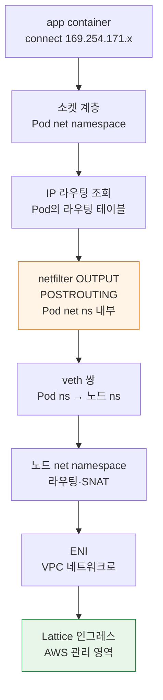
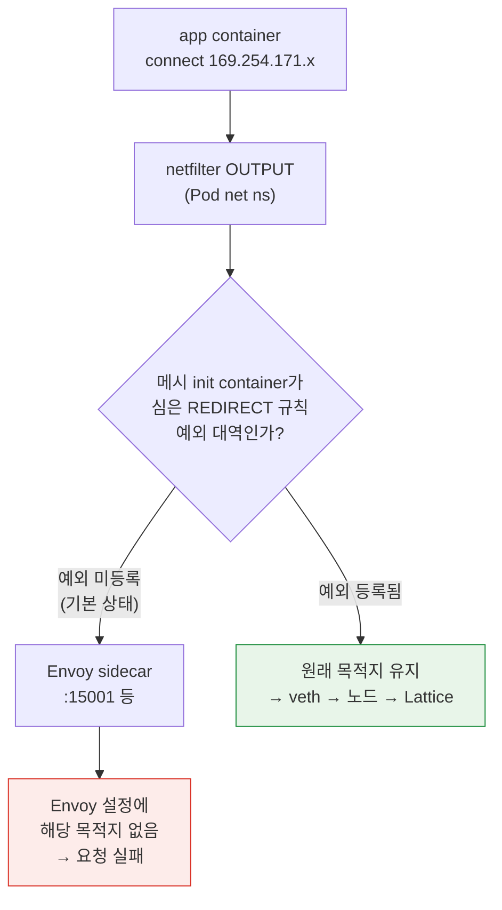
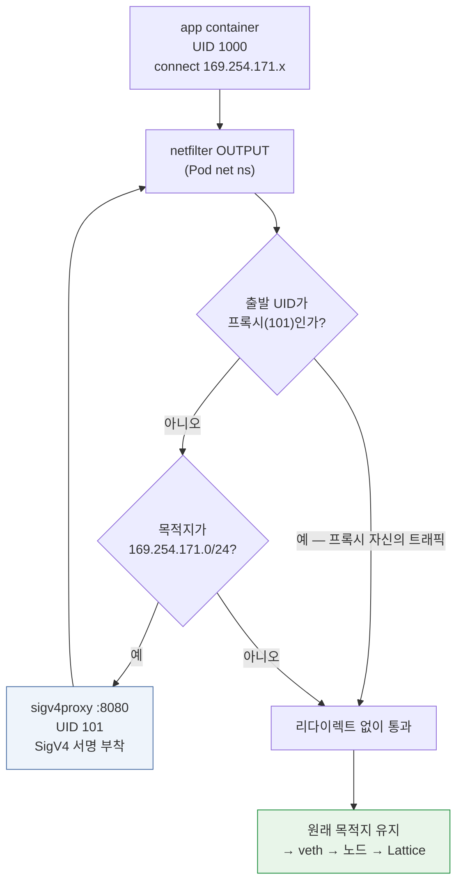

# 커널 데이터패스 — link-local 인터셉트의 실제

> **지원 버전**: Amazon VPC Lattice (GA), AWS Gateway API Controller v1.1+, Linux 6.1 / 6.12 / 6.18 (Amazon Linux 2023)
> **마지막 업데이트**: 2026년 9월 12일

## 이 문서에서 다루는 것

- Pod가 Lattice 주소로 보낸 패킷이 커널 안에서 실제로 어떤 경로를 지나는가
- 사이드카 메시의 iptables 인터셉트와 Lattice 트래픽이 충돌하는 지점을 커널 계층에서 정확히 어디인가
- conntrack이 이 구성에서 어떻게 동작하고, 왜 egress proxy 방식이 규칙 순서에 민감한가

## 왜 이 문서가 필요한가

[04번 문서](./04-networking-basics.md)에서 link-local 주소가 "이 패킷은 인프라가 처리한다"는 표시라고 설명했습니다. 개념으로는 그것으로 충분하지만, **전환 기간에 실제로 터지는 문제들은 커널 계층에 있습니다.**

| 현장 증상 | 커널 계층의 실체 |
|---|---|
| "Lattice 호출이 전부 실패한다" | Envoy iptables REDIRECT가 Lattice 대역까지 가로챔 |
| "예외 CIDR을 넣었는데도 안 된다" | 규칙 순서, 또는 IPv6 대역 누락 |
| "egress proxy를 붙였더니 루프가 돈다" | 프록시 자신의 트래픽이 다시 리다이렉트됨 |
| "간헐적으로 연결이 끊긴다" | conntrack 포화 또는 타임아웃 |
| "일부 노드에서만 실패한다" | 노드별 규칙 상태 불일치, 또는 시각 동기화 |

이 문서는 [04번 문서](./04-networking-basics.md)와 [Linux 커널 섹션](../../kernel/README.md)을 잇는 계층입니다. 커널 일반 개념은 [컨테이너를 지탱하는 커널 기능](../../kernel/01-container-primitives.md)과 [커널 네트워킹 스택](../../kernel/02-network-stack.md)에 있고, 여기서는 **Lattice 구성에 특화된 부분**만 다룹니다.

## 패킷의 여정 — 사이드카가 없는 경우

먼저 깨끗한 TO-BE 상태입니다. Envoy가 없고 애플리케이션이 직접 서명하는 구성입니다.



주목할 점 세 가지입니다.

**① 애플리케이션은 특별한 것을 하지 않습니다.** `169.254.171.x`는 평범한 IPv4 주소이고, `connect()`도 평범합니다. Lattice의 존재를 모릅니다.

**② 라우팅 조회는 Pod의 라우팅 테이블에서 일어납니다.** net namespace가 Pod 경계이므로([컨테이너 커널 기능](../../kernel/01-container-primitives.md)), Pod 안의 `ip route`가 이 결정을 합니다. VPC CNI 구성에서 Pod의 기본 경로는 veth를 통해 노드로 향하고, link-local 대역도 이 기본 경로를 따릅니다.

> **여기가 link-local 관례의 핵심입니다.** `169.254.0.0/16`은 원래 "라우팅되지 않는" 대역인데, Lattice는 이 대역의 패킷이 **VPC 안의 인그레스 엔드포인트까지 도달하도록** 인프라가 유도합니다. 즉 link-local의 의미론을 엄격히 따르는 것이 아니라, **"인프라가 가로챈다"는 신호로 재사용**하고 있습니다. IPv6에서 굳이 link-local(`fe80::/10`) 대신 ULA(`fd00:ec2:80::/64`)를 고른 이유도 같습니다 — 실제로 라우팅되어야 하기 때문입니다.

**③ netfilter 훅이 Pod net namespace 안에서 평가됩니다.** 이것이 다음 절의 충돌이 가능한 이유입니다.

## 충돌 — Envoy iptables 인터셉트

### 사이드카 메시가 심는 것

App Mesh나 Istio의 init container는 Pod의 net namespace 안에서 iptables 규칙을 설치합니다. 핵심 구조는 단순합니다.

```
# 개념적 형태 (실제 규칙은 더 복잡합니다)
OUTPUT  → 커스텀 체인으로 점프
커스텀 체인:
  - Envoy 자신의 UID에서 나온 트래픽 → RETURN (무한 루프 방지)
  - 예외 대역 → RETURN
  - 나머지 전부 → REDIRECT to Envoy 포트
```

`REDIRECT`는 netfilter의 DNAT 계열 타깃으로, **목적지를 로컬 포트로 바꿉니다.** 애플리케이션은 여전히 원래 주소로 보낸다고 생각하지만 패킷은 Envoy로 갑니다.

### 충돌이 일어나는 정확한 지점



즉 충돌은 **Pod net namespace의 `OUTPUT` 훅**에서 일어납니다. Lattice 트래픽도 "Pod에서 나가는 outbound"이므로 규칙에 걸리고, Envoy는 `169.254.171.x`를 자기 클러스터 설정에서 찾을 수 없어 실패합니다.

### 왜 "조용한 실패"가 아니라 명확한 실패인가

이 점은 오히려 다행입니다. Envoy가 목적지를 모르면 대개 **즉시 에러를 반환**하므로(연결 거부나 503), conntrack 포화처럼 조용히 드롭되는 것과 달리 증상이 명확합니다. Envoy 액세스 로그에 알 수 없는 클러스터에 대한 요청으로 남습니다.

**진단 경로**: Lattice 호출이 실패하면 먼저 Envoy 사이드카 로그를 확인하십시오. 거기에 `169.254.171.x`로 향하는 요청이 찍혀 있으면 인터셉트가 원인입니다.

### 예외 등록 — 무엇을 어디에

| 메시 | 설정 |
|---|---|
| App Mesh | init container의 egress 무시 CIDR 목록에 Lattice 대역 추가 |
| Istio | `traffic.sidecar.istio.io/excludeOutboundIPRanges` 애노테이션 |

제외할 대역:

| 대역 | 필수 여부 |
|---|---|
| `169.254.171.0/24` | **필수** |
| `fd00:ec2:80::/64` | **dual-stack 클러스터에서 필수** |

### 실무 함정 네 개

**① IPv6 누락** — IPv4만 제외하고 dual-stack 클러스터에서 간헐적 실패를 겪는 경우입니다. 클라이언트가 AAAA 레코드를 받아 IPv6로 연결을 시도하면 그 경로는 여전히 인터셉트됩니다. **증상이 "가끔 실패"라서 진단이 어렵습니다** — DNS 응답 순서나 클라이언트의 주소 선택에 따라 갈리기 때문입니다.

**② 애노테이션은 새 Pod에만 적용** — Pod 단위 애노테이션은 Pod 생성 시 init container가 읽습니다. 기존 Pod는 재시작해야 합니다.

**③ 규칙 순서** — netfilter는 체인의 규칙을 **위에서 순서대로** 평가하고 첫 매치에서 동작합니다. 예외 `RETURN` 규칙이 `REDIRECT` 규칙보다 **앞에** 있어야 합니다. 메시의 표준 init container는 이 순서를 맞춰주지만, 직접 규칙을 추가하는 경우 순서를 확인해야 합니다.

**④ 다른 link-local 서비스와 혼동** — Pod Identity Agent는 `169.254.170.23`, IMDS는 `169.254.169.254`입니다. Lattice는 `169.254.171.0/24`입니다. **같은 `169.254.0.0/16` 안이지만 다른 대역**이므로, 예외를 `169.254.0.0/16` 전체로 넓게 잡으면 IMDS·Pod Identity 트래픽까지 메시 인터셉트에서 빠집니다. 그것이 의도한 것일 수도 있지만(대개 이 트래픽은 인터셉트 대상이 아니어야 합니다), **의도를 명시하고 결정하십시오.**

### 검증

```bash
# Pod의 net namespace에서 실제 규칙 확인
kubectl exec <pod> -c <sidecar-or-debug> -- iptables -t nat -L -n -v

# 목적지로의 경로가 Envoy를 타는지 확인
kubectl exec <pod> -c app -- curl -sv --max-time 5 \
  http://<lattice-dns>/health

# Envoy 로그에 해당 요청이 찍히면 인터셉트되고 있다는 증거
kubectl logs <pod> -c envoy --tail=50
```

전환 시작 **전에** 이 검증을 하시기 바랍니다. [06번 문서](./06-constraints.md)의 제약 4가 이것입니다.

## egress proxy 방식의 커널 계층

[03번 문서](./03-auth-flow.md)의 서명 방식 ②(egress proxy)는 **같은 iptables 메커니즘을 반대 목적으로** 씁니다.

### 구조



aws-samples 레퍼런스 구현의 구조입니다 — init container가 iptables로 **`169.254.171.0/24`로 향하는 트래픽만** 로컬 8080으로 리다이렉트하고, 프록시가 SigV4 서명을 붙여 내보냅니다.

### UID 기반 예외가 필수인 이유

그림의 첫 분기가 **무한 루프를 막는 장치**입니다.

프록시가 서명을 붙여 Lattice로 내보내는 그 패킷도 목적지가 `169.254.171.x`입니다. UID 예외가 없으면 그 패킷이 다시 규칙에 걸려 자기 자신에게 리다이렉트되고, 루프가 돕니다.

그래서 프록시를 **전용 UID로 실행하고**(레퍼런스 구현은 101), 그 UID에서 나온 트래픽은 `RETURN`시킵니다. netfilter의 `owner` 매치(`-m owner --uid-owner`)가 이를 가능하게 합니다.

**실무 함의**: 프록시 컨테이너의 `runAsUser`와 iptables 규칙의 UID가 **반드시 일치**해야 합니다. 한쪽만 바꾸면 루프가 돌거나 서명이 붙지 않습니다. 이것은 매니페스트를 커스터마이즈할 때 가장 깨지기 쉬운 연결입니다.

### 두 iptables 규칙이 공존할 때

전환 기간에 **메시 인터셉트 제외 + 서명 프록시 리다이렉트**가 같은 Pod에 동시에 있을 수 있습니다. [06번 문서](./06-constraints.md)의 제약 4에서 "두 규칙의 순서와 상호작용을 반드시 테스트하라"고 한 것이 이것입니다.

논리적으로 필요한 순서는 이렇습니다.

| 순서 | 규칙 | 목적 |
|---|---|---|
| 1 | 프록시 UID → `RETURN` | 루프 방지 (최우선) |
| 2 | Lattice 대역 → 서명 프록시로 `REDIRECT` | 서명 부착 |
| 3 | 메시의 기타 예외 대역 → `RETURN` | 메시 인터셉트 제외 |
| 4 | 나머지 → Envoy로 `REDIRECT` | 메시 인터셉트 |

**규칙 2가 규칙 4보다 앞에 있어야** Lattice 트래픽이 Envoy가 아니라 서명 프록시로 갑니다. 두 init container가 각자 규칙을 심으면 순서가 실행 순서에 의존하므로, **실제 규칙을 덤프해서 확인**하는 것이 유일하게 신뢰할 수 있는 검증입니다.

::: warning 확인 필요
위 순서는 netfilter의 평가 규칙(체인 내 순차 평가, 첫 매치에서 동작)과 각 규칙의 목적에서 **논리적으로 도출한 것**이며, 특정 메시 버전의 init container가 심는 실제 규칙 순서를 검증한 것은 아닙니다.

메시 구현마다 체인 이름과 삽입 위치가 다르므로, **반드시 대상 환경에서 `iptables -t nat -L -n -v`로 실제 규칙을 덤프해 순서를 확인**하십시오. 두 init container의 실행 순서는 Pod 스펙의 `initContainers` 배열 순서로 정해집니다.
:::

## conntrack — 이 구성에서의 거동

### Lattice 트래픽이 conntrack에 남기는 것

[컨테이너 커널 기능](../../kernel/01-container-primitives.md)에서 본 대로 NAT는 conntrack 항목을 만듭니다. 이 구성에서 항목이 생기는 지점을 정리하면:

| 구성 | conntrack 항목이 생기는 곳 |
|---|---|
| 애플리케이션 직접 서명 | Pod net ns(NAT 없으면 최소), 노드 ns의 SNAT |
| egress proxy 서명 | **Pod net ns의 REDIRECT(DNAT)** + 프록시→Lattice 연결 + 노드 ns SNAT |
| 메시 병행 운영 | 위에 더해 메시 인터셉트 경로의 항목 |

즉 **egress proxy 방식은 conntrack 항목을 더 만듭니다.** REDIRECT가 DNAT이므로 되돌릴 정보를 기억해야 하기 때문입니다.

고연결 환경에서 이것이 의미하는 바: 서명 프록시 도입이 **conntrack 사용량을 늘리므로**, [03번 문서](./03-auth-flow.md)의 방식 선택 시 노드의 conntrack 여유를 함께 고려해야 합니다. 공통 라이브러리 방식(①)은 이 추가 부담이 없습니다.

### 진단

conntrack 포화는 [커널 섹션](../../kernel/03-eks-node-tuning.md)에서 다룬 대로 **조용히 연결을 드롭**합니다. Lattice 구성에서 "간헐적으로 연결이 끊긴다"면 이것이 후보입니다.

```bash
# 포화 직접 증거
conntrack -S | grep -E "insert_failed|drop"

# Lattice 대역으로의 항목 확인
conntrack -L 2>/dev/null | grep 169.254.171 | head

# 사용률
echo "$(cat /proc/sys/net/netfilter/nf_conntrack_count) / $(cat /proc/sys/net/netfilter/nf_conntrack_max)"
```

**Lattice 실패와 conntrack 포화를 구별하는 방법**: conntrack 포화는 Lattice뿐 아니라 **모든 신규 연결**에 영향을 줍니다. Lattice 호출만 실패하고 다른 통신은 정상이면 conntrack이 아니라 인터셉트나 인증 문제입니다. 반대로 전반적으로 연결이 불안정하면 conntrack을 먼저 보십시오.

## Security Group과 커널의 관계

[04번 문서](./04-networking-basics.md)에서 prefix list로 SG를 여는 것을 다뤘습니다. 커널 관점에서 한 가지 덧붙일 것이 있습니다.

**Security Group은 커널의 netfilter가 아닙니다.** VPC 수준에서 ENI에 적용되는 AWS의 상태 기반 방화벽이고, 인스턴스 밖(하이퍼바이저/네트워크 인프라)에서 집행됩니다.

이것이 의미하는 바:

- **노드에서 `iptables -L`을 봐도 SG 규칙은 보이지 않습니다.** 두 계층이 별개입니다
- SG에서 막히면 패킷이 **노드 커널에 도달하지 않습니다** → `tcpdump`로도 안 보입니다
- 따라서 **"tcpdump에 아무것도 안 잡힌다"는 SG나 라우팅 문제의 신호**입니다. 커널까지 왔는데 드롭된 것이라면 카운터에 남습니다

진단 순서로 정리하면:

| 관측 결과 | 의심 지점 |
|---|---|
| `tcpdump`에 송신 패킷이 안 보임 | Pod 내부 문제 — 라우팅, 인터셉트, DNS |
| 송신은 보이는데 응답이 없음 | SG(양방향 확인), 라우팅, Lattice 측 |
| 응답이 오는데 애플리케이션이 못 받음 | 소켓 버퍼, 또는 인터셉트 경로의 문제 |
| 드롭 카운터 증가 | conntrack 또는 qdisc ([커널 네트워킹 스택](../../kernel/02-network-stack.md)) |

## 노드별 불일치 — "일부 노드에서만 실패한다"

이 증상은 원인이 몇 가지로 좁혀집니다.

| 원인 | 확인 |
|---|---|
| **노드 SG가 다름** | 노드 그룹별로 prefix list 인바운드가 적용되었는지 |
| **커널 버전이 다름** | `kernel-default` AMI라 노드 교체 시점에 따라 6.1/6.18 혼재 ([커널 튜닝](../../kernel/03-eks-node-tuning.md)) |
| **conntrack 설정이 다름** | 부트스트랩 시점의 ConfigMap 상태에 따라 |
| **시각 동기화** | `x-amz-date` 5분 오차 — 특정 노드만 403 ([03번 문서](./03-auth-flow.md)) |
| **Pod 재시작 여부** | 애노테이션 변경이 구 Pod에 미적용 |

**"일부 노드"라는 패턴 자체가 진단 정보입니다.** 전체 실패는 설정·인증 문제이고, 노드 단위 실패는 노드 상태 불일치입니다.

## 정리

- Lattice로 향하는 패킷은 **평범한 IPv4/IPv6 연결**입니다. 특별한 처리는 애플리케이션이 아니라 인프라 쪽에 있습니다.
- link-local 관례는 **"라우팅되지 않는 대역"의 의미론을 엄격히 따르는 것이 아니라 "인프라가 가로챈다"는 신호로 재사용**하는 것입니다. IPv6에서 ULA를 고른 이유가 여기 있습니다.
- 메시 충돌은 **Pod net namespace의 `OUTPUT` 훅**에서 일어납니다. 다행히 조용한 실패가 아니라 Envoy 로그에 증거가 남습니다.
- 예외 등록의 함정: **IPv6 누락**(간헐적 실패로 나타남), 애노테이션이 새 Pod에만 적용, **규칙 순서**, `169.254.0.0/16` 전체 제외 시 IMDS·Pod Identity까지 포함됨.
- egress proxy 방식은 **UID 기반 루프 방지**가 필수이며, 프록시의 `runAsUser`와 iptables UID가 일치해야 합니다. 또한 **conntrack 항목을 추가로 만듭니다.**
- 두 iptables 규칙이 공존할 때 **실제 규칙을 덤프해 순서를 확인**하는 것이 유일하게 신뢰할 수 있는 검증입니다.
- **Security Group은 커널 netfilter가 아닙니다.** SG에서 막히면 `tcpdump`에도 안 잡히므로, "아무것도 안 잡힌다"가 진단 정보가 됩니다.

## 참고 자료

- [Linux 커널 개요](../../kernel/README.md) — 이 문서의 일반 개념 배경
- [컨테이너를 지탱하는 커널 기능](../../kernel/01-container-primitives.md) — namespace, netfilter, conntrack
- [커널 네트워킹 스택](../../kernel/02-network-stack.md) — 패킷 경로와 관측 지점
- [EKS 노드 커널 튜닝](../../kernel/03-eks-node-tuning.md) — conntrack 설정 경로
- [aws-samples — IAM authentication with VPC Lattice and EKS](https://github.com/aws-samples/migrating-from-aws-app-mesh-to-amazon-vpc-lattice/blob/main/vpc-lattice-config/IAMAUTH.md)
- [AWS Gateway API Controller — Deploy the controller](https://www.gateway-api-controller.eks.aws.dev/latest/guides/deploy/)
- [iptables-extensions(8) — owner match](https://man7.org/linux/man-pages/man8/iptables-extensions.8.html)
