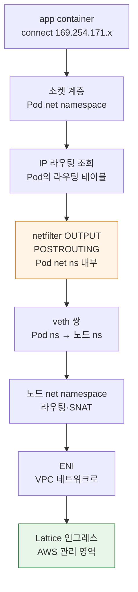
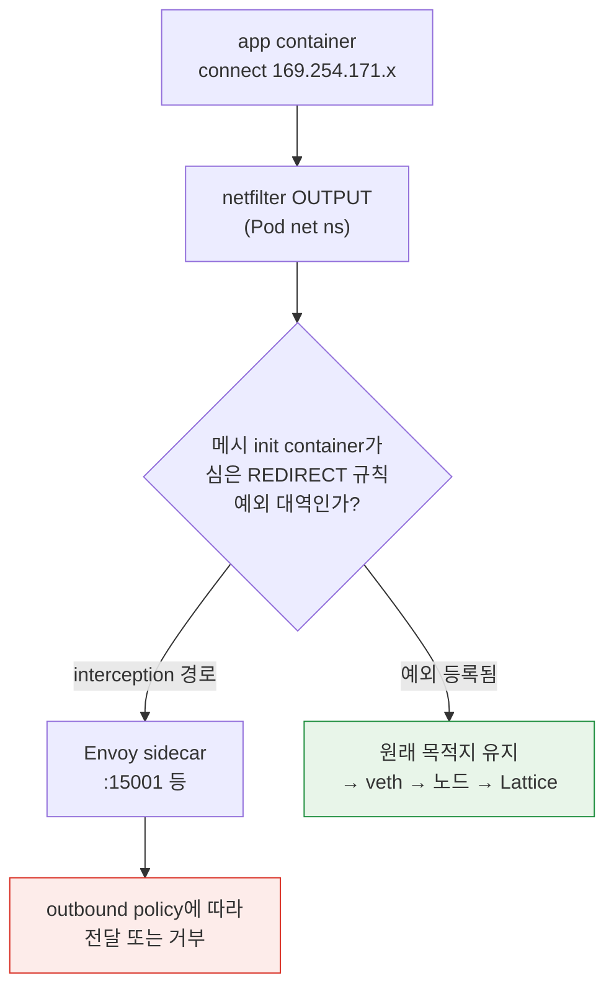
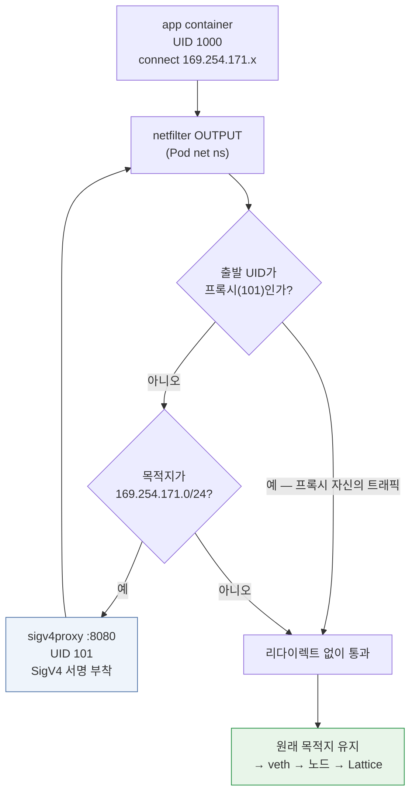

# 커널 데이터패스 — link-local 인터셉트의 실제

> **범위**: VPC Lattice service/resource API와 AWS Gateway API Controller. 선택한 release와 설치 CRD를 확인합니다.
> **마지막 업데이트**: 2026년 9월 13일

## 이 문서에서 다루는 것

- Pod가 Lattice 주소로 보낸 패킷이 커널 안에서 실제로 어떤 경로를 지나는가
- 사이드카 메시의 iptables 인터셉트와 Lattice 트래픽이 충돌하는 지점을 커널 계층에서 정확히 어디인가
- conntrack이 이 구성에서 어떻게 동작하고, 왜 egress proxy 방식이 규칙 순서에 민감한가

## 왜 이 문서가 필요한가

[04번 문서](./04-networking-basics.md)에서 link-local 주소가 "이 패킷은 인프라가 처리한다"는 표시라고 설명했습니다. 개념으로는 그것으로 충분하지만, **전환 기간에 실제로 터지는 문제들은 커널 계층에 있습니다.**

| 현장 증상 | 커널 계층의 실체 |
|---|---|
| "Lattice 호출이 전부 실패한다" | Envoy iptables REDIRECT가 Lattice 대역까지 가로챔 |
| "예외 CIDR을 넣었는데도 안 된다" | 규칙 순서, 또는 IPv6 대역 누락 |
| "egress proxy를 붙였더니 루프가 돈다" | 프록시 자신의 트래픽이 다시 리다이렉트됨 |
| "간헐적으로 연결이 끊긴다" | conntrack 포화 또는 타임아웃 |
| "일부 노드에서만 실패한다" | 노드별 규칙 상태 불일치, 또는 시각 동기화 |

이 문서는 [04번 문서](./04-networking-basics.md)와 [Linux 커널 섹션](../../kernel/README.md)을 잇는 계층입니다. 커널 일반 개념은 [컨테이너를 지탱하는 커널 기능](../../kernel/01-container-primitives.md)과 [커널 네트워킹 스택](../../kernel/02-network-stack.md)에 있고, 여기서는 **Lattice 구성에 특화된 부분**만 다룹니다.

## 패킷의 여정 — 사이드카가 없는 경우

먼저 깨끗한 TO-BE 상태입니다. Envoy가 없고 애플리케이션이 직접 서명하는 구성입니다.



주목할 점 세 가지입니다.

**① IP stack은 일반 연결을 사용합니다.** 인증은 별개이며 앱이나 signing proxy가 선택한 Lattice 요청 인증 경로를 구현해야 합니다.

**② 라우팅 조회는 Pod의 라우팅 테이블에서 일어납니다.** net namespace가 Pod 경계이므로([컨테이너 커널 기능](../../kernel/01-container-primitives.md)), Pod 안의 `ip route`가 이 결정을 합니다. VPC CNI 구성에서 Pod의 기본 경로는 veth를 통해 노드로 향하고, link-local 대역도 이 기본 경로를 따릅니다.

> 이 그림은 개념적인 VPC CNI 경로이며 미공개 AWS 내부 구현의 단정이 아닙니다. 일반 link-local/ULA 주소 scope와 AWS 서비스별 routing 동작은 별개입니다. 대상 환경의 실제 route와 지원 연결을 확인합니다.

**③ netfilter 훅이 Pod net namespace 안에서 평가됩니다.** 이것이 다음 절의 충돌이 가능한 이유입니다.

## 충돌 — Envoy iptables 인터셉트

### 사이드카 메시가 심는 것

App Mesh나 Istio의 init container는 Pod의 net namespace 안에서 iptables 규칙을 설치합니다. 핵심 구조는 단순합니다.

```text
# 개념적 형태 (실제 규칙은 더 복잡합니다)
OUTPUT  → 커스텀 체인으로 점프
커스텀 체인:
  - Envoy 자신의 UID에서 나온 트래픽 → RETURN (무한 루프 방지)
  - 예외 대역 → RETURN
  - 나머지 전부 → REDIRECT to Envoy 포트
```

`REDIRECT`는 netfilter의 DNAT 계열 타깃으로, **목적지를 로컬 포트로 바꿉니다.** 애플리케이션은 여전히 원래 주소로 보낸다고 생각하지만 패킷은 Envoy로 갑니다.

### 충돌이 일어나는 정확한 지점



Mesh interception은 **Pod netns OUTPUT**에서 일어날 수 있습니다. 이후 전달·실패·서명 필드 변경 여부는 Envoy outbound policy와 설정한 대상에 달려 있습니다. Envoy log의 요청은 통과 사실을 보여주지만 단독으로 실패 원인을 증명하지는 않습니다.

### Proxy 증거를 설정과 함께 해석

제한된 proxy는 미등록 대상에 오류를 반환할 수 있지만 allow-any/passthrough policy는 전달할 수 있습니다. 제외 규칙이 없으면 항상 즉시 503이라고 가정하지 말고 route와 반환 오류를 함께 검증합니다.

**진단 경로**: Lattice 호출이 실패하면 먼저 Envoy 사이드카 로그를 확인하십시오. 거기에 `169.254.171.x`로 향하는 요청이 찍혀 있으면 인터셉트가 원인입니다.

### 예외 등록 — 무엇을 어디에

| 메시 | 설정 |
|---|---|
| App Mesh | init container의 egress 무시 CIDR 목록에 Lattice 대역 추가 |
| Istio | `traffic.sidecar.istio.io/excludeOutboundIPRanges` 애노테이션 |

제외할 대역:

| 대역 | 필수 여부 |
|---|---|
| `169.254.171.0/24` | **필수** |
| `fd00:ec2:80::/64` | **dual-stack 클러스터에서 필수** |

### 실무 함정 네 개

**① IPv6 누락** — IPv4만 제외하고 dual-stack 클러스터에서 간헐적 실패를 겪는 경우입니다. 클라이언트가 AAAA 레코드를 받아 IPv6로 연결을 시도하면 그 경로는 여전히 인터셉트됩니다. **증상이 "가끔 실패"라서 진단이 어렵습니다** — DNS 응답 순서나 클라이언트의 주소 선택에 따라 갈리기 때문입니다.

**② 애노테이션은 새 Pod에만 적용** — Pod 단위 애노테이션은 Pod 생성 시 init container가 읽습니다. 기존 Pod는 재시작해야 합니다.

**③ 규칙 순서** — netfilter는 체인의 규칙을 **위에서 순서대로** 평가하고 첫 매치에서 동작합니다. 예외 `RETURN` 규칙이 `REDIRECT` 규칙보다 **앞에** 있어야 합니다. 메시의 표준 init container는 이 순서를 맞춰주지만, 직접 규칙을 추가하는 경우 순서를 확인해야 합니다.

**④ 다른 link-local 서비스와 혼동** — Pod Identity Agent는 `169.254.170.23`, IMDS는 `169.254.169.254`입니다. Lattice는 `169.254.171.0/24`입니다. **같은 `169.254.0.0/16` 안이지만 다른 대역**이므로, 예외를 `169.254.0.0/16` 전체로 넓게 잡으면 IMDS·Pod Identity 트래픽까지 메시 인터셉트에서 빠집니다. 그것이 의도한 것일 수도 있지만(대개 이 트래픽은 인터셉트 대상이 아니어야 합니다), **의도를 명시하고 결정하십시오.**

### 검증

```bash
# 명시적인 시험 대상이 필요하며 진단 조회만 수행합니다.
: "${LATTICE_CONTEXT:?}" "${LATTICE_NAMESPACE:?}" "${LATTICE_POD:?}"
: "${LATTICE_DIAG_CONTAINER:?}" "${LATTICE_APP_CONTAINER:?}" "${LATTICE_URL:?}"
kubectl --context "$LATTICE_CONTEXT" -n "$LATTICE_NAMESPACE" \
  exec "$LATTICE_POD" -c "$LATTICE_DIAG_CONTAINER" -- iptables -t nat -L -n -v

# 서명 없는 연결 관측이므로 AWS_IAM에서 거부될 수 있습니다.
kubectl --context "$LATTICE_CONTEXT" -n "$LATTICE_NAMESPACE" \
  exec "$LATTICE_POD" -c "$LATTICE_APP_CONTAINER" -- \
  curl -sv --max-time 5 "$LATTICE_URL"

# 설정된 proxy container가 있을 때만 해당 log를 확인합니다.
kubectl --context "$LATTICE_CONTEXT" -n "$LATTICE_NAMESPACE" \
  logs "$LATTICE_POD" -c "$LATTICE_DIAG_CONTAINER" --tail=50
```

전환 시작 **전에** 이 검증을 하시기 바랍니다. [06번 문서](./06-constraints.md)의 제약 4가 이것입니다.

## egress proxy 방식의 커널 계층

[03번 문서](./03-auth-flow.md)의 서명 방식 ②(egress proxy)는 **같은 iptables 메커니즘을 반대 목적으로** 씁니다.

### 구조



aws-samples 레퍼런스 구현의 구조입니다 — init container가 iptables로 **`169.254.171.0/24`로 향하는 트래픽만** 로컬 8080으로 리다이렉트하고, 프록시가 SigV4 서명을 붙여 내보냅니다.

### UID 기반 예외가 필수인 이유

그림의 첫 분기가 **무한 루프를 막는 장치**입니다.

프록시가 서명을 붙여 Lattice로 내보내는 그 패킷도 목적지가 `169.254.171.x`입니다. UID 예외가 없으면 그 패킷이 다시 규칙에 걸려 자기 자신에게 리다이렉트되고, 루프가 돕니다.

**전용 proxy UID**와 일치하는 owner 예외를 사용합니다. 그림의 UID 101은 예시이며 release마다 고정된 값이라고 가정하지 말고 실제 sample/설치 manifest를 확인합니다. 앱과 권한을 분리합니다.

**실무 함의**: 프록시 컨테이너의 `runAsUser`와 iptables 규칙의 UID가 **반드시 일치**해야 합니다. 한쪽만 바꾸면 루프가 돌거나 서명이 붙지 않습니다. 이것은 매니페스트를 커스터마이즈할 때 가장 깨지기 쉬운 연결입니다.

### 두 iptables 규칙이 공존할 때

전환 기간에 **메시 인터셉트 제외 + 서명 프록시 리다이렉트**가 같은 Pod에 동시에 있을 수 있습니다. [06번 문서](./06-constraints.md)의 제약 4에서 "두 규칙의 순서와 상호작용을 반드시 테스트하라"고 한 것이 이것입니다.

논리적으로 필요한 순서는 이렇습니다.

| 순서 | 규칙 | 목적 |
|---|---|---|
| 1 | 프록시 UID → `RETURN` | 루프 방지 (최우선) |
| 2 | Lattice 대역 → 서명 프록시로 `REDIRECT` | 서명 부착 |
| 3 | 메시의 기타 예외 대역 → `RETURN` | 메시 인터셉트 제외 |
| 4 | 나머지 → Envoy로 `REDIRECT` | 메시 인터셉트 |

**규칙 2가 규칙 4보다 앞에 있어야** Lattice 트래픽이 Envoy가 아니라 서명 프록시로 갑니다. 두 init container가 각자 규칙을 심으면 순서가 실행 순서에 의존합니다.

다행히 메시 쪽 순서는 확인이 가능합니다 — Istio의 경우 아래에서 소스로 검증했습니다.

### Istio의 실제 규칙 순서 (소스 확인)

Istio의 `istio-iptables`(`tools/istio-iptables/pkg/capture/run.go`)가 `ISTIO_OUTPUT` 체인에 규칙을 **append하는 순서**입니다.

| 순서 | 규칙 | 목적 |
|---|---|---|
| 1 | 포트 기반 제외 → `RETURN` | "connections back to self" 리다이렉트보다 먼저 적용되어야 함 (소스 주석) |
| 2 | loopback·자기 호출 처리 | `appN => Envoy => Envoy => appN` 경로 처리 |
| 3 | **`-m owner --uid-owner <proxy-uid>` → `RETURN`** | **루프 방지.** 소스 주석: "Avoid infinite loops. Don't redirect Envoy traffic directly back to Envoy" |
| 4 | **제외 CIDR(`excludeOutboundIPRanges`) → `RETURN`** | 인터셉트 대상에서 제외 |
| 5 | 포함 포트 처리 | |
| 6 | **`-j ISTIO_REDIRECT` (와일드카드 catch-all)** | 나머지 전부를 Envoy로 |

**핵심 확인 사항**: 제외 CIDR의 `RETURN`(4)이 catch-all `REDIRECT`(6)보다 **앞에 놓입니다.** 따라서 Istio의 `traffic.sidecar.istio.io/excludeOutboundIPRanges`에 Lattice 대역을 넣는 것만으로 올바르게 동작하며, 별도의 순서 조정이 필요하지 않습니다.

그리고 **프록시 UID `RETURN`(3)이 제외 CIDR보다도 먼저**입니다. 즉 Istio 자신도 이 문서에서 설명한 UID 기반 루프 방지를 같은 방식으로 쓰고 있습니다.

::: warning 확인 필요
위 순서는 **Istio** 소스에서 확인한 것입니다. **App Mesh의 init container가 심는 실제 규칙 순서는 검증하지 못했습니다** — 별개 구현이며, App Mesh는 2026년 9월 30일 지원이 종료됩니다.

또한 **서명 프록시 init container를 함께 쓰는 구성**은 두 init container가 각자 규칙을 심으므로 순서가 `initContainers` 배열 순서에 의존합니다. 이 조합은 **대상 환경에서 `iptables -t nat -L -n -v`로 실제 규칙을 덤프해 확인**하십시오.
:::

## conntrack — 이 구성에서의 거동

### Lattice 트래픽이 conntrack에 남기는 것

[컨테이너 커널 기능](../../kernel/01-container-primitives.md)에서 본 대로 NAT는 conntrack 항목을 만듭니다. 이 구성에서 항목이 생기는 지점을 정리하면:

| 구성 | 확인할 tracking |
|---|---|
| 앱 직접 서명 | NAT 없이도 Pod/node tracking 가능. 실제 CNI 경로와 SNAT 확인 |
| Egress 서명 proxy | 설정에 따른 app-to-proxy·proxy-to-service 연결과 NAT. Connection pooling에 따라 개수 변화 |
| Mesh 공존 | 추가 경로와 namespace 확인. Proxy 수만으로 고정 배수를 추론하지 않음 |

Egress proxy는 app-to-proxy와 proxy-to-service 연결을 분리합니다. Tracking 비용은 namespace·연결 재사용·NAT 설정에 달려 있으며 proxy 수만으로 node table의 고정 증가를 추론하지 않습니다.

대표 부하에서 Pod/node conntrack과 eBPF map 사용량을 측정합니다. Proxy는 local 연결 구간을 추가하면서 upstream 연결을 pooling할 수도 있으므로 보편적인 배수 대신 실제 절충을 평가합니다.

### 진단

conntrack 포화는 [커널 섹션](../../kernel/03-eks-node-tuning.md)에서 다룬 대로 **조용히 연결을 드롭**합니다. Lattice 구성에서 "간헐적으로 연결이 끊긴다"면 이것이 후보입니다.

```bash
# 삽입/drop 신호를 count/max 및 kernel log와 함께 확인합니다.
conntrack -S | grep -E "insert_failed|drop"

# Lattice 대역으로의 항목 확인
conntrack -L | grep 169.254.171 | head

# 사용률
echo "$(cat /proc/sys/net/netfilter/nf_conntrack_count) / $(cat /proc/sys/net/netfilter/nf_conntrack_max)"
```

일부 경로 실패만으로 conntrack 압력을 배제할 수 없습니다. Namespace·zone·table·연결 재사용·packet 시점이 다를 수 있습니다. 영향 경로의 count/max·drop/insert counter·log를 연결하며 다른 대상의 성공 여부만으로 진단하지 않습니다.

## Security Group과 커널의 관계

[04번 문서](./04-networking-basics.md)에서 prefix list로 SG를 여는 것을 다뤘습니다. 커널 관점에서 한 가지 덧붙일 것이 있습니다.

**Security Group은 커널의 netfilter가 아닙니다.** VPC 수준에서 ENI에 적용되는 AWS의 상태 기반 방화벽이고, 인스턴스 밖(하이퍼바이저/네트워크 인프라)에서 집행됩니다.

이것이 의미하는 바:

- Node iptables 목록에는 AWS SG 규칙이 없습니다.
- 전달 전에 거부된 inbound packet은 수신 node의 capture 지점에 나타나지 않습니다.
- Outbound packet은 외부 SG에서 drop되기 전에 송신 측에서 capture될 수 있습니다. `tcpdump`는 interface·namespace·방향에 따라 해석하며 응답 부재만으로 SG 문제를 확정하지 않습니다.

진단 순서로 정리하면:

| 관측 결과 | 의심 지점 |
|---|---|
| `tcpdump`에 송신 패킷이 안 보임 | Pod 내부 문제 — 라우팅, 인터셉트, DNS |
| 송신은 보이는데 응답이 없음 | SG(양방향 확인), 라우팅, Lattice 측 |
| 응답이 오는데 애플리케이션이 못 받음 | 소켓 버퍼, 또는 인터셉트 경로의 문제 |
| 드롭 카운터 증가 | conntrack 또는 qdisc ([커널 네트워킹 스택](../../kernel/02-network-stack.md)) |

## 노드별 불일치 — "일부 노드에서만 실패한다"

이 증상은 원인이 몇 가지로 좁혀집니다.

| 원인 | 확인 |
|---|---|
| **노드 SG가 다름** | 노드 그룹별로 prefix list 인바운드가 적용되었는지 |
| **커널 버전이 다름** | `kernel-default` AMI라 노드 교체 시점에 따라 6.1/6.18 혼재 ([커널 튜닝](../../kernel/03-eks-node-tuning.md)) |
| **conntrack 설정이 다름** | 부트스트랩 시점의 ConfigMap 상태에 따라 |
| **시각 동기화** | `x-amz-date` 5분 오차 — 특정 노드만 403 ([03번 문서](./03-auth-flow.md)) |
| **Pod 재시작 여부** | 애노테이션 변경이 구 Pod에 미적용 |

**"일부 노드"라는 패턴 자체가 진단 정보입니다.** 전체 실패는 설정·인증 문제이고, 노드 단위 실패는 노드 상태 불일치입니다.

## 정리

- Lattice로 향하는 패킷은 **평범한 IPv4/IPv6 연결**입니다. 특별한 처리는 애플리케이션이 아니라 인프라 쪽에 있습니다.
- IPv4 link-local·IPv6 ULA·문서화된 AWS 서비스 경로를 구분하고 prefix만으로 내부 routing을 추론하지 않습니다.
- Pod netns OUTPUT·outbound policy·실제 proxy log를 확인합니다. Interception이 항상 실패를 뜻하지는 않습니다.
- 예외 등록의 함정: **IPv6 누락**(간헐적 실패로 나타남), 애노테이션이 새 Pod에만 적용, **규칙 순서**, `169.254.0.0/16` 전체 제외 시 IMDS·Pod Identity까지 포함됨.
- egress proxy 방식은 **UID 기반 루프 방지**가 필수이며, 프록시의 `runAsUser`와 iptables UID가 일치해야 합니다. 또한 **conntrack 항목을 추가로 만듭니다.**
- 두 iptables 규칙이 공존할 때 **실제 규칙을 덤프해 순서를 확인**하는 것이 유일하게 신뢰할 수 있는 검증입니다.
- SG와 netfilter는 다른 계층이며 packet capture 가시성은 방향과 capture 지점에 따라 다릅니다.

## 참고 자료

- [Linux 커널 개요](../../kernel/README.md) — 이 문서의 일반 개념 배경
- [컨테이너를 지탱하는 커널 기능](../../kernel/01-container-primitives.md) — namespace, netfilter, conntrack
- [커널 네트워킹 스택](../../kernel/02-network-stack.md) — 패킷 경로와 관측 지점
- [EKS 노드 커널 튜닝](../../kernel/03-eks-node-tuning.md) — conntrack 설정 경로
- [aws-samples — IAM authentication with VPC Lattice and EKS](https://github.com/aws-samples/migrating-from-aws-app-mesh-to-amazon-vpc-lattice/blob/main/vpc-lattice-config/IAMAUTH.md)
- [AWS Gateway API Controller — Deploy the controller](https://www.gateway-api-controller.eks.aws.dev/latest/guides/deploy/)
- [iptables-extensions(8) — owner match](https://man7.org/linux/man-pages/man8/iptables-extensions.8.html)
- [istio/istio — tools/istio-iptables/pkg/capture/run.go](https://github.com/istio/istio/blob/master/tools/istio-iptables/pkg/capture/run.go) — 규칙 순서의 1차 근거


진단 명령에는 선택한 container/net namespace의 해당 도구와 권한이 필요합니다. 서명 없는 HTTP 요청 거부는 IAM 설정 실패의 증명이 아닙니다. 인가 시험은 검토한 서명 경로를 사용하고 verbose log에서 자격 증명을 제거합니다.
