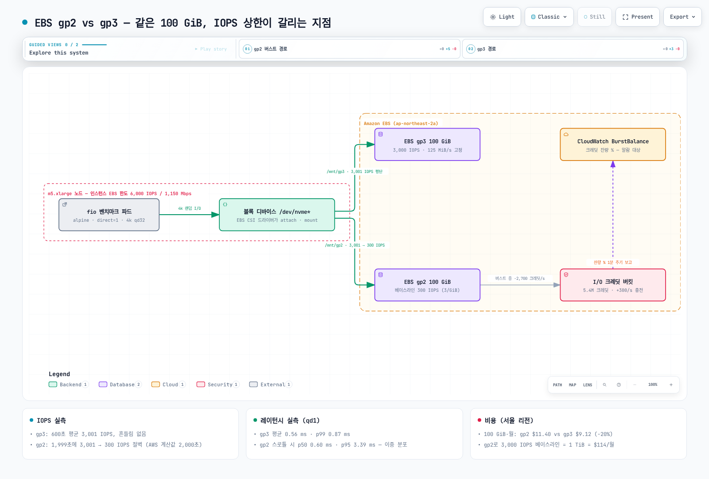
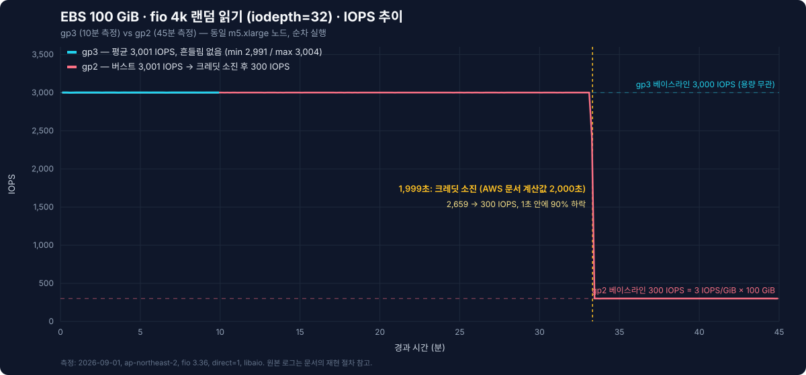

# EBS gp2 vs gp3 실측 벤치마크

> **지원 버전**: Kubernetes 1.36 (Amazon EKS), EBS CSI 드라이버, fio 3.36
> **마지막 업데이트**: 2026년 9월 2일

"gp2를 gp3로 바꾸면 20% 싸지고 성능은 같거나 낫다"는 AWS 문서의 한 줄은 유명하지만, Kubernetes PVC 위에서 그 차이가 **언제, 어떤 모양으로** 나타나는지 직접 잰 그래프는 찾기 어렵습니다. 이 문서는 EKS 노드 하나에 **같은 100 GiB짜리 gp2 PVC와 gp3 PVC**를 붙이고 fio로 45분간 두들긴 결과입니다. 핵심은 "gp2가 느리다"가 아닙니다 — **gp2는 33분 동안 gp3와 완전히 같고, 그 다음 1초 만에 10분의 1이 됩니다.** 모든 숫자는 이 문서의 매니페스트와 fio 명령으로 재현할 수 있습니다.



[🔍 인터랙티브 다이어그램 보기](https://www.atomai.click/kubernetes-docs/archmaps/ko-storage-01-ebs-gp2-gp3-benchmark-0.html)

## TL;DR — 측정 결과 요약

| 측정 항목 (100 GiB, m5.xlarge) | gp3 | gp2 |
|-------------------------------|-----|-----|
| 4k 랜덤 읽기 IOPS (qd32) | **3,001** 평균, 600초 내내 평탄 (min 2,991) | **3,001 → 300**, 1,999초에 절벽 |
| 4k 랜덤 읽기 p99 레이턴시 (qd32) | 12.9 ms | 109.6 ms (절벽 이후 구간이 지배) |
| 4k 랜덤 쓰기 IOPS (qd32, 크레딧 소진 후) | **3,025** | 601 (부분 충전된 크레딧 소모분 포함) |
| 4k 랜덤 읽기 레이턴시 (qd1) | 평균 **0.56 ms** / p99 0.87 ms | 평균 1.65 ms — p50 0.60 / p95 3.39 ms 이중 분포 |
| 1 MiB 순차 읽기 / 쓰기 | 127 / 126 MiB/s (125 MiB/s 베이스라인) | 130 / 129 MiB/s (≤170 GiB는 128 MiB/s 상한) |
| 월 비용 (서울 리전, 100 GiB) | **$9.12** | $11.40 |

한 줄 요약: **같은 값을 내고 gp2를 쓰면, 33분짜리 시한부 3,000 IOPS를 25% 더 비싸게 사는 것입니다.**

## 테스트 환경

| 항목 | 값 |
|------|-----|
| 클러스터 | Amazon EKS, Kubernetes 1.36, ap-northeast-2 |
| 노드 | **m5.xlarge** (4 vCPU, 16 GiB), Karpenter 프로비저닝 — 인스턴스 EBS 한도 베이스라인 6,000 IOPS / 1,150 Mbps(≈137 MiB/s), 버스트 18,750 IOPS / 4,750 Mbps |
| 볼륨 | EBS **gp2 100 GiB**와 **gp3 100 GiB** 각 1개, 기본 설정 (`StorageClass` `gp2` / `gp3`, EBS CSI 드라이버) |
| 파드 | `alpine:3.20` + `fio 3.36`, `direct=1`(페이지 캐시 우회), `libaio` 엔진, 8 GiB 테스트 파일 |
| 실행 방식 | **두 볼륨을 절대 동시에 측정하지 않음** — 3,000 + 3,000 = 6,000 IOPS는 m5.xlarge 인스턴스 한도와 같아서 볼륨이 아닌 인스턴스가 병목이 되기 때문 |
| 가격 | gp2 $0.114/GB-월, gp3 $0.0912/GB-월 + 추가 IOPS $0.0057/IOPS-월 + 추가 처리량 $0.0456/MiB/s-월 (서울 리전, 2026-09 Pricing API 조회) |

`nodeSelector`로 m5.xlarge를 고른 이유는 하나입니다 — 인스턴스 쪽 EBS 한도(6,000 IOPS)가 볼륨 한도(3,000)보다 충분히 커서 **측정값이 볼륨의 한계**라고 확신할 수 있기 때문입니다. 더 작은 인스턴스(m5.large는 베이스라인 3,600 IOPS)였다면 두 한도가 섞여 해석이 어려워집니다.

### 배포 매니페스트

```yaml
apiVersion: v1
kind: PersistentVolumeClaim
metadata:
  name: bench-gp2
  namespace: bench-storage
spec:
  accessModes: ["ReadWriteOnce"]
  storageClassName: gp2
  resources:
    requests:
      storage: 100Gi
---
apiVersion: v1
kind: PersistentVolumeClaim
metadata:
  name: bench-gp3
  namespace: bench-storage
spec:
  accessModes: ["ReadWriteOnce"]
  storageClassName: gp3
  resources:
    requests:
      storage: 100Gi
---
apiVersion: v1
kind: Pod
metadata:
  name: fio
  namespace: bench-storage
  annotations:
    karpenter.sh/do-not-disrupt: "true"   # 45분짜리 측정 도중 consolidation으로 쫓겨나지 않도록
spec:
  nodeSelector:
    node.kubernetes.io/instance-type: m5.xlarge
  containers:
    - name: fio
      image: alpine:3.20
      command: ["sh", "-c", "apk add --no-cache fio && sleep infinity"]
      resources:
        requests: { cpu: "1", memory: 1Gi }
        limits: { cpu: "2", memory: 2Gi }
      volumeMounts:
        - { name: gp2, mountPath: /mnt/gp2 }
        - { name: gp3, mountPath: /mnt/gp3 }
  volumes:
    - name: gp2
      persistentVolumeClaim: { claimName: bench-gp2 }
    - name: gp3
      persistentVolumeClaim: { claimName: bench-gp3 }
  restartPolicy: Never
```

> `karpenter.sh/do-not-disrupt` 어노테이션은 이 벤치마크의 첫 시도가 실제로 실패한 이유에서 나왔습니다. 같은 노드의 다른 워크로드가 사라지자 Karpenter가 노드를 "Underutilized"로 판정해 consolidation을 시작했고, 45분 측정 중이던 fio 파드가 함께 퇴거(exit 137)되었습니다. 장시간 실행되는 배치·벤치마크 파드에는 이 어노테이션(또는 PDB)이 필수입니다.

### fio 명령

모든 단계는 아래 공통 옵션을 쓰고, 순서대로 하나씩 실행했습니다.

```bash
COMMON="--ioengine=libaio --direct=1 --group_reporting --output-format=json"

# 0. 테스트 파일 준비 (8 GiB, 순차 쓰기)
fio --name=layout --filename=/mnt/gp3/testfile --size=8G --rw=write --bs=1M $COMMON
fio --name=layout --filename=/mnt/gp2/testfile --size=8G --rw=write --bs=1M $COMMON

# 1. 4k 랜덤 읽기, qd32 — gp3 600초, gp2 2,700초 (크레딧 절벽을 보기 위해 45분)
fio --name=gp3-randread --filename=/mnt/gp3/testfile --size=8G --rw=randread --bs=4k \
    --iodepth=32 --runtime=600  --time_based --write_iops_log=gp3_rr --log_avg_msec=1000 $COMMON
fio --name=gp2-randread --filename=/mnt/gp2/testfile --size=8G --rw=randread --bs=4k \
    --iodepth=32 --runtime=2700 --time_based --write_iops_log=gp2_rr --log_avg_msec=1000 $COMMON

# 2. 4k 랜덤 쓰기, qd32, 120초 (gp2는 이 시점에 크레딧이 바닥난 상태)
fio --name=gp3-randwrite --filename=/mnt/gp3/testfile --size=8G --rw=randwrite --bs=4k --iodepth=32 --runtime=120 --time_based $COMMON
fio --name=gp2-randwrite --filename=/mnt/gp2/testfile --size=8G --rw=randwrite --bs=4k --iodepth=32 --runtime=120 --time_based $COMMON

# 3. 4k 랜덤 읽기, qd1, 60초 — 큐잉 없는 "진짜" 디바이스 레이턴시
fio --name=gp3-lat --filename=/mnt/gp3/testfile --size=8G --rw=randread --bs=4k --iodepth=1 --runtime=60 --time_based $COMMON
fio --name=gp2-lat --filename=/mnt/gp2/testfile --size=8G --rw=randread --bs=4k --iodepth=1 --runtime=60 --time_based $COMMON

# 4. 1 MiB 순차 읽기/쓰기, qd8, 60초 — 처리량 상한
fio --name=gp3-seqread  --filename=/mnt/gp3/testfile --size=8G --rw=read  --bs=1M --iodepth=8 --runtime=60 --time_based $COMMON
fio --name=gp3-seqwrite --filename=/mnt/gp3/testfile --size=8G --rw=write --bs=1M --iodepth=8 --runtime=60 --time_based $COMMON
fio --name=gp2-seqread  --filename=/mnt/gp2/testfile --size=8G --rw=read  --bs=1M --iodepth=8 --runtime=60 --time_based $COMMON
fio --name=gp2-seqwrite --filename=/mnt/gp2/testfile --size=8G --rw=write --bs=1M --iodepth=8 --runtime=60 --time_based $COMMON
```

## 측정 1 — 4k 랜덤 읽기 45분: 크레딧 절벽



fio가 1초 단위로 기록한 IOPS 로그(gp2 2,699개, gp3 600개 샘플)를 그대로 그린 그래프입니다. 아래 표는 각 로그의 첫 1초 샘플(두 볼륨 모두 5,997 — 큐가 처음 채워지는 순간의 값으로, fio 요약이 gp3를 3,005 IOPS로 보고하는 이유)을 제외한 값입니다.

| | gp3 (600초) | gp2 절벽 이전 (0–1,999초) | gp2 절벽 이후 (2,000–2,700초) |
|---|---|---|---|
| 평균 IOPS | **3,001** | **3,001** | **300** |
| 최소 / 최대 | 2,991 / 3,004 | 2,997 / 3,005 | 297 / 304 |
| 평균 레이턴시 (qd32) | 10.4 ms | ≈10.4 ms | ≈106 ms |

읽는 법:

- **절벽 이전의 gp2는 gp3와 구별이 불가능합니다.** 둘 다 3,001 IOPS, 둘 다 p50 10.0–10.2 ms. "gp2가 느리다"는 말은 여기서는 거짓입니다. 크레딧이 있는 gp2는 3,000 IOPS짜리 볼륨입니다.
- **절벽은 1초 안에 끝났습니다.** 1,998초 3,001 → 1,999초 2,659 → 2,000초 300. 서서히 느려지는 게 아니라 스위치가 꺼지듯 90%가 사라집니다. 애플리케이션 입장에서는 "갑자기 DB 쿼리가 10배 느려졌는데 배포도 없었다"로 나타나는 장애 패턴입니다.
- **숫자는 AWS 공식 문서와 1초 차이로 맞아떨어집니다.** 100 GiB gp2의 베이스라인은 3 IOPS/GiB × 100 = **300 IOPS**, 크레딧 버킷은 5.4M, 버스트 지속 시간은 `5,400,000 ÷ (3,000 − 300) = 2,000초`. AWS 문서의 표에도 "100 GiB → 2,000초"로 적혀 있고, 실측 1,999초는 그 값 그대로입니다.
- **레이턴시가 106 ms인 이유는 볼륨이 느려서가 아닙니다.** Little의 법칙(평균 레이턴시 = 대기 중 I/O 수 ÷ 처리율)으로 32 ÷ 300 = 106.7 ms. 32개를 한꺼번에 밀어넣었는데 초당 300개만 처리되니 줄이 길어진 것입니다. 3,000 IOPS일 때의 10.4 ms도 같은 계산(32 ÷ 3,000 = 10.7 ms)입니다. **qd32 벤치마크의 레이턴시는 큐잉 시간이고, 디바이스 레이턴시는 측정 3에서 봅니다.**

> **측정 조건 공개**: 기록된 실행 약 13분 전에, Karpenter 퇴거로 중단된 첫 시도가 같은 gp2 볼륨에 약 8분간(14:55–15:03 UTC) 3,000 IOPS 부하를 준 이력이 있습니다. 단순 크레딧 모델로는 이 사전 소모 때문에 절벽이 2,000초보다 앞당겨져야 하는데, 실측은 2,000초에 나왔습니다. 그 차이의 원인은 확인하지 못했습니다(중단 시점의 실제 I/O 지속 시간이 불확실합니다). 따라서 **절벽의 모양(1초 내 90% 하락)과 바닥값(300 IOPS)은 확정적 결과**로, **정확한 지속 시간은 AWS 문서의 계산값(2,000초)을 계획 수치**로 사용하시기 바랍니다.

## 측정 2 — 크레딧이 바닥난 뒤의 랜덤 쓰기: 3,025 vs 601 IOPS

| 4k 랜덤 쓰기, qd32, 120초 | gp3 | gp2 (크레딧 소진 직후) |
|---|---|---|
| IOPS | **3,025** | **601** |
| 평균 레이턴시 | 10.3 ms | 52.0 ms |
| p50 / p95 / p99 | 10.2 / 11.2 / 12.0 ms | 11.1 / 109.6 / 133.7 ms |

gp2가 베이스라인 300이 아니라 601 IOPS를 낸 이유가 이 측정의 진짜 교훈입니다. gp2 쓰기 테스트 직전 120초 동안(gp3 쓰기 테스트 중) gp2는 놀고 있었고, 그동안 **300 크레딧/초 × 120초 = 36,000 크레딧**이 다시 쌓였습니다. 이 36,000개를 120초 테스트 동안 다 쓰면 초당 300개 — 베이스라인 300에 더해 정확히 **600 IOPS**가 나옵니다. 측정값 601.

즉 gp2의 크레딧 버킷은 "한 번 바닥나면 끝"이 아니라 **쉬는 시간만큼 조금씩 다시 차는 은행 계좌**입니다. 트래픽이 간헐적인 워크로드에서 gp2가 "가끔은 빠르고 가끔은 느린" 이유이고, 그 패턴은 재현이 어려워 디버깅을 괴롭게 만듭니다. p50이 11 ms인데 p95가 110 ms인 이중 분포가 그 증거입니다 — 크레딧이 남은 초에는 빠르고, 아닌 초에는 큐에 갇힙니다.

## 측정 3 — qd1 레이턴시: 디바이스는 같고, 스로틀만 다르다

큐 깊이 1로 한 번에 I/O 하나씩만 보내면 큐잉 시간이 사라지고 EBS의 왕복 레이턴시가 그대로 보입니다.

| 4k 랜덤 읽기, qd1, 60초 | gp3 | gp2 (스로틀 상태) |
|---|---|---|
| 평균 레이턴시 | **0.564 ms** | 1.651 ms |
| p50 | 0.569 ms | **0.602 ms** |
| p95 | 0.627 ms | 3.391 ms |
| p99 | 0.872 ms | 3.555 ms |
| 도달한 IOPS | 1,759 | 603 |

- **gp3의 0.56 ms(p99 0.87 ms)가 이 환경에서 EBS 범용 SSD의 실제 왕복 시간입니다.** qd1에서 1,759 IOPS는 상한 3,000에 못 미치므로 스로틀이 걸리지 않았고, 순수하게 레이턴시가 처리율을 결정했습니다(1 ÷ 0.564 ms ≈ 1,773).
- **gp2의 p50이 0.602 ms라는 점을 보세요.** 절반의 I/O는 gp3와 똑같이 빠릅니다. 디바이스가 다른 게 아닙니다. 나머지 절반이 3.4–3.6 ms로 밀려난 것은 초당 허용량(603 IOPS — 측정 2와 같은 원리로 60초 휴식 동안 쌓인 18,000 크레딧 + 베이스라인 300)을 넘긴 I/O가 스로틀 큐에 잡혔기 때문입니다.
- 실무적 결론: **스로틀은 평균이 아니라 분포의 모양으로 나타납니다.** 모니터링에서 평균 레이턴시만 보면 1.6 ms로 "조금 느려졌네" 정도지만, p95는 6배 뛰었습니다. 스토리지 대시보드에 p50과 p95/p99를 함께 두어야 하는 이유입니다.

## 측정 4 — 순차 1 MiB: 처리량 상한은 둘 다 125–128 MiB/s

| 1 MiB 순차, qd8, 60초 | gp3 읽기 | gp3 쓰기 | gp2 읽기 | gp2 쓰기 |
|---|---|---|---|---|
| 처리량 | 127.3 MiB/s | 126.0 MiB/s | 130.3 MiB/s | 128.9 MiB/s |
| 평균 레이턴시 | 58.0 ms | 58.5 ms | 56.7 ms | 57.3 ms |

여기서는 gp2와 gp3가 사실상 같습니다. gp3는 베이스라인 125 MiB/s, gp2는 170 GiB 이하 볼륨의 상한인 128 MiB/s에 각각 막혔습니다. gp2 순차 테스트가 크레딧 부족으로 느려지지 않은 이유도 계산이 됩니다: EBS는 1 MiB I/O를 256 KiB 단위 4개로 세므로 130 MiB/s ≈ 520 IOPS이고, 직전 120초 휴식으로 쌓인 36,000 크레딧으로 충분히 감당되는 양입니다. 처리량 상한이 IOPS 상한보다 먼저 걸린 것입니다.

한 가지 더: 이 노드(m5.xlarge)의 인스턴스 EBS 대역폭 베이스라인은 1,150 Mbps ≈ **137 MiB/s**입니다. gp3의 처리량을 250 MiB/s로 올려도 **이 인스턴스에서는 137 MiB/s 근처에서 막힙니다**(버스트 4,750 Mbps는 24시간마다 30분만). 볼륨 스펙을 올리기 전에 인스턴스 스펙표의 EBS 대역폭 열을 먼저 확인해야 하는 이유이며, [ClickHouse 벤치마크](../database/01-clickhouse-on-eks.md)의 풀스캔이 정확히 이 125–137 MiB/s 구간에서 멈춘 것도 같은 원인입니다.

## 비용으로 환산하면

서울 리전 가격(2026-09 Pricing API)으로 "3,000 IOPS를 얻는 방법"을 비교하면 gp2를 고집할 이유가 사라집니다.

| 구성 | 월 비용 | 지속 가능한 IOPS | 처리량 |
|------|---------|-----------------|--------|
| gp2 100 GiB | $11.40 | **300** (버스트 3,000은 최대 33분) | 128 MiB/s |
| gp3 100 GiB (기본) | **$9.12** | **3,000** 무제한 | 125 MiB/s |
| gp3 100 GiB + 6,000 IOPS | $26.22 ($9.12 + 3,000 × $0.0057) | 6,000 | 125 MiB/s |
| gp3 100 GiB + 250 MiB/s | $14.82 ($9.12 + 125 × $0.0456) | 3,000 | 250 MiB/s |
| gp2 1,000 GiB ("IOPS 때문에 키운" 볼륨) | $114.00 | 3,000 | 250 MiB/s |

마지막 줄이 실무에서 가장 흔한 낭비입니다. gp2 시절에는 IOPS가 필요해서 데이터가 100 GiB뿐인데 1 TiB를 잡는 패턴이 정석이었습니다. 같은 3,000 IOPS를 gp3 100 GiB는 **$9.12**에, 즉 12.5배 싼 가격($114.00 ÷ $9.12)에 줍니다. IOPS와 용량이 분리된 것이 gp3의 본질이고, 그 결과가 이 표입니다.

## Kubernetes에서 gp3로 전환하기

### 새 볼륨: gp3 StorageClass를 기본으로

표준 모드 EKS 클러스터에는 여전히 `gp2` StorageClass가 기본으로 들어 있습니다. gp3를 기본으로 바꾸는 것이 첫 단계입니다.

```yaml
apiVersion: storage.k8s.io/v1
kind: StorageClass
metadata:
  name: gp3
  annotations:
    storageclass.kubernetes.io/is-default-class: "true"
provisioner: ebs.csi.aws.com
parameters:
  type: gp3
  encrypted: "true"
volumeBindingMode: WaitForFirstConsumer
allowVolumeExpansion: true
```

```bash
kubectl annotate storageclass gp2 storageclass.kubernetes.io/is-default-class-
kubectl apply -f gp3-storageclass.yaml
```

### 기존 PVC: VolumeAttributesClass로 무중단 변경

Kubernetes 1.34에서 GA된 `VolumeAttributesClass`(`storage.k8s.io/v1`)를 쓰면 PVC를 지우지 않고 볼륨 타입을 바꿀 수 있습니다. EBS CSI 드라이버는 `type`, `iops`, `throughput` 파라미터를 지원하며, 내부적으로 EBS Elastic Volumes(`ModifyVolume`)를 호출하므로 파드는 그대로 실행됩니다.

```yaml
apiVersion: storage.k8s.io/v1
kind: VolumeAttributesClass
metadata:
  name: gp3-baseline
driverName: ebs.csi.aws.com
parameters:
  type: gp3
```

```bash
kubectl patch pvc data-postgres-0 -p '{"spec":{"volumeAttributesClassName":"gp3-baseline"}}'
kubectl get pvc data-postgres-0 -o jsonpath='{.status.currentVolumeAttributesClassName}'
```

주의할 점 두 가지: EBS는 같은 볼륨의 다음 수정을 이전 수정이 `completed` 상태가 된 뒤에만 허용하고(1 TiB 볼륨은 완료까지 최대 6시간이 걸릴 수 있습니다) **24시간 롤링 구간에 볼륨당 최대 4회**까지만 수정할 수 있으므로 타입·IOPS·처리량 변경은 한 번의 요청에 묶어서 하고, Kubernetes 1.31–1.33에서는 API가 `v1beta1`이고 feature gate가 필요합니다. `aws ec2 modify-volume --volume-type gp3`로 직접 바꿔도 동작은 하지만 PV 객체의 StorageClass 이름이 `gp2`로 남아 나중에 혼란을 부릅니다.

### 남은 gp2에는 알람을

전환이 끝나기 전까지는 CloudWatch의 EBS 지표 **`BurstBalance`**(크레딧 잔량 %)에 알람을 거세요. 이 문서의 gp2 볼륨이라면 절벽 5분 전인 잔량 약 15%에서 울리도록 하면 됩니다. 절벽은 예고 없이 오지만, 크레딧 잔량은 예고입니다.

## 재현 방법

1. 위 매니페스트 배포: `kubectl apply -f bench-storage.yaml` 후 `kubectl wait -n bench-storage pod/fio --for=condition=Ready`
2. fio 명령 블록을 파드 안의 셸 스크립트로 넣고 **`nohup`으로 실행**, 결과는 볼륨 위(`/mnt/gp3/results`)에 저장: `kubectl exec`가 45분 동안 유지된다고 가정하면 안 되고, 파드의 `/tmp`는 파드가 죽으면 사라집니다.
3. IOPS 시계열은 `--write_iops_log` 출력(`*_iops.1.log`, 형식 `time_ms, iops, ...`)을 그대로 그리면 됩니다.
4. 끝나면 `kubectl delete ns bench-storage` — PVC가 `Delete` reclaim이므로 볼륨도 함께 정리됩니다. 총 소요 약 70분, 비용은 m5.xlarge 약 $0.30 + 볼륨 시간당 요금 몇 센트입니다.

## 해석 시 주의사항

- **단일 볼륨, 단일 실행**입니다. AWS는 gp2/gp3 모두 "제공 성능을 99% 시간 동안 달성"으로 설계한다고 명시하므로 다른 날 다른 볼륨에서는 IOPS의 ±수 % 편차가 있을 수 있습니다. 이 문서의 본론은 절대값이 아니라 **크레딧 모델의 모양**입니다.
- gp2 절벽 시점의 사전 부하 이력은 측정 1의 공개 사항을 참고하세요.
- `direct=1`은 페이지 캐시를 우회합니다. 실제 데이터베이스는 자체 버퍼 풀과 OS 캐시 덕에 이보다 훨씬 적은 IOPS로 버티며, 그래서 gp2 절벽이 "가끔만" 나타나 원인 파악이 늦어집니다.
- 100 GiB보다 큰 gp2는 베이스라인이 비례해서 올라가고(334 GiB → 1,002 IOPS), 1 TiB 이상은 베이스라인이 3,000이라 절벽이 없습니다. 이 문서의 결론은 **1 TiB 미만 gp2**에 해당합니다.

## 함께 읽기

- [Storage 개요](./README.md) — EKS 스토리지 선택 기준과 이 벤치마크의 위치
- [EKS 스토리지 Part 1](../eks/04-eks-storage-part1.md) — EBS CSI 드라이버 설치와 StorageClass 기본
- [ClickHouse on EKS 실측 벤치마크](../database/01-clickhouse-on-eks.md) — 이 문서의 125 MiB/s 처리량 상한이 실제 DB 풀스캔에서 어떻게 나타나는지
