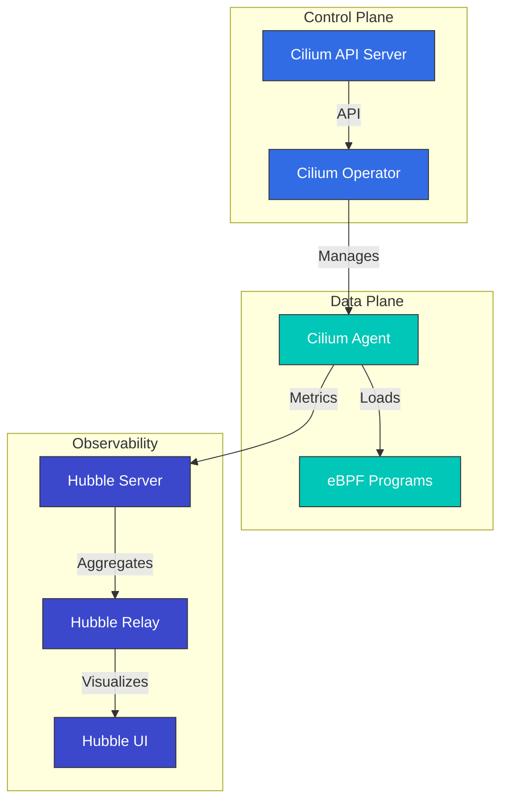

# Cilium

> **지원 버전**: Cilium 1.13, 1.14  
> **마지막 업데이트**: 2025년 7월 25일

## 목차
- [소개](#소개)
- [아키텍처](#아키텍처)
- [설치 및 구성](#설치-및-구성)
- [네트워크 정책](#네트워크-정책)
- [서비스 메시](#서비스-메시)
- [Hubble을 통한 관찰성](#hubble을-통한-관찰성)
- [Cilium 테스트](#cilium-테스트)
- [Amazon EKS와의 통합](#amazon-eks와의-통합)
- [모범 사례](#모범-사례)
- [문제 해결](#문제-해결)
- [결론](#결론)

## 소개

Cilium은 Kubernetes, Docker, Mesos와 같은 Linux 컨테이너 관리 플랫폼을 위한 오픈 소스 네트워킹, 보안 및 관찰성 솔루션입니다. Cilium은 eBPF(extended Berkeley Packet Filter) 기술을 기반으로 하여 전통적인 Linux 네트워킹 접근 방식보다 더 강력하고 효율적인 네트워킹 및 보안 기능을 제공합니다.

> **참고**: Cilium에 대한 더 자세한 내용은 [Cilium 딥다이브 섹션](../cilium/README.md)을 참조하세요. 이 문서에서는 EKS와의 통합 및 실제 운영 관점에서 Cilium을 다룹니다.

### eBPF란?

eBPF는 Linux 커널 내에서 샌드박스 가상 머신처럼 작동하는 기술로, 커널 코드를 수정하지 않고도 커널 내에서 프로그램을 안전하게 실행할 수 있게 해줍니다. 이를 통해 네트워크 패킷 처리, 시스템 호출 모니터링, 성능 분석 등 다양한 작업을 효율적으로 수행할 수 있습니다.

eBPF의 주요 특징:
- 커널 공간에서 실행되어 높은 성능 제공
- JIT(Just-In-Time) 컴파일을 통한 네이티브 성능
- 안전한 실행 환경 (검증기를 통한 프로그램 검증)
- 동적 로딩 및 언로딩 가능

### Cilium의 주요 이점

1. **고성능 네트워킹**: eBPF를 활용한 효율적인 패킷 처리
2. **세분화된 네트워크 정책**: L3-L7 수준의 네트워크 정책 지원
3. **투명한 암호화**: 노드 간 투명한 IPsec 또는 WireGuard 암호화
4. **부하 분산**: XDP(eXpress Data Path) 기반 고성능 부하 분산
5. **관찰성**: Hubble을 통한 네트워크 흐름 가시성
6. **서비스 메시**: 기존 사이드카 없이 L7 트래픽 관리
7. **멀티 클러스터 네트워킹**: 클러스터 간 투명한 연결
8. **BGP 지원**: 외부 네트워크와의 통합

### 기존 CNI와의 비교

| 기능 | Cilium | Calico | Flannel | AWS VPC CNI |
|------|--------|--------|---------|-------------|
| 네트워크 모델 | eBPF | iptables/IPVS | VXLAN/host-gw | AWS ENI |
| 네트워크 정책 | L3-L7 | L3-L4 | 제한적 | AWS 보안 그룹 |
| 암호화 | IPsec/WireGuard | IPsec | 없음 | 없음 |
| 관찰성 | Hubble | Flow Logs | 제한적 | VPC Flow Logs |
| 서비스 메시 | 내장 | Istio 필요 | Istio 필요 | Istio/AppMesh 필요 |
| 성능 | 매우 높음 | 높음 | 중간 | 높음 |

## Amazon EKS와의 통합

Amazon EKS에서 Cilium을 사용하는 방법은 크게 두 가지가 있습니다:

1. **Amazon EKS 추가 기능으로 설치**: Amazon EKS는 Cilium을 관리형 추가 기능으로 제공합니다.
2. **수동 설치**: Helm 차트를 사용하여 직접 설치합니다.

### Amazon EKS 추가 기능으로 설치

```bash
# Cilium 추가 기능 설치
aws eks create-addon \
  --cluster-name my-cluster \
  --addon-name cilium \
  --addon-version v1.14.0-eksbuild.1 \
  --service-account-role-arn arn:aws:iam::123456789012:role/AmazonEKSCiliumAddonRole

# 추가 기능 상태 확인
aws eks describe-addon \
  --cluster-name my-cluster \
  --addon-name cilium
```

### Helm을 사용한 수동 설치

```bash
# Cilium Helm 리포지토리 추가
helm repo add cilium https://helm.cilium.io/

# Helm 리포지토리 업데이트
helm repo update

# Cilium 설치
helm install cilium cilium/cilium \
  --version 1.14.0 \
  --namespace kube-system \
  --set eni.enabled=true \
  --set ipam.mode=eni \
  --set egressMasqueradeInterfaces=eth0 \
  --set tunnel=disabled
```

### EKS 특화 구성 옵션

EKS에서 Cilium을 사용할 때 고려해야 할 주요 구성 옵션:

1. **ENI 모드**: AWS Elastic Network Interface를 활용하여 네이티브 AWS 네트워킹 성능 활용
2. **IPAM 모드**: AWS VPC IP 주소 관리와 통합
3. **암호화**: 노드 간 트래픽 암호화 (WireGuard 또는 IPsec)
4. **NodeLocal DNSCache**: DNS 성능 향상
5. **Hubble**: 네트워크 관찰성 활성화

## 더 알아보기

Cilium에 대한 더 자세한 내용은 다음 문서를 참조하세요:

- [Cilium 소개 및 기본 개념](../cilium/01-introduction.md)
- [eBPF 기술 심층 분석](../cilium/02-ebpf.md)
- [네트워킹 모델 및 VXLAN](../cilium/03-networking.md)
- [IPAM 및 네트워크 정책](../cilium/04-ipam-policy.md)
- [L2-L7 네트워킹 및 로드 밸런싱](../cilium/05-l2-l7-networking.md)
- [보안 및 가시성](../cilium/06-security-visibility.md)
- [고급 주제](../cilium/07-advanced-topics.md)
| 멀티 클러스터 | 내장 | 제한적 | 없음 | Transit Gateway 필요 |

## 아키텍처

Cilium은 eBPF를 기반으로 한 데이터 플레인과 Kubernetes와 통합되는 컨트롤 플레인으로 구성됩니다.



### 주요 구성 요소

1. **Cilium Agent**: 각 노드에서 실행되며 eBPF 프로그램을 로드하고 관리
2. **Cilium Operator**: 클러스터 수준의 리소스 및 작업 관리
3. **eBPF 프로그램**: 커널에 로드되어 패킷 처리 및 정책 시행
4. **Hubble**: 네트워크 흐름 모니터링 및 관찰성 제공
5. **Cilium CLI**: Cilium 및 Hubble 관리를 위한 명령줄 도구

### 네트워킹 모델

Cilium은 여러 네트워킹 모드를 지원합니다:

1. **직접 라우팅**: 노드 간 직접 라우팅 (BGP 또는 정적 라우팅)
2. **터널링**: VXLAN 또는 Geneve 터널을 통한 오버레이 네트워킹
3. **AWS ENI**: Amazon EKS에서 ENI(Elastic Network Interface) 활용
4. **Azure IPAM**: Azure AKS에서 Azure IPAM 활용

### 패킷 흐름

Cilium에서 패킷이 처리되는 방식:

1. 패킷이 네트워크 인터페이스에 도착
2. eBPF XDP 프로그램이 패킷을 초기 처리 (DDoS 방어, 부하 분산)
3. eBPF TC(Traffic Control) 프로그램이 네트워크 정책 적용
4. 패킷이 컨테이너 네트워크 네임스페이스로 전달
5. 응답 패킷도 유사한 경로로 처리

## 설치 및 구성

### 사전 요구 사항

- Kubernetes 클러스터 (v1.16 이상)
- Linux 커널 4.9 이상 (권장: 5.4 이상)
- kubectl 설정
- Helm (선택 사항)

### 설치 방법

#### 1. Cilium CLI 설치

```bash
curl -L --remote-name-all https://github.com/cilium/cilium-cli/releases/latest/download/cilium-linux-amd64.tar.gz
sudo tar xzvfC cilium-linux-amd64.tar.gz /usr/local/bin
rm cilium-linux-amd64.tar.gz
```

#### 2. Cilium 설치

기본 설치:
```bash
cilium install
```

사용자 정의 설치:
```bash
cilium install --version 1.13.0 \
  --set kubeProxyReplacement=strict \
  --set bpf.masquerade=true \
  --set encryption.enabled=true \
  --set encryption.type=wireguard
```

#### 3. Hubble 설치

```bash
cilium hubble enable --ui
```

#### 4. 설치 확인

```bash
cilium status
```

### 구성 옵션

#### 네트워킹 모드 구성

직접 라우팅 모드:
```bash
cilium install --set tunnel=disabled --set autoDirectNodeRoutes=true
```

VXLAN 모드:
```bash
cilium install --set tunnel=vxlan
```

#### kube-proxy 대체 구성

완전 대체 모드:
```bash
cilium install --set kubeProxyReplacement=strict
```

부분 대체 모드:
```bash
cilium install --set kubeProxyReplacement=partial
```

#### 암호화 구성

WireGuard 암호화:
```bash
cilium install --set encryption.enabled=true --set encryption.type=wireguard
```

IPsec 암호화:
```bash
cilium install --set encryption.enabled=true --set encryption.type=ipsec
```

#### 대역폭 관리 구성

```bash
cilium install --set bandwidthManager.enabled=true
```

## 네트워크 정책

Cilium은 Kubernetes NetworkPolicy API를 확장하여 L3-L7 수준의 세분화된 네트워크 정책을 제공합니다.

### 기본 네트워크 정책

Kubernetes NetworkPolicy를 사용한 기본 정책:

```yaml
apiVersion: networking.k8s.io/v1
kind: NetworkPolicy
metadata:
  name: allow-frontend-to-backend
  namespace: app
spec:
  podSelector:
    matchLabels:
      app: backend
  ingress:
  - from:
    - podSelector:
        matchLabels:
          app: frontend
    ports:
    - port: 8080
      protocol: TCP
```

### Cilium 네트워크 정책

Cilium CRD를 사용한 L7 정책:

```yaml
apiVersion: cilium.io/v2
kind: CiliumNetworkPolicy
metadata:
  name: allow-specific-http-methods
  namespace: app
spec:
  endpointSelector:
    matchLabels:
      app: backend
  ingress:
  - fromEndpoints:
    - matchLabels:
        app: frontend
    toPorts:
    - ports:
      - port: "8080"
        protocol: TCP
      rules:
        http:
        - method: "GET"
          path: "/api/v1/products"
```

### 클러스터 전체 정책

```yaml
apiVersion: cilium.io/v2
kind: CiliumClusterwideNetworkPolicy
metadata:
  name: deny-external-egress
spec:
  egress:
  - toEntities:
    - cluster
  - toEndpoints:
    - matchLabels:
        io.kubernetes.pod.namespace: kube-system
        k8s-app: kube-dns
    toPorts:
    - ports:
      - port: "53"
        protocol: UDP
      - port: "53"
        protocol: TCP
```

### 엔티티 기반 정책

```yaml
apiVersion: cilium.io/v2
kind: CiliumNetworkPolicy
metadata:
  name: allow-dns-to-external
  namespace: app
spec:
  endpointSelector:
    matchLabels:
      app: web
  egress:
  - toEntities:
    - world
    toPorts:
    - ports:
      - port: "53"
        protocol: UDP
      - port: "53"
        protocol: TCP
```

### FQDN 기반 정책

```yaml
apiVersion: cilium.io/v2
kind: CiliumNetworkPolicy
metadata:
  name: allow-specific-domains
  namespace: app
spec:
  endpointSelector:
    matchLabels:
      app: web
  egress:
  - toFQDNs:
    - matchName: "api.example.com"
    - matchPattern: "*.amazonaws.com"
    toPorts:
    - ports:
      - port: "443"
        protocol: TCP
```
## 서비스 메시

Cilium은 eBPF를 활용하여 사이드카 없는 서비스 메시 기능을 제공합니다. 이를 통해 Envoy 프록시를 사이드카로 배포하지 않고도 L7 트래픽 관리가 가능합니다.

### 서비스 메시 활성화

```bash
cilium install --set serviceMesh.enabled=true
```

### 서비스 메시 정책

L7 HTTP 정책 예시:

```yaml
apiVersion: cilium.io/v2
kind: CiliumNetworkPolicy
metadata:
  name: l7-policy
spec:
  endpointSelector:
    matchLabels:
      app: productpage
  ingress:
  - fromEndpoints:
    - matchLabels:
        app: reviews
    toPorts:
    - ports:
      - port: "9080"
        protocol: TCP
      rules:
        http:
        - method: "GET"
          path: "/api/v1/products"
```

### 트래픽 관리

트래픽 분할 예시:

```yaml
apiVersion: cilium.io/v2alpha1
kind: CiliumEnvoyConfig
metadata:
  name: traffic-split
spec:
  services:
  - name: reviews
    namespace: default
  resources:
  - "@type": type.googleapis.com/envoy.config.listener.v3.Listener
    name: reviews-listener
    filter_chains:
    - filters:
      - name: envoy.filters.network.http_connection_manager
        typed_config:
          "@type": type.googleapis.com/envoy.extensions.filters.network.http_connection_manager.v3.HttpConnectionManager
          stat_prefix: reviews
          route_config:
            name: reviews-route
            virtual_hosts:
            - name: reviews-vhost
              domains: ["*"]
              routes:
              - match:
                  prefix: "/"
                route:
                  weighted_clusters:
                    clusters:
                    - name: reviews-v1
                      weight: 80
                    - name: reviews-v2
                      weight: 20
```

### 서비스 메시 모니터링

Hubble을 통한 서비스 메시 메트릭 수집:

```bash
cilium hubble enable --metrics=http
```

## Hubble을 통한 관찰성

Hubble은 Cilium의 관찰성 계층으로, eBPF를 통해 수집된 네트워크 흐름 데이터를 시각화하고 분석할 수 있게 해줍니다.

### Hubble 설치

```bash
cilium hubble enable --ui
```

### Hubble UI 접근

```bash
cilium hubble ui
```

### Hubble CLI 설치

```bash
export HUBBLE_VERSION=$(curl -s https://raw.githubusercontent.com/cilium/hubble/master/stable.txt)
curl -L --remote-name-all https://github.com/cilium/hubble/releases/download/$HUBBLE_VERSION/hubble-linux-amd64.tar.gz
sudo tar xzvfC hubble-linux-amd64.tar.gz /usr/local/bin
rm hubble-linux-amd64.tar.gz
```

### 네트워크 흐름 관찰

```bash
# 모든 흐름 관찰
hubble observe

# 특정 네임스페이스의 흐름 관찰
hubble observe --namespace app

# HTTP 요청 관찰
hubble observe --protocol http

# 특정 라벨을 가진 파드 간의 흐름 관찰
hubble observe --from-label app=frontend --to-label app=backend

# 실패한 연결 관찰
hubble observe --verdict DROPPED
```

### 흐름 시각화

Hubble UI를 통한 서비스 맵 시각화:

```bash
cilium hubble ui
```

### Prometheus 통합

Hubble 메트릭을 Prometheus로 내보내기:

```bash
cilium hubble enable --metrics="{dns:query;ignoreAAAA,drop:sourceContext=pod;destinationContext=pod,tcp,flow,icmp,http}"
```

### Grafana 대시보드

Hubble 메트릭을 위한 Grafana 대시보드 설치:

```bash
kubectl apply -f https://raw.githubusercontent.com/cilium/cilium/master/examples/kubernetes/addons/prometheus/monitoring-example.yaml
```

## Cilium 테스트

Cilium은 네트워크 연결성 및 정책을 테스트하기 위한 다양한 도구를 제공합니다.

### 연결성 테스트

```bash
# 기본 연결성 테스트
cilium connectivity test

# 특정 테스트 실행
cilium connectivity test --test=client-to-echo-service
```

### 정책 테스트

```bash
# 정책 테스트 실행
cilium connectivity test --test=policy-stress-test
```

### 성능 테스트

```bash
# 네트워크 성능 테스트
cilium connectivity test --test=performance
```

### 테스트 결과 분석

```bash
# 테스트 결과 요약
cilium connectivity test --summary

# 자세한 테스트 결과
cilium connectivity test --verbose
```

### 사용자 정의 테스트

사용자 정의 테스트 구성:

```yaml
apiVersion: v1
kind: ConfigMap
metadata:
  name: cilium-connectivity-test
  namespace: kube-system
data:
  config.yaml: |
    tests:
      - name: "custom-test"
        description: "Custom connectivity test"
        steps:
        - name: "client-to-custom-service"
          source:
            podLabels:
              app: client
          destination:
            podLabels:
              app: custom-service
          http:
            method: GET
            path: "/api/v1/status"
            expectedStatus: 200
```

```bash
cilium connectivity test --config=cilium-connectivity-test
```

## Amazon EKS와의 통합

Cilium은 Amazon EKS와 원활하게 통합되어 고급 네트워킹 및 보안 기능을 제공합니다.

### EKS에 Cilium 설치

#### 1. 기존 EKS 클러스터에 Cilium 설치

```bash
# AWS CNI 제거
kubectl delete daemonset -n kube-system aws-node

# Cilium 설치
cilium install --set eni.enabled=true \
  --set ipam.mode=eni \
  --set egressMasqueradeInterfaces=eth0 \
  --set tunnel=disabled
```

#### 2. Cilium CNI로 새 EKS 클러스터 생성

```bash
eksctl create cluster --name cilium-cluster \
  --without-nodegroup

eksctl create nodegroup --cluster cilium-cluster \
  --node-ami-family AmazonLinux2 \
  --node-type m5.large \
  --nodes 3 \
  --max-pods-per-node 110

# Cilium 설치
cilium install --set eni.enabled=true \
  --set ipam.mode=eni \
  --set egressMasqueradeInterfaces=eth0 \
  --set tunnel=disabled
```

### ENI 모드 구성

```yaml
apiVersion: v1
kind: ConfigMap
metadata:
  name: cilium-config
  namespace: kube-system
data:
  enable-endpoint-routes: "true"
  auto-create-cilium-node-resource: "true"
  ipam: "eni"
  eni-tags: "{\"Owner\": \"Cilium\"}"
  tunnel: "disabled"
  enable-ipv4: "true"
  enable-ipv6: "false"
  egress-masquerade-interfaces: "eth0"
```

### 보안 그룹 통합

```yaml
apiVersion: cilium.io/v2
kind: CiliumNetworkPolicy
metadata:
  name: secure-app
spec:
  endpointSelector:
    matchLabels:
      app: secure-app
  ingress:
  - fromEndpoints:
    - matchLabels:
        app: frontend
    toPorts:
    - ports:
      - port: "8080"
        protocol: TCP
  egress:
  - toFQDNs:
    - matchName: "api.amazonaws.com"
    toPorts:
    - ports:
      - port: "443"
        protocol: TCP
```

### EKS 클러스터 간 연결

Cilium Cluster Mesh를 사용한 EKS 클러스터 간 연결:

```bash
# 클러스터 1에서
cilium clustermesh enable --service-type LoadBalancer

# 클러스터 2에서
cilium clustermesh enable --service-type LoadBalancer

# 클러스터 연결
cilium clustermesh connect --context cluster1 --destination-context cluster2
```

### AWS Load Balancer Controller 통합

```yaml
apiVersion: networking.k8s.io/v1
kind: Ingress
metadata:
  name: example-ingress
  annotations:
    kubernetes.io/ingress.class: alb
    alb.ingress.kubernetes.io/scheme: internet-facing
spec:
  rules:
  - host: example.com
    http:
      paths:
      - path: /
        pathType: Prefix
        backend:
          service:
            name: example-service
            port:
              number: 80
```

## 모범 사례

### 성능 최적화

1. **커널 버전 최적화**: Linux 커널 5.4 이상 사용
2. **BBR 혼잡 제어 활성화**: 네트워크 처리량 향상
3. **XDP 가속 활성화**: 패킷 처리 성능 향상
4. **MTU 최적화**: 네트워크 환경에 맞는 MTU 설정

```bash
cilium install --set bpf.preallocateMaps=true \
  --set bpf.masquerade=true \
  --set devices=eth0 \
  --set loadBalancer.acceleration=native \
  --set loadBalancer.mode=dsr
```

### 보안 강화

1. **기본 거부 정책 적용**: 명시적으로 허용된 트래픽만 허용
2. **암호화 활성화**: 노드 간 트래픽 암호화
3. **최소 권한 원칙 적용**: 필요한 통신만 허용하는 정책 설계
4. **정기적인 정책 감사**: 네트워크 정책 정기 검토

```bash
# 기본 거부 정책
kubectl apply -f - <<EOF
apiVersion: cilium.io/v2
kind: CiliumNetworkPolicy
metadata:
  name: default-deny
  namespace: default
spec:
  endpointSelector: {}
  ingress: []
  egress: []
EOF
```

### 관찰성 향상

1. **Hubble 메트릭 구성**: 필요한 메트릭 활성화
2. **로그 수준 최적화**: 적절한 로그 수준 설정
3. **Prometheus 통합**: 메트릭 수집 및 알림 설정
4. **Grafana 대시보드 활용**: 시각화 및 모니터링

```bash
cilium hubble enable --metrics="{dns,drop,tcp,flow,http}"
```

### 리소스 관리

1. **리소스 요청 및 제한 설정**: 적절한 CPU 및 메모리 할당
2. **노드 선택기 사용**: 특정 노드에 Cilium 구성 요소 배치
3. **우선순위 클래스 설정**: 중요 구성 요소에 높은 우선순위 부여

```yaml
apiVersion: helm.toolkit.fluxcd.io/v2beta1
kind: HelmRelease
metadata:
  name: cilium
  namespace: kube-system
spec:
  chart:
    spec:
      chart: cilium
      sourceRef:
        kind: HelmRepository
        name: cilium
  values:
    agent:
      resources:
        requests:
          cpu: 100m
          memory: 512Mi
        limits:
          cpu: 500m
          memory: 1Gi
    operator:
      resources:
        requests:
          cpu: 100m
          memory: 256Mi
        limits:
          cpu: 200m
          memory: 512Mi
```

## 문제 해결

### 일반적인 문제

#### 1. 연결성 문제

**증상**: 파드 간 통신 실패

**해결 방법**:
- Cilium 상태 확인
- 네트워크 정책 검토
- Hubble을 통한 흐름 분석

```bash
# Cilium 상태 확인
cilium status

# 엔드포인트 상태 확인
cilium endpoint list

# 네트워크 정책 검토
kubectl get cnp,ccnp -A

# 흐름 분석
hubble observe --verdict DROPPED
```

#### 2. 성능 문제

**증상**: 지연 시간 증가 또는 처리량 감소

**해결 방법**:
- 커널 버전 확인
- eBPF 맵 상태 확인
- 시스템 리소스 모니터링

```bash
# 커널 버전 확인
uname -r

# eBPF 맵 상태 확인
cilium bpf maps list

# 시스템 리소스 모니터링
cilium metrics list
```

#### 3. 정책 적용 문제

**증상**: 네트워크 정책이 예상대로 적용되지 않음

**해결 방법**:
- 정책 구문 검증
- 엔드포인트 레이블 확인
- 정책 추적 활성화

```bash
# 정책 검증
cilium policy validate -f policy.yaml

# 엔드포인트 레이블 확인
cilium endpoint list -o json | jq '.[].status.identity.labels'

# 정책 추적 활성화
cilium config set policy-audit-mode=true
```

### 디버깅 도구

#### Cilium CLI 디버깅 명령어

```bash
# 상태 확인
cilium status --verbose

# 엔드포인트 정보
cilium endpoint list

# 서비스 목록
cilium service list

# 정책 확인
cilium policy get

# BPF 맵 확인
cilium bpf maps list

# 환경 정보 수집
cilium sysdump
```

#### Hubble 디버깅

```bash
# 실시간 흐름 관찰
hubble observe --follow

# 특정 파드의 흐름 관찰
hubble observe --pod app/frontend

# 특정 IP 주소의 흐름 관찰
hubble observe --ip 10.0.0.1

# 특정 포트의 흐름 관찰
hubble observe --port 80

# 특정 프로토콜의 흐름 관찰
hubble observe --protocol http
```

#### 로그 수집

```bash
# Cilium 에이전트 로그
kubectl logs -n kube-system -l k8s-app=cilium

# Cilium 오퍼레이터 로그
kubectl logs -n kube-system -l name=cilium-operator

# Hubble 릴레이 로그
kubectl logs -n kube-system -l k8s-app=hubble-relay
```

## 결론

Cilium은 eBPF 기술을 활용하여 Kubernetes 환경에서 고성능 네트워킹, 세분화된 보안 정책, 그리고 뛰어난 관찰성을 제공합니다. 전통적인 Linux 네트워킹 접근 방식과 비교하여 Cilium은 더 효율적이고 강력한 네트워킹 및 보안 기능을 제공하며, Hubble을 통해 네트워크 흐름에 대한 심층적인 가시성을 제공합니다.

이 문서에서는 Cilium의 기본 개념, 설치 방법, 네트워크 정책, 서비스 메시, Hubble을 통한 관찰성, Cilium 테스트, Amazon EKS와의 통합, 모범 사례 및 문제 해결에 대해 살펴보았습니다.

Cilium은 지속적으로 발전하고 있으며, eBPF 기술의 발전과 함께 더 많은 기능과 성능 향상이 기대됩니다. 특히 클라우드 네이티브 환경에서 Cilium은 네트워킹, 보안, 관찰성을 위한 강력한 솔루션으로 자리매김하고 있습니다.

### 다음 단계

- Cilium 서비스 메시 기능 탐색
- 멀티 클러스터 네트워킹 구현
- Hubble을 활용한 네트워크 모니터링 시스템 구축
- eBPF 기반 보안 정책 고도화
- Cilium과 다른 클라우드 네이티브 도구와의 통합

## 참고 자료

- [Cilium 공식 문서](https://docs.cilium.io/)
- [Cilium GitHub 저장소](https://github.com/cilium/cilium)
- [eBPF 문서](https://ebpf.io/)
- [Hubble 문서](https://github.com/cilium/hubble)
- [Cilium 네트워크 정책 에디터](https://editor.cilium.io/)
- [AWS EKS 워크숍 - Cilium](https://www.eksworkshop.com/beginner/115_cilium/)

## 퀴즈

이 장에서 배운 내용을 테스트하려면 [주제 퀴즈](../quizzes/tools/04-cilium-quiz.md)를 풀어보세요.
