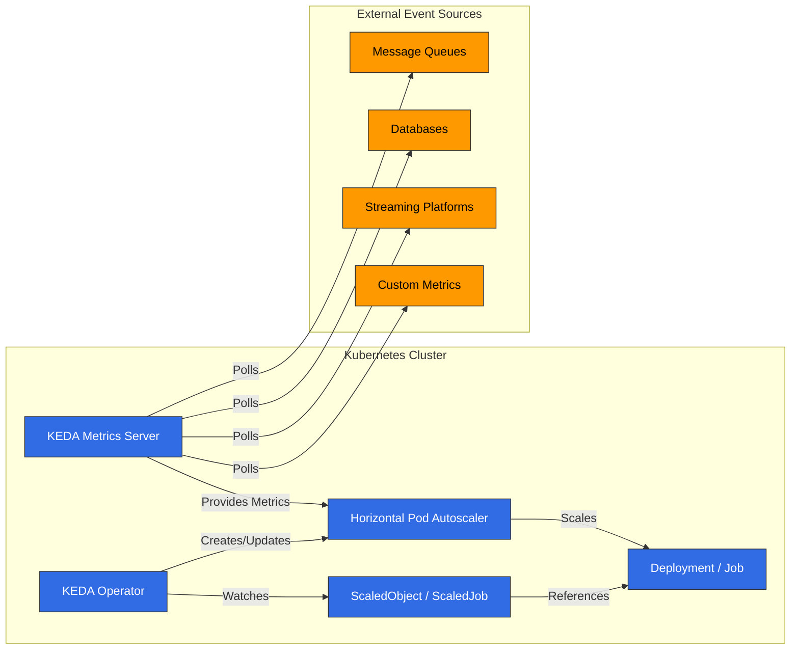

# KEDA (Kubernetes Event-driven Autoscaling)

## 목차
- [소개](#소개)
- [아키텍처](#아키텍처)
- [설치 및 구성](#설치-및-구성)
- [스케일러](#스케일러)
- [커스텀 메트릭 스케일링](#커스텀-메트릭-스케일링)
- [Twitter 메트릭 스케일링](#twitter-메트릭-스케일링)
- [Google Calendar 스케일링](#google-calendar-스케일링)
- [Istio 메트릭 스케일링](#istio-메트릭-스케일링)
- [Cron 기반 스케일링](#cron-기반-스케일링)
- [Amazon EKS와의 통합](#amazon-eks와의-통합)
- [모범 사례](#모범-사례)
- [문제 해결](#문제-해결)
- [결론](#결론)

## 소개

KEDA(Kubernetes Event-driven Autoscaling)는 Kubernetes 애플리케이션을 이벤트 기반으로 자동 확장할 수 있게 해주는 오픈 소스 프로젝트입니다. KEDA는 Kubernetes의 기본 Horizontal Pod Autoscaler(HPA)를 확장하여 CPU 및 메모리 사용량 외에도 다양한 이벤트 소스와 메트릭을 기반으로 워크로드를 확장할 수 있게 해줍니다.

### KEDA의 주요 이점

1. **이벤트 기반 스케일링**: 다양한 이벤트 소스(메시지 큐, 데이터베이스, 스트림 등)에 기반한 스케일링
2. **제로 스케일링**: 활동이 없을 때 0개의 복제본으로 스케일 다운하여 비용 절감
3. **다양한 스케일러 지원**: 50개 이상의 내장 스케일러와 커스텀 스케일러 지원
4. **Kubernetes 네이티브**: 기존 Kubernetes HPA와 통합
5. **클라우드 중립적**: 모든 Kubernetes 환경에서 작동
6. **간단한 배포 모델**: 단일 오퍼레이터로 쉽게 배포 가능

### 기존 스케일링 방식과의 비교

| 기능 | KEDA | Kubernetes HPA | Cloud Provider Autoscaler |
|------|------|----------------|---------------------------|
| 메트릭 소스 | 50+ 스케일러 | CPU, 메모리, 커스텀 메트릭 | 제한된 메트릭 |
| 제로 스케일링 | ✅ | ❌ | 일부 지원 |
| 이벤트 기반 | ✅ | ❌ | 일부 지원 |
| 클라우드 중립적 | ✅ | ✅ | ❌ |
| 배포 복잡성 | 낮음 | 매우 낮음 | 중간 |
| 커스텀 메트릭 | 쉬움 | 복잡함 | 제한적 |

## 아키텍처

KEDA는 Kubernetes 오퍼레이터 패턴을 기반으로 하며, 외부 메트릭 소스를 모니터링하고 Kubernetes HPA를 자동으로 관리합니다.




### 주요 구성 요소

1. **KEDA 오퍼레이터**: ScaledObject 및 ScaledJob 리소스를 감시하고 HPA를 관리
2. **KEDA 메트릭 서버**: 외부 메트릭 소스에서 메트릭을 수집하여 Kubernetes API로 노출
3. **ScaledObject**: 배포(Deployment), 상태 저장 세트(StatefulSet) 등의 스케일링 구성을 정의
4. **ScaledJob**: Kubernetes Job의 스케일링 구성을 정의
5. **트리거/스케일러**: 다양한 이벤트 소스에 대한 스케일링 로직 구현

### 작동 방식

1. 사용자가 ScaledObject 또는 ScaledJob을 생성하여 스케일링 대상과 트리거를 정의
2. KEDA 오퍼레이터가 이를 감지하고 해당 HPA를 생성
3. KEDA 메트릭 서버가 외부 메트릭 소스를 폴링하여 메트릭 수집
4. HPA가 메트릭 서버에서 제공하는 메트릭을 기반으로 워크로드 스케일링
5. 활동이 없을 경우 KEDA가 복제본을 0으로 스케일 다운 (HPA는 할 수 없음)

## 설치 및 구성

### 사전 요구 사항

- Kubernetes 클러스터 (v1.16 이상)
- kubectl 설정
- Helm (선택 사항)

### 설치 방법

#### 1. Helm을 사용한 설치

```bash
# Helm 저장소 추가
helm repo add kedacore https://kedacore.github.io/charts

# Helm 저장소 업데이트
helm repo update

# KEDA 설치
helm install keda kedacore/keda --namespace keda --create-namespace
```

#### 2. YAML 매니페스트를 사용한 설치

```bash
# 최신 KEDA 릴리스 다운로드
kubectl apply -f https://github.com/kedacore/keda/releases/download/v2.10.1/keda-2.10.1.yaml
```

#### 3. 설치 확인

```bash
kubectl get pods -n keda
```

예상 출력:
```
NAME                                      READY   STATUS    RESTARTS   AGE
keda-operator-5c6d85d76c-vr4fj            1/1     Running   0          1m
keda-operator-metrics-apiserver-65f8f8d4d8-9mzrk   1/1     Running   0          1m
```

### 기본 구성

KEDA는 기본적으로 최소한의 구성으로 작동하지만, 필요에 따라 다양한 설정을 조정할 수 있습니다.

#### Helm 값 파일을 사용한 사용자 정의 구성

```yaml
# values.yaml
operator:
  replicaCount: 2
  resources:
    limits:
      cpu: 100m
      memory: 128Mi
    requests:
      cpu: 50m
      memory: 64Mi

metricsServer:
  replicaCount: 2
  resources:
    limits:
      cpu: 100m
      memory: 128Mi
    requests:
      cpu: 50m
      memory: 64Mi

logging:
  operator:
    level: info
  metricServer:
    level: info
```

```bash
helm install keda kedacore/keda --namespace keda --create-namespace -f values.yaml
```

## 스케일러

KEDA는 다양한 이벤트 소스에 대한 스케일러를 제공합니다. 각 스케일러는 특정 이벤트 소스에서 메트릭을 수집하고 이를 기반으로 워크로드를 스케일링합니다.

### 주요 스케일러

KEDA는 50개 이상의 스케일러를 지원하며, 주요 스케일러는 다음과 같습니다:

1. **메시지 큐**: 
   - Apache Kafka
   - RabbitMQ
   - AWS SQS
   - Azure Service Bus
   - Google Cloud Pub/Sub

2. **데이터베이스**: 
   - MySQL
   - PostgreSQL
   - MongoDB
   - Redis

3. **스트리밍 플랫폼**: 
   - Apache Kafka
   - AWS Kinesis
   - Azure Event Hubs

4. **클라우드 서비스**: 
   - AWS CloudWatch
   - Azure Monitor
   - Google Cloud Monitoring

5. **기타**: 
   - Prometheus
   - Influxdb
   - Cron
   - CPU/Memory

### 기본 ScaledObject 예시

```yaml
apiVersion: keda.sh/v1alpha1
kind: ScaledObject
metadata:
  name: rabbitmq-scaledobject
  namespace: default
spec:
  scaleTargetRef:
    apiVersion: apps/v1
    kind: Deployment
    name: rabbitmq-consumer
  pollingInterval: 15
  cooldownPeriod: 30
  minReplicaCount: 0
  maxReplicaCount: 30
  triggers:
  - type: rabbitmq
    metadata:
      protocol: amqp
      queueName: hello
      host: rabbitmq
      queueLength: "5"
```

### 기본 ScaledJob 예시

```yaml
apiVersion: keda.sh/v1alpha1
kind: ScaledJob
metadata:
  name: rabbitmq-scaledjob
  namespace: default
spec:
  jobTargetRef:
    template:
      spec:
        containers:
        - name: rabbitmq-worker
          image: rabbitmq-worker:latest
          imagePullPolicy: Always
  pollingInterval: 15
  maxReplicaCount: 30
  successfulJobsHistoryLimit: 5
  failedJobsHistoryLimit: 5
  triggers:
  - type: rabbitmq
    metadata:
      protocol: amqp
      queueName: hello
      host: rabbitmq
      queueLength: "5"
```
## 커스텀 메트릭 스케일링

KEDA는 다양한 내장 스케일러 외에도 커스텀 메트릭을 기반으로 스케일링할 수 있는 유연성을 제공합니다. 이를 통해 비즈니스 요구사항에 맞는 고유한 스케일링 로직을 구현할 수 있습니다.

### 외부 메트릭 API 사용

Prometheus와 같은 외부 메트릭 소스를 사용하여 커스텀 메트릭 기반 스케일링을 구현할 수 있습니다:

```yaml
apiVersion: keda.sh/v1alpha1
kind: ScaledObject
metadata:
  name: custom-metrics-scaler
  namespace: default
spec:
  scaleTargetRef:
    apiVersion: apps/v1
    kind: Deployment
    name: my-app
  minReplicaCount: 1
  maxReplicaCount: 10
  triggers:
  - type: prometheus
    metadata:
      serverAddress: http://prometheus-server.monitoring.svc.cluster.local
      metricName: custom_metric_total
      threshold: "100"
      query: sum(custom_metric_total{namespace="default",pod=~"my-app-.*"})
```

### HTTP 스케일러 사용

HTTP 엔드포인트에서 메트릭을 가져와 스케일링할 수 있습니다:

```yaml
apiVersion: keda.sh/v1alpha1
kind: ScaledObject
metadata:
  name: http-scaler
  namespace: default
spec:
  scaleTargetRef:
    apiVersion: apps/v1
    kind: Deployment
    name: my-app
  minReplicaCount: 1
  maxReplicaCount: 10
  triggers:
  - type: metrics-api
    metadata:
      targetValue: "100"
      url: "http://api.example.com/metrics"
      valueLocation: "value"
      method: "GET"
```

### 커스텀 스케일러 개발

자체 스케일러를 개발하여 KEDA와 통합할 수 있습니다. 이를 위해서는 External Metrics API를 구현하는 서비스를 개발해야 합니다:

1. 메트릭 서버 구현:

```go
package main

import (
    "net/http"
    "encoding/json"
    
    "k8s.io/apimachinery/pkg/api/resource"
    metav1 "k8s.io/apimachinery/pkg/apis/meta/v1"
    "k8s.io/metrics/pkg/apis/external_metrics"
)

func metricsHandler(w http.ResponseWriter, r *http.Request) {
    // 커스텀 로직으로 메트릭 값 계산
    metricValue := calculateMetricValue()
    
    metric := external_metrics.ExternalMetricValue{
        TypeMeta: metav1.TypeMeta{
            Kind:       "ExternalMetricValue",
            APIVersion: "external.metrics.k8s.io/v1beta1",
        },
        MetricName: "custom_metric",
        Value:      *resource.NewQuantity(metricValue, resource.DecimalSI),
        Timestamp:  metav1.Now(),
    }
    
    metricList := external_metrics.ExternalMetricValueList{
        Items: []external_metrics.ExternalMetricValue{metric},
    }
    
    json.NewEncoder(w).Encode(metricList)
}

func main() {
    http.HandleFunc("/metrics", metricsHandler)
    http.ListenAndServe(":8080", nil)
}
```

2. KEDA와 통합:

```yaml
apiVersion: keda.sh/v1alpha1
kind: ScaledObject
metadata:
  name: custom-scaler
  namespace: default
spec:
  scaleTargetRef:
    apiVersion: apps/v1
    kind: Deployment
    name: my-app
  minReplicaCount: 1
  maxReplicaCount: 10
  triggers:
  - type: metrics-api
    metadata:
      targetValue: "100"
      url: "http://custom-metrics-server:8080/metrics"
      valueLocation: "items.0.value"
```

## Twitter 메트릭 스케일링

Twitter API를 사용하여 특정 해시태그나 키워드의 언급 빈도에 따라 애플리케이션을 스케일링하는 예제입니다.

### 사전 요구 사항

- Twitter API 키 및 액세스 토큰
- 메트릭을 수집하고 노출하는 서비스

### 구현 단계

1. Twitter 메트릭 수집기 서비스 구현:

```python
import os
import time
import tweepy
from flask import Flask, jsonify

app = Flask(__name__)

# Twitter API 자격 증명
consumer_key = os.environ.get("TWITTER_CONSUMER_KEY")
consumer_secret = os.environ.get("TWITTER_CONSUMER_SECRET")
access_token = os.environ.get("TWITTER_ACCESS_TOKEN")
access_token_secret = os.environ.get("TWITTER_ACCESS_TOKEN_SECRET")

# Tweepy 인증
auth = tweepy.OAuthHandler(consumer_key, consumer_secret)
auth.set_access_token(access_token, access_token_secret)
api = tweepy.API(auth)

# 메트릭 저장소
metrics = {
    "tweet_count": 0,
    "last_updated": 0
}

# 백그라운드에서 트윗 수집
def collect_tweets():
    while True:
        try:
            # 특정 해시태그 검색
            tweets = api.search_tweets(q="#kubernetes", count=100)
            metrics["tweet_count"] = len(tweets)
            metrics["last_updated"] = time.time()
        except Exception as e:
            print(f"Error collecting tweets: {e}")
        
        # 15분마다 업데이트 (Twitter API 제한 고려)
        time.sleep(900)

# 메트릭 엔드포인트
@app.route("/metrics", methods=["GET"])
def get_metrics():
    return jsonify({
        "tweet_count": metrics["tweet_count"]
    })

if __name__ == "__main__":
    import threading
    # 백그라운드에서 트윗 수집 시작
    thread = threading.Thread(target=collect_tweets)
    thread.daemon = True
    thread.start()
    
    # API 서버 시작
    app.run(host="0.0.0.0", port=8080)
```

2. 메트릭 수집기 서비스 배포:

```yaml
apiVersion: apps/v1
kind: Deployment
metadata:
  name: twitter-metrics-collector
  namespace: default
spec:
  replicas: 1
  selector:
    matchLabels:
      app: twitter-metrics-collector
  template:
    metadata:
      labels:
        app: twitter-metrics-collector
    spec:
      containers:
      - name: collector
        image: twitter-metrics-collector:latest
        ports:
        - containerPort: 8080
        env:
        - name: TWITTER_CONSUMER_KEY
          valueFrom:
            secretKeyRef:
              name: twitter-api-secrets
              key: consumer-key
        - name: TWITTER_CONSUMER_SECRET
          valueFrom:
            secretKeyRef:
              name: twitter-api-secrets
              key: consumer-secret
        - name: TWITTER_ACCESS_TOKEN
          valueFrom:
            secretKeyRef:
              name: twitter-api-secrets
              key: access-token
        - name: TWITTER_ACCESS_TOKEN_SECRET
          valueFrom:
            secretKeyRef:
              name: twitter-api-secrets
              key: access-token-secret
---
apiVersion: v1
kind: Service
metadata:
  name: twitter-metrics-collector
  namespace: default
spec:
  selector:
    app: twitter-metrics-collector
  ports:
  - port: 80
    targetPort: 8080
```

3. KEDA ScaledObject 구성:

```yaml
apiVersion: keda.sh/v1alpha1
kind: ScaledObject
metadata:
  name: twitter-scaler
  namespace: default
spec:
  scaleTargetRef:
    apiVersion: apps/v1
    kind: Deployment
    name: twitter-processor
  minReplicaCount: 1
  maxReplicaCount: 20
  pollingInterval: 15
  cooldownPeriod: 30
  triggers:
  - type: metrics-api
    metadata:
      targetValue: "10"
      url: "http://twitter-metrics-collector/metrics"
      valueLocation: "tweet_count"
```

## Google Calendar 스케일링

Google Calendar API를 사용하여 예정된 이벤트에 따라 애플리케이션을 스케일링하는 예제입니다.

### 사전 요구 사항

- Google Calendar API 자격 증명
- 메트릭을 수집하고 노출하는 서비스

### 구현 단계

1. Google Calendar 메트릭 수집기 서비스 구현:

```python
import os
import time
import datetime
from flask import Flask, jsonify
from google.oauth2 import service_account
from googleapiclient.discovery import build

app = Flask(__name__)

# Google Calendar API 자격 증명
SCOPES = ['https://www.googleapis.com/auth/calendar.readonly']
SERVICE_ACCOUNT_FILE = '/etc/secrets/service-account.json'
CALENDAR_ID = os.environ.get("CALENDAR_ID")

# 메트릭 저장소
metrics = {
    "upcoming_events": 0,
    "last_updated": 0
}

# Google Calendar API 클라이언트 생성
def create_calendar_client():
    credentials = service_account.Credentials.from_service_account_file(
        SERVICE_ACCOUNT_FILE, scopes=SCOPES)
    return build('calendar', 'v3', credentials=credentials)

# 백그라운드에서 이벤트 수집
def collect_events():
    while True:
        try:
            service = create_calendar_client()
            
            # 현재 시간
            now = datetime.datetime.utcnow()
            # 1시간 후
            one_hour_later = now + datetime.timedelta(hours=1)
            
            # 다음 1시간 내의 이벤트 조회
            events_result = service.events().list(
                calendarId=CALENDAR_ID,
                timeMin=now.isoformat() + 'Z',
                timeMax=one_hour_later.isoformat() + 'Z',
                singleEvents=True,
                orderBy='startTime'
            ).execute()
            
            events = events_result.get('items', [])
            metrics["upcoming_events"] = len(events)
            metrics["last_updated"] = time.time()
        except Exception as e:
            print(f"Error collecting events: {e}")
        
        # 5분마다 업데이트
        time.sleep(300)

# 메트릭 엔드포인트
@app.route("/metrics", methods=["GET"])
def get_metrics():
    return jsonify({
        "upcoming_events": metrics["upcoming_events"]
    })

if __name__ == "__main__":
    import threading
    # 백그라운드에서 이벤트 수집 시작
    thread = threading.Thread(target=collect_events)
    thread.daemon = True
    thread.start()
    
    # API 서버 시작
    app.run(host="0.0.0.0", port=8080)
```

2. 메트릭 수집기 서비스 배포:

```yaml
apiVersion: v1
kind: Secret
metadata:
  name: google-calendar-secrets
  namespace: default
type: Opaque
data:
  service-account.json: <BASE64_ENCODED_SERVICE_ACCOUNT_JSON>
---
apiVersion: apps/v1
kind: Deployment
metadata:
  name: calendar-metrics-collector
  namespace: default
spec:
  replicas: 1
  selector:
    matchLabels:
      app: calendar-metrics-collector
  template:
    metadata:
      labels:
        app: calendar-metrics-collector
    spec:
      containers:
      - name: collector
        image: calendar-metrics-collector:latest
        ports:
        - containerPort: 8080
        env:
        - name: CALENDAR_ID
          value: "primary"
        volumeMounts:
        - name: google-calendar-credentials
          mountPath: "/etc/secrets"
          readOnly: true
      volumes:
      - name: google-calendar-credentials
        secret:
          secretName: google-calendar-secrets
---
apiVersion: v1
kind: Service
metadata:
  name: calendar-metrics-collector
  namespace: default
spec:
  selector:
    app: calendar-metrics-collector
  ports:
  - port: 80
    targetPort: 8080
```

3. KEDA ScaledObject 구성:

```yaml
apiVersion: keda.sh/v1alpha1
kind: ScaledObject
metadata:
  name: calendar-scaler
  namespace: default
spec:
  scaleTargetRef:
    apiVersion: apps/v1
    kind: Deployment
    name: calendar-processor
  minReplicaCount: 1
  maxReplicaCount: 10
  pollingInterval: 15
  cooldownPeriod: 30
  triggers:
  - type: metrics-api
    metadata:
      targetValue: "1"
      url: "http://calendar-metrics-collector/metrics"
      valueLocation: "upcoming_events"
```
## Istio 메트릭 스케일링

Istio 서비스 메시에서 수집된 메트릭을 기반으로 애플리케이션을 스케일링하는 예제입니다. 특히 초당 요청 수(requests per second, RPS)를 기반으로 스케일링하는 방법을 살펴보겠습니다.

### 사전 요구 사항

- Istio 서비스 메시 설치
- Prometheus 설치 및 Istio와 통합

### 구현 단계

1. Istio 서비스 메시 설정:

```bash
# Istio 설치
istioctl install --set profile=default -y

# 네임스페이스에 Istio 사이드카 주입 활성화
kubectl label namespace default istio-injection=enabled
```

2. 샘플 애플리케이션 배포:

```yaml
apiVersion: apps/v1
kind: Deployment
metadata:
  name: sample-app
  namespace: default
spec:
  replicas: 1
  selector:
    matchLabels:
      app: sample-app
  template:
    metadata:
      labels:
        app: sample-app
    spec:
      containers:
      - name: sample-app
        image: nginx:latest
        ports:
        - containerPort: 80
---
apiVersion: v1
kind: Service
metadata:
  name: sample-app
  namespace: default
spec:
  selector:
    app: sample-app
  ports:
  - port: 80
    targetPort: 80
---
apiVersion: networking.istio.io/v1alpha3
kind: VirtualService
metadata:
  name: sample-app
  namespace: default
spec:
  hosts:
  - "*"
  gateways:
  - istio-system/ingressgateway
  http:
  - route:
    - destination:
        host: sample-app
        port:
          number: 80
```

3. KEDA ScaledObject 구성:

```yaml
apiVersion: keda.sh/v1alpha1
kind: ScaledObject
metadata:
  name: istio-scaler
  namespace: default
spec:
  scaleTargetRef:
    apiVersion: apps/v1
    kind: Deployment
    name: sample-app
  minReplicaCount: 1
  maxReplicaCount: 10
  pollingInterval: 15
  cooldownPeriod: 30
  triggers:
  - type: prometheus
    metadata:
      serverAddress: http://prometheus.istio-system:9090
      metricName: istio_requests_per_second
      threshold: "10"
      query: sum(rate(istio_requests_total{destination_service="sample-app.default.svc.cluster.local"}[1m]))
```

이 구성은 Istio에서 수집한 초당 요청 수를 기반으로 `sample-app` 배포를 스케일링합니다. 초당 요청 수가 10을 초과하면 KEDA는 복제본을 추가하고, 요청 수가 감소하면 복제본을 줄입니다.

### 고급 구성

더 복잡한 시나리오에서는 특정 경로나 HTTP 메서드에 대한 요청 수를 기반으로 스케일링할 수 있습니다:

```yaml
apiVersion: keda.sh/v1alpha1
kind: ScaledObject
metadata:
  name: istio-path-scaler
  namespace: default
spec:
  scaleTargetRef:
    apiVersion: apps/v1
    kind: Deployment
    name: sample-app
  minReplicaCount: 1
  maxReplicaCount: 10
  pollingInterval: 15
  cooldownPeriod: 30
  triggers:
  - type: prometheus
    metadata:
      serverAddress: http://prometheus.istio-system:9090
      metricName: istio_requests_per_second_path
      threshold: "5"
      query: sum(rate(istio_requests_total{destination_service="sample-app.default.svc.cluster.local",request_path="/api/v1/products"}[1m]))
```

또한 오류율이나 지연 시간과 같은 다른 Istio 메트릭을 기반으로 스케일링할 수도 있습니다:

```yaml
# 오류율 기반 스케일링
apiVersion: keda.sh/v1alpha1
kind: ScaledObject
metadata:
  name: istio-error-scaler
  namespace: default
spec:
  scaleTargetRef:
    apiVersion: apps/v1
    kind: Deployment
    name: sample-app
  minReplicaCount: 1
  maxReplicaCount: 10
  pollingInterval: 15
  cooldownPeriod: 30
  triggers:
  - type: prometheus
    metadata:
      serverAddress: http://prometheus.istio-system:9090
      metricName: istio_error_rate
      threshold: "0.05"
      query: sum(rate(istio_requests_total{destination_service="sample-app.default.svc.cluster.local",response_code=~"5.*"}[1m])) / sum(rate(istio_requests_total{destination_service="sample-app.default.svc.cluster.local"}[1m]))
```

## Cron 기반 스케일링

KEDA는 Cron 표현식을 사용하여 시간 기반 스케일링을 지원합니다. 이를 통해 예측 가능한 트래픽 패턴이나 일정에 따라 애플리케이션을 사전에 스케일링할 수 있습니다.

### 기본 Cron 스케일러

```yaml
apiVersion: keda.sh/v1alpha1
kind: ScaledObject
metadata:
  name: cron-scaler
  namespace: default
spec:
  scaleTargetRef:
    apiVersion: apps/v1
    kind: Deployment
    name: sample-app
  minReplicaCount: 0
  maxReplicaCount: 10
  pollingInterval: 15
  cooldownPeriod: 30
  triggers:
  - type: cron
    metadata:
      timezone: Asia/Seoul
      start: 30 * * * *
      end: 45 * * * *
      desiredReplicas: "5"
```

이 구성은 매시간 30분에 `sample-app` 배포를 5개의 복제본으로 스케일 업하고, 45분에 다시 스케일 다운합니다.

### 여러 시간대 스케일링

여러 Cron 트리거를 사용하여 다양한 시간대에 다른 스케일링 동작을 구성할 수 있습니다:

```yaml
apiVersion: keda.sh/v1alpha1
kind: ScaledObject
metadata:
  name: multi-cron-scaler
  namespace: default
spec:
  scaleTargetRef:
    apiVersion: apps/v1
    kind: Deployment
    name: sample-app
  minReplicaCount: 1
  maxReplicaCount: 10
  pollingInterval: 15
  cooldownPeriod: 30
  triggers:
  # 업무 시간 중 높은 복제본 수
  - type: cron
    metadata:
      timezone: Asia/Seoul
      start: 0 9 * * 1-5
      end: 0 18 * * 1-5
      desiredReplicas: "5"
  # 야간 및 주말 낮은 복제본 수
  - type: cron
    metadata:
      timezone: Asia/Seoul
      start: 0 18 * * 1-5
      end: 0 9 * * 1-5
      desiredReplicas: "2"
  # 주말 낮은 복제본 수
  - type: cron
    metadata:
      timezone: Asia/Seoul
      start: 0 0 * * 0,6
      end: 0 0 * * 1
      desiredReplicas: "2"
```

### Cron과 다른 스케일러 결합

Cron 스케일러를 다른 스케일러와 결합하여 기본 스케일링 동작을 설정하고 실제 부하에 따라 추가로 스케일링할 수 있습니다:

```yaml
apiVersion: keda.sh/v1alpha1
kind: ScaledObject
metadata:
  name: combined-scaler
  namespace: default
spec:
  scaleTargetRef:
    apiVersion: apps/v1
    kind: Deployment
    name: sample-app
  minReplicaCount: 1
  maxReplicaCount: 20
  pollingInterval: 15
  cooldownPeriod: 30
  triggers:
  # 업무 시간 중 기본 복제본 수 설정
  - type: cron
    metadata:
      timezone: Asia/Seoul
      start: 0 9 * * 1-5
      end: 0 18 * * 1-5
      desiredReplicas: "5"
  # 실제 부하에 따른 추가 스케일링
  - type: prometheus
    metadata:
      serverAddress: http://prometheus.monitoring.svc.cluster.local:9090
      metricName: http_requests_per_second
      threshold: "10"
      query: sum(rate(http_requests_total{app="sample-app"}[1m]))
```

## Amazon EKS와의 통합

KEDA는 Amazon EKS와 원활하게 통합되어 AWS 서비스 기반 스케일링을 제공합니다.

### EKS에 KEDA 설치

```bash
# Helm을 사용한 설치
helm repo add kedacore https://kedacore.github.io/charts
helm repo update
helm install keda kedacore/keda --namespace keda --create-namespace
```

### AWS 서비스 기반 스케일링

#### SQS 대기열 기반 스케일링

```yaml
apiVersion: keda.sh/v1alpha1
kind: TriggerAuthentication
metadata:
  name: aws-credentials
  namespace: default
spec:
  podIdentity:
    provider: aws-eks
---
apiVersion: keda.sh/v1alpha1
kind: ScaledObject
metadata:
  name: aws-sqs-scaler
  namespace: default
spec:
  scaleTargetRef:
    apiVersion: apps/v1
    kind: Deployment
    name: sqs-consumer
  minReplicaCount: 0
  maxReplicaCount: 10
  pollingInterval: 15
  cooldownPeriod: 30
  triggers:
  - type: aws-sqs-queue
    metadata:
      queueURL: https://sqs.us-west-2.amazonaws.com/123456789012/my-queue
      queueLength: "5"
      awsRegion: "us-west-2"
    authenticationRef:
      name: aws-credentials
```

#### CloudWatch 메트릭 기반 스케일링

```yaml
apiVersion: keda.sh/v1alpha1
kind: TriggerAuthentication
metadata:
  name: aws-credentials
  namespace: default
spec:
  podIdentity:
    provider: aws-eks
---
apiVersion: keda.sh/v1alpha1
kind: ScaledObject
metadata:
  name: aws-cloudwatch-scaler
  namespace: default
spec:
  scaleTargetRef:
    apiVersion: apps/v1
    kind: Deployment
    name: cloudwatch-app
  minReplicaCount: 1
  maxReplicaCount: 10
  pollingInterval: 15
  cooldownPeriod: 30
  triggers:
  - type: aws-cloudwatch
    metadata:
      namespace: "AWS/SQS"
      dimensionName: "QueueName"
      dimensionValue: "my-queue"
      metricName: "ApproximateNumberOfMessages"
      targetValue: "5"
      minMetricValue: "0"
      awsRegion: "us-west-2"
    authenticationRef:
      name: aws-credentials
```

### IRSA(IAM Roles for Service Accounts) 통합

EKS에서 KEDA를 사용할 때 IRSA를 활용하여 AWS 서비스에 대한 권한을 관리할 수 있습니다:

```bash
# IRSA 설정
eksctl create iamserviceaccount \
  --name keda-operator \
  --namespace keda \
  --cluster my-cluster \
  --attach-policy-arn arn:aws:iam::aws:policy/AmazonSQSReadOnlyAccess \
  --attach-policy-arn arn:aws:iam::aws:policy/CloudWatchReadOnlyAccess \
  --approve
```

```yaml
# Helm 값 파일
serviceAccount:
  annotations:
    eks.amazonaws.com/role-arn: arn:aws:iam::123456789012:role/keda-operator-role
```

## 모범 사례

### 성능 최적화

1. **적절한 폴링 간격 설정**: 워크로드 특성에 맞는 폴링 간격 설정
2. **쿨다운 기간 최적화**: 불필요한 스케일링 진동 방지
3. **리소스 요청 및 제한 설정**: KEDA 구성 요소에 적절한 리소스 할당
4. **효율적인 쿼리 작성**: 메트릭 쿼리 최적화

```yaml
apiVersion: keda.sh/v1alpha1
kind: ScaledObject
metadata:
  name: optimized-scaler
spec:
  pollingInterval: 30  # 30초마다 폴링 (기본값: 30)
  cooldownPeriod: 300  # 5분 쿨다운 기간 (기본값: 300)
  # 기타 설정...
```

### 안정성 향상

1. **다중 트리거 사용**: 여러 메트릭 소스를 기반으로 스케일링
2. **적절한 최소 및 최대 복제본 설정**: 워크로드 요구사항에 맞는 범위 설정
3. **장애 처리 전략**: 메트릭 소스 장애 시 대응 방안 마련
4. **모니터링 및 알림 설정**: KEDA 작동 상태 모니터링

```yaml
apiVersion: keda.sh/v1alpha1
kind: ScaledObject
metadata:
  name: reliable-scaler
spec:
  minReplicaCount: 2  # 최소 2개 복제본 유지
  maxReplicaCount: 20  # 최대 20개 복제본으로 제한
  fallback:
    failureThreshold: 3  # 3번 실패 후 대체 동작 적용
    replicas: 5  # 메트릭 소스 장애 시 5개 복제본으로 설정
  # 기타 설정...
```

### 보안 강화

1. **최소 권한 원칙 적용**: 필요한 권한만 부여
2. **시크릿 관리**: 민감한 정보 안전하게 관리
3. **네트워크 정책 적용**: KEDA 구성 요소에 대한 액세스 제한
4. **RBAC 설정**: 적절한 역할 기반 액세스 제어 구성

```yaml
apiVersion: keda.sh/v1alpha1
kind: TriggerAuthentication
metadata:
  name: secure-auth
spec:
  secretTargetRef:
  - parameter: connectionString
    name: db-secret
    key: connection-string
---
apiVersion: networking.k8s.io/v1
kind: NetworkPolicy
metadata:
  name: keda-network-policy
  namespace: keda
spec:
  podSelector:
    matchLabels:
      app.kubernetes.io/name: keda-operator
  ingress:
  - from:
    - namespaceSelector:
        matchLabels:
          kubernetes.io/metadata.name: kube-system
  egress:
  - {}
```

## 문제 해결

### 일반적인 문제

#### 1. 스케일링이 작동하지 않음

**증상**: 메트릭이 임계값을 초과해도 파드가 스케일링되지 않음

**해결 방법**:
- KEDA 로그 확인
- 메트릭 소스 연결 확인
- 인증 구성 확인

```bash
# KEDA 오퍼레이터 로그 확인
kubectl logs -n keda -l app=keda-operator

# KEDA 메트릭 서버 로그 확인
kubectl logs -n keda -l app=keda-metrics-apiserver

# ScaledObject 상태 확인
kubectl get scaledobject -n <namespace> <name> -o yaml
```

#### 2. 제로 스케일링 문제

**증상**: 활동이 없을 때 0으로 스케일 다운되지 않음

**해결 방법**:
- minReplicaCount 설정 확인
- 메트릭 값 확인
- HPA 상태 확인

```bash
# HPA 상태 확인
kubectl get hpa -n <namespace>

# 메트릭 값 직접 확인
kubectl get --raw "/apis/external.metrics.k8s.io/v1beta1/namespaces/<namespace>/<metric-name>" | jq
```

#### 3. 인증 문제

**증상**: 메트릭 소스에 연결할 수 없음

**해결 방법**:
- TriggerAuthentication 구성 확인
- 시크릿 또는 환경 변수 확인
- 권한 확인

```bash
# TriggerAuthentication 확인
kubectl get triggerauthentication -n <namespace> <name> -o yaml

# 시크릿 확인
kubectl get secret -n <namespace> <name> -o yaml
```

### 디버깅 도구

```bash
# KEDA 버전 확인
kubectl get deployment -n keda keda-operator -o jsonpath="{.spec.template.spec.containers[0].image}"

# ScaledObject 상태 확인
kubectl describe scaledobject -n <namespace> <name>

# HPA 상태 확인
kubectl describe hpa -n <namespace> <name>

# 메트릭 값 확인
kubectl get --raw "/apis/external.metrics.k8s.io/v1beta1/namespaces/<namespace>/<metric-name>"

# KEDA 로그 확인
kubectl logs -n keda -l app=keda-operator --tail=100
```

## 결론

KEDA(Kubernetes Event-driven Autoscaling)는 Kubernetes 환경에서 이벤트 기반 자동 확장을 제공하는 강력한 도구입니다. 기본 Kubernetes HPA를 확장하여 다양한 이벤트 소스와 메트릭을 기반으로 워크로드를 스케일링할 수 있게 해줍니다.

이 문서에서는 KEDA의 기본 개념, 설치 방법, 다양한 스케일러 사용법, 커스텀 메트릭 스케일링, Twitter 및 Google Calendar와 같은 외부 서비스 통합, Istio 메트릭 기반 스케일링, Cron 기반 스케일링, Amazon EKS와의 통합, 모범 사례 및 문제 해결에 대해 살펴보았습니다.

KEDA를 사용하면 애플리케이션을 더 효율적으로 스케일링하고, 리소스 사용을 최적화하며, 비용을 절감할 수 있습니다. 특히 이벤트 기반 아키텍처와 서버리스 패턴을 구현하는 데 매우 유용합니다.

### 다음 단계

- KEDA를 사용한 서버리스 아키텍처 구현
- 다양한 이벤트 소스와의 통합 탐색
- 커스텀 스케일러 개발
- 멀티 클러스터 환경에서의 KEDA 활용
- KEDA와 다른 클라우드 네이티브 도구와의 통합

## 참고 자료

- [KEDA 공식 문서](https://keda.sh/docs/)
- [KEDA GitHub 저장소](https://github.com/kedacore/keda)
- [KEDA 스케일러 목록](https://keda.sh/docs/latest/scalers/)
- [KEDA Operator Hub](https://operatorhub.io/operator/keda)
- [AWS EKS 워크숍 - KEDA](https://www.eksworkshop.com/advanced/autoscaling/keda/)

## 퀴즈

이 장에서 배운 내용을 테스트하려면 [주제 퀴즈](../quizzes/tools/05-keda-quiz.md)를 풀어보세요.
