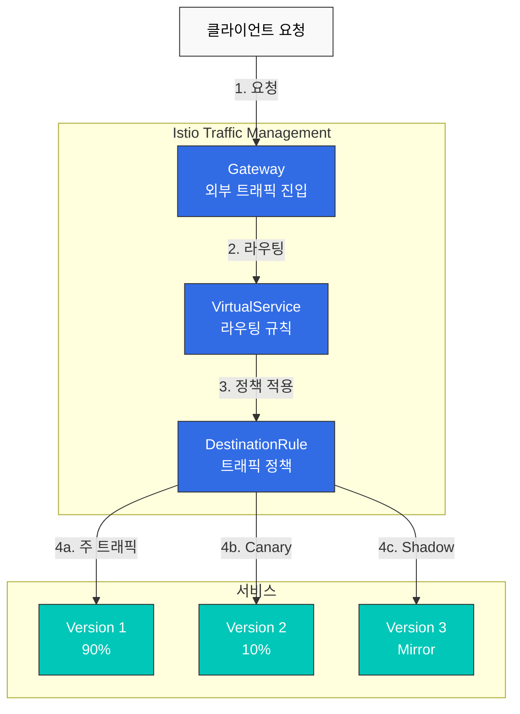
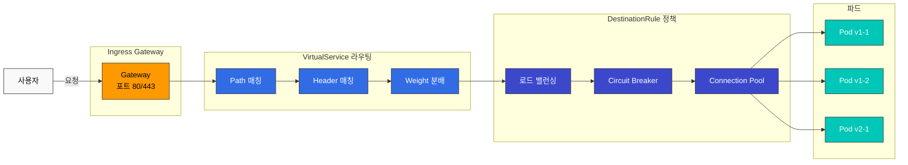

# Traffic Management

Istio의 트래픽 관리 기능은 서비스 메시 내에서 트래픽 흐름을 세밀하게 제어할 수 있게 해줍니다.

## 목차

1. [Gateway와 VirtualService](01-gateway-virtualservice.md)
2. [라우팅](02-routing.md)
3. [DestinationRule](03-destination-rule.md) ⭐ 필수 개념
4. [트래픽 분할](04-traffic-splitting.md)
5. [Retry 및 Timeout](05-retry-timeout.md)
6. [로드 밸런싱](06-load-balancing.md)
7. [Circuit Breaker](07-circuit-breaker.md)
8. [Fault Injection](08-fault-injection.md)
9. [Traffic Mirroring](09-traffic-mirror.md)
10. [Session Affinity](10-session-affinity.md)
11. [Egress 제어](11-egress-control.md)
12. [ServiceEntry (외부 서비스 관리)](12-service-entry.md)

## 개요

트래픽 관리는 Istio의 핵심 기능 중 하나로, 다음과 같은 작업을 코드 변경 없이 수행할 수 있습니다:

### 주요 기능



### 1. 지능형 라우팅

- **Path 기반**: `/api/v1` → Service A, `/api/v2` → Service B
- **Header 기반**: `User-Agent: Mobile` → Mobile Version
- **Cookie 기반**: 특정 사용자를 특정 버전으로 라우팅
- **Weight 기반**: 트래픽을 비율로 분배

### 2. 배포 전략

**Canary 배포**:
```yaml
# 10%만 새 버전으로
route:
- destination:
    host: reviews
    subset: v1
  weight: 90
- destination:
    host: reviews
    subset: v2
  weight: 10
```

**Blue/Green 배포**:
```yaml
# 순간 전환
route:
- destination:
    host: reviews
    subset: v2  # Green으로 전환
  weight: 100
```

### 3. 복원력 패턴

- **Circuit Breaker**: 장애 서비스 격리
- **Retry**: 자동 재시도
- **Timeout**: 응답 시간 제한
- **Rate Limiting**: 요청 속도 제한

### 4. 테스트 및 디버깅

- **Traffic Mirroring**: 프로덕션 트래픽 복제하여 테스트
- **Fault Injection**: 의도적인 장애 주입
- **A/B Testing**: 사용자 그룹별 다른 버전 제공

## 핵심 리소스

### Gateway

외부 트래픽이 메시로 들어오는 진입점을 정의합니다.

```yaml
apiVersion: networking.istio.io/v1
kind: Gateway
metadata:
  name: my-gateway
spec:
  selector:
    istio: ingressgateway
  servers:
  - port:
      number: 80
      name: http
      protocol: HTTP
    hosts:
    - "myapp.example.com"
```

### VirtualService

요청을 어떻게 라우팅할지 정의합니다.

```yaml
apiVersion: networking.istio.io/v1
kind: VirtualService
metadata:
  name: reviews
spec:
  hosts:
  - reviews
  http:
  - match:
    - uri:
        prefix: "/v2"
    route:
    - destination:
        host: reviews
        subset: v2
  - route:
    - destination:
        host: reviews
        subset: v1
```

### DestinationRule

대상 서비스에 대한 정책을 정의합니다.

```yaml
apiVersion: networking.istio.io/v1
kind: DestinationRule
metadata:
  name: reviews
spec:
  host: reviews
  trafficPolicy:
    loadBalancer:
      simple: LEAST_REQUEST
  subsets:
  - name: v1
    labels:
      version: v1
  - name: v2
    labels:
      version: v2
```

## 실전 예제

### 안전한 Canary 배포

```yaml
# 1단계: 5% 트래픽으로 시작
apiVersion: networking.istio.io/v1
kind: VirtualService
metadata:
  name: reviews-canary
spec:
  hosts:
  - reviews
  http:
  - route:
    - destination:
        host: reviews
        subset: v1
      weight: 95
    - destination:
        host: reviews
        subset: v2
      weight: 5
```

모니터링 후 문제가 없으면 점진적으로 증가:
- 5% → 10% → 25% → 50% → 100%

### Header 기반 라우팅 (개발자 테스트)

```yaml
apiVersion: networking.istio.io/v1
kind: VirtualService
metadata:
  name: reviews-dev
spec:
  hosts:
  - reviews
  http:
  # 개발자는 새 버전 사용
  - match:
    - headers:
        x-dev-user:
          exact: "true"
    route:
    - destination:
        host: reviews
        subset: v2
  # 일반 사용자는 안정 버전
  - route:
    - destination:
        host: reviews
        subset: v1
```

### Circuit Breaker + Retry

```yaml
apiVersion: networking.istio.io/v1
kind: DestinationRule
metadata:
  name: reviews-resilient
spec:
  host: reviews
  trafficPolicy:
    # Connection Pool 설정
    connectionPool:
      tcp:
        maxConnections: 100
      http:
        http1MaxPendingRequests: 50
        maxRequestsPerConnection: 2
    # Circuit Breaker
    outlierDetection:
      consecutiveErrors: 5
      interval: 30s
      baseEjectionTime: 30s
---
apiVersion: networking.istio.io/v1
kind: VirtualService
metadata:
  name: reviews-retry
spec:
  hosts:
  - reviews
  http:
  - route:
    - destination:
        host: reviews
    retries:
      attempts: 3
      perTryTimeout: 2s
      retryOn: 5xx,reset,connect-failure
    timeout: 10s
```

## 트래픽 흐름



## 학습 순서

트래픽 관리를 효과적으로 학습하려면 다음 순서를 권장합니다:

1. **[Gateway와 VirtualService](01-gateway-virtualservice.md)** ⭐ 시작점
   - 기본 개념 이해
   - 외부 트래픽 처리

2. **[라우팅](02-routing.md)**
   - 고급 라우팅 패턴
   - 조건부 라우팅

3. **[DestinationRule](03-destination-rule.md)** ⭐ 필수 개념
   - Subset 개념 이해
   - Traffic Policy 기초
   - VirtualService와 통합

4. **[트래픽 분할](04-traffic-splitting.md)**
   - Canary 배포
   - A/B 테스트

5. **[Retry 및 Timeout](05-retry-timeout.md)**
   - 장애 복구
   - 응답 시간 제어

6. **[로드 밸런싱](06-load-balancing.md)**
   - 다양한 알고리즘
   - 성능 최적화

7. **[Circuit Breaker](07-circuit-breaker.md)**
   - 장애 격리
   - Cascading Failure 방지

8. **[Fault Injection](08-fault-injection.md)**
   - 장애 테스트
   - Chaos Engineering

9. **[Traffic Mirroring](09-traffic-mirror.md)**
   - 프로덕션 테스트
   - 새 버전 검증

10. **[Session Affinity](10-session-affinity.md)**
    - Sticky Session
    - 상태 유지

11. **[Egress 제어](11-egress-control.md)**
    - 외부 서비스 접근
    - 보안 강화

12. **[ServiceEntry](12-service-entry.md)**
    - 외부 서비스 등록
    - Egress Gateway 통합

## 모범 사례

### 1. 점진적 롤아웃

```yaml
# ❌ 나쁜 예: 한번에 100%
weight: 100

# ✅ 좋은 예: 점진적 증가
# 5% → 모니터링 → 10% → 모니터링 → ...
```

### 2. 항상 Timeout 설정

```yaml
# ✅ 항상 timeout 설정
http:
- route:
  - destination:
      host: reviews
  timeout: 10s
```

### 3. Retry 신중하게 사용

```yaml
# ✅ 멱등성이 보장되는 경우만
retries:
  attempts: 3
  perTryTimeout: 2s
  retryOn: 5xx,reset,connect-failure
```

### 4. Circuit Breaker 임계값 조정

```yaml
# ✅ 서비스 특성에 맞게 조정
outlierDetection:
  consecutiveErrors: 5      # 서비스에 따라 조정
  interval: 30s
  baseEjectionTime: 30s
  maxEjectionPercent: 50    # 최대 50%만 제외
```

### 5. 메트릭 모니터링

트래픽 관리 변경 시 반드시 모니터링:
- **Request Rate**: 요청 수 변화
- **Error Rate**: 에러 비율
- **Latency**: P50, P95, P99 지연시간
- **Success Rate**: 성공률

## 문제 해결

### Traffic이 라우팅되지 않음

```bash
# 1. VirtualService 확인
kubectl get virtualservice -n <namespace>
kubectl describe virtualservice <name> -n <namespace>

# 2. DestinationRule 확인
kubectl get destinationrule -n <namespace>

# 3. 파드 레이블 확인
kubectl get pods --show-labels -n <namespace>

# 4. Istio 구성 분석
istioctl analyze -n <namespace>
```

### Weight가 적용되지 않음

```bash
# Envoy 구성 확인
istioctl proxy-config routes <pod-name> -n <namespace>

# 클러스터 정보 확인
istioctl proxy-config clusters <pod-name> -n <namespace>
```

## 다음 단계

1. **[Security](../security/README.md)**: mTLS 및 인증/권한 부여
2. **[Observability](../observability/README.md)**: 메트릭, 로그, 트레이스
3. **[Resilience](../resilience/README.md)**: Rate Limiting, Zone Aware Routing

## 참고 자료

- [Istio Traffic Management](https://istio.io/latest/docs/concepts/traffic-management/)
- [VirtualService Reference](https://istio.io/latest/docs/reference/config/networking/virtual-service/)
- [DestinationRule Reference](https://istio.io/latest/docs/reference/config/networking/destination-rule/)
- [Gateway Reference](https://istio.io/latest/docs/reference/config/networking/gateway/)

## 퀴즈

이 장에서 배운 내용을 테스트하려면 [Istio Traffic Management 퀴즈](../../../quizzes/tools/istio/traffic-management.md)를 풀어보세요.
