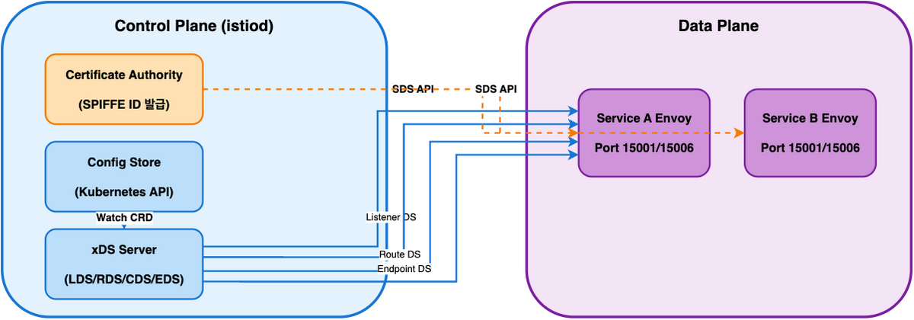
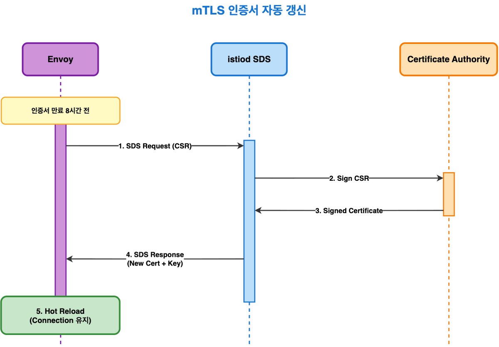
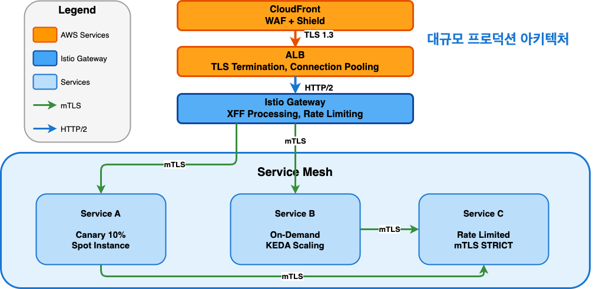
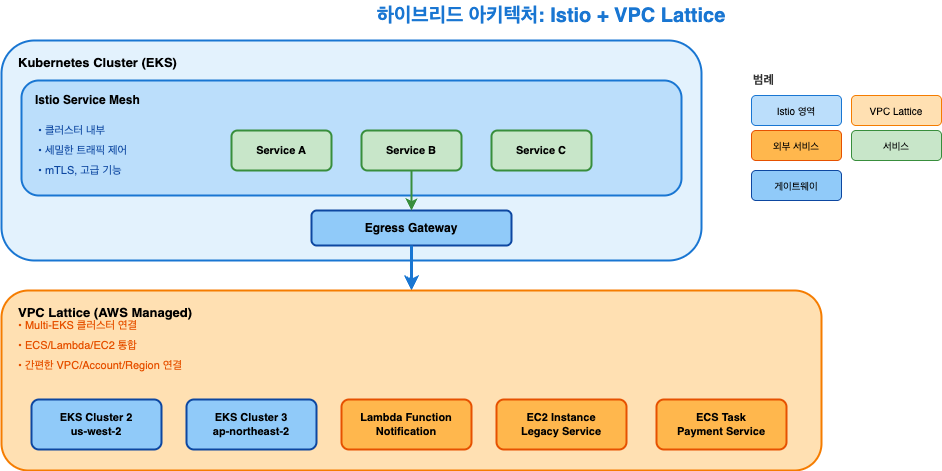

<!-- _footer: '📚 https://atomoh.gitbook.io/kubernetes-docs/tools-and-integrations/istio' -->


# 대규모 Kubernetes 클러스터에서 Istio가 필요한 이유

**네트워크 전문가를 위한 실전 가이드 (Level 300)**

*2시간 세션 - Advanced/Expert*

---
<!-- _footer: '📚 https://atomoh.gitbook.io/kubernetes-docs/tools-and-integrations/istio/advanced/08-argo-rollouts' -->


## 목차

1. **왜 대규모에서 Istio인가?** (15분)
2. **트래픽 관리: Canary & Locality** (35분)
3. **비용 최적화: Spot Instance & Scaling** (25분)
4. **보안: mTLS & 접근 제어** (30분)
5. **고급 제어: EnvoyFilter & Rate Limiting** (25분)
6. **실전 아키텍처 & Troubleshooting** (20분)

---
<!-- _footer: '📚 https://atomoh.gitbook.io/kubernetes-docs/tools-and-integrations/istio/03-architecture' -->


## 대상 청중 (Level 300)

**필수 사전 지식**:
- ✅ TCP/IP, HTTP/2, TLS/mTLS 심화 이해
- ✅ L4/L7 로드 밸런서 운영 경험
- ✅ Kubernetes 프로덕션 경험 (100+ Pods)
- ✅ 인증서 체인, PKI 인프라 이해
- ✅ 분산 시스템 디버깅 경험

**학습 목표**: Envoy 내부 동작, xDS 프로토콜, 프로덕션 문제 해결

---
<!-- _footer: '📚 https://atomoh.gitbook.io/kubernetes-docs/tools-and-integrations/istio' -->


# Part 1: 왜 대규모에서 Istio인가?

---
<!-- _footer: '📚 https://atomoh.gitbook.io/kubernetes-docs/tools-and-integrations/istio/advanced/08-argo-rollouts' -->


## 문제 상황: 실제 프로덕션 시나리오

**규모**:
- Services: 150+
- Pods: 2000+
- RPS: 100K+
- Multi-AZ/Region

**구체적 문제**:
```
❌ 크로스 AZ 비용: 월 $50K (1TB/day × 30일 × $0.01/GB × 2방향)
❌ 배포 실패율: 15% (수동 Canary, 메트릭 누락)
❌ mTLS 구현: 12개 언어별 중복 (Go, Java, Python, Node...)
❌ Rate Limit: 서비스마다 다른 로직 → 불일치
❌ 배포 시간: 4시간 (수동 검증, 승인, 롤백 포함)
```

---
<!-- _footer: '📚 https://atomoh.gitbook.io/kubernetes-docs/tools-and-integrations/istio/advanced/08-argo-rollouts' -->


## 전통적 방식 vs Istio (Level 300 비교)

<div class="tiny">

| 항목 | 전통 방식 | 문제점 | Istio | 기술 세부사항 |
|------|----------|--------|-------|-------------|
| **mTLS** | 앱 코드 통합 | 언어별 구현, 인증서 관리 | Envoy sidecar | SPIFFE/SPIRE, SDS API |
| **Canary** | kubectl scale | Pod 수 ≠ 트래픽 비율 | VirtualService weight | xDS EDS 업데이트 |
| **Locality** | kube-proxy | 모든 트래픽 균등 분산 | DestinationRule locality | Priority/Weight 기반 EDS |
| **Rate Limit** | App 레벨 | 분산 환경 정확도 낮음 | EnvoyFilter | Token Bucket, Local/Global |
| **Observability** | APM 통합 | 서비스별 계측 필요 | 자동 메트릭 | Envoy stats, Access Log |
| **Circuit Breaking** | 수동 구현 | Timeout/Retry 불일치 | DestinationRule | Outlier Detection |

</div>

---
<!-- _footer: '📚 https://atomoh.gitbook.io/kubernetes-docs/tools-and-integrations/istio/02-basic-concepts' -->


## Service Mesh의 탄생 배경

<div class="columns">
<div>

**2010년대 마이크로서비스 시대**:
```
모놀리스 → 마이크로서비스 전환
- Netflix: 수백 개 서비스
- Uber: 2,000+ 서비스
- Amazon: SOA → 마이크로서비스
```

</div>
<div>

**새로운 문제들**:
```
❌ 서비스 간 통신 복잡도 폭발
   - N개 서비스 = N×(N-1) 연결
   - 100 서비스 = 9,900 연결 관리

❌ 보안 (mTLS)을 각 언어로 구현
   - Go, Java, Python, Node.js, Ruby, C++...
   - 중복 코드, 버그, 인증서 관리

❌ 관찰성 (Observability) 부재
   - 어느 서비스가 느린지?
   - 에러는 어디서?

❌ 트래픽 제어 어려움
   - Canary 배포 = kubectl scale (부정확)
   - Circuit Breaking = 각자 구현
```

</div>
</div>

---
<!-- _footer: '📚 https://atomoh.gitbook.io/kubernetes-docs/tools-and-integrations/istio/02-basic-concepts' -->


## Envoy Proxy의 등장 (2016)

<div class="columns">
<div>

**Lyft의 문제**:
```
- 수백 개 마이크로서비스
  (Python, Go, Java 혼재)
- 기존 프록시 한계
  (HAProxy, NGINX)
  → 정적 설정
  → L7 기능 부족
  → 각 서비스에 로드 밸런서
    코드 중복
```

</div>
<div>

**Matt Klein의 해결책: Envoy**
- **L7 Proxy**: HTTP/2, gRPC 네이티브
- **동적 설정**: xDS API
- **풍부한 관찰성**: 50+ 메트릭,
  Access Log, Tracing
- **고성능**: C++, 비동기 I/O
- **확장 가능**: Filter Chain
  (Lua, WASM)

**2016년 오픈소스 공개** → CNCF

</div>
</div>

---
<!-- _footer: '📚 https://atomoh.gitbook.io/kubernetes-docs/tools-and-integrations/istio/02-basic-concepts' -->


## Istio의 탄생 (2017)

<div class="columns">
<div>

**Google + IBM + Lyft 협력**:
```
문제: Envoy는 훌륭하지만 설정이 복잡
     → 각 마이크로서비스마다 Envoy 설정?
     → 수백 개 서비스 = 수백 개 설정 파일

해결: Kubernetes 네이티브 컨트롤 플레인
     → VirtualService, DestinationRule (CRD)
     → istiod가 자동으로 Envoy 설정 생성
     → xDS API로 동적 푸시
```

</div>
<div>

**Istio 주요 마일스톤**:
- **2017.05**: Istio 0.1 공개 (Pilot, Mixer, Citadel 분리)
- **2019**: Istio 1.1 (성능 개선, 프로덕션 준비)
- **2020**: Istio 1.5 → **Istiod 통합** (단일 바이너리)
- **2022**: Istio 1.14 → **Ambient Mode** (Sidecar 없음)
- **2025**: Istio 1.24 (현재 버전)

</div>
</div>

---
<!-- _footer: '📚 https://atomoh.gitbook.io/kubernetes-docs/tools-and-integrations/istio/02-basic-concepts' -->


## 왜 Istio인가? (핵심 가치)

<div class="columns-4">
<div>

**1. 트래픽 관리 </br>(Traffic Management)**
```
✅ Canary 배포: 1% 단위로 정밀 제어
✅ A/B 테스팅: Header 기반 라우팅
✅ Circuit Breaking: 자동 장애 격리
✅ Retry & Timeout: 세밀한 설정
```

</div>
<div>

**2. 보안 </br>(Security)**
```
✅ 자동 mTLS: 코드 수정 없이 암호화
✅ SPIFFE Identity: 표준 기반 인증
✅ AuthorizationPolicy: L7 수준 접근 제어
✅ 인증서 자동 갱신: 15분마다
```

</div>
<div>

**3. 관찰성 </br>(Observability)**
```
✅ 자동 메트릭: 50+ Prometheus 메트릭
✅ 분산 추적: Jaeger, Zipkin 통합
✅ Access Log: 모든 요청 기록
✅ Kiali: 실시간 서비스 토폴로지
```

</div>
<div>

**4. 회복력 </br>(Resilience)**
```
✅ Outlier Detection: 느린 Pod 자동 제거
✅ Connection Pool: 과부하 방지
✅ Locality Routing: 비용 절감
✅ Fault Injection: Chaos Engineering
```

</div>
</div>

---
<!-- _footer: '📚 https://atomoh.gitbook.io/kubernetes-docs/tools-and-integrations/istio/03-architecture' -->


## Istio 아키텍처: Control Plane 심화



---
<!-- _footer: '📚 https://atomoh.gitbook.io/kubernetes-docs/tools-and-integrations/istio/03-architecture' -->


## xDS 프로토콜: Envoy 동적 설정

**xDS API 구성**:
```
LDS (Listener Discovery Service)    → 15001: Inbound, 15006: Outbound
RDS (Route Discovery Service)        → VirtualService 규칙
CDS (Cluster Discovery Service)      → DestinationRule 정책
EDS (Endpoint Discovery Service)     → Pod IP, Health, Locality
SDS (Secret Discovery Service)       → mTLS 인증서, Private Key
```

**업데이트 흐름**:
```bash
VirtualService 생성
  → istiod가 RDS 업데이트 감지
  → Envoy에 새 라우팅 규칙 푸시 (xDS)
  → Envoy가 즉시 적용 (< 100ms)
```

---
<!-- _footer: '📚 https://atomoh.gitbook.io/kubernetes-docs/tools-and-integrations/istio/advanced/08-argo-rollouts' -->


# Part 2: 트래픽 관리 (Advanced)

## Canary Deployment & Locality Routing

---
<!-- _footer: '📚 https://atomoh.gitbook.io/kubernetes-docs/tools-and-integrations/istio/advanced/08-argo-rollouts' -->


## Envoy Routing: 내부 동작 원리

**Listener Filter Chain**:
```
1. TLS Inspector → SNI 추출
2. HTTP Connection Manager → HTTP/1.1, HTTP/2, HTTP/3
3. Router Filter → VirtualService 매칭
4. Upstream Cluster → DestinationRule 적용
5. Load Balancer → Pod 선택
```

**Routing 우선순위**:
```yaml
# VirtualService match 우선순위
1. Exact match (exact: "/api/v1/users")
2. Prefix match (prefix: "/api/")
3. Regex match (regex: "^/api/v[0-9]+/")
4. 기본 route (match 없음)
```

---
<!-- _footer: '📚 https://atomoh.gitbook.io/kubernetes-docs/tools-and-integrations/istio/traffic-management/02-routing' -->


## L7 라우팅: Header 기반 라우팅

**User-Agent 기반 라우팅**:

<div class="nano">

```yaml
spec:
  http:
  # Mobile 디바이스
  - match:
    - headers:
        user-agent:
          regex: ".*Mobile.*"
    route:
    - destination:
        host: myapp
        subset: mobile
  # Desktop (기본)
  - route:
    - destination:
        host: myapp
        subset: desktop
```

</div>

---
<!-- _footer: '📚 https://atomoh.gitbook.io/kubernetes-docs/tools-and-integrations/istio/traffic-management/02-routing' -->


## L7 라우팅: Custom Header & API Version

<div class="small">

```yaml
spec:
  http:
  # API v3 (헤더 기반)
  - match:
    - headers:
        x-api-version:
          exact: "v3"
    route:
    - destination:
        host: api-service
        subset: v3
  # VIP 사용자 (Custom Header)
  - match:
    - headers:
        x-user-tier:
          exact: "vip"
    route:
    - destination:
        host: api-service
        subset: vip
  # 기본 (v1)
  - route:
    - destination:
        host: api-service
        subset: v1
```

</div>

---
<!-- _footer: '📚 https://atomoh.gitbook.io/kubernetes-docs/tools-and-integrations/istio/traffic-management/01-gateway-virtualservice' -->


## URI Rewrite & Redirect

<div class="columns">
<div>

**URI Rewrite**:

<div class="small">

```yaml
spec:
  http:
  # /old-api → /api/v2 로 재작성
  - match:
    - uri:
        prefix: "/old-api"
    rewrite:
      uri: "/api/v2"
    route:
    - destination:
        host: api-service
```

</div>

</div>
<div>

**Redirect**:

<div class="small">

```yaml
  # 301 Redirect
  - match:
    - uri:
        prefix: "/old-page"
    redirect:
      uri: "/new-page"
      authority: "newapp.example.com"
```

</div>

</div>
</div>

---
<!-- _footer: '📚 https://atomoh.gitbook.io/kubernetes-docs/tools-and-integrations/istio/traffic-management/01-gateway-virtualservice' -->


## Header 조작: Request & Response

<div class="small">

```yaml
spec:
  http:
  - route:
    - destination:
        host: reviews
    headers:
      request:
    headers:
      request:
        add:
          x-custom-header: "custom-value"
          x-forwarded-proto: "https"
        set:
          x-api-version: "v2"
        remove:
          - x-internal-header
      response:
        add:
          x-response-time: "100ms"
          x-server-version: "v1.2.3"
        remove:
          - x-sensitive-info
```

</div>

---
<!-- _footer: '📚 https://atomoh.gitbook.io/kubernetes-docs/tools-and-integrations/istio/traffic-management/02-routing' -->


## Match 조건 조합 & 우선순위

<div class="columns">
<div>

<div class="small">

**AND 조건** (모든 조건 일치):
```yaml
http:
- match:
  - uri:
      prefix: "/api"
    headers:
      x-api-version:
        exact: "v2"
    queryParams:
      debug:
        exact: "true"
  route:
  - destination:
      host: api-debug
```

</div>

</div>
<div>

<div class="small">

**OR 조건** (여러 match 블록):
```yaml
http:
- match:
  - uri:
      prefix: "/api/v1"
  - uri:
      prefix: "/api/v2"
  route:
  - destination:
      host: api-service
```

**우선순위**: 위에서 아래로 순차 평가 → 구체적인 규칙을 먼저 배치

</div>

</div>
</div>

---
<!-- _footer: '📚 https://atomoh.gitbook.io/kubernetes-docs/tools-and-integrations/istio/advanced/08-argo-rollouts' -->


## Argo Rollouts + Istio: 내부 동작

**VirtualService 자동 조정**:

```yaml
# Rollout이 자동으로 업데이트하는 부분
apiVersion: networking.istio.io/v1
kind: VirtualService
metadata:
  name: myapp-vsvc
spec:
  http:
  - name: primary
    route:
    - destination:
        host: myapp
        subset: stable
      weight: 90  # Rollout Controller가 조정
    - destination:
        host: myapp
        subset: canary
      weight: 10  # Rollout Controller가 조정

      
```


---
<!-- _footer: '📚 https://atomoh.gitbook.io/kubernetes-docs/tools-and-integrations/istio/advanced/08-argo-rollouts' -->


## Argo Rollouts: Reconcile Loop 분석

<div class="tiny">

**내부 동작**:
1. **Rollout Controller**:
   ```
   - Image 변경 감지
   - Canary ReplicaSet 생성
   - VirtualService weight 업데이트 (10%)
   - AnalysisRun 시작
   ```

2. **Analysis Controller**:
   ```
   - Prometheus 쿼리 실행 (30초 간격)
   - successCondition 평가
   - failureLimit 카운팅
   - Rollout에 결과 전달 (Success/Failed)
   ```

3. **자동 진행/롤백**:
   ```
   Success → weight 증가 (10% → 25%)  |   Failed  → weight 복원 (10% → 0%), Stable로 복구
   ```

</div>

---
<!-- _footer: '📚 https://atomoh.gitbook.io/kubernetes-docs/tools-and-integrations/istio/advanced/08-argo-rollouts' -->


## AnalysisTemplate: 프로덕션 예제


```yaml
apiVersion: argoproj.io/v1alpha1
kind: AnalysisTemplate
metadata:
  name: comprehensive-analysis
spec:
  args:
  - name: service-name
  - name: canary-pod-hash
  metrics:
  # 1. 성공률 (5xx 에러 < 5%)
  - name: success-rate
    interval: 30s
    count: 10
    successCondition: result >= 0.95
    failureLimit: 3
    provider:
      prometheus:
        address: http://prometheus.istio-system:9090
        query: |
          sum(rate(istio_requests_total{
            destination_service_name="{{args.service-name}}",
            destination_workload=~".*{{args.canary-pod-hash}}",
            response_code!~"5.*"}[2m]))
          /
          sum(rate(istio_requests_total{
            destination_service_name="{{args.service-name}}",
            destination_workload=~".*{{args.canary-pod-hash}}"}[2m]))
```


---
<!-- _footer: '📚 https://atomoh.gitbook.io/kubernetes-docs/tools-and-integrations/istio/advanced/08-argo-rollouts' -->


## AnalysisTemplate: 다중 메트릭 검증

<div class="tiny">

```yaml
  # 2. P95 Latency (< 500ms)
  - name: p95-latency
    interval: 30s
    count: 10
    successCondition: result < 500
    failureLimit: 3
    provider:
      prometheus:
        query: |
          histogram_quantile(0.95,
            sum(rate(istio_request_duration_milliseconds_bucket{
              destination_service_name="{{args.service-name}}",
              destination_workload=~".*{{args.canary-pod-hash}}"}[2m])) by (le))
  # 3. 메모리 사용률 (< 80%)
  - name: memory-usage
    interval: 30s
    count: 10
    successCondition: result < 0.8
    provider:
      prometheus:
        query: |
          max(container_memory_working_set_bytes{
            pod=~"{{args.service-name}}-.*{{args.canary-pod-hash}}.*"}
          ) / max(container_spec_memory_limit_bytes{
            pod=~"{{args.service-name}}-.*{{args.canary-pod-hash}}.*"})
```

</div>

---
<!-- _footer: '📚 https://atomoh.gitbook.io/kubernetes-docs/tools-and-integrations/istio/advanced/08-argo-rollouts' -->


## Canary 배포 실전 문제: Split Brain

**문제 시나리오**:
```
VirtualService: 10% Canary
실제 트래픽:   50% Canary (❌ 불일치!)
```

**원인**:
```bash
# DestinationRule의 서브셋 레이블이 잘못됨
kubectl get pods -l app=myapp --show-labels

# Canary Pod에 stable 레이블이 남아있음
myapp-canary-abc123   app=myapp,version=canary,rollouts-pod-template-hash=stable
```

**해결**:
```bash
# Rollout이 자동으로 관리하는 레이블 확인
kubectl get replicaset -l app=myapp -o yaml | grep rollouts-pod-template-hash
```

---
<!-- _footer: '📚 https://atomoh.gitbook.io/kubernetes-docs/tools-and-integrations/istio/resilience/03-zone-aware-routing' -->


## Locality Routing: Envoy Priority & Weight

<div class="columns">
<div>

**Locality Priority 구조**:
```
Priority 0 (Local AZ):
  - us-east-1a/pod-1: healthy, weight=1
  - us-east-1a/pod-2: healthy, weight=1
Priority 1 (Other AZ):
  - us-east-1b/pod-3: healthy, weight=1
  - us-east-1c/pod-4: degraded (excluded)
Priority 2 (Remote Region):
  - us-west-1a/pod-5: healthy, weight=1
```

**로드 밸런싱 알고리즘**:
- Priority 0이 Healthy → 100% Priority 0으로 전송
- Priority 0이 Degraded → Priority 1로 Failover

</div>
<div>

**Overprovisioning Factor: 140% (기본값)**

건강한 엔드포인트 비율 계산:
```
Healthy × 1.4 ≥ Total
```

**예제**:
```
시나리오 1: 10개 엔드포인트, 8개 healthy
→ 8 × 1.4 = 11.2 ≥ 10 ✅
→ Priority 0에 100% 전송

시나리오 2: 10개 엔드포인트, 7개 healthy
→ 7 × 1.4 = 9.8 < 10 ❌
→ Priority 1로 spillover
```

**목적**: 안정성 확보 + 비용 절감

</div>
</div>

---
<!-- _footer: '📚 https://atomoh.gitbook.io/kubernetes-docs/tools-and-integrations/istio/resilience/03-zone-aware-routing' -->


## Locality Routing: 고급 설정

<div class="small">

```yaml
apiVersion: networking.istio.io/v1
kind: DestinationRule
metadata:
  name: advanced-locality
spec:
  host: api-service
  trafficPolicy:
    loadBalancer:
      simple: LEAST_REQUEST
      localityLbSetting:
        enabled: true
        # 세밀한 분배 비율
        distribute:
        - from: us-east-1/us-east-1a/*
          to:
            "us-east-1/us-east-1a/*": 80  # 같은 AZ 80%
            "us-east-1/us-east-1b/*": 15  # 인접 AZ 15%
            "us-east-1/us-east-1c/*": 5   # 원격 AZ 5%
        # Failover 순서
        failover:
        - from: us-east-1/us-east-1a
          to: us-east-1/us-east-1b       # 1순위 Failover
        - from: us-east-1/us-east-1b
          to: us-east-1/us-east-1c
```

</div>

---
<!-- _footer: '📚 https://atomoh.gitbook.io/kubernetes-docs/tools-and-integrations/istio/resilience/03-zone-aware-routing' -->


## Locality Routing: 비용 계산

**시나리오**: 100 Services, 각 1TB/day

**Before (Locality 없음)**:
```
크로스 AZ 트래픽: 1TB/day × 100 services × 50% (평균)
= 50TB/day
비용: 50TB × 30일 × $0.01/GB × 2방향 = $30,000/월
```

**After (80% Local AZ)**:
```
크로스 AZ 트래픽: 50TB/day × 20% = 10TB/day
비용: 10TB × 30일 × $0.01/GB × 2방향 = $6,000/월
절감: $24,000/월 (80%)
```

---
<!-- _footer: '📚 https://atomoh.gitbook.io/kubernetes-docs/tools-and-integrations/istio/resilience/03-zone-aware-routing' -->


## Locality Routing 디버깅

<div class="small">

```bash
# 1. Pod의 Locality 레이블 확인
kubectl get pods -o json | jq -r '.items[] |
  "\(.metadata.name)\t\(.metadata.labels["topology.kubernetes.io/region"])\t
   \(.metadata.labels["topology.kubernetes.io/zone"])"'

# 2. Envoy Endpoint Priority 확인
istioctl proxy-config endpoints <pod-name> --cluster "outbound|9080||api-service.default.svc.cluster.local" -o json | \
  jq '.[] | .localityLbEndpoints[] | {locality: .locality, priority: .priority, lb_endpoints: .lbEndpoints[]}'

# 3. 실제 트래픽 분포 확인 (Prometheus)
sum by (destination_workload_locality) (rate(istio_requests_total{
  source_workload="frontend",
  destination_service="api-service"}[5m]))
```

</div>

---
<!-- _footer: '📚 https://atomoh.gitbook.io/kubernetes-docs/tools-and-integrations/istio/advanced/10-keda-autoscaling' -->


# Part 3: 비용 최적화 (Advanced)

## Spot Instance & KEDA Scaling

---
<!-- _footer: '📚 https://atomoh.gitbook.io/kubernetes-docs/tools-and-integrations/istio/advanced/10-keda-autoscaling' -->


## Spot Instance: Graceful Termination 메커니즘

**타임라인**:
```
T-120s: EC2 Spot Termination Notice
T-90s:  Node Termination Handler → Cordon Node
T-60s:  kubelet → SIGTERM to Pods
T-30s:  Envoy PreStop Hook 시작
T-20s:  Envoy Health Check → /healthz/ready 실패 반환
T-15s:  istiod → EDS에서 Endpoint 제거
T-10s:  모든 Envoy Sidecar가 EDS 업데이트 수신
T-5s:   기존 연결 Drain (최대 30초)
T-0s:   Pod 종료
```

**핵심**: Envoy가 새 연결을 거부하고 기존 연결을 정리

---
<!-- _footer: '📚 https://atomoh.gitbook.io/kubernetes-docs/tools-and-integrations/istio/advanced/10-keda-autoscaling' -->


## KEDA: Custom Metrics & Scaling

<div class="small">

```yaml
apiVersion: keda.sh/v1alpha1
kind: ScaledObject
metadata:
  name: advanced-scaling
spec:
  scaleTargetRef:
    name: api-service
  minReplicaCount: 3
  maxReplicaCount: 100

  # 다중 Trigger (OR 조건)
  triggers:
  # 1. RPS 기반 Scaling
  - type: prometheus
    metadata:
      serverAddress: http://prometheus:9090
      query: |
        sum(rate(istio_requests_total{
          destination_service="api-service"}[1m]))
      threshold: "1000"  # 1000 RPS per replica

  # 2. Queue Depth 기반 Scaling
  - type: prometheus
    metadata:
      query: |
        sum(envoy_cluster_upstream_rq_pending{
          cluster_name=~"outbound.*api-service.*"})
      threshold: "50"  # 50개 대기 요청
```

</div>

---
<!-- _footer: '📚 https://atomoh.gitbook.io/kubernetes-docs/tools-and-integrations/istio/advanced/10-keda-autoscaling' -->


## KEDA: 고급 Scaling 전략

<div class="tiny">

```yaml
  # 3. CPU + Memory 복합 메트릭
  - type: prometheus
    metadata:
      query: |
        (avg(rate(container_cpu_usage_seconds_total{
          pod=~"api-service-.*"}[1m])) * 100) +
        (avg(container_memory_working_set_bytes{
          pod=~"api-service-.*"}) /
         avg(container_spec_memory_limit_bytes{
          pod=~"api-service-.*"}) * 100)
      threshold: "150"  # CPU + Memory > 150%

  # Cool-down 설정
  advanced:
    horizontalPodAutoscalerConfig:
      behavior:
        scaleDown:
          stabilizationWindowSeconds: 300  # 5분 안정화
          policies:
          - type: Percent
            value: 50  # 최대 50%씩 축소
            periodSeconds: 60
        scaleUp:
          stabilizationWindowSeconds: 0  # 즉시 확장
          policies:
          - type: Percent
            value: 100  # 최대 2배 확장
            periodSeconds: 15
```

</div>

---
<!-- _footer: '📚 https://atomoh.gitbook.io/kubernetes-docs/tools-and-integrations/istio/advanced/10-keda-autoscaling' -->


## KEDA + Spot: 프로덕션 시나리오

**문제**: Spot Termination 중 Scale-out 발생

**시나리오**:
```
1. Spot Termination 시작 (3개 Pod 종료)
2. KEDA가 부하 증가 감지 → Scale-out 트리거
3. 새 Pod이 Spot Node에 스케줄링 (❌)
4. 또 다시 Termination (무한 반복)
```

**해결**: Priority Class + Topology Spread

<div class="small">

```yaml
apiVersion: v1
kind: PriorityClass
metadata:
  name: on-demand-preferred
value: 1000
globalDefault: false
preemptionPolicy: PreemptLowerPriority
```

</div>

---
<!-- _footer: '📚 https://atomoh.gitbook.io/kubernetes-docs/tools-and-integrations/istio/advanced/10-keda-autoscaling' -->


## Topology Spread Constraints

<div class="small">

```yaml
apiVersion: apps/v1
kind: Deployment
spec:
  template:
    spec:
      priorityClassName: on-demand-preferred

      # Spot/On-Demand 균등 분산
      topologySpreadConstraints:
      - maxSkew: 1
        topologyKey: node.kubernetes.io/instance-type
        whenUnsatisfiable: DoNotSchedule
        labelSelector:
          matchLabels:
            app: api-service

      # AZ 간 균등 분산
      - maxSkew: 2
        topologyKey: topology.kubernetes.io/zone
        whenUnsatisfiable: ScheduleAnyway
        labelSelector:
          matchLabels:
            app: api-service
```

</div>

---
<!-- _footer: '📚 https://atomoh.gitbook.io/kubernetes-docs/tools-and-integrations/istio/security/01-mtls' -->


# Part 4: 보안 (Advanced)

## mTLS & 접근 제어

---
<!-- _footer: '📚 https://atomoh.gitbook.io/kubernetes-docs/tools-and-integrations/istio/security/01-mtls' -->


## mTLS: SPIFFE Identity & Certificate

**SPIFFE ID 구조**:
```
spiffe://trust-domain/ns/namespace/sa/service-account

예시:
spiffe://cluster.local/ns/production/sa/api-service
```

**인증서 체인**:
```
Root CA (istiod CA)
  └─ Intermediate CA (선택)
      └─ Workload Certificate (24h TTL)
          - SAN: spiffe://cluster.local/ns/production/sa/api-service
          - Issuer: istiod
          - Subject: O=cluster.local
```

---
<!-- _footer: '📚 https://atomoh.gitbook.io/kubernetes-docs/tools-and-integrations/istio/security/01-mtls' -->


## mTLS: SDS API를 통한 인증서 갱신

<div class="columns-3">
<div>

**자동 갱신 흐름**:



</div>
<div>

**특징**:
- ✅ 자동 인증서 발급 및 갱신
- ✅ 워크로드 단위 인증서
- ✅ 15분마다 자동 갱신
- ✅ SPIFFE 표준 준수
- ✅ 별도 설정 불필요

**SPIFFE ID 예시**:

<div class="nano">

```
spiffe://cluster.local/
  ns/production/
  sa/api-service
```

</div>
</div>

<div>

**인증서 유형**:

<div>

**1. 워크로드 mTLS**
- istiod CA 발급
- SDS로 자동 배포
- 별도 설정 불필요

**2. Gateway TLS**
- 외부 트래픽 종료용
- Secret에 수동 저장
- cert-manager 권장

</div>
</div>
</div>

---
<!-- _footer: '📚 https://atomoh.gitbook.io/kubernetes-docs/tools-and-integrations/istio/security/01-mtls' -->


## mTLS: STRICT 모드 전환 전략

**단계적 전환**:

<div class="small">

```yaml
# Phase 1: PERMISSIVE (기본값)
apiVersion: security.istio.io/v1
kind: PeerAuthentication
metadata:
  name: default
  namespace: istio-system
spec:
  mtls:
    mode: PERMISSIVE  # mTLS + Plain 모두 허용
# Phase 2: 모니터링 (2주)
# Prometheus Query:
sum(rate(istio_requests_total{
  connection_security_policy="mutual_tls"}[5m])) /
sum(rate(istio_requests_total[5m]))
# 목표: > 99%
# Phase 3: STRICT 전환
spec:
  mtls:
    mode: STRICT  # Plain 차단


```

</div>

---
<!-- _footer: '📚 https://atomoh.gitbook.io/kubernetes-docs/tools-and-integrations/istio/security/01-mtls' -->


## mTLS 트러블슈팅: 연결 실패

<div class="small">

**증상**:
```
upstream connect error or disconnect/reset before headers. reset reason: connection failure
```

**디버깅**:
```bash
# 1. mTLS 상태 확인
istioctl authn tls-check <source-pod> <dest-service>

# 출력:
HOST:PORT             STATUS     CLIENT     SERVER
api-service.prod.svc  CONFLICT   mTLS       HTTP   ← 문제!

# 2. PeerAuthentication 확인
kubectl get peerauthentication -A

# 3. DestinationRule TLS 설정 확인
kubectl get destinationrule api-service -o yaml | grep tls

# 4. Envoy Secret 확인 (인증서 갱신 실패?)
istioctl proxy-config secret <pod> -o json | \
  jq '.dynamicActiveSecrets[] | select(.name | contains("default"))'
```

</div>

---
<!-- _footer: '📚 https://atomoh.gitbook.io/kubernetes-docs/tools-and-integrations/istio/security/03-authorization' -->


## Client IP 접근 제어: XFF 심화

**X-Forwarded-For 구조**:
```
Client IP: 203.0.113.5
CloudFront: 198.51.100.10
ALB: 10.0.1.20
Istio Gateway: 10.0.2.30

X-Forwarded-For: 203.0.113.5, 198.51.100.10, 10.0.1.20
                 ^^^^^^^^^^^^  (실제 Client IP)
```

**xff_num_trusted_hops 계산**:
```
CloudFront (1) + ALB (1) = 2 hops

XFF 헤더에서 뒤에서 2번째 = 실제 Client IP
```

---
<!-- _footer: '📚 https://atomoh.gitbook.io/kubernetes-docs/tools-and-integrations/istio/security/03-authorization' -->


## EnvoyFilter: XFF 고급 설정

<div class="tiny">

```yaml
apiVersion: networking.istio.io/v1alpha3
kind: EnvoyFilter
metadata:
  name: gateway-xff-advanced
  namespace: istio-system
spec:
  workloadSelector:
    labels:
      istio: ingressgateway
  configPatches:
  - applyTo: NETWORK_FILTER
    match:
      context: GATEWAY
      listener:
        filterChain:
          filter:
            name: "envoy.filters.network.http_connection_manager"
    patch:
      operation: MERGE
      value:
        typed_config:
          "@type": type.googleapis.com/envoy.extensions.filters.network.http_connection_manager.v3.HttpConnectionManager
          use_remote_address: true
          xff_num_trusted_hops: 2
          skip_xff_append: false  # XFF 헤더에 Envoy IP 추가

          # Original IP Detection
          original_ip_detection_extensions:
          - name: envoy.http.original_ip_detection.xff
            typed_config:
              "@type": type.googleapis.com/envoy.extensions.http.original_ip_detection.xff.v3.XffConfig
              xff_num_trusted_hops: 2
```

</div>

---
<!-- _footer: '📚 https://atomoh.gitbook.io/kubernetes-docs/tools-and-integrations/istio/security/03-authorization' -->


## AuthorizationPolicy: 고급 규칙

<div class="small">

```yaml
apiVersion: security.istio.io/v1
kind: AuthorizationPolicy
metadata:
  name: advanced-authz
spec:
  selector:
    matchLabels:
      app: admin-api
  # 기본 DENY
  action: DENY
  rules:
  # Rule 1: 회사 IP + 근무 시간만 허용
  - from:
    - source:
        notRemoteIpBlocks:
        - "203.0.113.0/24"
    when:
    - key: request.time
      values:
      - "Mon,Tue,Wed,Thu,Fri 09:00:00-18:00:00 KST"
  # Rule 2: Admin JWT 없으면 차단
  - from:
    - source:
        notRequestPrincipals:
        - "https://auth.example.com/admin"
```

</div>

---
<!-- _footer: '📚 https://atomoh.gitbook.io/kubernetes-docs/tools-and-integrations/istio/advanced/03-envoy-filter' -->


# Part 5: 고급 제어 (Advanced)

## EnvoyFilter & Rate Limiting

---
<!-- _footer: '📚 https://atomoh.gitbook.io/kubernetes-docs/tools-and-integrations/istio/advanced/03-envoy-filter' -->


## EnvoyFilter: HTTP Filter Chain 이해

<div class="columns">
<div>

**Envoy HTTP Filter 순서**:
```
1. envoy.filters.http.jwt_authn
   → JWT 토큰 검증

2. envoy.filters.http.ext_authz
   → 외부 인증 서버

3. envoy.filters.http.cors
   → CORS 처리

4. envoy.filters.http.local_ratelimit
   → Rate Limiting (여기에 삽입 예제)

5. envoy.filters.http.router
   → 최종 라우팅 (항상 마지막)
```

</div>
<div>

**INSERT_BEFORE vs INSERT_AFTER**:

<div class="small">

```yaml
# JWT 검증 전에 Filter 삽입
operation: INSERT_BEFORE
match:
  name: "envoy.filters.http.jwt_authn"

# JWT 검증 후에 Filter 삽입
operation: INSERT_AFTER
match:
  name: "envoy.filters.http.jwt_authn"
```

</div>

**순서가 중요한 이유**:
- JWT 검증 전 → Rate Limit 먼저 (DoS 방어)
- JWT 검증 후 → 인증된 사용자만 제한

</div>
</div>

---
<!-- _footer: '📚 https://atomoh.gitbook.io/kubernetes-docs/tools-and-integrations/istio/resilience/02-rate-limiting' -->


## Rate Limiting: Token Bucket 알고리즘

**동작 원리**:
```
Token Bucket:
- Capacity: 100 tokens (max_tokens)
- Refill Rate: 10 tokens/sec (tokens_per_fill)
- Fill Interval: 1s (fill_interval)
요청 처리:
1. Token 1개 소비
2. Token 부족 → 429 Too Many Requests
3. 1초마다 10개 Token 추가 (최대 100개)
```

**Burst 트래픽 허용**:
```
평소: 10 RPS
순간: 100 RPS (Burst) → Token을 모두 소진
이후: 10 RPS로 제한 (Token 재충전 중)
```

---
<!-- _footer: '📚 https://atomoh.gitbook.io/kubernetes-docs/tools-and-integrations/istio/advanced/03-envoy-filter' -->


## EnvoyFilter: 사용자별 Rate Limiting

<div class="tiny">

```yaml
apiVersion: networking.istio.io/v1alpha3
kind: EnvoyFilter
metadata:
  name: user-tiered-ratelimit
spec:
  workloadSelector:
    labels:
      app: api-service
  configPatches:
  - applyTo: HTTP_FILTER
    match:
      context: SIDECAR_INBOUND
      listener:
        filterChain:
          filter:
            name: "envoy.filters.network.http_connection_manager"
            subFilter:
              name: "envoy.filters.http.router"
    patch:
      operation: INSERT_BEFORE
      value:
        name: envoy.filters.http.local_ratelimit
        typed_config:
          "@type": type.googleapis.com/envoy.extensions.filters.http.local_ratelimit.v3.LocalRateLimit
          stat_prefix: http_local_rate_limiter
          # 사용자 tier에 따른 Rate Limit
          token_bucket:
            max_tokens: 10
            tokens_per_fill: 10
            fill_interval: 1s
```

</div>

---
<!-- _footer: '📚 https://atomoh.gitbook.io/kubernetes-docs/tools-and-integrations/istio/resilience/02-rate-limiting' -->


## Rate Limiting: Descriptor 기반 (계속)

<div class="tiny">

```yaml
          # Descriptor Entries로 세밀한 제어
          descriptors:
          # Premium 사용자: 1000 RPS
          - entries:
            - key: header_match
              value: "x-user-tier:premium"
            token_bucket:
              max_tokens: 10000
              tokens_per_fill: 1000
              fill_interval: 1s
          # Standard 사용자: 100 RPS
          - entries:
            - key: header_match
              value: "x-user-tier:standard"
            token_bucket:
              max_tokens: 1000
              tokens_per_fill: 100
              fill_interval: 1s
          # Free 사용자: 10 RPS
          - entries:
            - key: header_match
              value: "x-user-tier:free"
            token_bucket:
              max_tokens: 100
              tokens_per_fill: 10
              fill_interval: 1s
```

</div>

---
<!-- _footer: '📚 https://atomoh.gitbook.io/kubernetes-docs/tools-and-integrations/istio/resilience/02-rate-limiting' -->


## 글로벌 Rate Limiting: EnvoyFilter 기반

<div class="columns">
<div>

**아키텍처**:
```
Envoy Sidecar (각 Pod)
  → local_ratelimit Filter
     (EnvoyFilter로 구성)
  → Token Bucket 알고리즘
  → 설정 기반 제한
     (별도 서비스 불필요)
```

**특징**:
- ✅ Redis 불필요
- ✅ 간단한 구성
- ✅ 대부분의 사용 사례에 충분
- ✅ Pod별 독립적 제한

</div>
<div>

<div class="tiny">

```yaml
# EnvoyFilter로 구성
apiVersion: networking.istio.io/v1alpha3
kind: EnvoyFilter
metadata:
  name: filter-ratelimit
  namespace: istio-system
spec:
  workloadSelector:
    labels:
      app: productpage
  configPatches:
  - applyTo: HTTP_FILTER
    match:
      context: SIDECAR_INBOUND
      listener:
        filterChain:
          filter:
            name: "envoy.filters.network.http_connection_manager"
            subFilter:
              name: "envoy.filters.http.router"
    patch:
      operation: INSERT_BEFORE
      value:
        name: envoy.filters.http.local_ratelimit
        typed_config:
          "@type": type.googleapis.com/envoy.extensions.filters.http.local_ratelimit.v3.LocalRateLimit
          stat_prefix: http_local_rate_limiter
          token_bucket:
            max_tokens: 10000
            tokens_per_fill: 10000
            fill_interval: 1s
```

</div>

</div>
</div>

---
<!-- _footer: '📚 https://atomoh.gitbook.io/kubernetes-docs/tools-and-integrations/istio/resilience/02-rate-limiting' -->


## 고급: 외부 Rate Limit Service (선택적)

**Redis 기반 분산 Rate Limiting (선택적)**:

<div class="tiny">

```yaml
# 고급 사용 사례: 정확한 분산 카운팅이 필요한 경우
# 외부 Rate Limit Service (Lyft/ratelimit) + Redis 사용 가능
apiVersion: networking.istio.io/v1alpha3
kind: EnvoyFilter
metadata:
  name: filter-ratelimit-svc
  namespace: istio-system
spec:
  workloadSelector:
    labels:
      app: productpage
  configPatches:
  - applyTo: HTTP_FILTER
    match:
      context: SIDECAR_INBOUND
      listener:
        filterChain:
          filter:
            name: "envoy.filters.network.http_connection_manager"
            subFilter:
              name: "envoy.filters.http.router"
    patch:
      operation: INSERT_BEFORE
      value:
        name: envoy.filters.http.ratelimit
        typed_config:
          "@type": type.googleapis.com/envoy.extensions.filters.http.ratelimit.v3.RateLimit
          domain: productpage-ratelimit
          failure_mode_deny: true
          rate_limit_service:
            grpc_service:
              envoy_grpc:
                cluster_name: rate_limit_cluster
            transport_api_version: V3

# 참고: 대부분의 경우 Local Rate Limiting으로 충분
# 외부 서비스는 정밀한 분산 제어가 필요한 경우에만 사용
```

</div>

---
<!-- _footer: '📚 https://atomoh.gitbook.io/kubernetes-docs/tools-and-integrations/istio/advanced/03-envoy-filter' -->


## EnvoyFilter: Lua 스크립팅

<div class="small">

```yaml
apiVersion: networking.istio.io/v1alpha3
kind: EnvoyFilter
metadata:
  name: lua-script
spec:
  workloadSelector:
    labels:
      app: api-service
  configPatches:
  - applyTo: HTTP_FILTER
    patch:
      operation: INSERT_BEFORE
      value:
        name: envoy.filters.http.lua
        typed_config:
          "@type": type.googleapis.com/envoy.extensions.filters.http.lua.v3.Lua
          inline_code: |
            function envoy_on_request(request_handle)
              -- Custom Header 추가
              local request_id = request_handle:headers():get("x-request-id")
              if request_id == nil then
                request_handle:headers():add("x-request-id",
                  string.format("%s-%d", os.time(), math.random(1000000)))
              end
```

</div>

---
<!-- _footer: '📚 https://atomoh.gitbook.io/kubernetes-docs/tools-and-integrations/istio/advanced/03-envoy-filter' -->


## Lua 스크립팅: 고급 예제 (계속)

<div class="tiny">

```lua
              -- Geo IP 기반 라우팅 헤더 추가
              local xff = request_handle:headers():get("x-forwarded-for")
              if xff ~= nil then
                local client_ip = xff:match("^([^,]+)")
                -- GeoIP 조회 (실제로는 External Service 호출)
                if client_ip:match("^203%.0%.113%.") then
                  request_handle:headers():add("x-geo-country", "KR")
                  request_handle:headers():add("x-geo-region", "ap-northeast-2")
                end
              end

              -- Request Body 크기 제한
              local content_length = request_handle:headers():get("content-length")
              if content_length ~= nil and tonumber(content_length) > 1048576 then
                request_handle:respond(
                  {[":status"] = "413",
                   ["content-type"] = "text/plain"},
                  "Payload Too Large")
              end
            end

            function envoy_on_response(response_handle)
              -- Response에 Server-Timing 헤더 추가
              response_handle:headers():add("server-timing",
                string.format("envoy;dur=%d",
                  response_handle:metadata():get("envoy.filter_state.downstream_timing")))
            end
```

</div>

---
<!-- _footer: '📚 https://atomoh.gitbook.io/kubernetes-docs/tools-and-integrations/istio/troubleshooting/common-errors' -->


# Part 6: 실전 아키텍처

---
<!-- _footer: '📚 https://atomoh.gitbook.io/kubernetes-docs/tools-and-integrations/istio/04-aws-integration' -->


## 대규모 프로덕션 아키텍처 (상세)

<div class="small">



</div>

---
<!-- _footer: '📚 https://atomoh.gitbook.io/kubernetes-docs/tools-and-integrations/istio/advanced/08-argo-rollouts' -->


## 계층별 책임

<div class="tiny">

| 계층 | 구성 요소 | 역할 | 기술 세부사항 |
|------|----------|------|-------------|
| **Edge** | CloudFront | DDoS 방어, 캐싱 | AWS Shield, WAF Rules, Origin Shield |
| **TLS Termination** | ALB | TLS 1.3, HTTP/2 | SNI, ALPN, Connection Pooling (128 connections) |
| **Gateway** | Istio Gateway | XFF 처리, Rate Limit | Envoy Listener 15443, HTTP Filter Chain |
| **Service Mesh** | Envoy Sidecar | mTLS, Locality, Retry | xDS API, SDS, EDS Priority/Weight |
| **Control Plane** | istiod | Config Push, CA | 5000 Pods = ~50MB memory, 0.5 CPU cores |
| **Observability** | Prometheus | Metrics 수집 | 15s scrape interval, 15d retention |
| **Deployment** | Argo Rollouts | Canary 자동화 | Reconcile Loop 10s, Analysis 30s interval |
| **Scaling** | KEDA | Metric 기반 HPA | Polling 30s, Cool-down 300s |
| **Storage** | Redis | Global Rate Limit | Cluster mode, Persistence AOF |

</div>

---
<!-- _footer: '📚 https://atomoh.gitbook.io/kubernetes-docs/tools-and-integrations/istio/traffic-management/03-destination-rule' -->


## 성능 튜닝: Envoy Sidecar

**CPU/Memory 최적화**:

```yaml
apiVersion: v1
kind: Pod
metadata:
  annotations:
    # Envoy CPU 제한 (기본값: 2000m)
    sidecar.istio.io/proxyCPULimit: "1000m"
    sidecar.istio.io/proxyCPU: "100m"
    # Envoy Memory 제한 (기본값: 1024Mi)
    sidecar.istio.io/proxyMemoryLimit: "512Mi"
    sidecar.istio.io/proxyMemory: "128Mi"
    # Concurrency (Worker Threads, 기본값: 2)
    sidecar.istio.io/proxyConcurrency: "4"
    # Stats 수집 비활성화 (불필요한 메트릭 제거)
    sidecar.istio.io/statsInclusionPrefixes: "cluster.outbound,listener"
```

</div>

---
<!-- _footer: '📚 https://atomoh.gitbook.io/kubernetes-docs/tools-and-integrations/istio/traffic-management/03-destination-rule' -->


## 성능 튜닝: Connection Pool

<div class="small">

```yaml
apiVersion: networking.istio.io/v1
kind: DestinationRule
metadata:
  name: high-performance
spec:
  host: api-service
  trafficPolicy:
    connectionPool:
      tcp:
        maxConnections: 1000
        connectTimeout: 3s
        tcpKeepalive:
          time: 7200s
          interval: 75s
      http:
        http1MaxPendingRequests: 1000
        http2MaxRequests: 10000
        maxRequestsPerConnection: 100
        maxRetries: 3
        idleTimeout: 300s
        h2UpgradePolicy: UPGRADE
```

</div>

---
<!-- _footer: '📚 https://atomoh.gitbook.io/kubernetes-docs/tools-and-integrations/istio/traffic-management/03-destination-rule' -->


## 성능 튜닝: Outlier Detection

<div class="small">

```yaml
apiVersion: networking.istio.io/v1
kind: DestinationRule
metadata:
  name: circuit-breaker
spec:
  host: api-service
  trafficPolicy:
    outlierDetection:
      consecutive5xxErrors: 5       # 5번 연속 5xx → Eject
      interval: 30s                 # 30초마다 검사
      baseEjectionTime: 30s         # 30초간 Ejection
      maxEjectionPercent: 50        # 최대 50% Pod만 Eject
      minHealthPercent: 40          # 최소 40% Healthy 유지

      # Failure Percentage 기반 (추가)
      splitExternalLocalOriginErrors: true
      consecutiveLocalOriginFailure: 5
      consecutiveGatewayErrors: 3
```

</div>

---
<!-- _footer: '📚 https://atomoh.gitbook.io/kubernetes-docs/tools-and-integrations/istio/resilience/03-zone-aware-routing' -->


## 모니터링: 핵심 메트릭

<div class="tiny">

**Prometheus Queries**:

```promql
# 1. mTLS 사용률
sum(rate(istio_requests_total{connection_security_policy="mutual_tls"}[5m])) /
sum(rate(istio_requests_total[5m]))

# 2. Locality Routing 효율성
sum by (source_workload_locality, destination_workload_locality) (
  rate(istio_requests_total[5m])
)

# 3. Circuit Breaker Ejection
sum(envoy_cluster_outlier_detection_ejections_active) by (cluster_name)

# 4. Connection Pool Overflow
rate(envoy_cluster_upstream_cx_overflow[5m])

# 5. P95 Latency per Service
histogram_quantile(0.95,
  sum(rate(istio_request_duration_milliseconds_bucket[5m])) by (destination_service, le))

# 6. 5xx Error Rate
sum(rate(istio_requests_total{response_code=~"5.*"}[5m])) /
sum(rate(istio_requests_total[5m]))


```

</div>

---
<!-- _footer: '📚 https://atomoh.gitbook.io/kubernetes-docs/tools-and-integrations/istio/advanced/08-argo-rollouts' -->


## ROI: Istio 도입 효과 (상세)

<div class="small">

**비용 절감** (연간 기준):
- Locality Routing: $288,000 (크로스 AZ 비용 80% 감소)
- Spot Instance: $600,000 (인프라 비용 60% 감소)
- KEDA Scaling: $120,000 (유휴 리소스 35% 감소)
- **총 절감**: $1,008,000/년

**운영 효율** (150 Services 기준):
- Canary 자동화: 배포 시간 4시간 → 1시간 (75% 단축)
- 자동 롤백: MTTR 30분 → 5분 (83% 단축)
- mTLS 자동화: 개발 시간 0 (12개 언어 × 2주 = 24주 절감)
- Rate Limit 중앙화: 설정 관리 복잡도 60% 감소

</div>

---
<!-- _footer: '📚 https://atomoh.gitbook.io/kubernetes-docs/tools-and-integrations/istio/advanced/08-argo-rollouts' -->


## 실제 사례: 100+ 서비스 환경 (상세)

<div class="nano">

**환경**:
- Services: 150개, Pods: 2000+, Nodes: 50+
- Traffic: 100K RPS, 3 AZ, 2 Regions

**Phase 1-3 결과** (6개월):
```
Phase 1 (관찰성):
  - Istio 설치 (mTLS PERMISSIVE)
  - Prometheus/Grafana 통합
  - 메트릭 기반 의사결정 가능
Phase 2 (보안):
  - mTLS STRICT 전환 (99.8% 적용률)
  - AuthorizationPolicy 50개 적용
  - Zero Trust 달성
Phase 3 (트래픽 관리):
  - Locality Routing: 크로스 AZ 비용 $50K → $10K
  - Argo Rollouts: 배포 실패율 15% → 2%
  - 평균 배포 시간: 4시간 → 1시간
```

</div>

---
<!-- _footer: '📚 https://atomoh.gitbook.io/kubernetes-docs/tools-and-integrations/istio/comparison/02-istio-vs-lattice' -->


# Part 7: Istio vs VPC Lattice 비교

---
<!-- _footer: '📚 https://atomoh.gitbook.io/kubernetes-docs/tools-and-integrations/istio/comparison/02-istio-vs-lattice' -->


## Istio vs AWS VPC Lattice: 빠른 비교

<div class="small">

| 측면 | Istio | VPC Lattice |
|------|-------|-------------|
| **배포 모델** | Self-managed | Fully managed (AWS) |
| **플랫폼** | Kubernetes | EKS, ECS, EC2, Lambda |
| **아키텍처** | Sidecar Proxy (Envoy) | AWS 관리형 |
| **설정 복잡도** | 높음 (CRD 학습 필요) | 낮음 (AWS Console) |
| **기능 풍부도** | ⭐⭐⭐⭐⭐ | ⭐⭐⭐ |
| **트래픽 제어** | 매우 세밀함 (1% Canary) | 기본적 (가중치 분할) |
| **보안** | mTLS (자동), L7 Authorization | IAM 기반, TLS (ACM) |
| **관찰성** | 50+ 메트릭, 자동 추적 | CloudWatch 기본 메트릭 |
| **운영 오버헤드** | 높음 (전담 팀 필요) | 거의 없음 |
| **벤더 종속성** | 낮음 (오픈소스) | 높음 (AWS Only) |
| **비용** | $49,500/년 (100 파드) | $7,608/년 (동일 규모) |
| **멀티 클라우드** | ✅ 지원 | ❌ AWS Only |

</div>

---
<!-- _footer: '📚 https://atomoh.gitbook.io/kubernetes-docs/tools-and-integrations/istio/comparison/02-istio-vs-lattice' -->


## 언제 Istio를 선택해야 하나?

**✅ Istio를 선택하세요**:
```
1. 멀티 클라우드 전략 (AWS + GCP + Azure)
2. 세밀한 트래픽 제어 필요
   - 1% 단위 Canary
   - Header 기반 A/B 테스팅
   - Traffic Mirroring
3. 강력한 관찰성 요구
   - 50+ 자동 메트릭
   - 분산 추적
4. 복잡한 보안 요구사항
   - L7 Authorization
   - JWT 인증
5. 팀에 Service Mesh 경험 있음
6. 클라우드 벤더 종속 회피
```

---
<!-- _footer: '📚 https://atomoh.gitbook.io/kubernetes-docs/tools-and-integrations/istio/comparison/02-istio-vs-lattice' -->


## 언제 VPC Lattice를 선택해야 하나?

**✅ VPC Lattice를 선택하세요**:
```
1. AWS 중심 아키텍처
2. 운영 간편성 우선
   - 완전 관리형 서비스
   - 업그레이드 자동
3. EKS + ECS + Lambda 혼합 환경
4. 빠른 time-to-market
   - 10-20분 설정
   - 낮은 학습 곡선
5. 소규모 팀 (운영 인력 제한)
6. 낮은 운영 비용
   - 리소스 오버헤드 0
   - 사용량 기반 과금
```

---
<!-- _footer: '📚 https://atomoh.gitbook.io/kubernetes-docs/tools-and-integrations/istio/comparison/02-istio-vs-lattice' -->


## 비용 & 운영 복잡도 비교 (현실)

<div class="small">

**100 파드 환경 기준 (연간 비용)**:

| 항목 | Istio | VPC Lattice |
|------|-------|-------------|
| **인프라 비용** | $10,500/년 | $2,508/년 |
| - Sidecar 오버헤드 | +60% 노드 | 0 |
| - 관찰성 스택 | Prometheus, Jaeger | CloudWatch (포함) |
| **운영 비용** | $39,000/년 | $5,100/년 |
| - 초기 설정 | 40시간 | 10시간 |
| - 월간 운영 | 20시간 | 3시간 |
| - 업그레이드 | 6-10시간 (분기) | 자동 (0시간) |
| - 전문 인력 | Service Mesh 전문가 | 일반 AWS 엔지니어 |
| **총 비용** | **$49,500/년** | **$7,608/년** |
| **절감률** | - | **85% 저렴** |

</div>

**Istio의 숨겨진 비용**: 전담 팀, 학습 곡선 (3-6개월), 장애 대응

---
<!-- _footer: '📚 https://atomoh.gitbook.io/kubernetes-docs/tools-and-integrations/istio/comparison/02-istio-vs-lattice' -->


## 하이브리드 전략: 둘 다 사용

**최적 조합**:



---
<!-- _footer: '📚 https://atomoh.gitbook.io/kubernetes-docs/tools-and-integrations/istio/03-architecture' -->


## 핵심 정리 

**Istio 핵심 가치**:

1. **xDS 프로토콜**: 동적 설정 배포 (< 100ms)
2. **Envoy Proxy**: L7 고급 기능 (Retry, Circuit Breaker, Rate Limit)
3. **SPIFFE/SPIRE**: 자동 mTLS (코드 수정 0)
4. **Argo Rollouts**: Metric 기반 자동 Canary
5. **Locality LB**: Priority/Weight 기반 비용 최적화

**프로덕션 필수 설정**:
- Connection Pool, Outlier Detection
- mTLS STRICT, AuthorizationPolicy
- Locality Routing, Failover
- KEDA Scaling, Spot Instance Affinity
- 
---
<!-- _footer: '📚 https://atomoh.gitbook.io/kubernetes-docs/tools-and-integrations/istio' -->


# Thank You!


**공식 문서**:
- [Envoy Proxy Internals](https://www.envoyproxy.io/docs/envoy/latest/intro/arch_overview/intro/arch_overview)
- [xDS Protocol](https://www.envoyproxy.io/docs/envoy/latest/api-docs/xds_protocol)
- [SPIFFE Spec](https://github.com/spiffe/spiffe/blob/main/standards/SPIFFE.md)

**고급 가이드**:
- [Istio Performance Best Practices](https://istio.io/latest/docs/ops/best-practices/performance/)
- [Argo Rollouts Advanced](https://argo-rollouts.readthedocs.io/en/stable/features/traffic-management/istio/)
- [Envoy Rate Limiting](https://www.envoyproxy.io/docs/envoy/latest/configuration/http/http_filters/local_rate_limit_filter)

