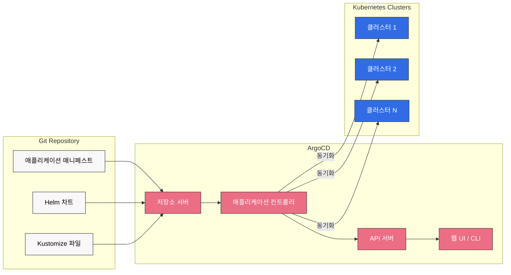
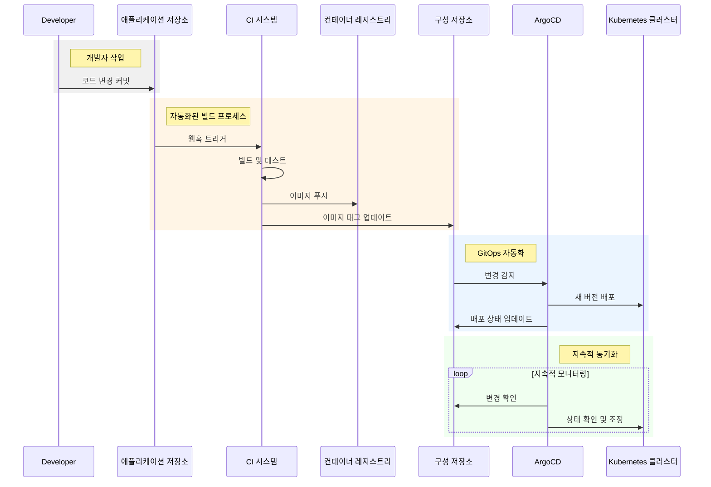

# ArgoCD

## 목차
- [소개](#소개)
- [아키텍처](#아키텍처)
- [설치 및 구성](#설치-및-구성)
- [애플리케이션 배포](#애플리케이션-배포)
- [다중 클러스터 배포](#다중-클러스터-배포)
- [GitOps 워크플로우](#gitops-워크플로우)
- [보안 고려사항](#보안-고려사항)
- [모니터링 및 알림](#모니터링-및-알림)
- [모범 사례](#모범-사례)
- [문제 해결](#문제-해결)
- [Amazon EKS와의 통합](#amazon-eks와의-통합)

## 소개

ArgoCD는 Kubernetes를 위한 선언적 GitOps 지속적 배포 도구입니다. GitOps 방법론을 구현하여 애플리케이션 배포와 라이프사이클 관리를 자동화합니다. Git 저장소를 "진실의 원천(source of truth)"으로 사용하여 애플리케이션 구성을 정의하고, 이를 Kubernetes 클러스터에 자동으로 동기화합니다.

### GitOps란?

GitOps는 인프라와 애플리케이션 구성을 Git 저장소에 저장하고, 자동화된 프로세스를 통해 이를 환경에 적용하는 운영 모델입니다. 주요 원칙은 다음과 같습니다:

1. **선언적 구성**: 시스템의 원하는 상태를 코드로 정의
2. **버전 제어**: 모든 변경 사항을 Git에서 추적
3. **자동화된 동기화**: 저장소와 실행 환경 간의 차이를 자동으로 조정
4. **자체 치유**: 시스템이 원하는 상태로 자동 복구

### ArgoCD의 주요 이점

- **애플리케이션 정의, 구성, 환경의 버전 제어**
- **애플리케이션 배포 자동화**
- **여러 클러스터에 걸친 애플리케이션 배포**
- **배포 전략 구현(블루/그린, 카나리 등)**
- **클러스터 상태에 대한 가시성 제공**
- **자체 치유 시스템 구현**
- **감사 추적 및 규정 준수 지원**

## 아키텍처

ArgoCD는 Kubernetes 컨트롤러로 작동하며, Git 저장소에 정의된 애플리케이션 구성을 지속적으로 모니터링합니다. 저장소와 클러스터 간의 차이를 감지하면 자동으로 동기화하여 클러스터 상태를 원하는 상태로 유지합니다.



### 주요 구성 요소

1. **API 서버**: ArgoCD API를 제공하고 사용자 인증을 처리합니다.
2. **저장소 서버**: Git 저장소의 애플리케이션 매니페스트를 캐시하고 관리합니다.
3. **애플리케이션 컨트롤러**: 애플리케이션 상태를 모니터링하고 현재 상태와 원하는 상태를 동기화합니다.
4. **웹 UI / CLI**: 사용자 인터페이스를 제공합니다.

## 설치 및 구성

### 사전 요구 사항

- Kubernetes 클러스터 (v1.17 이상)
- kubectl 설정
- 관리자 권한

### 설치 방법

#### 1. 네임스페이스 생성

```bash
kubectl create namespace argocd
```

#### 2. ArgoCD 설치

```bash
kubectl apply -n argocd -f https://raw.githubusercontent.com/argoproj/argo-cd/stable/manifests/install.yaml
```

#### 3. ArgoCD CLI 설치

macOS:
```bash
brew install argocd
```

Linux:
```bash
curl -sSL -o argocd-linux-amd64 https://github.com/argoproj/argo-cd/releases/latest/download/argocd-linux-amd64
sudo install -m 555 argocd-linux-amd64 /usr/local/bin/argocd
rm argocd-linux-amd64
```

#### 4. API 서버 접근

포트 포워딩:
```bash
kubectl port-forward svc/argocd-server -n argocd 8080:443
```

또는 LoadBalancer 서비스로 노출:
```bash
kubectl patch svc argocd-server -n argocd -p '{"spec": {"type": "LoadBalancer"}}'
```

#### 5. 초기 비밀번호 가져오기

```bash
kubectl -n argocd get secret argocd-initial-admin-secret -o jsonpath="{.data.password}" | base64 -d
```

#### 6. 로그인

```bash
argocd login localhost:8080
```

### 기본 구성

#### RBAC 설정

ArgoCD는 RBAC(Role-Based Access Control)를 지원합니다. 다음은 기본 RBAC 구성 예시입니다:

```yaml
apiVersion: v1
kind: ConfigMap
metadata:
  name: argocd-rbac-cm
  namespace: argocd
data:
  policy.csv: |
    p, role:org-admin, applications, *, */*, allow
    p, role:org-admin, clusters, get, *, allow
    p, role:org-admin, repositories, get, *, allow
    p, role:org-admin, repositories, create, *, allow
    p, role:org-admin, repositories, update, *, allow
    p, role:org-admin, repositories, delete, *, allow
    
    p, role:app-admin, applications, *, */*, allow
    p, role:app-admin, clusters, get, *, allow
    p, role:app-admin, repositories, get, *, allow
    
    p, role:readonly, applications, get, */*, allow
    p, role:readonly, clusters, get, *, allow
    p, role:readonly, repositories, get, *, allow
    
    g, admin, role:org-admin
```

#### SSO 통합

ArgoCD는 다양한 SSO 제공자와 통합할 수 있습니다. 다음은 OIDC 구성 예시입니다:

```yaml
apiVersion: v1
kind: ConfigMap
metadata:
  name: argocd-cm
  namespace: argocd
data:
  url: https://argocd.example.com
  
  oidc.config: |
    name: Okta
    issuer: https://dev-123456.okta.com
    clientID: 0oabcdefghijklmno0p1
    clientSecret: $oidc.okta.clientSecret
    requestedScopes: ["openid", "profile", "email", "groups"]
```

## 애플리케이션 배포

### 애플리케이션 정의

ArgoCD 애플리케이션은 다음 정보를 포함하는 Kubernetes 리소스입니다:

- 소스 저장소 URL
- 대상 클러스터 및 네임스페이스
- 동기화 정책
- 배포할 매니페스트 경로

#### 예시: 기본 애플리케이션

```yaml
apiVersion: argoproj.io/v1alpha1
kind: Application
metadata:
  name: guestbook
  namespace: argocd
spec:
  project: default
  source:
    repoURL: https://github.com/argoproj/argocd-example-apps.git
    targetRevision: HEAD
    path: guestbook
  destination:
    server: https://kubernetes.default.svc
    namespace: guestbook
  syncPolicy:
    automated:
      prune: true
      selfHeal: true
```

### 동기화 정책

ArgoCD는 다양한 동기화 정책을 지원합니다:

- **수동 동기화**: 사용자가 명시적으로 동기화를 트리거해야 함
- **자동 동기화**: Git 저장소 변경 시 자동으로 동기화
- **자체 치유**: 클러스터 상태가 원하는 상태와 다를 때 자동으로 복구
- **프루닝**: 더 이상 Git에 없는 리소스 자동 삭제

### 다양한 매니페스트 형식 지원

ArgoCD는 다양한 Kubernetes 매니페스트 형식을 지원합니다:

1. **Kustomize**: 환경별 구성을 위한 오버레이 지원
2. **Helm**: 차트 기반 배포 및 값 파일 지원
3. **Jsonnet**: 프로그래밍 방식의 구성 생성
4. **일반 YAML/JSON**: 기본 Kubernetes 매니페스트

#### Helm 차트 예시

```yaml
apiVersion: argoproj.io/v1alpha1
kind: Application
metadata:
  name: nginx-ingress
  namespace: argocd
spec:
  project: default
  source:
    repoURL: https://charts.helm.sh/stable
    chart: nginx-ingress
    targetRevision: 1.41.3
    helm:
      values: |
        controller:
          service:
            type: LoadBalancer
  destination:
    server: https://kubernetes.default.svc
    namespace: ingress-nginx
```

#### Kustomize 예시

```yaml
apiVersion: argoproj.io/v1alpha1
kind: Application
metadata:
  name: myapp-prod
  namespace: argocd
spec:
  project: default
  source:
    repoURL: https://github.com/myorg/myapp.git
    targetRevision: HEAD
    path: overlays/prod
    kustomize:
      namePrefix: prod-
  destination:
    server: https://kubernetes.default.svc
    namespace: myapp-prod
```

## 다중 클러스터 배포

ArgoCD의 주요 강점 중 하나는 여러 Kubernetes 클러스터에 애플리케이션을 배포하는 기능입니다. 이는 멀티 클러스터 환경에서 일관된 애플리케이션 배포를 가능하게 합니다.

### 클러스터 등록

```bash
argocd cluster add <context-name>
```

### 클러스터 간 배포 전략

#### 1. 애플리케이션 세트 (ApplicationSet)

ApplicationSet은 여러 클러스터에 동일한 애플리케이션을 배포하는 데 사용됩니다:

```yaml
apiVersion: argoproj.io/v1alpha1
kind: ApplicationSet
metadata:
  name: guestbook
  namespace: argocd
spec:
  generators:
  - clusters: {}
  template:
    metadata:
      name: '{{name}}-guestbook'
    spec:
      project: default
      source:
        repoURL: https://github.com/argoproj/argocd-example-apps.git
        targetRevision: HEAD
        path: guestbook
      destination:
        server: '{{server}}'
        namespace: guestbook
```

#### 2. 환경별 구성

다양한 환경(개발, 스테이징, 프로덕션)에 대한 구성:

```yaml
apiVersion: argoproj.io/v1alpha1
kind: ApplicationSet
metadata:
  name: guestbook
  namespace: argocd
spec:
  generators:
  - list:
      elements:
      - cluster: dev
        url: https://kubernetes.dev.svc
        values:
          replicas: 1
      - cluster: staging
        url: https://kubernetes.staging.svc
        values:
          replicas: 2
      - cluster: prod
        url: https://kubernetes.prod.svc
        values:
          replicas: 5
  template:
    metadata:
      name: '{{cluster}}-guestbook'
    spec:
      project: default
      source:
        repoURL: https://github.com/argoproj/argocd-example-apps.git
        targetRevision: HEAD
        path: guestbook
        helm:
          parameters:
          - name: replicaCount
            value: '{{values.replicas}}'
      destination:
        server: '{{url}}'
        namespace: guestbook
```

### 클러스터 간 동기화 순서

프로덕션 환경으로 배포하기 전에 개발 및 스테이징 환경에서 애플리케이션을 테스트하는 것이 일반적입니다. ArgoCD는 이를 위한 동기화 웨이브(Sync Waves)를 지원합니다:

```yaml
apiVersion: argoproj.io/v1alpha1
kind: Application
metadata:
  name: guestbook
  namespace: argocd
  annotations:
    argocd.argoproj.io/sync-wave: "5"  # 높은 숫자는 나중에 동기화
spec:
  # ... 애플리케이션 정의
```

## GitOps 워크플로우

ArgoCD를 사용한 GitOps 워크플로우는 다음과 같습니다:

1. 개발자가 애플리케이션 코드를 개발 저장소에 커밋
2. CI 파이프라인이 코드를 빌드, 테스트하고 이미지 생성
3. 이미지 태그가 구성 저장소에 업데이트
4. ArgoCD가 구성 변경을 감지하고 클러스터에 적용



### 구성 저장소 구조

효과적인 GitOps 워크플로우를 위한 구성 저장소 구조 예시:

```
├── base/
│   ├── deployment.yaml
│   ├── service.yaml
│   └── kustomization.yaml
├── overlays/
│   ├── dev/
│   │   ├── kustomization.yaml
│   │   └── config.yaml
│   ├── staging/
│   │   ├── kustomization.yaml
│   │   └── config.yaml
│   └── prod/
│       ├── kustomization.yaml
│       └── config.yaml
└── applications/
    ├── dev.yaml
    ├── staging.yaml
    └── prod.yaml
```

## 보안 고려사항

### 민감한 정보 관리

ArgoCD에서 민감한 정보를 관리하는 방법:

1. **Bitnami Sealed Secrets**: 암호화된 시크릿을 Git에 저장
2. **HashiCorp Vault**: 외부 시크릿 관리 시스템과 통합
3. **AWS Secrets Manager**: AWS 서비스와 통합
4. **External Secrets Operator**: 외부 시크릿 소스에서 Kubernetes 시크릿 생성

#### Bitnami Sealed Secrets 예시

```yaml
apiVersion: bitnami.com/v1alpha1
kind: SealedSecret
metadata:
  name: mysecret
  namespace: default
spec:
  encryptedData:
    password: AgBy8hCM8FayQFfixS...
```

### RBAC 및 액세스 제어

ArgoCD는 세분화된 RBAC를 지원합니다:

```yaml
apiVersion: v1
kind: ConfigMap
metadata:
  name: argocd-rbac-cm
  namespace: argocd
data:
  policy.csv: |
    # 프로젝트 관리자는 자신의 프로젝트 애플리케이션만 관리할 수 있음
    p, role:project-admin, applications, *, project-name/*, allow
    p, role:project-admin, projects, get, project-name, allow
    
    # 개발자는 애플리케이션을 볼 수만 있음
    p, role:developer, applications, get, */*, allow
    
    # 사용자 그룹 할당
    g, alice@example.com, role:project-admin
    g, bob@example.com, role:developer
```

## 모니터링 및 알림

### Prometheus 통합

ArgoCD는 Prometheus 메트릭을 노출하여 모니터링을 지원합니다:

```yaml
apiVersion: monitoring.coreos.com/v1
kind: ServiceMonitor
metadata:
  name: argocd-metrics
  namespace: monitoring
spec:
  selector:
    matchLabels:
      app.kubernetes.io/name: argocd-metrics
  endpoints:
  - port: metrics
```

### 알림 구성

ArgoCD는 다양한 알림 채널을 지원합니다:

```yaml
apiVersion: v1
kind: ConfigMap
metadata:
  name: argocd-notifications-cm
  namespace: argocd
data:
  service.slack: |
    token: $slack-token
  template.app-sync-status: |
    message: |
      Application {{.app.metadata.name}} sync status is {{.app.status.sync.status}}
      {{if eq .app.status.sync.status "Synced"}}✅{{else}}❌{{end}}
  trigger.on-sync-status-change: |
    - when: app.status.sync.status != 'Synced'
      send: [app-sync-status]
    - when: app.status.sync.status == 'Synced'
      send: [app-sync-status]
```

## 모범 사례

### 애플리케이션 구성

1. **프로젝트 구조화**: 관련 애플리케이션을 ArgoCD 프로젝트로 그룹화
2. **동기화 옵션 설정**: 자동 동기화, 자체 치유, 프루닝 활성화
3. **상태 검증**: 헬스 체크 및 동기화 후 검증 구성
4. **리소스 무시**: 특정 리소스를 동기화에서 제외

### 성능 최적화

1. **애플리케이션 분할**: 대규모 애플리케이션을 작은 단위로 분할
2. **리소스 요청/제한 설정**: ArgoCD 컴포넌트에 적절한 리소스 할당
3. **캐시 최적화**: 저장소 서버 캐시 설정 조정
4. **동기화 빈도 제한**: 과도한 동기화 방지

### 고가용성 구성

프로덕션 환경을 위한 고가용성 ArgoCD 설정:

```yaml
apiVersion: v1
kind: ConfigMap
metadata:
  name: argocd-cmd-params-cm
  namespace: argocd
data:
  controller.replicas: "2"
  server.replicas: "2"
  repo.server.replicas: "2"
```

## 문제 해결

### 일반적인 문제 및 해결 방법

1. **동기화 실패**
   - 원인: 매니페스트 오류, 권한 문제, 리소스 충돌
   - 해결: 애플리케이션 이벤트 및 로그 확인, 차이점 분석

2. **저장소 연결 문제**
   - 원인: 인증 오류, 네트워크 문제
   - 해결: 저장소 자격 증명 확인, 네트워크 연결 테스트

3. **성능 문제**
   - 원인: 리소스 부족, 대규모 애플리케이션
   - 해결: 리소스 할당 증가, 애플리케이션 분할

### 디버깅 도구

```bash
# 애플리케이션 상태 확인
argocd app get <app-name>

# 동기화 차이점 확인
argocd app diff <app-name>

# 애플리케이션 로그 확인
kubectl logs -n argocd -l app.kubernetes.io/name=argocd-application-controller

# 저장소 서버 로그 확인
kubectl logs -n argocd -l app.kubernetes.io/name=argocd-repo-server
```

## Amazon EKS와의 통합

ArgoCD는 Amazon EKS와 원활하게 통합되어 GitOps 워크플로우를 구현할 수 있습니다.

### EKS 클러스터 등록

```bash
# EKS 클러스터 컨텍스트 가져오기
aws eks update-kubeconfig --name <cluster-name> --region <region>

# ArgoCD에 클러스터 추가
argocd cluster add <context-name>
```

### IAM 역할 구성

EKS 클러스터에 ArgoCD를 배포할 때 적절한 IAM 권한이 필요합니다:

```yaml
apiVersion: v1
kind: ServiceAccount
metadata:
  name: argocd-application-controller
  namespace: argocd
  annotations:
    eks.amazonaws.com/role-arn: arn:aws:iam::<account-id>:role/ArgoCD
```

### 다중 EKS 클러스터 관리

여러 EKS 클러스터를 관리하는 ApplicationSet 예시:

```yaml
apiVersion: argoproj.io/v1alpha1
kind: ApplicationSet
metadata:
  name: multi-cluster-apps
  namespace: argocd
spec:
  generators:
  - clusters:
      selector:
        matchLabels:
          environment: production
  template:
    metadata:
      name: '{{name}}-app'
    spec:
      project: default
      source:
        repoURL: https://github.com/myorg/myapp.git
        targetRevision: HEAD
        path: overlays/prod
      destination:
        server: '{{server}}'
        namespace: myapp
```

### AWS 서비스와의 통합

ArgoCD를 사용하여 AWS 서비스를 관리하는 방법:

1. **AWS Controllers for Kubernetes (ACK)**: AWS 리소스를 Kubernetes 객체로 관리
2. **Crossplane**: 클라우드 리소스를 Kubernetes API를 통해 프로비저닝
3. **Terraform 통합**: Terraform 구성을 ArgoCD를 통해 적용

#### ACK 컨트롤러 예시

```yaml
apiVersion: s3.services.k8s.aws/v1alpha1
kind: Bucket
metadata:
  name: my-bucket
spec:
  name: my-unique-bucket-name
```

## 결론

ArgoCD는 Kubernetes 환경에서 GitOps 워크플로우를 구현하기 위한 강력한 도구입니다. Git 저장소를 "진실의 원천"으로 사용하여 애플리케이션 배포를 자동화하고, 여러 클러스터에 걸쳐 일관된 구성을 유지할 수 있습니다. 이 문서에서는 ArgoCD의 기본 개념, 설치 방법, 애플리케이션 배포, 다중 클러스터 관리, 보안 고려사항, 모니터링 및 문제 해결에 대해 살펴보았습니다.

GitOps 방법론을 채택하면 배포 프로세스의 투명성, 감사 가능성, 안정성이 향상되며, 개발자와 운영 팀 간의 협업이 개선됩니다. ArgoCD는 이러한 GitOps 원칙을 구현하는 데 필요한 도구와 기능을 제공합니다.

## 참고 자료

- [ArgoCD 공식 문서](https://argo-cd.readthedocs.io/)
- [ArgoCD GitHub 저장소](https://github.com/argoproj/argo-cd)
- [GitOps 원칙](https://www.gitops.tech/)
- [ArgoCD 사용자 가이드](https://argo-cd.readthedocs.io/en/stable/user-guide/)
- [ArgoCD 운영자 매뉴얼](https://argo-cd.readthedocs.io/en/stable/operator-manual/)
