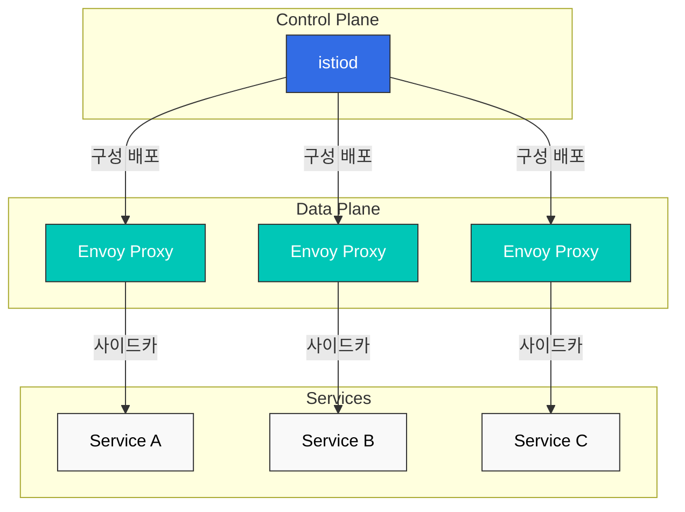

# Istio

> **지원 버전**: Istio 1.18, 1.19  
> **마지막 업데이트**: 2025년 7월 25일

## 목차
- [소개](#소개)
- [아키텍처](#아키텍처)
- [설치 및 구성](#설치-및-구성)
- [트래픽 관리](#트래픽-관리)
- [보안](#보안)
- [관찰성](#관찰성)
- [Locality 라우팅](#locality-라우팅)
- [로컬 속도 제한](#로컬-속도-제한)
- [글로벌 속도 제한](#글로벌-속도-제한)
- [Amazon EKS와의 통합](#amazon-eks와의-통합)
- [모범 사례](#모범-사례)
- [문제 해결](#문제-해결)
- [결론](#결론)

## 소개

Istio는 마이크로서비스 애플리케이션을 위한 오픈소스 서비스 메시 플랫폼입니다. 서비스 메시는 애플리케이션의 다양한 부분이 서로 데이터를 공유하는 방식을 제어하는 전용 인프라 계층입니다. Istio는 기존 분산 애플리케이션에 투명하게 계층화되어 트래픽 관리, 보안, 관찰성을 제공합니다.

### 서비스 메시란?

서비스 메시는 서비스 간 통신을 처리하는 인프라 계층으로, 애플리케이션 코드를 변경하지 않고도 서비스 간 통신을 제어하고 관찰할 수 있게 해줍니다. 주요 기능은 다음과 같습니다:

1. **트래픽 관리**: 서비스 간 트래픽 흐름 제어
2. **보안**: 서비스 간 통신 암호화 및 인증
3. **관찰성**: 서비스 간 통신에 대한 가시성 제공

### 최신 서비스 메시 트렌드 (2023)

서비스 메시 영역에서 최근 주목할 만한 트렌드는 다음과 같습니다:

1. **Ambient Mesh**:
   - 사이드카 없는 서비스 메시 아키텍처
   - 리소스 사용량 감소 및 성능 향상
   - Istio Ambient Mesh는 기존 사이드카 모델의 대안으로 등장

2. **eBPF 기반 서비스 메시**:
   - 커널 수준의 네트워킹 제어로 오버헤드 감소
   - Cilium Service Mesh와 같은 eBPF 기반 솔루션의 부상
   - 더 나은 성능과 더 낮은 리소스 사용량

3. **멀티 클러스터 및 멀티 메시**:
   - 여러 클러스터에 걸친 서비스 메시 페더레이션
   - 클러스터 간 서비스 디스커버리 및 통신
   - Istio의 멀티 클러스터 기능 강화

4. **WebAssembly(WASM) 확장**:
   - 사용자 정의 필터 및 플러그인을 위한 WASM 지원
   - 프록시 기능의 동적 확장
   - 언어에 구애받지 않는 확장성

5. **서비스 메시와 API 게이트웨이 통합**:
   - 서비스 메시와 API 게이트웨이 기능의 통합
   - 엣지-투-서비스 연결성
   - Istio Gateway API 채택 증가

### Istio의 주요 이점

- **플랫폼 독립성**: 다양한 환경(Kubernetes, VM 등)에서 작동
- **투명한 통합**: 애플리케이션 코드 변경 없이 적용 가능
- **자동 mTLS**: 서비스 간 통신 자동 암호화
- **고급 트래픽 관리**: 라우팅, 로드 밸런싱, 장애 주입 등
- **상세한 메트릭**: 서비스 간 통신에 대한 자세한 메트릭 제공
- **정책 시행**: 액세스 제어 및 속도 제한 적용

## 아키텍처

Istio는 데이터 플레인과 컨트롤 플레인으로 구성됩니다.



### 컨트롤 플레인 (istiod)

istiod는 Istio의 컨트롤 플레인 구성 요소로, 다음 기능을 제공합니다:

1. **서비스 검색**: 메시의 서비스 레지스트리 유지
2. **구성 관리**: Istio 구성 저장 및 배포
3. **인증서 관리**: 서비스 간 mTLS를 위한 인증서 생성 및 배포

### 데이터 플레인 (Envoy Proxy)

Envoy는 고성능 C++ 프록시로, 각 서비스의 사이드카로 배포되어 다음 기능을 제공합니다:

1. **트래픽 라우팅**: 서비스 간 트래픽 제어
2. **로드 밸런싱**: 서비스 인스턴스 간 트래픽 분산
3. **보안**: mTLS 암호화 및 인증
4. **관찰성**: 메트릭, 로그, 트레이스 수집

## 설치 및 구성

### 사전 요구 사항

- Kubernetes 클러스터 (v1.19 이상)
- kubectl 설정
- 관리자 권한

### 설치 방법

#### 1. Istioctl 설치

```bash
curl -L https://istio.io/downloadIstio | sh -
cd istio-*
export PATH=$PWD/bin:$PATH
```

#### 2. Istio 설치

기본 프로필로 설치:
```bash
istioctl install --set profile=default -y
```

사용자 정의 설치:
```bash
cat <<EOF | istioctl install -y -f -
apiVersion: install.istio.io/v1alpha1
kind: IstioOperator
metadata:
  namespace: istio-system
spec:
  profile: default
  components:
    pilot:
      k8s:
        resources:
          requests:
            cpu: 500m
            memory: 2048Mi
  values:
    global:
      proxy:
        resources:
          requests:
            cpu: 100m
            memory: 128Mi
          limits:
            cpu: 500m
            memory: 1024Mi
EOF
```

#### 3. 네임스페이스에 사이드카 주입 활성화

```bash
kubectl label namespace default istio-injection=enabled
```

### 기본 구성

#### 게이트웨이 설정

외부 트래픽을 메시로 라우팅하기 위한 게이트웨이:

```yaml
apiVersion: networking.istio.io/v1alpha3
kind: Gateway
metadata:
  name: bookinfo-gateway
spec:
  selector:
    istio: ingressgateway
  servers:
  - port:
      number: 80
      name: http
      protocol: HTTP
    hosts:
    - "bookinfo.example.com"
```

#### 가상 서비스 설정

트래픽 라우팅 규칙을 정의하는 가상 서비스:

```yaml
apiVersion: networking.istio.io/v1alpha3
kind: VirtualService
metadata:
  name: bookinfo
spec:
  hosts:
  - "bookinfo.example.com"
  gateways:
  - bookinfo-gateway
  http:
  - match:
    - uri:
        prefix: /productpage
    route:
    - destination:
        host: productpage
        port:
          number: 9080
```

## 트래픽 관리

Istio는 다양한 트래픽 관리 기능을 제공합니다.

### 라우팅 규칙

#### 가상 서비스 (VirtualService)

가상 서비스는 요청을 어떻게 라우팅할지 정의합니다:

```yaml
apiVersion: networking.istio.io/v1alpha3
kind: VirtualService
metadata:
  name: reviews
spec:
  hosts:
  - reviews
  http:
  - match:
    - headers:
        end-user:
          exact: jason
    route:
    - destination:
        host: reviews
        subset: v2
  - route:
    - destination:
        host: reviews
        subset: v1
```

#### 대상 규칙 (DestinationRule)

대상 규칙은 트래픽이 라우팅된 후 어떻게 처리할지 정의합니다:

```yaml
apiVersion: networking.istio.io/v1alpha3
kind: DestinationRule
metadata:
  name: reviews
spec:
  host: reviews
  trafficPolicy:
    loadBalancer:
      simple: RANDOM
  subsets:
  - name: v1
    labels:
      version: v1
  - name: v2
    labels:
      version: v2
    trafficPolicy:
      loadBalancer:
        simple: ROUND_ROBIN
```

### 트래픽 분할 및 카나리 배포

점진적으로 트래픽을 새 버전으로 이동하는 카나리 배포:

```yaml
apiVersion: networking.istio.io/v1alpha3
kind: VirtualService
metadata:
  name: reviews
spec:
  hosts:
  - reviews
  http:
  - route:
    - destination:
        host: reviews
        subset: v1
      weight: 90
    - destination:
        host: reviews
        subset: v2
      weight: 10
```

### 장애 주입

서비스 복원력을 테스트하기 위한 장애 주입:

```yaml
apiVersion: networking.istio.io/v1alpha3
kind: VirtualService
metadata:
  name: ratings
spec:
  hosts:
  - ratings
  http:
  - fault:
      delay:
        percentage:
          value: 10
        fixedDelay: 5s
    route:
    - destination:
        host: ratings
        subset: v1
```

### 서킷 브레이킹

서비스 과부하를 방지하기 위한 서킷 브레이커:

```yaml
apiVersion: networking.istio.io/v1alpha3
kind: DestinationRule
metadata:
  name: reviews
spec:
  host: reviews
  trafficPolicy:
    connectionPool:
      tcp:
        maxConnections: 100
      http:
        http1MaxPendingRequests: 10
        maxRequestsPerConnection: 10
    outlierDetection:
      consecutive5xxErrors: 5
      interval: 30s
      baseEjectionTime: 30s
```

## 보안

Istio는 서비스 메시에 대한 포괄적인 보안 기능을 제공합니다.

### 상호 TLS (mTLS)

서비스 간 통신을 암호화하는 mTLS:

```yaml
apiVersion: security.istio.io/v1beta1
kind: PeerAuthentication
metadata:
  name: default
  namespace: istio-system
spec:
  mtls:
    mode: STRICT
```

### 인증 정책

최종 사용자 인증을 위한 인증 정책:

```yaml
apiVersion: security.istio.io/v1beta1
kind: RequestAuthentication
metadata:
  name: jwt-example
  namespace: foo
spec:
  selector:
    matchLabels:
      app: httpbin
  jwtRules:
  - issuer: "testing@secure.istio.io"
    jwksUri: "https://raw.githubusercontent.com/istio/istio/release-1.9/security/tools/jwt/samples/jwks.json"
```

### 권한 부여 정책

서비스 액세스 제어를 위한 권한 부여 정책:

```yaml
apiVersion: security.istio.io/v1beta1
kind: AuthorizationPolicy
metadata:
  name: httpbin
  namespace: foo
spec:
  selector:
    matchLabels:
      app: httpbin
  action: ALLOW
  rules:
  - from:
    - source:
        principals: ["cluster.local/ns/default/sa/sleep"]
    to:
    - operation:
        methods: ["GET"]
        paths: ["/info*"]
```

## 관찰성

Istio는 서비스 메시에 대한 포괄적인 관찰성을 제공합니다.

### 메트릭

Istio는 Prometheus와 통합되어 다양한 메트릭을 수집합니다:

- 요청 볼륨
- 요청 지연 시간
- 오류율
- 서비스 의존성

### 분산 추적

Istio는 Jaeger, Zipkin 등과 통합되어 분산 추적을 지원합니다:

```yaml
apiVersion: install.istio.io/v1alpha1
kind: IstioOperator
spec:
  values:
    global:
      tracer:
        zipkin:
          address: zipkin.istio-system:9411
```

### 액세스 로그

Envoy 프록시의 액세스 로그 구성:

```yaml
apiVersion: install.istio.io/v1alpha1
kind: IstioOperator
spec:
  meshConfig:
    accessLogFile: "/dev/stdout"
    accessLogFormat: |
      [%START_TIME%] "%REQ(:METHOD)% %REQ(X-ENVOY-ORIGINAL-PATH?:PATH)% %PROTOCOL%" %RESPONSE_CODE% %RESPONSE_FLAGS% %RESPONSE_CODE_DETAILS% %CONNECTION_TERMINATION_DETAILS% "%UPSTREAM_TRANSPORT_FAILURE_REASON%" %BYTES_RECEIVED% %BYTES_SENT% %DURATION% %RESP(X-ENVOY-UPSTREAM-SERVICE-TIME)% "%REQ(X-FORWARDED-FOR)%" "%REQ(USER-AGENT)%" "%REQ(X-REQUEST-ID)%" "%REQ(:AUTHORITY)%" "%UPSTREAM_HOST%" %UPSTREAM_CLUSTER% %UPSTREAM_LOCAL_ADDRESS% %DOWNSTREAM_LOCAL_ADDRESS% %DOWNSTREAM_REMOTE_ADDRESS% %REQUESTED_SERVER_NAME% %ROUTE_NAME%
```

### Kiali 대시보드

서비스 메시 시각화를 위한 Kiali 설치:

```bash
kubectl apply -f https://raw.githubusercontent.com/istio/istio/release-1.11/samples/addons/kiali.yaml
```

## Locality 라우팅

Istio는 지역성 기반 라우팅을 지원하여 네트워크 비용을 절감하고 지연 시간을 최소화합니다.

### 로컬리티 로드 밸런싱

지역 기반 로드 밸런싱 구성:

```yaml
apiVersion: networking.istio.io/v1alpha3
kind: DestinationRule
metadata:
  name: reviews
spec:
  host: reviews
  trafficPolicy:
    loadBalancer:
      localityLbSetting:
        enabled: true
        distribute:
        - from: us-west/zone1/*
          to:
            "us-west/zone1/*": 80
            "us-west/zone2/*": 20
        - from: us-west/zone2/*
          to:
            "us-west/zone2/*": 80
            "us-west/zone1/*": 20
```

### 장애 조치 정책

리전 간 장애 조치 구성:

```yaml
apiVersion: networking.istio.io/v1alpha3
kind: DestinationRule
metadata:
  name: reviews
spec:
  host: reviews
  trafficPolicy:
    loadBalancer:
      localityLbSetting:
        enabled: true
        failover:
        - from: us-east
          to: us-west
        - from: us-west
          to: eu-west
```

### 우선순위 설정

로컬리티 우선순위 설정:

```yaml
apiVersion: networking.istio.io/v1alpha3
kind: DestinationRule
metadata:
  name: reviews
spec:
  host: reviews
  trafficPolicy:
    loadBalancer:
      localityLbSetting:
        enabled: true
        failoverPriority:
        - "region"
        - "zone"
        - "sub-zone"
```
## 로컬 속도 제한

Istio는 Envoy 프록시를 통해 로컬 속도 제한을 지원합니다. 로컬 속도 제한은 각 프록시 인스턴스에서 독립적으로 적용되며, 서비스 인스턴스별로 요청 속도를 제한할 수 있습니다.

### EnvoyFilter를 사용한 로컬 속도 제한

로컬 속도 제한을 구성하려면 EnvoyFilter를 사용합니다:

```yaml
apiVersion: networking.istio.io/v1alpha3
kind: EnvoyFilter
metadata:
  name: filter-local-ratelimit-svc
  namespace: istio-system
spec:
  workloadSelector:
    labels:
      app: productpage
  configPatches:
    - applyTo: HTTP_FILTER
      match:
        context: SIDECAR_INBOUND
        listener:
          filterChain:
            filter:
              name: "envoy.filters.network.http_connection_manager"
      patch:
        operation: INSERT_BEFORE
        value:
          name: envoy.filters.http.local_ratelimit
          typed_config:
            "@type": type.googleapis.com/udpa.type.v1.TypedStruct
            type_url: type.googleapis.com/envoy.extensions.filters.http.local_ratelimit.v3.LocalRateLimit
            value:
              stat_prefix: http_local_rate_limiter
              token_bucket:
                max_tokens: 100
                tokens_per_fill: 100
                fill_interval: 1s
              filter_enabled:
                runtime_key: local_rate_limit_enabled
                default_value:
                  numerator: 100
                  denominator: HUNDRED
              filter_enforced:
                runtime_key: local_rate_limit_enforced
                default_value:
                  numerator: 100
                  denominator: HUNDRED
              response_headers_to_add:
                - append: false
                  header:
                    key: x-local-rate-limit
                    value: 'true'
```

### 경로별 속도 제한

특정 경로에 대한 속도 제한을 구성할 수 있습니다:

```yaml
apiVersion: networking.istio.io/v1alpha3
kind: EnvoyFilter
metadata:
  name: filter-local-ratelimit-svc
  namespace: istio-system
spec:
  workloadSelector:
    labels:
      app: productpage
  configPatches:
    - applyTo: HTTP_ROUTE
      match:
        context: SIDECAR_INBOUND
        routeConfiguration:
          vhost:
            route:
              name: "default"
      patch:
        operation: MERGE
        value:
          typed_per_filter_config:
            envoy.filters.http.local_ratelimit:
              "@type": type.googleapis.com/udpa.type.v1.TypedStruct
              type_url: type.googleapis.com/envoy.extensions.filters.http.local_ratelimit.v3.LocalRateLimit
              value:
                stat_prefix: http_local_rate_limiter
                token_bucket:
                  max_tokens: 10
                  tokens_per_fill: 10
                  fill_interval: 60s
                filter_enabled:
                  runtime_key: local_rate_limit_enabled
                  default_value:
                    numerator: 100
                    denominator: HUNDRED
                filter_enforced:
                  runtime_key: local_rate_limit_enforced
                  default_value:
                    numerator: 100
                    denominator: HUNDRED
```

### 헤더 기반 속도 제한

요청 헤더를 기반으로 속도 제한을 적용할 수 있습니다:

```yaml
apiVersion: networking.istio.io/v1alpha3
kind: EnvoyFilter
metadata:
  name: filter-local-ratelimit-svc
  namespace: istio-system
spec:
  workloadSelector:
    labels:
      app: productpage
  configPatches:
    - applyTo: HTTP_FILTER
      match:
        context: SIDECAR_INBOUND
        listener:
          filterChain:
            filter:
              name: "envoy.filters.network.http_connection_manager"
      patch:
        operation: INSERT_BEFORE
        value:
          name: envoy.filters.http.local_ratelimit
          typed_config:
            "@type": type.googleapis.com/udpa.type.v1.TypedStruct
            type_url: type.googleapis.com/envoy.extensions.filters.http.local_ratelimit.v3.LocalRateLimit
            value:
              stat_prefix: http_local_rate_limiter
              descriptor_key: "header_match"
              descriptors:
                - entries:
                    - key: "header_match"
                      value: "user-type-a"
                  token_bucket:
                    max_tokens: 10
                    tokens_per_fill: 10
                    fill_interval: 60s
              token_bucket:
                max_tokens: 100
                tokens_per_fill: 100
                fill_interval: 1s
              filter_enabled:
                runtime_key: local_rate_limit_enabled
                default_value:
                  numerator: 100
                  denominator: HUNDRED
              filter_enforced:
                runtime_key: local_rate_limit_enforced
                default_value:
                  numerator: 100
                  denominator: HUNDRED
```

### 로컬 속도 제한 모니터링

로컬 속도 제한 메트릭은 Prometheus에서 수집할 수 있습니다:

- `envoy_cluster_ratelimit_over_limit`: 속도 제한 초과 횟수
- `envoy_cluster_ratelimit_ok`: 속도 제한 내 요청 횟수
- `envoy_http_local_rate_limit`: 로컬 속도 제한 관련 메트릭
## 글로벌 속도 제한

글로벌 속도 제한은 중앙 집중식 속도 제한 서비스를 사용하여 전체 메시에서 일관된 속도 제한을 적용합니다. 이는 여러 인스턴스에 걸쳐 분산된 서비스에 대한 속도 제한을 구현하는 데 유용합니다.

### 속도 제한 서비스 배포

먼저 Envoy의 속도 제한 서비스를 배포합니다:

```yaml
apiVersion: v1
kind: Service
metadata:
  name: ratelimit
  namespace: istio-system
  labels:
    app: ratelimit
spec:
  ports:
  - port: 8081
    name: http-port
  - port: 8080
    name: grpc-port
  - port: 6070
    name: debug-port
  selector:
    app: ratelimit
---
apiVersion: apps/v1
kind: Deployment
metadata:
  name: ratelimit
  namespace: istio-system
spec:
  replicas: 1
  selector:
    matchLabels:
      app: ratelimit
  template:
    metadata:
      labels:
        app: ratelimit
    spec:
      containers:
      - name: ratelimit
        image: envoyproxy/ratelimit:6f5de117
        imagePullPolicy: Always
        command: ["/bin/ratelimit"]
        env:
        - name: RUNTIME_ROOT
          value: /data
        - name: RUNTIME_SUBDIRECTORY
          value: ratelimit
        - name: RUNTIME_WATCH_ROOT
          value: "false"
        - name: RUNTIME_IGNOREDOTFILES
          value: "true"
        - name: LOG_LEVEL
          value: debug
        - name: USE_STATSD
          value: "false"
        - name: REDIS_SOCKET_TYPE
          value: tcp
        - name: REDIS_URL
          value: redis:6379
        - name: REDIS_TYPE
          value: SINGLE
        - name: REDIS_PREFIX
          value: istio-ratelimit
        - name: REDIS_POOL_SIZE
          value: "10"
        volumeMounts:
        - name: config-volume
          mountPath: /data/ratelimit/config
      volumes:
      - name: config-volume
        configMap:
          name: ratelimit-config
```

### 속도 제한 구성

속도 제한 규칙을 구성합니다:

```yaml
apiVersion: v1
kind: ConfigMap
metadata:
  name: ratelimit-config
  namespace: istio-system
data:
  config.yaml: |
    domain: productpage-ratelimit
    descriptors:
      - key: path
        value: "/productpage"
        rate_limit:
          unit: minute
          requests_per_unit: 1
      - key: path
        value: "/api/v1/products"
        rate_limit:
          unit: minute
          requests_per_unit: 5
```

### EnvoyFilter 구성

EnvoyFilter를 사용하여 속도 제한 서비스와 통합합니다:

```yaml
apiVersion: networking.istio.io/v1alpha3
kind: EnvoyFilter
metadata:
  name: filter-ratelimit
  namespace: istio-system
spec:
  workloadSelector:
    labels:
      app: productpage
  configPatches:
    - applyTo: HTTP_FILTER
      match:
        context: SIDECAR_INBOUND
        listener:
          filterChain:
            filter:
              name: "envoy.filters.network.http_connection_manager"
              subFilter:
                name: "envoy.filters.http.router"
      patch:
        operation: INSERT_BEFORE
        value:
          name: envoy.filters.http.ratelimit
          typed_config:
            "@type": type.googleapis.com/udpa.type.v1.TypedStruct
            type_url: type.googleapis.com/envoy.extensions.filters.http.ratelimit.v3.RateLimit
            value:
              domain: productpage-ratelimit
              failure_mode_deny: true
              timeout: 10s
              rate_limit_service:
                grpc_service:
                  envoy_grpc:
                    cluster_name: outbound|8081||ratelimit.istio-system.svc.cluster.local
                  timeout: 10s
                transport_api_version: V3
    - applyTo: HTTP_ROUTE
      match:
        context: SIDECAR_INBOUND
        routeConfiguration:
          vhost:
            name: "inbound|http|9080"
            route:
              action: ANY
      patch:
        operation: MERGE
        value:
          route:
            rate_limits:
              - actions:
                - request_headers:
                    header_name: ":path"
                    descriptor_key: "path"
```

### Redis 배포

속도 제한 서비스는 Redis를 사용하여 카운터를 저장합니다:

```yaml
apiVersion: v1
kind: Service
metadata:
  name: redis
  namespace: istio-system
  labels:
    app: redis
spec:
  ports:
  - port: 6379
    name: redis
  selector:
    app: redis
---
apiVersion: apps/v1
kind: Deployment
metadata:
  name: redis
  namespace: istio-system
spec:
  replicas: 1
  selector:
    matchLabels:
      app: redis
  template:
    metadata:
      labels:
        app: redis
    spec:
      containers:
      - name: redis
        image: redis:alpine
        imagePullPolicy: Always
        ports:
        - containerPort: 6379
```

### 글로벌 속도 제한 테스트

속도 제한이 적용되는지 테스트합니다:

```bash
# 1분 내에 여러 요청 전송
for i in {1..5}; do
  curl -I http://productpage:9080/productpage
  echo "Request $i"
  sleep 5
done
```

### 글로벌 속도 제한 모니터링

글로벌 속도 제한 메트릭은 다음과 같이 수집할 수 있습니다:

- `ratelimit.service.rate_limit.total_hits`: 총 요청 수
- `ratelimit.service.rate_limit.over_limit`: 속도 제한 초과 횟수
- `ratelimit.service.rate_limit.near_limit`: 속도 제한에 근접한 횟수
## Amazon EKS와의 통합

Istio는 Amazon EKS와 원활하게 통합되어 강력한 서비스 메시 기능을 제공합니다.

### EKS에 Istio 설치

#### 사전 요구 사항

- 작동 중인 EKS 클러스터 (Kubernetes 1.19 이상)
- kubectl 및 AWS CLI 구성
- 관리자 권한

#### 설치 단계

1. Istioctl 설치:

```bash
curl -L https://istio.io/downloadIstio | sh -
cd istio-*
export PATH=$PWD/bin:$PATH
```

2. EKS 클러스터에 Istio 설치:

```bash
istioctl install --set profile=default -y
```

3. 네임스페이스에 사이드카 주입 활성화:

```bash
kubectl label namespace default istio-injection=enabled
```

### AWS 로드 밸런서 통합

Istio 인그레스 게이트웨이를 AWS 로드 밸런서와 통합:

```yaml
apiVersion: v1
kind: Service
metadata:
  name: istio-ingressgateway
  namespace: istio-system
  annotations:
    service.beta.kubernetes.io/aws-load-balancer-type: "nlb"
    service.beta.kubernetes.io/aws-load-balancer-cross-zone-load-balancing-enabled: "true"
    service.beta.kubernetes.io/aws-load-balancer-ssl-cert: "arn:aws:acm:region:account-id:certificate/certificate-id"
    service.beta.kubernetes.io/aws-load-balancer-ssl-ports: "443"
spec:
  type: LoadBalancer
  selector:
    app: istio-ingressgateway
  ports:
  - port: 80
    name: http
  - port: 443
    name: https
```

### AWS App Mesh와의 비교

| 기능 | Istio | AWS App Mesh |
|------|-------|--------------|
| 서비스 메시 구현 | 오픈 소스, 클라우드 중립적 | AWS 관리형 서비스 |
| 데이터 플레인 | Envoy | Envoy |
| 컨트롤 플레인 | istiod | AWS 관리형 |
| 지원 환경 | Kubernetes, VM, 베어메탈 | EKS, ECS, EC2, Kubernetes |
| 관찰성 | Prometheus, Grafana, Kiali, Jaeger | CloudWatch, X-Ray |
| 보안 | mTLS, RBAC, JWT | mTLS, IAM |
| 트래픽 관리 | 고급 라우팅, 카나리 배포, 장애 주입 | 기본 라우팅, 가중치 기반 라우팅 |

### IAM 역할 구성

EKS에서 Istio를 실행하기 위한 IAM 역할 구성:

```yaml
apiVersion: v1
kind: ServiceAccount
metadata:
  name: istio-ingressgateway
  namespace: istio-system
  annotations:
    eks.amazonaws.com/role-arn: arn:aws:iam::account-id:role/istio-ingressgateway
```

### AWS 서비스와의 통합

#### AWS Certificate Manager (ACM)

ACM 인증서를 Istio 게이트웨이와 통합:

```yaml
apiVersion: networking.istio.io/v1alpha3
kind: Gateway
metadata:
  name: bookinfo-gateway
spec:
  selector:
    istio: ingressgateway
  servers:
  - port:
      number: 443
      name: https
      protocol: HTTPS
    tls:
      mode: SIMPLE
      credentialName: acm-certificate
    hosts:
    - "bookinfo.example.com"
```

#### AWS X-Ray 통합

X-Ray를 사용한 분산 추적:

```yaml
apiVersion: install.istio.io/v1alpha1
kind: IstioOperator
spec:
  meshConfig:
    defaultConfig:
      tracing:
        zipkin:
          address: aws-xray-daemon.default:9411
```

#### Amazon CloudWatch 통합

Istio 메트릭을 CloudWatch로 전송:

```yaml
apiVersion: v1
kind: ConfigMap
metadata:
  name: istio-envoy-config
  namespace: istio-system
data:
  envoy.yaml: |
    stats_sinks:
      - name: envoy.stat_sinks.statsd
        config:
          address:
            socket_address:
              address: cloudwatch-agent.monitoring
              port_value: 8125
```

### EKS 클러스터 간 서비스 메시

여러 EKS 클러스터에 걸친 Istio 메시 구성:

```yaml
apiVersion: install.istio.io/v1alpha1
kind: IstioOperator
metadata:
  name: istio-control-plane
spec:
  profile: default
  values:
    global:
      meshID: mesh1
      multiCluster:
        clusterName: cluster1
      network: network1
```

### 성능 최적화

EKS에서 Istio 성능 최적화:

1. 리소스 요청 및 제한 설정:

```yaml
apiVersion: install.istio.io/v1alpha1
kind: IstioOperator
spec:
  components:
    pilot:
      k8s:
        resources:
          requests:
            cpu: 500m
            memory: 2048Mi
          limits:
            cpu: 1000m
            memory: 4096Mi
    ingressGateways:
    - name: istio-ingressgateway
      k8s:
        resources:
          requests:
            cpu: 100m
            memory: 128Mi
          limits:
            cpu: 2000m
            memory: 1024Mi
```

2. HPA(Horizontal Pod Autoscaler) 구성:

```yaml
apiVersion: autoscaling/v2
kind: HorizontalPodAutoscaler
metadata:
  name: istio-ingressgateway
  namespace: istio-system
spec:
  scaleTargetRef:
    apiVersion: apps/v1
    kind: Deployment
    name: istio-ingressgateway
  minReplicas: 2
  maxReplicas: 10
  metrics:
  - type: Resource
    resource:
      name: cpu
      target:
        type: Utilization
        averageUtilization: 80
```
## 모범 사례

### 성능 최적화

1. **리소스 할당 최적화**:
   - 적절한 CPU 및 메모리 요청/제한 설정
   - 워크로드 특성에 맞는 프록시 리소스 구성

2. **사이드카 구성 최적화**:
   - 필요한 서비스에만 트래픽 캡처 구성
   - 불필요한 아웃바운드 트래픽 제외

   ```yaml
   apiVersion: networking.istio.io/v1beta1
   kind: Sidecar
   metadata:
     name: default
     namespace: bookinfo
   spec:
     egress:
     - hosts:
       - "./productpage.bookinfo.svc.cluster.local"
       - "istio-system/*"
   ```

3. **캐시 설정 최적화**:
   - 적절한 디스커버리 캐시 설정
   - 리소스 변경이 적은 환경에서 캐시 TTL 증가

4. **접속 풀 설정**:
   - 서비스 특성에 맞는 최대 연결 수 설정
   - 연결당 최대 요청 수 구성

### 보안 강화

1. **mTLS 적용**:
   - 모든 서비스 간 통신에 STRICT 모드 적용
   - 정기적인 인증서 순환 구성

2. **최소 권한 원칙**:
   - 서비스별 세분화된 권한 부여 정책 적용
   - 명시적으로 필요한 통신만 허용

3. **인증 정책**:
   - JWT 검증을 통한 최종 사용자 인증
   - 다중 인증 방법 결합

4. **네트워크 정책**:
   - 서비스 간 통신에 대한 명시적 네트워크 정책 정의
   - 기본 거부 정책 적용

### 관찰성 향상

1. **효과적인 로깅**:
   - 적절한 로그 수준 설정
   - 중요 서비스에 대한 액세스 로그 활성화

2. **메트릭 수집**:
   - 핵심 서비스에 대한 상세 메트릭 수집
   - 사용자 정의 메트릭 정의

3. **분산 추적**:
   - 주요 서비스 경로에 대한 추적 샘플링 비율 증가
   - 비즈니스 컨텍스트를 포함한 사용자 정의 스팬 태그 추가

4. **대시보드 구성**:
   - 서비스별 맞춤형 Grafana 대시보드 생성
   - 주요 성능 지표에 대한 알림 설정

### 배포 전략

1. **점진적 롤아웃**:
   - 카나리 배포를 통한 새 버전 테스트
   - 트래픽 미러링을 통한 영향 평가

2. **장애 주입 테스트**:
   - 정기적인 장애 주입을 통한 복원력 테스트
   - 지연, 오류, 중단 시나리오 시뮬레이션

3. **구성 관리**:
   - GitOps 방식으로 Istio 구성 관리
   - 환경별 구성 분리

## 문제 해결

### 일반적인 문제

#### 1. 사이드카 주입 실패

**증상**: 파드에 사이드카 컨테이너가 주입되지 않음

**해결 방법**:
- 네임스페이스에 `istio-injection=enabled` 레이블이 있는지 확인
- 파드에 `sidecar.istio.io/inject=false` 주석이 없는지 확인
- Istio 웹훅 구성 확인

```bash
kubectl get namespace -L istio-injection
kubectl describe pod <pod-name>
kubectl get mutatingwebhookconfiguration istio-sidecar-injector -o yaml
```

#### 2. 서비스 간 통신 실패

**증상**: 서비스가 다른 서비스에 연결할 수 없음

**해결 방법**:
- mTLS 정책 확인
- 권한 부여 정책 확인
- 서비스 엔드포인트 확인

```bash
istioctl authn tls-check <pod-name>.<namespace> <service-name>.<namespace>.svc.cluster.local
istioctl authz check <pod-name>.<namespace>
kubectl get endpoints <service-name> -n <namespace>
```

#### 3. 게이트웨이 라우팅 문제

**증상**: 외부 트래픽이 서비스에 도달하지 않음

**해결 방법**:
- 게이트웨이 및 가상 서비스 구성 확인
- 게이트웨이 파드 상태 확인
- 로드 밸런서 구성 확인

```bash
istioctl analyze
kubectl get gateway,virtualservice -A
kubectl get pods -n istio-system -l app=istio-ingressgateway
kubectl describe service istio-ingressgateway -n istio-system
```

#### 4. 성능 문제

**증상**: 지연 시간 증가 또는 처리량 감소

**해결 방법**:
- 프록시 리소스 사용량 확인
- 연결 풀 설정 확인
- 프록시 메트릭 분석

```bash
kubectl top pods -n <namespace>
istioctl proxy-config cluster <pod-name>.<namespace> -o json
istioctl dashboard envoy <pod-name>.<namespace>
```

### 디버깅 도구

#### Istioctl 명령어

```bash
# 구성 분석
istioctl analyze

# 프록시 구성 검사
istioctl proxy-config all <pod-name>.<namespace>

# 엔드포인트 검사
istioctl proxy-config endpoint <pod-name>.<namespace> -o json

# 인증 정책 검사
istioctl authn tls-check <pod-name>.<namespace> <service-name>

# Envoy 대시보드 접근
istioctl dashboard envoy <pod-name>.<namespace>
```

#### 로그 수집

```bash
# Istiod 로그 확인
kubectl logs -n istio-system -l app=istiod

# 프록시 로그 확인
kubectl logs <pod-name> -n <namespace> -c istio-proxy

# 액세스 로그 확인
istioctl proxy-config log <pod-name>.<namespace> --level debug
```

#### 메트릭 및 추적

```bash
# Prometheus 대시보드 접근
istioctl dashboard prometheus

# Grafana 대시보드 접근
istioctl dashboard grafana

# Jaeger 대시보드 접근
istioctl dashboard jaeger

# Kiali 대시보드 접근
istioctl dashboard kiali
```

## 결론

Istio는 Kubernetes 환경에서 마이크로서비스 애플리케이션을 위한 강력한 서비스 메시 솔루션을 제공합니다. 트래픽 관리, 보안, 관찰성 기능을 통해 복잡한 마이크로서비스 아키텍처를 효과적으로 관리할 수 있습니다.

이 문서에서는 Istio의 기본 개념, 설치 방법, 주요 기능 및 Amazon EKS와의 통합에 대해 살펴보았습니다. 특히 Locality 라우팅, 로컬 및 글로벌 속도 제한과 같은 고급 기능을 통해 네트워크 비용을 절감하고 서비스 안정성을 향상시키는 방법을 알아보았습니다.

Istio를 효과적으로 활용하려면 서비스 메시 아키텍처에 대한 이해와 함께 적절한 구성 및 모니터링이 필요합니다. 모범 사례를 따르고 문제 해결 도구를 활용하여 안정적이고 안전한 마이크로서비스 환경을 구축할 수 있습니다.

### 다음 단계

- Istio 기반 서비스 메시 아키텍처 설계
- 카나리 배포 및 A/B 테스트 구현
- 서비스 수준 목표(SLO) 정의 및 모니터링
- 멀티 클러스터 Istio 메시 구성
- 보안 정책 및 규정 준수 구현

## 참고 자료

- [Istio 공식 문서](https://istio.io/latest/docs/)
- [Istio GitHub 저장소](https://github.com/istio/istio)
- [Envoy 프록시 문서](https://www.envoyproxy.io/docs/envoy/latest/)
- [AWS EKS 워크숍 - Istio](https://www.eksworkshop.com/advanced/310_servicemesh_with_istio/)
- [Istio 성능 최적화 가이드](https://istio.io/latest/docs/ops/deployment/performance-and-scalability/)
