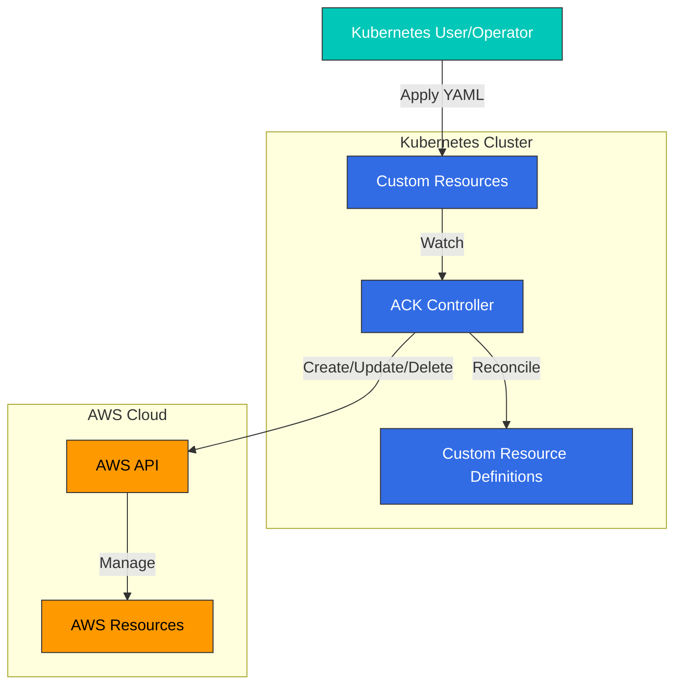

# AWS Controllers for Kubernetes (ACK)

## 목차
- [소개](#소개)
- [아키텍처](#아키텍처)
- [설치 및 구성](#설치-및-구성)
- [지원되는 AWS 서비스](#지원되는-aws-서비스)
- [S3 및 IAM 리소스 생성 예제](#s3-및-iam-리소스-생성-예제)
- [SQS 및 SNS 생성 예제](#sqs-및-sns-생성-예제)
- [리소스 관리](#리소스-관리)
- [보안 고려사항](#보안-고려사항)
- [모니터링 및 로깅](#모니터링-및-로깅)
- [모범 사례](#모범-사례)
- [문제 해결](#문제-해결)
- [결론](#결론)

## 소개

AWS Controllers for Kubernetes(ACK)는 Kubernetes 사용자가 Kubernetes API를 통해 AWS 서비스와 리소스를 직접 관리할 수 있게 해주는 프로젝트입니다. ACK는 Kubernetes의 선언적 API 모델을 AWS 리소스로 확장하여, 개발자와 운영자가 익숙한 Kubernetes 도구와 API를 사용하여 AWS 인프라를 관리할 수 있게 합니다.

### ACK의 주요 이점

- **통합된 경험**: Kubernetes와 AWS 리소스를 동일한 도구와 워크플로우로 관리
- **GitOps 지원**: AWS 리소스를 코드로 정의하고 Git 저장소에서 관리
- **선언적 구성**: 원하는 상태를 정의하고 컨트롤러가 실제 상태를 조정
- **Kubernetes 네이티브 접근 방식**: 표준 Kubernetes 개념과 API 사용
- **멀티 클러스터 지원**: 여러 클러스터에서 동일한 AWS 리소스 참조 가능
- **IAM 통합**: Kubernetes 서비스 계정과 AWS IAM 역할 통합

### 기존 접근 방식과의 비교

| 기능 | ACK | AWS CloudFormation | Terraform | AWS SDK/CLI |
|------|-----|-------------------|-----------|-------------|
| 인터페이스 | Kubernetes API | CloudFormation 템플릿 | HCL | 프로그래밍 API/명령줄 |
| 선언적 | ✅ | ✅ | ✅ | ❌ |
| 상태 관리 | Kubernetes etcd | CloudFormation 스택 | Terraform 상태 | 수동 관리 |
| 드리프트 감지 | ✅ | ✅ | ✅ | ❌ |
| Kubernetes 통합 | 네이티브 | 제한적 | 제한적 | 제한적 |
| 지원되는 서비스 | 제한적 (확장 중) | 광범위 | 광범위 | 모든 서비스 |

## 아키텍처

ACK는 Kubernetes 운영자 패턴을 기반으로 하며, 각 AWS 서비스에 대한 컨트롤러를 제공합니다.



### 주요 구성 요소

1. **서비스 컨트롤러**: 각 AWS 서비스에 대한 전용 컨트롤러
2. **사용자 정의 리소스 정의(CRD)**: AWS 리소스를 Kubernetes API로 정의
3. **사용자 정의 리소스(CR)**: AWS 리소스의 인스턴스
4. **조정 루프**: 원하는 상태와 실제 상태 간의 차이를 감지하고 해결

### 작동 방식

1. 사용자가 Kubernetes YAML 매니페스트를 적용하여 AWS 리소스를 정의
2. ACK 컨트롤러가 사용자 정의 리소스 변경 사항을 감지
3. 컨트롤러가 AWS API를 호출하여 해당 AWS 리소스를 생성, 업데이트 또는 삭제
4. 컨트롤러가 AWS 리소스의 상태를 모니터링하고 Kubernetes 리소스 상태를 업데이트

## 설치 및 구성

### 사전 요구 사항

- Kubernetes 클러스터 (v1.16 이상)
- kubectl 설정
- AWS 계정 및 적절한 IAM 권한
- Helm 3 (선택 사항)

### 설치 방법

#### 1. ACK 서비스 컨트롤러 설치

ACK 컨트롤러는 각 AWS 서비스별로 별도로 설치됩니다. 예를 들어, S3 컨트롤러를 설치하려면:

```bash
# Helm 차트 저장소 추가
helm repo add aws-controllers-k8s https://aws.github.io/eks-charts

# S3 컨트롤러 설치
helm install --create-namespace -n ack-system ack-s3-controller \
  aws-controllers-k8s/s3-chart
```

#### 2. IAM 권한 설정

ACK 컨트롤러가 AWS 리소스를 관리하려면 적절한 IAM 권한이 필요합니다. IRSA(IAM Roles for Service Accounts)를 사용하여 권한을 설정할 수 있습니다:

```bash
# IAM 정책 생성
aws iam create-policy \
  --policy-name ACKs3ControllerPolicy \
  --policy-document file://s3-controller-policy.json

# 서비스 계정에 IAM 역할 연결
eksctl create iamserviceaccount \
  --cluster=<cluster-name> \
  --namespace=ack-system \
  --name=ack-s3-controller \
  --attach-policy-arn=arn:aws:iam::<account-id>:policy/ACKs3ControllerPolicy \
  --approve
```

s3-controller-policy.json 예시:

```json
{
  "Version": "2012-10-17",
  "Statement": [
    {
      "Effect": "Allow",
      "Action": [
        "s3:CreateBucket",
        "s3:DeleteBucket",
        "s3:PutBucketTagging",
        "s3:GetBucketTagging",
        "s3:PutEncryptionConfiguration",
        "s3:GetEncryptionConfiguration",
        "s3:PutBucketPolicy",
        "s3:GetBucketPolicy",
        "s3:ListBucket"
      ],
      "Resource": "*"
    }
  ]
}
```

#### 3. 컨트롤러 구성

컨트롤러 구성을 사용자 지정하려면 Helm 값 파일을 사용할 수 있습니다:

```yaml
# values.yaml
aws:
  region: us-west-2
resources:
  requests:
    cpu: 100m
    memory: 128Mi
  limits:
    cpu: 500m
    memory: 256Mi
serviceAccount:
  annotations:
    eks.amazonaws.com/role-arn: arn:aws:iam::<account-id>:role/ACKs3ControllerRole
```

```bash
helm install --create-namespace -n ack-system ack-s3-controller \
  aws-controllers-k8s/s3-chart -f values.yaml
```

## 지원되는 AWS 서비스

ACK는 다양한 AWS 서비스에 대한 컨트롤러를 제공합니다. 각 서비스 컨트롤러는 개별적으로 설치하고 관리할 수 있습니다.

### 현재 지원되는 서비스 (2025년 7월 기준)

- Amazon API Gateway (apigatewayv2)
- Amazon DynamoDB
- Amazon ECR
- Amazon EKS
- Amazon ElastiCache
- Amazon MemoryDB
- Amazon MQ
- Amazon RDS
- Amazon S3
- Amazon SageMaker
- AWS IAM
- AWS Lambda
- AWS SNS
- AWS SQS
- Amazon EventBridge
- Amazon MSK
- Amazon OpenSearch Service
- AWS ACM
- AWS Route 53

### 서비스 컨트롤러 상태

각 서비스 컨트롤러는 다음 상태 중 하나를 가집니다:

- **알파(Alpha)**: 초기 개발 단계, API 변경 가능
- **베타(Beta)**: 기능 완성, 안정적이지만 API 변경 가능
- **GA(Generally Available)**: 프로덕션 사용 준비 완료

최신 상태는 [ACK GitHub 저장소](https://github.com/aws-controllers-k8s/community)에서 확인할 수 있습니다.

## S3 및 IAM 리소스 생성 예제

### S3 버킷 생성

```yaml
apiVersion: s3.services.k8s.aws/v1alpha1
kind: Bucket
metadata:
  name: my-sample-bucket
spec:
  name: my-unique-bucket-name-123
  tagging:
    tagSet:
      - key: Environment
        value: Development
      - key: Project
        value: ACK-Demo
  createBucketConfiguration:
    locationConstraint: us-west-2
```

### S3 버킷 정책 설정

```yaml
apiVersion: s3.services.k8s.aws/v1alpha1
kind: BucketPolicy
metadata:
  name: my-bucket-policy
spec:
  bucket: my-unique-bucket-name-123
  policy: |
    {
      "Version": "2012-10-17",
      "Statement": [
        {
          "Effect": "Allow",
          "Principal": {
            "AWS": "arn:aws:iam::123456789012:role/MyRole"
          },
          "Action": [
            "s3:GetObject"
          ],
          "Resource": [
            "arn:aws:s3:::my-unique-bucket-name-123/*"
          ]
        }
      ]
    }
```

### IAM 역할 생성

```yaml
apiVersion: iam.services.k8s.aws/v1alpha1
kind: Role
metadata:
  name: my-iam-role
spec:
  name: MyApplicationRole
  assumeRolePolicyDocument: |
    {
      "Version": "2012-10-17",
      "Statement": [
        {
          "Effect": "Allow",
          "Principal": {
            "Service": "ec2.amazonaws.com"
          },
          "Action": "sts:AssumeRole"
        }
      ]
    }
  description: "Role for my application"
  maxSessionDuration: 3600
  tags:
    - key: Environment
      value: Development
```

### IAM 정책 생성 및 연결

```yaml
apiVersion: iam.services.k8s.aws/v1alpha1
kind: Policy
metadata:
  name: my-s3-access-policy
spec:
  name: S3ReadOnlyAccess
  policyDocument: |
    {
      "Version": "2012-10-17",
      "Statement": [
        {
          "Effect": "Allow",
          "Action": [
            "s3:Get*",
            "s3:List*"
          ],
          "Resource": "*"
        }
      ]
    }
  description: "Policy for S3 read-only access"
---
apiVersion: iam.services.k8s.aws/v1alpha1
kind: RolePolicyAttachment
metadata:
  name: attach-s3-policy
spec:
  policyARN: arn:aws:iam::123456789012:policy/S3ReadOnlyAccess
  roleName: MyApplicationRole
```

## SQS 및 SNS 생성 예제

### SQS 대기열 생성

```yaml
apiVersion: sqs.services.k8s.aws/v1alpha1
kind: Queue
metadata:
  name: my-standard-queue
spec:
  name: my-standard-queue
  queueAttributes:
    - key: DelaySeconds
      value: "0"
    - key: MaximumMessageSize
      value: "262144"
    - key: MessageRetentionPeriod
      value: "345600"
    - key: VisibilityTimeout
      value: "30"
  tags:
    - key: Environment
      value: Development
```

### SQS FIFO 대기열 생성

```yaml
apiVersion: sqs.services.k8s.aws/v1alpha1
kind: Queue
metadata:
  name: my-fifo-queue
spec:
  name: my-fifo-queue.fifo
  queueAttributes:
    - key: FifoQueue
      value: "true"
    - key: ContentBasedDeduplication
      value: "true"
  tags:
    - key: Environment
      value: Development
```

### SNS 주제 생성

```yaml
apiVersion: sns.services.k8s.aws/v1alpha1
kind: Topic
metadata:
  name: my-notification-topic
spec:
  name: my-notification-topic
  attributes:
    - key: DisplayName
      value: "My Notification Topic"
  tags:
    - key: Environment
      value: Development
```

### SNS 구독 생성

```yaml
apiVersion: sns.services.k8s.aws/v1alpha1
kind: Subscription
metadata:
  name: my-email-subscription
spec:
  topicARN: arn:aws:sns:us-west-2:123456789012:my-notification-topic
  protocol: email
  endpoint: user@example.com
  attributes:
    - key: FilterPolicy
      value: |
        {
          "event_type": ["order_placed", "order_shipped"]
        }
```

### SQS와 SNS 통합

```yaml
apiVersion: sns.services.k8s.aws/v1alpha1
kind: Subscription
metadata:
  name: my-sqs-subscription
spec:
  topicARN: arn:aws:sns:us-west-2:123456789012:my-notification-topic
  protocol: sqs
  endpoint: arn:aws:sqs:us-west-2:123456789012:my-standard-queue
  attributes:
    - key: RawMessageDelivery
      value: "true"
```

## 리소스 관리

### 리소스 상태 확인

ACK 리소스의 상태를 확인하려면:

```bash
kubectl describe bucket my-sample-bucket
```

출력 예시:

```
Name:         my-sample-bucket
Namespace:    default
API Version:  s3.services.k8s.aws/v1alpha1
Kind:         Bucket
Metadata:
  ...
Spec:
  Name:  my-unique-bucket-name-123
  ...
Status:
  Ack Resource Metadata:
    Arn:                    arn:aws:s3:::my-unique-bucket-name-123
    Owner Account ID:       123456789012
  Conditions:
    Last Transition Time:  2025-07-13T04:00:00Z
    Status:                True
    Type:                  ACK.ResourceSynced
```

### 리소스 업데이트

ACK 리소스를 업데이트하려면 매니페스트를 수정하고 다시 적용합니다:

```bash
kubectl apply -f updated-bucket.yaml
```

### 리소스 삭제

ACK 리소스를 삭제하려면:

```bash
kubectl delete bucket my-sample-bucket
```

기본적으로 ACK는 Kubernetes 리소스를 삭제할 때 해당 AWS 리소스도 삭제합니다. 이 동작을 변경하려면 주석을 사용할 수 있습니다:

```yaml
metadata:
  annotations:
    services.k8s.aws/deletion-policy: "orphan"
```

### 리소스 가져오기

기존 AWS 리소스를 ACK로 가져오려면:

```yaml
apiVersion: s3.services.k8s.aws/v1alpha1
kind: Bucket
metadata:
  name: imported-bucket
  annotations:
    services.k8s.aws/resource-imported: "true"
spec:
  name: existing-bucket-name
```

## 보안 고려사항

### IAM 권한 관리

ACK 컨트롤러에는 관리하는 AWS 리소스에 대한 적절한 IAM 권한이 필요합니다. 최소 권한 원칙을 따라 필요한 권한만 부여하는 것이 좋습니다.

#### 세분화된 IAM 정책 예시

```json
{
  "Version": "2012-10-17",
  "Statement": [
    {
      "Effect": "Allow",
      "Action": [
        "s3:CreateBucket",
        "s3:DeleteBucket",
        "s3:GetBucketTagging",
        "s3:PutBucketTagging"
      ],
      "Resource": "arn:aws:s3:::my-unique-bucket-name-*"
    },
    {
      "Effect": "Allow",
      "Action": [
        "s3:ListAllMyBuckets"
      ],
      "Resource": "*"
    }
  ]
}
```

### 네임스페이스 격리

여러 팀이나 환경에 대해 별도의 네임스페이스와 IAM 역할을 사용하여 권한을 격리할 수 있습니다:

```bash
# 개발 환경용 컨트롤러 설치
helm install --create-namespace -n ack-system-dev ack-s3-controller \
  aws-controllers-k8s/s3-chart \
  --set serviceAccount.annotations."eks\.amazonaws\.com/role-arn"=arn:aws:iam::123456789012:role/ACKs3ControllerRoleDev

# 프로덕션 환경용 컨트롤러 설치
helm install --create-namespace -n ack-system-prod ack-s3-controller \
  aws-controllers-k8s/s3-chart \
  --set serviceAccount.annotations."eks\.amazonaws\.com/role-arn"=arn:aws:iam::123456789012:role/ACKs3ControllerRoleProd
```

### 리소스 정책

ACK 리소스에 대한 액세스를 제한하기 위해 Kubernetes RBAC를 사용할 수 있습니다:

```yaml
apiVersion: rbac.authorization.k8s.io/v1
kind: Role
metadata:
  namespace: dev
  name: s3-editor
rules:
- apiGroups: ["s3.services.k8s.aws"]
  resources: ["buckets"]
  verbs: ["get", "list", "watch", "create", "update", "patch", "delete"]
---
apiVersion: rbac.authorization.k8s.io/v1
kind: RoleBinding
metadata:
  name: dev-s3-editor
  namespace: dev
subjects:
- kind: User
  name: developer
  apiGroup: rbac.authorization.k8s.io
roleRef:
  kind: Role
  name: s3-editor
  apiGroup: rbac.authorization.k8s.io
```

## 모니터링 및 로깅

### 컨트롤러 로그 확인

ACK 컨트롤러의 로그를 확인하려면:

```bash
kubectl logs -n ack-system -l app.kubernetes.io/name=ack-s3-controller
```

### Prometheus 메트릭

ACK 컨트롤러는 Prometheus 메트릭을 노출합니다:

```yaml
apiVersion: monitoring.coreos.com/v1
kind: ServiceMonitor
metadata:
  name: ack-s3-controller
  namespace: monitoring
spec:
  selector:
    matchLabels:
      app.kubernetes.io/name: ack-s3-controller
  endpoints:
  - port: metrics
    interval: 30s
```

주요 메트릭:

- `ack_reconcile_success_total`: 성공적인 조정 횟수
- `ack_reconcile_failure_total`: 실패한 조정 횟수
- `ack_api_call_duration_seconds`: AWS API 호출 지연 시간

### AWS CloudTrail 통합

ACK 컨트롤러가 수행하는 AWS API 호출은 CloudTrail에 기록됩니다. CloudTrail 로그를 검토하여 ACK 작업을 감사할 수 있습니다.

## 모범 사례

### 리소스 구성

1. **명확한 이름 지정**: 리소스 이름을 명확하고 일관되게 지정
2. **주석 사용**: 리소스 관리를 위한 주석 활용
3. **레이블 적용**: 리소스 그룹화 및 필터링을 위한 레이블 사용

```yaml
apiVersion: s3.services.k8s.aws/v1alpha1
kind: Bucket
metadata:
  name: app-data-bucket
  annotations:
    services.k8s.aws/deletion-policy: "orphan"
    description: "Application data storage"
  labels:
    environment: production
    app: my-application
    team: data-engineering
spec:
  name: my-app-data-20250713
  tagging:
    tagSet:
      - key: Environment
        value: Production
```

### 버전 관리

1. **Git 저장소 사용**: ACK 리소스 매니페스트를 Git 저장소에 저장
2. **환경별 구성 분리**: 개발, 스테이징, 프로덕션 환경에 대한 별도 구성 유지
3. **Kustomize 활용**: 환경별 차이를 관리하기 위해 Kustomize 사용

```
├── base/
│   ├── s3-bucket.yaml
│   ├── sqs-queue.yaml
│   └── kustomization.yaml
├── overlays/
│   ├── dev/
│   │   ├── kustomization.yaml
│   │   └── patch.yaml
│   ├── staging/
│   │   ├── kustomization.yaml
│   │   └── patch.yaml
│   └── prod/
│       ├── kustomization.yaml
│       └── patch.yaml
```

### 성능 및 확장성

1. **리소스 요청 및 제한 설정**: 컨트롤러에 적절한 리소스 할당
2. **컨트롤러 복제본 확장**: 대규모 환경에서 컨트롤러 복제본 증가
3. **조정 빈도 조정**: 필요에 따라 조정 빈도 최적화

```yaml
apiVersion: helm.toolkit.fluxcd.io/v2beta1
kind: HelmRelease
metadata:
  name: ack-s3-controller
  namespace: ack-system
spec:
  chart:
    spec:
      chart: s3-chart
      sourceRef:
        kind: HelmRepository
        name: aws-controllers-k8s
  values:
    resources:
      requests:
        cpu: 200m
        memory: 256Mi
      limits:
        cpu: 500m
        memory: 512Mi
    replicaCount: 2
```

### 재해 복구

1. **백업 전략**: ACK 리소스 매니페스트 정기 백업
2. **복구 계획**: 장애 발생 시 리소스 복구 절차 문서화
3. **다중 리전 고려**: 중요 리소스에 대한 다중 리전 전략 구현

## 문제 해결

### 일반적인 문제

#### 1. 리소스 생성 실패

**증상**: ACK 리소스가 생성되지만 AWS 리소스는 생성되지 않음

**해결 방법**:
- 컨트롤러 로그 확인
- IAM 권한 확인
- 리소스 상태 및 이벤트 확인

```bash
kubectl logs -n ack-system -l app.kubernetes.io/name=ack-s3-controller
kubectl describe bucket my-sample-bucket
```

#### 2. 권한 문제

**증상**: "AccessDenied" 오류 메시지

**해결 방법**:
- IAM 정책 및 역할 확인
- IRSA 구성 확인
- CloudTrail 로그 검토

#### 3. 리소스 삭제 중단

**증상**: 리소스가 "Terminating" 상태에서 멈춤

**해결 방법**:
- 종속성 확인
- 파이널라이저 제거 (필요한 경우)

```bash
kubectl patch bucket my-sample-bucket -p '{"metadata":{"finalizers":[]}}' --type=merge
```

### 디버깅 도구

```bash
# 컨트롤러 버전 확인
kubectl get deployment -n ack-system ack-s3-controller -o jsonpath="{.spec.template.spec.containers[0].image}"

# CRD 확인
kubectl get crd | grep services.k8s.aws

# 이벤트 확인
kubectl get events --field-selector involvedObject.name=my-sample-bucket

# 컨트롤러 로그 상세 확인
kubectl logs -n ack-system -l app.kubernetes.io/name=ack-s3-controller --tail=100
```

## 결론

AWS Controllers for Kubernetes(ACK)는 Kubernetes와 AWS 서비스 간의 격차를 해소하는 강력한 도구입니다. ACK를 사용하면 Kubernetes 사용자가 익숙한 Kubernetes API와 도구를 사용하여 AWS 리소스를 관리할 수 있습니다.

이 문서에서는 ACK의 기본 개념, 설치 방법, S3, IAM, SQS, SNS 리소스 생성 예제, 리소스 관리, 보안 고려사항, 모니터링 및 문제 해결에 대해 살펴보았습니다.

ACK는 지속적으로 발전하고 있으며, 더 많은 AWS 서비스에 대한 지원이 추가되고 있습니다. GitOps 워크플로우와 결합하면 AWS 인프라를 코드로 관리하는 강력한 방법을 제공합니다.

### 다음 단계

- ACK를 사용한 GitOps 파이프라인 구축
- 여러 AWS 서비스 컨트롤러 통합
- 사용자 정의 리소스 정의 확장
- 다중 계정 및 다중 리전 전략 개발

## 참고 자료

- [ACK 공식 문서](https://aws-controllers-k8s.github.io/community/)
- [ACK GitHub 저장소](https://github.com/aws-controllers-k8s/community)
- [AWS 서비스 컨트롤러 목록](https://aws-controllers-k8s.github.io/community/docs/community/services/)
- [ACK 설계 원칙](https://aws-controllers-k8s.github.io/community/docs/community/design/)
- [EKS 워크숍 - ACK](https://www.eksworkshop.com/intermediate/290_ack/)
