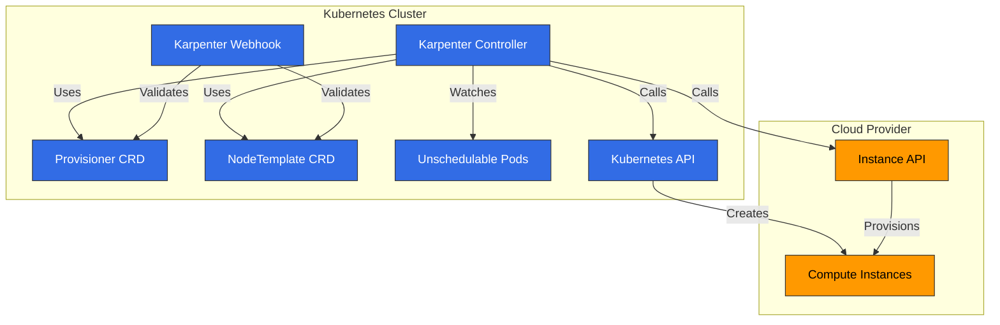
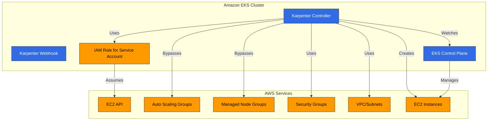

# Karpenter

## 목차
- [소개](#소개)
- [아키텍처](#아키텍처)
- [설치 및 구성](#설치-및-구성)
- [프로비저너](#프로비저너)
- [노드 템플릿](#노드-템플릿)
- [인터럽션 처리](#인터럽션-처리)
- [통합](#통합)
- [Amazon EKS와의 통합](#amazon-eks와의-통합)
- [모범 사례](#모범-사례)
- [문제 해결](#문제-해결)
- [결론](#결론)

## 소개

Karpenter는 Kubernetes 클러스터의 노드 프로비저닝을 자동화하는 오픈 소스 클러스터 오토스케일러입니다. Karpenter는 워크로드 요구 사항에 따라 적절한 컴퓨팅 리소스를 동적으로 프로비저닝하여 애플리케이션 가용성을 보장하고 클러스터 효율성을 최적화합니다.

### Karpenter의 주요 이점

1. **빠른 스케일링**: 워크로드 요구 사항에 따라 몇 초 내에 노드 프로비저닝
2. **비용 최적화**: 워크로드에 가장 적합한 인스턴스 유형 선택
3. **단순한 구성**: 선언적 API를 통한 간단한 구성
4. **워크로드 중심 설계**: 파드 요구 사항에 기반한 노드 프로비저닝
5. **클라우드 통합**: 클라우드 제공업체의 기능 활용
6. **효율적인 빈 패킹**: 리소스 활용도 최적화
7. **유연한 노드 관리**: 노드 수명 주기 관리 및 통합 인터럽션 처리

### 기존 오토스케일러와의 비교

| 기능 | Karpenter | Cluster Autoscaler | Cloud Provider 관리형 노드 그룹 |
|------|-----------|-------------------|---------------------------|
| 스케일링 속도 | 매우 빠름 (초 단위) | 중간 (분 단위) | 느림 (분 단위) |
| 인스턴스 유형 선택 | 동적 | 노드 그룹 기반 | 노드 그룹 기반 |
| 빈 패킹 효율성 | 높음 | 중간 | 낮음 |
| 구성 복잡성 | 낮음 | 중간 | 낮음 |
| 클라우드 통합 | 네이티브 | 제한적 | 네이티브 |
| 노드 그룹 관리 | 불필요 | 필요 | 필요 |
| 인터럽션 처리 | 통합 | 제한적 | 제한적 |

## 아키텍처

Karpenter는 Kubernetes 컨트롤러로 작동하며, 스케줄링할 수 없는 파드를 감지하고 적절한 노드를 프로비저닝합니다.



### Karpenter 워크플로우

다음 다이어그램은 Karpenter가 EKS 클러스터에서 작동하는 방식을 보여줍니다:

```mermaid
sequenceDiagram
    participant P as Pod
    participant K as Karpenter Controller
    participant KA as Kubernetes API
    participant EC2 as AWS EC2 API
    participant N as New Node

    P->>KA: Pod 생성 (스케줄링 불가)
    KA->>K: Pod 이벤트 알림
    K->>K: Pod 요구 사항 분석
    K->>K: 프로비저너 및 노드 템플릿 평가
    K->>EC2: 인스턴스 유형 및 가격 조회
    EC2->>K: 인스턴스 정보 반환
    K->>EC2: 노드 프로비저닝 요청
    EC2->>N: 인스턴스 생성
    N->>KA: 노드 등록
    KA->>K: 노드 이벤트 알림
    K->>KA: 노드 레이블 및 테인트 설정
    KA->>P: Pod 스케줄링
    
    %% 스타일 정의
    classDef k8sComponent fill:#326CE5,stroke:#333,stroke-width:1px,color:white;
    classDef awsService fill:#FF9900,stroke:#333,stroke-width:1px,color:black;
    classDef userApp fill:#00C7B7,stroke:#333,stroke-width:1px,color:white;
    classDef dataStore fill:#3B48CC,stroke:#333,stroke-width:1px,color:white;
    classDef default fill:#f9f9f9,stroke:#333,stroke-width:1px,color:black;
    
    %% 클래스 적용
    class P,KA,K k8sComponent
    class EC2 awsService
    class N default
```

### 주요 구성 요소

1. **Karpenter 컨트롤러**: 스케줄링할 수 없는 파드를 감지하고 노드 프로비저닝을 관리
2. **Karpenter 웹훅**: Karpenter 리소스의 유효성을 검사
3. **프로비저너 CRD**: 노드 프로비저닝 정책을 정의
4. **노드 템플릿 CRD**: 프로비저닝할 노드의 구성을 정의
5. **클라우드 제공업체 통합**: 클라우드 제공업체의 API와 통합하여 컴퓨팅 리소스 관리

### 작동 방식

1. Karpenter 컨트롤러가 스케줄링할 수 없는 파드를 감지
2. 파드 요구 사항(리소스, 노드 선택기, 허용 오차 등)을 분석
3. 프로비저너 및 노드 템플릿 구성에 따라 적절한 노드 유형 결정
4. 클라우드 제공업체 API를 호출하여 노드 프로비저닝
5. 노드가 클러스터에 조인하면 파드 스케줄링
6. 노드가 더 이상 필요하지 않으면 통합 인터럽션 처리를 통해 노드 제거

## 설치 및 구성

### 사전 요구 사항

- Kubernetes 클러스터 (v1.19 이상)
- kubectl 설정
- 클라우드 제공업체 자격 증명 및 권한
- Helm (선택 사항)

### AWS EKS에 설치

#### 1. IAM 역할 및 정책 설정

```bash
# eksctl을 사용한 IRSA 설정
eksctl create iamserviceaccount \
  --cluster=my-cluster \
  --name=karpenter \
  --namespace=karpenter \
  --attach-policy-arn=arn:aws:iam::aws:policy/AmazonEKSClusterPolicy \
  --attach-policy-arn=arn:aws:iam::aws:policy/AmazonEC2ContainerRegistryReadOnly \
  --approve

# 인스턴스 프로필 생성
aws iam create-instance-profile --instance-profile-name KarpenterNodeInstanceProfile

# 노드 역할 생성
aws iam create-role --role-name KarpenterNodeRole --assume-role-policy-document file://node-trust-policy.json

# 노드 역할에 정책 연결
aws iam attach-role-policy --role-name KarpenterNodeRole --policy-arn arn:aws:iam::aws:policy/AmazonEKSWorkerNodePolicy
aws iam attach-role-policy --role-name KarpenterNodeRole --policy-arn arn:aws:iam::aws:policy/AmazonEKS_CNI_Policy
aws iam attach-role-policy --role-name KarpenterNodeRole --policy-arn arn:aws:iam::aws:policy/AmazonEC2ContainerRegistryReadOnly
aws iam attach-role-policy --role-name KarpenterNodeRole --policy-arn arn:aws:iam::aws:policy/AmazonSSMManagedInstanceCore

# 인스턴스 프로필에 역할 추가
aws iam add-role-to-instance-profile --instance-profile-name KarpenterNodeInstanceProfile --role-name KarpenterNodeRole
```

#### 2. Helm을 사용한 설치

```bash
# Helm 저장소 추가
helm repo add karpenter https://charts.karpenter.sh
helm repo update

# Karpenter 설치
helm install karpenter karpenter/karpenter \
  --namespace karpenter \
  --create-namespace \
  --set serviceAccount.annotations."eks\.amazonaws\.com/role-arn"=arn:aws:iam::${ACCOUNT_ID}:role/KarpenterControllerRole \
  --set clusterName=${CLUSTER_NAME} \
  --set clusterEndpoint=${CLUSTER_ENDPOINT} \
  --set aws.defaultInstanceProfile=KarpenterNodeInstanceProfile
```

#### 3. 설치 확인

```bash
kubectl get pods -n karpenter
```

예상 출력:
```
NAME                         READY   STATUS    RESTARTS   AGE
karpenter-6f4f46d855-5lqx7   1/1     Running   0          1m
```

### 기본 프로비저너 구성

```yaml
apiVersion: karpenter.sh/v1alpha5
kind: Provisioner
metadata:
  name: default
spec:
  requirements:
    - key: karpenter.sh/capacity-type
      operator: In
      values: ["on-demand"]
    - key: kubernetes.io/arch
      operator: In
      values: ["amd64"]
    - key: node.kubernetes.io/instance-type
      operator: In
      values: ["m5.large", "m5.xlarge", "m5.2xlarge"]
  limits:
    resources:
      cpu: 1000
      memory: 1000Gi
  providerRef:
    name: default
  ttlSecondsAfterEmpty: 30
---
apiVersion: karpenter.k8s.aws/v1alpha1
kind: AWSNodeTemplate
metadata:
  name: default
spec:
  subnetSelector:
    karpenter.sh/discovery: "true"
  securityGroupSelector:
    karpenter.sh/discovery: "true"
  tags:
    karpenter.sh/discovery: "true"
  blockDeviceMappings:
    - deviceName: /dev/xvda
      ebs:
        volumeSize: 100Gi
        volumeType: gp3
        deleteOnTermination: true
```

## 프로비저너

프로비저너는 Karpenter가 노드를 프로비저닝하는 방법을 정의하는 Kubernetes 사용자 정의 리소스입니다.

### 기본 프로비저너 구성

```yaml
apiVersion: karpenter.sh/v1alpha5
kind: Provisioner
metadata:
  name: default
spec:
  # 노드 요구 사항
  requirements:
    - key: karpenter.sh/capacity-type
      operator: In
      values: ["on-demand"]
    - key: kubernetes.io/arch
      operator: In
      values: ["amd64"]
    - key: node.kubernetes.io/instance-type
      operator: In
      values: ["m5.large", "m5.xlarge", "m5.2xlarge"]
  
  # 리소스 제한
  limits:
    resources:
      cpu: 1000
      memory: 1000Gi
  
  # 노드 템플릿 참조
  providerRef:
    name: default
  
  # 노드 만료 설정
  ttlSecondsAfterEmpty: 30
  ttlSecondsUntilExpired: 2592000  # 30일
  
  # 테인트 및 레이블
  taints:
    - key: example.com/special-taint
      value: "true"
      effect: NoSchedule
  labels:
    environment: production
    app: web
  
  # 시작 템플릿
  startupTaints:
    - key: node.kubernetes.io/not-ready
      effect: NoSchedule
```

### 요구 사항 구성

요구 사항은 Karpenter가 프로비저닝할 노드의 특성을 정의합니다:

```yaml
requirements:
  # 용량 유형 (온디맨드 또는 스팟)
  - key: karpenter.sh/capacity-type
    operator: In
    values: ["on-demand", "spot"]
  
  # 아키텍처
  - key: kubernetes.io/arch
    operator: In
    values: ["amd64", "arm64"]
  
  # 인스턴스 유형
  - key: node.kubernetes.io/instance-type
    operator: In
    values: ["m5.large", "m5.xlarge", "c5.large"]
  
  # 가용 영역
  - key: topology.kubernetes.io/zone
    operator: In
    values: ["us-west-2a", "us-west-2b", "us-west-2c"]
  
  # 운영 체제
  - key: kubernetes.io/os
    operator: In
    values: ["linux"]
```

### 제한 구성

제한은 Karpenter가 프로비저닝할 수 있는 리소스의 최대량을 정의합니다:

```yaml
limits:
  resources:
    cpu: 1000
    memory: 1000Gi
    nvidia.com/gpu: 10
```

### 노드 만료 구성

노드 만료 설정은 Karpenter가 노드를 제거하는 시기를 정의합니다:

```yaml
# 노드가 비어 있을 때 제거하기까지의 시간(초)
ttlSecondsAfterEmpty: 30

# 노드 생성 후 제거하기까지의 최대 시간(초)
ttlSecondsUntilExpired: 2592000  # 30일
```
## 노드 템플릿

노드 템플릿은 Karpenter가 프로비저닝하는 노드의 구성을 정의합니다. AWS에서는 AWSNodeTemplate CRD를 사용합니다.

### AWS 노드 템플릿 구성

```yaml
apiVersion: karpenter.k8s.aws/v1alpha1
kind: AWSNodeTemplate
metadata:
  name: default
spec:
  # 서브넷 선택
  subnetSelector:
    karpenter.sh/discovery: "true"
  
  # 보안 그룹 선택
  securityGroupSelector:
    karpenter.sh/discovery: "true"
  
  # 인스턴스 태그
  tags:
    karpenter.sh/discovery: "true"
    environment: production
  
  # 블록 디바이스 매핑
  blockDeviceMappings:
    - deviceName: /dev/xvda
      ebs:
        volumeSize: 100Gi
        volumeType: gp3
        deleteOnTermination: true
        encrypted: true
  
  # 세부 인스턴스 구성
  instanceProfile: KarpenterNodeInstanceProfile
  amiFamily: AL2
  userData: |
    #!/bin/bash
    echo "Hello from Karpenter node!"
  
  # 메타데이터 옵션
  metadataOptions:
    httpEndpoint: enabled
    httpProtocolIPv6: disabled
    httpPutResponseHopLimit: 2
    httpTokens: required
```

### 서브넷 및 보안 그룹 선택

서브넷과 보안 그룹은 레이블 선택기를 사용하여 선택할 수 있습니다:

```yaml
# 서브넷 선택
subnetSelector:
  karpenter.sh/discovery: "true"
  Name: "private-*"

# 보안 그룹 선택
securityGroupSelector:
  karpenter.sh/discovery: "true"
  aws:eks:cluster-name: "my-cluster"
```

### AMI 구성

Karpenter는 다양한 AMI 패밀리를 지원합니다:

```yaml
# Amazon Linux 2
amiFamily: AL2

# Bottlerocket
amiFamily: Bottlerocket

# Ubuntu
amiFamily: Ubuntu

# 사용자 정의 AMI
amiSelector:
  aws:ec2:image:id: "ami-0123456789abcdef0"
```

### 블록 디바이스 구성

노드의 스토리지 구성을 정의할 수 있습니다:

```yaml
blockDeviceMappings:
  # 루트 볼륨
  - deviceName: /dev/xvda
    ebs:
      volumeSize: 100Gi
      volumeType: gp3
      iops: 3000
      throughput: 125
      deleteOnTermination: true
      encrypted: true
      kmsKeyID: "arn:aws:kms:us-west-2:111122223333:key/1234abcd-12ab-34cd-56ef-1234567890ab"
  
  # 추가 볼륨
  - deviceName: /dev/xvdb
    ebs:
      volumeSize: 500Gi
      volumeType: gp3
      deleteOnTermination: true
```

### 사용자 데이터 구성

노드 시작 시 실행할 사용자 데이터 스크립트를 정의할 수 있습니다:

```yaml
userData: |
  #!/bin/bash
  echo "Hello from Karpenter node!"
  
  # 시스템 구성
  sysctl -w vm.max_map_count=262144
  
  # 패키지 설치
  yum update -y
  yum install -y amazon-cloudwatch-agent
  
  # CloudWatch 에이전트 시작
  systemctl enable amazon-cloudwatch-agent
  systemctl start amazon-cloudwatch-agent
```

### 노드 통합 프로세스

다음 다이어그램은 Karpenter의 노드 통합(consolidation) 프로세스를 보여줍니다. 이 기능은 클러스터 효율성을 최적화하고 비용을 절감하는 데 중요합니다:

```mermaid
flowchart LR
    %% 노드 정의
    N1[Node 1\n50% 사용]
    N2[Node 2\n30% 사용]
    N3[Node 3\n20% 사용]
    N4[New Node\n100% 사용]
    
    %% 프로세스 정의
    P1[노드 사용률 분석]
    P2[통합 가능성 평가]
    P3[새 노드 프로비저닝]
    P4[파드 마이그레이션]
    P5[기존 노드 드레이닝]
    P6[기존 노드 종료]
    
    %% 연결 정의
    N1 & N2 & N3 --> P1
    P1 --> P2
    P2 --> P3
    P3 --> N4
    P3 --> P4
    P4 --> N4
    P4 --> P5
    P5 --> N1 & N2 & N3
    P5 --> P6
    P6 --> N1 & N2 & N3
    
    %% 스타일 정의
    classDef k8sComponent fill:#326CE5,stroke:#333,stroke-width:1px,color:white;
    classDef awsService fill:#FF9900,stroke:#333,stroke-width:1px,color:black;
    classDef userApp fill:#00C7B7,stroke:#333,stroke-width:1px,color:white;
    classDef dataStore fill:#3B48CC,stroke:#333,stroke-width:1px,color:white;
    classDef process fill:#4CAF50,stroke:#333,stroke-width:1px,color:white;
    classDef default fill:#f9f9f9,stroke:#333,stroke-width:1px,color:black;
    
    %% 클래스 적용
    class N1,N2,N3,N4 k8sComponent
    class P1,P2,P3,P4,P5,P6 process
```## 인터럽션 처리

Karpenter는 노드 인터럽션을 자동으로 처리하여 워크로드 가용성을 보장합니다.

### 통합 인터럽션 처리

Karpenter는 다음과 같은 인터럽션 이벤트를 처리합니다:

1. **스팟 인스턴스 중단**: AWS 스팟 인스턴스 중단 알림 처리
2. **노드 만료**: TTL 기반 노드 교체
3. **스케일 다운**: 노드가 더 이상 필요하지 않을 때 제거
4. **노드 통합**: 더 효율적인 노드 구성으로 통합

### 인터럽션 처리 구성

```yaml
apiVersion: karpenter.sh/v1alpha5
kind: Provisioner
metadata:
  name: default
spec:
  # 기타 구성...
  
  # 노드 만료 설정
  ttlSecondsAfterEmpty: 30
  ttlSecondsUntilExpired: 2592000  # 30일
  
  # 통합 설정
  consolidation:
    enabled: true
```

### 드레이닝 구성

Karpenter는 노드를 제거하기 전에 파드를 안전하게 드레이닝합니다:

```yaml
apiVersion: v1
kind: ConfigMap
metadata:
  name: karpenter-global-settings
  namespace: karpenter
data:
  aws:
    enablePodENI: "true"
  batchMaxDuration: "10s"
  batchIdleDuration: "1s"
  featureGates:
    driftEnabled: "true"
  nodePool:
    disruptionBudget:
      maxUnavailablePercentage: "30"
    disruption:
      consolidationPolicy: WhenEmpty
      consolidateAfter: 30s
      expireAfter: 720h
```

### PDB(PodDisruptionBudget) 통합

Karpenter는 PDB를 존중하여 애플리케이션 가용성을 보장합니다:

```yaml
apiVersion: policy/v1
kind: PodDisruptionBudget
metadata:
  name: app-pdb
spec:
  minAvailable: 2
  selector:
    matchLabels:
      app: my-app
```

## 통합

Karpenter는 다양한 Kubernetes 및 클라우드 서비스와 통합됩니다.

### Kubernetes 통합

#### 1. Pod Topology Spread Constraints

Karpenter는 Pod Topology Spread Constraints를 고려하여 노드를 프로비저닝합니다:

```yaml
apiVersion: apps/v1
kind: Deployment
metadata:
  name: web-server
spec:
  replicas: 10
  template:
    spec:
      topologySpreadConstraints:
        - maxSkew: 1
          topologyKey: topology.kubernetes.io/zone
          whenUnsatisfiable: DoNotSchedule
          labelSelector:
            matchLabels:
              app: web-server
```

#### 2. Pod Affinity/Anti-Affinity

Karpenter는 Pod Affinity 및 Anti-Affinity 규칙을 고려합니다:

```yaml
apiVersion: apps/v1
kind: Deployment
metadata:
  name: web-server
spec:
  replicas: 10
  template:
    spec:
      affinity:
        podAntiAffinity:
          requiredDuringSchedulingIgnoredDuringExecution:
            - labelSelector:
                matchExpressions:
                  - key: app
                    operator: In
                    values:
                      - web-server
              topologyKey: "kubernetes.io/hostname"
```

#### 3. 테인트 및 허용 오차

Karpenter는 테인트 및 허용 오차를 고려하여 노드를 프로비저닝합니다:

```yaml
apiVersion: karpenter.sh/v1alpha5
kind: Provisioner
metadata:
  name: gpu
spec:
  requirements:
    - key: node.kubernetes.io/instance-type
      operator: In
      values: ["g4dn.xlarge", "g4dn.2xlarge"]
  taints:
    - key: nvidia.com/gpu
      value: "true"
      effect: NoSchedule
---
apiVersion: apps/v1
kind: Deployment
metadata:
  name: gpu-app
spec:
  replicas: 3
  template:
    spec:
      tolerations:
        - key: nvidia.com/gpu
          operator: Exists
          effect: NoSchedule
      nodeSelector:
        karpenter.sh/provisioner-name: gpu
```

### AWS 통합

#### 1. EC2 Spot 인스턴스

Karpenter는 EC2 Spot 인스턴스를 지원하여 비용을 최적화합니다:

```yaml
apiVersion: karpenter.sh/v1alpha5
kind: Provisioner
metadata:
  name: spot
spec:
  requirements:
    - key: karpenter.sh/capacity-type
      operator: In
      values: ["spot"]
  providerRef:
    name: spot
---
apiVersion: karpenter.k8s.aws/v1alpha1
kind: AWSNodeTemplate
metadata:
  name: spot
spec:
  subnetSelector:
    karpenter.sh/discovery: "true"
  securityGroupSelector:
    karpenter.sh/discovery: "true"
```

#### 2. EC2 인스턴스 프로필

Karpenter는 EC2 인스턴스 프로필을 사용하여 노드에 IAM 권한을 부여합니다:

```yaml
apiVersion: karpenter.k8s.aws/v1alpha1
kind: AWSNodeTemplate
metadata:
  name: default
spec:
  instanceProfile: KarpenterNodeInstanceProfile
```

#### 3. 시작 템플릿

Karpenter는 EC2 시작 템플릿을 지원합니다:

```yaml
apiVersion: karpenter.k8s.aws/v1alpha1
kind: AWSNodeTemplate
metadata:
  name: custom-launch-template
spec:
  launchTemplate:
    name: my-launch-template
    version: "1"
```
## Amazon EKS와의 통합

Karpenter는 Amazon EKS와 원활하게 통합되어 클러스터 오토스케일링을 제공합니다.



### EKS 클러스터 준비

#### 1. 클러스터 태그 설정

Karpenter가 클러스터 리소스를 식별할 수 있도록 태그를 설정합니다:

```bash
# 클러스터 이름 설정
CLUSTER_NAME="my-cluster"

# VPC 태그 설정
aws ec2 create-tags \
  --resources $(aws eks describe-cluster \
    --name ${CLUSTER_NAME} \
    --query "cluster.resourcesVpcConfig.vpcId" \
    --output text) \
  --tags Key=karpenter.sh/discovery,Value=${CLUSTER_NAME}

# 서브넷 태그 설정
for SUBNET in $(aws eks describe-cluster \
  --name ${CLUSTER_NAME} \
  --query "cluster.resourcesVpcConfig.subnetIds[]" \
  --output text); do
  aws ec2 create-tags \
    --resources ${SUBNET} \
    --tags Key=karpenter.sh/discovery,Value=${CLUSTER_NAME}
done

# 보안 그룹 태그 설정
aws ec2 create-tags \
  --resources $(aws eks describe-cluster \
    --name ${CLUSTER_NAME} \
    --query "cluster.resourcesVpcConfig.clusterSecurityGroupId" \
    --output text) \
  --tags Key=karpenter.sh/discovery,Value=${CLUSTER_NAME}
```

#### 2. IAM 역할 설정

Karpenter 컨트롤러와 노드에 필요한 IAM 역할을 설정합니다:

```bash
# 컨트롤러 역할 생성
cat <<EOF > controller-trust-policy.json
{
  "Version": "2012-10-17",
  "Statement": [
    {
      "Effect": "Allow",
      "Principal": {
        "Federated": "arn:aws:iam::${ACCOUNT_ID}:oidc-provider/${OIDC_PROVIDER}"
      },
      "Action": "sts:AssumeRoleWithWebIdentity",
      "Condition": {
        "StringEquals": {
          "${OIDC_PROVIDER}:sub": "system:serviceaccount:karpenter:karpenter",
          "${OIDC_PROVIDER}:aud": "sts.amazonaws.com"
        }
      }
    }
  ]
}
EOF

aws iam create-role \
  --role-name KarpenterControllerRole-${CLUSTER_NAME} \
  --assume-role-policy-document file://controller-trust-policy.json

# 컨트롤러 정책 생성
cat <<EOF > controller-policy.json
{
  "Version": "2012-10-17",
  "Statement": [
    {
      "Effect": "Allow",
      "Action": [
        "ec2:CreateLaunchTemplate",
        "ec2:CreateFleet",
        "ec2:RunInstances",
        "ec2:CreateTags",
        "ec2:TerminateInstances",
        "ec2:DescribeLaunchTemplates",
        "ec2:DescribeInstances",
        "ec2:DescribeSecurityGroups",
        "ec2:DescribeSubnets",
        "ec2:DescribeInstanceTypes",
        "ec2:DescribeInstanceTypeOfferings",
        "ec2:DescribeAvailabilityZones",
        "ec2:DescribeSpotPriceHistory",
        "pricing:GetProducts",
        "ssm:GetParameter"
      ],
      "Resource": "*"
    },
    {
      "Effect": "Allow",
      "Action": "iam:PassRole",
      "Resources": "arn:aws:iam::${ACCOUNT_ID}:role/KarpenterNodeRole-${CLUSTER_NAME}",
      "Condition": {
        "StringEquals": {
          "iam:PassedToService": "ec2.amazonaws.com"
        }
      }
    }
  ]
}
EOF

aws iam put-role-policy \
  --role-name KarpenterControllerRole-${CLUSTER_NAME} \
  --policy-name KarpenterControllerPolicy-${CLUSTER_NAME} \
  --policy-document file://controller-policy.json
```

### EKS 클러스터에 Karpenter 설치

```bash
# Helm을 사용한 설치
helm install karpenter karpenter/karpenter \
  --namespace karpenter \
  --create-namespace \
  --set serviceAccount.annotations."eks\.amazonaws\.com/role-arn"=arn:aws:iam::${ACCOUNT_ID}:role/KarpenterControllerRole-${CLUSTER_NAME} \
  --set clusterName=${CLUSTER_NAME} \
  --set clusterEndpoint=$(aws eks describe-cluster --name ${CLUSTER_NAME} --query "cluster.endpoint" --output text) \
  --set aws.defaultInstanceProfile=KarpenterNodeInstanceProfile-${CLUSTER_NAME}
```

### EKS 관리형 노드 그룹과 함께 사용

Karpenter는 EKS 관리형 노드 그룹과 함께 사용할 수 있습니다:

```yaml
# EKS 관리형 노드 그룹용 프로비저너
apiVersion: karpenter.sh/v1alpha5
kind: Provisioner
metadata:
  name: managed-ng
spec:
  requirements:
    - key: karpenter.sh/capacity-type
      operator: In
      values: ["on-demand"]
    - key: node.kubernetes.io/instance-type
      operator: In
      values: ["m5.large", "m5.xlarge"]
  labels:
    managed-by: karpenter
  taints:
    - key: managed-by
      value: karpenter
      effect: NoSchedule
  providerRef:
    name: managed-ng
  ttlSecondsAfterEmpty: 30
---
apiVersion: karpenter.k8s.aws/v1alpha1
kind: AWSNodeTemplate
metadata:
  name: managed-ng
spec:
  subnetSelector:
    karpenter.sh/discovery: "${CLUSTER_NAME}"
  securityGroupSelector:
    karpenter.sh/discovery: "${CLUSTER_NAME}"
  tags:
    karpenter.sh/discovery: "${CLUSTER_NAME}"
```

### EKS Fargate와 함께 사용

Karpenter는 EKS Fargate와 함께 사용하여 하이브리드 클러스터를 구성할 수 있습니다:

```yaml
# Fargate 프로필 생성
aws eks create-fargate-profile \
  --cluster-name ${CLUSTER_NAME} \
  --fargate-profile-name fp-default \
  --pod-execution-role-arn arn:aws:iam::${ACCOUNT_ID}:role/AmazonEKSFargatePodExecutionRole \
  --selectors namespace=default,namespace=kube-system

# Karpenter 프로비저너 구성
apiVersion: karpenter.sh/v1alpha5
kind: Provisioner
metadata:
  name: ec2
spec:
  requirements:
    - key: karpenter.sh/capacity-type
      operator: In
      values: ["on-demand"]
  providerRef:
    name: ec2
  ttlSecondsAfterEmpty: 30
---
apiVersion: karpenter.k8s.aws/v1alpha1
kind: AWSNodeTemplate
metadata:
  name: ec2
spec:
  subnetSelector:
    karpenter.sh/discovery: "${CLUSTER_NAME}"
  securityGroupSelector:
    karpenter.sh/discovery: "${CLUSTER_NAME}"
```

### EKS 비용 최적화

Karpenter를 사용하여 EKS 클러스터의 비용을 최적화할 수 있습니다:

```mermaid
flowchart TD
    %% 노드 정의
    CA[Cluster Autoscaler]
    KA[Karpenter]
    
    %% 비용 최적화 전략
    CA1[노드 그룹 기반 스케일링]
    CA2[동일한 인스턴스 유형]
    CA3[느린 스케일링 속도]
    CA4[제한된 빈 패킹]
    
    KA1[워크로드 기반 스케일링]
    KA2[다양한 인스턴스 유형]
    KA3[빠른 스케일링 속도]
    KA4[효율적인 빈 패킹]
    KA5[노드 통합]
    KA6[스팟 인스턴스 활용]
    
    %% 결과
    CAR[비용 절감: 중간]
    KAR[비용 절감: 높음]
    
    %% 연결 정의
    CA --> CA1 & CA2 & CA3 & CA4
    CA1 & CA2 & CA3 & CA4 --> CAR
    
    KA --> KA1 & KA2 & KA3 & KA4 & KA5 & KA6
    KA1 & KA2 & KA3 & KA4 & KA5 & KA6 --> KAR
    
    %% 스타일 정의
    classDef k8sComponent fill:#326CE5,stroke:#333,stroke-width:1px,color:white;
    classDef awsService fill:#FF9900,stroke:#333,stroke-width:1px,color:black;
    classDef userApp fill:#00C7B7,stroke:#333,stroke-width:1px,color:white;
    classDef dataStore fill:#3B48CC,stroke:#333,stroke-width:1px,color:white;
    classDef strategy fill:#4CAF50,stroke:#333,stroke-width:1px,color:white;
    classDef result fill:#E91E63,stroke:#333,stroke-width:1px,color:white;
    classDef default fill:#f9f9f9,stroke:#333,stroke-width:1px,color:black;
    
    %% 클래스 적용
    class CA,KA k8sComponent
    class CA1,CA2,CA3,CA4,KA1,KA2,KA3,KA4,KA5,KA6 strategy
    class CAR,KAR result
```



#### 1. 스팟 인스턴스 사용

```yaml
apiVersion: karpenter.sh/v1alpha5
kind: Provisioner
metadata:
  name: spot
spec:
  requirements:
    - key: karpenter.sh/capacity-type
      operator: In
      values: ["spot"]
    - key: kubernetes.io/arch
      operator: In
      values: ["amd64", "arm64"]
  providerRef:
    name: spot
  ttlSecondsAfterEmpty: 30
---
apiVersion: karpenter.k8s.aws/v1alpha1
kind: AWSNodeTemplate
metadata:
  name: spot
spec:
  subnetSelector:
    karpenter.sh/discovery: "${CLUSTER_NAME}"
  securityGroupSelector:
    karpenter.sh/discovery: "${CLUSTER_NAME}"
```

#### 2. 다양한 인스턴스 유형 사용

```yaml
apiVersion: karpenter.sh/v1alpha5
kind: Provisioner
metadata:
  name: flexible
spec:
  requirements:
    - key: karpenter.sh/capacity-type
      operator: In
      values: ["on-demand", "spot"]
    - key: kubernetes.io/arch
      operator: In
      values: ["amd64", "arm64"]
    - key: node.kubernetes.io/instance-type
      operator: In
      values: [
        "m5.large", "m5.xlarge", "m5.2xlarge",
        "m6g.large", "m6g.xlarge", "m6g.2xlarge",
        "c5.large", "c5.xlarge", "c5.2xlarge",
        "c6g.large", "c6g.xlarge", "c6g.2xlarge",
        "r5.large", "r5.xlarge", "r5.2xlarge",
        "r6g.large", "r6g.xlarge", "r6g.2xlarge"
      ]
  providerRef:
    name: flexible
  ttlSecondsAfterEmpty: 30
```

#### 3. 노드 통합 활성화

```yaml
apiVersion: karpenter.sh/v1alpha5
kind: Provisioner
metadata:
  name: default
spec:
  consolidation:
    enabled: true
  # 기타 구성...
```

## 모범 사례


### 성능 최적화

1. **적절한 인스턴스 유형 선택**: 워크로드에 적합한 인스턴스 유형 선택
2. **다양한 인스턴스 유형 허용**: 가용성 및 비용 최적화를 위해 다양한 인스턴스 유형 허용
3. **적절한 TTL 설정**: 워크로드 패턴에 맞는 TTL 설정
4. **노드 통합 활성화**: 리소스 활용도 최적화를 위한 노드 통합 활성화

```yaml
apiVersion: karpenter.sh/v1alpha5
kind: Provisioner
metadata:
  name: optimized
spec:
  # 다양한 인스턴스 유형 허용
  requirements:
    - key: node.kubernetes.io/instance-type
      operator: In
      values: [
        "m5.large", "m5.xlarge", "m5.2xlarge",
        "c5.large", "c5.xlarge", "c5.2xlarge",
        "r5.large", "r5.xlarge", "r5.2xlarge"
      ]
  
  # 적절한 TTL 설정
  ttlSecondsAfterEmpty: 30
  ttlSecondsUntilExpired: 2592000  # 30일
  
  # 노드 통합 활성화
  consolidation:
    enabled: true
```

### 비용 최적화

1. **스팟 인스턴스 활용**: 비용 절감을 위한 스팟 인스턴스 사용
2. **적절한 인스턴스 크기 선택**: 워크로드에 적합한 인스턴스 크기 선택
3. **제로 스케일링 활용**: 활동이 없을 때 노드 수를 0으로 줄이기
4. **노드 만료 설정**: 정기적인 노드 교체를 통한 최신 인스턴스 유형 활용

```yaml
apiVersion: karpenter.sh/v1alpha5
kind: Provisioner
metadata:
  name: cost-optimized
spec:
  # 스팟 인스턴스 사용
  requirements:
    - key: karpenter.sh/capacity-type
      operator: In
      values: ["spot"]
  
  # 제로 스케일링 활성화
  ttlSecondsAfterEmpty: 30
  
  # 노드 만료 설정
  ttlSecondsUntilExpired: 604800  # 7일
  
  # 노드 통합 활성화
  consolidation:
    enabled: true
```

### 가용성 향상

1. **다중 가용 영역 사용**: 여러 가용 영역에 걸쳐 노드 배포
2. **온디맨드 및 스팟 인스턴스 혼합**: 가용성과 비용 균형 유지
3. **적절한 PDB 설정**: 애플리케이션 가용성 보장
4. **인터럽션 처리 최적화**: 노드 인터럽션 시 워크로드 가용성 보장

```yaml
apiVersion: karpenter.sh/v1alpha5
kind: Provisioner
metadata:
  name: high-availability
spec:
  # 다중 가용 영역 사용
  requirements:
    - key: topology.kubernetes.io/zone
      operator: In
      values: ["us-west-2a", "us-west-2b", "us-west-2c"]
    - key: karpenter.sh/capacity-type
      operator: In
      values: ["on-demand", "spot"]
  
  # 인터럽션 처리 최적화
  ttlSecondsAfterEmpty: 60
  ttlSecondsUntilExpired: 2592000  # 30일
  
  # 노드 통합 설정
  consolidation:
    enabled: true
```

## 문제 해결

### 일반적인 문제

#### 1. 노드 프로비저닝 실패

**증상**: 파드가 Pending 상태로 유지되고 노드가 프로비저닝되지 않음

**해결 방법**:
- Karpenter 로그 확인
- IAM 권한 확인
- 프로비저너 구성 확인

```bash
# Karpenter 로그 확인
kubectl logs -n karpenter -l app.kubernetes.io/name=karpenter -c controller

# 프로비저너 상태 확인
kubectl describe provisioner <name>

# 파드 이벤트 확인
kubectl describe pod <name>
```

#### 2. 노드 제거 문제

**증상**: 노드가 예상대로 제거되지 않음

**해결 방법**:
- TTL 설정 확인
- 노드 통합 설정 확인
- 파드 드레이닝 상태 확인

```bash
# 노드 상태 확인
kubectl describe node <name>

# 노드 레이블 확인
kubectl get node <name> --show-labels

# Karpenter 로그 확인
kubectl logs -n karpenter -l app.kubernetes.io/name=karpenter -c controller | grep "node termination"
```

#### 3. 인스턴스 유형 선택 문제

**증상**: 예상하지 않은 인스턴스 유형이 프로비저닝됨

**해결 방법**:
- 프로비저너 요구 사항 확인
- 파드 리소스 요청 확인
- 가용 영역 제약 조건 확인

```bash
# 프로비저너 요구 사항 확인
kubectl get provisioner <name> -o yaml

# 파드 리소스 요청 확인
kubectl describe pod <name>

# 노드 정보 확인
kubectl describe node <name>
```

### 디버깅 도구

```bash
# Karpenter 버전 확인
kubectl get deployment -n karpenter karpenter -o jsonpath="{.spec.template.spec.containers[0].image}"

# Karpenter 로그 확인
kubectl logs -n karpenter -l app.kubernetes.io/name=karpenter -c controller

# 프로비저너 목록 확인
kubectl get provisioners

# 노드 템플릿 목록 확인
kubectl get awsnodetemplates

# 이벤트 확인
kubectl get events --sort-by='.lastTimestamp'

# 디버그 로그 활성화
kubectl patch configmap -n karpenter karpenter-global-settings --type merge -p '{"data":{"logLevel":"debug"}}'
```

## 결론

Karpenter는 Kubernetes 클러스터의 노드 프로비저닝을 자동화하는 강력한 오토스케일러입니다. 워크로드 요구 사항에 따라 적절한 컴퓨팅 리소스를 동적으로 프로비저닝하여 애플리케이션 가용성을 보장하고 클러스터 효율성을 최적화합니다.

이 문서에서는 Karpenter의 기본 개념, 설치 방법, 프로비저너 및 노드 템플릿 구성, 인터럽션 처리, 다양한 통합, Amazon EKS와의 통합, 모범 사례 및 문제 해결에 대해 살펴보았습니다.

Karpenter를 사용하면 클러스터 관리를 간소화하고, 리소스 활용도를 최적화하며, 비용을 절감할 수 있습니다. 특히 Amazon EKS와 같은 클라우드 관리형 Kubernetes 환경에서 Karpenter의 이점을 최대한 활용할 수 있습니다.

### 다음 단계

- Karpenter를 사용한 비용 최적화 전략 구현
- 다양한 워크로드 유형에 맞는 프로비저너 구성
- 하이브리드 클러스터 아키텍처 설계
- Karpenter와 다른 Kubernetes 도구와의 통합
- 고급 노드 수명 주기 관리 전략 개발

## 참고 자료

- [Karpenter 공식 문서](https://karpenter.sh/)
- [Karpenter GitHub 저장소](https://github.com/aws/karpenter)
- [Amazon EKS 워크숍 - Karpenter](https://www.eksworkshop.com/docs/autoscaling/compute/karpenter/)
- [AWS 블로그 - Karpenter](https://aws.amazon.com/blogs/containers/introducing-karpenter-an-open-source-high-performance-kubernetes-cluster-autoscaler/)
- [Karpenter 모범 사례](https://aws.github.io/aws-eks-best-practices/karpenter/)
