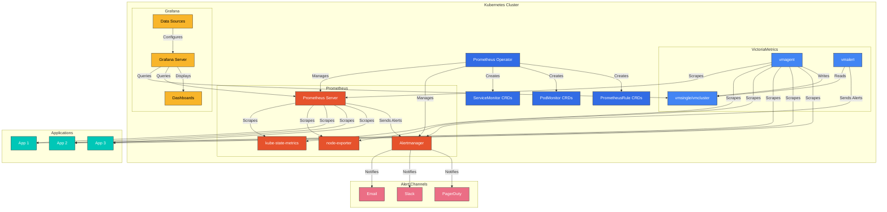
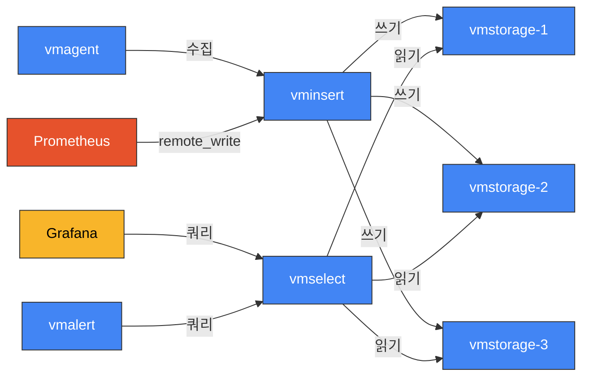
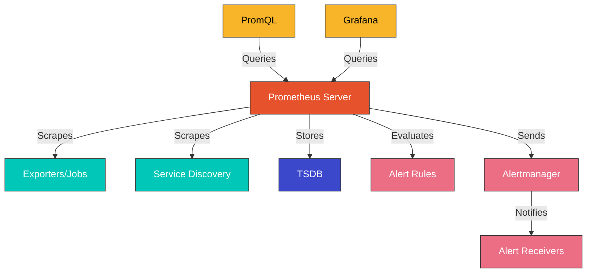
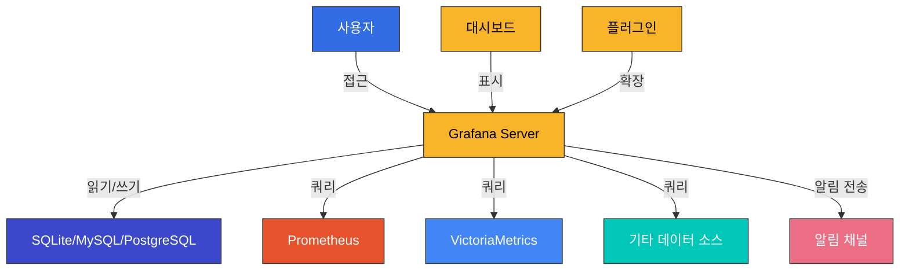

# 모니터링 스택 (VictoriaMetrics, Prometheus, Grafana)

## 목차
- [소개](#소개)
- [아키텍처](#아키텍처)
- [VictoriaMetrics](#victoriametrics)
- [Prometheus](#prometheus)
- [Grafana](#grafana)
- [설치 및 구성](#설치-및-구성)
- [메트릭 수집](#메트릭-수집)
- [알림 구성](#알림-구성)
- [대시보드 구성](#대시보드-구성)
- [고가용성 구성](#고가용성-구성)
- [성능 최적화](#성능-최적화)
- [Amazon EKS와의 통합](#amazon-eks와의-통합)
- [모범 사례](#모범-사례)
- [문제 해결](#문제-해결)
- [결론](#결론)

## 소개

Kubernetes 환경에서 모니터링은 시스템의 상태를 파악하고, 문제를 조기에 감지하며, 성능을 최적화하는 데 필수적입니다. 이 문서에서는 VictoriaMetrics, Prometheus, Grafana로 구성된 모니터링 스택을 설명합니다. 이 조합은 확장성이 뛰어나고 효율적인 모니터링 솔루션을 제공합니다.

### 모니터링의 중요성

Kubernetes 환경에서 모니터링은 다음과 같은 이유로 중요합니다:

1. **가시성 확보**: 분산 시스템의 복잡성을 이해하고 관리
2. **문제 감지**: 장애 및 성능 문제를 조기에 발견
3. **용량 계획**: 리소스 사용량 추세를 분석하여 미래 요구 사항 예측
4. **성능 최적화**: 병목 현상 식별 및 해결
5. **비용 최적화**: 리소스 사용량 모니터링을 통한 비용 절감
6. **보안 모니터링**: 비정상적인 활동 감지

### 모니터링 스택 구성 요소

#### VictoriaMetrics

VictoriaMetrics는 고성능, 비용 효율적인 시계열 데이터베이스 및 모니터링 솔루션입니다. Prometheus와 호환되면서도 더 나은 압축률과 쿼리 성능을 제공합니다.

주요 특징:
- 높은 데이터 압축률
- 빠른 쿼리 성능
- 수평적 확장성
- 낮은 운영 오버헤드
- Prometheus 호환성

#### Prometheus

Prometheus는 오픈 소스 시스템 모니터링 및 알림 툴킷으로, 시계열 데이터를 수집하고 저장하는 데 특화되어 있습니다.

주요 특징:
- 다차원 데이터 모델
- 유연한 쿼리 언어 (PromQL)
- 풀 기반 메트릭 수집
- 서비스 디스커버리
- 알림 관리

#### Grafana

Grafana는 메트릭 데이터를 시각화하고 분석하기 위한 오픈 소스 플랫폼입니다.

주요 특징:
- 다양한 데이터 소스 지원
- 풍부한 시각화 옵션
- 대시보드 템플릿
- 알림 기능
- 사용자 인증 및 권한 관리

### 기존 모니터링 솔루션과의 비교

| 기능 | VictoriaMetrics + Prometheus + Grafana | Prometheus + Grafana | CloudWatch | Datadog |
|------|----------------------------------------|----------------------|------------|---------|
| 확장성 | 매우 높음 | 중간 | 높음 | 높음 |
| 데이터 압축 | 매우 높음 | 중간 | 낮음 | 중간 |
| 쿼리 성능 | 매우 높음 | 중간 | 중간 | 높음 |
| 비용 | 낮음 (자체 호스팅) | 낮음 (자체 호스팅) | 중간-높음 | 높음 |
| 설정 복잡성 | 중간 | 낮음 | 낮음 | 낮음 |
| 커스터마이징 | 매우 높음 | 높음 | 중간 | 중간 |
| 통합 | 광범위 | 광범위 | AWS 서비스 중심 | 광범위 |
| 장기 데이터 저장 | 효율적 | 제한적 | 비용 증가 | 비용 증가 |

## 아키텍처

VictoriaMetrics, Prometheus, Grafana로 구성된 모니터링 스택의 아키텍처는 다음과 같습니다:



### 주요 구성 요소

1. **Prometheus Operator**: Kubernetes에서 Prometheus 인스턴스를 관리하는 컨트롤러
2. **ServiceMonitor/PodMonitor**: 모니터링할 서비스 및 파드를 정의하는 커스텀 리소스
3. **PrometheusRule**: 알림 규칙을 정의하는 커스텀 리소스
4. **Prometheus Server**: 메트릭을 수집하고 저장하는 시계열 데이터베이스
5. **Alertmanager**: 알림을 처리하고 라우팅하는 구성 요소
6. **kube-state-metrics**: Kubernetes API 객체에 대한 메트릭 생성
7. **node-exporter**: 노드 수준 메트릭 수집
8. **VictoriaMetrics**: 고성능 시계열 데이터베이스
9. **vmagent**: 메트릭 수집 및 전달
10. **vmalert**: 알림 규칙 평가
11. **Grafana**: 메트릭 시각화 및 대시보드

### 데이터 흐름

1. **메트릭 수집**: Prometheus 또는 vmagent가 애플리케이션, kube-state-metrics, node-exporter 등에서 메트릭을 수집
2. **데이터 저장**: 수집된 메트릭은 Prometheus 또는 VictoriaMetrics에 저장
3. **알림 평가**: Prometheus 또는 vmalert가 저장된 메트릭에 대해 알림 규칙을 평가
4. **알림 처리**: Alertmanager가 알림을 수신하고 적절한 채널로 라우팅
5. **시각화**: Grafana가 Prometheus 또는 VictoriaMetrics에서 데이터를 쿼리하여 대시보드에 표시

## VictoriaMetrics

VictoriaMetrics는 고성능, 비용 효율적인 시계열 데이터베이스로, Prometheus와 호환되면서도 더 나은 성능과 확장성을 제공합니다.

### 주요 특징

1. **높은 데이터 압축률**: Prometheus보다 최대 7배 더 효율적인 데이터 압축
2. **빠른 쿼리 성능**: 복잡한 쿼리에 대해 Prometheus보다 최대 20배 빠른 성능
3. **수평적 확장성**: 클러스터 모드에서 수평적으로 확장 가능
4. **낮은 운영 오버헤드**: 단일 바이너리로 배포 가능
5. **Prometheus 호환성**: Prometheus API 및 PromQL과 호환
6. **다중 테넌시**: 여러 팀이나 프로젝트를 위한 격리된 환경 제공
7. **장기 데이터 저장**: 효율적인 장기 메트릭 저장

### 아키텍처 옵션

VictoriaMetrics는 두 가지 배포 모드를 제공합니다:

#### 1. 단일 노드 모드 (vmsingle)

소규모 및 중간 규모 배포에 적합한 단일 노드 설정:

```yaml
apiVersion: apps/v1
kind: StatefulSet
metadata:
  name: vmsingle
  namespace: monitoring
spec:
  serviceName: "vmsingle"
  replicas: 1
  selector:
    matchLabels:
      app: vmsingle
  template:
    metadata:
      labels:
        app: vmsingle
    spec:
      containers:
      - name: vmsingle
        image: victoriametrics/victoria-metrics:v1.91.3
        args:
          - "--storageDataPath=/storage"
          - "--httpListenAddr=:8428"
          - "--retentionPeriod=1y"
        ports:
        - containerPort: 8428
          name: http
        volumeMounts:
        - name: storage
          mountPath: /storage
  volumeClaimTemplates:
  - metadata:
      name: storage
    spec:
      accessModes: [ "ReadWriteOnce" ]
      resources:
        requests:
          storage: 50Gi
```

#### 2. 클러스터 모드 (vmcluster)

대규모 배포를 위한 확장 가능한 클러스터 설정:

- **vminsert**: 메트릭 수집 및 분산
- **vmstorage**: 메트릭 저장
- **vmselect**: 쿼리 처리



```yaml
# vmstorage
apiVersion: apps/v1
kind: StatefulSet
metadata:
  name: vmstorage
  namespace: monitoring
spec:
  serviceName: "vmstorage"
  replicas: 3
  selector:
    matchLabels:
      app: vmstorage
  template:
    metadata:
      labels:
        app: vmstorage
    spec:
      containers:
      - name: vmstorage
        image: victoriametrics/victoria-metrics:v1.91.3
        args:
          - "--storageDataPath=/storage"
          - "--retentionPeriod=1y"
        ports:
        - containerPort: 8482
          name: http
        volumeMounts:
        - name: storage
          mountPath: /storage
  volumeClaimTemplates:
  - metadata:
      name: storage
    spec:
      accessModes: [ "ReadWriteOnce" ]
      resources:
        requests:
          storage: 50Gi
```

### vmagent

vmagent는 메트릭을 수집하고 VictoriaMetrics로 전달하는 경량 에이전트입니다:

```yaml
apiVersion: apps/v1
kind: Deployment
metadata:
  name: vmagent
  namespace: monitoring
spec:
  replicas: 2
  selector:
    matchLabels:
      app: vmagent
  template:
    metadata:
      labels:
        app: vmagent
    spec:
      containers:
      - name: vmagent
        image: victoriametrics/vmagent:v1.91.3
        args:
          - "--promscrape.config=/etc/prometheus/prometheus.yml"
          - "--remoteWrite.url=http://vmsingle:8428/api/v1/write"
        volumeMounts:
        - name: config
          mountPath: /etc/prometheus
      volumes:
      - name: config
        configMap:
          name: prometheus-config
```
## Prometheus

Prometheus는 오픈 소스 시스템 모니터링 및 알림 툴킷으로, 시계열 데이터를 수집하고 저장하는 데 특화되어 있습니다.

### 주요 특징

1. **다차원 데이터 모델**: 키-값 쌍으로 레이블이 지정된 시계열 데이터
2. **유연한 쿼리 언어 (PromQL)**: 다차원 데이터를 실시간으로 쿼리하고 집계
3. **풀 기반 메트릭 수집**: HTTP를 통해 타겟에서 메트릭을 스크랩
4. **서비스 디스커버리**: 동적 환경에서 모니터링 대상 자동 발견
5. **알림 관리**: 알림 규칙 정의 및 알림 발송
6. **그래프 및 대시보드**: 기본 시각화 기능 제공

### 아키텍처

Prometheus의 기본 아키텍처는 다음과 같습니다:




### Prometheus Operator

Kubernetes에서 Prometheus를 관리하기 위한 오퍼레이터:

```yaml
apiVersion: apps/v1
kind: Deployment
metadata:
  name: prometheus-operator
  namespace: monitoring
spec:
  replicas: 1
  selector:
    matchLabels:
      app: prometheus-operator
  template:
    metadata:
      labels:
        app: prometheus-operator
    spec:
      containers:
      - name: prometheus-operator
        image: quay.io/prometheus-operator/prometheus-operator:v0.59.1
        args:
        - "--kubelet-service=kube-system/kubelet"
        - "--logtostderr=true"
        - "--config-reloader-image=quay.io/prometheus-operator/prometheus-config-reloader:v0.59.1"
        - "--prometheus-config-reloader=quay.io/prometheus-operator/prometheus-config-reloader:v0.59.1"
```

### Prometheus 인스턴스

Prometheus 오퍼레이터로 관리되는 Prometheus 인스턴스:

```yaml
apiVersion: monitoring.coreos.com/v1
kind: Prometheus
metadata:
  name: prometheus
  namespace: monitoring
spec:
  replicas: 2
  version: v2.41.0
  serviceAccountName: prometheus
  securityContext:
    fsGroup: 2000
    runAsNonRoot: true
    runAsUser: 1000
  serviceMonitorSelector:
    matchLabels:
      release: prometheus
  podMonitorSelector:
    matchLabels:
      release: prometheus
  ruleSelector:
    matchLabels:
      release: prometheus
  resources:
    requests:
      memory: 400Mi
      cpu: 500m
    limits:
      memory: 2Gi
      cpu: 1000m
  retention: 15d
  storage:
    volumeClaimTemplate:
      spec:
        storageClassName: standard
        resources:
          requests:
            storage: 50Gi
```

### ServiceMonitor

Kubernetes 서비스를 모니터링하기 위한 커스텀 리소스:

```yaml
apiVersion: monitoring.coreos.com/v1
kind: ServiceMonitor
metadata:
  name: example-app
  namespace: monitoring
  labels:
    release: prometheus
spec:
  selector:
    matchLabels:
      app: example-app
  endpoints:
  - port: web
    interval: 30s
    path: /metrics
```

### PodMonitor

Kubernetes 파드를 직접 모니터링하기 위한 커스텀 리소스:

```yaml
apiVersion: monitoring.coreos.com/v1
kind: PodMonitor
metadata:
  name: example-app
  namespace: monitoring
  labels:
    release: prometheus
spec:
  selector:
    matchLabels:
      app: example-app
  podMetricsEndpoints:
  - port: metrics
    interval: 30s
```

### PrometheusRule

알림 및 기록 규칙을 정의하는 커스텀 리소스:

```yaml
apiVersion: monitoring.coreos.com/v1
kind: PrometheusRule
metadata:
  name: example-rules
  namespace: monitoring
  labels:
    release: prometheus
spec:
  groups:
  - name: example
    rules:
    - alert: HighErrorRate
      expr: sum(rate(http_requests_total{status=~"5.."}[5m])) / sum(rate(http_requests_total[5m])) > 0.1
      for: 10m
      labels:
        severity: critical
      annotations:
        summary: "High error rate detected"
        description: "Error rate is above 10% (current value: {{ $value }})"
```

### Alertmanager

알림을 처리하고 라우팅하는 구성 요소:

```yaml
apiVersion: monitoring.coreos.com/v1
kind: Alertmanager
metadata:
  name: alertmanager
  namespace: monitoring
spec:
  replicas: 3
  version: v0.24.0
  serviceAccountName: alertmanager
  securityContext:
    fsGroup: 2000
    runAsNonRoot: true
    runAsUser: 1000
  resources:
    requests:
      memory: 100Mi
      cpu: 100m
    limits:
      memory: 500Mi
      cpu: 200m
  storage:
    volumeClaimTemplate:
      spec:
        storageClassName: standard
        resources:
          requests:
            storage: 5Gi
  alertmanagerConfigSelector:
    matchLabels:
      alertmanagerConfig: alertmanager
```

### AlertmanagerConfig

알림 라우팅 및 수신자 구성:

```yaml
apiVersion: monitoring.coreos.com/v1alpha1
kind: AlertmanagerConfig
metadata:
  name: alertmanager-config
  namespace: monitoring
  labels:
    alertmanagerConfig: alertmanager
spec:
  route:
    groupBy: ['alertname', 'job']
    groupWait: 30s
    groupInterval: 5m
    repeatInterval: 12h
    receiver: 'slack'
    routes:
    - matchers:
      - name: severity
        value: critical
      receiver: 'pagerduty'
  receivers:
  - name: 'slack'
    slackConfigs:
    - apiURL:
        key: url
        name: slack-webhook
      channel: '#alerts'
      sendResolved: true
  - name: 'pagerduty'
    pagerdutyConfigs:
    - routingKey:
        key: routingKey
        name: pagerduty-key
      sendResolved: true
```

## Grafana

Grafana는 메트릭 데이터를 시각화하고 분석하기 위한 오픈 소스 플랫폼입니다.

### 주요 특징

1. **다양한 데이터 소스 지원**: Prometheus, VictoriaMetrics, Elasticsearch, InfluxDB 등
2. **풍부한 시각화 옵션**: 그래프, 히트맵, 테이블, 단일 통계 등
3. **대시보드 템플릿**: 재사용 가능한 대시보드 템플릿
4. **알림 기능**: 메트릭 기반 알림 설정
5. **사용자 인증 및 권한 관리**: 다양한 인증 방식 및 세분화된 권한 관리
6. **주석 및 이벤트 추적**: 시계열 데이터에 주석 추가
7. **플러그인 시스템**: 확장 가능한 플러그인 아키텍처

### 아키텍처

Grafana의 기본 아키텍처는 다음과 같습니다:



### 배포

Kubernetes에 Grafana 배포:

```yaml
apiVersion: apps/v1
kind: Deployment
metadata:
  name: grafana
  namespace: monitoring
spec:
  replicas: 1
  selector:
    matchLabels:
      app: grafana
  template:
    metadata:
      labels:
        app: grafana
    spec:
      containers:
      - name: grafana
        image: grafana/grafana:9.3.6
        ports:
        - containerPort: 3000
          name: http
        env:
        - name: GF_SECURITY_ADMIN_USER
          valueFrom:
            secretKeyRef:
              name: grafana-credentials
              key: admin-user
        - name: GF_SECURITY_ADMIN_PASSWORD
          valueFrom:
            secretKeyRef:
              name: grafana-credentials
              key: admin-password
        - name: GF_INSTALL_PLUGINS
          value: "grafana-piechart-panel,grafana-worldmap-panel"
        volumeMounts:
        - name: grafana-storage
          mountPath: /var/lib/grafana
        - name: grafana-datasources
          mountPath: /etc/grafana/provisioning/datasources
        - name: grafana-dashboards
          mountPath: /etc/grafana/provisioning/dashboards
      volumes:
      - name: grafana-storage
        persistentVolumeClaim:
          claimName: grafana-storage
      - name: grafana-datasources
        configMap:
          name: grafana-datasources
      - name: grafana-dashboards
        configMap:
          name: grafana-dashboards
```

### 데이터 소스 구성

Grafana 데이터 소스 프로비저닝:

```yaml
apiVersion: v1
kind: ConfigMap
metadata:
  name: grafana-datasources
  namespace: monitoring
data:
  datasources.yaml: |-
    apiVersion: 1
    datasources:
    - name: Prometheus
      type: prometheus
      url: http://prometheus-operated:9090
      access: proxy
      isDefault: true
    - name: VictoriaMetrics
      type: prometheus
      url: http://vmsingle:8428
      access: proxy
```

### 대시보드 프로비저닝

Grafana 대시보드 프로비저닝:

```yaml
apiVersion: v1
kind: ConfigMap
metadata:
  name: grafana-dashboards
  namespace: monitoring
data:
  dashboards.yaml: |-
    apiVersion: 1
    providers:
    - name: 'default'
      orgId: 1
      folder: ''
      type: file
      disableDeletion: false
      updateIntervalSeconds: 30
      options:
        path: /var/lib/grafana/dashboards
```

### 대시보드 예시

Kubernetes 클러스터 모니터링을 위한 대시보드:

```yaml
apiVersion: v1
kind: ConfigMap
metadata:
  name: kubernetes-dashboard
  namespace: monitoring
  labels:
    grafana_dashboard: "true"
data:
  kubernetes-dashboard.json: |-
    {
      "annotations": {
        "list": [
          {
            "builtIn": 1,
            "datasource": "-- Grafana --",
            "enable": true,
            "hide": true,
            "iconColor": "rgba(0, 211, 255, 1)",
            "name": "Annotations & Alerts",
            "type": "dashboard"
          }
        ]
      },
      "editable": true,
      "gnetId": null,
      "graphTooltip": 0,
      "id": 1,
      "links": [],
      "panels": [
        {
          "aliasColors": {},
          "bars": false,
          "dashLength": 10,
          "dashes": false,
          "datasource": "Prometheus",
          "fill": 1,
          "fillGradient": 0,
          "gridPos": {
            "h": 8,
            "w": 12,
            "x": 0,
            "y": 0
          },
          "hiddenSeries": false,
          "id": 2,
          "legend": {
            "avg": false,
            "current": false,
            "max": false,
            "min": false,
            "show": true,
            "total": false,
            "values": false
          },
          "lines": true,
          "linewidth": 1,
          "nullPointMode": "null",
          "options": {
            "dataLinks": []
          },
          "percentage": false,
          "pointradius": 2,
          "points": false,
          "renderer": "flot",
          "seriesOverrides": [],
          "spaceLength": 10,
          "stack": false,
          "steppedLine": false,
          "targets": [
            {
              "expr": "sum(rate(container_cpu_usage_seconds_total{container!=\"\"}[5m])) by (namespace)",
              "refId": "A"
            }
          ],
          "thresholds": [],
          "timeFrom": null,
          "timeRegions": [],
          "timeShift": null,
          "title": "CPU Usage by Namespace",
          "tooltip": {
            "shared": true,
            "sort": 0,
            "value_type": "individual"
          },
          "type": "graph",
          "xaxis": {
            "buckets": null,
            "mode": "time",
            "name": null,
            "show": true,
            "values": []
          },
          "yaxes": [
            {
              "format": "short",
              "label": null,
              "logBase": 1,
              "max": null,
              "min": null,
              "show": true
            },
            {
              "format": "short",
              "label": null,
              "logBase": 1,
              "max": null,
              "min": null,
              "show": true
            }
          ],
          "yaxis": {
            "align": false,
            "alignLevel": null
          }
        }
      ],
      "schemaVersion": 22,
      "style": "dark",
      "tags": [],
      "templating": {
        "list": []
      },
      "time": {
        "from": "now-6h",
        "to": "now"
      },
      "timepicker": {},
      "timezone": "",
      "title": "Kubernetes Dashboard",
      "uid": "kubernetes",
      "version": 1
    }
```
## 설치 및 구성

### 사전 요구 사항

- Kubernetes 클러스터 (v1.16 이상)
- kubectl 설정
- Helm 3
- 충분한 클러스터 리소스 (CPU, 메모리, 스토리지)

### Helm을 사용한 설치

#### 1. kube-prometheus-stack 설치

kube-prometheus-stack은 Prometheus, Alertmanager, Grafana 및 관련 구성 요소를 포함하는 Helm 차트입니다:

```bash
# Helm 저장소 추가
helm repo add prometheus-community https://prometheus-community.github.io/helm-charts
helm repo update

# kube-prometheus-stack 설치
helm install prometheus prometheus-community/kube-prometheus-stack \
  --namespace monitoring \
  --create-namespace \
  --set prometheus.prometheusSpec.retention=15d \
  --set prometheus.prometheusSpec.storageSpec.volumeClaimTemplate.spec.storageClassName=standard \
  --set prometheus.prometheusSpec.storageSpec.volumeClaimTemplate.spec.resources.requests.storage=50Gi \
  --set grafana.persistence.enabled=true \
  --set grafana.persistence.storageClassName=standard \
  --set grafana.persistence.size=10Gi
```

#### 2. VictoriaMetrics 설치

```bash
# Helm 저장소 추가
helm repo add vm https://victoriametrics.github.io/helm-charts/
helm repo update

# VictoriaMetrics 단일 노드 설치
helm install victoria-metrics vm/victoria-metrics-single \
  --namespace monitoring \
  --set server.persistentVolume.enabled=true \
  --set server.persistentVolume.storageClass=standard \
  --set server.persistentVolume.size=50Gi \
  --set server.retentionPeriod=1y
```

#### 3. vmagent 설치

```bash
# vmagent 설치
helm install vmagent vm/victoria-metrics-agent \
  --namespace monitoring \
  --set remoteWriteUrls[0]=http://victoria-metrics-single-server:8428/api/v1/write
```

### 매니페스트를 사용한 설치

#### 1. 네임스페이스 생성

```yaml
apiVersion: v1
kind: Namespace
metadata:
  name: monitoring
```

#### 2. Prometheus Operator 설치

```yaml
apiVersion: apps/v1
kind: Deployment
metadata:
  name: prometheus-operator
  namespace: monitoring
  labels:
    app: prometheus-operator
spec:
  replicas: 1
  selector:
    matchLabels:
      app: prometheus-operator
  template:
    metadata:
      labels:
        app: prometheus-operator
    spec:
      serviceAccountName: prometheus-operator
      containers:
      - name: prometheus-operator
        image: quay.io/prometheus-operator/prometheus-operator:v0.59.1
        args:
        - "--kubelet-service=kube-system/kubelet"
        - "--logtostderr=true"
        - "--config-reloader-image=quay.io/prometheus-operator/prometheus-config-reloader:v0.59.1"
        - "--prometheus-config-reloader=quay.io/prometheus-operator/prometheus-config-reloader:v0.59.1"
        ports:
        - containerPort: 8080
          name: http
        resources:
          limits:
            cpu: 200m
            memory: 200Mi
          requests:
            cpu: 100m
            memory: 100Mi
        securityContext:
          allowPrivilegeEscalation: false
```

#### 3. Prometheus 인스턴스 설치

```yaml
apiVersion: monitoring.coreos.com/v1
kind: Prometheus
metadata:
  name: prometheus
  namespace: monitoring
spec:
  replicas: 2
  version: v2.41.0
  serviceAccountName: prometheus
  securityContext:
    fsGroup: 2000
    runAsNonRoot: true
    runAsUser: 1000
  serviceMonitorSelector:
    matchLabels:
      release: prometheus
  podMonitorSelector:
    matchLabels:
      release: prometheus
  ruleSelector:
    matchLabels:
      release: prometheus
  resources:
    requests:
      memory: 400Mi
      cpu: 500m
    limits:
      memory: 2Gi
      cpu: 1000m
  retention: 15d
  storage:
    volumeClaimTemplate:
      spec:
        storageClassName: standard
        resources:
          requests:
            storage: 50Gi
```

#### 4. VictoriaMetrics 설치

```yaml
apiVersion: apps/v1
kind: StatefulSet
metadata:
  name: vmsingle
  namespace: monitoring
spec:
  serviceName: "vmsingle"
  replicas: 1
  selector:
    matchLabels:
      app: vmsingle
  template:
    metadata:
      labels:
        app: vmsingle
    spec:
      containers:
      - name: vmsingle
        image: victoriametrics/victoria-metrics:v1.91.3
        args:
          - "--storageDataPath=/storage"
          - "--httpListenAddr=:8428"
          - "--retentionPeriod=1y"
        ports:
        - containerPort: 8428
          name: http
        volumeMounts:
        - name: storage
          mountPath: /storage
        resources:
          requests:
            cpu: 500m
            memory: 1Gi
          limits:
            cpu: 2000m
            memory: 4Gi
  volumeClaimTemplates:
  - metadata:
      name: storage
    spec:
      accessModes: [ "ReadWriteOnce" ]
      storageClassName: standard
      resources:
        requests:
          storage: 50Gi
```

#### 5. Grafana 설치

```yaml
apiVersion: apps/v1
kind: Deployment
metadata:
  name: grafana
  namespace: monitoring
spec:
  replicas: 1
  selector:
    matchLabels:
      app: grafana
  template:
    metadata:
      labels:
        app: grafana
    spec:
      containers:
      - name: grafana
        image: grafana/grafana:9.3.6
        ports:
        - containerPort: 3000
          name: http
        env:
        - name: GF_SECURITY_ADMIN_USER
          valueFrom:
            secretKeyRef:
              name: grafana-credentials
              key: admin-user
        - name: GF_SECURITY_ADMIN_PASSWORD
          valueFrom:
            secretKeyRef:
              name: grafana-credentials
              key: admin-password
        volumeMounts:
        - name: grafana-storage
          mountPath: /var/lib/grafana
        - name: grafana-datasources
          mountPath: /etc/grafana/provisioning/datasources
        - name: grafana-dashboards
          mountPath: /etc/grafana/provisioning/dashboards
        resources:
          requests:
            cpu: 100m
            memory: 256Mi
          limits:
            cpu: 500m
            memory: 1Gi
      volumes:
      - name: grafana-storage
        persistentVolumeClaim:
          claimName: grafana-storage
      - name: grafana-datasources
        configMap:
          name: grafana-datasources
      - name: grafana-dashboards
        configMap:
          name: grafana-dashboards
```

## 메트릭 수집

### 기본 메트릭

Kubernetes 클러스터에서 기본적으로 수집되는 메트릭:

1. **노드 메트릭**: CPU, 메모리, 디스크, 네트워크 사용량
2. **파드 메트릭**: CPU, 메모리 사용량, 네트워크 I/O
3. **컨테이너 메트릭**: CPU, 메모리 사용량
4. **API 서버 메트릭**: 요청 수, 지연 시간, 오류율
5. **etcd 메트릭**: 쓰기/읽기 지연 시간, 리더 변경
6. **kubelet 메트릭**: 파드 시작 지연 시간, 컨테이너 작업

### 애플리케이션 메트릭

애플리케이션에서 Prometheus 메트릭을 노출하는 방법:

#### 1. Go 애플리케이션

```go
package main

import (
    "net/http"
    "github.com/prometheus/client_golang/prometheus"
    "github.com/prometheus/client_golang/prometheus/promhttp"
)

func main() {
    // 카운터 메트릭 정의
    httpRequestsTotal := prometheus.NewCounterVec(
        prometheus.CounterOpts{
            Name: "http_requests_total",
            Help: "Total number of HTTP requests",
        },
        []string{"method", "endpoint", "status"},
    )
    
    // 히스토그램 메트릭 정의
    httpRequestDuration := prometheus.NewHistogramVec(
        prometheus.HistogramOpts{
            Name:    "http_request_duration_seconds",
            Help:    "HTTP request duration in seconds",
            Buckets: prometheus.DefBuckets,
        },
        []string{"method", "endpoint"},
    )
    
    // 메트릭 등록
    prometheus.MustRegister(httpRequestsTotal)
    prometheus.MustRegister(httpRequestDuration)
    
    // 메트릭 엔드포인트 노출
    http.Handle("/metrics", promhttp.Handler())
    http.ListenAndServe(":8080", nil)
}
```

#### 2. Python 애플리케이션

```python
from prometheus_client import Counter, Histogram, start_http_server
import time
import random

# 카운터 메트릭 정의
http_requests_total = Counter(
    'http_requests_total', 
    'Total number of HTTP requests',
    ['method', 'endpoint', 'status']
)

# 히스토그램 메트릭 정의
http_request_duration_seconds = Histogram(
    'http_request_duration_seconds',
    'HTTP request duration in seconds',
    ['method', 'endpoint']
)

# 메트릭 엔드포인트 시작
start_http_server(8000)

# 메트릭 샘플 생성
while True:
    # 요청 카운터 증가
    http_requests_total.labels(
        method='GET', 
        endpoint='/api/v1/users', 
        status='200'
    ).inc()
    
    # 요청 지연 시간 기록
    with http_request_duration_seconds.labels(
        method='GET',
        endpoint='/api/v1/users'
    ).time():
        # 요청 처리 시뮬레이션
        time.sleep(random.uniform(0.1, 0.5))
    
    time.sleep(1)
```

#### 3. Java 애플리케이션 (Spring Boot)

```java
import io.micrometer.core.instrument.Counter;
import io.micrometer.core.instrument.MeterRegistry;
import io.micrometer.prometheus.PrometheusMeterRegistry;
import org.springframework.boot.SpringApplication;
import org.springframework.boot.autoconfigure.SpringBootApplication;
import org.springframework.web.bind.annotation.GetMapping;
import org.springframework.web.bind.annotation.RestController;

@SpringBootApplication
public class Application {
    public static void main(String[] args) {
        SpringApplication.run(Application.class, args);
    }
}

@RestController
public class ExampleController {
    private final Counter requestCounter;
    
    public ExampleController(MeterRegistry registry) {
        this.requestCounter = Counter.builder("http_requests_total")
            .description("Total number of HTTP requests")
            .tag("endpoint", "/api")
            .register(registry);
    }
    
    @GetMapping("/api")
    public String handleRequest() {
        requestCounter.increment();
        return "Hello, World!";
    }
}
```

### ServiceMonitor 구성

애플리케이션 메트릭을 수집하기 위한 ServiceMonitor:

```yaml
apiVersion: monitoring.coreos.com/v1
kind: ServiceMonitor
metadata:
  name: example-app
  namespace: monitoring
  labels:
    release: prometheus
spec:
  selector:
    matchLabels:
      app: example-app
  endpoints:
  - port: web
    interval: 30s
    path: /metrics
    scheme: http
    relabelings:
    - sourceLabels: [__meta_kubernetes_pod_name]
      targetLabel: pod
    - sourceLabels: [__meta_kubernetes_namespace]
      targetLabel: namespace
```

### 사용자 정의 메트릭 수집

외부 시스템에서 메트릭을 수집하기 위한 추가 구성:

```yaml
apiVersion: monitoring.coreos.com/v1
kind: PodMonitor
metadata:
  name: custom-metrics
  namespace: monitoring
  labels:
    release: prometheus
spec:
  selector:
    matchLabels:
      app: metrics-exporter
  podMetricsEndpoints:
  - port: metrics
    interval: 30s
    path: /metrics
    scheme: http
    metricRelabelings:
    - sourceLabels: [__name__]
      regex: 'go_.*'
      action: drop
```

## 알림 구성

### 알림 규칙

중요한 이벤트에 대한 알림 규칙:

```yaml
apiVersion: monitoring.coreos.com/v1
kind: PrometheusRule
metadata:
  name: kubernetes-alerts
  namespace: monitoring
  labels:
    release: prometheus
spec:
  groups:
  - name: kubernetes
    rules:
    # 노드 메모리 사용량 알림
    - alert: NodeMemoryUsage
      expr: (node_memory_MemTotal_bytes - node_memory_MemAvailable_bytes) / node_memory_MemTotal_bytes * 100 > 90
      for: 5m
      labels:
        severity: warning
      annotations:
        summary: "High memory usage on {{ $labels.instance }}"
        description: "Memory usage is above 90% on node {{ $labels.instance }} for more than 5 minutes."
    
    # 노드 디스크 사용량 알림
    - alert: NodeDiskUsage
      expr: 100 - ((node_filesystem_avail_bytes{mountpoint="/"} * 100) / node_filesystem_size_bytes{mountpoint="/"}) > 85
      for: 5m
      labels:
        severity: warning
      annotations:
        summary: "High disk usage on {{ $labels.instance }}"
        description: "Disk usage is above 85% on node {{ $labels.instance }} for more than 5 minutes."
    
    # 파드 재시작 알림
    - alert: PodRestartingTooMuch
      expr: increase(kube_pod_container_status_restarts_total[1h]) > 5
      for: 10m
      labels:
        severity: warning
      annotations:
        summary: "Pod {{ $labels.pod }} is restarting too much"
        description: "Pod {{ $labels.pod }} in namespace {{ $labels.namespace }} has restarted more than 5 times in the last hour."
    
    # 파드 상태 알림
    - alert: PodNotReady
      expr: sum by (namespace, pod) (kube_pod_status_phase{phase=~"Pending|Unknown"}) > 0
      for: 15m
      labels:
        severity: warning
      annotations:
        summary: "Pod {{ $labels.pod }} is not ready"
        description: "Pod {{ $labels.pod }} in namespace {{ $labels.namespace }} has been in a non-ready state for more than 15 minutes."
```

### Alertmanager 구성

알림 라우팅 및 수신자 구성:

```yaml
apiVersion: monitoring.coreos.com/v1alpha1
kind: AlertmanagerConfig
metadata:
  name: alertmanager-config
  namespace: monitoring
  labels:
    alertmanagerConfig: alertmanager
spec:
  route:
    receiver: 'default'
    groupBy: ['alertname', 'job']
    groupWait: 30s
    groupInterval: 5m
    repeatInterval: 12h
    routes:
    - receiver: 'slack'
      matchers:
      - name: severity
        value: warning
      groupBy: ['alertname', 'job', 'namespace', 'pod']
      groupWait: 30s
      groupInterval: 5m
      repeatInterval: 4h
    - receiver: 'pagerduty'
      matchers:
      - name: severity
        value: critical
      groupBy: ['alertname', 'job', 'namespace', 'pod']
      groupWait: 30s
      groupInterval: 5m
      repeatInterval: 1h
  
  receivers:
  - name: 'default'
    emailConfigs:
    - to: 'alerts@example.com'
      from: 'alertmanager@example.com'
      smarthost: 'smtp.example.com:587'
      authUsername: 'alertmanager'
      authPassword:
        name: email-auth
        key: password
  
  - name: 'slack'
    slackConfigs:
    - apiURL:
        name: slack-webhook
        key: url
      channel: '#alerts'
      sendResolved: true
      title: '{{ template "slack.default.title" . }}'
      text: '{{ template "slack.default.text" . }}'
      color: '{{ if eq .Status "firing" }}danger{{ else }}good{{ end }}'
  
  - name: 'pagerduty'
    pagerdutyConfigs:
    - routingKey:
        name: pagerduty-key
        key: routingKey
      sendResolved: true
      description: '{{ template "pagerduty.default.description" . }}'
      severity: '{{ if eq .GroupLabels.severity "critical" }}critical{{ else }}warning{{ end }}'
      class: '{{ .GroupLabels.alertname }}'
      component: '{{ .GroupLabels.job }}'
      group: '{{ .GroupLabels.namespace }}'
```
## 대시보드 구성

### Grafana 대시보드

Grafana는 다양한 데이터 소스에서 수집된 메트릭을 시각화하는 강력한 도구입니다. 다음은 주요 대시보드 구성 방법입니다.

#### 1. 데이터 소스 구성

Prometheus 데이터 소스 추가:

```yaml
apiVersion: v1
kind: ConfigMap
metadata:
  name: grafana-datasources
  namespace: monitoring
data:
  datasources.yaml: |-
    apiVersion: 1
    datasources:
    - name: Prometheus
      type: prometheus
      url: http://prometheus-operated:9090
      access: proxy
      isDefault: true
    - name: VictoriaMetrics
      type: prometheus
      url: http://victoria-metrics-single-server:8428
      access: proxy
```

#### 2. 대시보드 프로비저닝

미리 구성된 대시보드 자동 로드:

```yaml
apiVersion: v1
kind: ConfigMap
metadata:
  name: grafana-dashboards
  namespace: monitoring
data:
  dashboards.yaml: |-
    apiVersion: 1
    providers:
    - name: 'default'
      orgId: 1
      folder: ''
      type: file
      disableDeletion: false
      updateIntervalSeconds: 30
      options:
        path: /var/lib/grafana/dashboards
```

#### 3. 주요 대시보드

##### Kubernetes 클러스터 개요 대시보드

```json
{
  "annotations": {
    "list": [
      {
        "builtIn": 1,
        "datasource": "-- Grafana --",
        "enable": true,
        "hide": true,
        "iconColor": "rgba(0, 211, 255, 1)",
        "name": "Annotations & Alerts",
        "type": "dashboard"
      }
    ]
  },
  "editable": true,
  "gnetId": null,
  "graphTooltip": 0,
  "id": 1,
  "links": [],
  "panels": [
    {
      "aliasColors": {},
      "bars": false,
      "dashLength": 10,
      "dashes": false,
      "datasource": "Prometheus",
      "fill": 1,
      "fillGradient": 0,
      "gridPos": {
        "h": 8,
        "w": 12,
        "x": 0,
        "y": 0
      },
      "hiddenSeries": false,
      "id": 2,
      "legend": {
        "avg": false,
        "current": false,
        "max": false,
        "min": false,
        "show": true,
        "total": false,
        "values": false
      },
      "lines": true,
      "linewidth": 1,
      "nullPointMode": "null",
      "options": {
        "dataLinks": []
      },
      "percentage": false,
      "pointradius": 2,
      "points": false,
      "renderer": "flot",
      "seriesOverrides": [],
      "spaceLength": 10,
      "stack": false,
      "steppedLine": false,
      "targets": [
        {
          "expr": "sum(rate(container_cpu_usage_seconds_total{container!=\"\", image!=\"\"}[5m])) by (namespace)",
          "legendFormat": "{{namespace}}",
          "refId": "A"
        }
      ],
      "thresholds": [],
      "timeFrom": null,
      "timeRegions": [],
      "timeShift": null,
      "title": "CPU Usage by Namespace",
      "tooltip": {
        "shared": true,
        "sort": 0,
        "value_type": "individual"
      },
      "type": "graph",
      "xaxis": {
        "buckets": null,
        "mode": "time",
        "name": null,
        "show": true,
        "values": []
      },
      "yaxes": [
        {
          "format": "short",
          "label": null,
          "logBase": 1,
          "max": null,
          "min": null,
          "show": true
        },
        {
          "format": "short",
          "label": null,
          "logBase": 1,
          "max": null,
          "min": null,
          "show": true
        }
      ],
      "yaxis": {
        "align": false,
        "alignLevel": null
      }
    }
  ],
  "schemaVersion": 22,
  "style": "dark",
  "tags": [],
  "templating": {
    "list": []
  },
  "time": {
    "from": "now-6h",
    "to": "now"
  },
  "timepicker": {},
  "timezone": "",
  "title": "Kubernetes Cluster Overview",
  "uid": "kubernetes-cluster",
  "version": 1
}
```

### 유용한 대시보드 목록

Grafana 대시보드 라이브러리에서 가져올 수 있는 유용한 대시보드:

1. **Node Exporter Full** (ID: 1860)
   - 노드 수준 메트릭에 대한 포괄적인 대시보드
   - CPU, 메모리, 디스크, 네트워크 사용량 등 표시

2. **Kubernetes Cluster** (ID: 7249)
   - 클러스터 상태, 노드, 파드, 컨테이너 메트릭 표시
   - 리소스 사용량 및 상태 개요 제공

3. **Kubernetes API Server** (ID: 12006)
   - API 서버 성능 및 상태 모니터링
   - 요청 지연 시간, 오류율, 요청 볼륨 등 표시

4. **Kubernetes / Compute Resources / Namespace (Pods)** (ID: 13119)
   - 네임스페이스별 컴퓨팅 리소스 사용량
   - 파드별 CPU 및 메모리 사용량 분석

5. **Istio Service Dashboard** (ID: 7636)
   - Istio 서비스 메시 모니터링
   - 서비스 간 트래픽, 오류율, 지연 시간 표시

### 대시보드 가져오기

Grafana UI를 통해 대시보드 가져오기:

1. Grafana에 로그인
2. 왼쪽 메뉴에서 "+" 아이콘 클릭
3. "Import" 선택
4. 대시보드 ID 입력 또는 JSON 파일 업로드
5. 데이터 소스 선택 및 설정 조정
6. "Import" 클릭하여 완료

## Amazon EKS 통합

### EKS 클러스터에서 모니터링 스택 구성

#### 1. IAM 역할 설정

EKS 클러스터에서 모니터링 구성 요소가 AWS 리소스에 액세스할 수 있도록 IAM 역할 설정:

```bash
# IRSA(IAM Roles for Service Accounts) 설정
eksctl create iamserviceaccount \
  --name prometheus \
  --namespace monitoring \
  --cluster my-eks-cluster \
  --attach-policy-arn arn:aws:iam::aws:policy/AmazonPrometheusQueryAccess \
  --approve
```

#### 2. AWS Managed Prometheus와 통합

AWS Managed Prometheus를 사용하여 장기 메트릭 스토리지 구성:

```bash
# AWS Managed Prometheus 워크스페이스 생성
aws amp create-workspace --alias eks-monitoring

# 원격 쓰기 구성
cat <<EOF | kubectl apply -f -
apiVersion: v1
kind: ConfigMap
metadata:
  name: prometheus-config
  namespace: monitoring
data:
  prometheus.yml: |
    global:
      scrape_interval: 15s
    remote_write:
      - url: https://aps-workspaces.${AWS_REGION}.amazonaws.com/workspaces/${WORKSPACE_ID}/api/v1/remote_write
        queue_config:
          max_samples_per_send: 1000
          max_shards: 200
          capacity: 2500
        sigv4:
          region: ${AWS_REGION}
EOF
```

#### 3. CloudWatch Container Insights 통합

CloudWatch Container Insights를 사용하여 EKS 클러스터 모니터링:

```bash
# CloudWatch 에이전트 설치
curl https://raw.githubusercontent.com/aws-samples/amazon-cloudwatch-container-insights/latest/k8s-deployment-manifest-templates/deployment-mode/daemonset/container-insights-monitoring/quickstart/cwagent-fluentd-quickstart.yaml | \
sed "s/{{cluster_name}}/my-eks-cluster/;s/{{region_name}}/${AWS_REGION}/" | \
kubectl apply -f -
```

#### 4. EKS 애드온 설정

```bash
# Amazon EKS 애드온 설치
eksctl create addon \
  --name amazon-cloudwatch-observability \
  --cluster my-eks-cluster \
  --service-account-role-arn arn:aws:iam::${ACCOUNT_ID}:role/EKSCloudWatchObservabilityRole
```

### 비용 최적화 전략

EKS 환경에서 모니터링 스택 비용 최적화:

1. **메트릭 샘플링 및 필터링**
   - 높은 카디널리티 메트릭 필터링
   - 중요하지 않은 메트릭의 샘플링 빈도 줄이기

2. **데이터 보존 정책**
   - 단기 데이터는 클러스터 내 Prometheus에 저장
   - 장기 데이터는 VictoriaMetrics 또는 AWS Managed Prometheus로 전송

3. **리소스 요청 및 제한 최적화**
   - 실제 사용량에 기반한 리소스 요청 설정
   - 자동 스케일링 구성

```yaml
apiVersion: apps/v1
kind: Deployment
metadata:
  name: prometheus
  namespace: monitoring
spec:
  template:
    spec:
      containers:
      - name: prometheus
        resources:
          requests:
            cpu: 200m
            memory: 1Gi
          limits:
            cpu: 1000m
            memory: 2Gi
```

## 모범 사례

### 성능 최적화

1. **스크래핑 간격 조정**
   - 중요한 메트릭: 15-30초
   - 일반 메트릭: 1-5분
   - 변경이 적은 메트릭: 10-15분

2. **쿼리 최적화**
   - 고비용 쿼리 식별 및 최적화
   - 집계 및 레이블 필터링 사용

3. **스토리지 최적화**
   - 적절한 보존 기간 설정
   - 압축 활성화
   - 샘플 제한 설정

### 확장성 고려 사항

1. **샤딩**
   - 기능적 샤딩: 서비스 유형별 Prometheus 인스턴스
   - 수평적 샤딩: 네임스페이스 또는 레이블별 샤딩

2. **연합 및 계층화**
   - 글로벌 및 로컬 Prometheus 인스턴스 구성
   - Thanos 또는 VictoriaMetrics를 사용한 장기 스토리지

3. **리소스 할당**
   - 메모리: 스크래핑 대상 수와 메트릭 양에 따라 조정
   - CPU: 쿼리 부하에 따라 조정
   - 디스크: 보존 기간과 메트릭 양에 따라 조정

### 보안 고려 사항

1. **네트워크 보안**
   - 모니터링 구성 요소 간 네트워크 정책 설정
   - 메트릭 엔드포인트에 대한 액세스 제한

```yaml
apiVersion: networking.k8s.io/v1
kind: NetworkPolicy
metadata:
  name: prometheus-access
  namespace: monitoring
spec:
  podSelector:
    matchLabels:
      app: prometheus
  ingress:
  - from:
    - podSelector:
        matchLabels:
          app: grafana
    ports:
    - protocol: TCP
      port: 9090
```

2. **인증 및 권한 부여**
   - Grafana에 대한 SSO 구성
   - RBAC를 통한 세분화된 액세스 제어

3. **암호화**
   - 전송 중 데이터 암호화(TLS)
   - 저장 데이터 암호화

## 문제 해결

### 일반적인 문제 및 해결 방법

#### 1. 메모리 부족 오류

**문제**: Prometheus 파드가 OOMKilled로 종료됨

**해결 방법**:
- 메모리 제한 증가
- 보존 기간 감소
- 샘플 제한 설정
- 메트릭 필터링

```yaml
apiVersion: monitoring.coreos.com/v1
kind: Prometheus
metadata:
  name: prometheus
  namespace: monitoring
spec:
  resources:
    requests:
      memory: 2Gi
    limits:
      memory: 4Gi
  retention: 7d
  query:
    maxSamples: 50000000
```

#### 2. 높은 디스크 I/O

**문제**: Prometheus가 디스크 I/O 병목 현상 발생

**해결 방법**:
- SSD 스토리지 사용
- 보존 기간 감소
- 샘플링 빈도 감소
- 메트릭 필터링

#### 3. 대상 검색 문제

**문제**: Prometheus가 대상을 검색하지 못함

**해결 방법**:
- ServiceMonitor 및 PodMonitor 레이블 확인
- RBAC 권한 확인
- 네트워크 정책 확인
- 엔드포인트 가용성 확인

```bash
# ServiceMonitor 확인
kubectl get servicemonitor -n monitoring

# Prometheus 로그 확인
kubectl logs -f prometheus-prometheus-0 -n monitoring

# 대상 상태 확인
kubectl port-forward svc/prometheus-operated 9090:9090 -n monitoring
# 브라우저에서 http://localhost:9090/targets 접속
```

#### 4. Grafana 대시보드 로딩 속도 저하

**문제**: 대시보드 로딩이 느리거나 시간 초과 발생

**해결 방법**:
- 쿼리 최적화
- 시간 범위 제한
- 패널 수 감소
- 새로 고침 간격 증가

### 로깅 및 디버깅

#### 1. Prometheus 로그 확인

```bash
# Prometheus 로그 확인
kubectl logs -f prometheus-prometheus-0 -n monitoring

# 자세한 로그 수준 설정
kubectl edit prometheus prometheus -n monitoring
# spec.logLevel: debug 추가
```

#### 2. Alertmanager 로그 확인

```bash
# Alertmanager 로그 확인
kubectl logs -f alertmanager-prometheus-alertmanager-0 -n monitoring
```

#### 3. Grafana 로그 확인

```bash
# Grafana 로그 확인
kubectl logs -f deployment/grafana -n monitoring
```

## 결론

Kubernetes 환경에서 모니터링 스택을 구축하는 것은 시스템의 가시성과 안정성을 확보하는 데 필수적입니다. Prometheus, VictoriaMetrics, Grafana를 조합한 모니터링 스택은 강력하고 확장 가능한 솔루션을 제공합니다.

이 문서에서는 다음 내용을 다루었습니다:

1. **아키텍처 개요**: 모니터링 스택의 구성 요소와 작동 방식
2. **설치 및 구성**: Helm 및 매니페스트를 사용한 설치 방법
3. **메트릭 수집**: 기본 및 애플리케이션 메트릭 수집 방법
4. **알림 구성**: 중요한 이벤트에 대한 알림 설정
5. **대시보드 구성**: Grafana를 사용한 메트릭 시각화
6. **Amazon EKS 통합**: AWS 서비스와의 통합 방법
7. **모범 사례**: 성능, 확장성, 보안 최적화
8. **문제 해결**: 일반적인 문제 및 해결 방법

모니터링 스택을 효과적으로 구현하고 관리하면 시스템 성능을 최적화하고, 문제를 신속하게 감지하며, 서비스 가용성을 향상시킬 수 있습니다. 지속적인 모니터링과 개선을 통해 Kubernetes 환경의 안정성과 효율성을 유지하세요.

## 참고 자료

- [Prometheus 공식 문서](https://prometheus.io/docs/introduction/overview/)
- [VictoriaMetrics 공식 문서](https://docs.victoriametrics.com/)
- [Grafana 공식 문서](https://grafana.com/docs/)
- [Prometheus Operator 문서](https://prometheus-operator.dev/)
- [kube-prometheus-stack 차트](https://github.com/prometheus-community/helm-charts/tree/main/charts/kube-prometheus-stack)
- [AWS Managed Prometheus 문서](https://docs.aws.amazon.com/prometheus/latest/userguide/what-is-Amazon-Managed-Service-Prometheus.html)
- [Amazon EKS 모니터링 모범 사례](https://aws.amazon.com/blogs/containers/amazon-eks-cluster-multi-zone-auto-scaling-groups-and-spot-best-practices/)

## 퀴즈

이 장에서 배운 내용을 테스트하려면 [주제 퀴즈](../../quizzes/tools/07-monitoring-stack-quiz.md)를 풀어보세요.
