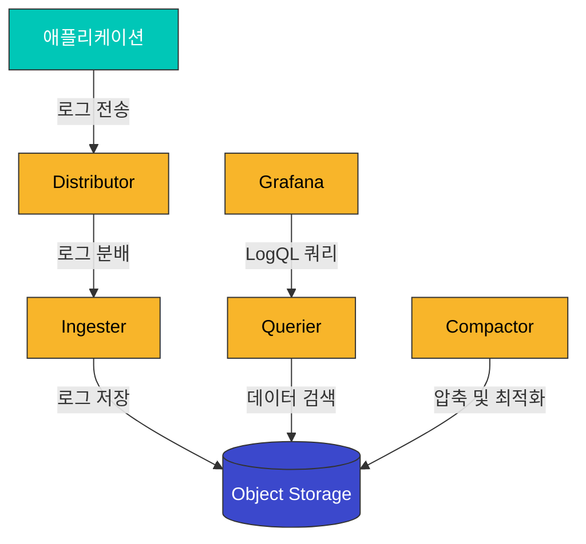
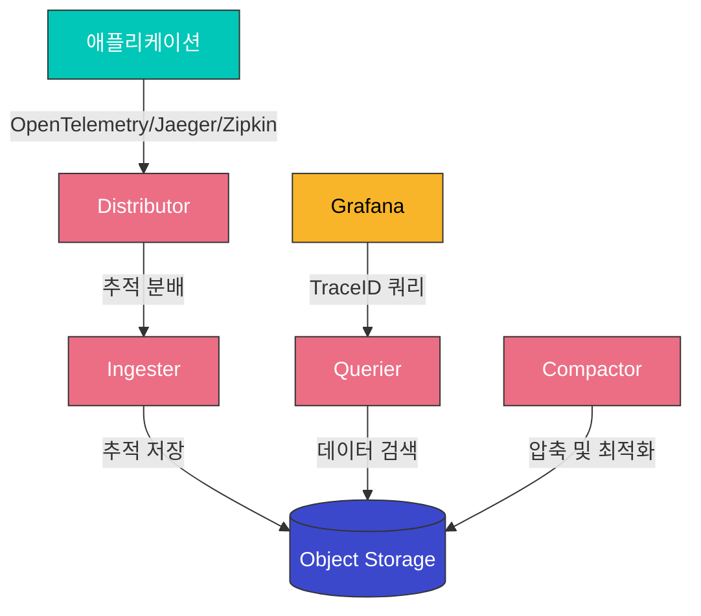
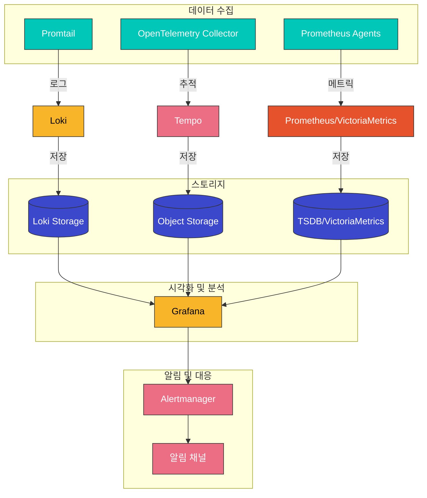

# 로깅 스택 (Loki, Tempo)

Kubernetes 환경에서 효과적인 로깅과 분산 추적은 시스템의 가시성과 문제 해결에 필수적입니다. 이 문서에서는 Grafana Loki를 사용한 로그 관리와 Grafana Tempo를 사용한 분산 추적 시스템 구축에 대해 설명합니다.

## 목차

1. [개요](#개요)
2. [아키텍처](#아키텍처)
3. [설치 및 구성](#설치-및-구성)
4. [로그 수집 및 쿼리](#로그-수집-및-쿼리)
5. [분산 추적](#분산-추적)
6. [Amazon EKS 통합](#amazon-eks-통합)
7. [모범 사례](#모범-사례)
8. [문제 해결](#문제-해결)
9. [결론](#결론)

## 개요

### Grafana Loki

Grafana Loki는 Prometheus에서 영감을 받은 수평적으로 확장 가능한 로그 집계 시스템입니다. Loki는 로그 데이터를 저장하고 쿼리하는 비용 효율적인 방법을 제공합니다. 주요 특징은 다음과 같습니다:

- **레이블 기반 인덱싱**: Prometheus와 유사한 레이블 기반 접근 방식 사용
- **경량 설계**: 로그 콘텐츠 대신 메타데이터만 인덱싱하여 리소스 사용 최소화
- **효율적인 스토리지**: 로그 데이터를 압축하고 청크로 저장하여 스토리지 비용 절감
- **LogQL**: Prometheus PromQL과 유사한 쿼리 언어 제공
- **Grafana 통합**: Grafana와의 원활한 통합으로 시각화 및 알림 기능 제공

### Grafana Tempo

Grafana Tempo는 고성능, 비용 효율적인 분산 추적 백엔드입니다. 주요 특징은 다음과 같습니다:

- **오픈 표준 지원**: OpenTelemetry, Jaeger, Zipkin 등 다양한 추적 프로토콜 지원
- **오브젝트 스토리지 최적화**: 비용 효율적인 스토리지를 위해 오브젝트 스토리지(S3, GCS 등) 사용
- **TraceID 기반 검색**: 인덱싱 없이 TraceID 기반 검색으로 비용 절감
- **Grafana 통합**: Grafana와의 원활한 통합으로 로그, 메트릭, 추적 데이터 연계 분석 가능
- **확장성**: 대규모 환경에서도 수평적으로 확장 가능한 아키텍처

### 로깅 스택의 이점

1. **통합 가시성**: 로그, 메트릭, 추적 데이터를 단일 인터페이스에서 확인
2. **비용 효율성**: 최소한의 인덱싱과 효율적인 스토리지로 비용 절감
3. **확장성**: 대규모 클러스터와 높은 로그 볼륨에도 확장 가능
4. **상관 관계 분석**: 로그, 메트릭, 추적 데이터 간의 상관 관계 분석으로 문제 해결 시간 단축
5. **다양한 데이터 소스 지원**: Kubernetes, 애플리케이션, 인프라 등 다양한 소스의 로그 수집 및 분석

## 아키텍처

### Loki 아키텍처

Loki는 다음과 같은 주요 구성 요소로 이루어져 있습니다:

1. **Distributor**: 클라이언트로부터 로그 스트림을 수신하고 유효성을 검사한 후 인제스터로 전달
2. **Ingester**: 로그 데이터를 메모리에 버퍼링하고 스토리지에 저장
3. **Querier**: 사용자 쿼리를 처리하고 인제스터와 스토리지에서 데이터를 검색
4. **Query Frontend**: 쿼리 최적화, 캐싱, 재시도 등을 처리
5. **Compactor**: 저장된 로그 청크를 압축하고 인덱스를 최적화
6. **Table Manager**: 인덱스 및 청크 테이블 관리
7. **Storage**: 로그 데이터와 인덱스를 저장하는 백엔드 스토리지

### Tempo 아키텍처

Tempo는 다음과 같은 주요 구성 요소로 이루어져 있습니다:

1. **Distributor**: 다양한 형식(Jaeger, Zipkin, OpenTelemetry 등)의 추적 데이터를 수신하고 유효성을 검사
2. **Ingester**: 추적 데이터를 메모리에 버퍼링하고 스토리지에 저장
3. **Querier**: TraceID 기반 쿼리를 처리하고 스토리지에서 데이터를 검색
4. **Compactor**: 저장된 추적 데이터를 압축하고 최적화
5. **Storage**: 추적 데이터를 저장하는 백엔드 스토리지(S3, GCS, Azure Blob 등)

### 통합 로깅 스택 아키텍처

Loki, Tempo, Prometheus를 통합한 완전한 관찰성 스택의 아키텍처는 다음과 같습니다:

### 데이터 흐름

1. **로그 수집 흐름**:
   - Kubernetes 노드에서 Promtail, Fluentd 또는 Fluent Bit가 로그 수집
   - 수집된 로그에 레이블 추가(네임스페이스, 파드, 컨테이너 등)
   - Loki Distributor로 로그 전송
   - Ingester가 로그를 메모리에 버퍼링하고 스토리지에 저장
   - Grafana를 통해 LogQL 쿼리로 로그 검색 및 시각화

2. **추적 수집 흐름**:
   - 애플리케이션에서 OpenTelemetry, Jaeger 또는 Zipkin 클라이언트를 통해 추적 데이터 생성
   - OpenTelemetry Collector가 추적 데이터 수집 및 전처리
   - Tempo Distributor로 추적 데이터 전송
   - Ingester가 추적 데이터를 메모리에 버퍼링하고 오브젝트 스토리지에 저장
   - Grafana를 통해 TraceID 기반으로 추적 데이터 검색 및 시각화

3. **통합 분석 흐름**:
   - Grafana에서 로그, 메트릭, 추적 데이터를 상호 연계하여 분석
   - 로그에서 TraceID를 클릭하여 관련 추적 데이터로 이동
   - 메트릭 대시보드에서 이상 징후 발견 시 관련 로그 및 추적 데이터 확인
   - 통합 알림 설정으로 문제 조기 감지 및 대응

## 퀴즈

이 장에서 배운 내용을 테스트하려면 [주제 퀴즈](../../quizzes/tools/08-logging-stack-quiz.md)를 풀어보세요.
