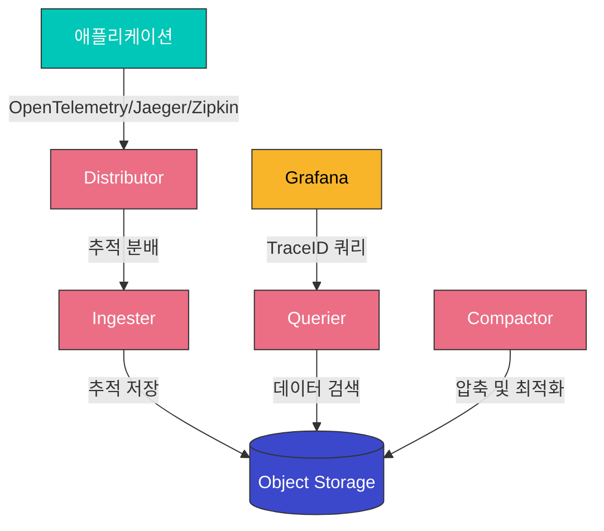
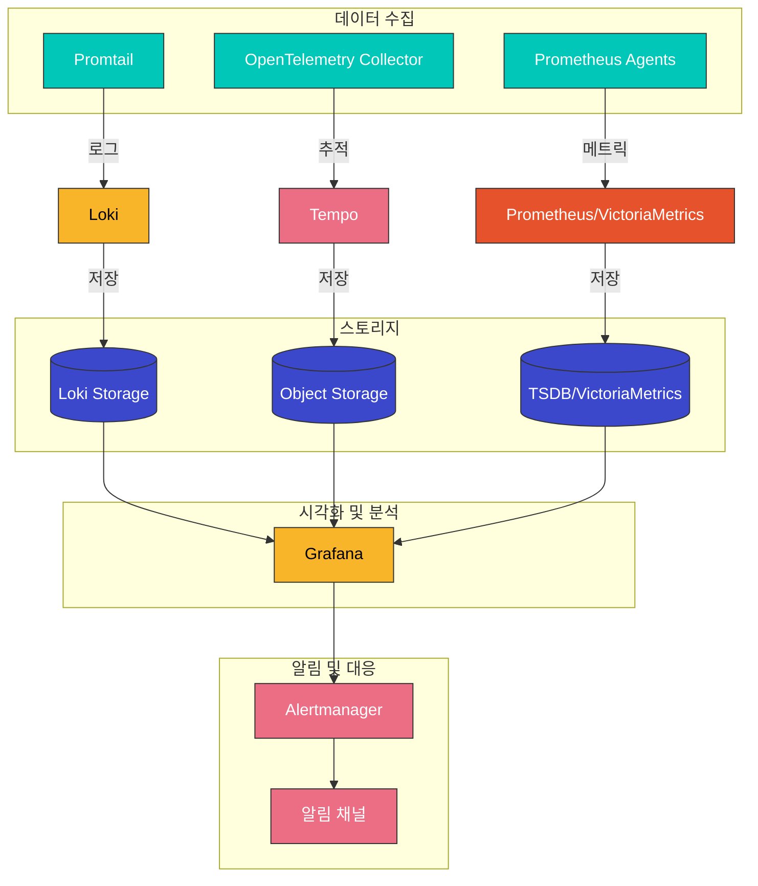

# 로깅 스택 (Loki, Tempo)

Kubernetes 환경에서 효과적인 로깅과 분산 추적은 시스템의 가시성과 문제 해결에 필수적입니다. 이 문서에서는 Grafana Loki를 사용한 로그 관리와 Grafana Tempo를 사용한 분산 추적 시스템 구축에 대해 설명합니다.

## 목차

1. [개요](#개요)
2. [아키텍처](#아키텍처)
3. [설치 및 구성](#설치-및-구성)
4. [로그 수집 및 쿼리](#로그-수집-및-쿼리)
5. [분산 추적](#분산-추적)
6. [Amazon EKS 통합](#amazon-eks-통합)
7. [모범 사례](#모범-사례)
8. [문제 해결](#문제-해결)
9. [결론](#결론)

## 개요

### Grafana Loki

Grafana Loki는 Prometheus에서 영감을 받은 수평적으로 확장 가능한 로그 집계 시스템입니다. Loki는 로그 데이터를 저장하고 쿼리하는 비용 효율적인 방법을 제공합니다. 주요 특징은 다음과 같습니다:

- **레이블 기반 인덱싱**: Prometheus와 유사한 레이블 기반 접근 방식 사용
- **경량 설계**: 로그 콘텐츠 대신 메타데이터만 인덱싱하여 리소스 사용 최소화
- **효율적인 스토리지**: 로그 데이터를 압축하고 청크로 저장하여 스토리지 비용 절감
- **LogQL**: Prometheus PromQL과 유사한 쿼리 언어 제공
- **Grafana 통합**: Grafana와의 원활한 통합으로 시각화 및 알림 기능 제공

### Grafana Tempo

Grafana Tempo는 고성능, 비용 효율적인 분산 추적 백엔드입니다. 주요 특징은 다음과 같습니다:

- **오픈 표준 지원**: OpenTelemetry, Jaeger, Zipkin 등 다양한 추적 프로토콜 지원
- **오브젝트 스토리지 최적화**: 비용 효율적인 스토리지를 위해 오브젝트 스토리지(S3, GCS 등) 사용
- **TraceID 기반 검색**: 인덱싱 없이 TraceID 기반 검색으로 비용 절감
- **Grafana 통합**: Grafana와의 원활한 통합으로 로그, 메트릭, 추적 데이터 연계 분석 가능
- **확장성**: 대규모 환경에서도 수평적으로 확장 가능한 아키텍처

### 로깅 스택의 이점

1. **통합 가시성**: 로그, 메트릭, 추적 데이터를 단일 인터페이스에서 확인
2. **비용 효율성**: 최소한의 인덱싱과 효율적인 스토리지로 비용 절감
3. **확장성**: 대규모 클러스터와 높은 로그 볼륨에도 확장 가능
4. **상관 관계 분석**: 로그, 메트릭, 추적 데이터 간의 상관 관계 분석으로 문제 해결 시간 단축
5. **다양한 데이터 소스 지원**: Kubernetes, 애플리케이션, 인프라 등 다양한 소스의 로그 수집 및 분석

## 아키텍처

### Loki 아키텍처

Loki는 다음과 같은 주요 구성 요소로 이루어져 있습니다:

1. **Distributor**: 클라이언트로부터 로그 스트림을 수신하고 유효성을 검사한 후 인제스터로 전달
2. **Ingester**: 로그 데이터를 메모리에 버퍼링하고 스토리지에 저장
3. **Querier**: 사용자 쿼리를 처리하고 인제스터와 스토리지에서 데이터를 검색
4. **Query Frontend**: 쿼리 최적화, 캐싱, 재시도 등을 처리
5. **Compactor**: 저장된 로그 청크를 압축하고 인덱스를 최적화
6. **Table Manager**: 인덱스 및 청크 테이블 관리
7. **Storage**: 로그 데이터와 인덱스를 저장하는 백엔드 스토리지




### Tempo 아키텍처

Tempo는 다음과 같은 주요 구성 요소로 이루어져 있습니다:

1. **Distributor**: 다양한 형식(Jaeger, Zipkin, OpenTelemetry 등)의 추적 데이터를 수신하고 유효성을 검사
2. **Ingester**: 추적 데이터를 메모리에 버퍼링하고 스토리지에 저장
3. **Querier**: TraceID 기반 쿼리를 처리하고 스토리지에서 데이터를 검색
4. **Compactor**: 저장된 추적 데이터를 압축하고 최적화
5. **Storage**: 추적 데이터를 저장하는 백엔드 스토리지(S3, GCS, Azure Blob 등)


### 통합 로깅 스택 아키텍처

Loki, Tempo, Prometheus를 통합한 완전한 관찰성 스택의 아키텍처는 다음과 같습니다:



### 데이터 흐름

1. **로그 수집 흐름**:
   - Kubernetes 노드에서 Promtail, Fluentd 또는 Fluent Bit가 로그 수집
   - 수집된 로그에 레이블 추가(네임스페이스, 파드, 컨테이너 등)
   - Loki Distributor로 로그 전송
   - Ingester가 로그를 메모리에 버퍼링하고 스토리지에 저장
   - Grafana를 통해 LogQL 쿼리로 로그 검색 및 시각화

2. **추적 수집 흐름**:
   - 애플리케이션에서 OpenTelemetry, Jaeger 또는 Zipkin 클라이언트를 통해 추적 데이터 생성
   - OpenTelemetry Collector가 추적 데이터 수집 및 전처리
   - Tempo Distributor로 추적 데이터 전송
   - Ingester가 추적 데이터를 메모리에 버퍼링하고 오브젝트 스토리지에 저장
   - Grafana를 통해 TraceID 기반으로 추적 데이터 검색 및 시각화

3. **통합 분석 흐름**:
   - Grafana에서 로그, 메트릭, 추적 데이터를 상호 연계하여 분석
   - 로그에서 TraceID를 클릭하여 관련 추적 데이터로 이동
   - 메트릭 대시보드에서 이상 징후 발견 시 관련 로그 및 추적 데이터 확인
   - 통합 알림 설정으로 문제 조기 감지 및 대응
## 설치 및 구성

### 사전 요구 사항

- Kubernetes 클러스터 (v1.16 이상)
- kubectl 설정
- Helm 3
- 충분한 클러스터 리소스 (CPU, 메모리, 스토리지)
- 이전에 설치한 Prometheus 및 Grafana (선택 사항이지만 권장)

### Helm을 사용한 설치

#### 1. Loki 설치

```bash
# Grafana Helm 저장소 추가
helm repo add grafana https://grafana.github.io/helm-charts
helm repo update

# Loki 설치 (단일 바이너리 모드)
helm install loki grafana/loki \
  --namespace monitoring \
  --create-namespace \
  --set loki.auth_enabled=false \
  --set loki.persistence.enabled=true \
  --set loki.persistence.size=10Gi \
  --set loki.persistence.storageClassName=standard
```

#### 2. Promtail 설치

Promtail은 Kubernetes 노드에서 로그를 수집하여 Loki로 전송하는 에이전트입니다.

```bash
# Promtail 설치
helm install promtail grafana/promtail \
  --namespace monitoring \
  --set config.lokiAddress=http://loki:3100/loki/api/v1/push \
  --set config.snippets.pipelineStages[0].cri={} \
  --set config.snippets.scrapeConfigs[0].job_name=kubernetes-pods-name \
  --set config.snippets.scrapeConfigs[0].kubernetes_sd_configs[0].role=pod
```

#### 3. Tempo 설치

```bash
# Tempo 설치 (단일 바이너리 모드)
helm install tempo grafana/tempo \
  --namespace monitoring \
  --set tempo.persistence.enabled=true \
  --set tempo.persistence.size=10Gi \
  --set tempo.persistence.storageClassName=standard \
  --set tempo.receivers.jaeger.protocols.grpc.endpoint=0.0.0.0:14250 \
  --set tempo.receivers.jaeger.protocols.thrift_http.endpoint=0.0.0.0:14268 \
  --set tempo.receivers.zipkin.endpoint=0.0.0.0:9411 \
  --set tempo.receivers.otlp.protocols.grpc.endpoint=0.0.0.0:4317 \
  --set tempo.receivers.otlp.protocols.http.endpoint=0.0.0.0:4318
```

#### 4. OpenTelemetry Collector 설치

OpenTelemetry Collector는 다양한 형식의 추적 데이터를 수집하여 Tempo로 전송합니다.

```bash
# OpenTelemetry Operator 설치
kubectl apply -f https://github.com/open-telemetry/opentelemetry-operator/releases/latest/download/opentelemetry-operator.yaml

# OpenTelemetry Collector 설치
cat <<EOF | kubectl apply -f -
apiVersion: opentelemetry.io/v1alpha1
kind: OpenTelemetryCollector
metadata:
  name: otel-collector
  namespace: monitoring
spec:
  mode: deployment
  config: |
    receivers:
      otlp:
        protocols:
          grpc:
            endpoint: 0.0.0.0:4317
          http:
            endpoint: 0.0.0.0:4318
      jaeger:
        protocols:
          grpc:
            endpoint: 0.0.0.0:14250
          thrift_http:
            endpoint: 0.0.0.0:14268
      zipkin:
        endpoint: 0.0.0.0:9411

    processors:
      batch:
        timeout: 1s
        send_batch_size: 1024

    exporters:
      otlp:
        endpoint: tempo:4317
        tls:
          insecure: true
      logging:
        verbosity: detailed

    service:
      pipelines:
        traces:
          receivers: [otlp, jaeger, zipkin]
          processors: [batch]
          exporters: [otlp, logging]
EOF
```

#### 5. Grafana 데이터 소스 구성

Loki와 Tempo를 Grafana 데이터 소스로 추가합니다.

```bash
# Grafana 데이터 소스 구성
cat <<EOF | kubectl apply -f -
apiVersion: v1
kind: ConfigMap
metadata:
  name: grafana-datasources
  namespace: monitoring
  labels:
    grafana_datasource: "1"
data:
  datasources.yaml: |
    apiVersion: 1
    datasources:
    - name: Loki
      type: loki
      url: http://loki:3100
      access: proxy
      isDefault: false
      version: 1
    - name: Tempo
      type: tempo
      url: http://tempo:3100
      access: proxy
      isDefault: false
      version: 1
      uid: tempo
      jsonData:
        httpMethod: GET
        tracesToLogs:
          datasourceUid: loki
          tags: ['instance', 'pod', 'namespace']
          mappedTags: [{ key: 'service.name', value: 'service' }]
          mapTagNamesEnabled: false
          spanStartTimeShift: '-1h'
          spanEndTimeShift: '1h'
          filterByTraceID: true
          filterBySpanID: false
EOF
```

### 매니페스트를 사용한 설치

#### 1. 네임스페이스 생성

```yaml
apiVersion: v1
kind: Namespace
metadata:
  name: monitoring
```

#### 2. Loki 설치

```yaml
apiVersion: apps/v1
kind: StatefulSet
metadata:
  name: loki
  namespace: monitoring
spec:
  serviceName: "loki"
  replicas: 1
  selector:
    matchLabels:
      app: loki
  template:
    metadata:
      labels:
        app: loki
    spec:
      containers:
      - name: loki
        image: grafana/loki:2.8.0
        args:
          - "-config.file=/etc/loki/loki-config.yaml"
        ports:
        - containerPort: 3100
          name: http
        volumeMounts:
        - name: config
          mountPath: /etc/loki
        - name: storage
          mountPath: /data
        resources:
          requests:
            cpu: 200m
            memory: 256Mi
          limits:
            cpu: 1000m
            memory: 1Gi
      volumes:
      - name: config
        configMap:
          name: loki-config
  volumeClaimTemplates:
  - metadata:
      name: storage
    spec:
      accessModes: [ "ReadWriteOnce" ]
      storageClassName: standard
      resources:
        requests:
          storage: 10Gi
---
apiVersion: v1
kind: ConfigMap
metadata:
  name: loki-config
  namespace: monitoring
data:
  loki-config.yaml: |
    auth_enabled: false
    
    server:
      http_listen_port: 3100
      
    ingester:
      lifecycler:
        address: 127.0.0.1
        ring:
          kvstore:
            store: inmemory
          replication_factor: 1
        final_sleep: 0s
      chunk_idle_period: 5m
      chunk_retain_period: 30s
      
    schema_config:
      configs:
      - from: 2020-05-15
        store: boltdb-shipper
        object_store: filesystem
        schema: v11
        index:
          prefix: index_
          period: 24h
          
    storage_config:
      boltdb_shipper:
        active_index_directory: /data/loki/index
        cache_location: /data/loki/index_cache
        cache_ttl: 24h
        shared_store: filesystem
      filesystem:
        directory: /data/loki/chunks
        
    limits_config:
      enforce_metric_name: false
      reject_old_samples: true
      reject_old_samples_max_age: 168h
      
    chunk_store_config:
      max_look_back_period: 0s
      
    table_manager:
      retention_deletes_enabled: false
      retention_period: 0s
      
    compactor:
      working_directory: /data/loki/compactor
      shared_store: filesystem
---
apiVersion: v1
kind: Service
metadata:
  name: loki
  namespace: monitoring
spec:
  ports:
  - port: 3100
    protocol: TCP
    targetPort: 3100
  selector:
    app: loki
```

#### 3. Promtail 설치

```yaml
apiVersion: apps/v1
kind: DaemonSet
metadata:
  name: promtail
  namespace: monitoring
spec:
  selector:
    matchLabels:
      app: promtail
  template:
    metadata:
      labels:
        app: promtail
    spec:
      serviceAccount: promtail
      containers:
      - name: promtail
        image: grafana/promtail:2.8.0
        args:
        - "-config.file=/etc/promtail/promtail-config.yaml"
        volumeMounts:
        - name: config
          mountPath: /etc/promtail
        - name: run
          mountPath: /run/promtail
        - name: containers
          mountPath: /var/lib/docker/containers
          readOnly: true
        - name: pods
          mountPath: /var/log/pods
          readOnly: true
        resources:
          requests:
            cpu: 100m
            memory: 128Mi
          limits:
            cpu: 200m
            memory: 256Mi
      volumes:
      - name: config
        configMap:
          name: promtail-config
      - name: run
        hostPath:
          path: /run/promtail
      - name: containers
        hostPath:
          path: /var/lib/docker/containers
      - name: pods
        hostPath:
          path: /var/log/pods
---
apiVersion: v1
kind: ConfigMap
metadata:
  name: promtail-config
  namespace: monitoring
data:
  promtail-config.yaml: |
    server:
      http_listen_port: 9080
      grpc_listen_port: 0
    
    positions:
      filename: /run/promtail/positions.yaml
    
    clients:
      - url: http://loki:3100/loki/api/v1/push
    
    scrape_configs:
    - job_name: kubernetes-pods
      kubernetes_sd_configs:
      - role: pod
      relabel_configs:
      - source_labels: [__meta_kubernetes_pod_controller_name]
        regex: ([0-9a-z-.]+?)(-[0-9a-f]{8,10})?
        action: replace
        target_label: __tmp_controller_name
      - source_labels: [__meta_kubernetes_pod_label_app_kubernetes_io_name, __meta_kubernetes_pod_label_app, __tmp_controller_name, __meta_kubernetes_pod_name]
        regex: ^;*([^;]+)(;.*)?$
        action: replace
        target_label: app
      - source_labels: [__meta_kubernetes_pod_label_app_kubernetes_io_component, __meta_kubernetes_pod_label_component]
        regex: ^;*([^;]+)(;.*)?$
        action: replace
        target_label: component
      - action: replace
        source_labels:
        - __meta_kubernetes_pod_node_name
        target_label: node_name
      - action: replace
        source_labels:
        - __meta_kubernetes_namespace
        target_label: namespace
      - action: replace
        replacement: $1
        separator: /
        source_labels:
        - namespace
        - app
        target_label: job
      - action: replace
        source_labels:
        - __meta_kubernetes_pod_name
        target_label: pod
      - action: replace
        source_labels:
        - __meta_kubernetes_pod_container_name
        target_label: container
      - action: replace
        replacement: /var/log/pods/*$1/*.log
        separator: /
        source_labels:
        - __meta_kubernetes_pod_uid
        - __meta_kubernetes_pod_container_name
        target_label: __path__
      - action: replace
        regex: true/(.*)
        replacement: /var/log/pods/*$1/*.log
        separator: /
        source_labels:
        - __meta_kubernetes_pod_annotationpresent_kubernetes_io_config_hash
        - __meta_kubernetes_pod_annotation_kubernetes_io_config_hash
        - __meta_kubernetes_pod_container_name
        target_label: __path__
---
apiVersion: v1
kind: ServiceAccount
metadata:
  name: promtail
  namespace: monitoring
---
apiVersion: rbac.authorization.k8s.io/v1
kind: ClusterRole
metadata:
  name: promtail
rules:
- apiGroups: [""]
  resources:
  - nodes
  - nodes/proxy
  - services
  - endpoints
  - pods
  verbs: ["get", "watch", "list"]
---
apiVersion: rbac.authorization.k8s.io/v1
kind: ClusterRoleBinding
metadata:
  name: promtail
roleRef:
  apiGroup: rbac.authorization.k8s.io
  kind: ClusterRole
  name: promtail
subjects:
- kind: ServiceAccount
  name: promtail
  namespace: monitoring
```

#### 4. Tempo 설치

```yaml
apiVersion: apps/v1
kind: StatefulSet
metadata:
  name: tempo
  namespace: monitoring
spec:
  serviceName: "tempo"
  replicas: 1
  selector:
    matchLabels:
      app: tempo
  template:
    metadata:
      labels:
        app: tempo
    spec:
      containers:
      - name: tempo
        image: grafana/tempo:2.1.0
        args:
          - "-config.file=/etc/tempo/tempo-config.yaml"
        ports:
        - containerPort: 3100
          name: http
        - containerPort: 4317
          name: otlp-grpc
        - containerPort: 4318
          name: otlp-http
        - containerPort: 9411
          name: zipkin
        - containerPort: 14250
          name: jaeger-grpc
        - containerPort: 14268
          name: jaeger-http
        volumeMounts:
        - name: config
          mountPath: /etc/tempo
        - name: storage
          mountPath: /data
        resources:
          requests:
            cpu: 200m
            memory: 512Mi
          limits:
            cpu: 1000m
            memory: 2Gi
      volumes:
      - name: config
        configMap:
          name: tempo-config
  volumeClaimTemplates:
  - metadata:
      name: storage
    spec:
      accessModes: [ "ReadWriteOnce" ]
      storageClassName: standard
      resources:
        requests:
          storage: 10Gi
---
apiVersion: v1
kind: ConfigMap
metadata:
  name: tempo-config
  namespace: monitoring
data:
  tempo-config.yaml: |
    server:
      http_listen_port: 3100
    
    distributor:
      receivers:
        jaeger:
          protocols:
            grpc:
              endpoint: 0.0.0.0:14250
            thrift_http:
              endpoint: 0.0.0.0:14268
        zipkin:
          endpoint: 0.0.0.0:9411
        otlp:
          protocols:
            grpc:
              endpoint: 0.0.0.0:4317
            http:
              endpoint: 0.0.0.0:4318
    
    ingester:
      max_block_duration: 5m
    
    compactor:
      compaction:
        block_retention: 48h
    
    storage:
      trace:
        backend: local
        local:
          path: /data/tempo
        pool:
          max_workers: 100
          queue_depth: 10000
---
apiVersion: v1
kind: Service
metadata:
  name: tempo
  namespace: monitoring
spec:
  ports:
  - port: 3100
    protocol: TCP
    targetPort: 3100
    name: http
  - port: 4317
    protocol: TCP
    targetPort: 4317
    name: otlp-grpc
  - port: 4318
    protocol: TCP
    targetPort: 4318
    name: otlp-http
  - port: 9411
    protocol: TCP
    targetPort: 9411
    name: zipkin
  - port: 14250
    protocol: TCP
    targetPort: 14250
    name: jaeger-grpc
  - port: 14268
    protocol: TCP
    targetPort: 14268
    name: jaeger-http
  selector:
    app: tempo
```

#### 5. OpenTelemetry Collector 설치

```yaml
apiVersion: v1
kind: ServiceAccount
metadata:
  name: otel-collector
  namespace: monitoring
---
apiVersion: rbac.authorization.k8s.io/v1
kind: ClusterRole
metadata:
  name: otel-collector
rules:
- apiGroups: [""]
  resources:
  - nodes
  - nodes/proxy
  - services
  - endpoints
  - pods
  verbs: ["get", "watch", "list"]
---
apiVersion: rbac.authorization.k8s.io/v1
kind: ClusterRoleBinding
metadata:
  name: otel-collector
roleRef:
  apiGroup: rbac.authorization.k8s.io
  kind: ClusterRole
  name: otel-collector
subjects:
- kind: ServiceAccount
  name: otel-collector
  namespace: monitoring
---
apiVersion: v1
kind: ConfigMap
metadata:
  name: otel-collector-config
  namespace: monitoring
data:
  otel-collector-config.yaml: |
    receivers:
      otlp:
        protocols:
          grpc:
            endpoint: 0.0.0.0:4317
          http:
            endpoint: 0.0.0.0:4318
      jaeger:
        protocols:
          grpc:
            endpoint: 0.0.0.0:14250
          thrift_http:
            endpoint: 0.0.0.0:14268
      zipkin:
        endpoint: 0.0.0.0:9411

    processors:
      batch:
        timeout: 1s
        send_batch_size: 1024
      memory_limiter:
        check_interval: 1s
        limit_mib: 1000
      k8s_attributes:
        auth_type: serviceAccount
        passthrough: false
        extract:
          metadata:
            - k8s.namespace.name
            - k8s.pod.name
            - k8s.deployment.name
            - k8s.statefulset.name
            - k8s.daemonset.name
            - k8s.cronjob.name
            - k8s.job.name
          annotations:
            - tag_name: app
              key: app
            - tag_name: component
              key: component

    exporters:
      otlp:
        endpoint: tempo:4317
        tls:
          insecure: true
      logging:
        verbosity: detailed

    service:
      pipelines:
        traces:
          receivers: [otlp, jaeger, zipkin]
          processors: [memory_limiter, k8s_attributes, batch]
          exporters: [otlp, logging]
---
apiVersion: apps/v1
kind: Deployment
metadata:
  name: otel-collector
  namespace: monitoring
spec:
  selector:
    matchLabels:
      app: otel-collector
  template:
    metadata:
      labels:
        app: otel-collector
    spec:
      serviceAccountName: otel-collector
      containers:
      - name: otel-collector
        image: otel/opentelemetry-collector-contrib:0.80.0
        args:
        - "--config=/conf/otel-collector-config.yaml"
        ports:
        - containerPort: 4317
          name: otlp-grpc
        - containerPort: 4318
          name: otlp-http
        - containerPort: 9411
          name: zipkin
        - containerPort: 14250
          name: jaeger-grpc
        - containerPort: 14268
          name: jaeger-http
        volumeMounts:
        - name: config
          mountPath: /conf
        resources:
          requests:
            cpu: 200m
            memory: 400Mi
          limits:
            cpu: 1
            memory: 1Gi
      volumes:
      - name: config
        configMap:
          name: otel-collector-config
---
apiVersion: v1
kind: Service
metadata:
  name: otel-collector
  namespace: monitoring
spec:
  ports:
  - port: 4317
    protocol: TCP
    targetPort: 4317
    name: otlp-grpc
  - port: 4318
    protocol: TCP
    targetPort: 4318
    name: otlp-http
  - port: 9411
    protocol: TCP
    targetPort: 9411
    name: zipkin
  - port: 14250
    protocol: TCP
    targetPort: 14250
    name: jaeger-grpc
  - port: 14268
    protocol: TCP
    targetPort: 14268
    name: jaeger-http
  selector:
    app: otel-collector
```
## 로그 수집 및 쿼리

### 로그 수집 구성

#### Promtail 구성

Promtail은 Kubernetes 노드에서 로그를 수집하여 Loki로 전송하는 에이전트입니다. 다음은 주요 구성 옵션입니다:

1. **레이블 추가**: 로그에 유용한 레이블 추가

```yaml
scrape_configs:
- job_name: kubernetes-pods
  kubernetes_sd_configs:
  - role: pod
  relabel_configs:
  - source_labels: [__meta_kubernetes_namespace]
    target_label: namespace
  - source_labels: [__meta_kubernetes_pod_name]
    target_label: pod
  - source_labels: [__meta_kubernetes_pod_container_name]
    target_label: container
  - source_labels: [__meta_kubernetes_pod_label_app]
    target_label: app
  - source_labels: [__meta_kubernetes_pod_node_name]
    target_label: node
```

2. **파이프라인 스테이지**: 로그 처리 및 변환

```yaml
scrape_configs:
- job_name: kubernetes-pods
  pipeline_stages:
    - cri: {}
    - json:
        expressions:
          level: level
          timestamp: timestamp
          message: message
    - labels:
        level:
    - timestamp:
        source: timestamp
        format: RFC3339Nano
    - output:
        source: message
```

3. **멀티라인 처리**: 스택 트레이스와 같은 멀티라인 로그 처리

```yaml
scrape_configs:
- job_name: kubernetes-pods
  pipeline_stages:
    - multiline:
        firstline: '^\d{4}-\d{2}-\d{2} \d{2}:\d{2}:\d{2}.\d{3}'
        max_wait_time: 3s
```

#### Fluent Bit 구성

Fluent Bit는 Promtail의 대안으로 사용할 수 있는 경량 로그 수집기입니다.

```yaml
apiVersion: v1
kind: ConfigMap
metadata:
  name: fluent-bit-config
  namespace: monitoring
data:
  fluent-bit.conf: |
    [SERVICE]
        Flush         1
        Log_Level     info
        Daemon        off
        Parsers_File  parsers.conf

    [INPUT]
        Name              tail
        Tag               kube.*
        Path              /var/log/containers/*.log
        Parser            docker
        DB                /var/log/flb_kube.db
        Mem_Buf_Limit     5MB
        Skip_Long_Lines   On
        Refresh_Interval  10

    [FILTER]
        Name                kubernetes
        Match               kube.*
        Kube_URL            https://kubernetes.default.svc:443
        Kube_CA_File        /var/run/secrets/kubernetes.io/serviceaccount/ca.crt
        Kube_Token_File     /var/run/secrets/kubernetes.io/serviceaccount/token
        Merge_Log           On
        K8S-Logging.Parser  On
        K8S-Logging.Exclude Off

    [OUTPUT]
        Name        loki
        Match       *
        Host        loki
        Port        3100
        Labels      job=fluentbit, namespace=$kubernetes['namespace_name'], pod=$kubernetes['pod_name'], container=$kubernetes['container_name']
        Label_Keys  $kubernetes['labels']['app']
        Line_Format json
```

### LogQL 쿼리 언어

LogQL은 Loki의 쿼리 언어로, Prometheus의 PromQL과 유사한 구문을 사용합니다. LogQL은 두 부분으로 구성됩니다:

1. **로그 스트림 선택기**: 레이블을 기반으로 로그 스트림을 필터링
2. **로그 파이프라인**: 선택된 로그 스트림에서 로그 라인을 필터링하고 처리

#### 기본 쿼리 예제

1. **네임스페이스별 로그 조회**:

```
{namespace="monitoring"}
```

2. **특정 파드의 로그 조회**:

```
{namespace="monitoring", pod=~"prometheus.*"}
```

3. **텍스트 검색**:

```
{namespace="monitoring"} |= "error"
```

4. **정규식 필터링**:

```
{namespace="monitoring"} |~ "error|warning" !~ "timeout"
```

5. **JSON 로그 파싱 및 필터링**:

```
{namespace="monitoring"} | json | level="error"
```

6. **로그 라인 수 계산**:

```
sum(count_over_time({namespace="monitoring"} |= "error"[5m])) by (pod)
```

7. **로그 볼륨 시각화**:

```
rate({namespace="monitoring"}[5m])
```

#### 고급 쿼리 예제

1. **JSON 로그에서 특정 필드 추출**:

```
{namespace="monitoring"} | json | line_format "{{.level}} - {{.message}}"
```

2. **로그 라인 그룹화 및 집계**:

```
sum by (pod) (rate({namespace="monitoring"} | json | level="error" [5m]))
```

3. **패턴 추출 및 필터링**:

```
{namespace="monitoring"} | pattern "<_> - <method> <status> <_>" | status=~"5.."
```

4. **로그 지연 시간 분석**:

```
{namespace="monitoring"} | json | unwrap duration | histogram_quantile(0.95, sum by (le) (rate(duration_bucket[5m])))
```

5. **특정 시간 범위의 로그 조회**:

```
{namespace="monitoring"} | json
  | timestamp > "2023-01-01T00:00:00Z"
  | timestamp < "2023-01-02T00:00:00Z"
```

### Grafana에서 로그 시각화

#### 1. 로그 탐색

Grafana의 Explore 탭에서 Loki 데이터 소스를 선택하고 LogQL 쿼리를 실행하여 로그를 탐색할 수 있습니다.

1. Grafana에 로그인
2. 왼쪽 메뉴에서 "Explore" 선택
3. 데이터 소스로 "Loki" 선택
4. 레이블 선택기를 사용하여 로그 스트림 필터링
5. 로그 파이프라인 추가하여 로그 라인 필터링 및 처리

#### 2. 로그 패널 대시보드

Grafana 대시보드에 로그 패널을 추가하여 메트릭과 함께 로그를 시각화할 수 있습니다.

1. 대시보드 생성 또는 편집
2. "Add panel" 클릭
3. 데이터 소스로 "Loki" 선택
4. LogQL 쿼리 입력
5. 시각화 유형으로 "Logs" 선택

#### 3. 로그 볼륨 시각화

로그 볼륨을 시간에 따라 시각화하여 이상 징후를 감지할 수 있습니다.

```
sum(rate({namespace="monitoring"}[5m])) by (pod)
```

#### 4. 로그 패턴 분석

Grafana의 로그 패턴 기능을 사용하여 유사한 로그 메시지를 그룹화하고 분석할 수 있습니다.

1. 로그 탐색 뷰에서 로그 쿼리 실행
2. "Logs" 탭에서 "Patterns" 버튼 클릭
3. 패턴별로 그룹화된 로그 메시지 확인

#### 5. 로그와 메트릭 상관 관계 분석

Grafana에서 로그와 메트릭을 함께 시각화하여 상관 관계를 분석할 수 있습니다.

1. 분할 뷰 사용하여 한쪽에는 메트릭, 다른 쪽에는 로그 표시
2. 시간 범위 동기화하여 특정 이벤트 전후의 로그와 메트릭 확인
3. 대시보드에 로그 패널과 메트릭 패널을 함께 배치

## 분산 추적

### OpenTelemetry 통합

#### 1. OpenTelemetry 개요

OpenTelemetry는 분산 추적, 메트릭, 로그를 위한 오픈 소스 관찰성 프레임워크입니다. 주요 구성 요소는 다음과 같습니다:

- **API**: 계측 코드를 작성하기 위한 인터페이스
- **SDK**: API의 구현체
- **Collector**: 다양한 형식의 원격 측정 데이터를 수집, 처리, 내보내는 도구

#### 2. 애플리케이션 계측

##### Java 애플리케이션 계측

Maven 의존성 추가:

```xml
<dependency>
    <groupId>io.opentelemetry</groupId>
    <artifactId>opentelemetry-api</artifactId>
    <version>1.24.0</version>
</dependency>
<dependency>
    <groupId>io.opentelemetry</groupId>
    <artifactId>opentelemetry-sdk</artifactId>
    <version>1.24.0</version>
</dependency>
<dependency>
    <groupId>io.opentelemetry</groupId>
    <artifactId>opentelemetry-exporter-otlp</artifactId>
    <version>1.24.0</version>
</dependency>
```

Java 코드 예제:

```java
import io.opentelemetry.api.GlobalOpenTelemetry;
import io.opentelemetry.api.trace.Span;
import io.opentelemetry.api.trace.Tracer;
import io.opentelemetry.context.Scope;

public class TracingExample {
    private static final Tracer tracer = GlobalOpenTelemetry.getTracer("my-service");
    
    public void processRequest() {
        Span span = tracer.spanBuilder("processRequest").startSpan();
        try (Scope scope = span.makeCurrent()) {
            // 비즈니스 로직
            doSomething();
        } finally {
            span.end();
        }
    }
    
    private void doSomething() {
        Span span = tracer.spanBuilder("doSomething").startSpan();
        try (Scope scope = span.makeCurrent()) {
            // 작업 수행
            span.setAttribute("key", "value");
            // 오류 발생 시
            // span.recordException(exception);
        } finally {
            span.end();
        }
    }
}
```

##### Python 애플리케이션 계측

패키지 설치:

```bash
pip install opentelemetry-api opentelemetry-sdk opentelemetry-exporter-otlp
```

Python 코드 예제:

```python
from opentelemetry import trace
from opentelemetry.sdk.trace import TracerProvider
from opentelemetry.sdk.trace.export import BatchSpanProcessor
from opentelemetry.exporter.otlp.proto.grpc.trace_exporter import OTLPSpanExporter
from opentelemetry.sdk.resources import SERVICE_NAME, Resource

# 추적 공급자 설정
resource = Resource(attributes={SERVICE_NAME: "my-service"})
trace.set_tracer_provider(TracerProvider(resource=resource))

# OTLP 내보내기 설정
otlp_exporter = OTLPSpanExporter(endpoint="otel-collector:4317", insecure=True)
span_processor = BatchSpanProcessor(otlp_exporter)
trace.get_tracer_provider().add_span_processor(span_processor)

tracer = trace.get_tracer(__name__)

def process_request():
    with tracer.start_as_current_span("processRequest") as span:
        # 비즈니스 로직
        do_something()

def do_something():
    with tracer.start_as_current_span("doSomething") as span:
        # 작업 수행
        span.set_attribute("key", "value")
        # 오류 발생 시
        # span.record_exception(exception)
```

##### Node.js 애플리케이션 계측

패키지 설치:

```bash
npm install @opentelemetry/api @opentelemetry/sdk-node @opentelemetry/exporter-trace-otlp-proto
```

Node.js 코드 예제:

```javascript
const { NodeTracerProvider } = require('@opentelemetry/sdk-node');
const { Resource } = require('@opentelemetry/resources');
const { SemanticResourceAttributes } = require('@opentelemetry/semantic-conventions');
const { BatchSpanProcessor } = require('@opentelemetry/sdk-trace-base');
const { OTLPTraceExporter } = require('@opentelemetry/exporter-trace-otlp-proto');
const { trace } = require('@opentelemetry/api');

// 추적 공급자 설정
const provider = new NodeTracerProvider({
  resource: new Resource({
    [SemanticResourceAttributes.SERVICE_NAME]: 'my-service',
  }),
});

// OTLP 내보내기 설정
const exporter = new OTLPTraceExporter({
  url: 'http://otel-collector:4318/v1/traces',
});
provider.addSpanProcessor(new BatchSpanProcessor(exporter));
provider.register();

const tracer = trace.getTracer('my-service');

async function processRequest() {
  const span = tracer.startSpan('processRequest');
  try {
    // 비즈니스 로직
    await doSomething();
  } catch (error) {
    span.recordException(error);
  } finally {
    span.end();
  }
}

async function doSomething() {
  const span = tracer.startSpan('doSomething');
  try {
    // 작업 수행
    span.setAttribute('key', 'value');
  } catch (error) {
    span.recordException(error);
  } finally {
    span.end();
  }
}
```

#### 3. 자동 계측

많은 프로그래밍 언어와 프레임워크는 자동 계측을 지원합니다. 이를 통해 코드 변경 없이 분산 추적을 활성화할 수 있습니다.

##### Java 자동 계측

Java 애플리케이션 시작 시 자바 에이전트 추가:

```bash
java -javaagent:opentelemetry-javaagent.jar \
     -Dotel.service.name=my-service \
     -Dotel.traces.exporter=otlp \
     -Dotel.exporter.otlp.endpoint=http://otel-collector:4317 \
     -jar myapp.jar
```

##### Python 자동 계측

```python
from opentelemetry.instrumentation.flask import FlaskInstrumentor
from flask import Flask

app = Flask(__name__)
FlaskInstrumentor().instrument_app(app)

@app.route('/')
def hello():
    return 'Hello, World!'
```

##### Node.js 자동 계측

```javascript
// tracing.js - 애플리케이션 시작 전에 로드
const { NodeSDK } = require('@opentelemetry/sdk-node');
const { getNodeAutoInstrumentations } = require('@opentelemetry/auto-instrumentations-node');
const { OTLPTraceExporter } = require('@opentelemetry/exporter-trace-otlp-proto');

const sdk = new NodeSDK({
  traceExporter: new OTLPTraceExporter({
    url: 'http://otel-collector:4318/v1/traces',
  }),
  instrumentations: [getNodeAutoInstrumentations()]
});

sdk.start();

// 애플리케이션 종료 시
process.on('SIGTERM', () => {
  sdk.shutdown()
    .then(() => console.log('Tracing terminated'))
    .catch((error) => console.log('Error terminating tracing', error))
    .finally(() => process.exit(0));
});
```

### Tempo 쿼리 및 시각화

#### 1. TraceID 기반 쿼리

Tempo는 TraceID를 기반으로 추적 데이터를 검색합니다. TraceID는 다음과 같은 방법으로 얻을 수 있습니다:

1. **로그에서 TraceID 추출**: Loki 로그에서 TraceID를 추출하여 Tempo에서 관련 추적 데이터 조회
2. **메트릭에서 TraceID 추출**: Prometheus 메트릭에서 exemplar를 통해 TraceID 추출
3. **직접 TraceID 입력**: Grafana Explore에서 TraceID 직접 입력

#### 2. Grafana에서 추적 데이터 시각화

1. Grafana에 로그인
2. 왼쪽 메뉴에서 "Explore" 선택
3. 데이터 소스로 "Tempo" 선택
4. TraceID 입력 또는 로그/메트릭에서 TraceID 클릭
5. 추적 데이터 시각화 확인

#### 3. 서비스 그래프

Tempo와 Grafana를 사용하여 서비스 간 호출 관계를 시각화하는 서비스 그래프를 생성할 수 있습니다.

1. Grafana에서 새 대시보드 생성
2. "Add panel" 클릭
3. 데이터 소스로 "Tempo" 선택
4. 시각화 유형으로 "Node Graph" 선택
5. 서비스 그래프 쿼리 구성

#### 4. 로그, 메트릭, 추적 데이터 연계 분석

Grafana에서 로그, 메트릭, 추적 데이터를 연계하여 분석할 수 있습니다.

1. **로그에서 추적으로**: Loki 로그에서 TraceID를 클릭하여 Tempo에서 관련 추적 데이터 확인
2. **메트릭에서 추적으로**: Prometheus 메트릭에서 exemplar를 클릭하여 Tempo에서 관련 추적 데이터 확인
3. **추적에서 로그로**: Tempo 추적 데이터에서 특정 스팬을 선택하고 관련 로그 확인
## Amazon EKS 통합

### AWS 서비스와의 통합

#### 1. Amazon CloudWatch와 통합

Amazon EKS 클러스터에서 Fluent Bit를 사용하여 로그를 CloudWatch로 전송할 수 있습니다.

```yaml
apiVersion: v1
kind: ConfigMap
metadata:
  name: fluent-bit-cloudwatch
  namespace: monitoring
data:
  fluent-bit.conf: |
    [SERVICE]
        Flush         1
        Log_Level     info
        Daemon        off
        Parsers_File  parsers.conf

    [INPUT]
        Name              tail
        Tag               kube.*
        Path              /var/log/containers/*.log
        Parser            docker
        DB                /var/log/flb_kube.db
        Mem_Buf_Limit     5MB
        Skip_Long_Lines   On
        Refresh_Interval  10

    [FILTER]
        Name                kubernetes
        Match               kube.*
        Kube_URL            https://kubernetes.default.svc:443
        Kube_CA_File        /var/run/secrets/kubernetes.io/serviceaccount/ca.crt
        Kube_Token_File     /var/run/secrets/kubernetes.io/serviceaccount/token
        Merge_Log           On
        K8S-Logging.Parser  On
        K8S-Logging.Exclude Off

    [OUTPUT]
        Name              cloudwatch
        Match             kube.*
        region            ${AWS_REGION}
        log_group_name    /aws/eks/${CLUSTER_NAME}/pods
        log_stream_prefix ${HOST_NAME}.
        auto_create_group true
```

#### 2. Amazon S3와 통합

Loki의 로그 데이터를 장기 보관을 위해 Amazon S3에 저장할 수 있습니다.

```yaml
storage_config:
  aws:
    s3: s3://${BUCKET_NAME}
    bucketnames: ${BUCKET_NAME}
    region: ${AWS_REGION}
  boltdb_shipper:
    active_index_directory: /data/loki/index
    cache_location: /data/loki/index_cache
    cache_ttl: 24h
    shared_store: s3
```

#### 3. AWS X-Ray와 통합

OpenTelemetry Collector를 사용하여 추적 데이터를 AWS X-Ray로 전송할 수 있습니다.

```yaml
exporters:
  awsxray:
    region: ${AWS_REGION}
  otlp:
    endpoint: tempo:4317
    tls:
      insecure: true

service:
  pipelines:
    traces:
      receivers: [otlp, jaeger, zipkin]
      processors: [memory_limiter, k8s_attributes, batch]
      exporters: [awsxray, otlp]
```

### EKS 클러스터에서 로깅 스택 구성

#### 1. IAM 역할 설정

EKS 클러스터에서 로깅 구성 요소가 AWS 리소스에 액세스할 수 있도록 IAM 역할 설정:

```bash
# IRSA(IAM Roles for Service Accounts) 설정
eksctl create iamserviceaccount \
  --name fluent-bit \
  --namespace monitoring \
  --cluster my-eks-cluster \
  --attach-policy-arn arn:aws:iam::aws:policy/CloudWatchAgentServerPolicy \
  --approve
```

#### 2. AWS Managed Service for Prometheus와 통합

AWS Managed Service for Prometheus를 사용하여 메트릭 데이터를 저장하고 쿼리할 수 있습니다.

```yaml
apiVersion: v1
kind: ConfigMap
metadata:
  name: prometheus-config
  namespace: monitoring
data:
  prometheus.yml: |
    global:
      scrape_interval: 15s
    remote_write:
      - url: https://aps-workspaces.${AWS_REGION}.amazonaws.com/workspaces/${WORKSPACE_ID}/api/v1/remote_write
        queue_config:
          max_samples_per_send: 1000
          max_shards: 200
          capacity: 2500
        sigv4:
          region: ${AWS_REGION}
```

#### 3. Amazon OpenSearch Service와 통합

Fluent Bit를 사용하여 로그를 Amazon OpenSearch Service로 전송할 수 있습니다.

```yaml
[OUTPUT]
    Name            es
    Match           kube.*
    Host            ${OPENSEARCH_ENDPOINT}
    Port            443
    TLS             On
    AWS_Auth        On
    AWS_Region      ${AWS_REGION}
    Index           eks-logs
    Suppress_Type_Name On
```

### 비용 최적화 전략

#### 1. 로그 필터링 및 샘플링

불필요한 로그를 필터링하고 고볼륨 로그를 샘플링하여 스토리지 비용 절감:

```yaml
# Promtail 구성에서 로그 필터링
scrape_configs:
- job_name: kubernetes-pods
  pipeline_stages:
    - match:
        selector: '{namespace="kube-system"}'
        action: drop
    - match:
        selector: '{app="high-volume-app"}'
        stages:
          - sampling:
              rate: 10 # 10개 중 1개만 저장
```

#### 2. 로그 보존 정책

로그 데이터의 보존 기간을 설정하여 스토리지 비용 관리:

```yaml
# Loki 구성에서 보존 정책 설정
limits_config:
  retention_period: 7d # 7일 후 로그 삭제
```

#### 3. 인덱스 최적화

Loki의 인덱스 구성을 최적화하여 스토리지 및 쿼리 성능 향상:

```yaml
schema_config:
  configs:
  - from: 2023-01-01
    store: boltdb-shipper
    object_store: s3
    schema: v12
    index:
      prefix: index_
      period: 24h # 24시간마다 새 인덱스 생성
```

#### 4. 청크 압축

로그 데이터 청크를 압축하여 스토리지 비용 절감:

```yaml
chunk_store_config:
  chunk_cache_config:
    enable_fifocache: true
    fifocache:
      max_size_bytes: 1GB
  write_dedupe_cache_config:
    enable_fifocache: true
    fifocache:
      max_size_bytes: 1GB
```

## 모범 사례

### 성능 최적화

1. **로그 볼륨 관리**
   - 디버그 로그는 개발 환경에서만 활성화
   - 프로덕션 환경에서는 중요한 로그만 수집
   - 고볼륨 로그는 샘플링 적용

2. **쿼리 최적화**
   - 레이블 기반 필터링 사용
   - 시간 범위 제한
   - 정규식 사용 최소화
   - 집계 쿼리 캐싱

3. **리소스 할당**
   - Loki 컴포넌트별 적절한 리소스 할당
   - 인제스터에 충분한 메모리 할당
   - 쿼리 프론트엔드에 충분한 CPU 할당
   - 분산 모드에서 컴포넌트 분리

### 확장성 고려 사항

1. **Loki 확장 전략**
   - 단일 바이너리 모드: 소규모 클러스터
   - 마이크로서비스 모드: 대규모 클러스터
   - 컴포넌트별 수평적 확장

```yaml
# Loki 마이크로서비스 모드 구성
distributor:
  replicas: 2
ingester:
  replicas: 3
querier:
  replicas: 2
query_frontend:
  replicas: 2
```

2. **Tempo 확장 전략**
   - 단일 바이너리 모드: 소규모 클러스터
   - 마이크로서비스 모드: 대규모 클러스터
   - 오브젝트 스토리지 사용

```yaml
# Tempo 마이크로서비스 모드 구성
distributor:
  replicas: 2
ingester:
  replicas: 3
querier:
  replicas: 2
compactor:
  replicas: 1
```

3. **스토리지 계층화**
   - 단기 데이터: 로컬 스토리지
   - 장기 데이터: 오브젝트 스토리지(S3, GCS 등)

### 보안 고려 사항

1. **네트워크 보안**
   - 모니터링 구성 요소 간 네트워크 정책 설정
   - 로그 수집 엔드포인트에 대한 액세스 제한

```yaml
apiVersion: networking.k8s.io/v1
kind: NetworkPolicy
metadata:
  name: loki-access
  namespace: monitoring
spec:
  podSelector:
    matchLabels:
      app: loki
  ingress:
  - from:
    - podSelector:
        matchLabels:
          app: promtail
    ports:
    - protocol: TCP
      port: 3100
```

2. **인증 및 권한 부여**
   - Loki 및 Tempo에 대한 인증 구성
   - Grafana에 대한 SSO 구성
   - RBAC를 통한 세분화된 액세스 제어

```yaml
# Loki 인증 구성
auth_enabled: true

server:
  http_listen_port: 3100

# 기타 구성...
```

3. **민감한 데이터 처리**
   - 로그에서 민감한 정보 마스킹
   - PII(개인 식별 정보) 필터링

```yaml
# Promtail에서 민감한 정보 마스킹
scrape_configs:
- job_name: kubernetes-pods
  pipeline_stages:
    - regex:
        expression: '(password|token|key|secret)=([^&\s]+)'
    - replace:
        expression: '(password|token|key|secret)=([^&\s]+)'
        replace: '$1=*****'
```

## 문제 해결

### 일반적인 문제 및 해결 방법

#### 1. Loki 메모리 부족 오류

**문제**: Loki 파드가 OOMKilled로 종료됨

**해결 방법**:
- 메모리 제한 증가
- 청크 크기 및 보존 기간 조정
- 인덱스 캐시 크기 조정

```yaml
resources:
  requests:
    memory: 512Mi
  limits:
    memory: 1Gi

limits_config:
  ingestion_rate_mb: 10
  ingestion_burst_size_mb: 20
  max_chunks_per_query: 1000000
```

#### 2. 로그 수집 지연

**문제**: 로그가 지연되어 Loki에 도착함

**해결 방법**:
- Promtail 리소스 증가
- 로그 파이프라인 단순화
- 배치 크기 및 간격 조정

```yaml
clients:
  - url: http://loki:3100/loki/api/v1/push
    batchwait: 1s
    batchsize: 1048576
```

#### 3. 쿼리 성능 저하

**문제**: LogQL 쿼리 실행이 느림

**해결 방법**:
- 쿼리 최적화
- 레이블 필터링 사용
- 시간 범위 제한
- 인덱스 최적화

```yaml
query_range:
  split_queries_by_interval: 30m
  align_queries_with_step: true
  cache_results: true
```

#### 4. Tempo 추적 데이터 누락

**문제**: 추적 데이터가 Tempo에 표시되지 않음

**해결 방법**:
- OpenTelemetry Collector 로그 확인
- 애플리케이션 계측 확인
- 네트워크 연결 확인
- 샘플링 설정 확인

```bash
# OpenTelemetry Collector 로그 확인
kubectl logs -f deployment/otel-collector -n monitoring
```

### 로깅 및 디버깅

#### 1. Loki 로그 확인

```bash
# Loki 로그 확인
kubectl logs -f statefulset/loki -n monitoring

# 자세한 로그 수준 설정
kubectl edit statefulset loki -n monitoring
# spec.template.spec.containers[0].args에 "-log.level=debug" 추가
```

#### 2. Promtail 로그 확인

```bash
# Promtail 로그 확인
kubectl logs -f daemonset/promtail -n monitoring

# 특정 노드의 Promtail 로그 확인
kubectl logs -f daemonset/promtail -n monitoring --selector=kubernetes.io/hostname=node-name
```

#### 3. Tempo 로그 확인

```bash
# Tempo 로그 확인
kubectl logs -f statefulset/tempo -n monitoring

# 자세한 로그 수준 설정
kubectl edit statefulset tempo -n monitoring
# spec.template.spec.containers[0].args에 "-log.level=debug" 추가
```

#### 4. OpenTelemetry Collector 로그 확인

```bash
# OpenTelemetry Collector 로그 확인
kubectl logs -f deployment/otel-collector -n monitoring
```

### 성능 모니터링

#### 1. Loki 성능 메트릭

Loki는 Prometheus 형식의 메트릭을 노출하여 성능을 모니터링할 수 있습니다.

주요 메트릭:
- `loki_distributor_bytes_received_total`: 수신된 총 바이트 수
- `loki_ingester_chunks_stored`: 저장된 청크 수
- `loki_ingester_memory_chunks`: 메모리에 있는 청크 수
- `loki_query_frontend_queries_total`: 총 쿼리 수
- `loki_query_frontend_query_duration_seconds`: 쿼리 지연 시간

#### 2. Tempo 성능 메트릭

Tempo도 Prometheus 형식의 메트릭을 노출합니다.

주요 메트릭:
- `tempo_distributor_spans_received_total`: 수신된 총 스팬 수
- `tempo_ingester_traces_created_total`: 생성된 총 추적 수
- `tempo_querier_search_latency_seconds`: 검색 지연 시간
- `tempo_compactor_blocks_processed_total`: 처리된 블록 수

## 결론

Kubernetes 환경에서 로깅 스택(Loki, Tempo)을 구축하는 것은 시스템의 가시성과 문제 해결 능력을 크게 향상시킵니다. Grafana Loki를 사용한 로그 관리와 Grafana Tempo를 사용한 분산 추적을 통해 애플리케이션과 인프라의 동작을 포괄적으로 이해할 수 있습니다.

이 문서에서는 다음 내용을 다루었습니다:

1. **아키텍처 개요**: Loki와 Tempo의 구성 요소와 작동 방식
2. **설치 및 구성**: Helm 및 매니페스트를 사용한 설치 방법
3. **로그 수집 및 쿼리**: LogQL을 사용한 로그 쿼리 및 시각화
4. **분산 추적**: OpenTelemetry를 사용한 애플리케이션 계측 및 추적 데이터 시각화
5. **Amazon EKS 통합**: AWS 서비스와의 통합 방법
6. **모범 사례**: 성능, 확장성, 보안 최적화
7. **문제 해결**: 일반적인 문제 및 해결 방법

로깅 스택을 효과적으로 구현하고 관리하면 시스템 성능을 최적화하고, 문제를 신속하게 감지하며, 서비스 가용성을 향상시킬 수 있습니다. 지속적인 모니터링과 개선을 통해 Kubernetes 환경의 안정성과 효율성을 유지하세요.

## 참고 자료

- [Grafana Loki 공식 문서](https://grafana.com/docs/loki/latest/)
- [Grafana Tempo 공식 문서](https://grafana.com/docs/tempo/latest/)
- [OpenTelemetry 공식 문서](https://opentelemetry.io/docs/)
- [Promtail 공식 문서](https://grafana.com/docs/loki/latest/clients/promtail/)
- [Fluent Bit 공식 문서](https://docs.fluentbit.io/)
- [LogQL 쿼리 언어 문서](https://grafana.com/docs/loki/latest/logql/)
- [Grafana 공식 문서](https://grafana.com/docs/grafana/latest/)
- [AWS for Fluent Bit 문서](https://github.com/aws/aws-for-fluent-bit)
- [Amazon EKS 모니터링 모범 사례](https://aws.amazon.com/blogs/containers/amazon-eks-cluster-multi-zone-auto-scaling-groups-and-spot-best-practices/)
