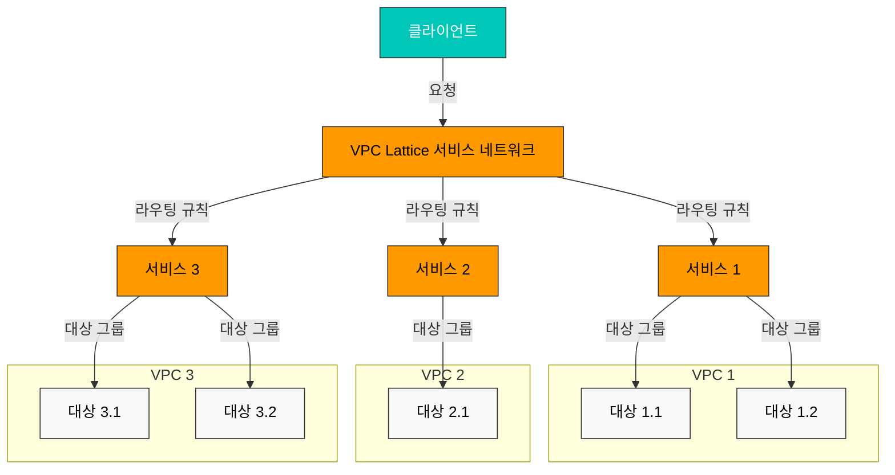
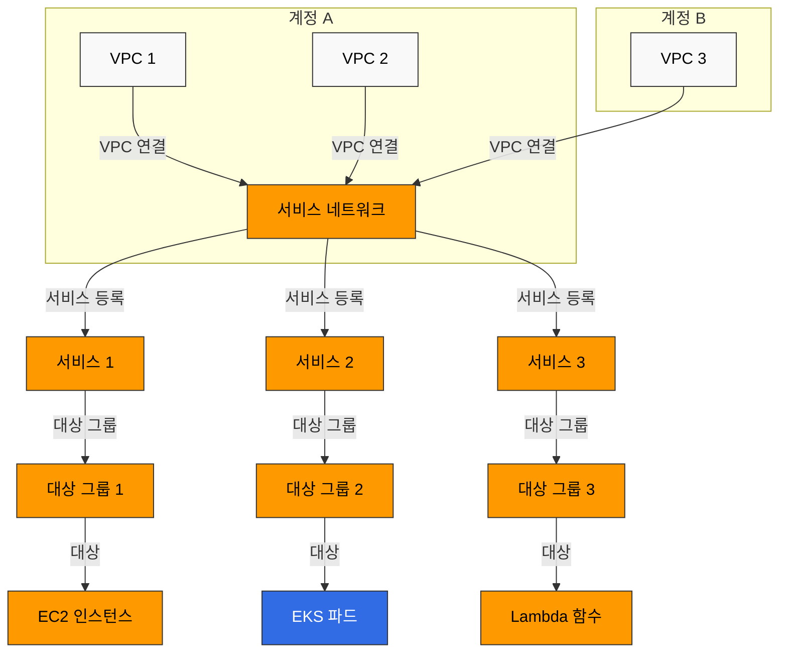
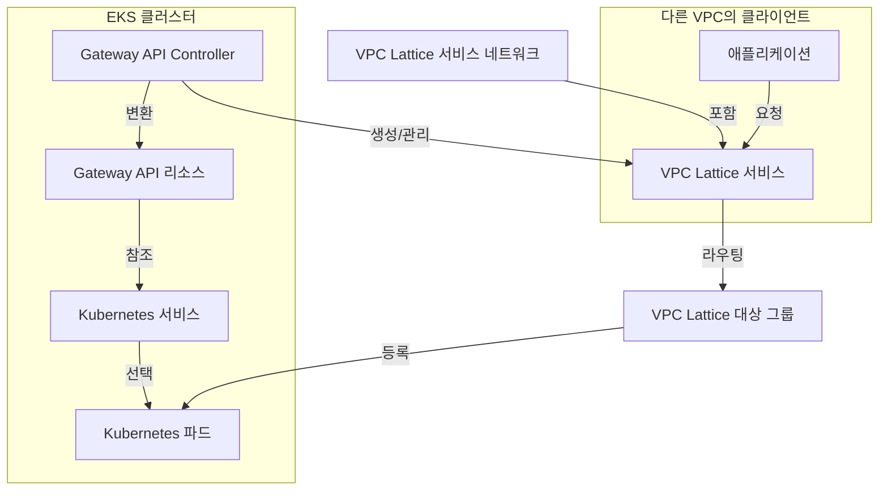

# VPC Lattice

Amazon VPC Lattice는 AWS의 애플리케이션 네트워킹 서비스로, 서로 다른 VPC와 계정에 걸쳐 있는 서비스들을 안전하게 연결하고 관리할 수 있게 해줍니다. 이 문서에서는 VPC Lattice의 개념, 아키텍처, Amazon EKS와의 통합 방법, 그리고 모범 사례에 대해 설명합니다.

## 목차

1. [개요](#개요)
2. [아키텍처](#아키텍처)
3. [EKS와 VPC Lattice 통합](#eks와-vpc-lattice-통합)
4. [설치 및 구성](#설치-및-구성)
5. [서비스 관리](#서비스-관리)
6. [라우팅 및 트래픽 관리](#라우팅-및-트래픽-관리)
7. [보안 및 인증](#보안-및-인증)
8. [모니터링 및 로깅](#모니터링-및-로깅)
9. [모범 사례](#모범-사례)
10. [문제 해결](#문제-해결)
11. [결론](#결론)

## 개요

### VPC Lattice란?

Amazon VPC Lattice는 서비스 간 연결, 보안 및 모니터링을 위한 완전 관리형 애플리케이션 네트워킹 서비스입니다. 주요 특징은 다음과 같습니다:

- **서비스 네트워크**: 여러 VPC와 계정에 걸쳐 서비스를 연결하는 논리적 경계
- **서비스 디스커버리**: 서비스 네트워크 내에서 서비스를 자동으로 검색
- **트래픽 관리**: 라우팅 규칙, 가중치 기반 라우팅, 경로 기반 라우팅 지원
- **인증 및 권한 부여**: AWS IAM, 리소스 정책을 통한 액세스 제어
- **관찰성**: 통합된 모니터링, 로깅 및 추적 기능

### 주요 사용 사례

1. **마이크로서비스 아키텍처**: 마이크로서비스 간의 통신을 간소화하고 보안 강화
2. **멀티 계정 환경**: 여러 AWS 계정에 걸쳐 있는 서비스 간의 안전한 통신
3. **하이브리드 워크로드**: 컨테이너화된 워크로드와 비컨테이너화된 워크로드 간의 통신
4. **서비스 메시 대체**: 경량 서비스 메시 기능을 제공하여 복잡성 감소
5. **멀티 클러스터 연결**: 여러 EKS 클러스터 간의 서비스 통신 간소화

### VPC Lattice vs 다른 서비스

#### VPC Lattice vs API Gateway

| 기능 | VPC Lattice | API Gateway |
|------|------------|------------|
| 주요 용도 | 내부 서비스 간 통신 | 외부 API 노출 |
| 네트워크 위치 | VPC 내부 | 인터넷 연결 |
| 프로토콜 | HTTP/HTTPS, gRPC | HTTP/HTTPS, WebSocket, REST, GraphQL |
| 인증 | AWS IAM, 리소스 정책 | IAM, Lambda 권한 부여자, Cognito |
| 확장성 | 자동 확장 | 자동 확장 |
| 가격 책정 | 시간당 + 데이터 처리량 | 요청 수 + 데이터 처리량 |

#### VPC Lattice vs AWS App Mesh

| 기능 | VPC Lattice | AWS App Mesh |
|------|------------|-------------|
| 아키텍처 | 관리형 서비스 | 사이드카 프록시 기반 |
| 복잡성 | 낮음 | 중간 |
| 프로토콜 | HTTP/HTTPS, gRPC | HTTP/HTTPS, gRPC, TCP |
| 서비스 디스커버리 | 내장 | AWS Cloud Map 통합 |
| 트래픽 제어 | 기본 라우팅 규칙 | 고급 트래픽 제어 |
| 관찰성 | CloudWatch 통합 | Envoy 기반 상세 메트릭 |

#### VPC Lattice vs Transit Gateway

| 기능 | VPC Lattice | Transit Gateway |
|------|------------|----------------|
| 주요 용도 | 서비스 간 통신 | VPC 간 네트워크 연결 |
| 추상화 수준 | 서비스 수준 | 네트워크 수준 |
| 프로토콜 | 애플리케이션 계층 (L7) | 네트워크 계층 (L3) |
| 라우팅 | 서비스 이름 기반 | IP 기반 |
| 보안 | 서비스 수준 정책 | 보안 그룹, NACL |

## 아키텍처

### VPC Lattice 구성 요소

VPC Lattice는 다음과 같은 주요 구성 요소로 이루어져 있습니다:

1. **서비스 네트워크(Service Network)**: 서비스 간 통신을 위한 논리적 경계
2. **서비스(Service)**: 애플리케이션 또는 마이크로서비스를 나타내는 엔드포인트
3. **대상 그룹(Target Group)**: 서비스로 트래픽을 라우팅할 대상 집합
4. **리스너(Listener)**: 서비스에 대한 연결 요청을 처리하는 프로세스
5. **규칙(Rule)**: 리스너가 트래픽을 라우팅하는 방법을 정의
6. **VPC 연결(VPC Association)**: VPC를 서비스 네트워크에 연결



### 서비스 네트워크 아키텍처

서비스 네트워크는 VPC Lattice의 핵심 구성 요소로, 여러 VPC와 계정에 걸쳐 있는 서비스들을 연결합니다.



### 트래픽 흐름

VPC Lattice에서 트래픽이 흐르는 방식은 다음과 같습니다:

1. 클라이언트가 VPC Lattice 서비스 DNS 이름으로 요청을 보냄
2. VPC Lattice가 요청을 수신하고 리스너 규칙에 따라 처리
3. 리스너 규칙이 요청을 적절한 대상 그룹으로 라우팅
4. 대상 그룹이 요청을 등록된 대상(EC2, EKS 파드, Lambda 등)으로 전달
5. 대상이 응답을 처리하고 클라이언트에게 반환

```mermaid
sequenceDiagram
    participant Client as 클라이언트
    participant VPCLattice as VPC Lattice
    participant Service as 서비스
    participant TargetGroup as 대상 그룹
    participant Target as 대상(EKS 파드)
    
    Client->>VPCLattice: 요청 (service-name.vpc-lattice-svcs.region.on.aws)
    VPCLattice->>Service: 요청 처리 및 리스너 규칙 적용
    Service->>TargetGroup: 적절한 대상 그룹으로 라우팅
    TargetGroup->>Target: 요청을 대상으로 전달
    Target->>TargetGroup: 응답 반환
    TargetGroup->>Service: 응답 전달
    Service->>VPCLattice: 응답 처리
    VPCLattice->>Client: 응답 반환
    
    %% 스타일 정의
    classDef k8sComponent fill:#326CE5,stroke:#333,stroke-width:1px,color:white;
    classDef awsService fill:#FF9900,stroke:#333,stroke-width:1px,color:black;
    classDef userApp fill:#00C7B7,stroke:#333,stroke-width:1px,color:white;
    classDef dataStore fill:#3B48CC,stroke:#333,stroke-width:1px,color:white;
    classDef prometheus fill:#E6522C,stroke:#333,stroke-width:1px,color:white;
    classDef victoriaMetrics fill:#4285F4,stroke:#333,stroke-width:1px,color:white;
    classDef grafana fill:#F8B52A,stroke:#333,stroke-width:1px,color:black;
    classDef alerting fill:#EB6E85,stroke:#333,stroke-width:1px,color:white;
    classDef default fill:#f9f9f9,stroke:#333,stroke-width:1px,color:black;
```

### 서비스 디스커버리

VPC Lattice는 서비스 네트워크 내에서 서비스 디스커버리를 자동으로 제공합니다:

1. 각 서비스는 고유한 DNS 이름을 가짐 (`service-name.vpc-lattice-svcs.region.on.aws`)
2. 클라이언트는 이 DNS 이름을 사용하여 서비스에 접근
3. VPC Lattice가 DNS 확인 및 라우팅을 처리
4. 서비스 네트워크에 연결된 모든 VPC에서 서비스에 접근 가능

### 보안 모델

VPC Lattice는 다음과 같은 보안 메커니즘을 제공합니다:

1. **네트워크 격리**: 서비스 네트워크는 논리적으로 격리된 환경 제공
2. **인증 및 권한 부여**: AWS IAM을 통한 서비스 액세스 제어
3. **리소스 정책**: 서비스 및 서비스 네트워크에 대한 세분화된 액세스 제어
4. **TLS 암호화**: 서비스 간 통신의 암호화
5. **VPC 보안 그룹**: 대상에 대한 추가적인 보안 계층

## EKS와 VPC Lattice 통합

### 통합 아키텍처

Amazon EKS와 VPC Lattice의 통합은 다음과 같은 구성 요소로 이루어집니다:

1. **AWS Gateway API Controller**: Kubernetes Gateway API를 VPC Lattice 리소스로 변환
2. **Kubernetes Gateway API**: 서비스 라우팅을 위한 표준 Kubernetes API
3. **VPC Lattice 서비스 네트워크**: EKS 클러스터가 연결되는 서비스 네트워크
4. **VPC Lattice 서비스**: Kubernetes 서비스에 매핑되는 VPC Lattice 서비스
5. **VPC Lattice 대상 그룹**: Kubernetes 파드에 매핑되는 대상 그룹



### 통합의 이점

EKS와 VPC Lattice를 통합하면 다음과 같은 이점이 있습니다:

1. **표준화된 API**: Kubernetes Gateway API를 통한 일관된 서비스 관리
2. **크로스 클러스터 통신**: 여러 EKS 클러스터 간의 원활한 통신
3. **하이브리드 워크로드**: EKS 파드와 비컨테이너화된 워크로드 간의 통신
4. **중앙 집중식 관리**: AWS 콘솔에서 모든 서비스 네트워크 관리
5. **통합된 관찰성**: CloudWatch, CloudTrail을 통한 통합 모니터링 및 로깅
6. **간소화된 서비스 메시**: 사이드카 없이 서비스 메시 기능 제공

### 서비스 메시 대안으로서의 VPC Lattice

VPC Lattice는 다음과 같은 이유로 전통적인 서비스 메시(Istio, Linkerd 등)의 대안이 될 수 있습니다:

1. **낮은 복잡성**: 사이드카 프록시 없이 서비스 메시 기능 제공
2. **관리 오버헤드 감소**: AWS에서 완전히 관리되는 서비스
3. **리소스 효율성**: 사이드카 프록시가 없어 리소스 사용량 감소
4. **AWS 서비스와의 통합**: AWS 서비스 생태계와 원활하게 통합

| 기능 | VPC Lattice | 전통적인 서비스 메시 |
|------|------------|-----------------|
| 서비스 디스커버리 | 내장 | 별도 구성 필요 |
| 트래픽 라우팅 | 지원 | 지원 |
| 트래픽 분할 | 지원 | 지원 |
| 상세한 트래픽 제어 | 제한적 | 광범위 |
| 사이드카 프록시 | 불필요 | 필요 |
| 관리 복잡성 | 낮음 | 높음 |
| 리소스 오버헤드 | 낮음 | 높음 |
| 관찰성 | CloudWatch 통합 | 다양한 도구 지원 |
## 설치 및 구성

### 사전 요구 사항

VPC Lattice와 EKS를 통합하기 위한 사전 요구 사항은 다음과 같습니다:

1. **Amazon EKS 클러스터**: Kubernetes 버전 1.23 이상
2. **IAM 권한**: VPC Lattice 리소스를 생성하고 관리할 수 있는 권한
3. **VPC 설정**: 프라이빗 서브넷이 있는 VPC
4. **AWS CLI**: 최신 버전의 AWS CLI
5. **kubectl**: 최신 버전의 kubectl
6. **Helm**: (선택 사항) AWS Gateway API Controller 설치를 위한 Helm 3

### AWS Gateway API Controller 설치

AWS Gateway API Controller는 Kubernetes Gateway API 리소스를 VPC Lattice 리소스로 변환하는 역할을 합니다.

#### Helm을 사용한 설치

```bash
# Helm 저장소 추가
helm repo add eks https://aws.github.io/eks-charts
helm repo update

# AWS Gateway API Controller 설치
helm install gateway-api-controller eks/aws-gateway-controller \
  --namespace aws-gateway-controller \
  --create-namespace \
  --set serviceAccount.create=true \
  --set serviceAccount.name=aws-gateway-controller \
  --set serviceAccount.annotations."eks\.amazonaws\.com/role-arn"=arn:aws:iam::<AWS_ACCOUNT_ID>:role/AmazonGatewayControllerRole
```

#### YAML 매니페스트를 사용한 설치

1. 서비스 계정 및 RBAC 설정:

```yaml
apiVersion: v1
kind: ServiceAccount
metadata:
  name: aws-gateway-controller
  namespace: aws-gateway-controller
  annotations:
    eks.amazonaws.com/role-arn: arn:aws:iam::<AWS_ACCOUNT_ID>:role/AmazonGatewayControllerRole
---
apiVersion: rbac.authorization.k8s.io/v1
kind: ClusterRole
metadata:
  name: aws-gateway-controller
rules:
- apiGroups: ["gateway.networking.k8s.io"]
  resources: ["gatewayclasses", "gateways", "httproutes"]
  verbs: ["get", "list", "watch", "update", "patch"]
- apiGroups: [""]
  resources: ["services", "secrets", "namespaces"]
  verbs: ["get", "list", "watch"]
- apiGroups: [""]
  resources: ["events"]
  verbs: ["create", "patch"]
---
apiVersion: rbac.authorization.k8s.io/v1
kind: ClusterRoleBinding
metadata:
  name: aws-gateway-controller
roleRef:
  apiGroup: rbac.authorization.k8s.io
  kind: ClusterRole
  name: aws-gateway-controller
subjects:
- kind: ServiceAccount
  name: aws-gateway-controller
  namespace: aws-gateway-controller
```

2. 컨트롤러 배포:

```yaml
apiVersion: apps/v1
kind: Deployment
metadata:
  name: aws-gateway-controller
  namespace: aws-gateway-controller
spec:
  replicas: 1
  selector:
    matchLabels:
      app: aws-gateway-controller
  template:
    metadata:
      labels:
        app: aws-gateway-controller
    spec:
      serviceAccountName: aws-gateway-controller
      containers:
      - name: controller
        image: public.ecr.aws/aws-application-networking-k8s/aws-gateway-controller:v1.0.0
        args:
        - --health-probe-bind-address=:8081
        - --metrics-bind-address=:8080
        - --leader-elect
        resources:
          limits:
            cpu: 500m
            memory: 128Mi
          requests:
            cpu: 10m
            memory: 64Mi
```

### IAM 역할 설정

AWS Gateway API Controller가 VPC Lattice 리소스를 관리하려면 적절한 IAM 권한이 필요합니다.

#### IRSA(IAM Roles for Service Accounts) 설정

```bash
# IAM 정책 생성
cat <<EOF > vpc-lattice-policy.json
{
  "Version": "2012-10-17",
  "Statement": [
    {
      "Effect": "Allow",
      "Action": [
        "vpc-lattice:*",
        "ec2:DescribeVpcs",
        "ec2:DescribeSubnets",
        "ec2:DescribeSecurityGroups",
        "elasticloadbalancing:DescribeTargetGroups",
        "elasticloadbalancing:DescribeTargetHealth",
        "elasticloadbalancing:RegisterTargets",
        "elasticloadbalancing:DeregisterTargets"
      ],
      "Resource": "*"
    }
  ]
}
EOF

aws iam create-policy \
  --policy-name AmazonGatewayControllerPolicy \
  --policy-document file://vpc-lattice-policy.json

# IAM 역할 생성 및 서비스 계정 연결
eksctl create iamserviceaccount \
  --name aws-gateway-controller \
  --namespace aws-gateway-controller \
  --cluster <CLUSTER_NAME> \
  --attach-policy-arn arn:aws:iam::<AWS_ACCOUNT_ID>:policy/AmazonGatewayControllerPolicy \
  --approve \
  --override-existing-serviceaccounts
```

### VPC Lattice 서비스 네트워크 생성

VPC Lattice 서비스 네트워크는 AWS Management Console, AWS CLI 또는 AWS CloudFormation을 통해 생성할 수 있습니다.

#### AWS CLI를 사용한 생성

```bash
# 서비스 네트워크 생성
aws vpc-lattice create-service-network \
  --name my-service-network \
  --auth-type AWS_IAM

# 서비스 네트워크 ID 저장
SERVICE_NETWORK_ID=$(aws vpc-lattice list-service-networks \
  --query "items[?name=='my-service-network'].id" \
  --output text)

# VPC를 서비스 네트워크에 연결
aws vpc-lattice create-service-network-vpc-association \
  --service-network-identifier $SERVICE_NETWORK_ID \
  --vpc-identifier <VPC_ID> \
  --security-group-ids <SECURITY_GROUP_ID>
```

#### AWS CloudFormation을 사용한 생성

```yaml
Resources:
  MyServiceNetwork:
    Type: AWS::VpcLattice::ServiceNetwork
    Properties:
      Name: my-service-network
      AuthType: AWS_IAM

  MyVpcAssociation:
    Type: AWS::VpcLattice::ServiceNetworkVpcAssociation
    Properties:
      ServiceNetworkIdentifier: !Ref MyServiceNetwork
      VpcIdentifier: !Ref MyVPC
      SecurityGroupIds:
        - !Ref MySecurityGroup
```

### Gateway API 리소스 구성

Kubernetes Gateway API 리소스를 구성하여 VPC Lattice와 통합합니다.

#### 1. GatewayClass 생성

GatewayClass는 Gateway 리소스의 구현을 정의합니다.

```yaml
apiVersion: gateway.networking.k8s.io/v1beta1
kind: GatewayClass
metadata:
  name: amazon-vpc-lattice
spec:
  controllerName: application-networking.k8s.aws/gateway-api-controller
```

#### 2. Gateway 생성

Gateway는 트래픽이 클러스터로 들어오는 방법을 정의합니다.

```yaml
apiVersion: gateway.networking.k8s.io/v1beta1
kind: Gateway
metadata:
  name: my-gateway
  namespace: default
  annotations:
    application-networking.k8s.aws/service-network-id: <SERVICE_NETWORK_ID>
spec:
  gatewayClassName: amazon-vpc-lattice
  listeners:
  - name: http
    port: 80
    protocol: HTTP
```

#### 3. HTTPRoute 생성

HTTPRoute는 HTTP 트래픽을 서비스로 라우팅하는 방법을 정의합니다.

```yaml
apiVersion: gateway.networking.k8s.io/v1beta1
kind: HTTPRoute
metadata:
  name: my-http-route
  namespace: default
spec:
  parentRefs:
  - name: my-gateway
    kind: Gateway
  rules:
  - matches:
    - path:
        type: PathPrefix
        value: /api
    backendRefs:
    - name: my-service
      port: 8080
```

### 서비스 및 파드 구성

VPC Lattice와 통합할 Kubernetes 서비스 및 파드를 구성합니다.

#### 1. 서비스 생성

```yaml
apiVersion: v1
kind: Service
metadata:
  name: my-service
  namespace: default
spec:
  selector:
    app: my-app
  ports:
  - port: 8080
    targetPort: 8080
  type: ClusterIP
```

#### 2. 배포 생성

```yaml
apiVersion: apps/v1
kind: Deployment
metadata:
  name: my-app
  namespace: default
spec:
  replicas: 3
  selector:
    matchLabels:
      app: my-app
  template:
    metadata:
      labels:
        app: my-app
    spec:
      containers:
      - name: my-container
        image: nginx:latest
        ports:
        - containerPort: 8080
        readinessProbe:
          httpGet:
            path: /health
            port: 8080
          initialDelaySeconds: 5
          periodSeconds: 10
```

## 서비스 관리

### VPC Lattice 서비스 생성

VPC Lattice 서비스는 AWS Management Console, AWS CLI 또는 AWS CloudFormation을 통해 직접 생성하거나, Kubernetes Gateway API를 통해 간접적으로 생성할 수 있습니다.

#### AWS CLI를 사용한 직접 생성

```bash
# 대상 그룹 생성
aws vpc-lattice create-target-group \
  --name my-target-group \
  --type INSTANCE \
  --config '{"port":80,"protocol":"HTTP","vpcIdentifier":"<VPC_ID>","healthCheck":{"enabled":true,"protocol":"HTTP","path":"/health","port":80,"healthCheckIntervalSeconds":30,"healthCheckTimeoutSeconds":5,"healthyThresholdCount":5,"unhealthyThresholdCount":2}}'

# 대상 그룹 ID 저장
TARGET_GROUP_ID=$(aws vpc-lattice list-target-groups \
  --query "items[?name=='my-target-group'].id" \
  --output text)

# 서비스 생성
aws vpc-lattice create-service \
  --name my-service \
  --auth-type AWS_IAM

# 서비스 ID 저장
SERVICE_ID=$(aws vpc-lattice list-services \
  --query "items[?name=='my-service'].id" \
  --output text)

# 리스너 생성
aws vpc-lattice create-listener \
  --service-identifier $SERVICE_ID \
  --name my-listener \
  --protocol HTTP \
  --port 80 \
  --default-action '{"forward":{"targetGroups":[{"targetGroupIdentifier":"'$TARGET_GROUP_ID'"}]}}'

# 서비스를 서비스 네트워크에 연결
aws vpc-lattice create-service-network-service-association \
  --service-network-identifier $SERVICE_NETWORK_ID \
  --service-identifier $SERVICE_ID
```

#### Kubernetes Gateway API를 사용한 간접 생성

Gateway API 리소스를 생성하면 AWS Gateway API Controller가 자동으로 VPC Lattice 리소스를 생성합니다.

```yaml
apiVersion: gateway.networking.k8s.io/v1beta1
kind: Gateway
metadata:
  name: my-gateway
  namespace: default
  annotations:
    application-networking.k8s.aws/service-network-id: <SERVICE_NETWORK_ID>
spec:
  gatewayClassName: amazon-vpc-lattice
  listeners:
  - name: http
    port: 80
    protocol: HTTP
---
apiVersion: gateway.networking.k8s.io/v1beta1
kind: HTTPRoute
metadata:
  name: my-http-route
  namespace: default
spec:
  parentRefs:
  - name: my-gateway
    kind: Gateway
  rules:
  - matches:
    - path:
        type: PathPrefix
        value: /api
    backendRefs:
    - name: my-service
      port: 8080
```

### 서비스 검색 및 액세스

VPC Lattice 서비스는 자동으로 DNS 이름을 할당받아 서비스 네트워크 내에서 검색 가능합니다.

#### DNS 이름 형식

```
<service-name>.<service-network-id>.vpc-lattice-svcs.<region>.on.aws
```

#### 서비스 액세스 예제

```bash
# 서비스 DNS 이름 조회
SERVICE_DNS=$(aws vpc-lattice get-service \
  --service-identifier $SERVICE_ID \
  --query "dnsEntry.domainName" \
  --output text)

# 서비스 액세스
curl -v http://$SERVICE_DNS/api
```

### 서비스 업데이트 및 삭제

#### AWS CLI를 사용한 서비스 업데이트

```bash
# 서비스 업데이트
aws vpc-lattice update-service \
  --service-identifier $SERVICE_ID \
  --auth-type NONE

# 리스너 업데이트
aws vpc-lattice update-listener \
  --service-identifier $SERVICE_ID \
  --listener-identifier <LISTENER_ID> \
  --default-action '{"forward":{"targetGroups":[{"targetGroupIdentifier":"'$TARGET_GROUP_ID'","weight":100}]}}'
```

#### AWS CLI를 사용한 서비스 삭제

```bash
# 서비스 네트워크 연결 해제
aws vpc-lattice delete-service-network-service-association \
  --service-network-service-association-identifier <ASSOCIATION_ID>

# 리스너 삭제
aws vpc-lattice delete-listener \
  --service-identifier $SERVICE_ID \
  --listener-identifier <LISTENER_ID>

# 서비스 삭제
aws vpc-lattice delete-service \
  --service-identifier $SERVICE_ID

# 대상 그룹 삭제
aws vpc-lattice delete-target-group \
  --target-group-identifier $TARGET_GROUP_ID
```

#### Kubernetes Gateway API를 사용한 서비스 관리

Gateway API 리소스를 업데이트하거나 삭제하면 AWS Gateway API Controller가 자동으로 VPC Lattice 리소스를 업데이트하거나 삭제합니다.

```bash
# HTTPRoute 업데이트
kubectl apply -f updated-http-route.yaml

# HTTPRoute 삭제
kubectl delete httproute my-http-route

# Gateway 삭제
kubectl delete gateway my-gateway
```

## 라우팅 및 트래픽 관리

### 기본 라우팅

VPC Lattice는 경로 기반 라우팅, 헤더 기반 라우팅, 가중치 기반 라우팅 등 다양한 라우팅 옵션을 제공합니다.

#### 경로 기반 라우팅

```yaml
apiVersion: gateway.networking.k8s.io/v1beta1
kind: HTTPRoute
metadata:
  name: path-based-route
  namespace: default
spec:
  parentRefs:
  - name: my-gateway
    kind: Gateway
  rules:
  - matches:
    - path:
        type: PathPrefix
        value: /api/v1
    backendRefs:
    - name: service-v1
      port: 8080
  - matches:
    - path:
        type: PathPrefix
        value: /api/v2
    backendRefs:
    - name: service-v2
      port: 8080
```

#### 헤더 기반 라우팅

```yaml
apiVersion: gateway.networking.k8s.io/v1beta1
kind: HTTPRoute
metadata:
  name: header-based-route
  namespace: default
spec:
  parentRefs:
  - name: my-gateway
    kind: Gateway
  rules:
  - matches:
    - headers:
      - name: "version"
        value: "v1"
    backendRefs:
    - name: service-v1
      port: 8080
  - matches:
    - headers:
      - name: "version"
        value: "v2"
    backendRefs:
    - name: service-v2
      port: 8080
```

### 트래픽 분할 및 카나리 배포

VPC Lattice는 가중치 기반 라우팅을 통해 트래픽 분할 및 카나리 배포를 지원합니다.

#### AWS CLI를 사용한 가중치 기반 라우팅

```bash
# 가중치 기반 라우팅 설정
aws vpc-lattice update-listener \
  --service-identifier $SERVICE_ID \
  --listener-identifier <LISTENER_ID> \
  --default-action '{
    "forward": {
      "targetGroups": [
        {
          "targetGroupIdentifier": "'$TARGET_GROUP_ID_V1'",
          "weight": 80
        },
        {
          "targetGroupIdentifier": "'$TARGET_GROUP_ID_V2'",
          "weight": 20
        }
      ]
    }
  }'
```

#### Kubernetes Gateway API를 사용한 가중치 기반 라우팅

현재 Kubernetes Gateway API는 가중치 기반 라우팅을 직접 지원하지 않지만, AWS Gateway API Controller는 주석을 통해 이 기능을 지원합니다.

```yaml
apiVersion: gateway.networking.k8s.io/v1beta1
kind: HTTPRoute
metadata:
  name: weighted-route
  namespace: default
  annotations:
    application-networking.k8s.aws/traffic-weights: |
      {
        "service-v1": 80,
        "service-v2": 20
      }
spec:
  parentRefs:
  - name: my-gateway
    kind: Gateway
  rules:
  - matches:
    - path:
        type: PathPrefix
        value: /api
    backendRefs:
    - name: service-v1
      port: 8080
    - name: service-v2
      port: 8080
```

### 상태 확인 구성

VPC Lattice는 대상 그룹에 대한 상태 확인을 지원합니다.

#### AWS CLI를 사용한 상태 확인 구성

```bash
# 상태 확인 구성 업데이트
aws vpc-lattice update-target-group \
  --target-group-identifier $TARGET_GROUP_ID \
  --health-check '{
    "enabled": true,
    "protocol": "HTTP",
    "path": "/health",
    "port": 8080,
    "healthCheckIntervalSeconds": 30,
    "healthCheckTimeoutSeconds": 5,
    "healthyThresholdCount": 5,
    "unhealthyThresholdCount": 2,
    "matcher": {
      "httpCode": "200-299"
    }
  }'
```

#### Kubernetes Gateway API를 사용한 상태 확인 구성

AWS Gateway API Controller는 주석을 통해 상태 확인 구성을 지원합니다.

```yaml
apiVersion: gateway.networking.k8s.io/v1beta1
kind: HTTPRoute
metadata:
  name: health-check-route
  namespace: default
  annotations:
    application-networking.k8s.aws/health-check: |
      {
        "enabled": true,
        "protocol": "HTTP",
        "path": "/health",
        "port": 8080,
        "intervalSeconds": 30,
        "timeoutSeconds": 5,
        "healthyThresholdCount": 5,
        "unhealthyThresholdCount": 2,
        "matcher": {
          "httpCode": "200-299"
        }
      }
spec:
  parentRefs:
  - name: my-gateway
    kind: Gateway
  rules:
  - matches:
    - path:
        type: PathPrefix
        value: /api
    backendRefs:
    - name: my-service
      port: 8080
```
## 보안 및 인증

### 인증 방법

VPC Lattice는 다음과 같은 인증 방법을 지원합니다:

1. **AWS IAM**: AWS Identity and Access Management를 사용한 인증
2. **인증 없음**: 인증 없이 모든 요청 허용

#### AWS IAM 인증 구성

```bash
# IAM 인증으로 서비스 생성
aws vpc-lattice create-service \
  --name my-service \
  --auth-type AWS_IAM
```

#### Kubernetes Gateway API를 사용한 IAM 인증 구성

```yaml
apiVersion: gateway.networking.k8s.io/v1beta1
kind: Gateway
metadata:
  name: my-gateway
  namespace: default
  annotations:
    application-networking.k8s.aws/service-network-id: <SERVICE_NETWORK_ID>
    application-networking.k8s.aws/auth-type: "AWS_IAM"
spec:
  gatewayClassName: amazon-vpc-lattice
  listeners:
  - name: http
    port: 80
    protocol: HTTP
```

### 리소스 정책

VPC Lattice는 리소스 정책을 통해 서비스 및 서비스 네트워크에 대한 세분화된 액세스 제어를 제공합니다.

#### 서비스 리소스 정책 설정

```bash
# 서비스 리소스 정책 설정
aws vpc-lattice put-resource-policy \
  --resource-arn arn:aws:vpc-lattice:<REGION>:<ACCOUNT_ID>:service/<SERVICE_ID> \
  --policy '{
    "Version": "2012-10-17",
    "Statement": [
      {
        "Effect": "Allow",
        "Principal": {
          "AWS": "arn:aws:iam::<ACCOUNT_ID>:role/MyRole"
        },
        "Action": "vpc-lattice:Invoke",
        "Resource": "arn:aws:vpc-lattice:<REGION>:<ACCOUNT_ID>:service/<SERVICE_ID>"
      }
    ]
  }'
```

#### 서비스 네트워크 리소스 정책 설정

```bash
# 서비스 네트워크 리소스 정책 설정
aws vpc-lattice put-resource-policy \
  --resource-arn arn:aws:vpc-lattice:<REGION>:<ACCOUNT_ID>:servicenetwork/<SERVICE_NETWORK_ID> \
  --policy '{
    "Version": "2012-10-17",
    "Statement": [
      {
        "Effect": "Allow",
        "Principal": {
          "AWS": "arn:aws:iam::<ACCOUNT_ID>:role/MyRole"
        },
        "Action": [
          "vpc-lattice:CreateServiceNetworkVpcAssociation",
          "vpc-lattice:CreateServiceNetworkServiceAssociation"
        ],
        "Resource": "arn:aws:vpc-lattice:<REGION>:<ACCOUNT_ID>:servicenetwork/<SERVICE_NETWORK_ID>"
      }
    ]
  }'
```

### 크로스 계정 액세스

VPC Lattice는 서비스 네트워크를 통해 여러 AWS 계정에 걸쳐 있는 서비스 간의 통신을 지원합니다.

#### 크로스 계정 서비스 네트워크 공유

1. AWS RAM(Resource Access Manager)을 사용하여 서비스 네트워크 공유:

```bash
# 서비스 네트워크 공유
aws ram create-resource-share \
  --name my-service-network-share \
  --resource-arns arn:aws:vpc-lattice:<REGION>:<ACCOUNT_ID>:servicenetwork/<SERVICE_NETWORK_ID> \
  --principals arn:aws:organizations::o-<ORGANIZATION_ID>:organization

# 또는 특정 계정과 공유
aws ram create-resource-share \
  --name my-service-network-share \
  --resource-arns arn:aws:vpc-lattice:<REGION>:<ACCOUNT_ID>:servicenetwork/<SERVICE_NETWORK_ID> \
  --principals <TARGET_ACCOUNT_ID>
```

2. 대상 계정에서 공유된 서비스 네트워크 수락:

```bash
# 공유 초대 수락
aws ram accept-resource-share-invitation \
  --resource-share-invitation-arn arn:aws:ram:<REGION>:<ACCOUNT_ID>:resource-share-invitation/<INVITATION_ID>
```

3. 대상 계정에서 VPC를 공유된 서비스 네트워크에 연결:

```bash
# VPC 연결
aws vpc-lattice create-service-network-vpc-association \
  --service-network-identifier <SERVICE_NETWORK_ID> \
  --vpc-identifier <VPC_ID> \
  --security-group-ids <SECURITY_GROUP_ID>
```

### TLS 구성

VPC Lattice는 서비스에 대한 TLS 암호화를 지원합니다.

#### AWS CLI를 사용한 TLS 구성

```bash
# ACM 인증서 생성 또는 가져오기
CERTIFICATE_ARN=$(aws acm request-certificate \
  --domain-name my-service.example.com \
  --validation-method DNS \
  --query CertificateArn \
  --output text)

# TLS 리스너 생성
aws vpc-lattice create-listener \
  --service-identifier $SERVICE_ID \
  --name my-tls-listener \
  --protocol HTTPS \
  --port 443 \
  --tls '{
    "certificateArn": "'$CERTIFICATE_ARN'",
    "mode": "STRICT"
  }' \
  --default-action '{
    "forward": {
      "targetGroups": [
        {
          "targetGroupIdentifier": "'$TARGET_GROUP_ID'"
        }
      ]
    }
  }'
```

#### Kubernetes Gateway API를 사용한 TLS 구성

```yaml
apiVersion: gateway.networking.k8s.io/v1beta1
kind: Gateway
metadata:
  name: my-tls-gateway
  namespace: default
  annotations:
    application-networking.k8s.aws/service-network-id: <SERVICE_NETWORK_ID>
spec:
  gatewayClassName: amazon-vpc-lattice
  listeners:
  - name: https
    port: 443
    protocol: HTTPS
    tls:
      mode: Terminate
      certificateRefs:
      - kind: Secret
        name: my-tls-cert
```

## 모니터링 및 로깅

### CloudWatch 메트릭

VPC Lattice는 다양한 CloudWatch 메트릭을 제공하여 서비스 성능 및 상태를 모니터링할 수 있습니다.

#### 주요 메트릭

| 메트릭 이름 | 설명 | 차원 |
|------------|------|------|
| RequestCount | 처리된 요청 수 | ServiceId, ServiceName, TargetGroupId |
| HTTP_4XX_Count | 4XX HTTP 응답 코드 수 | ServiceId, ServiceName, TargetGroupId |
| HTTP_5XX_Count | 5XX HTTP 응답 코드 수 | ServiceId, ServiceName, TargetGroupId |
| ProcessedBytes | 처리된 바이트 수 | ServiceId, ServiceName, TargetGroupId |
| TargetProcessingTime | 대상 처리 시간(ms) | ServiceId, ServiceName, TargetGroupId |
| HealthyTargetCount | 정상 대상 수 | TargetGroupId |
| UnhealthyTargetCount | 비정상 대상 수 | TargetGroupId |

#### CloudWatch 대시보드 생성

```bash
# CloudWatch 대시보드 생성
aws cloudwatch put-dashboard \
  --dashboard-name VPCLatticeMonitoring \
  --dashboard-body '{
    "widgets": [
      {
        "type": "metric",
        "x": 0,
        "y": 0,
        "width": 12,
        "height": 6,
        "properties": {
          "metrics": [
            ["AWS/VpcLattice", "RequestCount", "ServiceName", "my-service"]
          ],
          "period": 60,
          "stat": "Sum",
          "region": "<REGION>",
          "title": "Request Count"
        }
      },
      {
        "type": "metric",
        "x": 12,
        "y": 0,
        "width": 12,
        "height": 6,
        "properties": {
          "metrics": [
            ["AWS/VpcLattice", "HTTP_4XX_Count", "ServiceName", "my-service"],
            ["AWS/VpcLattice", "HTTP_5XX_Count", "ServiceName", "my-service"]
          ],
          "period": 60,
          "stat": "Sum",
          "region": "<REGION>",
          "title": "Error Count"
        }
      }
    ]
  }'
```

### CloudWatch 경보

VPC Lattice 메트릭에 대한 CloudWatch 경보를 설정하여 문제를 조기에 감지할 수 있습니다.

```bash
# 5XX 오류 경보 생성
aws cloudwatch put-metric-alarm \
  --alarm-name VPCLattice-5XX-Errors \
  --alarm-description "Alarm when 5XX errors exceed threshold" \
  --metric-name HTTP_5XX_Count \
  --namespace AWS/VpcLattice \
  --dimensions Name=ServiceName,Value=my-service \
  --statistic Sum \
  --period 60 \
  --evaluation-periods 5 \
  --threshold 10 \
  --comparison-operator GreaterThanThreshold \
  --alarm-actions arn:aws:sns:<REGION>:<ACCOUNT_ID>:my-alert-topic
```

### 액세스 로깅

VPC Lattice는 서비스에 대한 액세스 로그를 Amazon S3, Amazon CloudWatch Logs 또는 Amazon Kinesis Data Firehose로 전송할 수 있습니다.

#### S3 액세스 로깅 구성

```bash
# S3 버킷 생성
aws s3 mb s3://vpc-lattice-access-logs-<ACCOUNT_ID>

# 버킷 정책 설정
aws s3api put-bucket-policy \
  --bucket vpc-lattice-access-logs-<ACCOUNT_ID> \
  --policy '{
    "Version": "2012-10-17",
    "Statement": [
      {
        "Effect": "Allow",
        "Principal": {
          "Service": "delivery.logs.amazonaws.com"
        },
        "Action": "s3:PutObject",
        "Resource": "arn:aws:s3:::vpc-lattice-access-logs-<ACCOUNT_ID>/*",
        "Condition": {
          "StringEquals": {
            "s3:x-amz-acl": "bucket-owner-full-control"
          }
        }
      }
    ]
  }'

# 액세스 로깅 활성화
aws vpc-lattice create-access-log-subscription \
  --resource-identifier $SERVICE_ID \
  --destination-arn arn:aws:s3:::vpc-lattice-access-logs-<ACCOUNT_ID> \
  --destination-name my-s3-logs
```

#### CloudWatch Logs 액세스 로깅 구성

```bash
# 로그 그룹 생성
aws logs create-log-group \
  --log-group-name /aws/vpc-lattice/my-service

# 액세스 로깅 활성화
aws vpc-lattice create-access-log-subscription \
  --resource-identifier $SERVICE_ID \
  --destination-arn arn:aws:logs:<REGION>:<ACCOUNT_ID>:log-group:/aws/vpc-lattice/my-service \
  --destination-name my-cloudwatch-logs
```

### AWS X-Ray 통합

VPC Lattice는 AWS X-Ray와 통합하여 분산 추적을 지원합니다.

#### X-Ray 추적 활성화

```bash
# X-Ray 추적 활성화
aws vpc-lattice update-service \
  --service-identifier $SERVICE_ID \
  --auth-type AWS_IAM \
  --tracing-config '{
    "enabled": true
  }'
```

#### Kubernetes Gateway API를 사용한 X-Ray 추적 활성화

```yaml
apiVersion: gateway.networking.k8s.io/v1beta1
kind: Gateway
metadata:
  name: my-gateway
  namespace: default
  annotations:
    application-networking.k8s.aws/service-network-id: <SERVICE_NETWORK_ID>
    application-networking.k8s.aws/xray-tracing: "enabled"
spec:
  gatewayClassName: amazon-vpc-lattice
  listeners:
  - name: http
    port: 80
    protocol: HTTP
```

## 모범 사례

### 설계 및 아키텍처

1. **서비스 네트워크 설계**
   - 논리적 경계에 따라 서비스 네트워크 분리
   - 환경별(개발, 스테이징, 프로덕션) 서비스 네트워크 분리
   - 보안 요구 사항에 따라 서비스 네트워크 분리

2. **서비스 명명 규칙**
   - 일관된 명명 규칙 사용
   - 환경, 서비스 유형, 버전 등을 이름에 포함
   - 예: `<env>-<service-name>-<version>`

3. **대상 그룹 설계**
   - 유사한 특성을 가진 대상을 동일한 대상 그룹에 배치
   - 상태 확인 경로 및 간격 최적화
   - 적절한 비정상 임계값 설정

### 성능 최적화

1. **상태 확인 최적화**
   - 적절한 상태 확인 간격 설정 (너무 짧지 않게)
   - 가벼운 상태 확인 엔드포인트 구현
   - 상태 확인 경로가 중요한 종속성을 확인하도록 구성

2. **연결 재사용**
   - 클라이언트 측 연결 풀링 구현
   - Keep-Alive 헤더 사용
   - 연결 제한 시간 최적화

3. **캐싱 전략**
   - 정적 콘텐츠에 대한 클라이언트 측 캐싱 구현
   - Cache-Control 헤더 최적화
   - 필요한 경우 CDN 통합

### 보안 강화

1. **최소 권한 원칙**
   - 필요한 최소한의 권한만 부여
   - 서비스별 IAM 정책 생성
   - 정기적인 권한 검토 및 감사

2. **네트워크 보안**
   - 보안 그룹을 사용하여 트래픽 제한
   - 필요한 포트만 개방
   - VPC 엔드포인트 사용 고려

3. **암호화**
   - 전송 중 데이터 암호화를 위한 TLS 사용
   - 최신 TLS 버전 및 암호 제품군 사용
   - 인증서 자동 갱신 구성

### 모니터링 및 관찰성

1. **포괄적인 모니터링**
   - 모든 서비스에 대한 CloudWatch 대시보드 생성
   - 주요 메트릭에 대한 경보 설정
   - 로그 분석 및 이상 탐지 구현

2. **로깅 전략**
   - 모든 서비스에 대한 액세스 로깅 활성화
   - 로그 보존 정책 설정
   - 로그 분석 도구 통합

3. **분산 추적**
   - X-Ray 추적 활성화
   - 서비스 간 추적 상관 관계 구현
   - 추적 데이터 분석 및 시각화

### 비용 최적화

1. **리소스 사용량 모니터링**
   - 서비스 및 대상 그룹 사용량 추적
   - 미사용 리소스 식별 및 제거
   - 비용 할당 태그 사용

2. **트래픽 최적화**
   - 불필요한 요청 감소
   - 응답 크기 최적화
   - 배치 처리 구현 (가능한 경우)

3. **자동 확장**
   - 트래픽 패턴에 따른 대상 자동 확장
   - 예약된 확장 구현 (예측 가능한 트래픽 패턴의 경우)
   - 확장 임계값 최적화

## 문제 해결

### 일반적인 문제 및 해결 방법

#### 1. 연결 문제

**문제**: 클라이언트가 VPC Lattice 서비스에 연결할 수 없음

**해결 방법**:
- VPC와 서비스 네트워크 간의 연결 확인
- 보안 그룹 규칙 확인
- DNS 확인 확인
- 대상 상태 확인

```bash
# VPC 연결 확인
aws vpc-lattice list-service-network-vpc-associations \
  --service-network-identifier $SERVICE_NETWORK_ID

# 대상 상태 확인
aws vpc-lattice list-targets \
  --target-group-identifier $TARGET_GROUP_ID
```

#### 2. 인증 문제

**문제**: 클라이언트가 인증 오류를 수신함

**해결 방법**:
- IAM 정책 및 권한 확인
- 리소스 정책 확인
- 서명 버전 및 헤더 확인
- 임시 자격 증명 만료 확인

```bash
# 리소스 정책 확인
aws vpc-lattice get-resource-policy \
  --resource-arn arn:aws:vpc-lattice:<REGION>:<ACCOUNT_ID>:service/<SERVICE_ID>
```

#### 3. 라우팅 문제

**문제**: 요청이 잘못된 대상으로 라우팅됨

**해결 방법**:
- 리스너 규칙 및 우선 순위 확인
- 경로 패턴 및 일치 조건 확인
- 대상 그룹 구성 확인
- 가중치 기반 라우팅 설정 확인

```bash
# 리스너 규칙 확인
aws vpc-lattice list-listeners \
  --service-identifier $SERVICE_ID

# 대상 그룹 확인
aws vpc-lattice get-target-group \
  --target-group-identifier $TARGET_GROUP_ID
```

#### 4. 상태 확인 실패

**문제**: 대상이 상태 확인에 실패함

**해결 방법**:
- 상태 확인 엔드포인트 가용성 확인
- 상태 확인 구성 확인
- 대상 애플리케이션 로그 확인
- 네트워크 연결 확인

```bash
# 상태 확인 구성 확인
aws vpc-lattice get-target-group \
  --target-group-identifier $TARGET_GROUP_ID \
  --query "config.healthCheck"

# 대상 상태 확인
aws vpc-lattice list-targets \
  --target-group-identifier $TARGET_GROUP_ID
```

### 로깅 및 디버깅

#### 1. 액세스 로그 분석

VPC Lattice 액세스 로그를 분석하여 문제를 진단할 수 있습니다.

```bash
# S3에서 액세스 로그 다운로드
aws s3 cp s3://vpc-lattice-access-logs-<ACCOUNT_ID>/ . --recursive

# CloudWatch Logs에서 액세스 로그 쿼리
aws logs start-query \
  --log-group-name /aws/vpc-lattice/my-service \
  --start-time $(date -d '1 hour ago' +%s) \
  --end-time $(date +%s) \
  --query-string 'fields @timestamp, client_ip, request_path, status_code, request_processing_time | filter status_code >= 400'
```

#### 2. CloudWatch 메트릭 분석

CloudWatch 메트릭을 분석하여 성능 문제를 진단할 수 있습니다.

```bash
# 요청 수 메트릭 조회
aws cloudwatch get-metric-statistics \
  --namespace AWS/VpcLattice \
  --metric-name RequestCount \
  --dimensions Name=ServiceName,Value=my-service \
  --start-time $(date -d '1 hour ago' -u +%Y-%m-%dT%H:%M:%SZ) \
  --end-time $(date -u +%Y-%m-%dT%H:%M:%SZ) \
  --period 60 \
  --statistics Sum

# 오류 메트릭 조회
aws cloudwatch get-metric-statistics \
  --namespace AWS/VpcLattice \
  --metric-name HTTP_5XX_Count \
  --dimensions Name=ServiceName,Value=my-service \
  --start-time $(date -d '1 hour ago' -u +%Y-%m-%dT%H:%M:%SZ) \
  --end-time $(date -u +%Y-%m-%dT%H:%M:%SZ) \
  --period 60 \
  --statistics Sum
```

#### 3. X-Ray 추적 분석

AWS X-Ray를 사용하여 분산 추적을 분석할 수 있습니다.

```bash
# X-Ray 추적 조회
aws xray get-service-graph \
  --start-time $(date -d '1 hour ago' +%s) \
  --end-time $(date +%s)

# 특정 추적 조회
aws xray batch-get-traces \
  --trace-ids <TRACE_ID>
```

### AWS 지원 및 문제 해결 도구

#### 1. AWS 지원 사례 생성

심각한 문제의 경우 AWS 지원 사례를 생성할 수 있습니다.

```bash
# AWS 지원 사례 생성
aws support create-case \
  --subject "VPC Lattice Connectivity Issue" \
  --service-code vpc-lattice \
  --category-code connectivity \
  --severity-code urgent \
  --communication-body "We are experiencing connectivity issues with our VPC Lattice service. Service ID: $SERVICE_ID" \
  --language en
```

#### 2. AWS 리소스 상태 확인

AWS Health Dashboard를 확인하여 AWS 서비스 상태를 확인할 수 있습니다.

```bash
# AWS Health 이벤트 확인
aws health describe-events \
  --filter 'eventTypeCategories=issue,scheduledChange,accountNotification' \
  --region <REGION>
```

## 결론

Amazon VPC Lattice는 AWS의 애플리케이션 네트워킹 서비스로, 서로 다른 VPC와 계정에 걸쳐 있는 서비스들을 안전하게 연결하고 관리할 수 있게 해줍니다. EKS와의 통합을 통해 Kubernetes 환경에서 서비스 메시 기능을 간소화된 방식으로 제공합니다.

이 문서에서는 다음 내용을 다루었습니다:

1. **개요**: VPC Lattice의 개념, 주요 사용 사례 및 다른 서비스와의 비교
2. **아키텍처**: VPC Lattice의 구성 요소, 서비스 네트워크 아키텍처 및 트래픽 흐름
3. **EKS와 VPC Lattice 통합**: AWS Gateway API Controller를 통한 통합 및 이점
4. **설치 및 구성**: AWS Gateway API Controller 설치, IAM 역할 설정 및 서비스 네트워크 생성
5. **서비스 관리**: VPC Lattice 서비스 생성, 검색, 액세스, 업데이트 및 삭제
6. **라우팅 및 트래픽 관리**: 기본 라우팅, 트래픽 분할, 카나리 배포 및 상태 확인
7. **보안 및 인증**: 인증 방법, 리소스 정책, 크로스 계정 액세스 및 TLS 구성
8. **모니터링 및 로깅**: CloudWatch 메트릭, 경보, 액세스 로깅 및 X-Ray 통합
9. **모범 사례**: 설계, 성능, 보안, 모니터링 및 비용 최적화
10. **문제 해결**: 일반적인 문제 및 해결 방법, 로깅 및 디버깅

VPC Lattice를 효과적으로 구현하고 관리하면 마이크로서비스 아키텍처의 복잡성을 줄이고, 서비스 간 통신의 보안을 강화하며, 관찰성을 향상시킬 수 있습니다. AWS의 관리형 서비스로서 운영 오버헤드를 최소화하면서 서비스 메시의 이점을 제공합니다.

## 참고 자료

- [Amazon VPC Lattice 공식 문서](https://docs.aws.amazon.com/vpc-lattice/)
- [AWS Gateway API Controller 공식 문서](https://github.com/aws/aws-application-networking-k8s)
- [Kubernetes Gateway API 문서](https://gateway-api.sigs.k8s.io/)
- [Amazon EKS 워크숍 - VPC Lattice](https://www.eksworkshop.com/networking/vpc-lattice/)
- [AWS 블로그 - VPC Lattice 소개](https://aws.amazon.com/blogs/aws/amazon-vpc-lattice-a-new-application-networking-service/)
- [AWS 블로그 - EKS와 VPC Lattice 통합](https://aws.amazon.com/blogs/containers/amazon-eks-and-vpc-lattice-integration/)
- [AWS re:Invent 2022 - VPC Lattice 세션](https://www.youtube.com/watch?v=bGHZlJGQl1I)
- [AWS 샘플 - VPC Lattice 예제](https://github.com/aws-samples/aws-vpc-lattice-examples)
