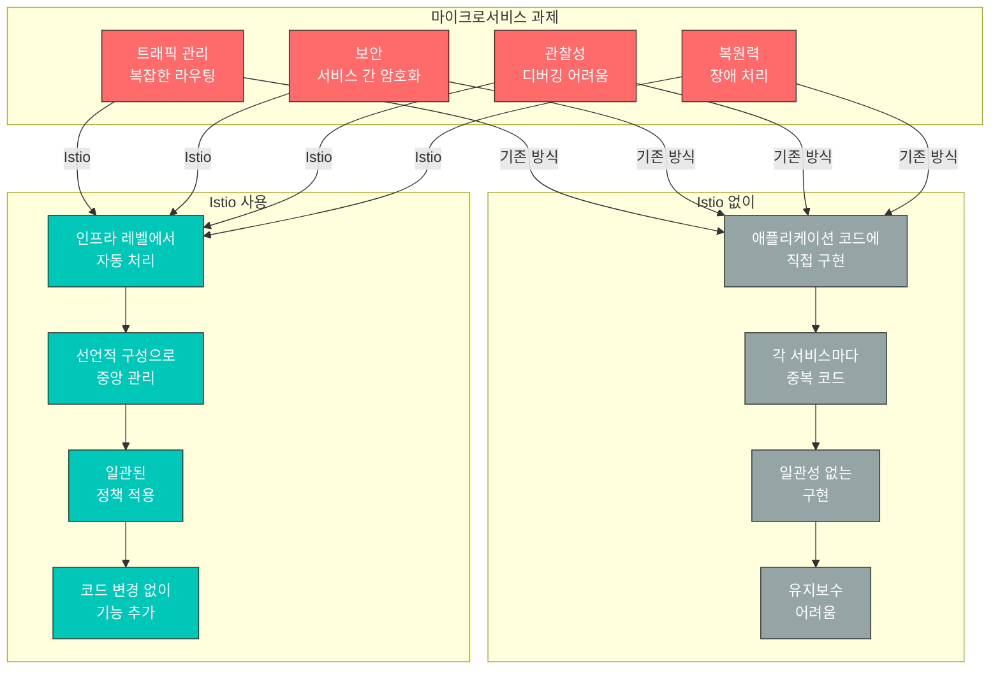
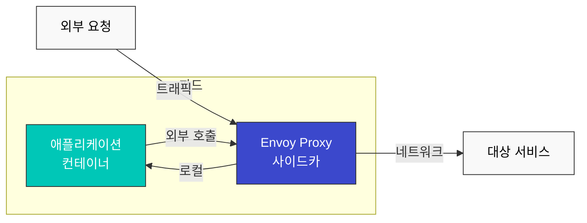
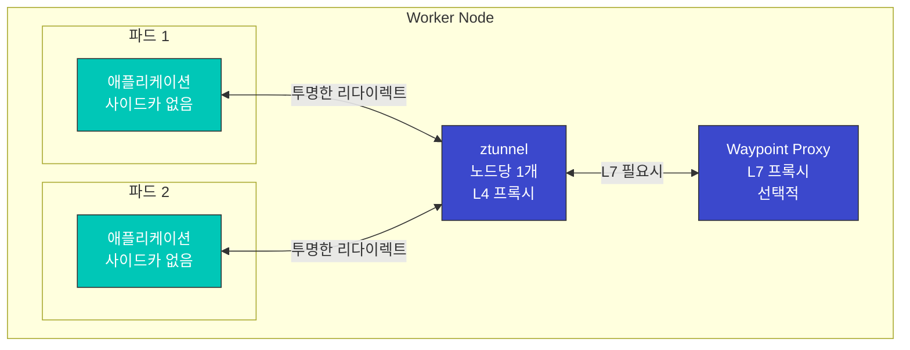
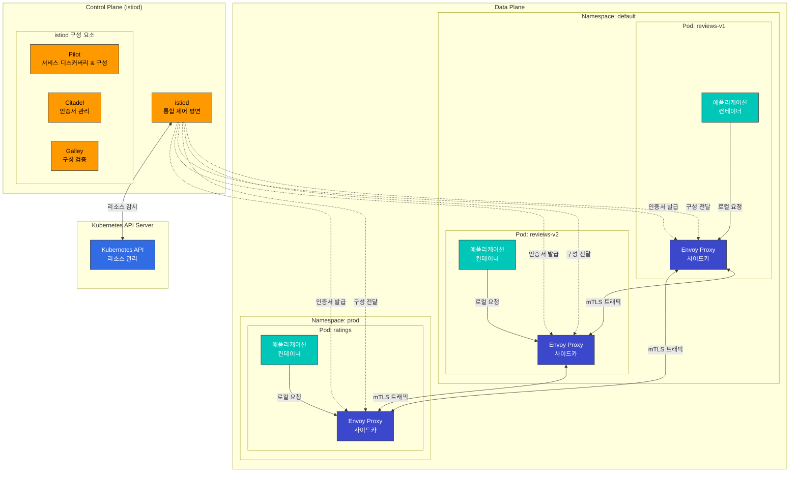
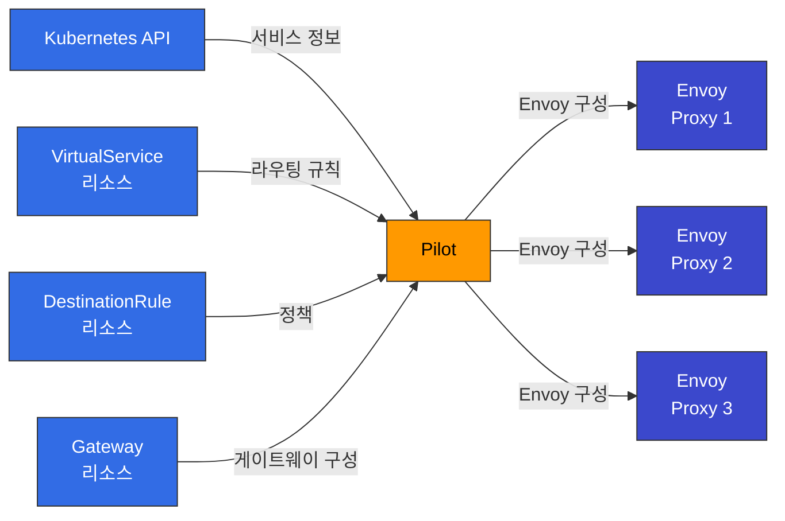
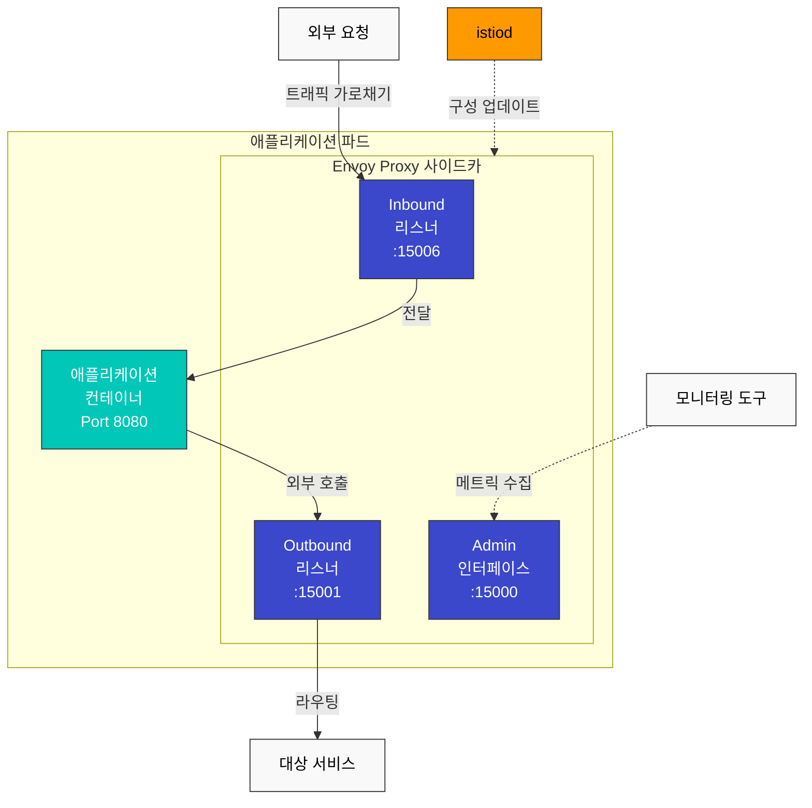
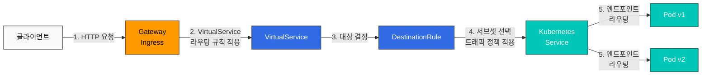
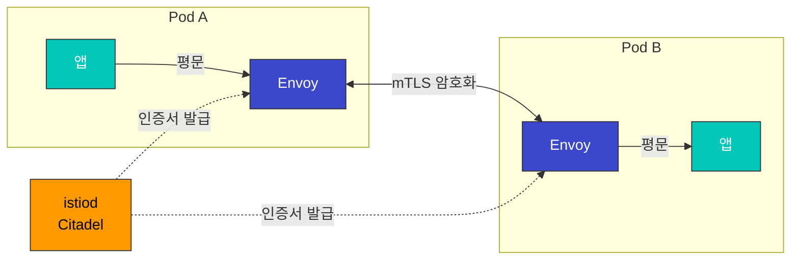
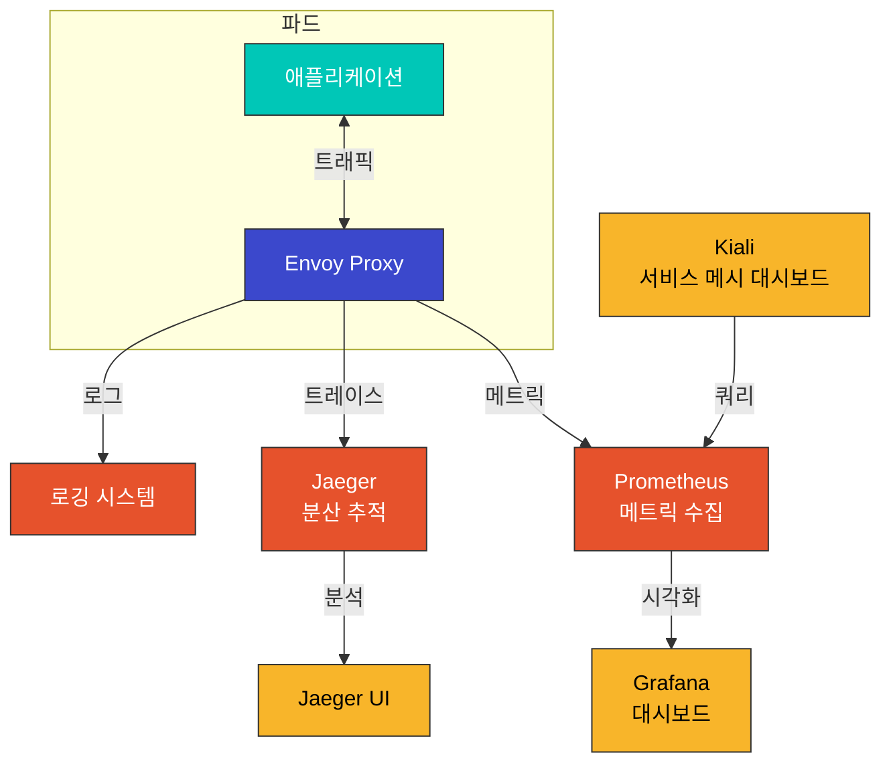

# Istio 기본 개념

이 문서에서는 Istio의 핵심 개념과 아키텍처를 설명합니다. Istio를 효과적으로 사용하기 위해서는 이러한 기본 개념을 이해하는 것이 중요합니다.

## 목차

1. [Why Istio?](#why-istio)
2. [Deployment Modes: Sidecar vs Ambient](#deployment-modes-sidecar-vs-ambient)
3. [Istio 아키텍처](#istio-아키텍처)
4. [Control Plane (istiod)](#control-plane-istiod)
5. [Data Plane (Envoy Proxy)](#data-plane-envoy-proxy)
6. [핵심 리소스](#핵심-리소스)
7. [트래픽 관리 개념](#트래픽-관리-개념)
8. [보안 개념](#보안-개념)
9. [관찰성 개념](#관찰성-개념)
10. [네임스페이스와 서비스 메시](#네임스페이스와-서비스-메시)
11. [다음 단계](#다음-단계)

## Why Istio?

Kubernetes는 컨테이너 오케스트레이션을 제공하지만, 마이크로서비스 간의 복잡한 통신을 관리하는 데는 한계가 있습니다. Istio는 이러한 문제를 해결하기 위한 서비스 메시 솔루션입니다.

### 마이크로서비스의 과제



### Istio가 제공하는 핵심 가치

#### 1. 트래픽 관리

**문제**: 새 버전 배포 시 안전하게 트래픽을 전환하고 싶습니다.

**Istio 해결책**:
```yaml
# 코드 변경 없이 Canary 배포
apiVersion: networking.istio.io/v1beta1
kind: VirtualService
metadata:
  name: reviews
spec:
  hosts:
  - reviews
  http:
  - route:
    - destination:
        host: reviews
        subset: v1
      weight: 90  # 기존 버전 90%
    - destination:
        host: reviews
        subset: v2
      weight: 10  # 새 버전 10%
```

**이점**:
- 애플리케이션 코드 수정 불필요
- 실시간 트래픽 분할 조정
- 자동 롤백 가능
- A/B 테스트, Blue/Green 배포 지원

#### 2. 보안

**문제**: 서비스 간 통신을 암호화하고 인증하고 싶습니다.

**Istio 해결책**:
```yaml
# 자동 mTLS 활성화
apiVersion: security.istio.io/v1beta1
kind: PeerAuthentication
metadata:
  name: default
  namespace: istio-system
spec:
  mtls:
    mode: STRICT  # 모든 서비스 간 자동 암호화
```

**이점**:
- 인증서 자동 발급 및 갱신
- 서비스 신원 자동 검증
- 세밀한 권한 제어
- Zero Trust 네트워크 구현

#### 3. 관찰성

**문제**: 수십 개의 마이크로서비스에서 요청 흐름을 추적하기 어렵습니다.

**Istio 해결책**:
- 자동 메트릭 생성 (Latency, Traffic, Errors, Saturation)
- 분산 추적 (Distributed Tracing)
- 서비스 토폴로지 시각화

**이점**:
- 병목 구간 자동 식별
- 에러 원인 빠른 파악
- 실시간 서비스 상태 모니터링

#### 4. 복원력

**문제**: 한 서비스의 장애가 전체 시스템에 전파됩니다.

**Istio 해결책**:
```yaml
# Circuit Breaker 자동 설정
apiVersion: networking.istio.io/v1beta1
kind: DestinationRule
metadata:
  name: reviews
spec:
  host: reviews
  trafficPolicy:
    outlierDetection:
      consecutiveErrors: 5
      interval: 30s
      baseEjectionTime: 30s
```

**이점**:
- 장애 격리 (Circuit Breaker)
- 자동 재시도 및 타임아웃
- 비정상 인스턴스 자동 제거
- 트래픽 제한 (Rate Limiting)

### Istio를 사용해야 하는 경우

**✅ Istio가 적합한 경우:**

1. **마이크로서비스 아키텍처**
   - 10개 이상의 서비스
   - 서비스 간 복잡한 의존성
   - 빈번한 배포

2. **고급 트래픽 관리 필요**
   - Canary 배포, A/B 테스트
   - 세밀한 라우팅 제어
   - Traffic Mirroring

3. **강력한 보안 요구사항**
   - 서비스 간 암호화 필수
   - 세밀한 접근 제어
   - 규정 준수 (Compliance)

4. **관찰성과 디버깅**
   - 복잡한 서비스 간 문제 추적
   - 성능 병목 식별
   - SLO/SLA 모니터링

**❌ Istio가 과할 수 있는 경우:**

1. **간단한 애플리케이션**
   - 서비스 개수가 적음 (5개 미만)
   - 단순한 요구사항
   - Kubernetes Ingress로 충분

2. **리소스 제약**
   - 작은 클러스터
   - 리소스 오버헤드 감당 어려움
   - 사이드카 메모리 비용 부담

3. **운영 역량 부족**
   - 학습 시간 부족
   - 전담 플랫폼 팀 없음
   - 간단한 솔루션 선호

### 대안과 비교

#### Kubernetes Ingress vs Istio

| 기능 | Kubernetes Ingress | Istio |
|------|-------------------|-------|
| **범위** | 외부 → 클러스터 | 외부 + 내부 서비스 간 |
| **라우팅** | 기본적 (Path, Host) | 고급 (Header, Cookie 등) |
| **mTLS** | 수동 설정 | 자동 |
| **Observability** | 제한적 | 풍부함 |
| **복잡도** | 낮음 | 높음 |
| **사용 시나리오** | 간단한 앱 | 마이크로서비스 |

#### AWS VPC Lattice vs Istio

자세한 비교는 [AWS 통합](03-aws-integration.md#istio-vs-다른-솔루션-비교) 문서를 참고하세요.

**간단 요약:**
- **VPC Lattice**: AWS 관리형, 간단, 크로스 VPC/계정 통신
- **Istio**: 오픈소스, 강력한 기능, Kubernetes 전용, 세밀한 제어

#### Linkerd vs Istio

| 특성 | Istio | Linkerd |
|------|-------|---------|
| **복잡도** | 높음 | 낮음 |
| **기능** | 매우 풍부 | 핵심 기능만 |
| **리소스** | 높음 | 낮음 |
| **학습 곡선** | 가파름 | 완만함 |
| **커뮤니티** | 큼 | 작음 |

**선택 가이드:**
- 고급 기능과 유연성 필요 → **Istio**
- 간단하고 가벼운 메시 필요 → **Linkerd**

## Deployment Modes: Sidecar vs Ambient

Istio는 두 가지 배포 모드를 지원합니다: **Sidecar Mode**와 **Ambient Mode**.

### Sidecar Mode (기본)

각 애플리케이션 파드에 Envoy 프록시를 사이드카 컨테이너로 주입합니다.



**장점:**
- 성숙하고 안정적
- 모든 Istio 기능 지원
- 파드별 세밀한 제어

**단점:**
- 리소스 오버헤드 (각 파드마다 Envoy)
- 시작 시간 증가 (Init Container)
- 복잡한 권한 설정 (iptables)

### Ambient Mode (새로운 방식)

사이드카 없이 노드 레벨에서 트래픽을 처리합니다.



**장점:**
- 낮은 리소스 사용 (노드당 1개)
- 빠른 파드 시작
- 간단한 운영
- 점진적 L7 기능 적용 가능

**단점:**
- 상대적으로 새로운 기술 (덜 성숙)
- 일부 고급 기능 제한적
- 파드별 세밀한 제어 어려움

### 비교표

| 특성 | Sidecar Mode | Ambient Mode |
|------|-------------|--------------|
| **리소스 사용** | 높음 (파드당) | 낮음 (노드당) |
| **시작 시간** | 느림 (Init Container) | 빠름 |
| **운영 복잡도** | 높음 | 낮음 |
| **L4 기능** | 지원 | 지원 |
| **L7 기능** | 전체 지원 | 선택적 (Waypoint) |
| **성숙도** | 높음 | 중간 |
| **마이그레이션** | - | 기존 사이드카에서 가능 |
| **권장 사용** | 고급 L7 기능 필요 | 리소스 효율성 중시 |

### 선택 가이드

**Sidecar Mode 선택:**
- 모든 Istio 기능 활용 필요
- 파드별 세밀한 정책 제어
- 프로덕션 검증된 안정성 필요

**Ambient Mode 선택:**
- 리소스 효율성 중요
- 간단한 L4 기능만 필요
- 점진적으로 L7 기능 추가 예정

**자세한 내용**은 [Advanced: Ambient Mode](advanced/01-ambient-mode.md) 문서를 참고하세요.

## Istio 아키텍처

Istio는 크게 **Control Plane**과 **Data Plane**으로 구성됩니다.



### 주요 구성 요소

| 구성 요소 | 설명 | 역할 |
|----------|------|------|
| **Control Plane (istiod)** | 통합된 제어 평면 | 서비스 메시의 구성 관리, 인증서 발급, 서비스 디스커버리 |
| **Data Plane (Envoy)** | 각 파드의 사이드카 프록시 | 트래픽 라우팅, 로드 밸런싱, 보안, 관찰성 |
| **Kubernetes API** | Kubernetes 클러스터 API | Istio 리소스 저장 및 관리 |

## Control Plane (istiod)

Istio 1.5부터 Control Plane의 여러 구성 요소(Pilot, Citadel, Galley)가 **istiod**라는 단일 바이너리로 통합되었습니다.

### istiod의 주요 기능

#### 1. Pilot (서비스 디스커버리 및 트래픽 관리)



**주요 역할**:
- Kubernetes의 Service, Endpoint 정보를 Envoy가 이해할 수 있는 형식으로 변환
- VirtualService, DestinationRule 등의 트래픽 관리 규칙을 Envoy 구성으로 변환
- 모든 Envoy 프록시에 구성을 실시간으로 배포

#### 2. Citadel (인증서 관리)

**주요 역할**:
- 서비스 간 mTLS 통신을 위한 인증서 자동 발급 및 갱신
- 워크로드 신원 관리
- 인증서 수명 주기 관리

```yaml
# PeerAuthentication 예제
apiVersion: security.istio.io/v1beta1
kind: PeerAuthentication
metadata:
  name: default
  namespace: istio-system
spec:
  mtls:
    mode: STRICT  # 모든 트래픽에 mTLS 강제
```

#### 3. Galley (구성 검증)

**주요 역할**:
- Istio 구성 리소스의 유효성 검증
- Kubernetes API와의 통신 추상화
- 구성 변경 사항 처리 및 배포

## Data Plane (Envoy Proxy)

Envoy는 각 애플리케이션 파드에 **사이드카 컨테이너**로 배포되어 모든 네트워크 트래픽을 가로채고 제어합니다.

### Envoy Proxy의 주요 기능



### Envoy의 기능

1. **트래픽 가로채기 (Interception)**
   - iptables 규칙을 사용하여 파드의 모든 인바운드/아웃바운드 트래픽을 가로챔
   - 애플리케이션 코드 변경 없이 투명하게 동작

2. **로드 밸런싱**
   - Round Robin, Least Request, Random, Ring Hash 등 다양한 알고리즘 지원
   - 헬스 체크 기반 로드 밸런싱

3. **서비스 디스커버리**
   - 동적 서비스 엔드포인트 검색
   - 실시간 엔드포인트 업데이트

4. **보안**
   - mTLS를 통한 서비스 간 통신 암호화
   - 인증 및 권한 부여

5. **관찰성**
   - 메트릭, 로그, 분산 추적 자동 생성
   - Prometheus 형식 메트릭 노출

### Sidecar 주입 방식

#### 자동 주입

```bash
# 네임스페이스에 레이블 추가
kubectl label namespace default istio-injection=enabled

# 파드 배포 시 자동으로 Envoy 사이드카 주입
kubectl apply -f deployment.yaml
```

#### 수동 주입

```bash
# YAML 파일에 사이드카 주입
istioctl kube-inject -f deployment.yaml | kubectl apply -f -
```

## 핵심 리소스

Istio는 Kubernetes Custom Resource Definitions (CRDs)를 사용하여 구성을 관리합니다.

### 1. VirtualService

VirtualService는 요청을 서비스로 라우팅하는 방법을 정의합니다.

```yaml
apiVersion: networking.istio.io/v1beta1
kind: VirtualService
metadata:
  name: reviews-route
spec:
  hosts:
  - reviews  # 대상 서비스
  http:
  - match:
    - headers:
        end-user:
          exact: jason
    route:
    - destination:
        host: reviews
        subset: v2  # 특정 사용자는 v2로 라우팅
  - route:
    - destination:
        host: reviews
        subset: v1  # 기본적으로 v1로 라우팅
```

**주요 기능**:
- 경로 기반 라우팅 (Path, Header, Query Parameter)
- 트래픽 분할 (Canary, A/B 테스트)
- Retry, Timeout, Fault Injection
- URL Rewrite, Header 조작

### 2. DestinationRule

DestinationRule은 서비스의 서브셋(버전)을 정의하고 트래픽 정책을 적용합니다.

```yaml
apiVersion: networking.istio.io/v1beta1
kind: DestinationRule
metadata:
  name: reviews-destination
spec:
  host: reviews
  trafficPolicy:
    loadBalancer:
      simple: LEAST_REQUEST  # 로드 밸런싱 알고리즘
    connectionPool:
      tcp:
        maxConnections: 100
      http:
        http1MaxPendingRequests: 50
        maxRequestsPerConnection: 2
    outlierDetection:
      consecutiveErrors: 5
      interval: 30s
      baseEjectionTime: 30s
  subsets:
  - name: v1
    labels:
      version: v1
  - name: v2
    labels:
      version: v2
  - name: v3
    labels:
      version: v3
```

**주요 기능**:
- 서비스 버전(subset) 정의
- 로드 밸런싱 알고리즘
- Connection Pool 설정
- Circuit Breaker (Outlier Detection)
- TLS 설정

### 3. Gateway

Gateway는 메시로 들어오는 외부 트래픽을 관리합니다.

```yaml
apiVersion: networking.istio.io/v1beta1
kind: Gateway
metadata:
  name: bookinfo-gateway
spec:
  selector:
    istio: ingressgateway  # Ingress Gateway 파드 선택
  servers:
  - port:
      number: 80
      name: http
      protocol: HTTP
    hosts:
    - "bookinfo.example.com"
  - port:
      number: 443
      name: https
      protocol: HTTPS
    tls:
      mode: SIMPLE
      credentialName: bookinfo-credential  # TLS 인증서
    hosts:
    - "bookinfo.example.com"
```

**주요 기능**:
- 외부 트래픽의 진입점 정의
- 호스트, 포트, 프로토콜 설정
- TLS 종료
- SNI 라우팅

### 4. ServiceEntry

ServiceEntry는 메시 외부의 서비스를 메시 내부 서비스처럼 사용할 수 있게 합니다.

```yaml
apiVersion: networking.istio.io/v1beta1
kind: ServiceEntry
metadata:
  name: external-api
spec:
  hosts:
  - api.external.com
  ports:
  - number: 443
    name: https
    protocol: HTTPS
  location: MESH_EXTERNAL
  resolution: DNS
```

**주요 기능**:
- 외부 서비스 등록
- 외부 서비스에 대한 트래픽 제어
- Egress 트래픽 관리

### 5. PeerAuthentication

PeerAuthentication은 서비스 간 인증 정책을 정의합니다.

```yaml
apiVersion: security.istio.io/v1beta1
kind: PeerAuthentication
metadata:
  name: default
  namespace: default
spec:
  mtls:
    mode: STRICT  # STRICT, PERMISSIVE, DISABLE
```

### 6. AuthorizationPolicy

AuthorizationPolicy는 서비스 접근 권한을 정의합니다.

```yaml
apiVersion: security.istio.io/v1beta1
kind: AuthorizationPolicy
metadata:
  name: allow-ratings
  namespace: default
spec:
  selector:
    matchLabels:
      app: ratings
  action: ALLOW
  rules:
  - from:
    - source:
        principals: ["cluster.local/ns/default/sa/reviews"]
    to:
    - operation:
        methods: ["GET"]
```

## 트래픽 관리 개념

### 트래픽 라우팅 흐름



### 트래픽 분할 (Canary 배포)

```yaml
apiVersion: networking.istio.io/v1beta1
kind: VirtualService
metadata:
  name: reviews-canary
spec:
  hosts:
  - reviews
  http:
  - route:
    - destination:
        host: reviews
        subset: v1
      weight: 90  # 90%의 트래픽
    - destination:
        host: reviews
        subset: v2
      weight: 10  # 10%의 트래픽 (카나리)
```

### Circuit Breaker

```yaml
apiVersion: networking.istio.io/v1beta1
kind: DestinationRule
metadata:
  name: reviews-circuit-breaker
spec:
  host: reviews
  trafficPolicy:
    connectionPool:
      tcp:
        maxConnections: 100
      http:
        http1MaxPendingRequests: 10
        maxRequestsPerConnection: 2
    outlierDetection:
      consecutiveErrors: 5
      interval: 30s
      baseEjectionTime: 30s
      maxEjectionPercent: 50
```

## 보안 개념

### mTLS (Mutual TLS)

Istio는 서비스 간 통신을 자동으로 암호화합니다.



**mTLS 모드**:
- **STRICT**: mTLS만 허용
- **PERMISSIVE**: mTLS와 평문 모두 허용 (마이그레이션용)
- **DISABLE**: mTLS 비활성화

### 인증 및 권한 부여

```yaml
# JWT 인증
apiVersion: security.istio.io/v1beta1
kind: RequestAuthentication
metadata:
  name: jwt-auth
spec:
  jwtRules:
  - issuer: "https://accounts.google.com"
    jwksUri: "https://www.googleapis.com/oauth2/v3/certs"
---
# 권한 부여 정책
apiVersion: security.istio.io/v1beta1
kind: AuthorizationPolicy
metadata:
  name: require-jwt
spec:
  action: DENY
  rules:
  - from:
    - source:
        notRequestPrincipals: ["*"]
```

## 관찰성 개념

Istio는 자동으로 메트릭, 로그, 트레이스를 생성합니다.

### 자동 생성되는 메트릭



### 주요 메트릭

| 메트릭 | 설명 |
|-------|------|
| `istio_requests_total` | 총 요청 수 |
| `istio_request_duration_milliseconds` | 요청 지연 시간 |
| `istio_request_bytes` | 요청 크기 |
| `istio_response_bytes` | 응답 크기 |
| `istio_tcp_connections_opened_total` | TCP 연결 수 |

### 분산 추적

```yaml
# Envoy에서 추적 활성화
apiVersion: install.istio.io/v1alpha1
kind: IstioOperator
spec:
  meshConfig:
    enableTracing: true
    defaultConfig:
      tracing:
        sampling: 100.0  # 100% 샘플링
        zipkin:
          address: jaeger-collector.istio-system:9411
```

## 네임스페이스와 서비스 메시

### 네임스페이스 격리

```yaml
# 네임스페이스별 mTLS 정책
apiVersion: security.istio.io/v1beta1
kind: PeerAuthentication
metadata:
  name: default
  namespace: production
spec:
  mtls:
    mode: STRICT
---
# 네임스페이스별 권한 정책
apiVersion: security.istio.io/v1beta1
kind: AuthorizationPolicy
metadata:
  name: deny-all
  namespace: production
spec:
  action: DENY
  rules:
  - {}
```

### 서비스 메시 범위

```bash
# 특정 네임스페이스만 메시에 포함
kubectl label namespace default istio-injection=enabled
kubectl label namespace staging istio-injection=enabled

# 특정 네임스페이스 제외
kubectl label namespace kube-system istio-injection=disabled
```

### 멀티 테넌시

```yaml
# Sidecar 리소스로 메시 범위 제한
apiVersion: networking.istio.io/v1beta1
kind: Sidecar
metadata:
  name: default
  namespace: production
spec:
  egress:
  - hosts:
    - "production/*"  # production 네임스페이스만 접근 가능
    - "istio-system/*"
```

## 다음 단계

이제 Istio의 기본 개념을 이해했습니다. 다음 문서를 통해 실제 사용 방법을 학습하세요:

1. **[Traffic Management](traffic-management/README.md)**
   - Gateway와 VirtualService 사용법
   - 고급 라우팅 패턴
   - Circuit Breaker, Rate Limiting

2. **[Security](security/README.md)**
   - mTLS 구성
   - 인증 및 권한 부여
   - 보안 정책 관리

3. **[Observability](observability/README.md)**
   - 메트릭 수집 및 시각화
   - 분산 추적 설정
   - 로깅 구성

## 참고 자료

- [Istio 공식 문서 - 개념](https://istio.io/latest/docs/concepts/)
- [Istio 공식 문서 - 트래픽 관리](https://istio.io/latest/docs/concepts/traffic-management/)
- [Istio 공식 문서 - 보안](https://istio.io/latest/docs/concepts/security/)
- [Istio 공식 문서 - 관찰성](https://istio.io/latest/docs/concepts/observability/)
- [Envoy 프록시 공식 문서](https://www.envoyproxy.io/docs/envoy/latest/)
