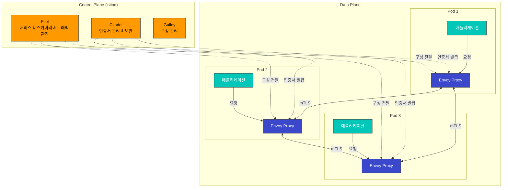

# Istio

Amazon EKS에서 Istio Service Mesh를 활용한 실용적인 가이드입니다.

## 목차

1. [설치 및 초기 설정](01-installation.md)
2. [기본 개념](02-basic-concepts.md)
3. [Traffic Management (트래픽 관리)](traffic-management/README.md)
4. [Security (보안)](security/README.md)
5. [Observability (관찰성)](observability/README.md)
6. [Resilience (복원력)](resilience/README.md)
7. [Advanced (고급 기능)](advanced/README.md)
8. [모범 사례](best-practices.md)

## Istio란?

Istio는 마이크로서비스를 연결, 보호, 제어 및 관찰하기 위한 오픈 소스 서비스 메시 플랫폼입니다. 복잡한 마이크로서비스 아키텍처에서 서비스 간 통신을 관리하고, 트래픽 제어, 보안, 관찰성을 제공합니다.

### 주요 기능

1. **트래픽 관리**
   - 지능형 라우팅 및 로드 밸런싱
   - A/B 테스트, Canary 배포, Blue/Green 배포
   - Circuit Breaking, Retry, Timeout 제어
   - Traffic Mirroring 및 Fault Injection

2. **보안**
   - 서비스 간 자동 mTLS 암호화
   - 강력한 인증 및 권한 부여
   - 세밀한 액세스 제어 정책
   - 네트워크 격리 및 보안 정책

3. **관찰성**
   - 자동 메트릭, 로그, 트레이스 생성
   - Prometheus, Grafana, Jaeger, Kiali 통합
   - 서비스 토폴로지 시각화
   - 실시간 트래픽 모니터링

4. **복원력**
   - Circuit Breaker 패턴
   - Rate Limiting
   - Outlier Detection
   - Zone Aware Routing

### Istio 아키텍처

Istio는 Control Plane과 Data Plane으로 구성됩니다:



**Control Plane (istiod)**:
- **Pilot**: 서비스 디스커버리, 트래픽 라우팅 규칙 관리
- **Citadel**: 인증서 생성 및 관리, mTLS 활성화
- **Galley**: 구성 검증 및 배포

**Data Plane**:
- **Envoy Proxy**: 각 파드에 사이드카로 배포되어 모든 네트워크 트래픽을 가로채고 제어

### Amazon EKS에서 Istio 사용의 이점

1. **간편한 마이크로서비스 관리**
   - 애플리케이션 코드 수정 없이 트래픽 관리
   - 선언적 구성으로 일관된 정책 적용
   - Kubernetes Native API 사용

2. **강화된 보안**
   - 서비스 간 자동 암호화
   - AWS IAM과 통합된 인증
   - 세밀한 권한 제어

3. **향상된 관찰성**
   - Amazon CloudWatch와 통합
   - AWS X-Ray를 통한 분산 추적
   - 상세한 메트릭 및 로그

4. **AWS 서비스와의 통합**
   - Application Load Balancer (ALB) 통합
   - AWS Certificate Manager (ACM) 통합
   - Amazon EBS CSI Driver와 호환

### 시작하기

Istio를 처음 사용하신다면 다음 순서로 문서를 읽어보세요:

1. **[설치 및 초기 설정](01-installation.md)**: EKS 클러스터에 Istio 설치
2. **[기본 개념](02-basic-concepts.md)**: Istio의 핵심 개념 이해
3. **[Traffic Management](traffic-management/README.md)**: Gateway, VirtualService, DestinationRule 학습
4. **[Security](security/README.md)**: mTLS, 인증, 권한 부여 설정
5. **[Observability](observability/README.md)**: 메트릭, 로그, 트레이스 수집
6. **[모범 사례](best-practices.md)**: 프로덕션 환경에서의 권장 사항

### 실습 예제

각 섹션에는 실제로 작동하는 YAML 예제가 포함되어 있습니다. 모든 예제는 다음과 같이 클릭하여 복사할 수 있도록 구성되어 있습니다:

```yaml
# 예제 VirtualService
apiVersion: networking.istio.io/v1beta1
kind: VirtualService
metadata:
  name: reviews
spec:
  hosts:
  - reviews
  http:
  - route:
    - destination:
        host: reviews
        subset: v1
```

### 참고 자료

- [Istio 공식 문서](https://istio.io/latest/docs/)
- [Istio GitHub](https://github.com/istio/istio)
- [AWS EKS 워크숍 - Istio](https://www.eksworkshop.com/intermediate/330_servicemesh_using_istio/)
- [Istio 커뮤니티](https://discuss.istio.io/)

### 퀴즈

이 장에서 배운 내용을 테스트하려면 다음 퀴즈를 풀어보세요:
- [Traffic Management 퀴즈](../../quizzes/tools/istio/traffic-management.md)
- [Security 퀴즈](../../quizzes/tools/istio/security.md)
- [Observability 퀴즈](../../quizzes/tools/istio/observability.md)
- [Resilience 퀴즈](../../quizzes/tools/istio/resilience.md)
- [Advanced 퀴즈](../../quizzes/tools/istio/advanced.md)
