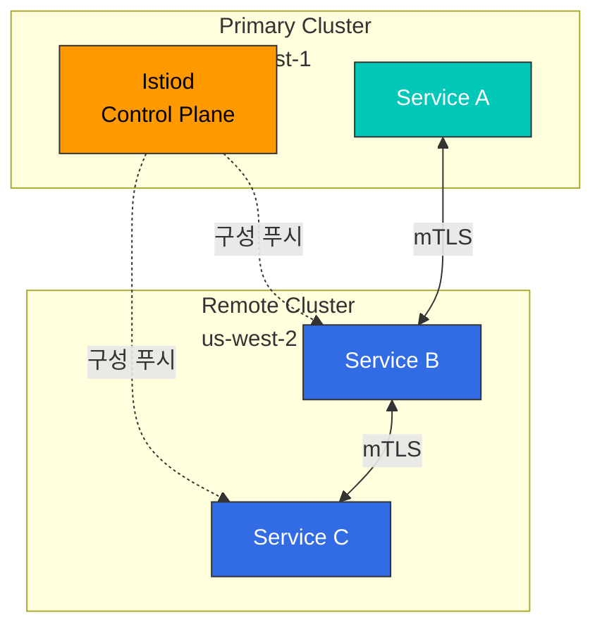
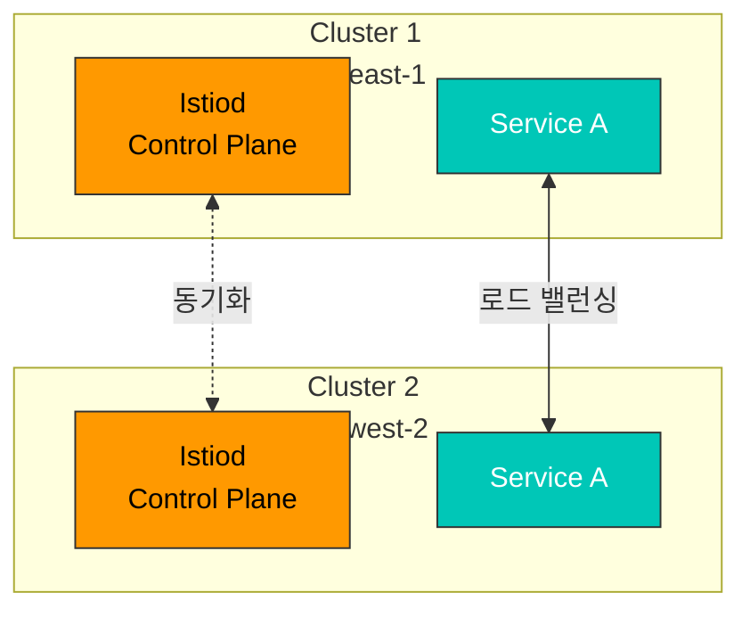

# Multi-cluster Service Mesh

Multi-cluster Service Mesh는 여러 Kubernetes 클러스터를 하나의 통합된 서비스 메시로 연결합니다.

## 목차

1. [개요](#개요)
2. [토폴로지](#토폴로지)
3. [Primary-Remote 설정](#primary-remote-설정)
4. [Multi-Primary 설정](#multi-primary-설정)
5. [Cross-cluster 통신](#cross-cluster-통신)
6. [실전 예제](#실전-예제)
7. [문제 해결](#문제-해결)

## 개요

Multi-cluster Service Mesh를 사용하면:
- 다중 리전 배포
- 재해 복구 (DR)
- 환경 분리 (dev/staging/prod)
- 클러스터 간 서비스 검색 및 통신

## 토폴로지

### Primary-Remote



**특징**:
- 하나의 Control Plane (Primary)
- 여러 Data Plane (Remote)
- 간단한 관리
- 단일 장애점 (Primary)

### Multi-Primary



**특징**:
- 여러 Control Plane
- 고가용성
- 복잡한 관리
- 리전별 자율성

## Primary-Remote 설정

### 1. Primary 클러스터 설정

```bash
# Context 설정
export CTX_CLUSTER1=cluster1

# Istio 설치
istioctl install --context="${CTX_CLUSTER1}" -f - <<EOF
apiVersion: install.istio.io/v1alpha1
kind: IstioOperator
spec:
  values:
    global:
      meshID: mesh1
      multiCluster:
        clusterName: cluster1
      network: network1
EOF

# East-West Gateway 설치
samples/multicluster/gen-eastwest-gateway.sh \
  --mesh mesh1 --cluster cluster1 --network network1 | \
  istioctl install --context="${CTX_CLUSTER1}" -y -f -

# Gateway 노출
kubectl apply --context="${CTX_CLUSTER1}" -f \
  samples/multicluster/expose-services.yaml
```

### 2. Remote 클러스터 설정

```bash
# Context 설정
export CTX_CLUSTER2=cluster2

# Remote Secret 생성
istioctl create-remote-secret \
  --context="${CTX_CLUSTER1}" \
  --name=cluster1 | \
  kubectl apply -f - --context="${CTX_CLUSTER2}"

# Remote 구성으로 Istio 설치
istioctl install --context="${CTX_CLUSTER2}" -f - <<EOF
apiVersion: install.istio.io/v1alpha1
kind: IstioOperator
spec:
  values:
    global:
      meshID: mesh1
      multiCluster:
        clusterName: cluster2
      network: network1
      remotePilotAddress: ${DISCOVERY_ADDRESS}
EOF
```

## Multi-Primary 설정

### 1. 두 클러스터 모두 Primary로 설정

```bash
# Cluster 1
istioctl install --context="${CTX_CLUSTER1}" -f - <<EOF
apiVersion: install.istio.io/v1alpha1
kind: IstioOperator
spec:
  values:
    global:
      meshID: mesh1
      multiCluster:
        clusterName: cluster1
      network: network1
EOF

# Cluster 2
istioctl install --context="${CTX_CLUSTER2}" -f - <<EOF
apiVersion: install.istio.io/v1alpha1
kind: IstioOperator
spec:
  values:
    global:
      meshID: mesh1
      multiCluster:
        clusterName: cluster2
      network: network2
EOF
```

### 2. Remote Secret 상호 등록

```bash
# Cluster 1의 Secret을 Cluster 2에
istioctl create-remote-secret \
  --context="${CTX_CLUSTER1}" \
  --name=cluster1 | \
  kubectl apply -f - --context="${CTX_CLUSTER2}"

# Cluster 2의 Secret을 Cluster 1에
istioctl create-remote-secret \
  --context="${CTX_CLUSTER2}" \
  --name=cluster2 | \
  kubectl apply -f - --context="${CTX_CLUSTER1}"
```

## Cross-cluster 통신

### Service Entry

```yaml
apiVersion: networking.istio.io/v1beta1
kind: ServiceEntry
metadata:
  name: httpbin-cluster2
spec:
  hosts:
  - httpbin.default.svc.cluster.local
  location: MESH_INTERNAL
  ports:
  - number: 8000
    name: http
    protocol: HTTP
  resolution: DNS
  addresses:
  - 240.0.0.1
  endpoints:
  - address: ${CLUSTER2_INGRESS_HOST}
    ports:
      http: 15443
```

## 문제 해결

```bash
# 클러스터 간 연결 확인
istioctl ps --context="${CTX_CLUSTER1}"
istioctl ps --context="${CTX_CLUSTER2}"

# Remote Secret 확인
kubectl get secrets -n istio-system --context="${CTX_CLUSTER1}"

# Cross-cluster 트래픽 확인
kubectl logs -n istio-system -l app=istiod --context="${CTX_CLUSTER1}"
```

## 참고 자료

- [Istio Multi-cluster](https://istio.io/latest/docs/setup/install/multicluster/)
- [Multi-Primary](https://istio.io/latest/docs/setup/install/multicluster/multi-primary/)
- [Primary-Remote](https://istio.io/latest/docs/setup/install/multicluster/primary-remote/)
