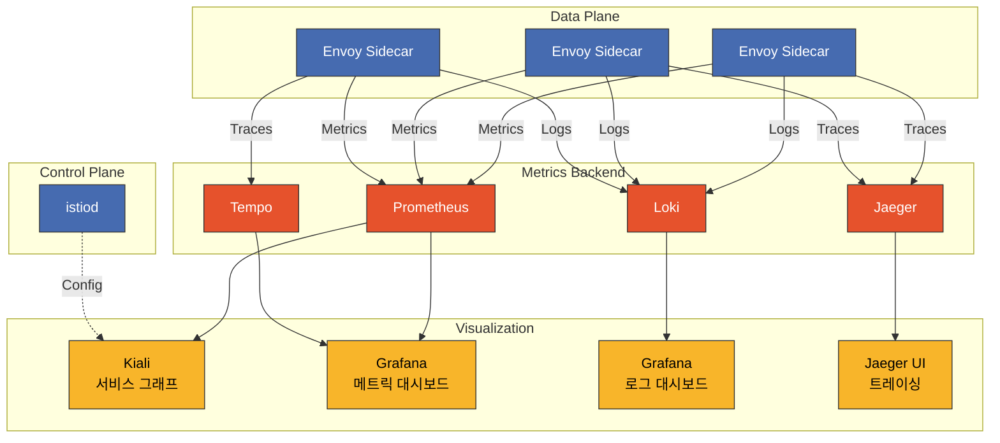

# Istio 대시보드

> **지원 버전**: Istio 1.28
> **마지막 업데이트**: 2025년 11월 26일

Grafana, Kiali, Prometheus를 통해 Istio 서비스 메시를 종합적으로 시각화하고 모니터링합니다.

## 목차

1. [대시보드 개요](#대시보드-개요)
2. [Kiali](#kiali)
3. [Grafana 대시보드](#grafana-대시보드)
4. [Prometheus](#prometheus)
5. [커스텀 대시보드 생성](#커스텀-대시보드-생성)
6. [대시보드 통합](#대시보드-통합)
7. [모범 사례](#모범-사례)

## 대시보드 개요

### 관찰성 스택 아키텍처



### 도구별 용도

| 도구 | 주요 용도 | 데이터 소스 |
|------|----------|------------|
| **Kiali** | 서비스 토폴로지, 트래픽 분석, 구성 검증 | Prometheus, Istio Config |
| **Grafana** | 메트릭 시각화, 알림, 로그 분석 | Prometheus, Loki, Tempo |
| **Prometheus** | 메트릭 수집 및 쿼리 | Envoy, istiod |
| **Jaeger** | 분산 추적 분석 | Envoy spans |

## Kiali

Kiali는 Istio 서비스 메시를 위한 관찰성 콘솔입니다.

### 프로덕션 배포

#### 1. Kiali Operator 설치

```bash
# Kiali Operator 배포
kubectl create namespace kiali-operator
kubectl apply -f https://raw.githubusercontent.com/kiali/kiali-operator/v1.79/deploy/kiali-operator.yaml

# 설치 확인
kubectl get pods -n kiali-operator
```

#### 2. Kiali CR 생성 (프로덕션 설정)

```yaml
apiVersion: kiali.io/v1alpha1
kind: Kiali
metadata:
  name: kiali
  namespace: istio-system
spec:
  # 배포 설정
  deployment:
    accessible_namespaces:
    - "**"  # 모든 네임스페이스 접근
    image_name: quay.io/kiali/kiali
    image_version: v1.79
    replicas: 2
    resources:
      requests:
        cpu: 100m
        memory: 256Mi
      limits:
        cpu: 500m
        memory: 1Gi

    # Ingress 설정
    ingress:
      enabled: true
      class_name: nginx
      override_yaml:
        metadata:
          annotations:
            cert-manager.io/cluster-issuer: letsencrypt-prod
        spec:
          rules:
          - host: kiali.example.com
            http:
              paths:
              - path: /
                pathType: Prefix
                backend:
                  service:
                    name: kiali
                    port:
                      number: 20001
          tls:
          - hosts:
            - kiali.example.com
            secretName: kiali-tls

  # 인증 설정
  auth:
    strategy: token  # token, openid, openshift, anonymous

  # 외부 서비스 연동
  external_services:
    # Prometheus
    prometheus:
      url: http://prometheus.istio-system:9090

    # Grafana
    grafana:
      enabled: true
      url: http://grafana.observability:3000
      in_cluster_url: http://grafana.observability:3000
      dashboards:
      - name: "Istio Service Dashboard"
        variables:
          namespace: "var-namespace"
          service: "var-service"
      - name: "Istio Workload Dashboard"
        variables:
          namespace: "var-namespace"
          workload: "var-workload"

    # Jaeger
    jaeger:
      enabled: true
      url: http://jaeger-query.observability:16686
      in_cluster_url: http://jaeger-query.observability:16686

    # Custom Dashboards
    custom_dashboards:
    - name: "Loki Istio Logs"
      title: "Istio Access Logs"
      runtime: Grafana
      template: "/dashboards/loki-istio.json"

  # Kiali 기능 설정
  kiali_feature_flags:
    # 검증 기능 활성화
    validations:
      ignore:
      - "KIA1301"  # 특정 검증 규칙 무시

    # UI 기능
    ui_defaults:
      graph:
        find_options:
        - description: "Find: slow edges (> 1s)"
          expression: "rt > 1000"
        - description: "Find: error edges (>= 5%)"
          expression: "error > 5"
        impl: cy  # cytoscape 그래프 엔진

      metrics_per_refresh: "1m"
      namespaces:
      - istio-system
      refresh_interval: "60s"
```

**배포**:
```bash
kubectl apply -f kiali-cr.yaml

# 설치 확인
kubectl get kiali -n istio-system
kubectl get pods -n istio-system -l app=kiali
```

### Kiali 접속

#### 개발 환경

```bash
# Port-forward로 접속
kubectl port-forward -n istio-system svc/kiali 20001:20001

# 브라우저: http://localhost:20001
```

#### 프로덕션 환경 (Token 인증)

```bash
# ServiceAccount Token 생성
kubectl create token kiali -n istio-system --duration=24h

# Token으로 로그인
# 브라우저: https://kiali.example.com
# Username: (비워둠)
# Token: (위에서 생성한 토큰)
```

### Kiali 주요 기능

#### 1. 서비스 그래프 (Graph)

**Overview**:
- 네임스페이스별 서비스 토폴로지 시각화
- 트래픽 흐름 및 요청률(RPS) 표시
- 에러율 및 응답 시간 시각화
- 버전별 트래픽 분산 확인

**그래프 뷰 타입**:

| 뷰 타입 | 설명 | 사용 시나리오 |
|---------|------|--------------|
| **App Graph** | 애플리케이션 단위 | 서비스 간 의존성 파악 |
| **Versioned App Graph** | 버전별 애플리케이션 | 카나리 배포 모니터링 |
| **Workload Graph** | 워크로드 단위 | Deployment/StatefulSet 레벨 분석 |
| **Service Graph** | 서비스 단위 | Kubernetes Service 중심 뷰 |

**그래프 필터 옵션**:

```yaml
# Edge 레이블 표시
- Request percentage: 트래픽 분산율 (%)
- Request rate: 요청률 (RPS)
- Response time: P95 응답 시간
- Throughput: 처리량 (bytes/sec)

# Display 옵션
- Traffic Animation: 실시간 트래픽 흐름
- Service Nodes: 서비스 노드 표시
- Traffic Distribution: 버전별 트래픽 분산
- Security: mTLS 잠금 아이콘
- Circuit Breakers: Circuit breaker 상태
- Virtual Services: VirtualService 아이콘
```

**Find/Hide 기능**:
```
# 느린 엣지 찾기
Find: response time > 1s
Expression: rt > 1000

# 에러가 있는 엣지 찾기
Find: error rate >= 5%
Expression: error >= 5

# 특정 서비스 숨기기
Hide: kube-system namespace
```

#### 2. 애플리케이션 뷰 (Applications)

각 애플리케이션의 상세 정보:

- **Overview**: 전체 상태 요약
- **Traffic**: 인바운드/아웃바운드 트래픽 메트릭
  - Request volume (RPS)
  - Request duration (P50, P95, P99)
  - Request size / Response size
- **Inbound Metrics**: 들어오는 트래픽 분석
  - Source workloads
  - Request protocols (HTTP/gRPC/TCP)
  - Response codes
- **Outbound Metrics**: 나가는 트래픽 분석
  - Destination services
  - Response times
  - Error rates

#### 3. 워크로드 뷰 (Workloads)

Deployment, StatefulSet 등 워크로드별 상세 정보:

- **Pods**: 파드 목록 및 상태
- **Services**: 연결된 Service 목록
- **Logs**: 실시간 파드 로그 (Envoy + 애플리케이션)
- **Metrics**: 워크로드 메트릭
  - Request volume
  - Duration (P50/P95/P99)
  - Error rate
- **Traces**: Jaeger 연동 분산 추적
- **Envoy**: Envoy 설정 확인
  - Clusters
  - Listeners
  - Routes
  - Bootstrap config

#### 4. 서비스 뷰 (Services)

Kubernetes Service별 상세 정보:

- **Overview**: 서비스 메타데이터
- **Traffic**: 트래픽 메트릭
- **Inbound Metrics**: 클라이언트별 요청 분석
- **Traces**: 서비스 호출 추적

#### 5. Istio 구성 검증 (Istio Config)

모든 Istio 리소스 검증 및 관리:

**검증 대상**:
- VirtualService
- DestinationRule
- Gateway
- ServiceEntry
- Sidecar
- PeerAuthentication
- RequestAuthentication
- AuthorizationPolicy
- Telemetry

**검증 수준**:

| 아이콘 | 수준 | 설명 |
|--------|------|------|
| ✅ | Valid | 구성이 올바름 |
| ⚠️ | Warning | 잠재적 문제 (권장사항 위반) |
| ❌ | Error | 구성 오류 (적용 실패) |

**일반적인 검증 오류 예시**:

```yaml
# KIA0101: DestinationRule과 VirtualService가 같은 host를 참조하지 않음
---
apiVersion: networking.istio.io/v1beta1
kind: VirtualService
metadata:
  name: reviews
spec:
  hosts:
  - reviews  # ❌ DestinationRule의 host와 불일치
  http:
  - route:
    - destination:
        host: reviews
        subset: v1
---
apiVersion: networking.istio.io/v1beta1
kind: DestinationRule
metadata:
  name: reviews
spec:
  host: reviews.default.svc.cluster.local  # ⚠️ FQDN 사용
  subsets:
  - name: v1
    labels:
      version: v1
```

**수정된 버전**:
```yaml
# 두 리소스 모두 FQDN 사용
apiVersion: networking.istio.io/v1beta1
kind: VirtualService
metadata:
  name: reviews
spec:
  hosts:
  - reviews.default.svc.cluster.local  # ✅
  http:
  - route:
    - destination:
        host: reviews.default.svc.cluster.local
        subset: v1
---
apiVersion: networking.istio.io/v1beta1
kind: DestinationRule
metadata:
  name: reviews
spec:
  host: reviews.default.svc.cluster.local  # ✅
  subsets:
  - name: v1
    labels:
      version: v1
```

#### 6. 보안 (Security)

**mTLS 상태 확인**:

Kiali 그래프에서 mTLS 상태를 시각적으로 확인:

- 🔒 **잠금 아이콘**: mTLS 활성화
- 🔓 **열린 잠금**: mTLS 비활성화
- ⚠️ **경고 아이콘**: 부분적 mTLS (PERMISSIVE)

**보안 대시보드**:
- Namespace별 mTLS 상태
- PeerAuthentication 정책 적용 현황
- AuthorizationPolicy 효과

#### 7. 분산 추적 통합 (Distributed Tracing)

Kiali는 Jaeger와 통합되어 서비스 그래프에서 바로 trace를 확인할 수 있습니다.

**사용 방법**:
1. 그래프에서 서비스 노드 클릭
2. "View Traces" 링크 클릭
3. Jaeger UI로 자동 이동하여 해당 서비스의 trace 확인

### Kiali 고급 기능

#### Traffic Shifting 시각화

```yaml
# 카나리 배포 VirtualService
apiVersion: networking.istio.io/v1beta1
kind: VirtualService
metadata:
  name: reviews-canary
spec:
  hosts:
  - reviews
  http:
  - route:
    - destination:
        host: reviews
        subset: v1
      weight: 90  # Kiali에서 90% 표시
    - destination:
        host: reviews
        subset: v2
      weight: 10  # Kiali에서 10% 표시
```

Kiali 그래프는 실시간 트래픽 분산율을 엣지 레이블로 표시합니다.

#### Namespace 격리 및 접근 제어

```yaml
# 특정 네임스페이스만 접근 가능한 Kiali
apiVersion: kiali.io/v1alpha1
kind: Kiali
metadata:
  name: kiali-team-a
  namespace: team-a
spec:
  deployment:
    accessible_namespaces:
    - team-a
    - istio-system
  auth:
    strategy: openid
    openid:
      client_id: kiali-team-a
      issuer_uri: https://keycloak.example.com/auth/realms/kubernetes
```

## Grafana 대시보드

### 공식 Istio 대시보드

Istio는 다음과 같은 공식 Grafana 대시보드를 제공합니다:

#### 1. Istio Mesh Dashboard

**목적**: 전체 메시 상태 개요

**주요 패널**:
- Global Request Volume
- Global Success Rate (non-5xx responses)
- 4xx Response Codes
- 5xx Response Codes
- Average Response Time
- P50/P90/P95/P99 Latency

**접속**:
```bash
# Grafana UI에서
Dashboards → Istio → Istio Mesh Dashboard
```

#### 2. Istio Service Dashboard

**목적**: 서비스별 메트릭 상세 분석

**주요 패널**:
- Service Request Volume
- Service Success Rate
- Service Request Duration (Percentiles)
- Incoming Request By Source
- Outgoing Request By Destination
- Service Workloads

**변수**:
- `$namespace`: 네임스페이스 선택
- `$service`: 서비스 선택

#### 3. Istio Workload Dashboard

**목적**: 워크로드 (Deployment/StatefulSet) 메트릭

**주요 패널**:
- Workload Request Volume
- Workload Success Rate
- Workload Request Duration
- Incoming Requests by Source
- Outgoing Requests by Destination
- TCP Sent/Received Bytes

**변수**:
- `$namespace`: 네임스페이스
- `$workload`: 워크로드 이름

#### 4. Istio Performance Dashboard

**목적**: Istio 컴포넌트 성능 모니터링

**주요 패널**:
- Pilot Metrics
  - Proxy Push Time
  - Pilot XDS Pushes
  - Pilot XDS Errors
- Envoy Proxy Metrics
  - Memory Usage
  - CPU Usage
  - Active Connections

#### 5. Istio Control Plane Dashboard

**목적**: istiod 상태 모니터링

**주요 패널**:
- Pilot Memory
- Pilot CPU
- Pilot Goroutines
- Configuration Validation Errors
- Push Queue Depth
- XDS Push Time

### Grafana Loki Dashboard for Istio (#14876)

**Dashboard ID**: 14876
**URL**: https://grafana.com/grafana/dashboards/14876

이 대시보드는 Grafana Loki를 사용하여 Istio Access Log를 분석합니다.

#### 설치 방법

**1. Grafana UI에서 Import**:

```bash
# Grafana 접속
kubectl port-forward -n observability svc/grafana 3000:3000

# 브라우저: http://localhost:3000
# 1. Dashboards → Import
# 2. Dashboard ID 입력: 14876
# 3. Loki 데이터소스 선택
# 4. Import 클릭
```

**2. JSON 파일로 Import** (자동화):

```bash
# Dashboard JSON 다운로드
curl -o istio-loki-dashboard.json \
  https://grafana.com/api/dashboards/14876/revisions/latest/download

# ConfigMap으로 배포
kubectl create configmap grafana-dashboard-loki-istio \
  --from-file=istio-loki-dashboard.json \
  -n observability \
  --dry-run=client -o yaml | kubectl apply -f -

# Grafana에 자동 로드되도록 라벨 추가
kubectl label configmap grafana-dashboard-loki-istio \
  -n observability \
  grafana_dashboard=1
```

#### 주요 패널

**1. Overview Panels**:
- **Total Requests**: 총 요청 수
- **Request Rate**: 초당 요청 수 (RPS)
- **Error Rate**: 5xx 에러율
- **P95 Latency**: 95 백분위수 지연시간

**2. Traffic Analysis**:
- **Top Services by Request Volume**: 요청량 상위 서비스
- **Request Rate by Service**: 서비스별 요청 추이
- **Response Code Distribution**: HTTP 상태 코드 분포

**3. Performance Metrics**:
- **Latency Heatmap**: 응답 시간 분포 히트맵
- **P50/P95/P99 Latency**: 백분위수별 지연시간
- **Slow Requests**: 느린 요청 목록 (> 1s)

**4. Error Analysis**:
- **4xx Errors**: 클라이언트 오류 (잘못된 요청)
- **5xx Errors**: 서버 오류 (내부 에러)
- **Error Logs**: 에러 로그 상세 내용

**5. Security**:
- **mTLS Usage**: mTLS 사용률
- **Non-mTLS Traffic**: mTLS 미사용 트래픽 경고

#### LogQL 쿼리 예제

이 대시보드에서 사용하는 LogQL 쿼리:

```logql
# 요청률
sum(rate({container="istio-proxy"} | json [5m]))

# 에러율
sum(rate({container="istio-proxy"} | json | response_code >= "500" [5m]))
/
sum(rate({container="istio-proxy"} | json [5m]))

# P95 레이턴시
quantile_over_time(0.95, {container="istio-proxy"} | json | unwrap duration [5m])

# 서비스별 요청 분포
sum(count_over_time({container="istio-proxy"} | json [5m])) by (destination_service_name)

# 느린 요청 찾기
{container="istio-proxy"}
| json
| duration > 1000
| line_format "{{.method}} {{.path}} - {{.duration}}ms"
```

### 추가 커뮤니티 대시보드

#### Istio Workload Dashboard (#7636)

**URL**: https://grafana.com/grafana/dashboards/7636

워크로드 중심 메트릭:
- Request Volume
- Request Duration
- Request Size
- Response Size
- TCP Connections

**Import**:
```bash
# Dashboard ID: 7636
Dashboards → Import → 7636 → Load
```

#### Istio Service Mesh Dashboard (#11829)

**URL**: https://grafana.com/grafana/dashboards/11829

전체 메시 개요:
- Service Graph 데이터
- Golden Signals (Latency, Traffic, Errors, Saturation)
- Control Plane 상태

#### Istio Gateway Dashboard (#13277)

**URL**: https://grafana.com/grafana/dashboards/13277

Ingress/Egress Gateway 모니터링:
- Gateway Request Volume
- Gateway Latency
- TLS Handshake Errors
- Connection Metrics

### Grafana Alerting

#### Alert Rules for Istio

```yaml
apiVersion: v1
kind: ConfigMap
metadata:
  name: grafana-alerting
  namespace: observability
data:
  istio-alerts.yaml: |
    groups:
    - name: istio-service-alerts
      interval: 1m
      rules:
      # 높은 에러율
      - alert: HighErrorRate
        expr: |
          (sum(rate(istio_requests_total{response_code=~"5..", reporter="destination"}[5m])) by (destination_service_name)
          /
          sum(rate(istio_requests_total{reporter="destination"}[5m])) by (destination_service_name))
          * 100 > 5
        for: 2m
        labels:
          severity: critical
        annotations:
          summary: "High error rate for {{ $labels.destination_service_name }}"
          description: "Error rate is {{ $value | humanizePercentage }}"

      # 높은 레이턴시
      - alert: HighLatency
        expr: |
          histogram_quantile(0.95,
            sum(rate(istio_request_duration_milliseconds_bucket{reporter="destination"}[5m]))
            by (destination_service_name, le)
          ) > 1000
        for: 5m
        labels:
          severity: warning
        annotations:
          summary: "High P95 latency for {{ $labels.destination_service_name }}"
          description: "P95 latency is {{ $value }}ms"

      # Circuit Breaker 발동
      - alert: CircuitBreakerTriggered
        expr: |
          rate(istio_requests_total{response_flags=~".*UO.*", reporter="destination"}[1m]) > 0
        for: 1m
        labels:
          severity: warning
        annotations:
          summary: "Circuit breaker triggered for {{ $labels.destination_service_name }}"
          description: "Requests are being rejected by circuit breaker"

      # mTLS 미사용 트래픽
      - alert: NonMTLSTraffic
        expr: |
          sum(rate(istio_requests_total{connection_security_policy="none", reporter="destination"}[5m])) by (source_workload, destination_workload) > 0
        for: 5m
        labels:
          severity: warning
        annotations:
          summary: "Non-mTLS traffic detected"
          description: "{{ $labels.source_workload }} → {{ $labels.destination_workload }} is not using mTLS"
```

## Prometheus

### 프로덕션 배포

#### Prometheus Operator 사용

```yaml
apiVersion: monitoring.coreos.com/v1
kind: Prometheus
metadata:
  name: istio
  namespace: istio-system
spec:
  replicas: 2
  retention: 15d
  retentionSize: "50GB"

  serviceAccountName: prometheus
  serviceMonitorSelector:
    matchLabels:
      monitoring: istio

  podMonitorSelector:
    matchLabels:
      monitoring: istio-proxies

  resources:
    requests:
      cpu: 1000m
      memory: 4Gi
    limits:
      cpu: 2000m
      memory: 8Gi

  storage:
    volumeClaimTemplate:
      spec:
        accessModes:
        - ReadWriteOnce
        resources:
          requests:
            storage: 100Gi
        storageClassName: gp3

  # Remote Write (장기 스토리지)
  remoteWrite:
  - url: http://victoria-metrics:8428/api/v1/write
    queueConfig:
      capacity: 10000
      maxShards: 5
      minShards: 1
      maxSamplesPerSend: 5000
```

### Prometheus Query 예제

#### Golden Signals

```promql
# 1. Latency (지연시간)
histogram_quantile(0.95,
  sum(rate(istio_request_duration_milliseconds_bucket{
    reporter="destination"
  }[5m])) by (destination_service_name, le)
)

# 2. Traffic (트래픽)
sum(rate(istio_requests_total{reporter="destination"}[1m])) by (destination_service_name)

# 3. Errors (에러율)
sum(rate(istio_requests_total{response_code=~"5..", reporter="destination"}[5m])) by (destination_service_name)
/
sum(rate(istio_requests_total{reporter="destination"}[5m])) by (destination_service_name)
* 100

# 4. Saturation (포화도)
envoy_cluster_upstream_cx_active / envoy_cluster_circuit_breakers_default_cx_max * 100
```

## 커스텀 대시보드 생성

### Grafana Dashboard JSON 템플릿

```json
{
  "dashboard": {
    "title": "Custom Istio Service Dashboard",
    "tags": ["istio", "custom"],
    "timezone": "browser",
    "schemaVersion": 38,
    "version": 1,

    "panels": [
      {
        "id": 1,
        "title": "Request Rate",
        "type": "timeseries",
        "gridPos": {"h": 8, "w": 12, "x": 0, "y": 0},
        "targets": [
          {
            "expr": "sum(rate(istio_requests_total{destination_service_name=\"$service\"}[5m])) by (response_code)",
            "legendFormat": "{{ response_code }}",
            "refId": "A"
          }
        ],
        "fieldConfig": {
          "defaults": {
            "color": {"mode": "palette-classic"},
            "custom": {
              "drawStyle": "line",
              "lineInterpolation": "linear",
              "fillOpacity": 10
            },
            "unit": "reqps"
          }
        }
      },

      {
        "id": 2,
        "title": "P95 Latency",
        "type": "gauge",
        "gridPos": {"h": 8, "w": 6, "x": 12, "y": 0},
        "targets": [
          {
            "expr": "histogram_quantile(0.95, sum(rate(istio_request_duration_milliseconds_bucket{destination_service_name=\"$service\"}[5m])) by (le))",
            "refId": "A"
          }
        ],
        "fieldConfig": {
          "defaults": {
            "unit": "ms",
            "thresholds": {
              "mode": "absolute",
              "steps": [
                {"value": 0, "color": "green"},
                {"value": 500, "color": "yellow"},
                {"value": 1000, "color": "red"}
              ]
            },
            "max": 2000
          }
        },
        "options": {
          "showThresholdLabels": true,
          "showThresholdMarkers": true
        }
      },

      {
        "id": 3,
        "title": "Error Rate",
        "type": "stat",
        "gridPos": {"h": 8, "w": 6, "x": 18, "y": 0},
        "targets": [
          {
            "expr": "sum(rate(istio_requests_total{destination_service_name=\"$service\", response_code=~\"5..\"}[5m])) / sum(rate(istio_requests_total{destination_service_name=\"$service\"}[5m])) * 100",
            "refId": "A"
          }
        ],
        "fieldConfig": {
          "defaults": {
            "unit": "percent",
            "thresholds": {
              "mode": "absolute",
              "steps": [
                {"value": 0, "color": "green"},
                {"value": 1, "color": "yellow"},
                {"value": 5, "color": "red"}
              ]
            }
          }
        }
      },

      {
        "id": 4,
        "title": "Request by Source",
        "type": "table",
        "gridPos": {"h": 8, "w": 12, "x": 0, "y": 8},
        "targets": [
          {
            "expr": "sum(rate(istio_requests_total{destination_service_name=\"$service\"}[5m])) by (source_workload, response_code)",
            "format": "table",
            "instant": true,
            "refId": "A"
          }
        ],
        "transformations": [
          {
            "id": "organize",
            "options": {
              "excludeByName": {"Time": true},
              "indexByName": {
                "source_workload": 0,
                "response_code": 1,
                "Value": 2
              },
              "renameByName": {
                "source_workload": "Source",
                "response_code": "Code",
                "Value": "RPS"
              }
            }
          }
        ]
      },

      {
        "id": 5,
        "title": "Circuit Breaker Status",
        "type": "timeseries",
        "gridPos": {"h": 8, "w": 12, "x": 12, "y": 8},
        "targets": [
          {
            "expr": "sum(rate(istio_requests_total{destination_service_name=\"$service\", response_flags=~\".*UO.*\"}[5m]))",
            "legendFormat": "Circuit Breaker Open",
            "refId": "A"
          },
          {
            "expr": "sum(rate(istio_requests_total{destination_service_name=\"$service\", response_flags=~\".*URX.*\"}[5m]))",
            "legendFormat": "Rejected by CB",
            "refId": "B"
          }
        ]
      }
    ],

    "templating": {
      "list": [
        {
          "name": "namespace",
          "type": "query",
          "query": "label_values(istio_requests_total, destination_service_namespace)",
          "datasource": "Prometheus",
          "current": {"selected": true, "text": "default", "value": "default"},
          "multi": false
        },
        {
          "name": "service",
          "type": "query",
          "query": "label_values(istio_requests_total{destination_service_namespace=\"$namespace\"}, destination_service_name)",
          "datasource": "Prometheus",
          "current": {},
          "multi": false
        }
      ]
    },

    "time": {
      "from": "now-1h",
      "to": "now"
    },
    "refresh": "30s"
  }
}
```

### 대시보드 자동 배포

```yaml
apiVersion: v1
kind: ConfigMap
metadata:
  name: grafana-dashboard-custom-istio
  namespace: observability
  labels:
    grafana_dashboard: "1"
data:
  custom-istio-service.json: |
    {
      "dashboard": {
        "title": "Custom Istio Service Dashboard",
        ...
      }
    }
```

**Grafana 설정**:
```yaml
# Grafana Deployment의 sidecar 설정
apiVersion: apps/v1
kind: Deployment
metadata:
  name: grafana
spec:
  template:
    spec:
      containers:
      - name: grafana-sc-dashboard
        image: quay.io/kiwigrid/k8s-sidecar:1.25.2
        env:
        - name: LABEL
          value: "grafana_dashboard"
        - name: FOLDER
          value: "/tmp/dashboards"
        - name: NAMESPACE
          value: "ALL"
        volumeMounts:
        - name: sc-dashboard-volume
          mountPath: /tmp/dashboards
```

## 대시보드 통합

### Kiali → Grafana 링크

Kiali에서 Grafana 대시보드로 원클릭 이동:

```yaml
# Kiali CR 설정
external_services:
  grafana:
    enabled: true
    url: http://grafana.observability:3000
    dashboards:
    - name: "Istio Service Dashboard"
      variables:
        namespace: "var-namespace"
        service: "var-service"
    - name: "Istio Workload Dashboard"
      variables:
        namespace: "var-namespace"
        workload: "var-workload"
```

**사용 방법**:
1. Kiali에서 서비스 클릭
2. "Metrics" 탭의 "View in Grafana" 링크 클릭
3. 자동으로 Grafana 대시보드로 이동 (네임스페이스, 서비스 변수 자동 설정)

### Grafana → Jaeger 링크

Grafana에서 로그/메트릭을 보다가 트레이스로 이동:

```yaml
# Prometheus 데이터소스 설정
apiVersion: v1
kind: ConfigMap
metadata:
  name: grafana-datasources
data:
  prometheus.yaml: |
    apiVersion: 1
    datasources:
    - name: Prometheus
      type: prometheus
      jsonData:
        exemplarTraceIdDestinations:
        - datasourceUid: jaeger
          name: TraceID
          urlDisplayLabel: "View Trace"
```

### Loki → Tempo 통합

로그에서 트레이스로 점프:

```yaml
# Loki 데이터소스 설정
apiVersion: 1
datasources:
- name: Loki
  type: loki
  jsonData:
    derivedFields:
    - datasourceUid: tempo
      matcherRegex: '"request_id":"([^"]+)"'
      name: TraceID
      url: '$${__value.raw}'
      urlDisplayLabel: 'View Trace'
```

## 모범 사례

### 1. 대시보드 조직

```
Grafana 폴더 구조:
├── Istio/
│   ├── Overview/
│   │   ├── Istio Mesh Dashboard
│   │   └── Istio Control Plane Dashboard
│   ├── Services/
│   │   ├── Istio Service Dashboard
│   │   └── Custom Service Dashboards
│   ├── Workloads/
│   │   └── Istio Workload Dashboard
│   ├── Gateways/
│   │   └── Istio Gateway Dashboard
│   └── Logs/
│       ├── Loki Istio Dashboard (#14876)
│       └── Access Log Analysis
```

### 2. 변수 사용

모든 대시보드에 일관된 변수 사용:

```json
{
  "templating": {
    "list": [
      {"name": "datasource", "type": "datasource"},
      {"name": "namespace", "type": "query"},
      {"name": "service", "type": "query"},
      {"name": "workload", "type": "query"},
      {"name": "interval", "type": "interval", "auto": true}
    ]
  }
}
```

### 3. Alert 관리

- **계층별 알림**: Critical (PagerDuty) → Warning (Slack) → Info (Email)
- **Alert Grouping**: 서비스별, 네임스페이스별 그룹화
- **Silencing Rules**: 유지보수 중 알림 음소거

### 4. 성능 최적화

```yaml
# Grafana 설정
[dashboards]
min_refresh_interval = 10s

[panels]
disable_sanitize_html = false

[dataproxy]
timeout = 30
```

**쿼리 최적화**:
- Recording Rules 사용하여 자주 사용하는 쿼리 사전 계산
- `$__interval` 변수로 동적 시간 범위 조정
- `rate()` 대신 `increase()` 사용 (카운터가 리셋되지 않는 경우)

### 5. 접근 제어

```yaml
# Grafana RBAC
apiVersion: v1
kind: ConfigMap
metadata:
  name: grafana-config
data:
  grafana.ini: |
    [auth]
    disable_login_form = false

    [auth.anonymous]
    enabled = false

    [auth.basic]
    enabled = true

    [users]
    allow_sign_up = false
    auto_assign_org = true
    auto_assign_org_role = Viewer

    [security]
    admin_user = admin
    admin_password = ${GF_SECURITY_ADMIN_PASSWORD}
```

### 6. 백업 및 복구

```bash
# Grafana 대시보드 백업
kubectl exec -n observability grafana-xxx -- \
  grafana-cli admin export-dashboard > dashboards-backup.json

# Prometheus 데이터 백업
kubectl exec -n istio-system prometheus-xxx -- \
  promtool tsdb snapshot /prometheus
```

## 참고 자료

### 공식 문서
- [Kiali Documentation](https://kiali.io/docs/)
- [Istio Observability](https://istio.io/latest/docs/tasks/observability/)
- [Grafana Dashboards](https://grafana.com/grafana/dashboards/)
- [Prometheus Operator](https://prometheus-operator.dev/)

### 커뮤니티 대시보드
- [Grafana Loki Dashboard for Istio (#14876)](https://grafana.com/grafana/dashboards/14876)
- [Istio Workload Dashboard (#7636)](https://grafana.com/grafana/dashboards/7636)
- [Istio Service Mesh Dashboard (#11829)](https://grafana.com/grafana/dashboards/11829)
- [Istio Gateway Dashboard (#13277)](https://grafana.com/grafana/dashboards/13277)

### 참고 자료
- [Kiali Architecture](https://kiali.io/docs/architecture/architecture/)
- [Grafana Best Practices](https://grafana.com/docs/grafana/latest/best-practices/)
- [Prometheus Query Examples](https://prometheus.io/docs/prometheus/latest/querying/examples/)
