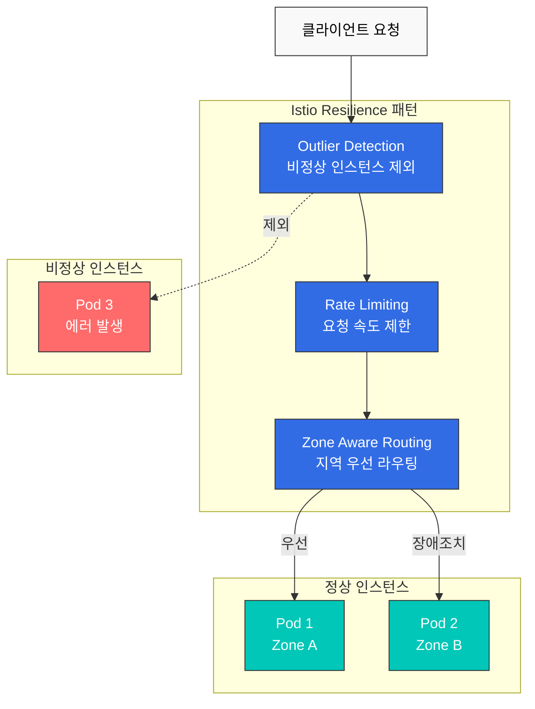
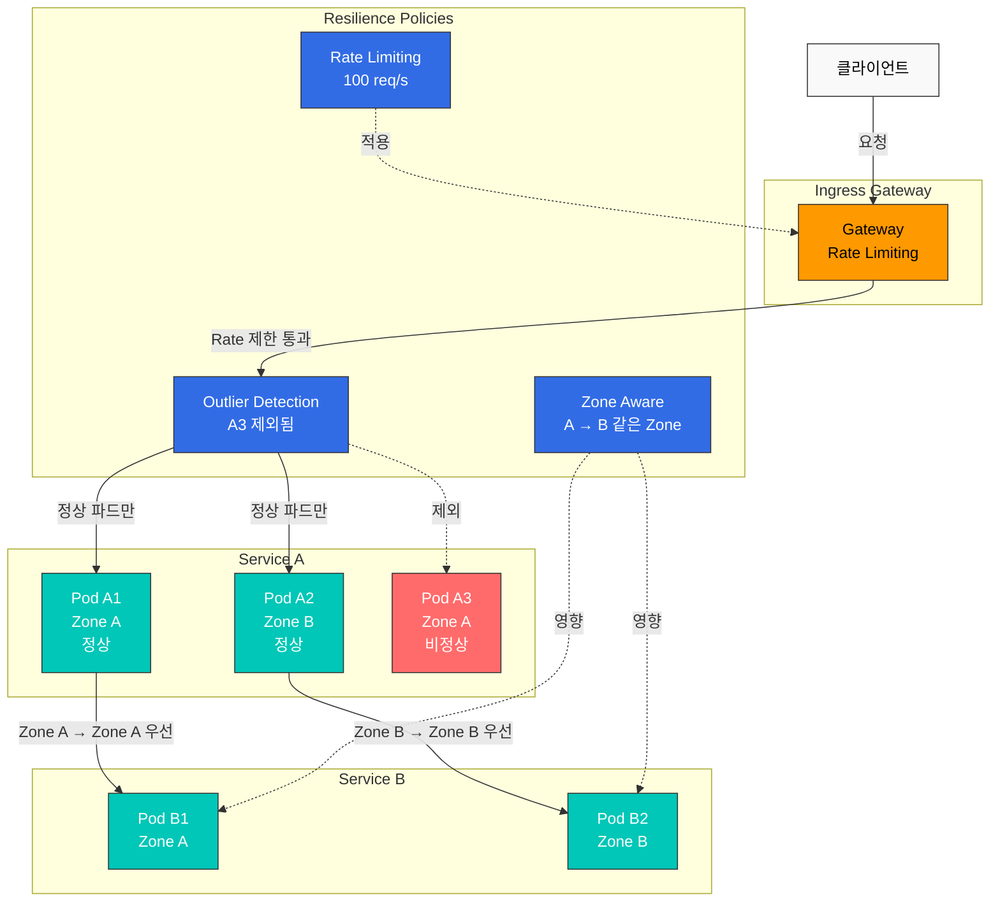

# Resilience

Istio의 복원력(Resilience) 기능은 서비스 메시가 장애 상황에서도 안정적으로 동작하도록 보장합니다.

## 목차

1. [Outlier Detection](01-outlier-detection.md)
2. [Rate Limiting](02-rate-limiting.md)
3. [Zone Aware Routing](03-zone-aware-routing.md)

## 개요

복원력은 분산 시스템에서 매우 중요한 특성입니다. Istio는 다양한 복원력 패턴을 자동으로 구현할 수 있습니다.

### 핵심 복원력 패턴



### 1. Outlier Detection (이상 감지)

비정상 동작을 하는 서비스 인스턴스를 자동으로 감지하고 트래픽 풀에서 제외합니다.

```yaml
apiVersion: networking.istio.io/v1beta1
kind: DestinationRule
metadata:
  name: myapp
spec:
  host: myapp
  trafficPolicy:
    outlierDetection:
      consecutiveErrors: 5
      interval: 30s
      baseEjectionTime: 30s
      maxEjectionPercent: 50
```

**주요 기능**:
- 연속된 오류 감지
- 자동 제외 및 복구
- Circuit Breaker와 함께 작동

### 2. Rate Limiting (요청 속도 제한)

서비스를 과부하로부터 보호하기 위해 요청 속도를 제한합니다.

```yaml
apiVersion: networking.istio.io/v1beta1
kind: EnvoyFilter
metadata:
  name: ratelimit
spec:
  configPatches:
  - applyTo: HTTP_FILTER
    match:
      context: SIDECAR_INBOUND
    patch:
      operation: INSERT_BEFORE
      value:
        name: envoy.filters.http.local_ratelimit
        typed_config:
          "@type": type.googleapis.com/envoy.extensions.filters.http.local_ratelimit.v3.LocalRateLimit
          stat_prefix: http_local_rate_limiter
          token_bucket:
            max_tokens: 100
            tokens_per_fill: 10
            fill_interval: 1s
```

**주요 기능**:
- Token Bucket 알고리즘
- 로컬 및 글로벌 Rate Limiting
- 클라이언트별, 경로별 제한

### 3. Zone Aware Routing (지역 인식 라우팅)

가용 영역(Availability Zone) 간 트래픽을 최적화하여 지연시간을 줄이고 비용을 절감합니다.

```yaml
apiVersion: networking.istio.io/v1beta1
kind: DestinationRule
metadata:
  name: myapp
spec:
  host: myapp
  trafficPolicy:
    loadBalancer:
      localityLbSetting:
        enabled: true
        distribute:
        - from: us-east-1a/*
          to:
            "us-east-1a/*": 80
            "us-east-1b/*": 20
```

**주요 기능**:
- 같은 AZ 내 트래픽 우선
- 크로스 AZ 비용 절감
- 장애 시 자동 장애조치

## 복원력 패턴 조합

### Outlier Detection + Circuit Breaker

```yaml
apiVersion: networking.istio.io/v1beta1
kind: DestinationRule
metadata:
  name: myapp-resilient
spec:
  host: myapp
  trafficPolicy:
    # Connection Pool (Circuit Breaker)
    connectionPool:
      tcp:
        maxConnections: 100
      http:
        http1MaxPendingRequests: 50
        maxRequestsPerConnection: 2

    # Outlier Detection
    outlierDetection:
      consecutiveErrors: 5
      interval: 30s
      baseEjectionTime: 30s
      maxEjectionPercent: 50
      minHealthPercent: 50
```

### Rate Limiting + Retry

```yaml
apiVersion: networking.istio.io/v1beta1
kind: VirtualService
metadata:
  name: myapp
spec:
  hosts:
  - myapp
  http:
  - route:
    - destination:
        host: myapp
    retries:
      attempts: 3
      perTryTimeout: 2s
      retryOn: 5xx,reset,connect-failure
    timeout: 10s
---
apiVersion: networking.istio.io/v1beta1
kind: EnvoyFilter
metadata:
  name: ratelimit
spec:
  workloadSelector:
    labels:
      app: myapp
  configPatches:
  - applyTo: HTTP_FILTER
    match:
      context: SIDECAR_INBOUND
    patch:
      operation: INSERT_BEFORE
      value:
        name: envoy.filters.http.local_ratelimit
        typed_config:
          "@type": type.googleapis.com/envoy.extensions.filters.http.local_ratelimit.v3.LocalRateLimit
          stat_prefix: http_local_rate_limiter
          token_bucket:
            max_tokens: 1000
            tokens_per_fill: 100
            fill_interval: 1s
```

## 복원력 아키텍처



## 복원력 메트릭

### Prometheus 쿼리

```promql
# Outlier Detection: 제외된 인스턴스 수
envoy_cluster_outlier_detection_ejections_active

# Rate Limiting: 제한된 요청 수
rate(envoy_http_local_rate_limit_rate_limited[5m])

# Zone Aware: Zone 간 트래픽 비율
sum(rate(istio_requests_total[5m])) by (source_zone, destination_zone)

# Circuit Breaker: 열린 회로 수
envoy_cluster_circuit_breakers_default_rq_open
```

## 모범 사례

### 1. Outlier Detection 임계값 조정

```yaml
# ✅ 서비스 특성에 맞게 조정
outlierDetection:
  consecutiveErrors: 5          # 5회 연속 실패
  interval: 30s                 # 30초마다 평가
  baseEjectionTime: 30s         # 30초 제외
  maxEjectionPercent: 50        # 최대 50%만 제외
  minHealthPercent: 50          # 최소 50%는 유지
```

### 2. Rate Limiting 단계별 적용

```yaml
# ✅ Gateway → Service 단계별 제한
# Gateway: 전체 트래픽 제한
# Service: 개별 서비스 제한
```

### 3. Zone Aware Routing 우선순위

```yaml
# ✅ 같은 AZ 우선, 다른 AZ는 장애조치용
distribute:
- from: us-east-1a/*
  to:
    "us-east-1a/*": 80    # 같은 AZ 80%
    "us-east-1b/*": 20    # 다른 AZ 20% (장애조치)
```

## 문제 해결

### Outlier Detection이 작동하지 않음

```bash
# 1. DestinationRule 확인
kubectl get destinationrule -A

# 2. Envoy 클러스터 상태 확인
istioctl proxy-config clusters <pod-name> -n <namespace>

# 3. Outlier Detection 메트릭 확인
kubectl exec -n <namespace> <pod-name> -c istio-proxy -- \
  curl localhost:15000/stats/prometheus | grep outlier
```

### Rate Limiting이 적용되지 않음

```bash
# 1. EnvoyFilter 확인
kubectl get envoyfilter -A

# 2. Envoy 구성 확인
istioctl proxy-config listener <pod-name> -n <namespace> -o json

# 3. Rate Limit 메트릭 확인
kubectl exec -n <namespace> <pod-name> -c istio-proxy -- \
  curl localhost:15000/stats/prometheus | grep rate_limit
```

### Zone Aware Routing이 작동하지 않음

```bash
# 1. DestinationRule 확인
kubectl get destinationrule -A

# 2. 파드 Zone 레이블 확인
kubectl get pods -n <namespace> -o wide \
  -L topology.kubernetes.io/zone

# 3. Locality 정보 확인
istioctl proxy-config endpoints <pod-name> -n <namespace>
```

## 다음 단계

1. **[Outlier Detection](01-outlier-detection.md)**: 비정상 인스턴스 자동 감지
2. **[Rate Limiting](02-rate-limiting.md)**: 요청 속도 제한
3. **[Zone Aware Routing](03-zone-aware-routing.md)**: 지역 인식 라우팅

## 참고 자료

- [Istio Resilience](https://istio.io/latest/docs/concepts/traffic-management/#network-resilience-and-testing)
- [Outlier Detection](https://istio.io/latest/docs/reference/config/networking/destination-rule/#OutlierDetection)
- [Rate Limiting](https://istio.io/latest/docs/tasks/policy-enforcement/rate-limit/)
- [Locality Load Balancing](https://istio.io/latest/docs/tasks/traffic-management/locality-load-balancing/)

## 퀴즈

이 장에서 배운 내용을 테스트하려면 [Istio Resilience 퀴즈](../../../quizzes/tools/istio/resilience.md)를 풀어보세요.
