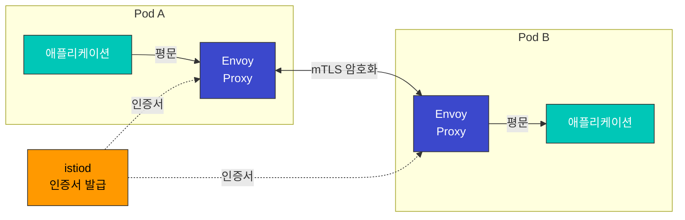

# mTLS

Mutual TLS (mTLS)는 Istio의 핵심 보안 기능으로, 서비스 간 통신을 자동으로 암호화하고 인증합니다.

## 목차

1. [mTLS 개요](#mtls-개요)
2. [mTLS 모드](#mtls-모드)
3. [PeerAuthentication 설정](#peerauthentication-설정)
4. [마이그레이션 전략](#마이그레이션-전략)
5. [문제 해결](#문제-해결)

## mTLS 개요

Istio는 서비스 간 통신에 자동으로 mTLS를 적용하여 Zero Trust 네트워크를 구현합니다.



## mTLS 모드

### STRICT 모드 (권장)

```yaml
apiVersion: security.istio.io/v1
kind: PeerAuthentication
metadata:
  name: default
  namespace: istio-system
spec:
  mtls:
    mode: STRICT  # mTLS만 허용
```

### PERMISSIVE 모드 (마이그레이션용)

```yaml
apiVersion: security.istio.io/v1
kind: PeerAuthentication
metadata:
  name: default
  namespace: default
spec:
  mtls:
    mode: PERMISSIVE  # mTLS와 평문 모두 허용
```

### DISABLE 모드

```yaml
apiVersion: security.istio.io/v1
kind: PeerAuthentication
metadata:
  name: disable-mtls
  namespace: default
spec:
  mtls:
    mode: DISABLE  # mTLS 비활성화
```

## PeerAuthentication 설정

### 전역 설정

```yaml
apiVersion: security.istio.io/v1
kind: PeerAuthentication
metadata:
  name: default
  namespace: istio-system
spec:
  mtls:
    mode: STRICT
```

### 네임스페이스별 설정

```yaml
apiVersion: security.istio.io/v1
kind: PeerAuthentication
metadata:
  name: namespace-policy
  namespace: production
spec:
  mtls:
    mode: STRICT
```

### 워크로드별 설정

```yaml
apiVersion: security.istio.io/v1
kind: PeerAuthentication
metadata:
  name: workload-policy
  namespace: default
spec:
  selector:
    matchLabels:
      app: reviews
      version: v1
  mtls:
    mode: STRICT
```

### 포트별 설정

```yaml
apiVersion: security.istio.io/v1
kind: PeerAuthentication
metadata:
  name: port-policy
  namespace: default
spec:
  selector:
    matchLabels:
      app: myapp
  mtls:
    mode: STRICT
  portLevelMtls:
    8080:
      mode: DISABLE  # 8080 포트는 mTLS 비활성화
```

## 마이그레이션 전략

### 1단계: 현재 상태 확인

```bash
# 현재 mTLS 설정 확인
kubectl get peerauthentication -A

# 서비스별 mTLS 상태 확인
istioctl authn tls-check <pod-name> -n <namespace>
```

### 2단계: PERMISSIVE 모드로 전환

```yaml
apiVersion: security.istio.io/v1
kind: PeerAuthentication
metadata:
  name: default
  namespace: istio-system
spec:
  mtls:
    mode: PERMISSIVE  # mTLS와 평문 모두 허용
```

### 3단계: 모니터링

```bash
# mTLS 연결 확인
kubectl exec -it <pod-name> -c istio-proxy -- \
  curl -s localhost:15000/stats/prometheus | grep ssl

# 평문 연결 확인
kubectl exec -it <pod-name> -c istio-proxy -- \
  curl -s localhost:15000/stats/prometheus | grep plaintext
```

### 4단계: STRICT 모드로 전환

```yaml
apiVersion: security.istio.io/v1
kind: PeerAuthentication
metadata:
  name: default
  namespace: istio-system
spec:
  mtls:
    mode: STRICT  # mTLS만 허용
```

## 문제 해결

### mTLS 연결 실패

```bash
# 1. PeerAuthentication 확인
kubectl get peerauthentication -A

# 2. 인증서 확인
istioctl proxy-config secret <pod-name> -n <namespace>

# 3. TLS 연결 확인
istioctl authn tls-check <source-pod> <dest-service> -n <namespace>

# 4. Envoy 로그 확인
kubectl logs <pod-name> -c istio-proxy -n <namespace> | grep TLS
```

### 인증서 만료

```bash
# 인증서 유효 기간 확인
istioctl proxy-config secret <pod-name> -n <namespace> -o json | \
  jq '.dynamicActiveSecrets[0].secret.tlsCertificate.certificateChain.inlineBytes' | \
  base64 -d | openssl x509 -text -noout
```

## 참고 자료

- [Istio mTLS](https://istio.io/latest/docs/concepts/security/#mutual-tls-authentication)
- [PeerAuthentication Reference](https://istio.io/latest/docs/reference/config/security/peer_authentication/)
