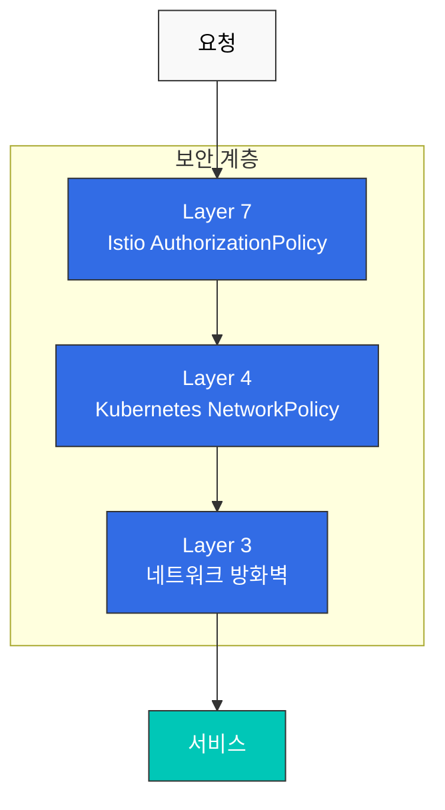

# Network Policy

Istio는 Kubernetes Network Policy와 함께 사용하여 네트워크 보안을 강화할 수 있습니다.

## 목차

1. [Network Policy 개요](#network-policy-개요)
2. [Istio와 Network Policy](#istio와-network-policy)
3. [실전 예제](#실전-예제)
4. [모범 사례](#모범-사례)

## Network Policy 개요



## Istio와 Network Policy

### 기본 Network Policy

```yaml
apiVersion: networking.k8s.io/v1
kind: NetworkPolicy
metadata:
  name: deny-all-ingress
  namespace: default
spec:
  podSelector: {}
  policyTypes:
  - Ingress
  # ingress 규칙 없음 = 모든 ingress 차단
```

### Istio Sidecar 허용

```yaml
apiVersion: networking.k8s.io/v1
kind: NetworkPolicy
metadata:
  name: allow-istio-ingress
  namespace: default
spec:
  podSelector:
    matchLabels:
      app: myapp
  policyTypes:
  - Ingress
  ingress:
  # Istio sidecar에서의 트래픽 허용
  - from:
    - podSelector:
        matchLabels:
          istio: ingressgateway
    ports:
    - protocol: TCP
      port: 8080
```

### 네임스페이스 간 통신

```yaml
apiVersion: networking.k8s.io/v1
kind: NetworkPolicy
metadata:
  name: allow-from-production
  namespace: database
spec:
  podSelector:
    matchLabels:
      app: postgresql
  policyTypes:
  - Ingress
  ingress:
  - from:
    - namespaceSelector:
        matchLabels:
          name: production
    ports:
    - protocol: TCP
      port: 5432
```

## 실전 예제

### Istio + Network Policy 조합

```yaml
# Network Policy: L4 필터링
apiVersion: networking.k8s.io/v1
kind: NetworkPolicy
metadata:
  name: backend-netpol
  namespace: default
spec:
  podSelector:
    matchLabels:
      app: backend
  policyTypes:
  - Ingress
  ingress:
  - from:
    - podSelector:
        matchLabels:
          app: frontend
    ports:
    - protocol: TCP
      port: 8080
---
# Authorization Policy: L7 필터링
apiVersion: security.istio.io/v1
kind: AuthorizationPolicy
metadata:
  name: backend-authz
  namespace: default
spec:
  selector:
    matchLabels:
      app: backend
  action: ALLOW
  rules:
  - from:
    - source:
        principals: ["cluster.local/ns/default/sa/frontend"]
    to:
    - operation:
        methods: ["GET", "POST"]
        paths: ["/api/*"]
```

## 참고 자료

- [Kubernetes Network Policy](https://kubernetes.io/docs/concepts/services-networking/network-policies/)
- [Istio Security Best Practices](https://istio.io/latest/docs/ops/best-practices/security/)
