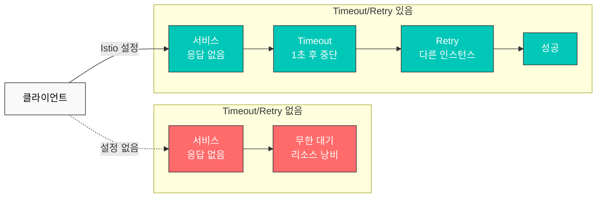

# Retry 및 Timeout

Retry와 Timeout은 마이크로서비스의 복원력을 높이는 핵심 메커니즘입니다. Istio를 사용하면 애플리케이션 코드 변경 없이 이러한 정책을 설정할 수 있습니다.

## 목차

1. [개요](#개요)
2. [Timeout 설정](#timeout-설정)
3. [Retry 설정](#retry-설정)
4. [Retry와 Timeout 조합](#retry와-timeout-조합)
5. [실전 예제](#실전-예제)
6. [모범 사례](#모범-사례)
7. [문제 해결](#문제-해결)

## 개요

### Timeout과 Retry의 필요성



## Timeout 설정

### 기본 Timeout

```yaml
apiVersion: networking.istio.io/v1
kind: VirtualService
metadata:
  name: reviews-timeout
spec:
  hosts:
  - reviews
  http:
  - route:
    - destination:
        host: reviews
    timeout: 10s  # 10초 후 타임아웃
```

### 경로별 Timeout

```yaml
apiVersion: networking.istio.io/v1
kind: VirtualService
metadata:
  name: api-timeouts
spec:
  hosts:
  - api.example.com
  http:
  # 빠른 응답이 필요한 API - 짧은 timeout
  - match:
    - uri:
        prefix: "/api/quick"
    route:
    - destination:
        host: api-service
    timeout: 1s
  
  # 일반 API
  - match:
    - uri:
        prefix: "/api/standard"
    route:
    - destination:
        host: api-service
    timeout: 5s
  
  # 무거운 작업 - 긴 timeout
  - match:
    - uri:
        prefix: "/api/batch"
    route:
    - destination:
        host: api-service
    timeout: 30s
```

## Retry 설정

### 기본 Retry

```yaml
apiVersion: networking.istio.io/v1
kind: VirtualService
metadata:
  name: reviews-retry
spec:
  hosts:
  - reviews
  http:
  - route:
    - destination:
        host: reviews
    retries:
      attempts: 3  # 최대 3번 재시도
      perTryTimeout: 2s  # 각 시도마다 2초 timeout
      retryOn: 5xx,reset,connect-failure,refused-stream  # 재시도 조건
```

### Retry 조건

| 조건 | 설명 |
|------|------|
| `5xx` | HTTP 5xx 에러 |
| `gateway-error` | 502, 503, 504 에러 |
| `reset` | 연결 리셋 |
| `connect-failure` | 연결 실패 |
| `refused-stream` | HTTP/2 REFUSED_STREAM |
| `retriable-4xx` | 409 Conflict |
| `retriable-status-codes` | 사용자 정의 상태 코드 |

### 고급 Retry 설정

```yaml
apiVersion: networking.istio.io/v1
kind: VirtualService
metadata:
  name: advanced-retry
spec:
  hosts:
  - payment-service
  http:
  - route:
    - destination:
        host: payment-service
    retries:
      attempts: 5
      perTryTimeout: 3s
      retryOn: 5xx,reset,connect-failure
      retryRemoteLocalities: true  # 다른 지역으로도 재시도
```

## Retry와 Timeout 조합

### 계층별 Timeout

```yaml
apiVersion: networking.istio.io/v1
kind: VirtualService
metadata:
  name: layered-timeouts
spec:
  hosts:
  - frontend
  http:
  - route:
    - destination:
        host: frontend
    timeout: 10s  # 전체 timeout
    retries:
      attempts: 3
      perTryTimeout: 3s  # 각 재시도 timeout
```

**계산**: 최대 대기 시간 = min(전체 timeout, attempts × perTryTimeout) = min(10s, 3 × 3s) = 9s

### 멱등성 보장이 필요한 경우

```yaml
apiVersion: networking.istio.io/v1
kind: VirtualService
metadata:
  name: idempotent-retry
spec:
  hosts:
  - order-service
  http:
  # GET 요청 - 안전하게 재시도 가능
  - match:
    - method:
        exact: GET
    route:
    - destination:
        host: order-service
    timeout: 5s
    retries:
      attempts: 3
      perTryTimeout: 1s
      retryOn: 5xx,reset
  
  # POST 요청 - 재시도 제한적
  - match:
    - method:
        exact: POST
    route:
    - destination:
        host: order-service
    timeout: 10s
    retries:
      attempts: 1  # 멱등성 보장 안 되면 재시도 최소화
      perTryTimeout: 5s
      retryOn: connect-failure,reset  # 네트워크 문제만 재시도
```

## 실전 예제

### 예제 1: 마이크로서비스 체인

```yaml
# Frontend → Backend → Database
apiVersion: networking.istio.io/v1
kind: VirtualService
metadata:
  name: frontend
spec:
  hosts:
  - frontend
  http:
  - route:
    - destination:
        host: frontend
    timeout: 15s  # 전체 체인 고려
    retries:
      attempts: 2
      perTryTimeout: 7s
---
apiVersion: networking.istio.io/v1
kind: VirtualService
metadata:
  name: backend
spec:
  hosts:
  - backend
  http:
  - route:
    - destination:
        host: backend
    timeout: 10s  # Database 호출 고려
    retries:
      attempts: 3
      perTryTimeout: 3s
      retryOn: 5xx,reset
---
apiVersion: networking.istio.io/v1
kind: VirtualService
metadata:
  name: database
spec:
  hosts:
  - database
  http:
  - route:
    - destination:
        host: database
    timeout: 5s
    retries:
      attempts: 2
      perTryTimeout: 2s
      retryOn: connect-failure,refused-stream
```

### 예제 2: 외부 API 호출

```yaml
apiVersion: networking.istio.io/v1
kind: VirtualService
metadata:
  name: external-api
spec:
  hosts:
  - api.external.com
  http:
  - route:
    - destination:
        host: api.external.com
    timeout: 30s  # 외부 API는 느릴 수 있음
    retries:
      attempts: 5  # 외부 API는 일시적 실패 많음
      perTryTimeout: 5s
      retryOn: 5xx,reset,connect-failure,gateway-error
---
apiVersion: networking.istio.io/v1
kind: ServiceEntry
metadata:
  name: external-api
spec:
  hosts:
  - api.external.com
  ports:
  - number: 443
    name: https
    protocol: HTTPS
  location: MESH_EXTERNAL
  resolution: DNS
```

### 예제 3: Circuit Breaker와 함께 사용

```yaml
apiVersion: networking.istio.io/v1
kind: VirtualService
metadata:
  name: resilient-service
spec:
  hosts:
  - payment
  http:
  - route:
    - destination:
        host: payment
    timeout: 10s
    retries:
      attempts: 3
      perTryTimeout: 3s
      retryOn: 5xx,reset,connect-failure
---
apiVersion: networking.istio.io/v1
kind: DestinationRule
metadata:
  name: payment-circuit-breaker
spec:
  host: payment
  trafficPolicy:
    connectionPool:
      tcp:
        maxConnections: 100
      http:
        http1MaxPendingRequests: 50
        maxRequestsPerConnection: 2
    outlierDetection:
      consecutiveErrors: 5
      interval: 30s
      baseEjectionTime: 30s
      maxEjectionPercent: 50
```

## 모범 사례

### 1. Timeout 설정 가이드

```yaml
# ✅ 좋은 예: 계층별 적절한 timeout
# Frontend: 15s
# API Gateway: 10s
# Backend Service: 5s
# Database: 3s

apiVersion: networking.istio.io/v1
kind: VirtualService
metadata:
  name: api-gateway
spec:
  hosts:
  - api-gateway
  http:
  - route:
    - destination:
        host: api-gateway
    timeout: 10s
    retries:
      attempts: 2
      perTryTimeout: 4s
```

```yaml
# ❌ 나쁜 예: 너무 긴 timeout
apiVersion: networking.istio.io/v1
kind: VirtualService
metadata:
  name: api-gateway
spec:
  hosts:
  - api-gateway
  http:
  - route:
    - destination:
        host: api-gateway
    timeout: 300s  # 5분은 너무 김
```

### 2. Retry 전략

```yaml
# ✅ 좋은 예: 멱등성 고려
apiVersion: networking.istio.io/v1
kind: VirtualService
metadata:
  name: api-service
spec:
  hosts:
  - api-service
  http:
  # GET - 안전하게 재시도
  - match:
    - method:
        exact: GET
    route:
    - destination:
        host: api-service
    retries:
      attempts: 3
      perTryTimeout: 2s
      retryOn: 5xx,reset,connect-failure
  
  # POST - 신중하게 재시도
  - match:
    - method:
        exact: POST
    route:
    - destination:
        host: api-service
    retries:
      attempts: 1
      perTryTimeout: 5s
      retryOn: connect-failure  # 네트워크 문제만
```

### 3. 지수 백오프 (Exponential Backoff)

Istio는 기본적으로 25ms 간격으로 재시도하지만, 커스텀 백오프가 필요한 경우:

```yaml
apiVersion: networking.istio.io/v1
kind: VirtualService
metadata:
  name: backoff-retry
spec:
  hosts:
  - payment
  http:
  - route:
    - destination:
        host: payment
    retries:
      attempts: 5
      perTryTimeout: 2s
      retryOn: 5xx,reset
      # Istio는 자동으로 재시도 간격 증가
      # 25ms, 50ms, 100ms, 200ms, 400ms
```

### 4. 전체 시스템 Timeout 계산

```yaml
# Frontend → API Gateway → Backend → Database
# Frontend: 20s
# API Gateway: 15s (Frontend보다 작아야 함)
# Backend: 10s (API Gateway보다 작아야 함)
# Database: 5s (Backend보다 작아야 함)

# 각 레이어는 하위 레이어 timeout + overhead를 고려
```

## 문제 해결

### Timeout이 작동하지 않음

```bash
# 1. VirtualService 확인
kubectl get virtualservice -n <namespace>
kubectl describe virtualservice <name> -n <namespace>

# 2. Envoy 구성 확인
istioctl proxy-config routes <pod-name> -n <namespace> -o json | grep timeout

# 3. 실제 timeout 테스트
kubectl exec -it <pod-name> -n <namespace> -c istio-proxy -- \
  curl -v --max-time 5 http://backend-service
```

### Retry가 너무 많이 발생

```bash
# Retry 메트릭 확인
kubectl exec -n <namespace> <pod-name> -c istio-proxy -- \
  curl -s localhost:15000/stats/prometheus | grep retry

# 특정 서비스로의 retry 확인
istio_requests_total{destination_service="backend.default.svc.cluster.local",response_flags="UR"}
```

### Retry Storm 방지

```yaml
# Circuit Breaker와 함께 사용
apiVersion: networking.istio.io/v1
kind: DestinationRule
metadata:
  name: prevent-retry-storm
spec:
  host: backend
  trafficPolicy:
    connectionPool:
      tcp:
        maxConnections: 100
      http:
        http1MaxPendingRequests: 10  # 대기 요청 제한
        http2MaxRequests: 100
        maxRequestsPerConnection: 1
    outlierDetection:
      consecutiveErrors: 3  # 빠른 차단
      interval: 10s
      baseEjectionTime: 30s
```

## 참고 자료

- [Istio Timeout](https://istio.io/latest/docs/reference/config/networking/virtual-service/#HTTPRoute)
- [Istio Retry](https://istio.io/latest/docs/reference/config/networking/virtual-service/#HTTPRetry)
- [Envoy Retry Policy](https://www.envoyproxy.io/docs/envoy/latest/configuration/http/http_filters/router_filter#config-http-filters-router-x-envoy-retry-on)
