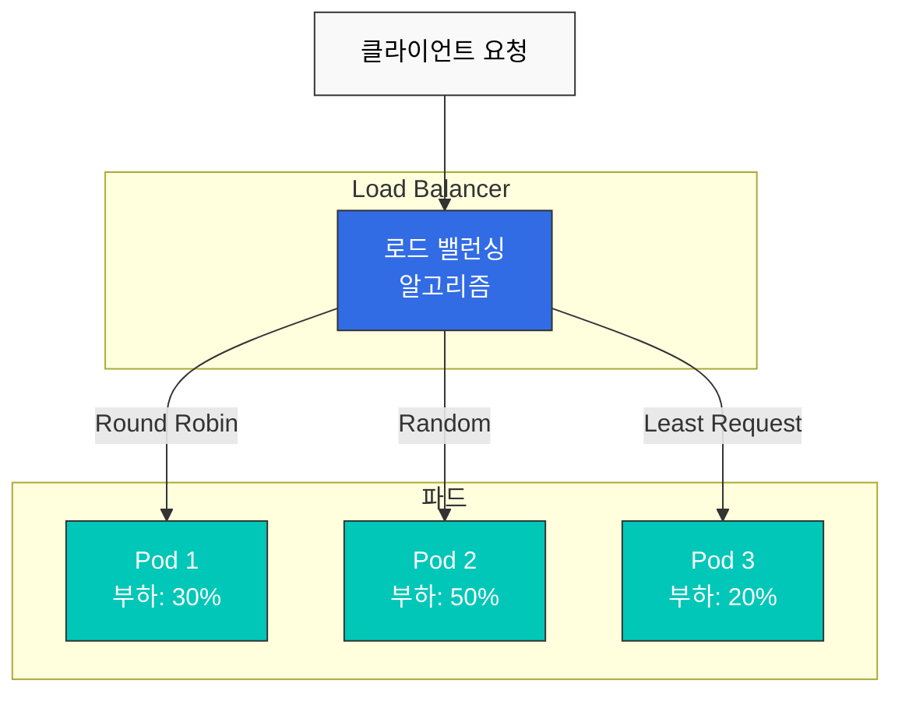

# 로드 밸런싱

Istio는 Envoy를 통해 다양한 로드 밸런싱 알고리즘을 제공하여 트래픽을 효율적으로 분산시킵니다.

## 목차

1. [로드 밸런싱 개요](#로드-밸런싱-개요)
2. [로드 밸런싱 알고리즘](#로드-밸런싱-알고리즘)
3. [Locality 기반 로드 밸런싱](#locality-기반-로드-밸런싱)
4. [Session Affinity](#session-affinity)
5. [실전 예제](#실전-예제)
6. [모범 사례](#모범-사례)

## 로드 밸런싱 개요



## 로드 밸런싱 알고리즘

### Round Robin (기본값)

```yaml
apiVersion: networking.istio.io/v1
kind: DestinationRule
metadata:
  name: reviews-round-robin
spec:
  host: reviews
  trafficPolicy:
    loadBalancer:
      simple: ROUND_ROBIN
```

### Least Request

```yaml
apiVersion: networking.istio.io/v1
kind: DestinationRule
metadata:
  name: reviews-least-request
spec:
  host: reviews
  trafficPolicy:
    loadBalancer:
      simple: LEAST_REQUEST
```

### Random

```yaml
apiVersion: networking.istio.io/v1
kind: DestinationRule
metadata:
  name: reviews-random
spec:
  host: reviews
  trafficPolicy:
    loadBalancer:
      simple: RANDOM
```

### Consistent Hash

```yaml
apiVersion: networking.istio.io/v1
kind: DestinationRule
metadata:
  name: reviews-consistent-hash
spec:
  host: reviews
  trafficPolicy:
    loadBalancer:
      consistentHash:
        httpHeaderName: "x-user-id"
```

## Locality 기반 로드 밸런싱

```yaml
apiVersion: networking.istio.io/v1
kind: DestinationRule
metadata:
  name: locality-lb
spec:
  host: reviews
  trafficPolicy:
    loadBalancer:
      localityLbSetting:
        enabled: true
        distribute:
        - from: us-west/zone-1/*
          to:
            "us-west/zone-1/*": 80
            "us-west/zone-2/*": 20
```

## 참고 자료

- [Istio Load Balancing](https://istio.io/latest/docs/reference/config/networking/destination-rule/#LoadBalancerSettings)
