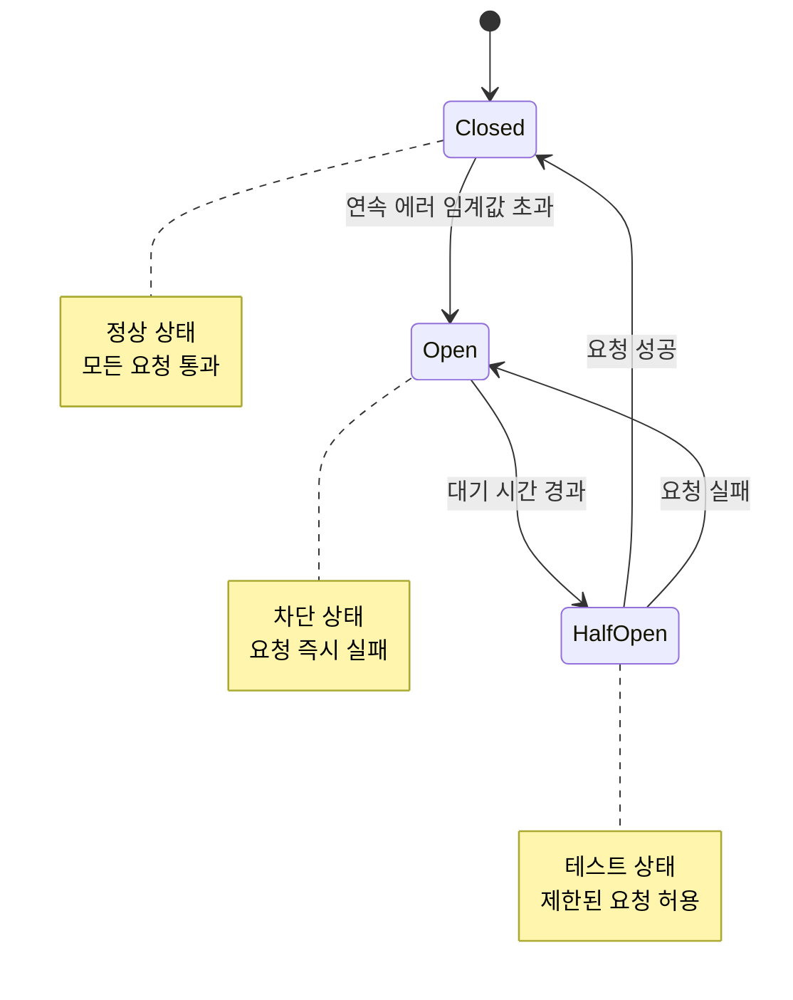

# Circuit Breaker

Circuit Breaker는 장애가 발생한 서비스를 자동으로 격리하여 연쇄 장애를 방지합니다.

## 목차

1. [Circuit Breaker 개요](#circuit-breaker-개요)
2. [Connection Pool 설정](#connection-pool-설정)
3. [Outlier Detection](#outlier-detection)
4. [실전 예제](#실전-예제)
5. [모범 사례](#모범-사례)

## Circuit Breaker 개요



## Connection Pool 설정

```yaml
apiVersion: networking.istio.io/v1
kind: DestinationRule
metadata:
  name: reviews-circuit-breaker
spec:
  host: reviews
  trafficPolicy:
    connectionPool:
      tcp:
        maxConnections: 100
      http:
        http1MaxPendingRequests: 50
        http2MaxRequests: 100
        maxRequestsPerConnection: 2
```

## Outlier Detection

```yaml
apiVersion: networking.istio.io/v1
kind: DestinationRule
metadata:
  name: reviews-outlier
spec:
  host: reviews
  trafficPolicy:
    outlierDetection:
      consecutiveErrors: 5
      interval: 30s
      baseEjectionTime: 30s
      maxEjectionPercent: 50
```

## 참고 자료

- [Istio Circuit Breaker](https://istio.io/latest/docs/tasks/traffic-management/circuit-breaking/)
