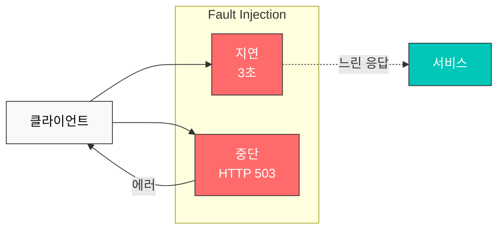

# Fault Injection

Fault Injection은 시스템의 복원력을 테스트하기 위해 의도적으로 장애를 주입하는 기법입니다.

## 목차

1. [Fault Injection 개요](#fault-injection-개요)
2. [Delay 주입](#delay-주입)
3. [Abort 주입](#abort-주입)
4. [실전 예제](#실전-예제)
5. [모범 사례](#모범-사례)

## Fault Injection 개요



## Delay 주입

```yaml
apiVersion: networking.istio.io/v1beta1
kind: VirtualService
metadata:
  name: reviews-delay
spec:
  hosts:
  - reviews
  http:
  - fault:
      delay:
        percentage:
          value: 10.0  # 10%의 요청에 지연 주입
        fixedDelay: 5s  # 5초 지연
    route:
    - destination:
        host: reviews
```

## Abort 주입

```yaml
apiVersion: networking.istio.io/v1beta1
kind: VirtualService
metadata:
  name: reviews-abort
spec:
  hosts:
  - reviews
  http:
  - fault:
      abort:
        percentage:
          value: 10.0  # 10%의 요청 중단
        httpStatus: 503  # HTTP 503 에러 반환
    route:
    - destination:
        host: reviews
```

## 참고 자료

- [Istio Fault Injection](https://istio.io/latest/docs/tasks/traffic-management/fault-injection/)
